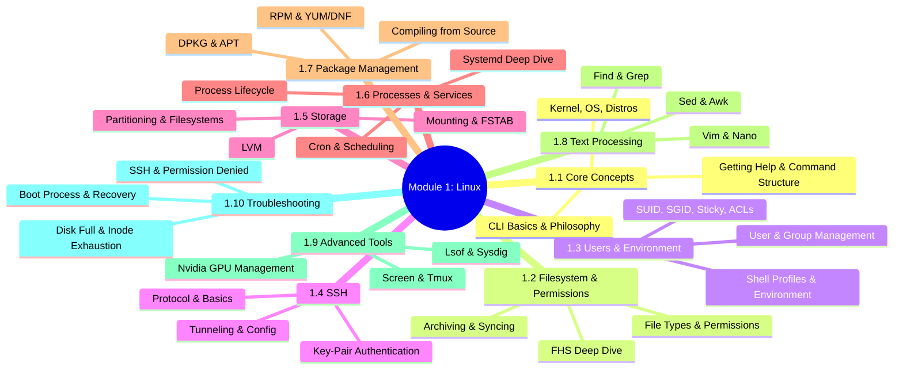
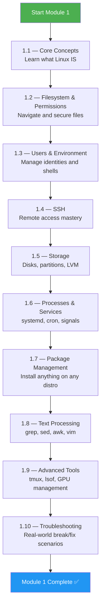
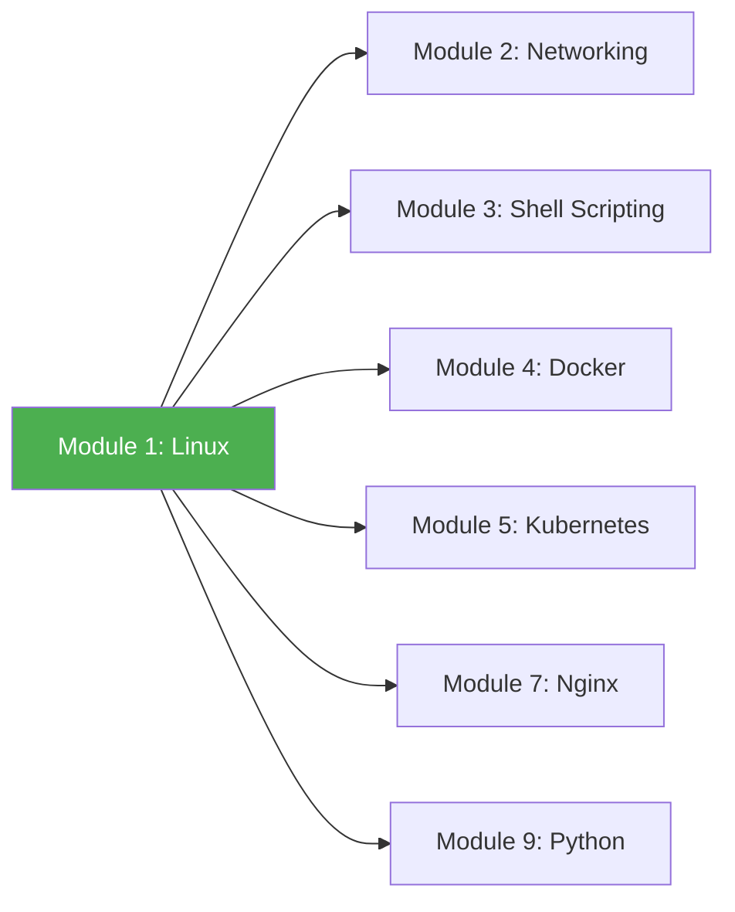

# Module 1 Approach Guide — Linux Fundamentals

## Module Overview

---

## Who Is This Module For?

This is the **foundation module** of the entire course. Every DevOps/Platform Engineering tool sits on top of Linux. Whether you're debugging a crashed pod, tuning a CI runner, or setting up an Nginx reverse proxy — Linux knowledge is non-negotiable.

**Target audience:**
- Complete beginners transitioning into DevOps/Platform Engineering
- Developers who use Linux casually but lack deep system understanding
- Anyone preparing for LFCS, RHCSA, or CKA exams

---

## Prerequisites

| Prerequisite | Required? | Notes |
|---|---|---|
| Access to a Linux machine (VM, WSL2, cloud instance) | **Yes** | Ubuntu 22.04+ or RHEL 9+ recommended |
| Basic keyboard/terminal familiarity | **Yes** | You should be able to open a terminal |
| Programming experience | No | Helpful but not required |
| Networking knowledge | No | Covered in Module 2 |

> **Tip:** If you don't have a Linux machine, use [Multipass](https://multipass.run/) or spin up a free-tier EC2 instance on AWS. WSL2 on Windows also works for most exercises.

---

## How to Approach This Module

### Study Strategy

1. **Read each note sequentially** — Subchapters build on each other. Don't skip ahead.
2. **Type every command yourself** — Never copy-paste. Muscle memory matters.
3. **Do the subchapter review before moving on** — If you score below 80%, re-read.
4. **Build a cheatsheet as you go** — Write down commands that surprise you.
5. **Break things on purpose** — Delete a file, kill a process, fill a disk. Learn to recover.

### Key Principles

- **Subchapters 1.1–1.3** are theory-heavy — understand the "why" deeply
- **Subchapters 1.4–1.7** are hands-on — practice on a real machine
- **Subchapters 1.8–1.9** are skill-based — speed comes with repetition
- **Subchapter 1.10** is the capstone — if you can troubleshoot, you understand Linux

---

## Time Estimates

| Subchapter | Reading | Practice | Total |
|---|---|---|---|
| 1.1 Core Concepts | 1.5 hrs | 1 hr | **2.5 hrs** |
| 1.2 Filesystem & Permissions | 2 hrs | 2 hrs | **4 hrs** |
| 1.3 Users & Environment | 1.5 hrs | 1.5 hrs | **3 hrs** |
| 1.4 SSH | 2 hrs | 2 hrs | **4 hrs** |
| 1.5 Storage | 2 hrs | 2.5 hrs | **4.5 hrs** |
| 1.6 Processes & Services | 2 hrs | 2 hrs | **4 hrs** |
| 1.7 Package Management | 1.5 hrs | 1.5 hrs | **3 hrs** |
| 1.8 Text Processing | 2 hrs | 3 hrs | **5 hrs** |
| 1.9 Advanced Tools | 1.5 hrs | 1.5 hrs | **3 hrs** |
| 1.10 Troubleshooting + Final | 2 hrs | 3 hrs | **5 hrs** |
| **Total** | **18 hrs** | **20 hrs** | **~38 hrs** |

> **Realistic timeline:** 2–3 weeks at 2–3 hours/day. Don't rush. Linux mastery is the single most reusable skill in DevOps.

---

## Practice Lab Ideas

| Lab | Covers Subchapters | Difficulty |
|---|---|---|
| Set up a fresh Ubuntu VM, create 3 users with different permissions, configure SSH key access for each | 1.1, 1.2, 1.3, 1.4 | ⭐⭐ |
| Partition a second disk, create an LVM volume group, mount it persistently via fstab | 1.5 | ⭐⭐⭐ |
| Write a systemd unit file that runs a health-check script every 5 minutes | 1.6 | ⭐⭐⭐ |
| Parse a 1GB access log using grep, sed, and awk to find the top 10 IPs | 1.8 | ⭐⭐⭐ |
| Simulate a full `/var` partition and recover without rebooting | 1.10 | ⭐⭐⭐⭐ |
| Set up SSH tunneling to access a PostgreSQL database behind a bastion host | 1.4 | ⭐⭐⭐⭐ |

---

## What Success Looks Like

By the end of Module 1, you should be able to:

- [ ] Navigate any Linux filesystem blindfolded
- [ ] Explain the boot process from BIOS to login prompt
- [ ] Manage users, groups, and permissions without Googling
- [ ] SSH into remote machines using keys, config files, and tunnels
- [ ] Create, extend, and resize LVM volumes
- [ ] Write systemd unit files and manage services
- [ ] Install packages from repos and compile from source
- [ ] Use grep, sed, and awk to process text at speed
- [ ] Troubleshoot a broken system methodically

---

## Connection to Other Modules

**Module 1 is the foundation for everything.** Networking (Module 2) uses Linux tools. Shell scripting (Module 3) automates Linux commands. Docker (Module 4) uses Linux namespaces and cgroups. Kubernetes (Module 5) runs on Linux nodes. Nginx (Module 7) is a Linux service. Python scripts (Module 9) use `subprocess` to call Linux commands.

> **Next module:** [Module 2 — Networking](../2-Networking/Module_2_Approach_Guide.md)
