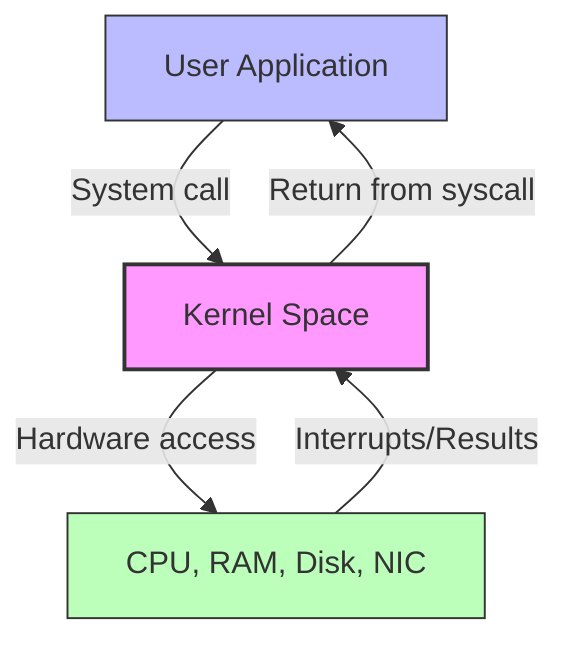

## 1.1.1 Kernel, Operating System, and Distributions

#### The Big Picture: What is an Operating System?

An **Operating System (OS)** is the master conductor between your hardware (CPU, RAM, disk, network) and the software applications you run (web browsers, databases, games). Without an OS, every program would need to directly manage hardware – a chaotic and impractical nightmare.

Linux is one family of operating systems. Others include Windows (NT kernel) and macOS (XNU kernel). Linux specifically refers to the **kernel** – the core of the OS – but people commonly say “Linux” to mean the entire OS.

#### The Linux Kernel: The Heart of the Machine

The **kernel** is a privileged piece of software that loads first (after the bootloader) and stays in memory. It provides:

* **Process scheduling** – which program gets CPU time and for how long.

* **Memory management** – virtual memory, paging, mapping addresses to physical RAM.

* **Device drivers** – talking to disks, network cards, keyboards, GPUs.

* **System calls** – a controlled API that programs use to request kernel services (open a file, send a network packet, spawn a process).

**User space vs Kernel space**

Processors have protection rings. The kernel runs in **ring 0** (most privileged, can execute any CPU instruction, access any memory address). User applications run in **ring 3** (restricted). When a user program needs to do something privileged – like write to disk – it makes a **system call** (e.g., `write()`), and the CPU temporarily switches to kernel mode, executes the request, then returns.



**Monolithic kernel design** – Linux uses a monolithic kernel, meaning all core services (scheduling, memory, filesystem, drivers) run in a single address space inside kernel mode. This is fast but risky (a buggy driver can crash the whole system). Microkernels (like QNX) run minimal core in kernel and move drivers to user space – slower but more fault tolerant. Linux balances this with **loadable kernel modules** (LKMs), which allow drivers to be loaded/unloaded dynamically without recompiling the kernel.

#### Linux Distributions: The Complete Package

The kernel alone is useless without user‑space tools: a shell, standard libraries (glibc), utilities (`ls`, `cp`), package managers, init systems, etc. A **distribution** (distro) assembles these components into a coherent, installable, and updatable OS.

**Two major families dominate the enterprise and cloud world:**

| Family                              | Package Format | Package Manager   | Examples                                                         | Typical Use Case                                                                   |
| ----------------------------------- | -------------- | ----------------- | ---------------------------------------------------------------- | ---------------------------------------------------------------------------------- |
| **RHEL (Red Hat Enterprise Linux)** | `.rpm`         | `yum` / `dnf`     | RHEL, CentOS (legacy), Rocky Linux, AlmaLinux, Fedora (upstream) | Enterprise servers, production stability, long support cycles                      |
| **Debian**                          | `.deb`         | `apt` / `apt-get` | Debian, Ubuntu, Linux Mint, Pop!\_OS                             | General purpose, developer workstations, cloud images (Ubuntu dominates AWS/Azure) |

**Why choose one over the other?**

* **RHEL family** – strict versioning, backported security fixes (kernel version stays same but patches applied), certified for many enterprise software (Oracle DB, SAP).

* **Debian family** – more frequent updates, larger package repository, slightly more “bleeding edge” (especially Ubuntu non‑LTS).

For platform engineering, you will encounter both. Ubuntu is common for Kubernetes nodes; RHEL/Rocky is common for on‑premise infrastructure.

#### How to Identify Your Running Distro and Kernel

Always start by understanding the environment you are troubleshooting.

```bash
# Kernel version and architecture
uname -a
# Example output: Linux myhost 5.15.0-91-generic #101-Ubuntu SMP x86_64 x86_64 x86_64 GNU/Linux

# Distribution information (modern systems)
cat /etc/os-release
# Example snippet: ID=ubuntu, VERSION_ID="22.04"

# Older method (still common)
cat /etc/redhat-release   # On RHEL/CentOS/Rocky
cat /etc/debian_version   # On Debian/Ubuntu
```

**Explanation of** **`uname -a`:**

* `Linux` – kernel name

* `myhost` – hostname

* `5.15.0-91-generic` – kernel release (major.minor.patch-extra)

* `#101-Ubuntu SMP` – build number and distro specific info

* `x86_64` – hardware architecture

* `GNU/Linux` – OS type

#### Quick Task: Discover Your Environment

*If you have access to a Linux terminal (VM, WSL, or bare metal), run the following commands and record the output. If not, simulate by writing what you would expect to see on a typical Ubuntu 22.04 LTS server.*

1. Determine your kernel version and whether it is a generic or server kernel.
2. Find out which distribution ID and version you are running.
3. Check if your kernel supports loadable modules by listing loaded modules with `lsmod | head -5`.

> **Ready Solution (Example from Ubuntu 22.04 LTS):**
>
> ```bash
> # Task 1
> uname -r
> # Output: 5.15.0-91-generic
>
> # Task 2
> cat /etc/os-release | grep -E "ID|VERSION_ID"
> # Output:
> # ID=ubuntu
> # VERSION_ID="22.04"
>
> # Task 3
> lsmod | head -5
> # Output (truncated):
> # Module                  Size  Used by
> # nvidia_uvm           1449984  0
> # nvidia_drm             77824  0
> # nvidia_modeset       1236992  0
> # nvidia              56643584  44 nvidia_uvm,nvidia_modeset
> ```
>
> If `lsmod` shows modules (and not “not found”), your kernel supports modules – which is virtually always the case on production Linux.

#### Why This Matters for Platform Engineering

As a platform engineer, you will:

* Build base images for containers and virtual machines – you must choose a distro and kernel version that matches your security and compatibility requirements.

* Debug performance issues – knowledge of kernel parameters (`sysctl`) and user‑space tools.

* Write automation that works across RHEL and Debian families (package installation commands differ: `yum install` vs `apt install`).

**Backward reference (to be used later in this module):**\
In Subchapter 1.7 (Package Management), we will revisit the differences between `yum` and `apt` with concrete workflows. For now, just know they exist.

#### Summary

* The **kernel** is the privileged core of the OS; user applications talk to it via system calls.

* Linux uses a **monolithic kernel** with loadable modules for flexibility.

* A **distribution** adds user‑space tools and a package manager – RHEL (`.rpm`/`dnf`) and Debian (`.deb`/`apt`) are the two dominant families.

* Always check `uname -r` and `/etc/os-release` before performing any distro‑specific operation.

Next note (1.1.2) will introduce the CLI basics and the “everything is a file” philosophy.
