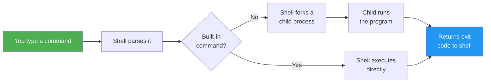

### 1.1.2 CLI Basics and the "Everything is a File" Philosophy

#### The Shell: Your Interface to the Kernel

The **shell** is a command-line interpreter that reads your typed commands, parses them, and executes the corresponding programs – often making system calls to the kernel. The most common shell on Linux is **bash** (Bourne Again SHell), but others include `zsh`, `fish`, and `sh` (the POSIX standard).

When you open a terminal emulator (like GNOME Terminal, iTerm2, or Windows Terminal with WSL), the terminal launches a shell process. You see a **prompt** – typically ending with `$` for a normal user or `#` for root.

```bash
# Typical user prompt
user@hostname:~$

# Typical root prompt (dangerous – be careful)
root@hostname:/#
```

**Anatomy of a prompt:**\
`username@hostname:current_directory$` – The `~` (tilde) is shorthand for your home directory (`/home/username`).


### How the Shell Works



#### The Linux Philosophy: Small, Sharp Tools

Four principles from the early Unix days that Linux inherited:

1. **Everything is a file** – Devices, directories, processes, even network sockets are represented as files in the filesystem. This means you can use standard tools (`cat`, `echo`, `grep`) on them.
2. **Small, composable programs** – Each tool does one thing well. Combine them with pipes (`|`) to perform complex tasks.
3. **Text is the universal interface** – Most configuration and output is plain text, easily parsed.
4. **Avoid captive user interfaces** – Prefer command-line flags over interactive menus (easier to script).

**Example of composition:** Count how many unique IP addresses are in an Apache access log.

```bash
cat access.log | awk '{print $1}' | sort | uniq | wc -l
```

* `cat` reads the file

* `awk` extracts the first field (IP address)

* `sort` sorts them

* `uniq` collapses duplicates

* `wc -l` counts lines

You will learn `awk`, `sort`, and `uniq` in Subchapter 1.8. For now, just see the pipeline concept.

> **Tip:** Read pipelines **left to right as a data flow**. When debugging, run each stage separately before combining them into a single command.

#### Essential Commands You Must Memorize

These are the "alphabet" of Linux CLI. Practice them until automatic.

| Command         | Typical Use                                | Example                                                                         |
| --------------- | ------------------------------------------ | ------------------------------------------------------------------------------- |
| `ls`            | List directory contents                    | `ls -la /var/log` (long format, all files)                                      |
| `cd`            | Change directory                           | `cd /etc/nginx`                                                                 |
| `pwd`           | Print working directory (where am I?)      | `pwd`                                                                           |
| `mkdir`         | Create directory                           | `mkdir -p project/src/main` (creates parent directories if missing)             |
| `rmdir`         | Remove empty directory                     | `rmdir old_dir`                                                                 |
| `rm`            | Remove files or directories                | `rm -rf temp_folder` (**dangerous** – deletes recursively without confirmation) |
| `cp`            | Copy files/directories                     | `cp -r source_dir destination_dir`                                              |
| `mv`            | Move or rename                             | `mv oldname.txt newname.txt`                                                    |
| `touch`         | Create empty file or update timestamp      | `touch newfile.txt`                                                             |
| `cat`           | Concatenate and display file content       | `cat /etc/hostname`                                                             |
| `less`          | View file page by page (press `q` to quit) | `less /var/log/syslog`                                                          |
| `head` / `tail` | Show first/last lines of a file            | `tail -f /var/log/nginx/access.log` (follow new lines)                          |
| `echo`          | Print text to standard output              | `echo "Hello, world"`                                                           |
| `man`           | Display manual page                        | `man ls`                                                                        |

**Important flags to remember:**

* `ls -l` shows permissions, ownership, size, modification date.

* `ls -a` shows hidden files (starting with dot, like `.bashrc`).

* `rm -i` asks for confirmation before each deletion – safer for beginners.

* `cp -i` asks before overwriting.

* `tail -n 20` shows last 20 lines (default is 10).

#### Understanding File Paths

* **Absolute path** – Starts from root `/` (e.g., `/home/user/file.txt`). Works from anywhere.

* **Relative path** – Relative to your current working directory (e.g., `docs/readme.md`).

  * `.` means current directory

  * `..` means parent directory

  * `~` means home directory

```bash
cd /var/log         # absolute
cd ../etc           # relative – go up one level then into etc
cd ~/Documents      # relative to home
```

#### The "Everything is a File" in Practice

Let's verify this philosophy with three examples.

**Example 1: Devices as files**\
Your first hard drive is represented as `/dev/sda`. You can read raw data from it (dangerous unless you know what you're doing):

```bash
sudo dd if=/dev/sda of=/dev/null bs=1M count=10
```

**Example 2: Process information**\
Each running process has a directory under `/proc/` with its PID. Inside, you find virtual files showing memory maps, command line, environment, etc.

```bash
# Show command line of process with PID 1 (init/systemd)
cat /proc/1/cmdline

# Show environment variables of your own shell
cat /proc/$$/environ | tr '\0' '\n'   # $$ is current shell's PID
```

**Example 3: Random number generator**\
`/dev/urandom` is a special file that produces random bytes when read.

```bash
# Generate a random 32-character password
cat /dev/urandom | tr -dc 'A-Za-z0-9' | head -c 32; echo
```

**Example 4: Discarding output with `/dev/null`**\
`/dev/null` is a special file that discards all data written to it. Useful for silencing unwanted output.

```bash
# Run command and discard stdout
command > /dev/null

# Discard both stdout and stderr
command > /dev/null 2>&1
# Or using bash shortcut
command &> /dev/null

> **Caution:** Silencing both stdout and stderr is convenient, but it also hides useful failure details. During debugging, redirect stderr to a file instead of discarding it.
```

Because everything is a file, you can use the same tools (`cat`, `head`, `tail`, `grep`) on these "virtual" files.

#### Standard Streams: stdin, stdout, stderr

Every Linux command has three standard streams:

| Stream | File Descriptor | Default Destination            | Symbol                          | <br />          |
| ------ | --------------- | ------------------------------ | ------------------------------- | :-------------- |
| stdin  | 0               | Keyboard                       | `<` or \`                       | \` (pipe input) |
| stdout | 1               | Terminal screen                | `>` (redirect) or `>>` (append) | <br />          |
| stderr | 2               | Terminal screen (but separate) | `2>`                            | <br />          |

**Redirection examples:**

```bash
# Redirect stdout to a file (overwrites)
echo "Hello" > output.txt

# Append stdout
echo "World" >> output.txt

# Redirect stderr to a file
ls /nonexistent 2> error.log

# Redirect both stdout and stderr to same file
ls /etc /nonexistent &> all_output.txt

# Discard output (send to /dev/null)
rm -rf temp_dir 2>/dev/null
```

**Pipes (`|`)** connect stdout of one command to stdin of another.

```bash
# List files, filter for "log", count lines
ls -la /var/log | grep ".log$" | wc -l
```

#### Stopping Commands: Ctrl+C and Signals

When a command runs too long or you want to cancel it, press **Ctrl+C**. This sends the **SIGINT** (Signal Interrupt) to the foreground process, causing it to terminate.

```bash
# Start a long-running command
ping google.com
# Press Ctrl+C to stop it

# Follow a log file
tail -f /var/log/syslog
# Press Ctrl+C to exit follow mode
```

Other useful keyboard signals:
- **Ctrl+C** – SIGINT (interrupt/terminate)
- **Ctrl+Z** – SIGTSTP (suspend to background; resume with `fg` or `bg` – covered in [1.6.1 Process Lifecycle](../Subchapter_1.6/1.6.1_Process_Lifecycle_and_Tools.md))
- **Ctrl+D** – EOF (end of input; closes interactive shells)

#### Quick Task: Navigate and Explore

*Perform these tasks in order. Each step builds on the previous one.*

1. Open a terminal. Use `pwd` to see your starting directory. Then `cd /var/log`. What is your new working directory?
2. List all files in `/var/log` in long format, including hidden files (there are no hidden files in `/var/log` typically, but practice the flag).
3. Use `tail -f` on `syslog` (if it exists; otherwise `dmesg`). Wait 10 seconds, then press `Ctrl+C` to stop following. What did you see?
4. Change back to your home directory using `cd ~`. Verify with `pwd`.
5. Create a new directory called `cli_practice`. Inside it, create an empty file called `test.txt` using `touch test.txt`. Then copy it to `test_backup.txt`.
6. Use `echo` to write your name into `test.txt`. Then display the file with `cat`.

> **Ready Solution (simulated or actual):**
>
> ```bash
> # Task 1
> pwd
> # /home/username
> cd /var/log
> pwd
> # /var/log
>
> # Task 2
> ls -la
> # Output shows total size, then . (current), .. (parent), and files like syslog, auth.log, kern.log
>
> # Task 3
> tail -f syslog
> # Shows new log lines as they appear. Ctrl+C to exit.
>
> # Task 4
> cd ~
> pwd
> # /home/username
>
> # Task 5
> mkdir cli_practice
> cd cli_practice
> touch test.txt
> cp test.txt test_backup.txt
> ls
> # test.txt  test_backup.txt
>
> # Task 6
> echo "Alice" > test.txt
> cat test.txt
> # Alice
> cat test_backup.txt
> # (empty - because we only copied an empty file originally)
> ```

#### Command Chaining and Conditional Execution

Beyond pipes, you can chain commands using logical operators:

| Operator | Meaning | Example |
|----------|---------|---------|
| `;` | Run sequentially, regardless of success/failure | `mkdir dir; cd dir` |
| `&&` | Run next only if previous succeeds (exit 0) | `./configure && make && make install` |
| `\|\|` | Run next only if previous fails (exit non-zero) | `ping -c1 host \|\| echo "Host unreachable"` |
| `&` | Run in background | `long_running_process &` |

```bash
# Common pattern: create directory only if it doesn't exist, then cd into it
mkdir -p /tmp/workdir && cd /tmp/workdir

# Try primary server, fallback to secondary
curl https://primary-api.com/data || curl https://backup-api.com/data

# Run multiple independent commands
apt update; apt upgrade -y; apt autoremove -y

# Background a long process and continue working
sleep 300 &
echo "Sleep running in background with PID: $!"
```

#### Globbing (Wildcards) and Pattern Matching

The shell expands special characters before passing them to commands:

| Pattern | Matches | Example |
|---------|---------|---------|
| `*` | Any number of characters | `*.txt` matches `file.txt`, `notes.txt` |
| `?` | Exactly one character | `file?.txt` matches `file1.txt`, `fileA.txt` |
| `[abc]` | Any single character in set | `file[123].txt` matches `file1.txt`, `file2.txt` |
| `[a-z]` | Any single character in range | `[a-z]*.log` matches `access.log`, `error.log` |
| `[!abc]` | Any single character NOT in set | `file[!0-9].txt` matches `fileA.txt`, not `file1.txt` |
| `{a,b,c}` | Brace expansion (not a glob, expands first) | `file.{txt,md,log}` expands to `file.txt file.md file.log` |

```bash
# List all log files
ls -la /var/log/*.log

# Copy all config files (yaml, yml, json) to backup
cp /app/config/*.{yaml,yml,json} /backup/config/

# Delete all files except .txt files (using extended glob in bash)
shopt -s extglob
rm !(*.txt)

# Find all files modified in the last day
ls -la /var/log/app.log.202[3-4]*
```

**Warning:** Globs are expanded by the shell, not the command. Running `rm *` in the wrong directory can be catastrophic.

#### Quoting: Single, Double, and Escape Characters

Understanding quoting prevents many frustrating bugs:

| Quote Type | Variables Expand? | Globs Expand? | Use Case |
|------------|-------------------|---------------|----------|
| No quotes | Yes | Yes | When you want expansion |
| Double `"..."` | Yes | No | Preserve spaces in variables, prevent glob |
| Single `'...'` | No | No | Literal text, no interpretation |
| Backslash `\` | N/A | N/A | Escape single character |

```bash
name="John Doe"

# Without quotes – word splitting happens
echo $name
# John Doe (works, but risky)

# Double quotes – preserves the space, variable expands
echo "$name"
# John Doe

# Single quotes – completely literal
echo '$name'
# $name

# Escaping special characters
echo "The cost is \$100"
# The cost is $100

# Mixing quotes for complex strings
echo "User '$USER' logged in at $(date)"
# User 'ubuntu' logged in at Mon Jan 15 10:30:00 UTC 2024
```

#### Command Substitution

Capture the output of a command and use it as a value:

```bash
# Modern syntax (preferred)
current_date=$(date +%Y-%m-%d)
echo "Today is $current_date"

# Legacy backtick syntax (still common in older scripts)
current_date=`date +%Y-%m-%d`

# Nested command substitution (only works with $() syntax)
echo "Kernel: $(uname -r) on $(hostname)"

# Practical examples
backup_file="backup_$(date +%Y%m%d_%H%M%S).tar.gz"
running_containers=$(docker ps -q | wc -l)
disk_usage=$(df -h / | tail -1 | awk '{print $5}')
```

#### History and Shortcuts

Efficient terminal navigation saves hours over time:

| Shortcut | Action |
|----------|--------|
| `Ctrl+R` | Reverse search command history |
| `Ctrl+A` | Move cursor to beginning of line |
| `Ctrl+E` | Move cursor to end of line |
| `Ctrl+U` | Delete from cursor to beginning |
| `Ctrl+K` | Delete from cursor to end |
| `Ctrl+W` | Delete previous word |
| `Ctrl+L` | Clear screen (same as `clear`) |
| `!!` | Repeat last command |
| `!$` | Last argument of previous command |
| `!*` | All arguments of previous command |

```bash
# Ran a command but forgot sudo?
apt update
# Permission denied
sudo !!
# Expands to: sudo apt update

# Reuse last argument
mkdir /very/long/path/to/new/directory
cd !$
# cd /very/long/path/to/new/directory

# Search history for commands containing "docker"
# Press Ctrl+R, then type "docker"
```

#### Aliases: Custom Command Shortcuts

Create shortcuts for frequently used commands:

```bash
# View current aliases
alias

# Create a temporary alias (session only)
alias ll='ls -la'
alias ..='cd ..'
alias ...='cd ../..'
alias grep='grep --color=auto'

# Useful aliases for platform engineering
alias k='kubectl'
alias d='docker'
alias dc='docker-compose'
alias tf='terraform'
alias g='git'

# Make aliases permanent – add to ~/.bashrc or ~/.bash_aliases
echo "alias ll='ls -la'" >> ~/.bashrc
source ~/.bashrc

# Remove an alias
unalias ll
```

#### Why This Matters for Platform Engineering

* **Automation** – Scripts are just sequences of CLI commands. Mastering the basics directly translates to writing robust automation later (Module 3: Bash Scripting).

* **Debugging** – When a container or VM fails to start, you drop into a shell and use these exact commands to inspect logs, files, and processes.

* **Composability** – Platform engineers build pipelines where each stage (build, test, deploy) is a composable CLI tool. Understanding stdin/stdout redirection is essential for connecting these stages.

* **Quoting and globbing** – Misunderstanding these causes 80% of shell script bugs. Master them early.

* **Efficiency** – History navigation and aliases compound – small time savings multiply across thousands of commands.

**Backward reference (to be used later):**\
In Module 4 (Docker), you will see that each `RUN` instruction in a Dockerfile is literally a shell command. The CLI skills you learn here are directly transferable.

#### Summary Table of Core Commands

| Command         | Purpose                 | Example       | Common Flags                                          |
| --------------- | ----------------------- | ------------- | ----------------------------------------------------- |
| `ls`            | List directory          | `ls -l`       | `-a` (all), `-h` (human sizes), `-R` (recursive)      |
| `cd`            | Change directory        | `cd /etc`     | (no flags, just path)                                 |
| `pwd`           | Print working directory | `pwd`         | –                                                     |
| `mkdir`         | Make directory          | `mkdir new`   | `-p` (parent)                                         |
| `rm`            | Remove                  | `rm file.txt` | `-r` (recursive), `-f` (force), `-i` (interactive)    |
| `cp`            | Copy                    | `cp a b`      | `-r` (recursive), `-i` (interactive), `-p` (preserve) |
| `mv`            | Move/rename             | `mv a b`      | `-i` (interactive), `-u` (update)                     |
| `cat`           | Show file               | `cat file`    | `-n` (number lines)                                   |
| `less`          | Paginate                | `less file`   | `-N` (line numbers)                                   |
| `head` / `tail` | Show start/end          | `tail -f`     | `-n` (lines), `-f` (follow)                           |
| `echo`          | Print text              | `echo "hi"`   | `-n` (no newline)                                     |
| `touch`         | Create/update file      | `touch f.txt` | `-t` (specific time), `-d` (date string)              |
| `man`           | Manual                  | `man ls`      | –                                                     |

---

**Backlinks:**
- Previous: [1.1.1 Kernel, OS and Distros](./1.1.1_Kernel_OS_and_Distros.md)
- Next: [1.1.3 Getting Help and Command Structure](./1.1.3_Getting_Help_and_Command_Structure.md)
- Related: [1.6.1 Process Lifecycle](../Subchapter_1.6/1.6.1_Process_Lifecycle_and_Tools.md) (Ctrl+Z, fg, bg)
- Related: [1.8 Text Processing](../Subchapter_1.8/) (awk, sort, uniq mentioned here)
