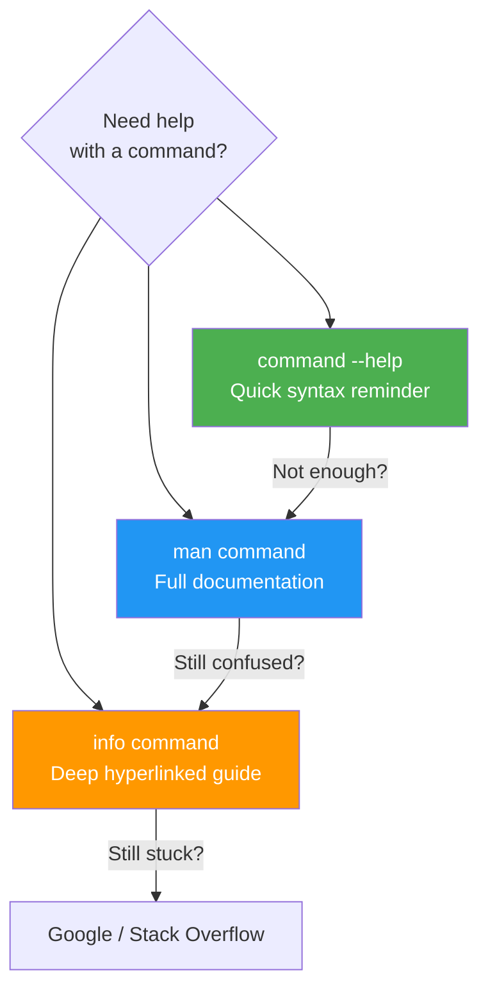

## 1.1.3 Getting Help and Understanding Command Structure


### Help System Hierarchy



#### The Self-Documenting System

One of Linux’s greatest strengths is that the system itself contains comprehensive documentation. You do not need an internet connection to understand most commands. Three primary sources exist, each with a different level of detail.

| Source        | Command                          | Detail Level                  | When to Use                                          |
| ------------- | -------------------------------- | ----------------------------- | ---------------------------------------------------- |
| Built-in help | `command --help` or `command -h` | Brief, flags only             | Quick syntax reminder                                |
| Manual pages  | `man command`                    | Comprehensive, canonical      | Learning new commands, understanding all options     |
| Info pages    | `info command`                   | Even more detail, hyperlinked | Deep dives into complex tools (e.g., `grep`, `find`) |

#### The `--help` Option: Quick Reference

Most GNU and Linux commands accept `--help` or `-h` to display a concise usage summary.

```bash
# Typical output format
ls --help
```

**Example output (abbreviated):**

```
Usage: ls [OPTION]... [FILE]...
List information about the FILEs (the current directory by default).

Mandatory arguments to long options are mandatory for short options too.
  -a, --all                  do not ignore entries starting with .
  -A, --almost-all           do not list implied . and ..
  -h, --human-readable       with -l and -s, print sizes like 1K 234M 2G
  -l                         use a long listing format
  -r, --reverse              reverse order while sorting
  -R, --recursive            list subdirectories recursively
```

**Pattern to recognize:**

* `[OPTION]` means optional flags

* `[FILE]` means optional file or directory arguments

* `...` means you can provide multiple

* `-a, --all` shows short flag (`-a`) and long flag (`--all`)

#### Manual Pages: The Definitive Reference

The `man` command opens the manual page (formatted with `less`). Navigate with arrow keys, spacebar (next page), `b` (back), `/` (search), `q` (quit).

```bash
man ls
```

**Structure of a manual page (standard sections):**

| Section     | Title                              | Content                                                       |
| ----------- | ---------------------------------- | ------------------------------------------------------------- |
| NAME        | Command name and brief description | `ls - list directory contents`                                |
| SYNOPSIS    | Command syntax                     | `ls [OPTION]... [FILE]...`                                    |
| DESCRIPTION | Detailed explanation               | What the command does, how it works                           |
| OPTIONS     | Each flag explained                | `-l` means long format, shows permissions, links, owner, etc. |
| EXIT STATUS | Return codes                       | `0` = success, non-zero = error                               |
| EXAMPLES    | Common use cases                   | Often the most useful section for beginners                   |
| SEE ALSO    | Related commands                   | `man dir`, `man dircolors`                                    |

**Manual page sections (numbered):**\
Commands can appear in multiple sections. For example, `passwd` is a command (section 1) and also a file format (section 5). Specify the section number to disambiguate.

| Section | Content Type                                               |
| ------- | ---------------------------------------------------------- |
| 1       | User commands (what you type in the shell)                 |
| 2       | System calls (kernel interfaces)                           |
| 3       | Library functions (C standard library)                     |
| 4       | Special files (devices, `/dev/*`)                          |
| 5       | File formats and conventions (`/etc/passwd`, `/etc/fstab`) |
| 6       | Games                                                      |
| 7       | Miscellaneous (overviews, concepts)                        |
| 8       | System administration commands (run as root)               |

```bash
# View section 1 (command)
man 1 passwd

# View section 5 (file format)
man 5 passwd

# See all sections containing a term
man -f passwd
# Output: passwd (1) - change user password
#         passwd (5) - password file
```

#### Info Pages: Hypertext Documentation

For complex tools (especially GNU coreutils), `info` provides a more structured, hyperlinked document.

```bash
info ls
```

Navigate with:

* `n` (next node)

* `p` (previous node)

* `u` (up one level)

* `l` (last visited)

* `q` (quit)

Most platform engineers use `man` 90% of the time. Use `info` when `man` feels too sparse or you want tutorial-style explanations.

#### Command Structure: Decoding the Syntax

Every Linux command follows a pattern that, once understood, makes any new command predictable.

```
command [options] [arguments]
```

* **Command** – The program name (e.g., `ls`, `cp`, `grep`)

* **Options** – Modify behavior. Two styles:

  * Short options: single dash + single letter (`-l`, `-a`, `-r`). Can often combine: `-la` is same as `-l -a`.

  * Long options: double dash + word (`--all`, `--recursive`)

* **Arguments** – Targets the command acts upon (files, directories, strings)

**Special conventions you must know:**

| Syntax | Meaning                                               | Example                                  |
| ------ | ----------------------------------------------------- | ---------------------------------------- |
| `[ ]`  | Optional                                              | `ls [OPTION]` means you can omit options |
| `< >`  | Required (rare in man pages, but common in tutorials) | `cp <source> <dest>`                     |
| `...`  | Can repeat                                            | `cp file1 file2 file3 dest_dir/`         |
| `\|`   | Choice                                                | `ls --color=auto\|never\|always`         |

**Position of options:** Most commands allow options before or after arguments, but POSIX recommends options first.

```bash
# Both work, but first is idiomatic
ls -la /home
ls /home -la
```

#### Finding Commands: `which`, `type`, `whereis`

When you type a command, how does the shell find it? The `PATH` environment variable lists directories searched in order.

```bash
echo $PATH
# Typical output: /usr/local/sbin:/usr/local/bin:/usr/sbin:/usr/bin:/sbin:/bin
```

**Tools to locate commands:**

| Command   | Purpose                                                                  | Example                                              |
| --------- | ------------------------------------------------------------------------ | ---------------------------------------------------- |
| `which`   | Shows full path of executable                                            | `which ls` → `/bin/ls`                               |
| `type`    | Shows how command would be interpreted (alias, function, built-in, file) | `type cd` → `cd is a shell builtin`                  |
| `whereis` | Locates binary, source, and manual page                                  | `whereis ls` → `/bin/ls /usr/share/man/man1/ls.1.gz` |

**Shell built-ins vs external commands:**\
Some commands (like `cd`, `echo`, `exit`) are built into the shell itself – they do not have separate binaries. `type` reveals this.

```bash
type echo
# echo is a shell builtin

type -a echo   # Show all occurrences (builtin and external)
# echo is a shell builtin
# echo is /bin/echo
```

#### Practical Example: Exploring `rsync` (which you will learn deeply in Subchapter 1.2.3)

Even though you have not studied `rsync` yet, you can already learn its basics using only the help system.

```bash
# Quick help
rsync --help | head -20

# Full manual
man rsync

# While in man, search for "backup"
/backup
# Press 'n' for next match, 'N' for previous

# Exit man
q
```

This self-service ability is what separates effective engineers from those who constantly search the web.

#### Quick Task: Help System Scavenger Hunt

*Do not search the internet. Use only* *`--help`,* *`man`, and* *`info`.*

1. Find out what the `-p` flag does in `mkdir` (you saw it briefly in 1.1.2). Write down the explanation.
2. Use `man` to determine what the `-exec` option does in `find` (just read the description – do not memorize yet).
3. Check if `cd` is a built-in or an external command on your system.
4. Find the path to the `grep` binary and also its manual page location using a single command.
5. Look at the `SEE ALSO` section of `man tar`. Name two related commands.

> **Ready Solution:**
>
> ```bash
> # Task 1
> man mkdir
> # Search for "-p" (type /-p while in man)
> # Explanation: "Create any missing intermediate parent directories."
>
> # Task 2
> man find
> # Search for "-exec" (type /-exec)
> # Explanation: "Execute command; true if 0 status is returned."
>
> # Task 3
> type cd
> # Output: cd is a shell builtin
>
> # Task 4
> whereis grep
> # Output (example): grep: /bin/grep /usr/share/man/man1/grep.1.gz
>
> # Task 5
> man tar
> # Scroll to SEE ALSO (near bottom)
> # Related commands: cpio, gzip, gunzip, zcat, bzip2, dump, restore, rmt
> ```

#### Command Exit Codes: Silent Success or Failure

Every command returns an **exit code** (0–255) when it finishes. `0` means success. Any non-zero means failure. The shell stores the last command’s exit code in `$?`.

```bash
ls /etc/passwd
echo $?
# 0 (success, file exists)

ls /nonexistent_file 2>/dev/null
echo $?
# 2 (common error code for "No such file or directory")
```

**Common exit codes:**

| Code | Meaning                                           |
| ---- | ------------------------------------------------- |
| 0    | Success                                           |
| 1    | General error (catch-all)                         |
| 2    | Misuse of shell built-in (e.g., missing argument) |
| 126  | Command found but not executable                  |
| 127  | Command not found                                 |
| 130  | Terminated by Ctrl+C (SIGINT)                     |

You will use exit codes extensively in Module 3 (Bash Scripting) for error handling.

#### The `apropos` and `whatis` Commands: Finding Unknown Commands

When you know what you want to do but don't know the command name, use `apropos`:

```bash
# Search man page descriptions for keyword
apropos partition
# Output:
# addpart (8)     - tell the kernel about a new partition
# cfdisk (8)      - display or manipulate a disk partition table
# fdisk (8)       - manipulate disk partition table
# parted (8)      - a partition manipulation program
# partprobe (8)   - inform the OS of partition table changes

# Search for commands related to "network"
apropos network | head -10

# Equivalent to 'man -k'
man -k firewall
```

**`whatis`** gives a one-line description (same as `man -f`):

```bash
whatis ls
# ls (1) - list directory contents

whatis passwd
# passwd (1) - change user password
# passwd (5) - password file

# Multiple commands at once
whatis cat grep awk
```

#### TLDR Pages: Community-Driven Simplified Help

While not part of the standard system, **tldr** (Too Long; Didn't Read) is invaluable for quick examples:

```bash
# Install tldr client
sudo apt install tldr   # Debian/Ubuntu
sudo dnf install tldr   # RHEL/Fedora

# Update the page cache
tldr --update

# Get simplified examples for tar
tldr tar
```

**Example tldr output for `tar`:**
```
tar
Archiving utility.

- Create an archive from files:
  tar cf target.tar file1 file2 file3

- Extract an archive in the current directory:
  tar xf source.tar

- Create a gzipped archive:
  tar czf target.tar.gz source_directory
```

This is much faster than reading the full `man tar` when you just need common usage.

#### Understanding Signals

Commands can be interrupted or controlled via **signals**. Understanding signals helps with process management:

| Signal | Number | Keyboard | Effect | Can Ignore? |
|--------|--------|----------|--------|-------------|
| SIGINT | 2 | `Ctrl+C` | Interrupt (polite termination request) | Yes |
| SIGQUIT | 3 | `Ctrl+\` | Quit with core dump | Yes |
| SIGTSTP | 20 | `Ctrl+Z` | Suspend to background | Yes |
| SIGKILL | 9 | N/A | Forceful termination | No |
| SIGTERM | 15 | N/A | Graceful termination request | Yes |
| SIGHUP | 1 | N/A | Hangup (terminal closed) | Yes |

```bash
# Suspend a running process
# Press Ctrl+Z while command is running
sleep 300
# [1]+  Stopped                 sleep 300

# Resume in foreground
fg

# Resume in background
bg

# List background jobs
jobs
# [1]+  Running                 sleep 300 &

# Send signal to a process
kill -SIGTERM 12345    # Graceful shutdown
kill -15 12345         # Same as above (using signal number)
kill -9 12345          # Force kill (last resort)
kill -SIGHUP 12345     # Often used to reload config

# Send signal to all processes with a name
killall -SIGHUP nginx  # Reload all nginx processes
pkill -HUP nginx       # Same effect, different syntax
```

#### Environment Variables Basics

Environment variables store configuration accessible to all processes:

```bash
# View all environment variables
env
printenv

# View specific variable
echo $HOME
echo $USER
echo $SHELL
echo $PATH

# Set variable for current session
export MY_VAR="my_value"
echo $MY_VAR

# Set variable for a single command only
MY_VAR="temp" ./script.sh

# Common environment variables
echo $HOME       # User's home directory
echo $USER       # Current username
echo $SHELL      # Default shell path
echo $PATH       # Command search directories
echo $PWD        # Current working directory
echo $OLDPWD     # Previous working directory (cd - uses this)
echo $EDITOR     # Default text editor
echo $LANG       # System locale
echo $TERM       # Terminal type

# Add to PATH temporarily
export PATH="$PATH:/opt/myapp/bin"

# Make permanent (add to ~/.bashrc)
echo 'export PATH="$PATH:/opt/myapp/bin"' >> ~/.bashrc
```

#### Special Shell Variables

| Variable | Meaning |
|----------|---------|
| `$?` | Exit code of last command |
| `$$` | PID of current shell |
| `$!` | PID of last background process |
| `$0` | Name of current script/shell |
| `$1, $2, ...` | Positional parameters (script arguments) |
| `$#` | Number of positional parameters |
| `$@` | All positional parameters (as separate words) |
| `$*` | All positional parameters (as single word) |

```bash
# Check last command's exit status
ls /tmp
echo "Exit code: $?"  # 0

ls /nonexistent 2>/dev/null
echo "Exit code: $?"  # 2

# Current shell PID
echo "Shell PID: $$"

# Start background process and get its PID
sleep 100 &
echo "Background process PID: $!"
```

#### Tab Completion: Your Best Friend

The `Tab` key provides intelligent auto-completion:

```bash
# Complete commands
sys<Tab>        # Shows: systemctl, sysctl, system-...
systemc<Tab>    # Completes to: systemctl

# Complete file paths
cat /etc/hos<Tab>      # Completes to: cat /etc/hostname
ls /var/log/sys<Tab>   # Completes to: ls /var/log/syslog

# Complete options (bash-completion package)
systemctl sta<Tab>     # Shows: start, status, stop
docker run --<Tab><Tab>  # Shows all long options

# Install enhanced completion
sudo apt install bash-completion   # Debian/Ubuntu
sudo dnf install bash-completion   # RHEL/Fedora

# Enable it (usually in /etc/bash.bashrc, but verify)
source /etc/bash_completion
```

**Double-tap Tab** when there are multiple matches to see all options.

#### Why This Matters for Platform Engineering

* **Self-sufficiency** – When you are SSH'd into a production server with restricted internet access (common in secure environments), `man` pages are your only documentation.

* **Understanding new tools** – Platform engineering involves constant learning (ArgoCD, Terraform, Helm). The skill of parsing `--help` and `man` pages directly applies.

* **Debugging scripts** – Checking `$?` after critical commands is how robust scripts detect failures.

* **Signal handling** – Knowing when to use `SIGTERM` vs `SIGKILL` prevents data loss in production services.

* **Environment variables** – Essential for 12-factor app configuration, CI/CD pipelines, and container orchestration.

**Forward reference:**
In Module 3's error handling section, you will write `set -e` to make scripts exit on any non-zero return code. Understanding exit codes now makes that concept trivial later.

#### Summary Table: Help Resources

| Command               | Use Case                             | Navigation                                    |
| --------------------- | ------------------------------------ | --------------------------------------------- |
| `command --help`      | Quick flag reference                 | Read-only, scroll if long                     |
| `man command`         | Full documentation                   | `q` quit, `/` search, `n`/`N` next/prev match |
| `man section command` | Specific section                     | Same as above                                 |
| `info command`        | Hyperlinked deep dive                | `n`/`p`/`u`/`l`, `q` quit                     |
| `which command`       | Find binary path                     | –                                             |
| `type command`        | Determine if built-in/alias/external | –                                             |
| `whereis command`     | Find binary + source + man page      | –                                             |
| `echo $?`             | Check last command's exit code       | –                                             |

#### Useful `apropos` – Search by Keyword

When you don't know the exact command name, use `apropos` to search manual page descriptions:

```bash
# Find commands related to "password"
apropos password
# Output: chpasswd (8) - update passwords in batch mode
#         passwd (1) - change user password
#         passwd (5) - password file
#         ...

# Search for disk-related commands
apropos disk
```

This is equivalent to `man -k keyword`. Useful when you know what you want to do but not which command does it.

---

**Backlinks:**
- Previous: [1.1.2 CLI Basics and Philosophy](./1.1.2_CLI_Basics_and_Philosophy.md)
- Next: [1.1.4 Subchapter Review](./1.1.4_Subchapter_Review.md)
- Forward reference: Module 3 – Bash Scripting (exit codes and `set -e`)
