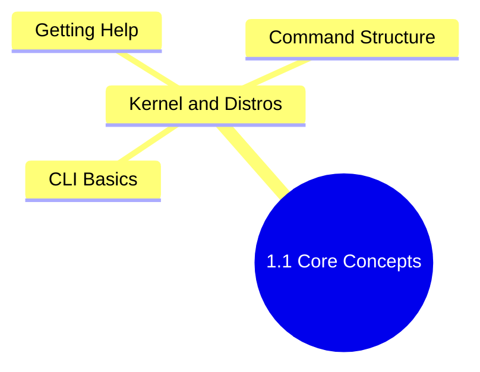

## 1.1.4 Subchapter Review: Cheatsheet and Interview Prep

This review covers only the material presented in Notes 1.1.1, 1.1.2, and 1.1.3. No forward referencing. If a concept appears here but not in those notes, it is explicitly added as a bridge or clarification.




***

## Cheatsheet: Essential Commands and Concepts

### Kernel and OS Basics

| Concept                      | Definition                                                                               |
| ---------------------------- | ---------------------------------------------------------------------------------------- |
| Kernel                       | Core of OS, runs in ring 0 (privileged mode), manages CPU, memory, devices, system calls |
| User space                   | Ring 3, where applications run, restricted instructions                                  |
| System call                  | Controlled API from user space to kernel (e.g., `read()`, `write()`, `open()`)           |
| Monolithic kernel            | All core services in single address space (Linux uses this with loadable modules)        |
| Loadable kernel module (LKM) | Driver or feature loaded/unloaded without recompiling kernel                             |

### Kernel Module Commands

| Command                        | Purpose                         |
| ------------------------------ | ------------------------------- |
| `lsmod`                        | List loaded kernel modules      |
| `modinfo <module>`             | Show module information         |
| `sudo modprobe <module>`       | Load a module                   |
| `sudo modprobe -r <module>`    | Unload a module                 |

### Distribution Families

| Family | Package format | Package manager   | Examples                          |
| ------ | -------------- | ----------------- | --------------------------------- |
| RHEL   | `.rpm`         | `yum` / `dnf`     | RHEL, CentOS, Rocky, Alma, Fedora |
| Debian | `.deb`         | `apt` / `apt-get` | Debian, Ubuntu, Mint, Pop!\_OS    |

### Detection Commands

```bash
uname -a                 # Kernel version, architecture, hostname
uname -r                 # Just kernel release
cat /etc/os-release      # Distribution ID, version, name
cat /etc/redhat-release  # RHEL family specific
cat /etc/debian_version  # Debian family specific
lsmod                    # List loaded kernel modules
```

### Essential CLI Commands (from 1.1.2)

| Command         | Common flags           | Purpose                  |
| --------------- | ---------------------- | ------------------------ |
| `ls`            | `-l`, `-a`, `-h`, `-R` | List directory contents  |
| `cd`            | (none)                 | Change directory         |
| `pwd`           | (none)                 | Print working directory  |
| `mkdir`         | `-p`                   | Create directory         |
| `rm`            | `-r`, `-f`, `-i`       | Remove files/directories |
| `cp`            | `-r`, `-i`, `-p`       | Copy files/directories   |
| `mv`            | `-i`, `-u`             | Move/rename              |
| `touch`         | `-t`, `-d`             | Create/update file       |
| `cat`           | `-n`                   | Display file content     |
| `less`          | `-N`                   | Page through file        |
| `head` / `tail` | `-n`, `-f`             | Show start/end of file   |
| `echo`          | `-n`                   | Print text               |

### File Path Symbols

| Symbol | Meaning           |
| ------ | ----------------- |
| `/`    | Root directory    |
| `~`    | Home directory    |
| `.`    | Current directory |
| `..`   | Parent directory  |

### Standard Streams and Redirection

| Stream | FD | Symbol                         | Default destination |
| ------ | -- | ------------------------------ | ------------------- |
| stdin  | 0  | `<` or pipe input              | Keyboard            |
| stdout | 1  | `>` (overwrite), `>>` (append) | Terminal            |
| stderr | 2  | `2>`, `2>>`                    | Terminal            |

```bash
command > file.txt       # Redirect stdout (overwrite)
command >> file.txt      # Redirect stdout (append)
command 2> error.log     # Redirect stderr
command &> all.txt       # Redirect both stdout and stderr
command > /dev/null 2>&1 # Discard all output
command | next_command   # Pipe stdout to next command's stdin
```

### Help System

| Command                          | Use                                     |
| -------------------------------- | --------------------------------------- |
| `command --help` or `command -h` | Quick flag summary                      |
| `man command`                    | Full manual page                        |
| `man section command`            | Specific manual section                 |
| `info command`                   | Hyperlinked documentation               |
| `which command`       | Show binary path                     | –                                             |
| `type command`        | Determine if built-in/alias/external | –                                             |
| `whereis command`     | Show binary + source + man page      | –                                             |
| `apropos keyword`     | Search man pages by keyword          | Same as `man -k`                              |
| `echo $?`             | Check last command's exit code       | –                                             |

### Manual Page Sections

| Section | Content               |
| ------- | --------------------- |
| 1       | User commands         |
| 2       | System calls          |
| 3       | Library functions     |
| 4       | Special files (/dev)  |
| 5       | File formats          |
| 6       | Games                 |
| 7       | Miscellaneous         |
| 8       | Admin commands (root) |

### Exit Codes

| Code | Meaning                  |
| ---- | ------------------------ |
| 0    | Success                  |
| 1    | General error            |
| 2    | Misuse of shell built-in |
| 126  | Command found but not executable |
| 127  | Command not found        |
| 130  | Terminated by Ctrl+C     |

### Keyboard Signals

| Shortcut   | Signal  | Effect                              |
| ---------- | ------- | ----------------------------------- |
| `Ctrl+C`   | SIGINT  | Interrupt/terminate foreground      |
| `Ctrl+Z`   | SIGTSTP | Suspend to background               |
| `Ctrl+D`   | EOF     | End input / close shell             |

### Linux Philosophy Principles

1. Everything is a file
2. Small, composable programs (do one thing well)
3. Text is the universal interface
4. Avoid captive user interfaces

### Path Types

* **Absolute path**: Starts from root (`/home/user/file.txt`)

* **Relative path**: Relative to current directory (`docs/file.txt`)

***

## Interview Questions (Scenario-Based)

These questions assume only knowledge from Subchapter 1.1. Answers are self-contained.

### Question 1

**Scenario:** You have just SSH'd into an unfamiliar Linux server to troubleshoot an application issue. Before running any commands, you need to understand what environment you are working with.

**Question:** What three commands would you run first to determine the kernel version, distribution, and architecture? What specific output would you look for in each?

**Answer:**

Run these three commands in order:

1. `uname -a` – Look for the kernel release (e.g., `5.15.0-91-generic`) and architecture (`x86_64`, `aarch64`). The presence of "generic" or "server" indicates the kernel flavor.
2. `cat /etc/os-release` – Look for `ID=` (distribution family, e.g., `ubuntu`, `rhel`, `rocky`) and `VERSION_ID=` (major version, e.g., `22.04`, `8.5`).
3. `uname -m` – If you only need architecture without the full kernel details, this returns `x86_64`, `aarch64`, etc.

Alternative for RHEL family: `cat /etc/redhat-release` gives a human-readable string like `Rocky Linux release 8.5`. For Debian family: `cat /etc/debian_version` returns a numeric version.

Knowing these three pieces of information tells you which package manager to use (`apt` for Debian/Ubuntu, `dnf` for modern RHEL), which kernel features are available, and whether you are on 64-bit x86 or ARM – critical for downloading compatible binaries.

### Question 2

**Scenario:** A junior engineer asks you, "I typed `cd ..` and it worked, but when I type `..` by itself, I get 'command not found'. Why?"

**Question:** Explain the difference between a command and a path. Why does `cd ..` work but `..` alone fails?

**Answer:**

`cd` is a shell built-in command that changes the current working directory. It expects a directory path as its argument. `..` is a special path that means "parent directory" – it is not a command.

When you type `..` alone, the shell tries to execute a program named `..`. No such program exists in any directory listed in the `PATH` environment variable, so the shell returns "command not found".

By contrast, `cd ..` passes `..` as an argument to the `cd` command. The `cd` built-in interprets `..` as a path, resolves it to the parent directory, and changes the shell's current directory.

This illustrates the Linux philosophy: paths (like `..`, `.`, `~`) are not executable. They are only meaningful as arguments to commands that understand directory navigation.

### Question 3

**Scenario:** You are debugging a script that runs `rm -rf /var/temp/appdata`. The script fails, and you want to see the exact error message. However, when you run the script, the terminal shows nothing.

**Question:** What is happening to the error messages? How would you modify the script or your test command to capture both success and error output separately?

**Answer:**

The script is likely redirecting stderr (file descriptor 2) to `/dev/null` or discarding it. By default, `rm` prints errors (e.g., "Permission denied" or "No such file or directory") to stderr. If stderr is silenced, you see nothing.

To capture both stdout and stderr separately when testing:

```bash
# Run the command, send stdout to success.log, stderr to error.log
rm -rf /var/temp/appdata > success.log 2> error.log

# Or send both to the same file (order matters: 2>&1 means "send stderr to where stdout is going")
rm -rf /var/temp/appdata > combined.log 2>&1

# Or in bash (and most modern shells), the &> shortcut
rm -rf /var/temp/appdata &> combined.log
```

To modify the script, look for redirections like `2>/dev/null` or `&>/dev/null` and remove or change them to log files. Also check if the script sets `exec 2>/dev/null` at the top, which redirects all stderr for the entire script.

### Question 4

**Scenario:** You are teaching a new team member how to use `man` pages. They ask, "I typed `man passwd` and saw the command syntax, but I need to understand the format of the `/etc/passwd` file. How do I get that?"

**Question:** How would you instruct them to find the file format documentation for `passwd`? What specific command would you give, and what section number should they look for?

**Answer:**

The `passwd` command (changing user passwords) is in section 1 of the manual. The `/etc/passwd` file format is in section 5 (File Formats and Conventions).

Command to give:

```bash
man 5 passwd
```

If they run just `man passwd`, they will see section 1 (the command) by default because section 1 is searched first. To see all sections containing "passwd" before opening a specific one:

```bash
man -f passwd
```

This shows:

```
passwd (1) - change user password
passwd (5) - password file
```

Then they can choose section 5 for the file format. Within that manual page, they will find fields like `username:password:UID:GID:GECOS:home:shell` and explanations of each.

### Question 5

**Scenario:** A production server has a misbehaving process that is writing enormous amounts of data to a log file. You need to watch the log in real time to see the error pattern, but the log file is growing so fast that `cat` would flood your terminal and `less` would become unresponsive.

**Question:** Which command from Subchapter 1.1 would you use, and with what flag? After you identify the issue, you want to stop watching – how do you exit?

**Answer:**

Use `tail` with the `-f` (follow) flag:

```bash
tail -f /var/log/problematic.log
```

`tail -f` shows the last 10 lines (default) of the file and then waits for new lines to be appended, printing them as they arrive. This is efficient because it does not re-read the entire file – it uses the kernel's inotify mechanism to detect changes.

If you need more than 10 initial lines, add `-n`:

```bash
tail -n 100 -f /var/log/problematic.log
```

To exit the follow mode, press `Ctrl+C`. This sends the SIGINT signal to the `tail` process, causing it to terminate and return you to the shell prompt.

Alternative if the log rotates while you are following: `tail -F` (capital F) will re-open the file if it is rotated (renamed and recreated), which is useful for logs managed by `logrotate`. But for the basic scenario, `-f` is sufficient.

***

## Topics Covered in This Subchapter (Self-Check)

| Topic                                                                                                             | Found in Note |
| ----------------------------------------------------------------------------------------------------------------- | ------------- |
| Kernel vs user space                                                                                              | 1.1.1         |
| Monolithic kernel design, LKMs (`lsmod`, `modprobe`)                                                              | 1.1.1         |
| RHEL vs Debian families                                                                                           | 1.1.1         |
| `uname`, `/etc/os-release`                                                                                        | 1.1.1         |
| Shell, prompt, bash                                                                                               | 1.1.2         |
| Linux philosophy (everything is a file)                                                                           | 1.1.2         |
| Essential commands (`ls`, `cd`, `pwd`, `mkdir`, `rm`, `cp`, `mv`, `touch`, `cat`, `less`, `head`, `tail`, `echo`) | 1.1.2         |
| Absolute vs relative paths, `~`, `.`, `..`                                                                        | 1.1.2         |
| Standard streams (stdin, stdout, stderr)                                                                          | 1.1.2         |
| Redirection (`>`, `>>`, `2>`, `&>`), `/dev/null`                                                                  | 1.1.2         |
| Pipes (`\|`)                                                                                                      | 1.1.2         |
| Keyboard signals (`Ctrl+C`, `Ctrl+Z`, `Ctrl+D`)                                                                   | 1.1.2         |
| `/proc` filesystem                                                                                                | 1.1.2         |
| `--help` and `-h`                                                                                                 | 1.1.3         |
| `man` pages and sections (1–8)                                                                                    | 1.1.3         |
| `info` pages                                                                                                      | 1.1.3         |
| `which`, `type`, `whereis`, `apropos`                                                                             | 1.1.3         |
| `PATH` environment variable                                                                                       | 1.1.3         |
| Shell built-ins vs external commands                                                                              | 1.1.3         |
| Exit codes and `$?`                                                                                               | 1.1.3         |
---

**Backlinks:**
- Previous: [1.1.3 Getting Help and Command Structure](./1.1.3_Getting_Help_and_Command_Structure.md)
- Next Subchapter: [1.2.1 FHS Deep Dive](../Subchapter_1.2/1.2.1_FHS_Deep_Dive.md)

**End of Subchapter 1.1 Review**
### Kernel and System

| Concept | Command/Syntax | Explanation |
|---------|----------------|-------------|
| sysctl | `sysctl -a`, `sysctl -w param=value` | View/modify kernel parameters at runtime |
| /etc/sysctl.d/ | Config files for persistent kernel params | Survives reboot |
| Kernel versioning | major.minor.patch-extra | LTS kernels preferred for production |
| Architecture check | `uname -m`, `lscpu` | x86_64, aarch64, armv7l |
| Alpine Linux | `apk` package manager | Minimal container base (~5MB) |

### Command Chaining

| Operator | Behavior |
|----------|----------|
| `;` | Run sequentially regardless of exit status |
| `&&` | Run next only if previous succeeds (exit 0) |
| `\|\|` | Run next only if previous fails (exit non-zero) |
| `&` | Run in background |

### Globbing and Wildcards

| Pattern | Matches |
|---------|---------|
| `*` | Any characters (zero or more) |
| `?` | Exactly one character |
| `[abc]` | One character from set |
| `[a-z]` | One character from range |
| `[!abc]` | One character NOT in set |
| `{a,b}` | Brace expansion (shell expands before command) |

### Quoting Rules

| Quote Type | Variables | Globs | Use Case |
|------------|-----------|-------|----------|
| None | Expand | Expand | Normal usage |
| Double `"` | Expand | Protected | Preserve spaces in variables |
| Single `'` | Protected | Protected | Literal strings |
| Backslash `\` | N/A | N/A | Escape next character |

### Command Substitution

```bash
$(command)    # Modern syntax (preferred)
`command`     # Legacy syntax (avoid nesting)
```

### History and Keyboard Shortcuts

| Shortcut | Action |
|----------|--------|
| `Ctrl+R` | Reverse search history |
| `Ctrl+A` / `Ctrl+E` | Beginning / End of line |
| `Ctrl+U` / `Ctrl+K` | Delete to beginning / end |
| `Ctrl+W` | Delete previous word |
| `Ctrl+L` | Clear screen |
| `!!` | Repeat last command |
| `!$` | Last argument of previous command |

### Aliases

```bash
alias name='command'     # Create alias
unalias name            # Remove alias
alias                   # List all aliases
# Add to ~/.bashrc for persistence
```

### Finding Commands

| Command | Purpose |
|---------|---------|
| `apropos keyword` | Search man page descriptions |
| `whatis command` | One-line command description |
| `tldr command` | Community-simplified examples (if installed) |

### Signals

| Signal | Num | Keyboard | Effect |
|--------|-----|----------|--------|
| SIGINT | 2 | `Ctrl+C` | Interrupt |
| SIGQUIT | 3 | `Ctrl+\` | Quit with core dump |
| SIGTSTP | 20 | `Ctrl+Z` | Suspend |
| SIGTERM | 15 | `kill` default | Graceful shutdown |
| SIGKILL | 9 | `kill -9` | Force kill (cannot ignore) |
| SIGHUP | 1 | `kill -HUP` | Hangup / reload config |

### Job Control

```bash
Ctrl+Z          # Suspend foreground job
bg              # Resume suspended job in background
fg              # Bring background job to foreground
jobs            # List background jobs
kill %1         # Kill job number 1
```

### Common Environment Variables

| Variable | Purpose |
|----------|---------|
| `$HOME` | User's home directory |
| `$USER` | Current username |
| `$SHELL` | Default shell |
| `$PATH` | Command search directories |
| `$PWD` | Current working directory |
| `$EDITOR` | Default text editor |
| `$LANG` | System locale |

### Special Shell Variables

| Variable | Meaning |
|----------|---------|
| `$?` | Exit code of last command |
| `$$` | Current shell PID |
| `$!` | Last background process PID |
| `$0` | Script/shell name |
| `$1`, `$2`... | Positional arguments |
| `$#` | Number of arguments |
| `$@` | All arguments (separate words) |

***

## Additional Interview Questions

### Question 6

**Scenario:** A deployment script contains this line: `rm -rf /app/temp/$DIR_NAME/*`. During testing, the `$DIR_NAME` variable was accidentally unset. What happened, and how would you prevent this?

**Question:** Explain the danger of this command with an unset variable. What bash features could prevent this catastrophe?

**Answer:**

When `$DIR_NAME` is unset or empty, the command becomes `rm -rf /app/temp//*`, which simplifies to `rm -rf /app/temp/*` – deleting everything in `/app/temp/`. In the worst case, if `/app/temp/` doesn't exist and there's a path resolution issue, it could affect unintended locations.

Prevention strategies:

1. **Use `set -u` (or `set -o nounset`)** – Makes the script exit immediately when referencing an unset variable:
```bash
set -u
rm -rf /app/temp/$DIR_NAME/*  # Script exits here if DIR_NAME is unset
```

2. **Use parameter expansion with default/error**:
```bash
# Exit with error if unset
rm -rf /app/temp/${DIR_NAME:?Variable DIR_NAME must be set}/*

# Use default value if unset
rm -rf /app/temp/${DIR_NAME:-default_dir}/*
```

3. **Quote the variable and check explicitly**:
```bash
if [[ -z "$DIR_NAME" ]]; then
    echo "Error: DIR_NAME is not set" >&2
    exit 1
fi
rm -rf "/app/temp/$DIR_NAME/"*
```

4. **Use `set -e` combined with validation** – Exit on any command failure.

The root cause is that shells silently expand unset variables to empty strings by default. Always use `set -u` in production scripts.

### Question 7

**Scenario:** You need to modify a kernel parameter to enable IP forwarding on a Kubernetes node. The change must survive reboots.

**Question:** What commands would you use to (a) verify the current value, (b) change it temporarily for testing, and (c) make it permanent?

**Answer:**

```bash
# (a) Verify current value (two equivalent methods)
sysctl net.ipv4.ip_forward
# Or directly from /proc
cat /proc/sys/net/ipv4/ip_forward

# (b) Change temporarily for testing (resets on reboot)
sudo sysctl -w net.ipv4.ip_forward=1

# Verify the change took effect
sysctl net.ipv4.ip_forward
# net.ipv4.ip_forward = 1

# (c) Make permanent
# Create a file in /etc/sysctl.d/ (recommended for modularity)
echo "net.ipv4.ip_forward = 1" | sudo tee /etc/sysctl.d/99-kubernetes.conf

# Or append to /etc/sysctl.conf (older method)
echo "net.ipv4.ip_forward = 1" | sudo tee -a /etc/sysctl.conf

# Apply all sysctl configs from files without rebooting
sudo sysctl --system

# Verify it's now permanent
sysctl net.ipv4.ip_forward
```

The `/etc/sysctl.d/` directory approach is preferred because it keeps custom settings separate from the default `/etc/sysctl.conf`, making configuration management and auditing easier.

### Question 8

**Scenario:** A colleague wrote a script that runs `grep error /var/log/*.log | wc -l` but it fails with "Argument list too long" because there are 50,000 log files.

**Question:** Why does this happen, and what alternative approaches would work?

**Answer:**

The shell expands `*.log` into all 50,000 filenames before passing them to `grep`. This exceeds the kernel's `ARG_MAX` limit (usually 2MB of arguments).

Alternative approaches:

1. **Use `find` with `-exec` or `xargs`** – Processes files in batches:
```bash
find /var/log -name "*.log" -exec grep -l error {} + | wc -l
# Or count matching lines
find /var/log -name "*.log" -exec grep -c error {} + | awk -F: '{sum+=$2} END {print sum}'
```

2. **Use `xargs` with batching**:
```bash
find /var/log -name "*.log" -print0 | xargs -0 grep error | wc -l
```

3. **Use a loop (slower but memory-efficient)**:
```bash
for f in /var/log/*.log; do
    grep error "$f"
done | wc -l
```

4. **Use `grep` with `-r` (recursive)**:
```bash
grep -r --include="*.log" error /var/log | wc -l
```

The `find | xargs` approach is most efficient for large file sets because `xargs` automatically batches arguments to stay under `ARG_MAX`.

***

**End of Subchapter 1.1 Review**

Proceed to Subchapter 1.2 when ready.
