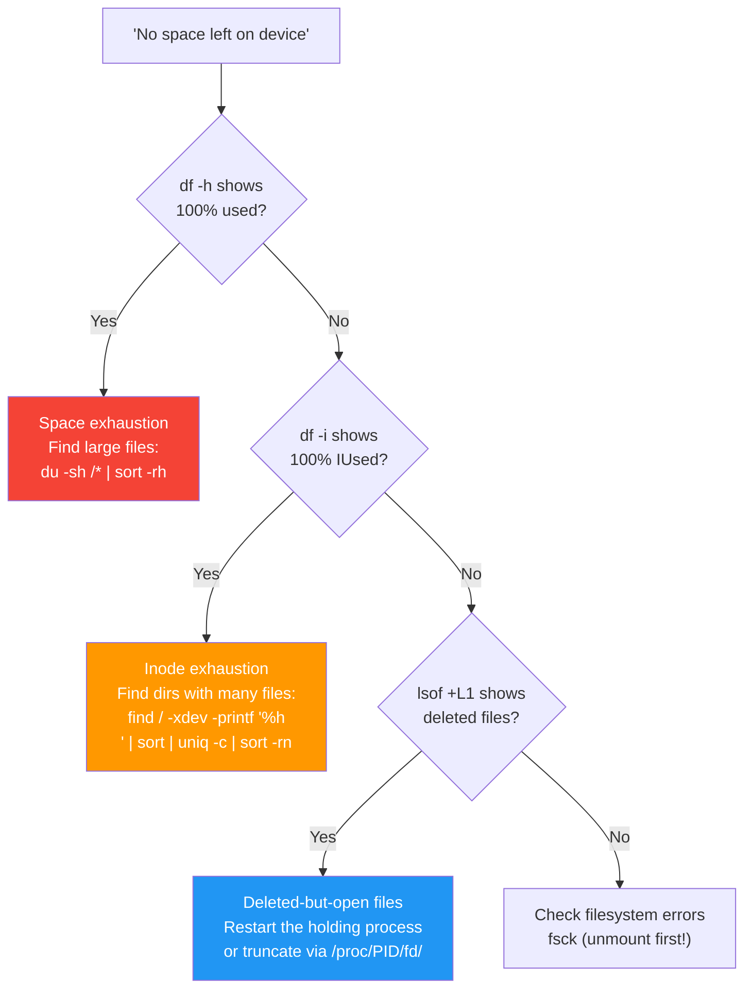

## 1.10.2 Disk Full and Inode Exhaustion: When No Space Is Left

#### Why This Matters

"No space left on device" is one of the most common production emergencies. But there are two distinct ways a filesystem can be full:

* **Space exhaustion** – Too much data (`df -h` shows 100% used)

* **Inode exhaustion** – Too many small files (`df -i` shows 100% used)


### Disk Problem Diagnosis



Each requires different troubleshooting and remediation strategies. This note covers both, plus handling deleted files that still consume space.

***

## Part 1: Understanding Space vs Inodes

### The Two Limits

| Limit      | Command to Check | Meaning                     | Typical Cause                        |
| ---------- | ---------------- | --------------------------- | ------------------------------------ |
| **Space**  | `df -h`          | Total bytes of data         | Large files, logs, databases         |
| **Inodes** | `df -i`          | Number of files/directories | Many tiny files, email spools, cache |

**Inode exhaustion example:** A directory with 10 million 1-byte files will use almost no space but exhaust inodes.

### Checking Both

```bash
# Check space usage
df -h
# Filesystem      Size  Used Avail Use% Mounted on
# /dev/sda2        98G   98G     0 100% /

# Check inode usage
df -i
# Filesystem      Inodes  IUsed  IFree IUse% Mounted on
# /dev/sda2       6.5M    6.5M      0  100% /
```

**Critical:** A filesystem can be full on space but have free inodes, or full on inodes but have free space. You must check both.

***

## Part 2: Troubleshooting Space Exhaustion

### Step 1: Identify the Filling Filesystem

```bash
# Which mount point is full?
df -h
# Look for 100% or 90%+ usage

# If multiple filesystems, check each
df -h /var
df -h /home
```

### Step 2: Find Large Directories

```bash
# Method 1: du (disk usage) – slower but accurate
sudo du -sh /* 2>/dev/null | sort -rh | head -10
# 45G    /var
# 30G    /home
# 12G    /usr
# 5G     /opt

# Drill into the largest directory
sudo du -sh /var/* 2>/dev/null | sort -rh | head -10
# 40G    /var/log
# 4G     /var/lib
# 1G     /var/cache

# Method 2: ncdu (interactive, install separately)
sudo apt install ncdu   # Debian/Ubuntu
sudo dnf install ncdu   # RHEL/Rocky
sudo ncdu /
```

### Step 3: Find Large Files

```bash
# Find files larger than 100MB
sudo find / -type f -size +100M -exec ls -lh {} \; 2>/dev/null | awk '{print $5, $9}' | sort -rh | head -20

# Find files larger than 1GB
sudo find / -type f -size +1G -exec ls -lh {} \; 2>/dev/null

# Find top 10 largest files in /var
sudo find /var -type f -exec du -h {} \; 2>/dev/null | sort -rh | head -10
```

### Step 4: Identify Log Files (Most Common Cause)

```bash
# Check log directory sizes
sudo du -sh /var/log/* | sort -rh | head -10

# Check logrotate status
sudo logrotate --force /etc/logrotate.conf

# Check if logs are being written rapidly
sudo tail -f /var/log/syslog
# If logs are flooding, identify the repeating error
```

### Step 5: Clean Up Space

**Safe cleanup (preserves functionality):**

```bash
# Clean package manager cache
sudo apt clean          # Debian/Ubuntu
sudo dnf clean all      # RHEL/Rocky

# Remove old kernel images (keep 2 most recent)
sudo apt autoremove --purge   # Debian/Ubuntu
sudo dnf remove $(dnf repoquery --installonly --latest-limit=-2 -q)   # RHEL

# Clean journal logs (keep last 7 days)
sudo journalctl --vacuum-time=7d

# Remove old log files (be careful!)
sudo find /var/log -name "*.gz" -delete
sudo find /var/log -name "*.1" -delete

# Clear temporary files
sudo rm -rf /tmp/*
sudo rm -rf /var/tmp/*
```

**Aggressive cleanup (understand consequences):**

```bash
# Truncate large log files (keeps file, empties content)
sudo truncate -s 0 /var/log/huge.log

# Remove old backups
sudo rm -rf /backups/*.old

# Remove Docker unused data (if Docker installed)
docker system prune -a --volumes
```

***

## Part 3: Troubleshooting Inode Exhaustion

### Step 1: Identify High-Inode Directories

```bash
# Find directories with most files (inode count)
sudo find / -xdev -type d -print0 2>/dev/null | while IFS= read -r -d '' dir; do
    echo "$(find "$dir" -maxdepth 1 -type f | wc -l) $dir"
done | sort -rn | head -20

# Alternative using awk (faster)
sudo find / -xdev -type f -printf "%h\n" 2>/dev/null | sort | uniq -c | sort -rn | head -20
```

### Step 2: Common Inode Culprits

```bash
# Check mail spool (often has many small files)
ls -la /var/spool/mail/ | wc -l

# Check session/temp files
ls -la /tmp/ | wc -l
ls -la /var/tmp/ | wc -l

# Check systemd journal (many small journal files)
ls -la /var/log/journal/ | wc -l

# Check web cache directories
ls -la /var/cache/apt/archives/ | wc -l   # Debian
ls -la /var/cache/dnf/ | wc -l            # RHEL

# Check Docker overlay2 (if Docker is used)
ls -la /var/lib/docker/overlay2/ | wc -l
```

### Step 3: Clean Up Inodes

```bash
# Delete old log files (free inodes)
sudo find /var/log -name "*.gz" -delete
sudo find /var/log -name "*.1" -delete

# Clean mail spool (after verifying with users)
sudo rm -f /var/spool/mail/*

# Clean temp directories
sudo rm -rf /tmp/*
sudo rm -rf /var/tmp/*

# Clean package cache (frees inodes)
sudo apt clean               # Debian
sudo dnf clean all           # RHEL

# Delete old kernels (each kernel uses many inodes)
sudo apt autoremove --purge  # Debian
sudo dnf remove $(dnf repoquery --installonly --latest-limit=-2 -q)   # RHEL
```

***

## Part 4: Deleted Files Still Consuming Space

### The Problem

When a file is deleted but still open by a process, the space is not freed until the process closes the file or terminates. This is a common hidden space leak.

### Identifying Deleted Open Files

```bash
# Find all deleted files still open
sudo lsof | grep deleted

# Output:
# COMMAND   PID USER   FD   TYPE DEVICE SIZE/OFF   NODE NAME
# java     1234 root    4w   REG   8,17  1048576 12345 /var/log/app.log (deleted)

# Count space consumed by deleted files
sudo lsof | grep deleted | awk '{print $7}' | awk '{sum+=$1} END {print sum/1024/1024 " MB"}'
```

### Freeing the Space

**Option 1: Truncate via /proc (no process restart)**

```bash
# Get PID and FD from lsof output
# PID=1234, FD=4w (file descriptor 4)
sudo truncate -s 0 /proc/1234/fd/4

# Verify space freed
df -h
```

**Option 2: Restart the process (if acceptable)**

```bash
sudo systemctl restart java-app
# or
sudo kill -1 1234   # SIGHUP – graceful reload
```

**Option 3: Kill the process (last resort)**

```bash
sudo kill -9 1234
```

### Preventing Deleted File Leaks

```bash
# Use logrotate with copytruncate
cat /etc/logrotate.d/myapp
/var/log/myapp/*.log {
    daily
    copytruncate   # Truncates after copy instead of moving
    rotate 7
    compress
}

# Or restart application after log rotation
/var/log/myapp/*.log {
    daily
    postrotate
        systemctl restart myapp
    endscript
}
```

***

## Part 5: Emergency Space Recovery Script

```bash
#!/bin/bash
# emergency_space_recovery.sh
# Run as root when disk is critically full

set -euo pipefail

THRESHOLD=90  # Percentage that triggers emergency actions

check_space() {
    df -h / | awk 'NR==2 {print $5}' | sed 's/%//'
}

CURRENT=$(check_space)

if [ $CURRENT -lt $THRESHOLD ]; then
    echo "Space usage: ${CURRENT}% - below threshold"
    exit 0
fi

echo "EMERGENCY: Disk at ${CURRENT}% - initiating cleanup"

# 1. Clean package cache
echo "Cleaning package cache..."
apt clean 2>/dev/null || dnf clean all 2>/dev/null

# 2. Remove old logs
echo "Removing old logs..."
journalctl --vacuum-time=3d 2>/dev/null
find /var/log -name "*.gz" -delete 2>/dev/null
find /var/log -name "*.1" -delete 2>/dev/null
find /var/log -name "*.old" -delete 2>/dev/null

# 3. Clear temp directories
echo "Clearing temp directories..."
rm -rf /tmp/* 2>/dev/null
rm -rf /var/tmp/* 2>/dev/null

# 4. Find and truncate deleted open files
echo "Checking for deleted open files..."
lsof | grep deleted | awk '{print $2, $4}' | while read pid fd; do
    fd_num=$(echo $fd | sed 's/[^0-9]//g')
    echo "Truncating PID $pid FD $fd_num"
    truncate -s 0 /proc/$pid/fd/$fd_num 2>/dev/null
done

# 5. Remove old kernels (keep 2)
echo "Removing old kernels..."
if command -v apt &>/dev/null; then
    apt autoremove --purge -y 2>/dev/null
elif command -v dnf &>/dev/null; then
    dnf remove -y $(dnf repoquery --installonly --latest-limit=-2 -q) 2>/dev/null
fi

# 6. Show results
NEW=$(check_space)
echo "Space reduced from ${CURRENT}% to ${NEW}%"

if [ $NEW -ge $THRESHOLD ]; then
    echo "WARNING: Space still at ${NEW}% - manual intervention required"
    echo "Run: sudo du -sh /* | sort -rh | head -10"
    exit 1
fi
```

***

## Part 6: Preventing Future Exhaustion

### Set Up Monitoring

```bash
# Add to crontab (runs every 5 minutes)
*/5 * * * * /usr/local/bin/disk_monitor.sh

# disk_monitor.sh
#!/bin/bash
THRESHOLD=85
USAGE=$(df -h / | awk 'NR==2 {print $5}' | sed 's/%//')
if [ $USAGE -gt $THRESHOLD ]; then
    echo "WARNING: Disk usage at ${USAGE}%" | mail -s "Disk Alert" admin@example.com
fi
```

### Configure Logrotate Aggressively

```bash
# /etc/logrotate.conf
# Global settings
rotate 7
daily
compress
delaycompress
missingok
notifempty
create 0640 root adm

# Specific for large logs
/var/log/syslog {
    rotate 3
    size 100M
    postrotate
        systemctl restart rsyslog
    endscript
}
```

### Set Up Automatic Cleanup

```bash
# systemd timer for weekly cleanup
cat > /etc/systemd/system/disk-cleanup.service << EOF
[Unit]
Description=Disk cleanup service

[Service]
Type=oneshot
ExecStart=/usr/local/bin/disk_cleanup.sh
EOF

cat > /etc/systemd/system/disk-cleanup.timer << EOF
[Unit]
Description=Weekly disk cleanup

[Timer]
OnCalendar=weekly
Persistent=true

[Install]
WantedBy=timers.target
EOF

systemctl enable disk-cleanup.timer
systemctl start disk-cleanup.timer
```

***

## Quick Task: Simulate and Resolve Disk Full

*Create a test environment to practice space and inode exhaustion.*

1. Create a 100MB loop device and mount it.
2. Fill it completely with a large file using `dd`.
3. Diagnose with `df -h` and find the large file.
4. Delete the file to free space.
5. Create inode exhaustion: create 10,000 empty files in a directory.
6. Diagnose with `df -i` and find the directory with many files.
7. Delete the files to free inodes.

> **Ready Solution:**
>
> ```bash
> # Task 1-2: Create and fill loop device
> dd if=/dev/zero of=disk.img bs=1M count=100
> sudo losetup -f disk.img
> sudo mkfs.ext4 /dev/loop0
> sudo mkdir -p /mnt/test
> sudo mount /dev/loop0 /mnt/test
> dd if=/dev/zero of=/mnt/test/bigfile bs=1M count=100
>
> # Task 3: Diagnose
> df -h /mnt/test
> # /dev/loop0      97M   95M     0 100% /mnt/test
> du -sh /mnt/test/*
> # 100M    /mnt/test/bigfile
>
> # Task 4: Free space
> rm /mnt/test/bigfile
> df -h /mnt/test
> # Now shows available space
>
> # Task 5: Create inode exhaustion
> for i in $(seq 1 10000); do touch "/mnt/test/file_$i"; done
>
> # Task 6: Diagnose
> df -i /mnt/test
> # IUse% shows high usage
> find /mnt/test -maxdepth 1 -type f | wc -l
> # 10000
>
> # Task 7: Free inodes
> rm /mnt/test/file_*
> df -i /mnt/test
> # IUse% back to normal
>
> # Cleanup
> sudo umount /mnt/test
> sudo losetup -d /dev/loop0
> rm disk.img
> ```

***

## Summary Table: Space vs Inode Troubleshooting

| Check         | Command                | Full Symptom                 | Primary Culprit   | Cleanup Command                            |
| ------------- | ---------------------- | ---------------------------- | ----------------- | ------------------------------------------ |
| Space         | `df -h`                | 100% used                    | Large files, logs | `find -size +100M`, `journalctl --vacuum`  |
| Inodes        | `df -i`                | 100% used                    | Many small files  | `find -type f \| wc -l`, delete temp files |
| Deleted files | `lsof \| grep deleted` | Space not freed after delete | Open file handles | `truncate -s 0 /proc/PID/fd/FD`            |

### Disk Cleanup Commands

| Command                       | Effect                      |
| ----------------------------- | --------------------------- |
| `apt clean` / `dnf clean all` | Clear package cache         |
| `journalctl --vacuum-time=7d` | Keep last 7 days of logs    |
| `logrotate --force`           | Force log rotation          |
| `truncate -s 0 file`          | Empty file without deleting |
| `find -size +100M -delete`    | Delete large files          |
| `docker system prune -a`      | Clean Docker (if installed) |

***

**Next note (1.10.3)** will cover **SSH and Permission Denied Scenarios** – troubleshooting authentication failures, SELinux contexts, SSH daemon logs, and key permission issues.

---

## Backlinks

| Concept | Source Note |
|---------|-------------|
| `df`, `du`, inodes, mount points | [1.5.1 Partitioning and Filesystems](../Subchapter_1.5/1.5.1_Partitioning_and_Filesystems.md) |
| `/etc/fstab` entries | [1.5.2 Mounting and FSTAB](../Subchapter_1.5/1.5.2_Mounting_and_FSTAB.md) |
| `lsof` to find deleted open files | [1.9.2 Lsof and Sysdig Basics](../Subchapter_1.9/1.9.2_Lsof_and_Sysdig_Basics.md) |
| `truncate` command | [1.9.2 Lsof and Sysdig Basics](../Subchapter_1.9/1.9.2_Lsof_and_Sysdig_Basics.md) |
| `find` with `-size` and `-exec` | [1.8.1 Find and Grep](../Subchapter_1.8/1.8.1_Find_and_Grep.md) |
| Log rotation with `logrotate` | [1.6.3 Cron and Job Scheduling](../Subchapter_1.6/1.6.3_Cron_and_Job_Scheduling.md) |
| `journalctl --vacuum-time` | [1.6.2 Systemd Deep Dive](../Subchapter_1.6/1.6.2_Systemd_Deep_Dive.md) |
