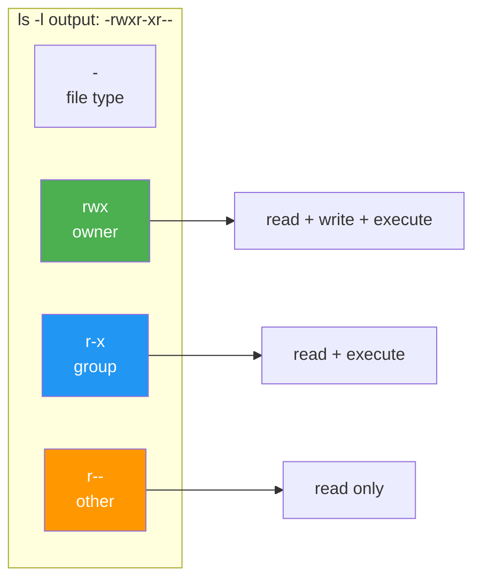

## 1.2.2 File Types, Ownership, and Basic Permissions


### Permission Bits Breakdown



#### Beyond "Everything is a File"

In Linux, literally everything is represented as a file – but not all files are created equal. There are seven file types, each with a distinct purpose. You identify them using the first character of `ls -l` output.

```bash
ls -l /dev /etc /usr/bin
```

**Example output:**

```
-rwxr-xr-x 1 root root    12345 Jan 15 10:00 /usr/bin/ls
drwxr-xr-x 2 root root     4096 Jan 15 09:00 /etc/ssh
lrwxrwxrwx 1 root root        7 Jan 15 08:00 /bin -> usr/bin
crw-rw-rw- 1 root root    1, 3 Jan 15 08:00 /dev/null
brw-rw---- 1 root disk    8, 0 Jan 15 08:00 /dev/sda
srwxr-xr-x 1 root root        0 Jan 15 09:00 /var/run/docker.sock
prw-r--r-- 1 root root        0 Jan 15 08:00 /run/myfifo
```

***

## The Seven File Types

| Character | File Type         | Example                        | Description                                                             |
| --------- | ----------------- | ------------------------------ | ----------------------------------------------------------------------- |
| `-`       | Regular file      | `/etc/hostname`, `/usr/bin/ls` | Normal data: text, binary, images, libraries                            |
| `d`       | Directory         | `/home`, `/etc`                | Folder containing other files and subdirectories                        |
| `l`       | Symbolic link     | `/bin -> /usr/bin`             | Pointer to another file (like a shortcut)                               |
| `c`       | Character device  | `/dev/null`, `/dev/tty`        | Transfers data character by character (keyboard, serial ports)          |
| `b`       | Block device      | `/dev/sda`, `/dev/nvme0n1`     | Transfers data in fixed-size blocks (disks, USB drives)                 |
| `s`       | Socket            | `/var/run/docker.sock`         | Inter-process communication (IPC) – like a network connection but local |
| `p`       | Named pipe (FIFO) | Created with `mkfifo`          | Unidirectional data flow between processes                              |

**Practical distinction:**

* **Character devices** – No buffering, immediate I/O. Example: typing on keyboard sends each character immediately.

* **Block devices** – Buffered, random access. Example: reading a file from disk reads whole blocks (4KB) at a time.

```bash
# Create a named pipe and use it
mkfifo mypipe
echo "hello" > mypipe &   # Background write
cat mypipe                # Read from pipe (prints "hello")
rm mypipe
```

***

## Understanding `ls -l` Output

The long listing format contains exactly 7 fields (space-separated).

```
-rwxr-xr-x 1 root root 12345 Jan 15 10:00 filename.txt
[1]        [2][3]  [4]  [5]  [6]    [7]
```

| Field | Content        | Meaning                                       |
| ----- | -------------- | --------------------------------------------- |
| 1     | `-rwxr-xr-x`   | File type + permissions (10 characters)       |
| 2     | `1`            | Number of hard links (see note below)         |
| 3     | `root`         | Owner (user who owns the file)                |
| 4     | `root`         | Group (group that has permissions)            |
| 5     | `12345`        | File size in bytes                            |
| 6     | `Jan 15 10:00` | Last modification time                        |
| 7     | `filename.txt` | File name (plus symlink target if applicable) |

**Hard links note:** A hard link is an additional name for the same file data. When you create a file, it has 1 link. Creating a hard link (`ln file1 file2`) increases this count. The file is only deleted when the link count reaches 0.

```bash
# Example of hard links
echo "content" > original.txt
ln original.txt hardlink.txt
ls -l original.txt hardlink.txt
# Both show link count 2, same inode number (ls -i to see inode)

# See inode numbers (same inode = same data)
ls -li original.txt hardlink.txt
# 1234567 -rw-r--r-- 2 user user 8 Jan 15 10:00 hardlink.txt
# 1234567 -rw-r--r-- 2 user user 8 Jan 15 10:00 original.txt
```

**Hard links vs Symbolic links:**

| Feature            | Hard Link                    | Symbolic Link (Symlink)       |
| ------------------ | ---------------------------- | ----------------------------- |
| Syntax             | `ln source target`           | `ln -s source target`         |
| Cross filesystem   | No                           | Yes                           |
| Points to          | Same inode (data)            | Path string                   |
| Original deleted   | Data remains accessible      | Becomes broken (dangling)     |
| Identifies as      | Regular file (`-`)           | Link (`l`)                    |
| Directories        | Not allowed (except root)    | Allowed                       |

```bash
# Create a symlink
ln -s /var/log/syslog ~/syslog_link

# Check where symlink points
readlink ~/syslog_link
# Output: /var/log/syslog

# Check if symlink is broken
ls -l ~/syslog_link   # Shows target; red color if broken in most terminals
```

***

## Decoding Permission Strings (10 Characters)

Take `-rwxr-xr-x` and break it into groups:

```
-  rwx  r-x  r-x
[1] [2]  [3]  [4]
```

| Position | Meaning                    | Values                            |
| -------- | -------------------------- | --------------------------------- |
| 1        | File type                  | `-`, `d`, `l`, `c`, `b`, `s`, `p` |
| 2        | Owner permissions (user)   | `r`, `w`, `x`, or `-`             |
| 3        | Group permissions          | `r`, `w`, `x`, or `-`             |
| 4        | Others permissions (world) | `r`, `w`, `x`, or `-`             |

**Each permission triplet:**

* `r` – Read: View file contents, list directory entries

* `w` – Write: Modify file, create/delete files in directory

* `x` – Execute: Run as program, traverse (cd into) directory

```bash
# Common permission patterns
-rw------- (600)  # Owner read/write, no one else
-rw-r--r-- (644)  # Owner read/write, group/others read only
-rwxr-xr-x (755)  # Owner full, group/others read+execute
-rwx------ (700)  # Owner full, others nothing
drwxr-xr-x (755)  # Directory (note 'd' at start)
```

***

## Changing Permissions: `chmod`

`chmod` = **ch**ange **mod**e. Two syntaxes: symbolic (letters) and octal (numbers).

### Symbolic Mode (More Intuitive for Beginners)

```
chmod [who][operation][permission] file
```

| Who | Meaning    | Operation       | Permission  |
| --- | ---------- | --------------- | ----------- |
| `u` | user/owner | `+` add         | `r` read    |
| `g` | group      | `-` remove      | `w` write   |
| `o` | others     | `=` set exactly | `x` execute |
| `a` | all (ugo)  | <br />          | <br />      |

**Examples:**

```bash
# Give owner execute permission
chmod u+x script.sh

# Remove write permission from group and others
chmod go-w config.conf

# Set group to read-only (exactly)
chmod g=r file.txt

# Give everyone read and execute (commonly for directories)
chmod a+rx /shared/path

# Recursive on directory (capital -R)
chmod -R u+rwX /my/dir   # Capital X = execute only if it's a directory or already executable
```

### Octal Mode (Faster Once Memorized)

Each permission is a binary digit: `r=4`, `w=2`, `x=1`. Sum them for each triplet.

| Permission | Binary | Octal |
| ---------- | ------ | ----- |
| `---`      | 000    | 0     |
| `--x`      | 001    | 1     |
| `-w-`      | 010    | 2     |
| `-wx`      | 011    | 3     |
| `r--`      | 100    | 4     |
| `r-x`      | 101    | 5     |
| `rw-`      | 110    | 6     |
| `rwx`      | 111    | 7     |

**Common octal values:**

```bash
chmod 755 script.sh    # rwxr-xr-x
chmod 644 data.txt     # rw-r--r--
chmod 600 secret.key   # rw-------
chmod 700 private_dir  # rwx------
chmod 1777 /tmp        # rwxrwxrwt (sticky bit – covered in 1.3)
```

**Why 755?** Owner: 7 (rwx), Group: 5 (r-x), Others: 5 (r-x)

***

## Changing Ownership: `chown` and `chgrp`

```bash
# Change owner only
sudo chown alice file.txt

# Change owner and group
sudo chown alice:developers file.txt

# Change group only
sudo chgrp developers file.txt

# Recursive on directory
sudo chown -R alice:developers /project/

# Reference another file's ownership (copy)
sudo chown --reference=template.txt target.txt
```

**Security note:** Regular users cannot change ownership of files they don't own. Only `root` can use `chown`. This prevents privilege escalation.

***

## Default Permissions: `umask`

When you create a new file or directory, Linux applies default permissions. The `umask` (user file-creation mode mask) subtracts permissions from the base.

| Object    | Base Permission | umask subtracts | Result          |
| --------- | --------------- | --------------- | --------------- |
| File      | 666 (rw-rw-rw-) | 022             | 644 (rw-r--r--) |
| Directory | 777 (rwxrwxrwx) | 022             | 755 (rwxr-xr-x) |

```bash
# View current umask
umask
# Output: 0022 (common) or 0002 (if user primary group is used)

# Set umask temporarily
umask 077   # Creates files with 600, directories with 700

# Set umask permanently (add to ~/.bashrc or /etc/profile)
echo "umask 027" >> ~/.bashrc
```

**umask of 022:** Owner retains all permissions; group and others lose write.\
**umask of 077:** Owner retains all; group and others lose all permissions.

```bash
# Demonstrate umask
umask 022
touch newfile.txt
mkdir newdir
ls -ld newfile.txt newdir
# -rw-r--r-- (644)
# drwxr-xr-x (755)

umask 077
touch private.txt
mkdir privatedir
ls -ld private.txt privatedir
# -rw------- (600)
# drwx------ (700)
```

***

## Special Permissions Preview (Detailed in 1.3.3)

These three permissions will be covered in Subchapter 1.3, but here is a quick preview:

| Permission          | Symbol                       | Octal | Effect                                                          |
| ------------------- | ---------------------------- | ----- | --------------------------------------------------------------- |
| SUID (Set User ID)  | `s` instead of `x` in owner  | 4xxx  | Execute as file owner, not as invoking user                     |
| SGID (Set Group ID) | `s` instead of `x` in group  | 2xxx  | Execute as group owner; on directories, new files inherit group |
| Sticky Bit          | `t` instead of `x` in others | 1xxx  | Only owner can delete files in directory                        |

```bash
# Examples (do not use yet – will be explained in 1.3)
chmod u+s /usr/bin/passwd   # SUID (passwd needs to write to /etc/shadow)
chmod g+s /shared           # SGID on directory
chmod +t /tmp               # Sticky bit (prevents users from deleting others' temp files)
```

***

## Practical Examples for Platform Engineers

### Example 1: Securing an SSH Private Key

```bash
# Generate key (creates with 600 automatically)
ssh-keygen -t ed25519 -f ~/.ssh/id_ed25519

# Verify permissions
ls -l ~/.ssh/id_ed25519
# -rw------- (600) – good

# If permissions are wrong, SSH will refuse to use it
chmod 600 ~/.ssh/id_ed25519
```

### Example 2: Shared Project Directory

```bash
# Create group for project
sudo groupadd webdev

# Add users to group
sudo usermod -aG webdev alice
sudo usermod -aG webdev bob

# Create shared directory with SGID (preview – full explanation in 1.3)
sudo mkdir /srv/webapp
sudo chown :webdev /srv/webapp
sudo chmod 2770 /srv/webapp   # 2 = SGID, 770 = rwxrwx---
# New files will inherit 'webdev' group
```

### Example 3: Restoring Permissions After Copy

When you copy files, permissions may change. Use `rsync -p` or `cp -p` to preserve.

```bash
# Copy preserving permissions, timestamps, ownership (if root)
cp -p original.txt backup.txt

# Or with rsync (covered in 1.2.3)
rsync -av --chmod=644 original.txt destination/
```

### Example 4: Finding Files by Permission

Use `find` to locate files with specific permission patterns:

```bash
# Find world-writable files (security audit)
find /home -type f -perm -o=w 2>/dev/null

# Find SUID binaries (security audit)
find /usr -type f -perm -4000 2>/dev/null

# Find files with no owner (orphaned)
find /home -nouser 2>/dev/null
```

**See also:** [1.8.1 Find and Grep](../Subchapter_1.8/1.8.1_Find_and_Grep.md) for comprehensive `find` usage.

***

## Advanced File Information: stat Command

The `stat` command shows comprehensive file metadata beyond what `ls -l` provides.

```bash
stat myfile.txt
```

**Example output:**

```
  File: myfile.txt
  Size: 1234        Blocks: 8          IO Block: 4096   regular file
Device: 801h/2049d  Inode: 131073      Links: 1
Access: (0644/-rw-r--r--)  Uid: ( 1000/   user)   Gid: ( 1000/   user)
Access: 2024-01-15 10:30:00.123456789 +0000
Modify: 2024-01-15 09:15:30.987654321 +0000
Change: 2024-01-15 09:15:30.987654321 +0000
 Birth: 2024-01-14 08:00:00.000000000 +0000
```

**Key fields:**

| Field   | Meaning                                                  |
| ------- | -------------------------------------------------------- |
| Size    | File size in bytes                                       |
| Blocks  | Number of 512-byte blocks allocated                      |
| Inode   | Unique identifier on the filesystem                      |
| Links   | Number of hard links                                     |
| Access  | Last access time (when file was read)                    |
| Modify  | Last modification time (when content changed)            |
| Change  | Last status change time (when permissions/owner changed) |
| Birth   | Creation time (not all filesystems support this)         |

```bash
# Custom format output (useful for scripting)
stat --format="%U:%G %a %n" myfile.txt
# Output: user:user 644 myfile.txt

# Show only permissions in octal
stat -c "%a" myfile.txt
# Output: 644

# Show inode number
stat -c "%i" myfile.txt
```

***

## File Attributes: lsattr and chattr

Beyond standard permissions, Linux ext2/ext3/ext4 filesystems support **extended attributes** that provide additional protections.

### Viewing Attributes: `lsattr`

```bash
lsattr myfile.txt
# Output: --------------e----- myfile.txt
# The 'e' means extents format (normal for ext4)
```

### Setting Attributes: `chattr`

| Attribute | Flag | Meaning                                          |
| --------- | ---- | ------------------------------------------------ |
| Immutable | `i`  | File cannot be modified, deleted, or renamed     |
| Append    | `a`  | File can only be opened in append mode           |
| No dump   | `d`  | File is excluded from `dump` backup utility      |
| Secure delete | `s` | Blocks are zeroed when file is deleted         |
| Synchronous | `S` | Changes are written synchronously to disk       |

```bash
# Make a file immutable (even root cannot modify without removing attribute)
sudo chattr +i /etc/critical.conf
lsattr /etc/critical.conf
# ----i---------e----- /etc/critical.conf

# Attempt to modify (will fail)
sudo echo "test" >> /etc/critical.conf
# bash: /etc/critical.conf: Operation not permitted

# Remove immutable attribute
sudo chattr -i /etc/critical.conf

# Make a log file append-only (can add, cannot delete content)
sudo chattr +a /var/log/audit.log
```

**Platform engineering use cases:**

1. **Protect critical configs:** `chattr +i /etc/passwd /etc/shadow`
2. **Secure audit logs:** `chattr +a /var/log/secure` (attackers can't delete entries)
3. **Prevent accidental deletion:** `chattr +i /important/data`

**Caution:** If a file has the immutable attribute, you cannot modify it, delete it, or even change its permissions until you remove the attribute with `chattr -i`.

***

## Path Permission Resolution: namei

The `namei` command traces the path to a file, showing permissions at each level. This is invaluable for debugging "Permission denied" errors.

```bash
namei -l /var/log/nginx/access.log
```

**Example output:**

```
f: /var/log/nginx/access.log
drwxr-xr-x root root /
drwxr-xr-x root root var
drwxrwxr-x root syslog log
drwxr-x--- root adm   nginx
-rw-r----- www-data adm access.log
```

**Interpreting the output:**

Each line shows the permissions, owner, group, and directory name. To access a file, you need:
- `x` (execute/traverse) permission on **every directory** in the path
- `r` (read) permission on the **file itself** (or directory if listing)

In the example above:
- A user in the `adm` group can read the file
- A user NOT in `adm` and NOT `www-data` would get "Permission denied" at `/var/log/nginx/` (missing traverse permission)

```bash
# Useful for debugging permission issues
namei -l /home/user/.ssh/authorized_keys
# If any directory has wrong permissions (e.g., /home/user is 777), SSH will refuse
```

***

## Access Control Lists (ACLs) Preview

Standard Unix permissions are limited to one owner, one group, and others. **ACLs** (Access Control Lists) allow fine-grained permissions for multiple users and groups.

**Note:** Full ACL coverage is in Subchapter 1.3, but here's a preview.

```bash
# Check if filesystem supports ACLs
mount | grep acl
# Most modern filesystems have ACL enabled by default

# View ACLs on a file
getfacl myfile.txt
# Output (when no ACLs set):
# file: myfile.txt
# owner: user
# group: user
# user::rw-
# group::r--
# other::r--

# Add read permission for a specific user
setfacl -m u:alice:r myfile.txt

# Add read/write for a specific group
setfacl -m g:developers:rw myfile.txt

# View extended ACLs
getfacl myfile.txt
# user::rw-
# user:alice:r--
# group::r--
# group:developers:rw-
# mask::rw-
# other::r--

# Remove ACLs
setfacl -b myfile.txt  # Remove all ACLs
setfacl -x u:alice myfile.txt  # Remove specific entry
```

**When** `ls -l` **shows a** `+` **sign:**

```bash
-rw-rw-r--+ 1 user user 1234 Jan 15 10:00 myfile.txt
#         ^ This plus sign indicates ACLs are set
```

***

## Quick Task: Permission Manipulation

*Create a playground directory to practice safely.*

1. Create a directory `~/perm_lab`. Inside, create `script.sh` with content `#!/bin/bash\necho "Hello"`.
2. Without `chmod`, what are the permissions of `script.sh`? (Check with `ls -l`)
3. Make the script executable for the owner only.
4. Create a file `secret.txt` and set permissions so that owner can read/write, but group and others can read.
5. Change the umask to 027, then create a new file `umask_test.txt`. What are its permissions?
6. Reset umask to 022 after the experiment.

> **Ready Solution:**
>
> ```bash
> # Task 1
> mkdir -p ~/perm_lab
> cd ~/perm_lab
> echo -e '#!/bin/bash\necho "Hello"' > script.sh
>
> # Task 2
> ls -l script.sh
> # -rw-r--r-- (644) – not executable because no x
>
> # Task 3
> chmod u+x script.sh
> # Now -rwxr--r-- (744)
>
> # Task 4
> touch secret.txt
> chmod 644 secret.txt
> # Or symbolic: chmod u=rw,go=r secret.txt
>
> # Task 5
> umask 027
> touch umask_test.txt
> ls -l umask_test.txt
> # Base 666, subtract 027 = 640 (rw-r-----)
> # Owner: rw- (6), Group: r-- (4), Others: --- (0)
>
> # Task 6
> umask 022
> cd ~
> rm -rf ~/perm_lab   # Clean up
> ```

***

## Summary Table: Permission Basics

| Command            | Purpose                | Example            | Common Flags                        |
| ------------------ | ---------------------- | ------------------ | ----------------------------------- |
| `ls -l`            | View permissions       | `ls -l file`       | `-a` (all), `-d` (directory itself) |
| `chmod` (symbolic) | Change perms (letters) | `chmod u+x file`   | `-R` (recursive)                    |
| `chmod` (octal)    | Change perms (numbers) | `chmod 755 file`   | `-R` (recursive)                    |
| `chown`            | Change owner           | `chown alice file` | `-R`, `--reference`                 |
| `chgrp`            | Change group           | `chgrp staff file` | `-R`                                |
| `umask`            | Set default perms      | `umask 022`        | (no flags)                          |

**Permission calculation quick reference:**

* New file permission = `666 - umask` (then remove execute bits unless explicitly set)

* New directory permission = `777 - umask`

* `umask 022` → files `644`, directories `755`

* `umask 077` → files `600`, directories `700`

***

**Next note (1.2.3)** will cover archiving with `tar` and efficient file synchronization with `rsync` – essential for backups and deployments.

---

## Backlinks

- **Previous:** [1.2.1 FHS Deep Dive](1.2.1_FHS_Deep_Dive.md) – Directory hierarchy where files live
- **Related:** [1.1.2 CLI Basics](../Subchapter_1.1/1.1.2_CLI_Basics_and_Philosophy.md) – "Everything is a file" concept
- **Forward:** [1.3.3 SUID, SGID, Sticky Bit and ACLs](../Subchapter_1.3/1.3.3_SUID_SGID_Sticky_Bit_and_ACLs.md) – Special permissions (SUID/SGID/sticky bit) covered in detail
- **Next:** [1.2.3 Archiving and Syncing](1.2.3_Archiving_and_Syncing.md) – `tar` preserving permissions (`-p` flag), `rsync` syncing ownership
