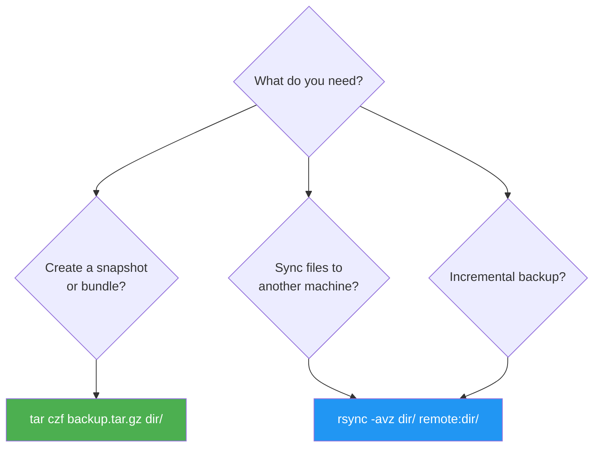

## 1.2.3 Archiving and Syncing: tar and rsync


### tar vs rsync Decision



#### Why Archive and Sync?

As a platform engineer, you will constantly move files between systems: deploying application artifacts, backing up configurations, transferring logs for analysis, or replicating environment state. Two tools dominate this space:

* **`tar`** – **T**ape **AR**chive. Bundles multiple files into a single file (archive), optionally compresses it. Ideal for snapshots, backups, and distributing directory trees.

* **`rsync`** – **R**emote **sync**. Efficiently synchronizes files and directories between local paths or over SSH. Transfers only differences (deltas), not entire files. Essential for incremental backups and deployments.

***

## Part 1: tar – The Archiving Workhorse

### Basic Concepts

`tar` creates **archives** (often called tarballs) with the extension `.tar`. It preserves:

* Directory structure

* File permissions (see 1.2.2 – `chmod` bits)

* Ownership (if run as root or with `--same-owner`)

* Timestamps

* Symlinks (as links, not followed)

**Common compression options:**

| Flag   | Compression | Extension             | Speed     | Size     |
| ------ | ----------- | --------------------- | --------- | -------- |
| `-z`   | gzip        | `.tar.gz` or `.tgz`   | Medium    | Small    |
| `-j`   | bzip2       | `.tar.bz2` or `.tbz2` | Slow      | Smaller  |
| `-J`   | xz          | `.tar.xz`             | Very slow | Smallest |
| (none) | none        | `.tar`                | Instant   | Largest  |

**For platform engineering:** `-z` (gzip) is the most common balance of speed and compression. `-J` (xz) is used for distributing source code (e.g., Linux kernel tarballs).

### Essential tar Operations

```bash
# CREATE an archive (c = create, v = verbose, f = file)
tar -cvf archive.tar /path/to/dir

# CREATE with gzip compression
tar -czvf archive.tar.gz /path/to/dir

# CREATE with bzip2 compression
tar -cjvf archive.tar.bz2 /path/to/dir

# EXTRACT an archive (x = extract)
tar -xvf archive.tar

# EXTRACT gzipped archive
tar -xzvf archive.tar.gz

# EXTRACT to specific directory (-C = change to directory before extracting)
tar -xzvf archive.tar.gz -C /target/dir

# LIST contents without extracting (t = list)
tar -tvf archive.tar.gz

# EXTRACT specific files from archive
tar -xzvf archive.tar.gz --wildcards "*.conf" "data/*.txt"

# EXCLUDE patterns during creation
tar -czvf backup.tar.gz /home/user --exclude="*.log" --exclude="cache"
```

### Explained: Every Flag

| Flag | Long form                | Meaning                                                           |
| ---- | ------------------------ | ----------------------------------------------------------------- |
| `-c` | `--create`               | Create a new archive                                              |
| `-x` | `--extract`              | Extract files from archive                                        |
| `-t` | `--list`                 | List archive contents                                             |
| `-v` | `--verbose`              | Show files being processed                                        |
| `-f` | `--file`                 | Archive file name (must be last flag before name)                 |
| `-z` | `--gzip`                 | Filter through gzip                                               |
| `-j` | `--bzip2`                | Filter through bzip2                                              |
| `-J` | `--xz`                   | Filter through xz                                                 |
| `-C` | `--directory`            | Change to directory before operation                              |
| `-p` | `--preserve-permissions` | Extract with original permissions (important for system recovery) |

**Critical rule:** The `-f` flag must be immediately followed by the archive filename. If you type `tar -fvz archive.tar.gz` (flags out of order), `tar` will interpret `archive.tar.gz` as the next flag. Correct: `tar -f archive.tar.gz -xvz` or `tar -xzvf archive.tar.gz`.

**Modern tar auto-detection:** Recent versions of GNU tar can auto-detect compression format during extraction:

```bash
# tar auto-detects gzip, bzip2, xz based on file content
tar -xvf archive.tar.gz    # No -z needed
tar -xvf archive.tar.xz    # No -J needed
```

However, always specify compression flag when **creating** archives.

### Real-World Examples for Platform Engineers

#### Example 1: Backup a Configuration Directory

```bash
# Backup /etc/nginx with timestamp
TIMESTAMP=$(date +%Y%m%d_%H%M%S)
tar -czvf /backups/nginx_${TIMESTAMP}.tar.gz /etc/nginx

# Verify archive integrity (list contents)
tar -tzvf /backups/nginx_${TIMESTAMP}.tar.gz | head -20
```

#### Example 2: Extract a Single File from a Large Archive

```bash
# Extract only the SSL certificate from a full system backup
tar -xzvf full_backup.tar.gz --wildcards "etc/ssl/certs/mycert.crt" -C /tmp/restore/
```

#### Example 3: Create an Archive While Excluding Temporary Files

```bash
# Backup user home but skip caches, logs, and temporary files
tar -czvf user_home_backup.tar.gz /home/developer \
    --exclude="*.log" \
    --exclude="*/.cache/*" \
    --exclude="*/tmp/*" \
    --exclude=".git"
```

#### Example 4: Preserve Permissions During Extract (Critical for System Recovery)

```bash
# Extract while preserving ownership and permissions (must be root)
sudo tar -xzvpf system_backup.tar.gz -C /
# The -p ensures SUID bits, ownership, and permissions are exactly restored
```

***

## Modern Compression Alternatives

### Zstandard (zstd) – The Modern Choice

`zstd` offers better compression ratios than gzip with faster speeds. Increasingly used in modern Linux distributions (Arch, Fedora use it for packages).

```bash
# Create with zstd compression (requires tar 1.31+ or separate zstd)
tar -I zstd -cvf archive.tar.zst /path/to/dir

# Or using zstd directly
tar -cvf - /path/to/dir | zstd -o archive.tar.zst

# Extract zstd archive
tar -I zstd -xvf archive.tar.zst

# Compression levels (1=fast/low to 19=slow/high, default=3)
tar -cvf - /path/to/dir | zstd -19 -o archive.tar.zst
```

| Compression | tar flag | Speed       | Ratio   | Best For                        |
| ----------- | -------- | ----------- | ------- | ------------------------------- |
| gzip        | `-z`     | Medium      | Medium  | General use, maximum compatibility |
| bzip2       | `-j`     | Slow        | High    | Legacy, avoid for large files   |
| xz          | `-J`     | Very slow   | Highest | Source distribution, long-term storage |
| **zstd**    | `-I zstd`| **Fast**    | **High** | **Modern systems, large backups** |

### Parallel Compression with pigz

`pigz` is a parallel implementation of gzip that uses multiple CPU cores.

```bash
# Install pigz
sudo apt install pigz   # Debian/Ubuntu
sudo dnf install pigz   # RHEL/Fedora

# Use pigz with tar
tar -cvf - /large/directory | pigz > archive.tar.gz

# Specify number of threads
tar -cvf - /large/directory | pigz -p 4 > archive.tar.gz

# Extract (use unpigz or pigz -d)
unpigz -c archive.tar.gz | tar -xvf -
# Or simply use tar -xzvf (pigz-compressed files are gzip-compatible)
```

**Performance comparison (compressing 10GB of logs):**

| Tool  | Threads | Time    | CPU Usage |
| ----- | ------- | ------- | --------- |
| gzip  | 1       | 5:30    | 100%      |
| pigz  | 4       | 1:25    | 400%      |
| pigz  | 8       | 0:50    | 800%      |
| zstd  | 1       | 1:00    | 100%      |

***

## Archive Verification and Integrity

### Verify Archive Contents

```bash
# List contents to verify archive isn't corrupted
tar -tvf archive.tar.gz > /dev/null
echo $?  # 0 = success, non-zero = error

# Verify gzip integrity
gzip -t archive.tar.gz
echo $?  # 0 = OK

# Verify with verbose output
gzip -tv archive.tar.gz
# archive.tar.gz: OK

# For zstd
zstd -t archive.tar.zst
```

### Compare Archive with Source

```bash
# Diff archive contents against original (tar)
tar --diff -f archive.tar -C /original/path

# Verify immediately after creation
tar -czvf archive.tar.gz /path/to/dir && tar -tvf archive.tar.gz > /dev/null
```

***

## Split Archives for Large Files

When dealing with very large archives or filesystem limitations (FAT32 max file size 4GB), split the archive.

```bash
# Create and split into 1GB chunks
tar -czvf - /large/directory | split -b 1G - backup.tar.gz.part_

# Result: backup.tar.gz.part_aa, backup.tar.gz.part_ab, ...

# Reassemble and extract
cat backup.tar.gz.part_* | tar -xzvf -

# Alternative: create split archive directly
tar -cvf - /large/directory | gzip | split -b 1G - backup.tar.gz.
```

***

## Progress Monitoring with pv

`pv` (pipe viewer) shows progress for piped operations.

```bash
# Install pv
sudo apt install pv   # Debian/Ubuntu
sudo dnf install pv   # RHEL/Fedora

# Create archive with progress bar
tar -cvf - /large/directory | pv | gzip > archive.tar.gz

# With size estimate (more accurate progress)
tar -cvf - /large/directory | pv -s $(du -sb /large/directory | cut -f1) | gzip > archive.tar.gz

# Extract with progress
pv archive.tar.gz | tar -xzf -
```

**Example output:**

```
2.5GiB 0:01:30 [28.3MiB/s] [=============>              ] 45% ETA 0:01:50
```

***

## Part 2: rsync – Efficient Synchronization

### Why rsync Over scp or cp?

| Tool    | Transfer Type | Delta Transfer | Compression   | Preserve Permissions | Resume Interrupted   |
| ------- | ------------- | -------------- | ------------- | -------------------- | -------------------- |
| `cp`    | Local only    | No             | No            | Yes (with -p)        | N/A                  |
| `scp`   | Full file     | No             | No            | No                   | No                   |
| `rsync` | Delta         | Yes            | Yes (with -z) | Yes (with -a)        | Yes (with --partial) |

`rsync` uses a clever algorithm: it breaks files into blocks, computes checksums, and transfers only changed blocks. For large files (database dumps, log files) with minor changes, this is dramatically faster.

### Basic rsync Syntax

```bash
# Local sync
rsync [options] source destination

# Remote sync over SSH (pull – remote to local)
rsync [options] user@host:/remote/path /local/path

# Remote sync over SSH (push – local to remote)
rsync [options] /local/path user@host:/remote/path
```

### Essential rsync Flags (Memorize These)

| Flag        | Meaning                                                                            | Why You Need It                                     |
| ----------- | ---------------------------------------------------------------------------------- | --------------------------------------------------- |
| `-a`        | Archive mode (recursive, preserve perms, ownership, timestamps, symlinks, devices) | Standard for backups and mirroring                  |
| `-v`        | Verbose                                                                            | See what's being transferred                        |
| `-z`        | Compress during transfer                                                           | Reduces bandwidth (good over WAN)                   |
| `-P`        | `--partial --progress`                                                             | Show progress and keep partially transferred files  |
| `-n`        | Dry-run                                                                            | Preview changes without making them                 |
| `--delete`  | Remove extraneous files in destination                                             | Makes destination identical to source (DANGEROUS)   |
| `-e`        | Specify remote shell                                                               | `rsync -e "ssh -p 2222"` for non-standard SSH ports |
| `--exclude` | Exclude patterns                                                                   | Skip logs, temp files, caches                       |

### The Archive Flag (-a) Explained

`-a` is equivalent to `-rlptgoD` (recursive, links, perms, times, group, owner, devices). It does NOT include `-H` (hard links) or `-A` (ACLs) or `-X` (extended attributes) – those need separate flags.

```bash
# What -a gives you:
# -r  recursive
# -l  copy symlinks as symlinks
# -p  preserve permissions
# -t  preserve timestamps
# -g  preserve group
# -o  preserve owner (requires root)
# -D  preserve device files (requires root)
```

### Practical rsync Patterns

#### Pattern 1: One-Way Mirror (Production to Backup)

```bash
# Sync /var/www to backup server, deleting files on backup that no longer exist in source
rsync -avz --delete /var/www/ backup@192.168.1.100:/backup/www/
# Trailing slash on source means "copy contents of /var/www", not the directory itself
# Without trailing slash: creates /backup/www/www/
```

#### Pattern 2: Incremental Backup with Timestamp

```bash
# First full backup
rsync -av /important/data /backup/backup_$(date +%Y%m%d)

# Later, sync only changes to a new timestamped folder (uses hard links for unchanged)
rsync -av --link-dest=/backup/backup_20240115 /important/data /backup/backup_20240122
# Files unchanged from 20240115 become hard links (no duplicate space)
```

#### Pattern 3: Deploy Application with Exclusions

```bash
# Deploy to server, excluding version control and local configs
rsync -avz --exclude='.git' --exclude='*.local.yaml' \
    ./myapp/ deploy@server:/opt/myapp/
```

#### Pattern 4: Bandwidth-Limited Sync

```bash
# Limit to 1000 KBps (useful for production hours)
rsync -avz --bwlimit=1000 largefile.dat user@host:/destination/
```

#### Pattern 5: Dry Run First – Always!

```bash
# Preview what would happen
rsync -avzn --delete source/ dest/
# The -n (dry-run) shows changes without applying

# Then run for real after verification
rsync -avz --delete source/ dest/
```

### Understanding Trailing Slashes (Common Pitfall)

```bash
# Copy directory ITSELF
rsync -av /source/dir /dest/      # Creates /dest/dir/

# Copy CONTENTS of directory
rsync -av /source/dir/ /dest/     # Copies files into /dest/ directly
```

**Test this yourself:**

```bash
mkdir -p /tmp/src/subdir
touch /tmp/src/file1.txt
mkdir /tmp/dest

rsync -av /tmp/src/ /tmp/dest/    # Contents: /tmp/dest/file1.txt, /tmp/dest/subdir/
rsync -av /tmp/src /tmp/dest2/    # Creates: /tmp/dest2/src/file1.txt, /tmp/dest2/src/subdir/
```

### Remote Sync Over SSH (Most Common in Production)

```bash
# Push local directory to remote server
rsync -avz -e "ssh -i ~/.ssh/production_key" \
    ./build/ ubuntu@prod-server:/var/www/html/

# Pull remote logs locally
rsync -avzP ubuntu@prod-server:/var/log/nginx/ ./local_logs/

# Using custom SSH port
rsync -avz -e "ssh -p 2222" /local/data user@host:/remote/data
```

### Checksum Verification Mode

By default, rsync uses file size + modification time to detect changes. For critical data, use checksum mode:

```bash
# Force checksum comparison (slower but more reliable)
rsync -avc source/ dest/
# -c = skip based on checksum, not mod-time & size

# Useful when timestamps are unreliable (e.g., after restore from backup)
```

### Common rsync Gotchas

```bash
# DANGEROUS: --delete removes destination files not in source
rsync -av --delete source/ dest/   # Deletes extra files in dest!

# SAFER: Use --dry-run first
rsync -av --delete --dry-run source/ dest/

# VERY DANGEROUS: Empty source with --delete
rsync -av --delete /empty/ /important/   # Deletes everything in /important!
```

***

## Advanced rsync Features

### Checksum Mode for Data Integrity

By default, rsync compares files by size and modification time. Use `-c` to compare by checksum (slower but guarantees data integrity).

```bash
# Force checksum comparison (slower but accurate)
rsync -avc source/ dest/

# Useful when clocks are not synced or timestamps are unreliable
rsync -avc /nfs/data/ /local/backup/
```

### Rsync Daemon Mode

Rsync can run as a daemon (service) for faster repeated transfers without SSH overhead.

**Server side (/etc/rsyncd.conf):**

```ini
# /etc/rsyncd.conf
[backups]
    path = /srv/backups
    comment = Backup storage
    read only = no
    auth users = backupuser
    secrets file = /etc/rsyncd.secrets

[public]
    path = /srv/public
    comment = Public files
    read only = yes
```

```bash
# Start rsync daemon
sudo rsync --daemon

# Or via systemd
sudo systemctl start rsyncd
sudo systemctl enable rsyncd
```

**Client side:**

```bash
# Connect to rsync daemon (double colon syntax)
rsync -avz rsync://server/backups/ /local/restore/

# With authentication
rsync -avz backupuser@server::backups/ /local/restore/
# Prompts for password (or use RSYNC_PASSWORD env var)
```

**SSH mode vs Daemon mode:**

| Feature        | SSH Mode (`user@host:path`)     | Daemon Mode (`host::module`)    |
| -------------- | ------------------------------- | ------------------------------- |
| Authentication | SSH keys/passwords              | Rsync-specific secrets file     |
| Encryption     | Fully encrypted                 | Not encrypted (use VPN/firewall)|
| Setup          | No server config needed         | Requires rsyncd.conf            |
| Performance    | SSH overhead per connection     | Faster for repeated transfers   |
| Use case       | Ad-hoc transfers, security      | Automated backups, high volume  |

### Rsync with Include/Exclude Files

For complex filtering, use files listing patterns.

```bash
# Create exclude file
cat > /tmp/exclude.txt << 'EOF'
*.log
*.tmp
.git/
node_modules/
__pycache__/
.cache/
EOF

# Use exclude file
rsync -av --exclude-from=/tmp/exclude.txt source/ dest/

# Include file (whitelist approach)
cat > /tmp/include.txt << 'EOF'
+ *.py
+ *.yaml
+ *.json
- *
EOF

rsync -av --include-from=/tmp/include.txt source/ dest/
```

### Atomic Updates with --backup and --suffix

```bash
# Keep backup of overwritten files
rsync -av --backup --suffix=.bak source/ dest/
# Overwritten files become filename.bak

# Backup to separate directory
rsync -av --backup --backup-dir=/backups/$(date +%Y%m%d) source/ dest/
```

***

## Combining tar and rsync in Real Workflows

### Workflow 1: Transfer Large Directory Over Slow Link

```bash
# On source: create compressed archive
tar -czvf /tmp/data.tar.gz /large/directory

# Transfer archive with rsync (resumable)
rsync -avP /tmp/data.tar.gz user@remote:/tmp/

# On remote: extract
tar -xzvf /tmp/data.tar.gz -C /
```

### Workflow 2: Incremental Backup with tar Snapshots

```bash
# Create full backup
tar -czvf /backups/full_$(date +%Y%m%d).tar.gz /data

# Later, use rsync to sync only new/changed files to backup server
rsync -avz /backups/ backup-server:/backups/
```

### Workflow 3: Migrate Live Application Data

```bash
# First sync with non-critical downtime (transfer most data)
rsync -avz /app/data/ user@new-server:/app/data/

# Brief maintenance window: final sync (only differences)
rsync -avz --delete /app/data/ user@new-server:/app/data/

# Switch traffic to new server
```

***

## Quick Task: Archive and Sync Lab

*Create a lab environment to practice both tools.*

1. Create a directory structure: `~/lab/{docs,scripts,logs}`. Add sample files: `docs/readme.txt`, `scripts/deploy.sh`, `logs/app.log`.
2. Create a gzipped tar archive of the entire `~/lab` directory, excluding the `logs` folder.
3. List the contents of the archive without extracting.
4. Extract the archive to `/tmp/lab_restore`.
5. Using `rsync`, sync only the `scripts` directory to a remote server (if you have one) OR to a local backup directory `~/lab_backup`.
6. Add a new file to `~/lab/scripts/new.sh`. Run the same `rsync` command again. Notice only the new file transfers.

> **Ready Solution (local rsync example):**
>
> ```bash
> # Task 1
> mkdir -p ~/lab/{docs,scripts,logs}
> echo "This is a doc" > ~/lab/docs/readme.txt
> echo '#!/bin/bash' > ~/lab/scripts/deploy.sh
> echo "Log entry" > ~/lab/logs/app.log
> chmod +x ~/lab/scripts/deploy.sh
>
> # Task 2 (exclude logs)
> tar -czvf ~/lab_backup.tar.gz -C ~ lab --exclude="lab/logs"
>
> # Task 3
> tar -tzvf ~/lab_backup.tar.gz
>
> # Task 4
> mkdir -p /tmp/lab_restore
> tar -xzvf ~/lab_backup.tar.gz -C /tmp/lab_restore
> ls /tmp/lab_restore/lab/
> # Should show docs/ and scripts/ but not logs/
>
> # Task 5 (local rsync)
> mkdir -p ~/lab_backup
> rsync -av ~/lab/scripts/ ~/lab_backup/scripts/
>
> # Task 6
> echo "echo 'new'" > ~/lab/scripts/new.sh
> chmod +x ~/lab/scripts/new.sh
> rsync -av ~/lab/scripts/ ~/lab_backup/scripts/
> # Output should show new.sh as the only file transferred
> ```

***

## Summary Table: tar vs rsync

| Operation                | tar Command                    | rsync Command                       |
| ------------------------ | ------------------------------ | ----------------------------------- |
| Create compressed backup | `tar -czvf backup.tar.gz dir/` | Not ideal for single archive        |
| Extract archive          | `tar -xzvf backup.tar.gz`      | N/A                                 |
| Local sync               | Not applicable                 | `rsync -av source/ dest/`           |
| Remote sync (over SSH)   | Combine with `scp`             | `rsync -avz local/ user@host:dest/` |
| Preserve permissions     | `-p` flag                      | `-a` flag includes `-p`             |
| Resume interrupted       | No (start over)                | Yes (with `-P`)                     |
| Delta transfer           | No                             | Yes                                 |
| Exclude patterns         | `--exclude`                    | `--exclude`                         |

**Rule of thumb:**

* Use `tar` for **point-in-time snapshots**, distributing software packages, or when you need a single archive file.

* Use `rsync` for **ongoing synchronization**, deployments, incremental backups, and any transfer where you want to minimize network usage.

***

---

## Backlinks

- **Previous:** [1.2.2 File Types and Permissions](1.2.2_File_Types_Permissions_Basics.md) – Permission basics that `tar -p` preserves
- **Related:** [1.4.1 SSH Protocol and Basics](../Subchapter_1.4/1.4.1_SSH_Protocol_and_Basics.md) – SSH used by `rsync -e ssh`
- **Related:** [1.9.1 Screen and Tmux](../Subchapter_1.9/1.9.1_Screen_and_Tmux.md) – Run long `rsync` transfers in persistent sessions
- **Next:** [1.2.4 Subchapter Review](1.2.4_Subchapter_Review.md) – Cheatsheet and interview questions for FHS, permissions, tar, rsync
