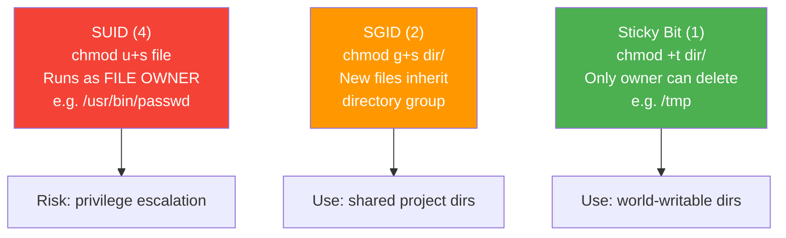

## 1.3.3 SUID, SGID, Sticky Bit, and Access Control Lists (ACLs)

#### Beyond Basic Permissions

Standard Unix permissions (owner/group/other with read/write/execute) work well for many scenarios but fall short when you need:

* A program to run with elevated privileges (e.g., `passwd` needs to write to `/etc/shadow`)

* A shared directory where all new files inherit a specific group

* A world-writable directory where users cannot delete each other's files (like `/tmp`)

* Fine-grained permissions for multiple users or groups on the same file


### Special Permission Bits



This note covers the three **special permission bits** (SUID, SGID, Sticky Bit) and **Access Control Lists (ACLs)** for granular control.

***

## Part 1: SUID – Set User ID

### What SUID Does

When a binary file has the SUID bit set, it executes **with the file owner's privileges**, not the invoking user's privileges. This is a powerful and potentially dangerous mechanism.

```bash
# Classic example: /usr/bin/passwd
ls -l /usr/bin/passwd
# -rwsr-xr-x 1 root root 68224 ... /usr/bin/passwd
#    ^
#    's' instead of 'x' in owner position = SUID
```

**Without SUID:** A normal user running `passwd` would lack permission to write to `/etc/shadow` (owned by root, readable only by root and shadow group).\
**With SUID:** The `passwd` process runs as `root`, can modify `/etc/shadow`, but only does so after verifying the user's old password and checking constraints.

### Identifying SUID Files

```bash
# Find all SUID binaries (owner has 's' or 'S' instead of 'x')
find / -type f -perm -4000 2>/dev/null

# The 's' in permission string
ls -l /bin/su
# -rwsr-xr-x (owner execute replaced with s)
```

### Setting and Removing SUID

```bash
# Symbolic method
chmod u+s /path/to/binary
chmod u-s /path/to/binary

# Octal method (4xxx prefix)
chmod 4755 /path/to/binary   # 4 = SUID, 755 = rwxr-xr-x

# Example: Create a SUID binary (DANGEROUS – demonstration only)
sudo chmod u+s /bin/bash   # NEVER do this – insecure!
```

**Octal breakdown for SUID:** `chmod 4755` = `4` (SUID) + `7` (owner rwx) + `5` (group r-x) + `5` (others r-x)

### SUID Capital 'S' vs Lowercase 's'

| Display | Meaning                                                               |
| ------- | --------------------------------------------------------------------- |
| `rws`   | SUID set **and** execute permission exists                            |
| `rwS`   | SUID set **but** execute permission missing (misconfigured – useless) |

```bash
# Create file with SUID but no execute (capital S)
touch testfile
chmod 4664 testfile   # 4=SUID, 664=rw-rw-r--
ls -l testfile
# -rwSrw-r-- 1 user group 0 ... testfile
# SUID has no effect because file isn't executable
```

### Security Implications

**Risks of SUID:**

* Any vulnerability in a SUID binary can lead to privilege escalation

* Excess SUID binaries increase attack surface

* Malicious users can exploit SUID binaries to read/write files they shouldn't

**Audit SUID binaries on production systems:**

```bash
# List all SUID/SGID binaries (security audit)
find / -type f \( -perm -4000 -o -perm -2000 \) -exec ls -la {} \; 2>/dev/null
```

***

## Part 2: SGID – Set Group ID

### SGID on Files (Binary Execution)

When SGID is set on an **executable file**, the process runs with the **file's group** privileges, not the invoking user's group.

```bash
# Example: /usr/bin/write (notify users)
ls -l /usr/bin/write
# -rwxr-sr-x 1 root tty 19536 ... /usr/bin/write
#        ^
#        's' in group position = SGID
```

### SGID on Directories (Most Common Use)

When SGID is set on a **directory**, new files and subdirectories created inside inherit the **directory's group**, not the creating user's primary group.

**Without SGID:**

```bash
mkdir /shared
chgrp developers /shared
chmod 770 /shared
# User alice (primary group=alice) creates file:
touch /shared/alice.txt
ls -l /shared/alice.txt
# -rw-r--r-- 1 alice alice ...  (group = alice, not developers!)
```

**With SGID:**

```bash
mkdir /shared
chgrp developers /shared
chmod 2770 /shared   # 2 = SGID, 770 = rwxrwx---
# SGID on directory
touch /shared/alice.txt
ls -l /shared/alice.txt
# -rw-r--r-- 1 alice developers ... (group = developers!)
```

### Setting and Removing SGID

```bash
# Symbolic method
chmod g+s /path/to/file_or_dir
chmod g-s /path/to/file_or_dir

# Octal method (2xxx prefix)
chmod 2755 /path/to/binary   # 2 = SGID
chmod 2770 /shared/directory

# Find all SGID files and directories
find / -type f -perm -2000 2>/dev/null
find / -type d -perm -2000 2>/dev/null
```

***

## Part 3: Sticky Bit

### What the Sticky Bit Does

When the sticky bit is set on a **directory**, only the **file owner, directory owner, or root** can delete or rename files inside it – even if the directory is world-writable.

**Classic example:** **`/tmp`**

```bash
ls -ld /tmp
# drwxrwxrwt 15 root root 4096 ... /tmp
#            ^
#            't' instead of 'x' in others position = sticky bit
```

**Without sticky bit:** Any user could delete any other user's temp files.\
**With sticky bit:** User `alice` cannot delete `bob`'s file in `/tmp`.

### Setting and Removing Sticky Bit

```bash
# Symbolic method
chmod +t /shared/temp   # Add sticky
chmod -t /shared/temp   # Remove sticky

# Octal method (1xxx prefix)
chmod 1777 /shared/temp   # 1 = sticky, 777 = rwxrwxrwx

# Find directories with sticky bit
find / -type d -perm -1000 2>/dev/null
```

### Sticky Bit Capital 'T' vs Lowercase 't'

| Display | Meaning                                                                                                               |
| ------- | --------------------------------------------------------------------------------------------------------------------- |
| `rwt`   | Sticky bit set **and** execute permission exists for others                                                           |
| `rwT`   | Sticky bit set **but** execute permission missing (rare for directories – directories need execute to be traversable) |

***

## Special Permissions Cheatsheet (Octal Prefixes)

| Octal Prefix | Permission | Effect on Files       | Effect on Directories             |
| ------------ | ---------- | --------------------- | --------------------------------- |
| `4xxx`       | SUID       | Execute as file owner | (Ignored)                         |
| `2xxx`       | SGID       | Execute as file group | New files inherit directory group |
| `1xxx`       | Sticky     | (Ignored)             | Only owner can delete files       |

**Combining multiple special bits:**

```bash
chmod 6755 file   # 6 = SUID(4) + SGID(2), 755 = rwxr-xr-x
chmod 3770 dir    # 3 = SGID(2) + Sticky(1), 770 = rwxrwx---
```

***

## Part 4: Access Control Lists (ACLs)

### Why ACLs?

Standard permissions limit you to **one owner**, **one group**, and **others**. What if you need:

* User `alice` to have read/write, user `bob` read-only, user `charlie` no access – all on the same file?

* Two different groups to have different permissions?

* Default permissions for new files in a directory (beyond umask)?

**ACLs solve these problems** by allowing multiple users and groups with different permission sets on the same object.

### Checking for ACL Support

```bash
# Check if filesystem supports ACLs (most modern filesystems: ext4, xfs, btrfs)
mount | grep -E "(ext4|xfs)" | head -1
# Look for 'acl' in mount options

# If not enabled (rare), remount with ACLs:
sudo mount -o remount,acl /mountpoint
```

### Viewing ACLs

```bash
# View ACLs on a file or directory
getfacl secret.txt

# Example output
# file: secret.txt
# owner: alice
# group: alice
# user::rw-    # owner permissions
# group::r--   # owning group permissions
# other::---   # others permissions
```

### Setting ACLs

```bash
# Basic syntax: setfacl -m [u/g]:name:permissions file

# Give user bob read access
setfacl -m u:bob:r secret.txt

# Give user charlie read+write
setfacl -m u:charlie:rw secret.txt

# Give group developers read+execute
setfacl -m g:developers:rx /opt/app

# Remove a specific ACL entry
setfacl -x u:bob secret.txt

# Remove all ACLs (revert to standard permissions)
setfacl -b secret.txt
```

### Understanding ACL Output

```bash
getfacl project/

# file: project/
# owner: alice
# group: alice
# user::rwx
# user:bob:r-x          # ACL entry for user bob
# group::r-x
# group:developers:rwx  # ACL entry for group developers
# mask::rwx             # Effective maximum permissions
# other::---
```

**The mask** limits the maximum effective permissions for all named users/groups (excluding owner and others). If mask is `r-x`, even if you give `rwx`, effective is `r-x`.

```bash
# Set mask explicitly
setfacl -m mask::rx file

# Recalculate mask automatically (recommended)
setfacl -n -m u:bob:rwx file   # -n prevents mask recalculation
```

### Default ACLs for Directories

Default ACLs apply to **new files/directories created inside** a directory. They do not affect existing files.

```bash
# Set default ACL (capital 'd' prefix)
setfacl -m d:u:bob:r-x /shared/project

# Now any new file in /shared/project automatically gives bob r-x
touch /shared/project/newfile.txt
getfacl /shared/project/newfile.txt
# user:bob:r-x appears automatically

# Set both regular and default ACL together
setfacl -m u:bob:r-x -m d:u:bob:r-x /shared/project
```

### Real-World ACL Examples

#### Example 1: Shared Project with Multiple Teams

```bash
# Directory structure: /data/project
# - Alice (owner) – full control
# - developers group – read/write
# - qa group – read-only
# - bob (contractor) – no access

mkdir /data/project
setfacl -m u:alice:rwx /data/project
setfacl -m g:developers:rwx /data/project
setfacl -m g:qa:r-x /data/project
setfacl -m u:bob:--- /data/project
setfacl -m mask::rwx /data/project  # Ensure mask doesn't restrict

# Verify
getfacl /data/project | grep -E "(user:|group:)"
# user::rwx
# user:alice:rwx
# group::--- (owning group - irrelevant)
# group:developers:rwx
# group:qa:r-x
# mask::rwx
```

#### Example 2: Web Upload Directory with Permissions

```bash
# /var/www/uploads – Apache runs as www-data
# - www-data needs write
# - developers need read (to debug)
# - backup user needs read

mkdir /var/www/uploads
chown www-data:www-data /var/www/uploads
chmod 750 /var/www/uploads  # Owner rwx, group r-x, others none

# Add ACLs without changing base permissions
setfacl -m g:developers:r-x /var/www/uploads
setfacl -m u:backup:r-x /var/www/uploads

# Ensure new files inherit ACLs
setfacl -m d:g:developers:r-x /var/www/uploads
setfacl -m d:u:backup:r-x /var/www/uploads
```

#### Example 3: Restoring Permissions After Backup

```bash
# Backup ACLs to file
getfacl -R /important/dir > acls_backup.txt

# Restore after restore
setfacl --restore=acls_backup.txt
```

***

## Part 5: Linux Capabilities – The Modern Alternative to SUID

Linux capabilities split root's monolithic privileges into smaller, assignable units. Instead of giving a binary full SUID root access, you can grant just the specific capability it needs.

### Why Capabilities?

**Problem with SUID:** A SUID root binary runs with ALL root privileges. If compromised, an attacker gains full root access.

**Solution:** Capabilities allow granting specific privileges (e.g., binding to ports < 1024) without full root access.

```bash
# Classic SUID problem: ping needs to create raw sockets
ls -l /bin/ping
# -rwsr-xr-x ... /bin/ping  (SUID root)

# Modern alternative: capability-based ping
ls -l /bin/ping
# -rwxr-xr-x ... /bin/ping  (no SUID)
getcap /bin/ping
# /bin/ping cap_net_raw=ep
```

### Viewing and Setting Capabilities

```bash
# View capabilities on a file
getcap /path/to/binary

# View capabilities on all files in a directory
getcap -r /usr 2>/dev/null

# Set a capability
sudo setcap 'cap_net_bind_service=+ep' /path/to/binary

# Remove all capabilities
sudo setcap -r /path/to/binary

# View current process capabilities
cat /proc/self/status | grep Cap
# Or use capsh
capsh --print
```

### Common Capabilities

| Capability               | Description                                      | Use Case                           |
| ------------------------ | ------------------------------------------------ | ---------------------------------- |
| `cap_net_bind_service`   | Bind to ports < 1024                             | Web servers on port 80/443         |
| `cap_net_raw`            | Use raw sockets                                  | `ping`, `tcpdump`                  |
| `cap_net_admin`          | Network administration                           | `iptables`, interface config       |
| `cap_sys_admin`          | Broad admin capabilities (almost like root)      | Mount filesystems, namespace ops   |
| `cap_dac_override`       | Bypass file read/write permission checks         | Backup tools                       |
| `cap_dac_read_search`    | Bypass file read and directory search permission | File indexers                      |
| `cap_setuid`             | Make arbitrary UID changes                       | `su`, `sudo`                       |
| `cap_setgid`             | Make arbitrary GID changes                       | `newgrp`                           |
| `cap_chown`              | Make arbitrary ownership changes                 | `chown`                            |

### Capability Flags

```bash
# Capability sets: effective (e), permitted (p), inheritable (i)
setcap 'cap_net_bind_service=ep' binary
#                              ^^ 
#                              e = effective (currently active)
#                              p = permitted (can be used)

# For inherited capabilities across exec():
setcap 'cap_net_bind_service=eip' binary
```

### Real-World Example: Node.js on Port 80

```bash
# Instead of running node as root:
# Option 1: SUID (dangerous)
# chmod u+s /usr/bin/node  # DON'T DO THIS

# Option 2: Capabilities (safe)
sudo setcap 'cap_net_bind_service=+ep' /usr/bin/node

# Now node can bind to port 80 without root
node -e "require('http').createServer((req,res)=>{res.end('Hello')}).listen(80)"
```

***

## Part 6: Mount Options for Security

Mount options can disable special permissions system-wide for a filesystem.

### `nosuid` Mount Option

Prevents any SUID/SGID bits from taking effect on the filesystem.

```bash
# Check current mount options
mount | grep "/home"
# /dev/sda2 on /home type ext4 (rw,nosuid,nodev,relatime)

# Mount with nosuid
sudo mount -o nosuid /dev/sdb1 /mnt/usb

# Add to /etc/fstab for persistence
# /dev/sdb1  /mnt/usb  ext4  defaults,nosuid,nodev  0  2
```

**Security best practice:** Mount `/home`, `/tmp`, `/var/tmp`, and removable media with `nosuid,nodev`.

### `noexec` Mount Option

Prevents execution of any binaries on the filesystem.

```bash
# Mount with noexec (common for /tmp)
sudo mount -o noexec,nosuid,nodev /dev/sda3 /tmp

# Users cannot execute files from /tmp
cp /bin/ls /tmp/
/tmp/ls
# bash: /tmp/ls: Permission denied

# Verify mount options
mount | grep /tmp
# tmpfs on /tmp type tmpfs (rw,nosuid,nodev,noexec,relatime)
```

**Typical secure mount configuration:**

| Mount Point | Recommended Options                |
| ----------- | ---------------------------------- |
| `/tmp`      | `nosuid,nodev,noexec`              |
| `/var/tmp`  | `nosuid,nodev,noexec`              |
| `/home`     | `nosuid,nodev`                     |
| `/dev/shm`  | `nosuid,nodev,noexec`              |
| USB drives  | `nosuid,nodev,noexec,noauto,user`  |

***

## Part 7: ACL Troubleshooting and Advanced Usage

### Checking Filesystem ACL Support

```bash
# Check if filesystem supports ACLs
tune2fs -l /dev/sda1 | grep "Default mount options"
# Look for 'acl' in the output

# Check mount options for ACL
mount | grep " / "
# If 'noacl' appears, ACLs are disabled

# For XFS, ACLs are always enabled
# For ext4, ACLs are enabled by default since kernel 2.6.39
```

### ACL Mask Automatic Recalculation

When you modify ACLs, the mask is automatically recalculated to be the union of all named user/group permissions.

```bash
# Current ACL
getfacl file.txt
# user::rw-
# user:bob:rwx
# group::r--
# mask::rwx    # Automatically set to rwx (maximum of all named entries)
# other::---

# Add user with read-only
setfacl -m u:alice:r file.txt

# Mask remains rwx (still maximum)
getfacl file.txt | grep mask
# mask::rwx

# Prevent automatic mask recalculation with -n
setfacl -n -m u:charlie:rwx file.txt
# Now mask is NOT recalculated (use carefully)
```

### Copying and Preserving ACLs

```bash
# Standard cp does NOT preserve ACLs
cp file.txt copy.txt
getfacl copy.txt   # Shows no ACLs

# Preserve ACLs with --preserve
cp --preserve=all file.txt copy.txt
# Or
cp -a file.txt copy.txt   # -a = --archive, includes ACLs

# rsync preserves ACLs with -A flag
rsync -avA /source/ /dest/

# tar can preserve ACLs
tar --acls -cvf archive.tar /path/to/files
tar --acls -xvf archive.tar

# Backup ACLs separately (for tools that don't support them)
getfacl -R /path > acls.txt
# After restore:
setfacl --restore=acls.txt
```

### Effective Permissions Calculation

The effective permission for a named user or group is the **intersection** of their ACL entry and the mask.

```bash
getfacl file.txt
# user::rw-
# user:bob:rwx      #effective:r-x  (rwx intersected with mask r-x)
# group::r--
# mask::r-x         # Limits all named entries
# other::---

# Bob has rwx in ACL but effective is only r-x due to mask
```

### Debugging ACL Issues

```bash
# File has '+' in ls but ACL doesn't seem to work
ls -l secret.txt
# -rw-r-----+ 1 root root 0 ... secret.txt

# Check the mask
getfacl secret.txt | grep mask
# If mask is too restrictive, effective permissions are limited

# Verify with specific user
sudo -u bob cat secret.txt
# Permission denied? Check:
# 1. Does bob have read in ACL? (u:bob:r--)
# 2. Is mask at least r? (mask::r--)
# 3. Does bob have execute on parent directories?

# Check parent directory permissions
namei -l /path/to/secret.txt
```

***

## Combining All Permission Types

```bash
# Complex example: SUID binary with ACLs (unusual but possible)
# /usr/local/bin/backup_tool owned by root, needs SUID, but also needs specific user access

chmod 4750 /usr/local/bin/backup_tool
setfacl -m u:alice:rx /usr/local/bin/backup_tool
setfacl -m g:ops:rx /usr/local/bin/backup_tool

ls -l /usr/local/bin/backup_tool
# -rwsr-x--- ... (SUID bit visible)
getfacl /usr/local/bin/backup_tool
# user:alice:r-x
# group:ops:r-x
```

***

## Quick Task: Special Permissions and ACLs Lab

*Create a test environment to practice all three special bits and ACLs.*

1. As root, create `/tmp/special_lab` directory. Inside, create `suid_test.sh` with content `#!/bin/bash\nwhoami > /tmp/whoami_output.txt`.
2. Make the script executable, set SUID, and run it as a non-root user. What user appears in `/tmp/whoami_output.txt`?
3. Create `/tmp/sgid_lab` directory. Set SGID on it with group `developers`. As a different user, create a file inside. Check its group.
4. Create `/tmp/sticky_lab` with permissions `1777`. As two different users, create files. Try to delete the other user's file as non-root. What happens?
5. Create a file `acl_test.txt`. Give user `bob` read access, user `alice` write access, and group `qa` read+execute using ACLs. Verify with `getfacl`.

> **Ready Solution:**
>
> ```bash
> # Task 1-2 (SUID)
> sudo mkdir /tmp/special_lab
> sudo bash -c 'echo "#!/bin/bash\nwhoami > /tmp/whoami_output.txt" > /tmp/special_lab/suid_test.sh'
> sudo chmod 4755 /tmp/special_lab/suid_test.sh
> # Run as regular user
> /tmp/special_lab/suid_test.sh
> cat /tmp/whoami_output.txt
> # Output: root (because SUID made script run as root)
> sudo rm /tmp/whoami_output.txt
>
> # Task 3 (SGID)
> sudo mkdir /tmp/sgid_lab
> sudo groupadd developers 2>/dev/null || true
> sudo chgrp developers /tmp/sgid_lab
> sudo chmod 2770 /tmp/sgid_lab
> sudo -u nobody touch /tmp/sgid_lab/testfile.txt
> ls -l /tmp/sgid_lab/testfile.txt
> # Group is 'developers', not 'nobody'
>
> # Task 4 (Sticky Bit)
> sudo mkdir /tmp/sticky_lab
> sudo chmod 1777 /tmp/sticky_lab
> sudo -u nobody touch /tmp/sticky_lab/nobody_file.txt
> sudo -u daemon touch /tmp/sticky_lab/daemon_file.txt
> sudo -u nobody rm /tmp/sticky_lab/daemon_file.txt
> # Output: rm: cannot remove '...': Operation not permitted
>
> # Task 5 (ACLs)
> touch acl_test.txt
> setfacl -m u:bob:r acl_test.txt
> setfacl -m u:alice:w acl_test.txt
> setfacl -m g:qa:rx acl_test.txt
> getfacl acl_test.txt
>
> # Cleanup
> sudo rm -rf /tmp/special_lab /tmp/sgid_lab /tmp/sticky_lab
> rm acl_test.txt
> ```

***

## Summary Table: Permission Types

| Permission | Symbol | Octal Prefix | Effect (Files)        | Effect (Directories)              |
| ---------- | ------ | ------------ | --------------------- | --------------------------------- |
| SUID       | `rws`  | 4xxx         | Run as file owner     | (Ignored)                         |
| SGID       | `r-s`  | 2xxx         | Run as file group     | New files inherit directory group |
| Sticky     | `r-t`  | 1xxx         | (Ignored)             | Only owner can delete files       |
| ACL        | N/A    | N/A          | Multiple users/groups | Multiple users/groups + defaults  |

### Command Reference

| Command                 | Purpose          | Example                        |
| ----------------------- | ---------------- | ------------------------------ |
| `chmod u+s`             | Set SUID         | `chmod u+s /bin/passwd`        |
| `chmod g+s`             | Set SGID         | `chmod g+s /shared`            |
| `chmod +t`              | Set sticky       | `chmod +t /tmp`                |
| `getfacl`               | View ACLs        | `getfacl file.txt`             |
| `setfacl -m`            | Modify ACLs      | `setfacl -m u:bob:rw file.txt` |
| `setfacl -x`            | Remove ACL entry | `setfacl -x u:bob file.txt`    |
| `setfacl -b`            | Remove all ACLs  | `setfacl -b file.txt`          |
| `setfacl -m d:u:bob:rx` | Set default ACL  | `setfacl -m d:u:bob:rx /dir`   |

***

**Next note (1.3.4)** will be the Subchapter Review for User Management, Profiles, and Advanced Permissions, including a comprehensive cheatsheet and scenario-based interview questions covering all material from 1.3.1, 1.3.2, and 1.3.3.

---

## Backlinks

| Link | Description |
|------|-------------|
| [1.3.2 Shell Profiles and Environment](./1.3.2_Shell_Profiles_and_Environment.md) | Previous: Environment variables and shell configuration |
| [1.2.2 File Types and Permissions](../Subchapter_1.2/1.2.2_File_Types_Permissions_Basics.md) | Basic `chmod`, `chown`, `ls -l` – prerequisites for SUID/SGID |
| [1.3.1 User and Group Management](./1.3.1_User_and_Group_Management.md) | User/group concepts for understanding SUID ownership |
| [1.1.2 CLI Basics](../Subchapter_1.1/1.1.2_CLI_Basics_and_Philosophy.md) | `whoami` command used in SUID lab |
| [1.3.4 Subchapter Review](./1.3.4_Subchapter_Review.md) | Next: Cheatsheet and interview prep for this subchapter |
| [1.8.1 Find and Grep](../Subchapter_1.8/1.8.1_Find_and_Grep.md) | Forward: Advanced `find -perm` for auditing SUID/SGID files |
