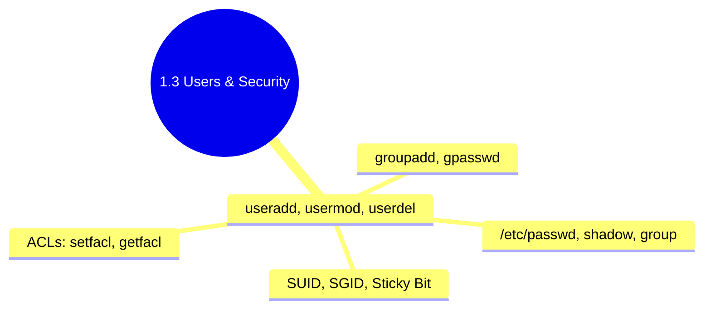

## 1.3.4 Subchapter Review: Cheatsheet and Interview Prep

This review covers only the material presented in Notes 1.3.1 (User and Group Management), 1.3.2 (Shell Profiles and Environment Variables), and 1.3.3 (SUID, SGID, Sticky Bit, and ACLs). No forward referencing beyond what was explicitly introduced.




***

## Cheatsheet: User Management, Profiles, and Advanced Permissions

### Critical User Files

| File          | Purpose                    | Permissions          | Typical Contents                                      |
| ------------- | -------------------------- | -------------------- | ----------------------------------------------------- |
| `/etc/passwd` | User account database      | 644 (world-readable) | username:x:UID:GID:GECOS:home:shell                   |
| `/etc/shadow` | Password hashes and expiry | 640 or 000           | username:$hash$salt:last:min:max:warn:inactive:expire |
| `/etc/group`  | Group definitions          | 644                  | group:x:GID:member1,member2                           |

### `/etc/passwd` Field Reference

| Field | Example        | Meaning                                    |
| ----- | -------------- | ------------------------------------------ |
| 1     | `ubuntu`       | Username                                   |
| 2     | `x`            | Password placeholder (x = in shadow)       |
| 3     | `1000`         | UID (0=root, 1-999=system, 1000+=human)    |
| 4     | `1000`         | Primary GID                                |
| 5     | `Ubuntu,,,`    | GECOS (full name, contact)                 |
| 6     | `/home/ubuntu` | Home directory                             |
| 7     | `/bin/bash`    | Login shell (/sbin/nologin disables login) |

### User Management Commands

| Command    | Purpose                | Common Flags                                                                                    |
| ---------- | ---------------------- | ----------------------------------------------------------------------------------------------- |
| `useradd`  | Create user            | `-m` (home), `-s` (shell), `-u` (UID), `-g` (primary group), `-G` (supplemental), `-r` (system) |
| `usermod`  | Modify user            | `-aG` (append to groups – critical!), `-d` (home), `-s` (shell), `-L` (lock), `-U` (unlock)     |
| `userdel`  | Delete user            | `-r` (remove home), `-f` (force)                                                                |
| `groupadd` | Create group           | `-g` (GID)                                                                                      |
| `groupmod` | Modify group           | `-n` (rename), `-g` (GID)                                                                       |
| `groupdel` | Delete group           | (none)                                                                                          |
| `passwd`   | Set/change password    | `-l` (lock), `-u` (unlock), `-e` (expire), `-x` (max days)                                      |
| `id`       | Display IDs            | `-u` (UID only), `-g` (GID only), `-G` (all groups)                                             |
| `groups`   | Show group memberships | (none)                                                                                          |

### Shell Profile Loading Order

| Shell Type                                    | Files Read (in order)                                                                                   |
| --------------------------------------------- | ------------------------------------------------------------------------------------------------------- |
| **Login shell** (SSH, TTY)                    | `/etc/profile` → first of `~/.bash_profile`, `~/.bash_login`, `~/.profile` → (logout: `~/.bash_logout`) |
| **Interactive non-login** (terminal emulator) | `/etc/bash.bashrc` → `~/.bashrc`                                                                        |
| **Non-interactive non-login** (script)        | None (reads `$BASH_ENV` if set)                                                                         |

### Where to Put What

| Content                                       | Put in                      | Reason                                                          |
| --------------------------------------------- | --------------------------- | --------------------------------------------------------------- |
| `PATH` modifications                          | `~/.profile`                | Works for all POSIX shells, read by login shells                |
| Environment variables (`EDITOR`, `JAVA_HOME`) | `~/.profile`                | Needs to be inherited by child processes                        |
| Aliases                                       | `~/.bashrc`                 | Aliases are bash-specific, not needed in non-interactive shells |
| Functions                                     | `~/.bashrc`                 | Interactive convenience                                         |
| Prompt (`PS1`)                                | `~/.bashrc`                 | Interactive only                                                |
| `umask`                                       | `~/.profile` or system-wide | Affects file creation permissions                               |

### Environment Variable Commands

| Command                   | Purpose                              |
| ------------------------- | ------------------------------------ |
| `env` or `printenv`       | Show all environment variables       |
| `echo $VAR`               | Show specific variable               |
| `export VAR=value`        | Set environment variable (temporary) |
| `unset VAR`               | Remove variable                      |
| `source file` or `. file` | Execute file in current shell        |
| `alias`                   | List aliases                         |
| `alias name='cmd'`        | Create alias                         |
| `unalias name`            | Remove alias                         |

### Special Permission Bits

| Permission | Symbol | Octal Prefix | Effect (Files)        | Effect (Directories)              |
| ---------- | ------ | ------------ | --------------------- | --------------------------------- |
| SUID       | `rws`  | 4xxx         | Execute as file owner | (Ignored)                         |
| SGID       | `r-s`  | 2xxx         | Execute as file group | New files inherit directory group |
| Sticky     | `r-t`  | 1xxx         | (Ignored)             | Only owner/root can delete        |

```bash
# Setting special bits
chmod u+s file   # SUID
chmod g+s dir    # SGID
chmod +t dir     # Sticky

# Octal method
chmod 4755 file  # SUID + rwxr-xr-x
chmod 2750 dir   # SGID + rwxr-x---
chmod 1777 /tmp  # Sticky + rwxrwxrwt

# Finding special bits
find / -type f -perm -4000 2>/dev/null   # SUID files
find / -type f -perm -2000 2>/dev/null   # SGID files
find / -type d -perm -1000 2>/dev/null   # Sticky directories
```

### ACL Commands

| Command                 | Purpose                     | Example                        |
| ----------------------- | --------------------------- | ------------------------------ |
| `getfacl`               | View ACLs                   | `getfacl file.txt`             |
| `setfacl -m`            | Add/modify ACL entry        | `setfacl -m u:bob:rw file.txt` |
| `setfacl -x`            | Remove specific entry       | `setfacl -x u:bob file.txt`    |
| `setfacl -b`            | Remove all ACLs             | `setfacl -b file.txt`          |
| `setfacl -m d:u:bob:rx` | Set default ACL (directory) | `setfacl -m d:u:bob:rx /dir`   |
| `setfacl --restore`     | Restore from backup         | `setfacl --restore=acls.txt`   |

**ACL syntax:** `setfacl -m [u/g/mask]:[name]:permissions file`

* `u:bob:rwx` – user bob with rwx

* `g:developers:rx` – group developers with rx

* `mask::rwx` – set maximum effective permissions

**The mask** limits named users/groups. If mask is `r-x`, even `rwx` becomes `r-x`.

***

## Comparison Tables

### Shell Types Summary

| Type                  | Authentication | Reads Profile | Reads .bashrc           | Typical Use       |
| --------------------- | -------------- | ------------- | ----------------------- | ----------------- |
| Login interactive     | Yes            | Yes           | No (unless sourced)     | SSH, TTY          |
| Non-login interactive | No             | No            | Yes                     | Terminal emulator |
| Non-interactive       | No             | No            | No (except `$BASH_ENV`) | Scripts, CI/CD    |

### Permission Types Comparison

| Feature     | Standard (ugo)          | SUID/SGID               | ACLs                       |
| ----------- | ----------------------- | ----------------------- | -------------------------- |
| Granularity | Owner, group, other     | Elevates privileges     | Multiple users/groups      |
| Persistence | Always on filesystem    | Bit stored in inode     | Extended attribute         |
| Backup      | Standard tools preserve | Standard tools preserve | Need `getfacl` backup      |
| Common use  | Basic file sharing      | `passwd`, `/tmp`        | Complex shared directories |

### UID Ranges

| Range      | Type             | Description                        |
| ---------- | ---------------- | ---------------------------------- |
| 0          | root             | Superuser                          |
| 1-99       | System (static)  | Pre-allocated system accounts      |
| 100-999    | System (dynamic) | Package-installed service accounts |
| 1000-60000 | Regular users    | Human users                        |
| 65534      | nobody           | Unprivileged fallback              |

***

## Interview Questions (Scenario-Based)

These questions assume only knowledge from Subchapter 1.3. Answers reference only concepts from 1.3.1, 1.3.2, and 1.3.3.

### Question 1

**Scenario:** A developer asks you to help them understand why a cron job that runs `/opt/app/backup.sh` fails with "command not found" for `rsync`, even though `rsync` works perfectly when they run the script manually from their terminal.

**Question:** What is the most likely cause, and how would you fix it?

**Answer:**

**Most likely cause:** Cron runs with a minimal environment that does not include the same `PATH` as the developer's interactive shell. When the developer runs the script manually, their shell's `PATH` includes `/usr/local/bin` or another directory containing `rsync`. Cron's default `PATH` is often just `/usr/bin:/bin`, which may not include the location of `rsync`.

**Verification:**

```bash
# Check where rsync is located
which rsync
# Could be /usr/local/bin/rsync or /opt/bin/rsync

# Check cron's environment
# Add this to crontab temporarily:
* * * * * env > /tmp/cron_env.txt
# Then examine /tmp/cron_env.txt – PATH will be minimal
```

**Fixes (choose one):**

1. **Set PATH explicitly in crontab (recommended):**

```bash
# crontab -e
PATH=/usr/local/bin:/usr/bin:/bin
0 2 * * * /opt/app/backup.sh
```

1. **Use absolute path to rsync in the script:**

```bash
#!/bin/bash
/usr/local/bin/rsync -av /source /dest
```

1. **Source the user's profile inside the script:**

```bash
#!/bin/bash
source /home/developer/.profile
rsync -av /source /dest
```

1. **Add PATH export at top of script:**

```bash
#!/bin/bash
export PATH=/usr/local/bin:/usr/bin:/bin
rsync -av /source /dest
```

**Best practice for production:** Set `PATH` explicitly in the crontab or use absolute paths. Do not rely on user profiles in cron because cron may run under a different user context.

### Question 2

**Scenario:** During a security audit, you discover a binary `/usr/local/bin/custom_backup` with permissions `-rwsrwxr-x` owned by `root`. The binary is from a vendor and needs to run with root privileges to access certain hardware.

**Question:** What is wrong with these permissions, and how should you fix them? Also, explain why the current configuration is dangerous.

**Answer:**

**Problems with** **`-rwsrwxr-x`** **(4755 octal):**

1. **Group has write permission** (`rwx` – the `w` in group position). This means any user in the `root` group (or any user if the binary's group is a general group) could replace the binary with a malicious version. Even if the group is `root`, members of the `root` group (which should be highly restricted) could modify it.

2. **Others have execute permission** (`r-x`). Any user on the system can run this SUID root binary, which is unnecessary and increases attack surface.

**Security risks:**

* If any user can execute a SUID root binary, a vulnerability in that binary (buffer overflow, path injection, etc.) could give any local user full root access.

* Group write permission on a SUID binary allows privilege escalation: a malicious user in the binary's group could replace it with a shell, then run it to become root.

**Correct fix:**

```bash
# Change to: root owner, root group, permissions 4750 (rwsr-x---)
sudo chown root:root /usr/local/bin/custom_backup
sudo chmod 4750 /usr/local/bin/custom_backup

# Result: -rwsr-x--- (only root can execute, group has read+execute but not write)
```

**Alternative if only specific users need access:** Use ACLs instead of group world access:

```bash
sudo chmod 4700 /usr/local/bin/custom_backup  # rwx------ (only root)
sudo setfacl -m u:backup_user:rx /usr/local/bin/custom_backup
```

**Verification after fix:**

```bash
ls -l /usr/local/bin/custom_backup
# -rwsr-x--- 1 root root ... custom_backup

# Confirm no group write
# Should show r-x (not rwx) for group
```

### Question 3

**Scenario:** You create a shared directory `/team/share` for the `engineering` group. You set permissions to `2770` (rwxrwx--- with SGID). User `alice` (primary group `alice`, supplemental group `engineering`) creates a file `alice.txt`. Another user `bob` (also in `engineering`) tries to edit the file but gets "Permission denied".

**Question:** What is the likely cause, and how do you fix it? Include the specific `umask` value that would cause this problem.

**Answer:**

**Likely cause:** `alice`'s `umask` is too restrictive (e.g., `027` or `077`), which removes write permission for the group when the file is created. Even though the directory has SGID (causing the file to inherit the `engineering` group), the file's group permissions may be `r--` (read-only) or `---` (no access) if `umask` removed the `w` bit.

**Verification:**

```bash
# Check the file's actual permissions
ls -l /team/share/alice.txt
# Example problematic output: -rw-r----- 1 alice engineering ... alice.txt
# Group has r-- (read only), no write

# Check alice's umask
sudo -u alice umask
# Output: 0027 (common restrictive umask)
```

**How** **`umask 027`** **causes this:**

* Base permission for file: `666` (rw-rw-rw-)

* `umask 027` subtracts `----w-rwx` (group write removed, others all removed)

* Result: `640` (rw-r-----) – group has read only, not write

**Fixes:**

1. **Change** **`alice`'s umask permanently (in** **`~/.profile`):**

```bash
echo "umask 002" >> /home/alice/.profile
# 002 gives: owner rw, group rw, others r (for directories)
# Files become 664 (rw-rw-r--)
```

1. **Fix existing file's permissions:**

```bash
chmod g+w /team/share/alice.txt
# Or recursively set for all files in directory
chmod -R g+w /team/share/
```

1. **Set default ACL to enforce group write regardless of umask:**

```bash
setfacl -m d:g:engineering:rwx /team/share
# New files will inherit rw for group even if umask is restrictive
```

**Best practice for shared directories:** Use SGID (`chmod 2770`) AND set default ACLs to enforce group write, then train users to use `umask 002` or `007` in shared contexts.

### Question 4

**Scenario:** You need to allow user `jenkins` (UID 1100) to read the log files in `/var/log/app/`, but the directory and files are owned by `root:root` with permissions `750` (rwxr-x---). You cannot change the owner or group of the files because other security policies depend on them. You also cannot make the files world-readable.

**Question:** Using only tools from Subchapter 1.3, how would you grant `jenkins` read access without changing standard permissions? Provide the exact commands.

**Answer:**

Use **ACLs** (Access Control Lists) to grant `jenkins` specific read and execute (for directory traversal) permissions without modifying the standard owner/group/other bits.

**Commands:**

```bash
# First, grant jenkins execute (traverse) permission on the directory
setfacl -m u:jenkins:rx /var/log/app/

# Then grant jenkins read permission on all existing files
setfacl -m u:jenkins:r /var/log/app/*.log

# To apply recursively to all current and future files, set default ACL on directory
setfacl -m d:u:jenkins:r /var/log/app/
```

**Verification:**

```bash
# Check ACLs
getfacl /var/log/app/
# Should show: user:jenkins:r-x (for directory)
#              default:user:jenkins:r-- (for future files)

# Test as jenkins user
sudo -u jenkins cat /var/log/app/application.log
# Should work without errors
```

**Why this works:**

* The standard permissions remain `750` (root:root, rwxr-x---)

* ACL adds an extended entry for `jenkins` without modifying the base ACL (`user::` for root, `group::` for root group)

* The directory needs `rx` (read + execute) for `jenkins` to list and traverse

* Files need `r` (read) only, not execute

**To make this persistent across log rotation:** Ensure your log rotation script preserves ACLs (most do by default on modern systems), or add the ACL set command to a startup script.

### Question 5

**Scenario:** A junior engineer runs `sudo chmod -R 777 /home` on a shared server. Now any user can read, write, and execute files in all home directories. You need to restore security without knowing each user's original exact permissions.

**Question:** What is the standard permission pattern for home directories, and how would you restore it? Include the correct `chmod` commands and explain why the sticky bit is important for `/home`.

**Answer:**

**Standard home directory permissions:**

* User's own home directory: `750` or `700` (drwxr-x--- or drwx------)

* User's files inside: typically `644` for files, `755` for directories

* **Crucially:** Other users should NOT have write access to another user's home directory

**Sticky bit on** **`/home`:** If `/home` is world-readable or group-readable, the sticky bit prevents users from deleting others' subdirectories. But best practice is to make `/home` have no access for others (`711` or `751`).

**Restoration commands (as root):**

```bash
# 1. Fix the /home directory itself
chmod 755 /home   # drwxr-xr-x (world can traverse but not list contents without knowing names)

# 2. Restore each user's home directory permissions (assuming UID >= 1000)
for userdir in /home/*; do
    if [ -d "$userdir" ]; then
        # Get username from directory name
        username=$(basename "$userdir")
        
        # Set ownership (ensure correct)
        chown -R "$username":"$username" "$userdir"
        
        # Set directory permissions: 750 (owner full, group read/execute, others none)
        find "$userdir" -type d -exec chmod 750 {} \;
        
        # Set file permissions: 640 (owner read/write, group read, others none)
        find "$userdir" -type f -exec chmod 640 {} \;
        
        # Special case: .ssh directory must be 700
        if [ -d "$userdir/.ssh" ]; then
            chmod 700 "$userdir/.ssh"
            chmod 600 "$userdir/.ssh/authorized_keys" 2>/dev/null
            chmod 600 "$userdir/.ssh/id_*" 2>/dev/null
        fi
        
        # Special case: .bashrc, .profile can be 644 (world-readable is fine)
        chmod 644 "$userdir/.bashrc" "$userdir/.profile" 2>/dev/null
    fi
done
```

**Simpler restoration using reference user (if one user has correct permissions):**

```bash
# If user 'template' has correct permissions
chmod --reference=/home/template /home/otheruser
chmod -R --reference=/home/template/. /home/otheruser/.
```

**Prevention for the future:** Set a strict `umask` in `/etc/profile`:

```bash
echo "umask 027" >> /etc/profile
# New files: 640, new directories: 750
```

**Why sticky bit on** **`/home`** **(if you must make it world-readable for some reason):**

```bash
chmod 1777 /home   # NEVER do this for /home – just an example of sticky
# Sticky bit would prevent user alice from deleting bob's home directory
# But correct solution is to make /home non-writable by others entirely
```

**Verification after fix:**

```bash
# Check a sample home directory
ls -ld /home/username
# Should show drwxr-x--- or drwx------

# Verify no world-writable files
find /home -type f -perm -0002 -ls 2>/dev/null
# Should return nothing (or only files intentionally world-writable)
```

***

## Topics Covered in This Subchapter (Self-Check)

| Topic                                                                          | Found in Note |
| ------------------------------------------------------------------------------ | ------------- |
| `/etc/passwd`, `/etc/shadow`, `/etc/group` structure                           | 1.3.1         |
| UID ranges (0, 1-999, 1000+)                                                   | 1.3.1         |
| `useradd`, `usermod`, `userdel`, `groupadd`, `groupmod`, `groupdel`            | 1.3.1         |
| `passwd` command with flags                                                    | 1.3.1         |
| `chage` command for password aging                                             | 1.3.1         |
| `id` and `groups` commands                                                     | 1.3.1         |
| Creating system users (`-r` flag)                                              | 1.3.1         |
| Login vs non-login shells                                                      | 1.3.2         |
| Interactive vs non-interactive shells                                          | 1.3.2         |
| `/etc/profile`, `~/.bash_profile`, `~/.profile`, `~/.bashrc`, `~/.bash_logout` | 1.3.2         |
| Environment variables vs shell variables                                       | 1.3.2         |
| `export`, `env`, `printenv`, `unset`                                           | 1.3.2         |
| `PATH` modification and order                                                  | 1.3.2         |
| Aliases and functions                                                          | 1.3.2         |
| `source` command (`.`)                                                         | 1.3.2         |
| `env -i` for testing minimal environment                                       | 1.3.2         |
| SUID (`chmod u+s`, `4755`)                                                     | 1.3.3         |
| SGID on files and directories (`chmod g+s`, `2755`, `2770`)                    | 1.3.3         |
| Sticky bit (`chmod +t`, `1777`)                                                | 1.3.3         |
| Special permission octal prefixes (4xxx, 2xxx, 1xxx)                           | 1.3.3         |
| `find` with `-perm` for special bits                                           | 1.3.3         |
| ACLs (`getfacl`, `setfacl`)                                                    | 1.3.3         |
| ACL mask concept                                                               | 1.3.3         |
| Default ACLs (`d:` prefix)                                                     | 1.3.3         |
| Restoring ACLs from backup                                                     | 1.3.3         |

## Bridge Concepts (Not in Notes but Added for Clarity)

| Concept              | Explanation                                                                                       | <br />     |
| -------------------- | ------------------------------------------------------------------------------------------------- | :--------- |
| `chpasswd`           | Batch update passwords from stdin. Used in 1.3.1 quick task: \`echo "user:pass"                   | chpasswd\` |
| `lastlog`            | Shows last login time for users. Mentioned in scenario 2 of 1.3.1.                                | <br />     |
| `$BASH_ENV`          | Environment variable that bash reads for non-interactive scripts. Mentioned in shell types table. | <br />     |
| `whoami`             | Prints current effective username. Used in SUID lab to demonstrate privilege escalation.          | <br />     |
| `chmod --reference`  | Copies permissions from one file to another. Mentioned in Q5 as restoration shortcut.             | <br />     |
| Sticky bit on `/tmp` | Classic example: `drwxrwxrwt`. Prevents users from deleting others' temp files.                   | <br />     |

***

**End of Subchapter 1.3 Review**

**Next:** Proceed to Subchapter 1.4 – SSH Mastery and Remote Access (key pair authentication, tunneling, and advanced configuration).

---

## Backlinks

| Link | Description |
|------|-------------|
| [1.3.3 SUID, SGID, Sticky Bit and ACLs](./1.3.3_SUID_SGID_Sticky_Bit_and_ACLs.md) | Previous note on advanced permissions |
| [1.3.2 Shell Profiles and Environment](./1.3.2_Shell_Profiles_and_Environment.md) | Environment variables and profile loading |
| [1.3.1 User and Group Management](./1.3.1_User_and_Group_Management.md) | User/group fundamentals |
| [1.4.1 SSH Keys and Authentication](../Subchapter_1.4/1.4.1_SSH_Keys_and_Authentication.md) | Next subchapter: Remote access and SSH |
