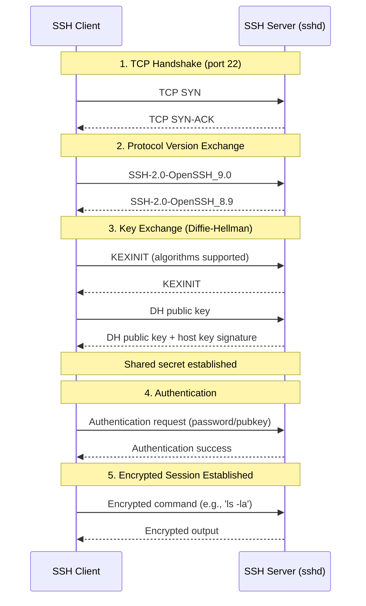
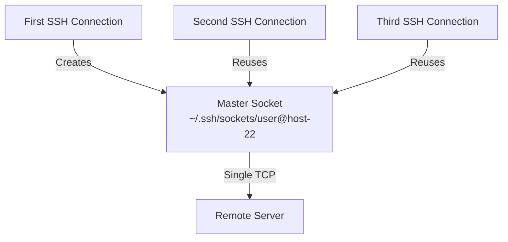

# Module 1: Linux Mastery

## Subchapter 1.4 – SSH Mastery and Remote Access

### 1.4.1 SSH Protocol and Basics: Secure Remote Access

#### Why SSH is the Backbone of Platform Engineering

Every platform engineer interacts with SSH daily. It is the primary mechanism for:

* Accessing remote servers (production, staging, development)

* Securely transferring files (`scp`, `rsync` over SSH – see 1.2.3)

* Tunneling traffic through firewalls

* Running remote commands in automation scripts

* Forwarding authentication agents

SSH (Secure Shell) replaces older insecure protocols: `telnet` (plaintext), `rsh` (remote shell), `rlogin`. All SSH traffic is encrypted, authenticated, and integrity-checked.

> **Tip:** When SSH fails, separate the problem into three layers: **network reachability** (port 22 open), **host identity** (known_hosts / host key), and **user authentication** (password, key, MFA).

***

## SSH Protocol Overview

SSH has two major protocol versions. **SSH-2** is the modern standard (since 2006). SSH-1 is obsolete and insecure – disable it entirely.



### SSH Architecture: Client-Server

| Component             | Role                                                         | Configuration File                     | Port                 |
| --------------------- | ------------------------------------------------------------ | -------------------------------------- | -------------------- |
| **SSH Client**        | Initiates connection, runs on user's workstation             | `~/.ssh/config`, `/etc/ssh/ssh_config` | N/A (connects to 22) |
| **SSH Server (sshd)** | Listens for connections, authenticates users, launches shell | `/etc/ssh/sshd_config`                 | 22 (default)         |

```bash
# Check if SSH server is running (on the server you want to connect to)
systemctl status sshd   # RHEL family
systemctl status ssh    # Debian family

# Check listening port
sudo netstat -tlnp | grep :22
# or
sudo ss -tlnp | grep :22
```

***

## Basic SSH Connection Commands

### Simplest Connection

```bash
# Connect to server as current local user (if usernames match)
ssh server.example.com

# Connect as specific user
ssh alice@server.example.com

# Connect with non-default port (common in cloud environments)
ssh -p 2222 ubuntu@192.168.1.100
```

### Running Remote Commands Without Interactive Shell

```bash
# Single command (output returns, connection closes)
ssh alice@server.example.com "ls -la /var/log"

# Multiple commands (semicolon separated)
ssh alice@server.example.com "cd /var/log && tail -20 syslog"

# Pipeline over SSH (local grep on remote output)
ssh alice@server.example.com "cat /var/log/syslog" | grep ERROR

# Remote command with sudo (requires tty allocation)
ssh -t alice@server.example.com "sudo systemctl restart nginx"
# -t forces pseudo-terminal allocation for sudo
```

### Verbose Mode (Essential for Debugging)

```bash
# Level 1: Basic connection info
ssh -v alice@server.example.com

# Level 2: More details (key fingerprints, authentication attempts)
ssh -vv alice@server.example.com

# Level 3: Everything (packet level, debugging)
ssh -vvv alice@server.example.com
```

**Common use of** **`-vvv`:** When authentication fails, `-vvv` shows exactly which keys were offered, which were rejected, and why.

***

## Server Configuration: `/etc/ssh/sshd_config`

Critical security settings you will encounter on production servers.

| Directive                | Recommended Value                  | Why                                                                     |
| ------------------------ | ---------------------------------- | ----------------------------------------------------------------------- |
| `Port`                   | 22 (or non-standard for obscurity) | Standard port; changing reduces automated attacks but not true security |
| `PermitRootLogin`        | `no` or `prohibit-password`        | Never allow root to log in directly; use `sudo`                         |
| `PasswordAuthentication` | `no` (use keys only)               | Prevents password brute force                                           |
| `PubkeyAuthentication`   | `yes`                              | Enable key-based auth                                                   |
| `AllowUsers`             | `alice bob jenkins`                | Whitelist specific users                                                |
| `DenyUsers`              | `root`                             | Blacklist users                                                         |
| `MaxAuthTries`           | `3`                                | Limit failed attempts                                                   |
| `ClientAliveInterval`    | `300`                              | Send keepalive every 5 minutes                                          |
| `ClientAliveCountMax`    | `3`                                | Disconnect after 3 missed keepalives                                    |
| `Banner`                 | `/etc/issue.net`                   | Display warning banner before auth                                      |

```bash
# Example secure configuration snippet
# /etc/ssh/sshd_config

Port 22
Protocol 2
PermitRootLogin no
PasswordAuthentication no
PubkeyAuthentication yes
MaxAuthTries 3
ClientAliveInterval 300
ClientAliveCountMax 3
AllowUsers alice bob jenkins deploy
Banner /etc/issue.net

# Restart after changes
sudo systemctl restart sshd   # RHEL
sudo systemctl restart ssh    # Debian

> **Warning:** Keep your current SSH session open while testing config changes. A bad `sshd_config` plus a full disconnect can lock you out of the server completely.
```

### Reload vs Restart

```bash
# Graceful reload (does not disconnect existing sessions)
sudo systemctl reload sshd

# Full restart (disconnects all users – use carefully)
sudo systemctl restart sshd
```

***

## Client Configuration: `~/.ssh/config`

Create a configuration file to avoid typing the same flags repeatedly.

```bash
# ~/.ssh/config (permissions must be 600)
# File format: one Host stanza per server pattern

Host prod-db
    HostName 192.168.1.50
    User alice
    Port 22
    IdentityFile ~/.ssh/id_ed25519_prod

Host dev-*
    User developer
    Port 2222
    StrictHostKeyChecking no
    UserKnownHostsFile /dev/null

Host github.com
    HostName github.com
    User git
    IdentityFile ~/.ssh/id_ed25519_github
```

**Common** **`~/.ssh/config`** **directives:**

| Directive      | Purpose                       | Example                           |
| -------------- | ----------------------------- | --------------------------------- |
| `Host`         | Alias pattern (what you type) | `Host prod-web`                   |
| `HostName`     | Actual server address         | `HostName 10.0.1.10`              |
| `User`         | Remote username               | `User ubuntu`                     |
| `Port`         | SSH port                      | `Port 2222`                       |
| `IdentityFile` | Specific private key to use   | `IdentityFile ~/.ssh/id_rsa_prod` |
| `ProxyJump`    | Bastion host (see 1.4.3)      | `ProxyJump bastion.example.com`   |
| `ForwardAgent` | Forward SSH agent             | `ForwardAgent yes`                |

```bash
# After creating config, connect with alias
ssh prod-db   # Equivalent to: ssh -i ~/.ssh/id_ed25519_prod alice@192.168.1.50
```

**Critical:** `~/.ssh/config` must have permissions `600` (owner read/write only), or SSH ignores it.

```bash
chmod 600 ~/.ssh/config
```

***

## Host Keys and Known Hosts

### Server Host Keys

Each SSH server has a set of host keys (RSA, ECDSA, Ed25519) stored in `/etc/ssh/ssh_host_*_key`. The client uses these to verify the server's identity and prevent man-in-the-middle attacks.

```bash
# On the server: view host key fingerprints
sudo ssh-keygen -l -f /etc/ssh/ssh_host_ed25519_key.pub

# On the client: view known host keys
ssh-keygen -l -f ~/.ssh/known_hosts
```

### First Connection: Host Key Verification

```text
# First connection to a new server
ssh alice@new-server.example.com

# Output:
The authenticity of host 'new-server.example.com (192.168.1.100)' can't be established.
ED25519 key fingerprint is SHA256:abcdefg1234567890.
Are you sure you want to continue connecting (yes/no/[fingerprint])?
```

**If you answer** **`yes`:** The host key is added to `~/.ssh/known_hosts`. Future connections will compare the presented key with the stored one.

**If the key changes unexpectedly:** You see a warning:

```text
WARNING: REMOTE HOST IDENTIFICATION HAS CHANGED!
```

This could mean:

* Server was reinstalled (new host keys)

* Man-in-the-middle attack

* You are connecting to a different server

**Fix for legitimate host key change:**

```bash
# Remove old key from known_hosts
ssh-keygen -R new-server.example.com

# Or edit ~/.ssh/known_hosts manually
```

***

## Common SSH Client Flags

| Flag | Long Form           | Purpose                | Example                                      |
| ---- | ------------------- | ---------------------- | -------------------------------------------- |
| `-p` | `--port`            | Specify port           | `ssh -p 2222 user@host`                      |
| `-i` | `--identity`        | Specify private key    | `ssh -i ~/.ssh/mykey user@host`              |
| `-v` | `--verbose`         | Increase verbosity     | `ssh -vvv user@host`                         |
| `-t` | `--tty`             | Force pseudo-terminal  | `ssh -t user@host "sudo cmd"`                |
| `-C` | `--compress`        | Compress data          | `ssh -C user@host` (slow links)              |
| `-L` | `--local-forward`   | Local port forwarding  | `ssh -L 8080:localhost:80 user@host` (1.4.3) |
| `-R` | `--remote-forward`  | Remote port forwarding | `ssh -R 8080:localhost:80 user@host` (1.4.3) |
| `-D` | `--dynamic-forward` | SOCKS proxy            | `ssh -D 1080 user@host` (1.4.3)              |
| `-J` | `--proxy-jump`      | Bastion host           | `ssh -J bastion user@target` (1.4.3)         |
| `-N` | `--no-command`      | No remote command      | `ssh -N -L 8080:localhost:80 user@host`      |
| `-f` | `--background`      | Background before exec | `ssh -f -N -L 8080:localhost:80 user@host`   |
| `-G` | N/A                 | Print effective config | `ssh -G prod-server` (debug config)          |

---

## SSH Escape Sequences (Essential for Tunneling)

During an active SSH session, you can send **escape sequences** by pressing `~` immediately after a newline (Enter).

| Escape    | Action                             | Use Case                                    |
| --------- | ---------------------------------- | ------------------------------------------- |
| `~.`      | Terminate connection immediately   | **Kill hung/frozen SSH session**            |
| `~^Z`     | Suspend SSH (background)           | Temporarily return to local shell           |
| `~C`      | Open command line for forwarding   | Add/cancel port forwards during session     |
| `~#`      | List forwarded connections         | Debug active tunnels                        |
| `~?`      | Display help for escape sequences  | Show all available escapes                  |
| `~&`      | Background SSH (after logout)      | Keep session alive while returning to local |

**Example: Add a tunnel to an existing session:**

```bash
# During active SSH session, press Enter, then ~C
# Prompt appears:
ssh> -L 5432:localhost:5432
Forwarding port.

# Cancel a forward:
ssh> -KL 5432
Canceled forwarding.

# List active forwards:
ssh> -h
```

**Kill a hung connection:** When SSH freezes (network issue, server crash), your terminal seems dead. Press `Enter`, then `~.` – the session terminates immediately, returning you to your local shell.

***

## Basic Authentication Methods

### Password Authentication (Not Recommended for Production)

```bash
# Simple password login (if PasswordAuthentication yes)
ssh alice@server.example.com
# Prompts for password
```

**Risks:** Brute force attacks, keylogging, password reuse.

### Key-Based Authentication (Standard for Production)

Covered in detail in 1.4.2. Preview:

```bash
# Generate key pair
ssh-keygen -t ed25519 -f ~/.ssh/id_ed25519

# Copy public key to server
ssh-copy-id alice@server.example.com

# Connect without password
ssh alice@server.example.com
```

***

## SSH Agent: Managing Multiple Keys

The SSH agent holds decrypted private keys in memory so you do not need to enter passphrases repeatedly.

```bash
# Start agent (usually auto-started in modern desktops)
eval "$(ssh-agent -s)"

# Add key(s) to agent
ssh-add ~/.ssh/id_ed25519
ssh-add ~/.ssh/id_rsa_github

# List loaded keys
ssh-add -l

# Remove all keys
ssh-add -D

# Forward agent to remote server (allows chained connections)
ssh -A alice@server.example.com
```

**Security note:** Agent forwarding (`-A`) gives the remote server access to your local agent. Only enable when you trust the remote server.

***

## Quick Task: Basic SSH Setup and Connection

*You need two machines (or a VM and your host) for this task. If only one machine, simulate with localhost.*

1. On the server machine, ensure `sshd` is running. Check with `systemctl status sshd` (or `ssh`).
2. On the client machine, generate an Ed25519 key pair in `~/.ssh/testkey` (do not overwrite existing keys).
3. Copy the public key to the server using `ssh-copy-id` (requires password authentication temporarily).
4. Connect to the server using the new key: `ssh -i ~/.ssh/testkey user@server`.
5. Enable verbose mode and observe the authentication process.
6. Create an alias in `~/.ssh/config` for this server and connect using the alias.

> **Ready Solution:**
>
> ```bash
> # Task 1 (on server)
> sudo systemctl status ssh  # Debian/Ubuntu
> # If not running: sudo systemctl start ssh
>
> # Task 2 (on client)
> ssh-keygen -t ed25519 -f ~/.ssh/testkey -N ""  # -N "" for no passphrase (lab only)
> # Creates ~/.ssh/testkey (private) and ~/.ssh/testkey.pub (public)
>
> # Task 3 (on client) – temporarily enable password auth on server if needed
> ssh-copy-id -i ~/.ssh/testkey.pub alice@server.example.com
> # Prompts for alice's password once
>
> # Task 4 (on client)
> ssh -i ~/.ssh/testkey alice@server.example.com
> # Should connect without password
>
> # Task 5 (on client)
> ssh -vvv -i ~/.ssh/testkey alice@server.example.com
> # Look for lines containing "Offering public key" and "Authentication succeeded"
>
> # Task 6 (on client – edit ~/.ssh/config)
> cat >> ~/.ssh/config << EOF
> Host myserver
>     HostName server.example.com
>     User alice
>     IdentityFile ~/.ssh/testkey
> EOF
> chmod 600 ~/.ssh/config
>
> # Connect using alias
> ssh myserver
> ```

***

## SSH Escape Sequences

When connected via SSH, you can send **escape sequences** to control the connection. These are especially useful when a connection hangs or you need to add tunnels without disconnecting.

**Default escape character:** `~` (tilde). Must be sent at the beginning of a line (after pressing Enter).

### Essential Escape Sequences

| Sequence | Action                                     | When to Use                                     |
| -------- | ------------------------------------------ | ----------------------------------------------- |
| `~.`     | Disconnect (kill hung connection)          | Connection frozen, Ctrl+C doesn't work          |
| `~?`     | Show list of escape commands               | Remember available options                      |
| `~^Z`    | Suspend SSH (background)                   | Need to quickly access local shell              |
| `~#`     | List forwarded connections                 | Debug which tunnels are active                  |
| `~C`     | Open SSH command line                      | Add port forwarding without disconnecting       |
| `~&`     | Background SSH (waiting for tunnels)       | Keep tunnels alive while freeing terminal       |
| `~R`     | Request re-keying                          | Long sessions (security policy)                 |

### Killing a Hung Connection

When a server becomes unreachable mid-session, your terminal appears frozen. Ctrl+C won't work because the signal would be sent over the dead connection.

```bash
# Step 1: Press Enter (ensure at beginning of line)
# Step 2: Type: ~.
# Connection immediately terminates
```

### Adding Port Forwarding On-The-Fly

```bash
# While connected, press Enter, then:
~C
# Prompt appears:
ssh>

# Add local forward
ssh> -L 8080:internal-web:80
# Response: Forwarding port.

# Add remote forward
ssh> -R 9090:localhost:3000
# Response: Forwarding port.

# Cancel a forward
ssh> -KL 8080
# Response: Canceled forwarding.

# Show current forwardings
ssh> ?
```

**Platform engineering use case:** You're debugging on a bastion and realize you need database access. Instead of disconnecting and reconnecting with `-L`, use `~C` to add the tunnel live.

---

## Connection Multiplexing (ControlMaster)

Opening multiple SSH connections to the same server is slow (each requires full handshake). **Connection multiplexing** reuses a single TCP connection for multiple SSH sessions.

### Benefits

- **Faster connections:** Subsequent connections skip TCP and SSH handshake
- **Reduced authentication:** Only the first connection authenticates
- **Lower overhead:** Single TCP connection for multiple sessions/tunnels

### Configuration (`~/.ssh/config`)

```bash
Host *
    ControlMaster auto
    ControlPath ~/.ssh/sockets/%r@%h-%p
    ControlPersist 600
```

| Directive         | Value                            | Effect                                      |
| ----------------- | -------------------------------- | ------------------------------------------- |
| `ControlMaster`   | `auto`                           | First connection becomes master             |
| `ControlPath`     | `~/.ssh/sockets/%r@%h-%p`        | Unix socket path (`%r`=user, `%h`=host, `%p`=port) |
| `ControlPersist`  | `600` (seconds)                  | Keep master alive 10 min after last session |

```bash
# Create socket directory
mkdir -p ~/.ssh/sockets
chmod 700 ~/.ssh/sockets
```

### How It Works



### Managing Multiplexed Connections

```bash
# Check if master is running
ssh -O check alice@server
# Master running (pid=12345)

# Stop master connection gracefully
ssh -O stop alice@server

# Force exit (kill all sessions)
ssh -O exit alice@server

# Request re-keying
ssh -O rekeying alice@server
```

**Troubleshooting:** If a stale socket exists:

```bash
# Error: Control socket exists but connection refused
rm ~/.ssh/sockets/alice@server-22
```

---

## SSH Ciphers and Key Exchange

Modern SSH negotiates encryption algorithms. Understanding this helps with compliance audits and troubleshooting connection issues with legacy systems.

### View Negotiated Algorithms

```bash
# Verbose output shows negotiated ciphers
ssh -vv alice@server 2>&1 | grep "kex:"
# debug1: kex: algorithm: curve25519-sha256

ssh -vv alice@server 2>&1 | grep "cipher:"
# debug1: cipher: chacha20-poly1305@openssh.com

# List client's supported algorithms
ssh -Q cipher         # Ciphers
ssh -Q mac            # Message Authentication Codes
ssh -Q kex            # Key Exchange algorithms
ssh -Q key            # Key types
```

### Hardened Algorithm Configuration (Server)

```bash
# /etc/ssh/sshd_config (modern secure defaults)
KexAlgorithms curve25519-sha256,curve25519-sha256@libssh.org,diffie-hellman-group-exchange-sha256
Ciphers chacha20-poly1305@openssh.com,aes256-gcm@openssh.com,aes128-gcm@openssh.com
MACs hmac-sha2-512-etm@openssh.com,hmac-sha2-256-etm@openssh.com
HostKeyAlgorithms ssh-ed25519,rsa-sha2-512,rsa-sha2-256
```

### Connecting to Legacy Systems

```bash
# If modern client can't connect to old server
ssh -o KexAlgorithms=+diffie-hellman-group1-sha1 -o Ciphers=+aes128-cbc user@legacy-server

# Or add to ~/.ssh/config
Host legacy-*
    KexAlgorithms +diffie-hellman-group1-sha1
    Ciphers +aes128-cbc
    HostKeyAlgorithms +ssh-rsa
```

**Security warning:** Only use weak algorithms for legacy systems you control and plan to upgrade.

---

## Server-Side Debugging (`sshd -d`)

When troubleshooting authentication issues, running `sshd` in debug mode on the server side provides invaluable information.

```bash
# Stop the system sshd temporarily (careful – keep existing session!)
sudo systemctl stop sshd

# Run sshd in foreground debug mode on alternate port
sudo /usr/sbin/sshd -d -p 2222

# From client, connect to debug instance
ssh -p 2222 alice@server

# Server terminal shows:
# debug1: userauth-request for user alice service ssh-connection
# debug1: attempting public key authentication
# debug1: matching key found: /home/alice/.ssh/authorized_keys:1
# debug1: Accepted publickey for alice from 192.168.1.10 port 54321
```

**Multiple debug levels:**

```bash
sudo /usr/sbin/sshd -ddd -p 2222   # Maximum verbosity
```

**Remember to restart sshd:**

```bash
sudo systemctl start sshd
```

---

## TCP Keepalives vs SSH Keepalives

Two different keepalive mechanisms can affect SSH sessions:

### TCP Keepalives (System Level)

```bash
# Server-side (/etc/ssh/sshd_config)
TCPKeepAlive yes    # Default: yes
```

- Operates at TCP layer
- Controlled by kernel parameters (`net.ipv4.tcp_keepalive_*`)
- Can be fooled by NAT timeouts

### SSH Application Keepalives (Preferred)

```bash
# Server-side (/etc/ssh/sshd_config)
ClientAliveInterval 60     # Send keepalive every 60 seconds
ClientAliveCountMax 3      # Disconnect after 3 missed responses

# Client-side (~/.ssh/config or command line)
ServerAliveInterval 60     # Client sends keepalive every 60 seconds
ServerAliveCountMax 3      # Disconnect after 3 missed responses
```

**Recommendation:** Use SSH-level keepalives (`ClientAliveInterval`/`ServerAliveInterval`) as they work inside the encrypted tunnel and are more reliable through firewalls.

---

## Summary Table: SSH Basics

| Concept            | Command/File              | Purpose                              |
| ------------------ | ------------------------- | ------------------------------------ |
| Connect to server  | `ssh user@host`           | Establish encrypted session          |
| Run remote command | `ssh user@host "cmd"`     | Execute without interactive shell    |
| Verbose debugging  | `ssh -vvv user@host`      | Trace connection and auth            |
| Client config      | `~/.ssh/config`           | Aliases, defaults per host           |
| Server config      | `/etc/ssh/sshd_config`    | Daemon settings (port, auth methods) |
| Known hosts        | `~/.ssh/known_hosts`      | Stored server host keys              |
| Host keys (server) | `/etc/ssh/ssh_host_*_key` | Server identity                      |
| SSH agent          | `ssh-agent`, `ssh-add`    | Hold decrypted keys                  |
| Agent forwarding   | `ssh -A`                  | Forward agent to remote              |

### Server Config Quick Reference

| Setting                  | Recommended Value | Effect                     |
| ------------------------ | ----------------- | -------------------------- |
| `PermitRootLogin`        | `no`              | Disable direct root access |
| `PasswordAuthentication` | `no`              | Require keys               |
| `PubkeyAuthentication`   | `yes`             | Enable key auth            |
| `MaxAuthTries`           | `3`               | Limit failed attempts      |

***

**Next note (1.4.2)** will cover key pair authentication in depth: generating keys (`ssh-keygen`), authorized\_keys file, key restrictions (command=, from=, no-agent-forwarding), and best practices for protecting private keys.

---

## Backlinks

| Link | Relationship |
|------|--------------|
| [1.3.4 Subchapter Review](../Subchapter_1.3/1.3.4_Subchapter_Review.md) | Previous note |
| [1.2.2 File Types and Permissions](../Subchapter_1.2/1.2.2_File_Types_Permissions_Basics.md) | `chmod 600` permissions are critical for SSH key security |
| [1.3.1 User and Group Management](../Subchapter_1.3/1.3.1_User_and_Group_Management.md) | User accounts used in SSH examples |
| [1.2.3 Archiving and Syncing](../Subchapter_1.2/1.2.3_Archiving_and_Syncing.md) | `rsync` uses SSH as transport |
| [1.4.2 Key Pair Authentication](./1.4.2_Key_Pair_Authentication.md) | Next: deep dive into SSH keys |
