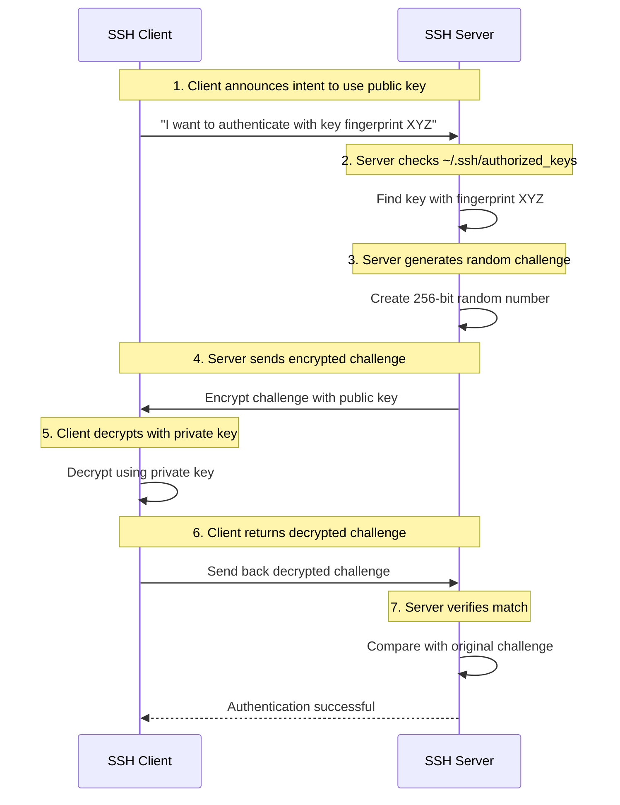
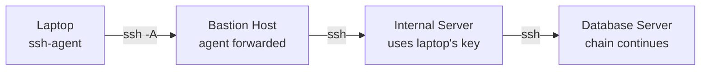
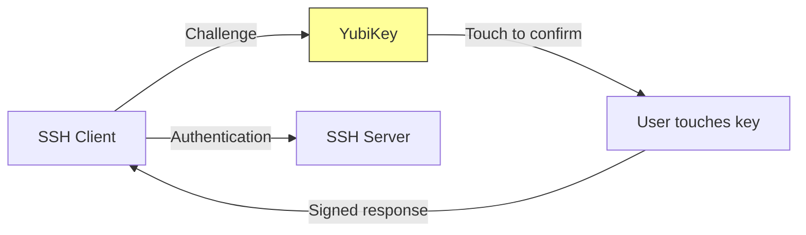

# Module 1: Linux Mastery

## Subchapter 1.4 – SSH Mastery and Remote Access

### 1.4.2 Key Pair Authentication: Passwordless Security

#### Why Keys Over Passwords?

Passwords are a major security weakness in production environments. They can be guessed, brute-forced, stolen from memory, or replayed. **SSH key pairs** provide:

* **Strong encryption** – 2048-bit RSA or 256-bit Ed25519 is effectively unbreakable with current technology.

* **No transmitted secrets** – The private key never leaves the client. The server only stores a public key.

* **Convenience** – Once set up, no passwords needed for automation or daily work.

* **Fine-grained control** – Restrict keys to specific commands, IP addresses, or time windows.

#### How Key Pair Authentication Works (Simplified)



**Important:** The private key never leaves the client machine. The server never sees it. The challenge-response proves the client holds the corresponding private key without transmitting it.

***

## Generating SSH Key Pairs: `ssh-keygen`

### Choosing the Right Key Type

| Key Type                       | Command           | Key Length | Security                 | Performance | Compatibility           |
| ------------------------------ | ----------------- | ---------- | ------------------------ | ----------- | ----------------------- |
| **Ed25519** (Recommended)      | `-t ed25519`      | 256 bits   | Excellent                | Very fast   | OpenSSH 6.5+ (2014)     |
| **RSA** (Legacy/Compatibility) | `-t rsa -b 4096`  | 4096 bits  | Good                     | Slow        | All SSH implementations |
| **ECDSA** (Niche)              | `-t ecdsa -b 521` | 521 bits   | Good (with proper curve) | Fast        | Some older devices      |
| **DSA** (Deprecated)           | `-t dsa`          | 1024 bits  | Broken                   | N/A         | **Do not use**          |

**For platform engineers:** Use **Ed25519** by default. It is more secure and faster than RSA. Only use RSA if you must connect to extremely old systems (pre-2014).

### Basic Key Generation

```bash
# Generate Ed25519 key (default location: ~/.ssh/id_ed25519)
ssh-keygen -t ed25519

# Generate RSA 4096-bit key
ssh-keygen -t rsa -b 4096

# Specify custom filename
ssh-keygen -t ed25519 -f ~/.ssh/my_custom_key

# Generate with comment (identifies key purpose)
ssh-keygen -t ed25519 -C "alice@workstation-2024"
```

**Interactive prompts:**

```text
Generating public/private ed25519 key pair.
Enter file in which to save the key (/home/alice/.ssh/id_ed25519): [press Enter]
Enter passphrase (empty for no passphrase): [optional but recommended]
Enter same passphrase again: [repeat]
```

**Passphrases:** Encrypt the private key on disk. If someone steals your key file, they still need the passphrase. Use `ssh-agent` to avoid typing it repeatedly (covered later in this note).

### Key Generation Flags Explained

| Flag | Meaning                      | Example                              |
| ---- | ---------------------------- | ------------------------------------ |
| `-t` | Type (algorithm)             | `-t ed25519`                         |
| `-b` | Bits (key length)            | `-b 4096` (RSA only)                 |
| `-f` | Output filename              | `-f ~/.ssh/server_key`               |
| `-C` | Comment (label)              | `-C "jenkins@build-server"`          |
| `-N` | Passphrase (non-interactive) | `-N "mypass"` (insecure for scripts) |

### Generated Files

```bash
ls -la ~/.ssh/id_ed25519*
# -rw------- 1 alice alice 411 Jan 15 10:00 id_ed25519      (private key – NEVER share)
# -rw-r--r-- 1 alice alice 102 Jan 15 10:00 id_ed25519.pub  (public key – share freely)
```

**Critical permissions (from 1.2.2):**

* Private key: `600` (`-rw-------`) – only owner can read/write

* Public key: `644` (`-rw-r--r--`) – readable by anyone (no risk)

* `.ssh` directory: `700` (`drwx------`) – only owner can enter

```bash
# Fix permissions if incorrect
chmod 700 ~/.ssh
chmod 600 ~/.ssh/id_ed25519
chmod 644 ~/.ssh/id_ed25519.pub
```

***

## The `authorized_keys` File: Server-Side Configuration

The server stores authorized public keys in `~/.ssh/authorized_keys` (for each user). Each line contains one public key, optionally with restrictions.

### Basic Setup

```bash
# On the client: view your public key
cat ~/.ssh/id_ed25519.pub
# Output: ssh-ed25519 AAAAC3NzaC1lZDI1NTE5AAAAI... alice@workstation

# On the server: add key to authorized_keys
mkdir -p ~/.ssh
chmod 700 ~/.ssh
echo "ssh-ed25519 AAAAC3NzaC1lZDI1NTE5AAAAI... alice@workstation" >> ~/.ssh/authorized_keys
chmod 600 ~/.ssh/authorized_keys
```

### Automated Key Copy: `ssh-copy-id`

```bash
# The easy way (requires password authentication temporarily)
ssh-copy-id alice@server.example.com

# What it does:
# 1. Connects with password
# 2. Creates ~/.ssh if missing
# 3. Appends your public key to authorized_keys
# 4. Sets correct permissions

# Specify non-default key
ssh-copy-id -i ~/.ssh/mykey.pub alice@server.example.com

# Copy to non-standard port
ssh-copy-id -p 2222 alice@server.example.com
```

### Manual Copy (When `ssh-copy-id` Not Available)

```bash
# One-liner using cat and ssh
cat ~/.ssh/id_ed25519.pub | ssh alice@server.example.com "mkdir -p ~/.ssh && cat >> ~/.ssh/authorized_keys"

# Or pipe from file
ssh alice@server.example.com "umask 077; test -d ~/.ssh || mkdir ~/.ssh; cat >> ~/.ssh/authorized_keys" < ~/.ssh/id_ed25519.pub
```

***

## Key Restrictions: Locking Down `authorized_keys`

You can prefix a public key with **options** to restrict what the key can do – essential for automation, CI/CD, and bastion hosts.

### Option Syntax

```text
[options] ssh-ed25519 AAAAC3NzaC1lZDI1NTE5AAAAI... comment
```

**Example restricted key:**

```text
command="/usr/bin/rsync --server --sender -v . /backup",no-port-forwarding,no-X11-forwarding,no-agent-forwarding,no-pty ssh-ed25519 AAAAC3NzaC1lZDI1NTE5AAAAI... backup@ci-server
```

### Common Restriction Options

| Option                   | Effect                                     | Use Case                             |
| ------------------------ | ------------------------------------------ | ------------------------------------ |
| `command="cmd"`          | Forces execution of specific command       | Backup scripts, monitoring probes    |
| `from="pattern"`         | Restricts source IP address                | Allow key only from trusted networks |
| `no-pty`                 | Prevents terminal allocation               | Automation (no interactive shell)    |
| `no-port-forwarding`     | Disables port forwarding                   | Least privilege for CI/CD            |
| `no-agent-forwarding`    | Disables agent forwarding                  | Prevent key propagation              |
| `no-X11-forwarding`      | Disables X11 forwarding                    | Reduce attack surface                |
| `no-user-rc`             | Skips `~/.ssh/rc` execution                | Avoid unintended commands            |
| `permitopen="host:port"` | Allows forwarding only to specific targets | Tunneling with restrictions          |
| `restrict`               | Implies all `no-*` flags (OpenSSH 7.5+)    | Quick lockdown                       |

### Practical Restriction Examples

#### Example 1: Backup Server Key (Command Restriction)

```bash
# In /root/.ssh/authorized_keys (on backup server)
command="/usr/bin/rsync --server --sender -v . /backups",no-pty,no-port-forwarding ssh-ed25519 AAAAC3NzaC1lZDI1NTE5AAAAI... backup-client
```

This key can **only** run that specific `rsync` command. If someone steals the private key, they cannot get a shell.

#### Example 2: CI/CD Deployment Key (IP and Command Restriction)

```bash
# In ~/deploy/.ssh/authorized_keys (on production server)
from="192.168.1.100,10.0.0.0/8",command="/opt/deploy.sh",no-pty,no-agent-forwarding ssh-rsa AAAAB3NzaC1yc2E... jenkins@ci-server
```

Only connections from specific IPs or networks can use this key, and they can only run `/opt/deploy.sh`.

#### Example 3: Monitoring Probe (Read-Only SFTP)

```bash
# In /var/log/.ssh/authorized_keys
command="/usr/lib/openssh/sftp-server",no-pty,no-port-forwarding ssh-ed25519 AAAAC3NzaC1lZDI1NTE5AAAAI... prometheus@monitoring
```

Key can only start `sftp-server`, no shell, no PTY.

#### Example 4: Tunnel-Only Key

```bash
# No command, but prevents shell access
restrict,permitopen="database.internal:5432" ssh-ed25519 AAAAC3NzaC1lZDI1NTE5AAAAI... tunnel-user
```

Key can only be used for port forwarding (e.g., `ssh -L 5432:database.internal:5432`), no shell, no commands.

***

## `ssh-agent`: Managing Keys and Passphrases

Without `ssh-agent`, you would type your passphrase every time you use a private key. The agent holds decrypted keys in memory.

### Starting and Using the Agent

```bash
# Start agent (outputs environment variables)
eval "$(ssh-agent -s)"
# Output: Agent pid 12345

# Add default key (~/.ssh/id_rsa, id_ed25519, etc.)
ssh-add

# Add specific key
ssh-add ~/.ssh/my_custom_key

# Add with timeout (seconds)
ssh-add -t 3600 ~/.ssh/id_ed25519   # Expires after 1 hour

# List loaded keys
ssh-add -l
# 256-bit Ed25519 SHA256:abcdefg... alice@workstation (ED25519)

# Remove specific key by fingerprint
ssh-add -d SHA256:abcdefg...

# Remove all keys
ssh-add -D

# Lock agent (requires password)
ssh-add -x
ssh-add -X  # Unlock
```

### Agent Forwarding: Chaining Authentication

Agent forwarding allows you to "pass through" your local agent to a remote server, then from that server to another server.



**Command:**

```bash
# Forward agent to bastion
ssh -A alice@bastion.example.com

# From bastion, connect to internal server (no password, no key on bastion)
# Authenticates using your laptop's key!
alice@bastion$ ssh internal-server.example.com
```

**Security warning:** Any user with root on the remote server can access your agent socket and use your keys. Only forward to trusted hosts.

**Safer alternative:** `ProxyJump` (covered in 1.4.3) does not require agent forwarding.

***

## Managing Multiple Keys

Platform engineers often have dozens of keys: personal, work, different projects, different cloud providers.

### Strategy 1: `~/.ssh/config` with `IdentityFile`

```text
# ~/.ssh/config
Host github.com
    HostName github.com
    User git
    IdentityFile ~/.ssh/id_ed25519_github

Host prod-*
    User ubuntu
    IdentityFile ~/.ssh/id_ed25519_prod

Host dev-*
    User developer
    IdentityFile ~/.ssh/id_ed25519_dev
```

### Strategy 2: Multiple Keys in Agent

```bash
# Add all keys to agent
ssh-add ~/.ssh/id_ed25519_github
ssh-add ~/.ssh/id_ed25519_prod
ssh-add ~/.ssh/id_ed25519_dev

# SSH will try each key in order until one works
ssh prod-web-01   # Will try prod key first (due to config)
```

### Strategy 3: Key Selection with `-i` Flag

```bash
# Explicitly specify key for one-off connections
ssh -i ~/.ssh/id_ed25519_special alice@server.example.com
```

***

## Troubleshooting Key Authentication

### Problem 1: "Permission denied (publickey)"

**Most common causes and fixes:**

| Cause                                              | Verification                            | Fix                                                  |
| -------------------------------------------------- | --------------------------------------- | ---------------------------------------------------- |
| Wrong permissions on `~/.ssh` or `authorized_keys` | `ls -la ~/.ssh`                         | `chmod 700 ~/.ssh; chmod 600 ~/.ssh/authorized_keys` |
| Public key not in `authorized_keys`                | `cat ~/.ssh/authorized_keys`            | Add key with `ssh-copy-id`                           |
| Wrong user on server                               | `whoami` on server                      | Connect as correct user                              |
| Wrong key offered                                  | `ssh -vvv user@host \| grep "Offering"` | Specify key with `-i` or fix `~/.ssh/config`         |
| `AuthorizedKeysFile` location changed              | Check `/etc/ssh/sshd_config`            | Use correct path or symlink                          |
| SELinux blocking (RHEL family)                     | `restorecon -R -v ~/.ssh`               | `restorecon -R ~/.ssh`                               |

### Debugging Workflow

```bash
# Step 1: Verbose connection
ssh -vvv alice@server.example.com

# Look for these lines:
# debug1: Authentications that can continue: publickey,password
# debug1: Offering public key: /home/alice/.ssh/id_ed25519
# debug1: Server accepts key: pkalg ssh-ed25519 blen 53
# debug1: Authentication succeeded (publickey).

# If you see "Offering" but no "accepts", key is not in authorized_keys
# If you see "We tried every key but none worked", wrong key or permissions
```

### Problem 2: "Agent admitted failure to sign"

**Cause:** `ssh-agent` is running but key was not added, or agent forwarding failed.

**Fix:**

```bash
# Check agent keys
ssh-add -l
# If empty, add keys
ssh-add

# If forwarding, check remote has agent socket
echo $SSH_AUTH_SOCK
# Should show something like /tmp/ssh-XXXXXX/agent.12345
```

### Problem 3: Key Permissions Error

```text
# Error message:
@@@@@@@@@@@@@@@@@@@@@@@@@@@@@@@@@@@@@@@@@@@@@@@@@@@@@@@@@@@
@         WARNING: UNPROTECTED PRIVATE KEY FILE!          @
@@@@@@@@@@@@@@@@@@@@@@@@@@@@@@@@@@@@@@@@@@@@@@@@@@@@@@@@@@@
Permissions 0644 for '/home/alice/.ssh/id_ed25519' are too open.

# Fix:
chmod 600 ~/.ssh/id_ed25519
```

***

## Quick Task: Key-Based Authentication Lab

*Set up key-based authentication with restrictions.*

1. Generate a new Ed25519 key pair `~/.ssh/lab_key` with no passphrase (for automation simulation).
2. Copy the public key to a remote server (or localhost) using `ssh-copy-id`.
3. On the server, edit `~/.ssh/authorized_keys` and add a restriction so this key can only run `/bin/date`.
4. Test: Connect with `ssh -i ~/.ssh/lab_key user@server`. What happens?
5. Test a different command: `ssh -i ~/.ssh/lab_key user@server "hostname"`. What happens?
6. Remove the command restriction and test again.

> **Ready Solution:**
>
> ```bash
> # Task 1
> ssh-keygen -t ed25519 -f ~/.ssh/lab_key -N ""
>
> # Task 2 (replace localhost with actual server if available)
> ssh-copy-id -i ~/.ssh/lab_key.pub alice@localhost
>
> # Task 3 (on the server)
> # Edit ~/.ssh/authorized_keys
> # Change it from:
> # ssh-ed25519 AAAAC3... alice@workstation
> # To:
> # command="/bin/date" ssh-ed25519 AAAAC3... alice@workstation
>
> # Task 4
> ssh -i ~/.ssh/lab_key alice@localhost
> # Output: (current date) and then connection closes
>
> # Task 5
> ssh -i ~/.ssh/lab_key alice@localhost "hostname"
> # Output: (current date) – the command is ignored; only /bin/date runs
>
> # Task 6 (on the server, remove "command=" part)
> # Edit ~/.ssh/authorized_keys back to original
> # Now ssh -i ~/.ssh/lab_key alice@localhost gives normal shell
> ```

***

## Advanced Key Management

### Extracting Public Key from Private Key

If you lose the `.pub` file but have the private key:

```bash
# Generate public key from private key
ssh-keygen -y -f ~/.ssh/id_ed25519 > ~/.ssh/id_ed25519.pub

# For RSA keys
ssh-keygen -y -f ~/.ssh/id_rsa > ~/.ssh/id_rsa.pub
```

### Changing Passphrase on Existing Key

```bash
# Change passphrase (prompted for old, then new)
ssh-keygen -p -f ~/.ssh/id_ed25519

# Set new passphrase directly (non-interactive)
ssh-keygen -p -f ~/.ssh/id_ed25519 -P "oldpass" -N "newpass"

# Remove passphrase (for automation – be careful!)
ssh-keygen -p -f ~/.ssh/id_ed25519 -P "oldpass" -N ""
```

### Key Comment Modification

```bash
# View current comment
ssh-keygen -l -f ~/.ssh/id_ed25519.pub
# 256 SHA256:abcdefg... alice@workstation (ED25519)

# Change comment
ssh-keygen -c -C "alice@new-laptop-2024" -f ~/.ssh/id_ed25519
```

### Viewing Key Fingerprints

```bash
# SHA256 fingerprint (default, modern)
ssh-keygen -lf ~/.ssh/id_ed25519.pub
# 256 SHA256:abcdefg12345... alice@workstation (ED25519)

# MD5 fingerprint (legacy, some systems still show this)
ssh-keygen -E md5 -lf ~/.ssh/id_ed25519.pub
# 256 MD5:12:34:56:78:ab:cd... alice@workstation (ED25519)

# Visual ASCII art representation
ssh-keygen -lv -f ~/.ssh/id_ed25519.pub
# Shows randomart image (visual fingerprint)
```

---

## Hardware Security Keys (FIDO2/U2F)

Modern SSH supports hardware security keys like YubiKey. The private key never leaves the hardware device.

### Generating Hardware-Backed Keys (OpenSSH 8.2+)

```bash
# Generate FIDO2 key (requires hardware key connected)
ssh-keygen -t ed25519-sk -C "alice@workstation-yubikey"
# -sk = security key

# Generate with resident key (stored on device, portable)
ssh-keygen -t ed25519-sk -O resident -C "portable-key"

# For ECDSA-SK (broader compatibility)
ssh-keygen -t ecdsa-sk -C "alice@workstation-yubikey"
```

### How It Works



**Key features:**

- **Touch required:** Physical confirmation for each authentication
- **Non-extractable:** Private key cannot be copied from device
- **PIN protection:** Optional PIN before use

### Using Hardware Keys

```bash
# Add to agent (may require touch)
ssh-add ~/.ssh/id_ed25519_sk

# Connect (touch required)
ssh alice@server
# Confirm user presence for key ED25519-SK SHA256:...
# [Touch YubiKey]
# Authentication succeeded
```

**Server requirements:** OpenSSH 8.2+ and libfido2 installed.

---

## SSH Certificates (CA-Based Authentication)

SSH supports certificate-based authentication where a Certificate Authority (CA) signs user or host keys. This is preferred in large organizations.

### Why Certificates?

| Feature              | Regular Keys                     | Certificates                  |
| -------------------- | -------------------------------- | ----------------------------- |
| Scaling              | Edit `authorized_keys` per host  | Trust CA once, sign new keys  |
| Expiration           | Keys never expire                | Built-in validity period      |
| Revocation           | Remove from each `authorized_keys` | Single revocation list (KRL)  |
| Audit                | Key fingerprints only            | Identity embedded in cert     |
| Principle of least privilege | Difficult                   | Built-in principal (username) |

### Creating a Certificate (Preview)

```bash
# 1. Create CA key pair (do once, store securely)
ssh-keygen -t ed25519 -f user_ca -C "User CA"

# 2. Sign a user's public key
ssh-keygen -s user_ca -I alice@company -n alice,admin -V +52w ~/.ssh/id_ed25519.pub
# -s: CA private key
# -I: Certificate identity (for logging)
# -n: Principals (allowed usernames)
# -V: Validity (+52w = 52 weeks)
# Creates: ~/.ssh/id_ed25519-cert.pub

# 3. On server, trust the CA (in /etc/ssh/sshd_config)
# TrustedUserCAKeys /etc/ssh/user_ca.pub

# 4. User connects with certificate automatically
ssh alice@server
# SSH client sends both key and certificate
```

### Viewing Certificate Details

```bash
ssh-keygen -Lf ~/.ssh/id_ed25519-cert.pub
# Output:
# /home/alice/.ssh/id_ed25519-cert.pub:
#     Type: ssh-ed25519-cert-v01@openssh.com user certificate
#     Public key: ED25519-CERT SHA256:...
#     Signing CA: ED25519 SHA256:... (using ssh-ed25519)
#     Key ID: "alice@company"
#     Valid: from 2024-01-01T00:00:00 to 2025-01-01T00:00:00
#     Principals: alice admin
```

---

## Key Revocation

### Method 1: Remove from `authorized_keys`

```bash
# Manual removal
vim ~/.ssh/authorized_keys
# Delete the line containing the compromised key
```

### Method 2: Key Revocation List (KRL) for Certificates

```bash
# Create revocation list
ssh-keygen -k -f revoked_keys

# Add compromised key to KRL
ssh-keygen -k -f revoked_keys -u ~/.ssh/compromised_key.pub

# Add compromised certificate (by serial)
ssh-keygen -k -f revoked_keys -u -s 1234

# Configure sshd to use KRL
# /etc/ssh/sshd_config
# RevokedKeys /etc/ssh/revoked_keys
```

### Method 3: `~/.ssh/revoked_keys` (User Level)

```bash
# Create revoked keys file
cat compromised_key.pub >> ~/.ssh/revoked_keys

# In ~/.ssh/config (client-side revocation)
Host *
    RevokedHostKeys ~/.ssh/revoked_host_keys
```

---

## SSH Agent Lifetime and Security

### Limit Key Lifetime in Agent

```bash
# Add key with 1-hour timeout
ssh-add -t 3600 ~/.ssh/id_ed25519

# Confirm with -c (requires confirmation for each use)
ssh-add -c ~/.ssh/id_ed25519
# Now each connection shows:
# Allow use of key /home/alice/.ssh/id_ed25519? [y/N]
```

### Lock/Unlock Agent

```bash
# Lock agent (requires password)
ssh-add -x
# Enter lock password:
# Agent locked.

# Unlock
ssh-add -X
# Enter lock password:
# Agent unlocked.
```

### Delete Keys from Agent on Screen Lock (Desktop Integration)

Many desktop environments can automatically lock/clear the SSH agent when the screen locks. This is typically configured through:

- **GNOME:** Settings → Privacy → Screen Lock → Clear SSH keys on lock
- **KDE:** System Settings → Workspace Behavior → Screen Locking → Lock SSH keys

---

## Summary Table: Key Management

| Command                  | Purpose                   | Example                                        |
| ------------------------ | ------------------------- | ---------------------------------------------- |
| `ssh-keygen -t ed25519`  | Generate key pair         | `ssh-keygen -t ed25519 -f ~/.ssh/mykey`        |
| `ssh-copy-id user@host`  | Copy public key to server | `ssh-copy-id -i ~/.ssh/mykey.pub alice@server` |
| `ssh-add`                | Add key to agent          | `ssh-add ~/.ssh/mykey`                         |
| `ssh-add -l`             | List loaded keys          | `ssh-add -l`                                   |
| `ssh-add -D`             | Remove all keys           | `ssh-add -D`                                   |
| `ssh -A`                 | Forward agent             | `ssh -A alice@bastion`                         |
| `eval "$(ssh-agent -s)"` | Start agent               | (run at shell startup)                         |

### `authorized_keys` Restriction Options

| Option                | Effect                   |
| --------------------- | ------------------------ |
| `command="cmd"`       | Force specific command   |
| `from="pattern"`      | Restrict source IP       |
| `no-pty`              | No terminal allocation   |
| `no-port-forwarding`  | Disable forwarding       |
| `no-agent-forwarding` | Disable agent forwarding |
| `restrict`            | All `no-*` flags         |

### Key File Locations and Permissions

| File              | Default Location         | Required Permission |
| ----------------- | ------------------------ | ------------------- |
| Private key       | `~/.ssh/id_ed25519`      | `600` (-rw-------)  |
| Public key        | `~/.ssh/id_ed25519.pub`  | `644` (-rw-r--r--)  |
| `authorized_keys` | `~/.ssh/authorized_keys` | `600`               |
| `config`          | `~/.ssh/config`          | `600`               |
| `.ssh` directory  | `~/.ssh`                 | `700` (drwx------)  |

***

**Next note (1.4.3)** will cover advanced SSH topics: local and remote port forwarding, dynamic SOCKS proxies, jump hosts (bastion), and `~/.ssh/config` advanced options.

---

## Backlinks

| Link | Relationship |
|------|--------------|
| [1.4.1 SSH Protocol and Basics](./1.4.1_SSH_Protocol_and_Basics.md) | Previous note – SSH fundamentals |
| [1.2.2 File Types and Permissions](../Subchapter_1.2/1.2.2_File_Types_Permissions_Basics.md) | `chmod 600`, `chmod 700` critical for SSH security |
| [1.3.1 User and Group Management](../Subchapter_1.3/1.3.1_User_and_Group_Management.md) | `authorized_keys` lives in each user's `~/.ssh/` |
| [1.3.3 SUID, SGID, Sticky Bit and ACLs](../Subchapter_1.3/1.3.3_SUID_SGID_StickyBit_ACLs.md) | Key restrictions relate to access control concepts |
| [1.4.3 Advanced SSH Tunneling](./1.4.3_Advanced_SSH_Tunneling_and_Config.md) | Next: tunneling and jump hosts |
