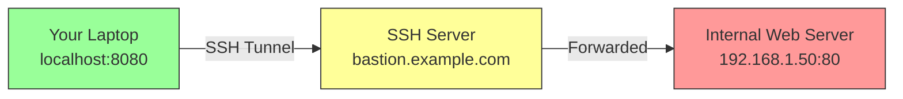
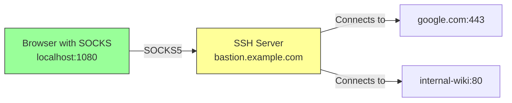
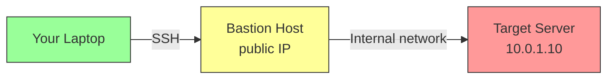

## 1.4.3 Advanced SSH Tunneling and Configuration

#### Why Tunneling Matters for Platform Engineers

Production environments rarely allow direct access to internal services. Databases, message queues, and internal APIs sit behind firewalls, accessible only through **bastion hosts** (jump boxes). SSH tunneling allows you to:

* Securely access internal databases from your laptop without exposing them to the internet

* Encrypt legacy plaintext protocols (like HTTP or MySQL)

* Bypass restrictive firewalls by tunneling through allowed SSH ports

* Create SOCKS proxies for whole applications or browsers

This note covers three types of SSH forwarding, jump hosts, and advanced client configuration.

***

## Part 1: Local Port Forwarding (Most Common)

### What Local Forwarding Does

Local forwarding takes a **local port** on your client and forwards traffic through the SSH server to a **destination host:port** reachable from that server.



**Command syntax:**

```bash
ssh -L local_port:destination_host:destination_port user@ssh_server
```

### Classic Example: Access Internal Database

```bash
# Forward local port 5432 to internal PostgreSQL server (5432) via bastion
ssh -L 5432:database.internal:5432 alice@bastion.example.com

# Now connect to localhost:5432 – traffic tunnels to database.internal:5432
psql -h localhost -p 5432 -U dbuser
```

**How it works:**

1. Your laptop connects to `bastion.example.com` (SSH server)
2. SSH listens on `localhost:5432`
3. Any connection to `localhost:5432` is sent through the SSH tunnel
4. `bastion.example.com` connects to `database.internal:5432` and relays traffic

### Multiple Forwardings in One Command

```bash
# Forward web UI (8080) and database (5432) simultaneously
ssh -L 8080:web.internal:80 -L 5432:db.internal:5432 alice@bastion.example.com
```

### Background Forwarding (No Shell)

```bash
# Forward in background, no interactive shell (-N), background (-f)
ssh -fN -L 5432:database.internal:5432 alice@bastion.example.com

# Check if forwarding is running
ps aux | grep "ssh -fN"

# Kill the background tunnel
pkill -f "ssh -fN -L 5432"
```

**Flag explanations:**

* `-f` – Background before command execution

* `-N` – No remote command (just forward ports)

* `-L` – Local forwarding

### Binding to All Interfaces (Not Just localhost)

By default, `-L` binds to `127.0.0.1` only. Other machines cannot use your tunnel.

```bash
# Allow other machines on your network to use the tunnel
ssh -L 0.0.0.0:5432:database.internal:5432 alice@bastion.example.com

# Or using GatewayPorts option
ssh -L 5432:database.internal:5432 -o GatewayPorts=yes alice@bastion.example.com
```

**Security warning:** This exposes the tunnel to your entire local network. Use only in trusted environments.

***

## Part 2: Remote Port Forwarding

### What Remote Forwarding Does

Remote forwarding does the opposite: it forwards a **port on the SSH server** to a destination reachable from your **client**.


**Command syntax:**

```bash
ssh -R remote_port:destination_host:destination_port user@ssh_server
```

### Use Case: Expose Local Development Server to Team

```bash
# Your laptop has a web app on port 3000
# You want a teammate to access it via bastion.example.com:8080

ssh -R 8080:localhost:3000 alice@bastion.example.com

# Now your teammate can connect to bastion.example.com:8080
# Traffic is tunneled to your laptop's port 3000
```

### Use Case: Access Internal Network from Home (Reverse Tunnel)

```bash
# From your work computer (inside corporate network)
ssh -R 2222:localhost:22 home-pc.example.com

# From home, connect to work computer via the tunnel
ssh -p 2222 alice@localhost  # Connects to work computer!
```

**How it works:** Your work computer initiates the connection to home, so no inbound firewall rules needed at work.

### Binding Remote Port to All Interfaces

```bash
# Allow other machines on the server's network to use the forwarded port
ssh -R 0.0.0.0:8080:localhost:3000 alice@bastion.example.com
```

**Server-side requirement:** The SSH server must have `GatewayPorts yes` in `/etc/ssh/sshd_config` to allow remote forwarding to non-localhost addresses.

```bash
# On the SSH server, edit /etc/ssh/sshd_config
GatewayPorts yes

# Restart SSH server
sudo systemctl restart sshd
```

***

## Part 3: Dynamic Port Forwarding (SOCKS Proxy)

### What Dynamic Forwarding Does

Dynamic forwarding creates a **SOCKS5 proxy** on your client. Any application that supports SOCKS (browsers, curl, applications) can send traffic through the tunnel, and the SSH server forwards each connection to its final destination.



**Command syntax:**

```bash
ssh -D local_port user@ssh_server
```

### Example: SOCKS Proxy for Secure Browsing

```bash
# Create SOCKS proxy on localhost:1080
ssh -D 1080 alice@bastion.example.com

# Configure your browser:
# - Proxy type: SOCKS5
# - Host: localhost
# - Port: 1080
# - Also proxy DNS (important – prevents DNS leaks)

# Now all browser traffic appears to come from bastion.example.com
```

### Using SOCKS Proxy with Command-Line Tools

```bash
# curl via SOCKS5 proxy
curl --socks5 localhost:1080 https://api.internal.company.com

# SSH over SOCKS (using netcat)
ssh -o ProxyCommand='nc -X 5 -x localhost:1080 %h %p' user@internal-server

# Firefox from command line
firefox --proxy "socks5://localhost:1080"
```

### SOCKS with DNS Tunneling (Prevents Leaks)

By default, DNS lookups may happen locally (revealing your browsing destinations). Force DNS through the tunnel:

```bash
# Use -D with DNS tunneling (requires OpenSSH 7.6+)
ssh -D 1080 -o "RemoteCommand=none" alice@bastion.example.com

# Or configure SOCKS5 with DNS in applications:
# curl: --socks5-hostname instead of --socks5
curl --socks5-hostname localhost:1080 https://internal-site
```

***

## Part 4: Jump Hosts (Bastion/Jump Box)

### What is a Jump Host?

A jump host (bastion) is an intermediate server that provides access to internal networks. Instead of SSHing twice, you can use `ProxyJump` or `ProxyCommand` to tunnel through automatically.



### Traditional Two-Step Method

```bash
# Step 1: SSH to bastion
ssh alice@bastion.example.com

# Step 2: From bastion, SSH to internal server
alice@bastion$ ssh 10.0.1.10
```

**Problems:** Keys on bastion, agent forwarding required, extra typing.

### Modern Method: `ProxyJump` (OpenSSH 7.3+)

```bash
# Single command, no agent forwarding needed
ssh -J alice@bastion.example.com alice@10.0.1.10

# Multiple jump hosts (chain)
ssh -J user1@jump1.example.com,user2@jump2.example.com user@target

# With non-standard ports
ssh -J alice@bastion.example.com:2222 -p 2222 alice@10.0.1.10
```

**How it works:**

1. SSH connects to bastion and establishes a tunnel
2. Through that tunnel, SSH connects to the target server
3. Your private key never leaves your laptop

### Legacy Method: `ProxyCommand` (For Older Systems)

```bash
# Using netcat (nc) on the jump host
ssh -o ProxyCommand="ssh -W %h:%p alice@bastion.example.com" alice@10.0.1.10

# Using netcat with explicit path
ssh -o ProxyCommand="ssh alice@bastion.example.com nc %h %p" alice@10.0.1.10
```

### Persistent Jump Host Configuration in `~/.ssh/config`

```bash
# ~/.ssh/config

# Define the bastion host
Host bastion
    HostName bastion.example.com
    User alice
    IdentityFile ~/.ssh/id_ed25519_bastion

# Define internal network hosts (use bastion as jump)
Host 10.0.*.*
    ProxyJump bastion
    User alice
    IdentityFile ~/.ssh/id_ed25519_internal

Host internal-web
    HostName 10.0.1.50
    ProxyJump bastion
    User webadmin

# Nested jumps (bastion -> internal-bastion -> target)
Host deep-internal
    HostName 10.1.1.10
    ProxyJump bastion,internal-bastion.example.com
    User admin
```

**Usage:**

```bash
# Simple alias connection
ssh internal-web   # Automatically uses bastion jump

# Direct IP with pattern match
ssh 10.0.1.20      # Also uses bastion due to 10.0.*.* pattern
```

***

## Part 5: Advanced `~/.ssh/config` Patterns

### Complete Production Example

```bash
# ~/.ssh/config
# Global defaults
Host *
    ServerAliveInterval 60          # Keep connection alive
    ServerAliveCountMax 3
    Compression yes                 # Compress data
    ForwardAgent no                 # Disable agent forwarding by default
    StrictHostKeyChecking accept-new # Auto-add new host keys
    UserKnownHostsFile ~/.ssh/known_hosts

# Bastion host
Host bastion
    HostName jump.company.com
    User alice
    Port 2222
    IdentityFile ~/.ssh/id_ed25519_bastion
    ForwardAgent no                  # Never forward agent to bastion

# Production database (via bastion)
Host prod-db
    HostName 10.20.1.50
    User dbadmin
    ProxyJump bastion
    IdentityFile ~/.ssh/id_ed25519_prod
    LocalForward 5433 localhost:5432  # Auto-forward local port when connected

# Kubernetes cluster access
Host k8s-*
    ProxyJump bastion
    User ubuntu
    IdentityFile ~/.ssh/id_ed25519_k8s
    StrictHostKeyChecking no          # (only for ephemeral clusters)
    UserKnownHostsFile /dev/null

# GitHub (separate key)
Host github.com
    HostName github.com
    User git
    IdentityFile ~/.ssh/id_ed25519_github
```

### Useful `~/.ssh/config` Options

| Option                | Purpose                        | Example                           |
| --------------------- | ------------------------------ | --------------------------------- |
| `ServerAliveInterval` | Send keepalive every N seconds | `ServerAliveInterval 60`          |
| `Compression`         | Compress data (slow links)     | `Compression yes`                 |
| `ForwardAgent`        | Allow agent forwarding         | `ForwardAgent yes`                |
| `ForwardX11`          | Forward graphical apps         | `ForwardX11 yes`                  |
| `LocalForward`        | Auto-create local tunnel       | `LocalForward 8080 localhost:80`  |
| `RemoteForward`       | Auto-create remote tunnel      | `RemoteForward 2222 localhost:22` |
| `ProxyJump`           | Specify bastion                | `ProxyJump bastion`               |
| `IdentityFile`        | Specify private key            | `IdentityFile ~/.ssh/mykey`       |
| `IdentitiesOnly`      | Only use specified keys        | `IdentitiesOnly yes`              |
| `LogLevel`            | Verbose logging                | `LogLevel VERBOSE`                |
| `ConnectTimeout`      | Connection timeout (seconds)   | `ConnectTimeout 10`               |

### Using `Include` to Organize Config (OpenSSH 7.3+)

```bash
# ~/.ssh/config
Include config.d/*.conf

# ~/.ssh/config.d/work.conf
Host work-*
    ProxyJump bastion.work.com
    IdentityFile ~/.ssh/id_ed25519_work

# ~/.ssh/config.d/personal.conf
Host personal-*
    IdentityFile ~/.ssh/id_ed25519_personal
```

***

## Part 6: Troubleshooting Tunnels

### Check If Forwarding is Working

```bash
# On client: check listening ports
sudo netstat -tlnp | grep :5432
# or
ss -tlnp | grep 5432

# On server: check if port is listening (for remote forwarding)
sudo netstat -tlnp | grep :8080
```

### Test Tunnel with `nc` (netcat)

```bash
# From client, test local forward
nc -zv localhost 5432
# Connection to localhost port 5432 [tcp/postgresql] succeeded!

# From server, test remote forward
nc -zv localhost 8080
```

### Verbose Output for Tunnels

```bash
# Verbose shows forwarding setup
ssh -v -L 5432:db.internal:5432 alice@bastion

# Look for:
debug1: Local forwarding listening on 127.0.0.1 port 5432.
debug1: Connection to port 5432 forwarding to db.internal port 5432.
```

### Common Tunnel Problems

| Problem                                           | Likely Cause                     | Fix                                           |
| ------------------------------------------------- | -------------------------------- | --------------------------------------------- |
| "Address already in use"                          | Local port already taken         | Change local port or kill conflicting process |
| "Connection refused"                              | Destination service not running  | Check service on destination                  |
| Tunnel works then hangs                           | Firewall timeout                 | Add `ServerAliveInterval 60`                  |
| Remote forwarding not listening on all interfaces | `GatewayPorts` not set on server | Set `GatewayPorts yes` in `sshd_config`       |
| `ProxyJump` not working                           | Old SSH version                  | Use `ProxyCommand` or upgrade                 |

***

## Quick Task: Build a Multi-Tunnel Setup

*Create a realistic tunneling scenario.*

1. On a remote server (or localhost for simulation), have a service running on port 8000 (e.g., `python3 -m http.server 8000`).
2. From your client, create a local forward so `localhost:9999` reaches the server's port 8000.
3. Test with `curl http://localhost:9999`.
4. Create a background tunnel with `-fN` and verify it's running.
5. Create a SOCKS proxy on port 1080 and use `curl --socks5` to fetch a page through it.
6. If you have a second server, configure `~/.ssh/config` with a `ProxyJump` to reach it in one command.

> **Ready Solution:**
>
> ```bash
> # Task 1 (on server – or localhost for simulation)
> python3 -m http.server 8000 &
>
> # Task 2 (on client)
> ssh -L 9999:localhost:8000 alice@server.example.com
>
> # Task 3 (in another terminal)
> curl http://localhost:9999
> # Should show directory listing of server's current directory
>
> # Task 4
> ssh -fN -L 9999:localhost:8000 alice@server.example.com
> ps aux | grep "ssh -fN"
>
> # Task 5
> ssh -D 1080 alice@server.example.com &
> curl --socks5 localhost:1080 http://example.com
>
> # Task 6 (~/.ssh/config)
> cat >> ~/.ssh/config << EOF
> Host bastion
>     HostName bastion.example.com
>     User alice
>
> Host target
>     HostName 10.0.1.10
>     ProxyJump bastion
>     User ubuntu
> EOF
> chmod 600 ~/.ssh/config
> ssh target
> ```

***

## Summary Table: SSH Forwarding Types

| Type               | Command                                    | Direction                     | Use Case                                     |
| ------------------ | ------------------------------------------ | ----------------------------- | -------------------------------------------- |
| **Local** (`-L`)   | `ssh -L local:dest:dest_port user@server`  | Client → Server → Destination | Access internal services from laptop         |
| **Remote** (`-R`)  | `ssh -R remote:dest:dest_port user@server` | Server → Client → Destination | Expose local service to remote network       |
| **Dynamic** (`-D`) | `ssh -D local_port user@server`            | SOCKS5 proxy                  | Proxy any application, browse through server |

### Jump Host Methods

| Method         | Syntax                                              | Minimum SSH Version |
| -------------- | --------------------------------------------------- | ------------------- |
| Two-step       | `ssh bastion` then `ssh target`                     | Any                 |
| `ProxyJump`    | `ssh -J bastion target`                             | 7.3+ (2016)         |
| `ProxyCommand` | `ssh -o ProxyCommand="ssh -W %h:%p bastion" target` | 5.4+ (2010)         |

### Essential `~/.ssh/config` Patterns

| Pattern       | Example                     | Effect                 |
| ------------- | --------------------------- | ---------------------- |
| Host wildcard | `Host 10.0.*.*`             | Match IP range         |
| ProxyJump     | `ProxyJump bastion`         | Automatic bastion      |
| LocalForward  | `LocalForward 8080 web:80`  | Auto-tunnel on connect |
| IdentityFile  | `IdentityFile ~/.ssh/mykey` | Specify key per host   |

***

**Next note (1.4.4)** will be the Subchapter Review for SSH Mastery, including a comprehensive cheatsheet and scenario-based interview questions covering all material from 1.4.1, 1.4.2, and 1.4.3.

**Backward references:**

* File permissions from 1.2.2 (`chmod 600 ~/.ssh/config`) – SSH ignores config files with wrong permissions

* `rsync` over SSH from 1.2.3 – uses the same SSH authentication and tunnels covered here

* Key generation from 1.4.2 is required for `ProxyJump` (keys on client)

* `netstat`/`ss` commands were introduced in 1.4.1 for checking listening ports
