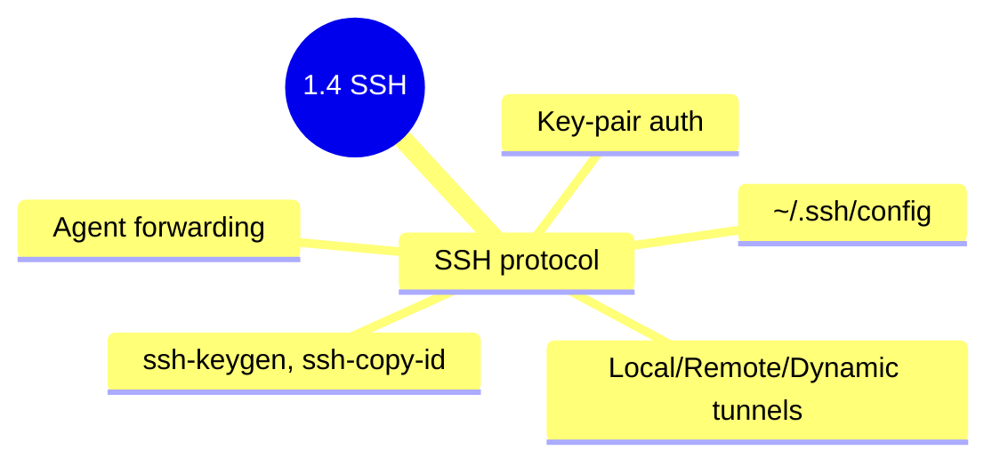

## 1.4.4 Subchapter Review: Cheatsheet and Interview Prep

This review covers only the material presented in Notes 1.4.1 (SSH Protocol and Basics), 1.4.2 (Key Pair Authentication), and 1.4.3 (Advanced SSH Tunneling and Config). No forward referencing beyond what was explicitly introduced.




***

## Cheatsheet: SSH Mastery

### Basic SSH Commands

| Command                   | Purpose              | Example                                              |
| ------------------------- | -------------------- | ---------------------------------------------------- |
| `ssh user@host`           | Interactive login    | `ssh alice@server.example.com`                       |
| `ssh user@host "cmd"`     | Remote command       | `ssh alice@server "ls -la /var/log"`                 |
| `ssh -p port`             | Non-standard port    | `ssh -p 2222 alice@server`                           |
| `ssh -i keyfile`          | Specify private key  | `ssh -i ~/.ssh/mykey alice@server`                   |
| `ssh -v` / `-vv` / `-vvv` | Verbose debugging    | `ssh -vvv alice@server`                              |
| `ssh -t`                  | Force TTY allocation | `ssh -t alice@server "sudo systemctl restart nginx"` |
| `ssh -A`                  | Forward agent        | `ssh -A alice@bastion`                               |
| `ssh -G host`             | Print effective config | `ssh -G prod-db \| grep identityfile`              |

### SSH Escape Sequences (During Active Session)

| Escape | Action | Use Case |
|--------|--------|----------|
| `~.` | Terminate connection | **Kill hung/frozen session** |
| `~C` | Open SSH command line | Add/cancel port forwards mid-session |
| `~#` | List forwarded connections | Debug active tunnels |
| `~?` | Show escape help | List all available escapes |

> Press `Enter` first, then `~` and the character.

### SSH Server Configuration (`/etc/ssh/sshd_config`)

| Directive                | Recommended Value                                       | Effect                     |
| ------------------------ | ------------------------------------------------------- | -------------------------- |
| `Port`                   | `22` (or custom)                                        | Listening port             |
| `PermitRootLogin`        | `no`                                                    | Disable direct root access |
| `PasswordAuthentication` | `no`                                                    | Require keys only          |
| `PubkeyAuthentication`   | `yes`                                                   | Enable key auth            |
| `MaxAuthTries`           | `3`                                                     | Limit failed attempts      |
| `ClientAliveInterval`    | `300`                                                   | Send keepalive every 5 min |
| `GatewayPorts`           | `no` (or `yes` for remote forwarding to all interfaces) | Bind remote forwards       |

```bash
# After changing config
sudo systemctl reload sshd   # Graceful (no disconnect)
sudo systemctl restart sshd  # Full restart
```

### SSH Client Configuration (`~/.ssh/config`)

| Directive             | Example                            | Purpose               |
| --------------------- | ---------------------------------- | --------------------- |
| `Host`                | `Host prod-db`                     | Alias for connection  |
| `HostName`            | `HostName 10.0.1.50`               | Actual server address |
| `User`                | `User alice`                       | Remote username       |
| `Port`                | `Port 2222`                        | SSH port              |
| `IdentityFile`        | `IdentityFile ~/.ssh/mykey`        | Private key to use    |
| `ProxyJump`           | `ProxyJump bastion`                | Jump host             |
| `LocalForward`        | `LocalForward 5432 localhost:5432` | Auto tunnel           |
| `ServerAliveInterval` | `ServerAliveInterval 60`           | Keep connection alive |

```bash
# Required permissions
chmod 700 ~/.ssh
chmod 600 ~/.ssh/config
chmod 600 ~/.ssh/authorized_keys
chmod 600 ~/.ssh/id_*      # Private keys
chmod 644 ~/.ssh/*.pub     # Public keys
```

### Key Management Commands

| Command                  | Purpose                   | Example                                              |
| ------------------------ | ------------------------- | ---------------------------------------------------- |
| `ssh-keygen -t ed25519`  | Generate key pair         | `ssh-keygen -t ed25519 -f ~/.ssh/mykey -C "comment"` |
| `ssh-keygen -y -f key`   | Extract public from private | `ssh-keygen -y -f ~/.ssh/id_ed25519 > id_ed25519.pub` |
| `ssh-keygen -p -f key`   | Change passphrase         | `ssh-keygen -p -f ~/.ssh/id_ed25519`                 |
| `ssh-keygen -lf key`     | View fingerprint          | `ssh-keygen -lf ~/.ssh/id_ed25519.pub`               |
| `ssh-keygen -Lf cert`    | View certificate details  | `ssh-keygen -Lf ~/.ssh/id_ed25519-cert.pub`          |
| `ssh-copy-id user@host`  | Copy public key to server | `ssh-copy-id -i ~/.ssh/mykey.pub alice@server`       |
| `ssh-add`                | Add key to agent          | `ssh-add ~/.ssh/mykey`                               |
| `ssh-add -l`             | List loaded keys          | `ssh-add -l`                                         |
| `ssh-add -t seconds`     | Add with timeout          | `ssh-add -t 3600 ~/.ssh/mykey`                       |
| `ssh-add -c`             | Require confirmation      | `ssh-add -c ~/.ssh/mykey`                            |
| `ssh-add -D`             | Remove all keys           | `ssh-add -D`                                         |
| `ssh-add -x` / `-X`      | Lock / unlock agent       | `ssh-add -x` (enter password)                        |
| `eval "$(ssh-agent -s)"` | Start agent               | (run at session start)                               |

### SSH Escape Sequences

| Sequence | Action                                | When to Use                               |
| -------- | ------------------------------------- | ----------------------------------------- |
| `~.`     | Disconnect (kill hung connection)     | Connection frozen, Ctrl+C doesn't work    |
| `~?`     | Show escape command list              | Remember available options                |
| `~^Z`    | Suspend SSH                           | Need local shell temporarily              |
| `~#`     | List forwarded connections            | Debug active tunnels                      |
| `~C`     | Open SSH command line                 | Add port forwarding without disconnecting |
| `~&`     | Background SSH                        | Keep tunnels alive while freeing terminal |

### Connection Multiplexing (`~/.ssh/config`)

```bash
Host *
    ControlMaster auto
    ControlPath ~/.ssh/sockets/%r@%h-%p
    ControlPersist 600
```

| Command                    | Purpose                    |
| -------------------------- | -------------------------- |
| `ssh -O check user@host`   | Check if master is running |
| `ssh -O stop user@host`    | Stop master gracefully     |
| `ssh -O exit user@host`    | Force exit all sessions    |

### `authorized_keys` Restriction Options

| Option                   | Effect                                 | Example                         |
| ------------------------ | -------------------------------------- | ------------------------------- |
| `command="cmd"`          | Force specific command                 | `command="/usr/bin/rsync"`      |
| `from="pattern"`         | Restrict source IP                     | `from="192.168.1.0/24"`         |
| `no-pty`                 | No terminal allocation                 | `no-pty`                        |
| `no-port-forwarding`     | Disable forwarding                     | `no-port-forwarding`            |
| `no-agent-forwarding`    | Disable agent forwarding               | `no-agent-forwarding`           |
| `restrict`               | All `no-*` flags                       | `restrict`                      |
| `permitopen="host:port"` | Allow only specific forwarding targets | `permitopen="db.internal:5432"` |

**Example restricted key:**

```
command="/opt/backup.sh",from="10.0.0.5",no-pty,no-agent-forwarding ssh-ed25519 AAAAC3NzaC1lZDI1NTE5AAAAI... backup@ci
```

### SSH Forwarding Types

| Type                | Command                               | Direction              | Use Case                 |
| ------------------- | ------------------------------------- | ---------------------- | ------------------------ |
| **Local**           | `ssh -L local:dest:port user@server`  | Client → Server → Dest | Access internal services |
| **Remote**          | `ssh -R remote:dest:port user@server` | Server → Client → Dest | Expose local service     |
| **Dynamic (SOCKS)** | `ssh -D local_port user@server`       | SOCKS5 proxy           | Proxy any application    |

```bash
# Local forwarding examples
ssh -L 8080:web.internal:80 alice@bastion
ssh -fN -L 5432:db.internal:5432 alice@bastion   # Background

# Remote forwarding (server needs GatewayPorts)
ssh -R 8080:localhost:3000 alice@bastion

# Dynamic SOCKS proxy
ssh -D 1080 alice@bastion
curl --socks5 localhost:1080 https://api.internal
```

### Jump Host (Bastion) Methods

| Method               | Command/Config                                      | Requirement  |
| -------------------- | --------------------------------------------------- | ------------ |
| Two-step             | `ssh bastion` then `ssh target`                     | Any SSH      |
| `ProxyJump`          | `ssh -J bastion target`                             | OpenSSH 7.3+ |
| `ProxyJump` (config) | `ProxyJump bastion` in `~/.ssh/config`              | OpenSSH 7.3+ |
| `ProxyCommand`       | `ssh -o ProxyCommand="ssh -W %h:%p bastion" target` | OpenSSH 5.4+ |

**Config example:**

```bash
Host bastion
    HostName jump.company.com
    User alice

Host internal-*
    ProxyJump bastion
    User ubuntu
```

### Essential `~/.ssh/config` Patterns

| Pattern           | Example                               | Effect                               |
| ----------------- | ------------------------------------- | ------------------------------------ |
| Host wildcard     | `Host 10.0.*.*`                       | Match IP range                       |
| ProxyJump         | `ProxyJump bastion`                   | Automatic bastion                    |
| LocalForward      | `LocalForward 8080 web:80`            | Auto-tunnel on connect               |
| IdentityFile      | `IdentityFile ~/.ssh/mykey`           | Specify key per host                 |
| IdentitiesOnly    | `IdentitiesOnly yes`                  | Only try specified key               |
| ForwardX11        | `ForwardX11 yes`                      | Enable X11 forwarding                |
| ControlMaster     | `ControlMaster auto`                  | Enable connection multiplexing       |
| ControlPath       | `ControlPath ~/.ssh/sockets/%r@%h-%p` | Socket path for multiplexing         |
| ControlPersist    | `ControlPersist 600`                  | Keep master alive 10 min after close |

### autossh for Persistent Tunnels

```bash
# Install
sudo apt install autossh   # Debian/Ubuntu
sudo dnf install autossh   # RHEL

# Persistent tunnel with keepalive
autossh -M 0 -fN \
    -o "ServerAliveInterval 30" \
    -o "ServerAliveCountMax 3" \
    -L 5432:db.internal:5432 \
    alice@bastion
```

### X11 Forwarding

| Flag | Name      | Security                  | Use When                  |
| ---- | --------- | ------------------------- | ------------------------- |
| `-X` | Untrusted | Restricts X server access | Default, untrusted server |
| `-Y` | Trusted   | Full X server access      | Fully trusted server      |

```bash
# Run graphical app remotely
ssh -X alice@server
alice@server$ firefox &
```

***

## Comparison Tables

### Key Types Comparison

| Type     | Command                      | Security  | Speed     | Compatibility       | Recommendation      |
| -------- | ---------------------------- | --------- | --------- | ------------------- | ------------------- |
| Ed25519  | `ssh-keygen -t ed25519`      | Excellent | Very fast | OpenSSH 6.5+ (2014) | **Default choice**  |
| RSA 4096 | `ssh-keygen -t rsa -b 4096`  | Good      | Slow      | All versions        | Legacy systems only |
| ECDSA    | `ssh-keygen -t ecdsa -b 521` | Good      | Fast      | Most                | Niche use           |
| DSA      | `ssh-keygen -t dsa`          | Broken    | N/A       | Deprecated          | **Never use**       |

### Authentication Methods Comparison

| Method                        | Security                 | Convenience             | Automation Friendly   | Production Use                          |
| ----------------------------- | ------------------------ | ----------------------- | --------------------- | --------------------------------------- |
| Password                      | Low (brute force)        | Medium                  | No (requires input)   | **No**                                  |
| Key (no passphrase)           | Medium (key file stolen) | High                    | Yes                   | **No** (except CI/CD with restrictions) |
| Key (with passphrase + agent) | High                     | High (after agent load) | With agent forwarding | **Yes**                                 |
| Key (restricted)              | Very high                | High                    | Yes                   | **Yes** (CI/CD, backups)                |

### Forwarding Types Comparison

| Feature               | Local (-L)         | Remote (-R)             | Dynamic (-D)                |
| --------------------- | ------------------ | ----------------------- | --------------------------- |
| Client binds port     | Yes                | No                      | Yes (SOCKS)                 |
| Server binds port     | No                 | Yes                     | No                          |
| Multiple destinations | Manual per port    | Manual per port         | Yes (any)                   |
| Application support   | Per-application    | Per-application         | Any SOCKS app               |
| DNS leaks possible    | N/A                | N/A                     | Yes (use --socks5-hostname) |
| Typical use           | Access internal DB | Expose local dev server | Secure browsing, API proxy  |

***

## Interview Questions (Scenario-Based)

These questions assume only knowledge from Subchapter 1.4. Answers reference only concepts from 1.4.1, 1.4.2, and 1.4.3.

### Question 1

**Scenario:** You are troubleshooting a CI/CD pipeline that deploys code to a production server. The pipeline uses SSH key authentication and runs as the `jenkins` user. Recently, the pipeline started failing with "Permission denied (publickey)". You can SSH manually from the Jenkins server to the production server using the same key.

**Question:** What are the three most likely causes, and how would you verify each?

**Answer:**

**Three most likely causes:**

1. **Key permissions on the Jenkins server changed** – The private key file may have been modified with incorrect permissions (not `600`), or the `.ssh` directory permissions changed (not `700`). SSH is strict about permissions.

   **Verification:**

   ```bash
   ls -la ~jenkins/.ssh/
   # Private key must be 600 (-rw-------)
   # .ssh directory must be 700 (drwx------)
   ```

2. **The** **`authorized_keys`** **entry on the production server was modified or removed** – Someone may have edited the file, changed restrictions, or a configuration management run overwrote it.

   **Verification:**

   ```bash
   # On production server, check jenkins user's authorized_keys
   sudo cat ~jenkins/.ssh/authorized_keys
   # Compare the key fingerprint with Jenkins server's public key
   ssh-keygen -lf ~jenkins/.ssh/id_ed25519.pub
   ```

3. **Key restrictions were added to** **`authorized_keys`** – A `command="..."` restriction may be blocking the pipeline's command if it doesn't match exactly.

   **Verification:**

   ```bash
   # On production server, look for options in authorized_keys
   grep -E "^(command=|from=|no-pty)" ~jenkins/.ssh/authorized_keys
   # If command= is set, ensure it matches what the pipeline runs
   ```

**Debugging command to run on Jenkins server:**

```bash
# Verbose SSH to see exactly which key is offered and why it's rejected
ssh -vvv -i ~jenkins/.ssh/deploy_key jenkins@prod-server
# Look for:
# - "Offering public key" – which key is offered
# - "Authentication refused" – why it was rejected
```

**Quick fix if permissions are wrong:**

```bash
chmod 700 ~jenkins/.ssh
chmod 600 ~jenkins/.ssh/id_ed25519
chmod 644 ~jenkins/.ssh/id_ed25519.pub
chmod 600 ~jenkins/.ssh/authorized_keys   # if it exists locally
```

### Question 2

**Scenario:** Your company's security team mandates that all production databases (PostgreSQL on port 5432) must not be exposed to the internet. Developers need to run queries from their laptops for debugging. The database server is on a private subnet (`10.0.10.5`), accessible only from a bastion host (`bastion.company.com`).

**Question:** Design an SSH tunneling solution that allows developers to connect to the database securely. Provide the exact command and explain how it works. Also, describe how to make this persistent so developers don't need to remember the command.

**Answer:**

**Solution: Local port forwarding through the bastion host.**

**Command (run on developer's laptop):**

```bash
ssh -fN -L 5433:10.0.10.5:5432 alice@bastion.company.com
```

**Explanation of flags:**

* `-f` – Background the SSH process after authentication (no terminal window stays open)

* `-N` – Do not execute a remote command (forwarding only)

* `-L 5433:10.0.10.5:5432` – Forward local port 5433 to `10.0.10.5:5432` via the bastion

* `alice@bastion.company.com` – SSH user and bastion host

**How it works:**

1. Developer connects to `localhost:5433` using `psql -h localhost -p 5433`
2. SSH client encrypts the traffic and sends it through the SSH session to the bastion
3. Bastion decrypts and forwards the connection to `10.0.10.5:5432`
4. Database responds, traffic flows back through the same tunnel
5. Database never sees a direct connection from the internet – only from the bastion

**Test the tunnel:**

```bash
# In another terminal, verify the local port is listening
ss -tlnp | grep 5433

# Test database connection
psql -h localhost -p 5433 -U dbuser -d production_db
```

**Persistent setup using** **`~/.ssh/config`:**

Add to `~/.ssh/config`:

```bash
Host prod-db-tunnel
    HostName bastion.company.com
    User alice
    LocalForward 5433 10.0.10.5:5432
    ExitOnForwardFailure yes
    ServerAliveInterval 60
```

Then developers can create the tunnel with:

```bash
ssh -fN prod-db-tunnel
```

**For even better persistence (systemd user service or launchd):**

Create `~/.config/systemd/user/ssh-tunnel.service`:

```ini
[Unit]
Description=SSH tunnel to production database
After=network.target

[Service]
Type=simple
ExecStart=/usr/bin/ssh -NT prod-db-tunnel
Restart=always
RestartSec=10

[Install]
WantedBy=default.target
```

Enable and start:

```bash
systemctl --user daemon-reload
systemctl --user enable ssh-tunnel.service
systemctl --user start ssh-tunnel.service
```

### Question 3

**Scenario:** You have a monitoring probe that needs to collect metrics from an internal service running on `https://metrics.internal:9090`. The probe runs on a machine with no direct access to the internal network, but it can SSH to a jump host. The jump host has `nc` (netcat) installed.

**Question:** How can the probe run a one-liner to fetch `https://metrics.internal:9090/metrics` without establishing an interactive SSH session? Provide the command and explain each component.

**Answer:**

**Solution: Remote command execution with** **`ProxyCommand`** **or using SSH's built-in** **`-W`** **flag.**

**Method 1: Using** **`ssh -W`** **(cleanest, OpenSSH 5.4+):**

```bash
ssh -o ProxyCommand="ssh -W metrics.internal:9090 user@jump-host" probe-user@localhost "GET /metrics HTTP/1.0\r\nHost: metrics.internal\r\n\r\n"
```

**Method 2: Using netcat on the jump host:**

```bash
ssh -o ProxyCommand="ssh user@jump-host nc metrics.internal 9090" probe-user@localhost "GET /metrics HTTP/1.0\r\nHost: metrics.internal\r\n\r\n"
```

**Method 3: Simplified with** **`~/.ssh/config`** **(recommended for repeated use):**

Add to `~/.ssh/config` on the probe machine:

```bash
Host metrics-proxy
    HostName jump-host
    User user
    DynamicForward 1080
```

Then use `curl` with SOCKS proxy:

```bash
# Create SOCKS tunnel in background
ssh -fN -D 1080 user@jump-host

# Fetch metrics through the tunnel
curl --socks5-hostname localhost:1080 https://metrics.internal:9090/metrics
```

**Explanation of Method 1:**

* `ProxyCommand="ssh -W metrics.internal:9090 user@jump-host"` – Tells SSH to connect through a proxy that forwards to `metrics.internal:9090` via the jump host

* `-W` – Forward stdin/stdout to the specified host:port (like netcat but built-in)

* `probe-user@localhost` – The final target (localhost because the proxy does the actual connection)

* The HTTP request is sent as a raw string (for HTTPS this is more complex; use `curl` with SOCKS)

**Best solution for production monitoring (using** **`curl`** **and SOCKS):**

```bash
# Start SOCKS tunnel in background
ssh -fN -D 1080 user@jump-host

# Fetch metrics (SOCKS5 with DNS over tunnel)
curl --socks5-hostname localhost:1080 --fail --silent https://metrics.internal:9090/metrics

# Kill tunnel when done
pkill -f "ssh -fN -D 1080"
```

**Why this works for monitoring scripts:**

* Non-interactive – no TTY needed

* Can be run from cron or systemd timers

* SOCKS proxy handles DNS resolution through the tunnel (no DNS leaks)

* The tunnel can be started/stopped per script run or kept persistent

### Question 4

**Scenario:** A developer accidentally committed their private SSH key to a public GitHub repository. The key was there for 15 minutes before they realized and removed it. The key was used to access 10 production servers with unrestricted `authorized_keys` (no command restrictions, no IP restrictions, no passphrase).

**Question:** What is the risk, and what immediate steps should be taken to secure the servers? What changes should be made to prevent this from happening again?

**Answer:**

**Risk assessment:**

* **Extreme risk.** Anyone who cloned the repository during those 15 minutes now has the private key.

* The key has no passphrase (or if it had one, it could be brute-forced).

* No restrictions in `authorized_keys` means an attacker can get a root shell (if key is for root) or a user shell (then attempt privilege escalation).

* The attacker can access all 10 production servers immediately.

**Immediate steps (within minutes of discovery):**

1. **Remove the key from all 10 production servers immediately:**

   ```bash
   # On each server, as root or user that owns the key
   ssh-keygen -R "key-fingerprint"  # Not directly – manually edit
   # Or remove the specific line from ~/.ssh/authorized_keys
   vi ~/.ssh/authorized_keys
   # Delete the line containing the compromised public key
   ```

   **Bulk removal script:**

   ```bash
   for server in server1 server2 server3; do
       ssh root@$server "sed -i '/ssh-ed25519 AAAAC3NzaC1lZDI1NTE5AAAAI.../d' ~/.ssh/authorized_keys"
   done
   ```

2. **Rotate (replace) the key for legitimate access:**

   ```bash
   # Generate new key pair
   ssh-keygen -t ed25519 -f ~/.ssh/id_ed25519_new -C "replacement-for-compromised"

   # Copy new key to all servers
   ssh-copy-id -i ~/.ssh/id_ed25519_new.pub user@server
   ```

3. **Audit server logs for unauthorized access during the exposure window:**

   ```bash
   # Check auth log for connections using the compromised key
   grep "Accepted publickey" /var/log/auth.log | grep "AAAAC3NzaC1lZDI1NTE5AAAAI..."
   # Look for unusual source IPs or times
   ```

4. **Consider the key compromised forever.** Assume an attacker has it and may have already used it.

**Preventive measures for the future:**

1. **Never store private keys in version control.** Add to `.gitignore`:

   ```bash
   echo "*.key" >> .gitignore
   echo "id_*" >> .gitignore
   echo ".ssh/" >> .gitignore
   ```

2. **Use key restrictions in** **`authorized_keys`** **(principle of least privilege):**

   ```bash
   # Instead of unrestricted key, add restrictions
   command="/usr/bin/rsync --server --sender -v . /backups",from="10.0.0.0/8",no-pty,no-agent-forwarding,no-port-forwarding ssh-ed25519 AAAA... backup-user
   ```

3. **Use a dedicated bastion host** so production servers only accept connections from the bastion, not directly from developer laptops.

4. **Require passphrases on all private keys** and use `ssh-agent` so developers only enter passphrase once per session.

5. **Implement a hardware token or SSH CA** (Certificate Authority) so keys can be short-lived and revoked centrally instead of editing `authorized_keys` on every server.

6. **Run regular scans for secrets in git repositories** using tools like `truffleHog` or `git-secrets`.

**Post-incident automation:**

```bash
# Add git pre-commit hook to prevent key commits
cat > .git/hooks/pre-commit << 'EOF'
#!/bin/bash
if grep -q "BEGIN.*PRIVATE KEY" $(git diff --cached --name-only); then
    echo "ERROR: Private key detected in commit. Aborting."
    exit 1
fi
EOF
chmod +x .git/hooks/pre-commit
```

### Question 5

**Scenario:** You manage 100+ EC2 instances on AWS. Each instance has a different key pair. Developers constantly ask "Which key do I use for server X?" and often try the wrong key, causing authentication delays. You cannot use a central SSH CA or AWS Systems Manager due to compliance restrictions.

**Question:** Using only SSH client configuration features, how would you simplify access so developers can type `ssh server-01` and automatically use the correct key, username, and jump host? Provide the configuration.

**Answer:**

**Solution: Use** **`~/.ssh/config`** **with patterns and** **`IdentityFile`** **directives.**

**Configuration file (`~/.ssh/config`):**

```bash
# Global defaults for all AWS EC2 instances
Host *.compute.amazonaws.com *.ec2.internal
    User ubuntu                              # Most Ubuntu AMIs use ubuntu
    StrictHostKeyChecking accept-new
    ServerAliveInterval 60
    ServerAliveCountMax 3
    Compression yes

# Development environment (keys in dev folder)
Host dev-*
    User ubuntu
    IdentityFile ~/.ssh/aws/dev/dev-key.pem
    StrictHostKeyChecking no                # Dev only – ephemeral

# Staging environment
Host staging-*
    User admin
    IdentityFile ~/.ssh/aws/staging/staging-key-ed25519
    ProxyJump bastion.staging.company.com

# Production environment (requires bastion)
Host prod-*
    User ec2-user                           # Amazon Linux uses ec2-user
    IdentityFile ~/.ssh/aws/prod/prod-key-ed25519
    ProxyJump bastion.prod.company.com
    LogLevel VERBOSE                        # Audit connection attempts

# Specific server overrides
Host db-primary
    HostName 10.20.30.40
    User postgres
    IdentityFile ~/.ssh/aws/prod/db-tunnel-key
    LocalForward 5432 localhost:5432        # Auto-tunnel to database

# Fallback for any IP pattern (if no other match)
Host 10.*.*.* 172.16.*.* 192.168.*.*
    User admin
    IdentityFile ~/.ssh/internal/default-key
```

**Organized key directory structure:**

```bash
~/.ssh/aws/
├── dev/
│   └── dev-key.pem
├── staging/
│   ├── staging-key-ed25519
│   └── staging-key-ed25519.pub
├── prod/
│   ├── prod-key-ed25519
│   ├── prod-key-ed25519.pub
│   └── db-tunnel-key
└── config
```

**Usage examples:**

```bash
# Developer doesn't need to remember username, key, or bastion
ssh prod-web-01        # Uses prod-key, bastion, ec2-user
ssh staging-db-02      # Uses staging-key, direct (no bastion), admin
ssh dev-app-03         # Uses dev-key.pem, ubuntu, no strict host checking
ssh db-primary         # Uses db-tunnel-key, auto-tunnels port 5432
```

**Bonus: Tab completion for host aliases (bash):**

Add to `~/.bashrc`:

```bash
# Complete ~/.ssh/config Host entries
complete -W "$(grep ^Host ~/.ssh/config | awk '{print $2}' | grep -v '*')" ssh
```

**Alternative: Use** **`Include`** **to split configurations by environment:**

```bash
# ~/.ssh/config
Include config.d/*.conf

# ~/.ssh/config.d/dev.conf
Host dev-*
    User ubuntu
    IdentityFile ~/.ssh/aws/dev/dev-key.pem

# ~/.ssh/config.d/prod.conf
Host prod-*
    User ec2-user
    ProxyJump bastion.prod.company.com
    IdentityFile ~/.ssh/aws/prod/prod-key-ed25519
```

**Verification that configuration works:**

```bash
# Test which key would be used (without connecting)
ssh -G prod-web-01 | grep identityfile
# Output: identityfile ~/.ssh/aws/prod/prod-key-ed25519

# Test connection with verbose to see key selection
ssh -v prod-web-01
# Look for: "debug1: identity file ~/.ssh/aws/prod/prod-key-ed25519"
```

***

### Question 6

**Scenario:** You're connected to a production server via SSH through a bastion host. Suddenly, you realize you need to access a database on port 5432, but you forgot to set up the tunnel before connecting. You don't want to disconnect because you're in the middle of debugging and have context loaded in your terminal.

**Question:** How can you add a port forward without disconnecting? Walk through the exact steps.

**Answer:**

**Solution: Use SSH escape sequence `~C` to open the SSH command line and add a local forward.**

**Step-by-step:**

1. **Ensure you're at the beginning of a line** – Press Enter to guarantee you're on a new line.

2. **Type the escape sequence** – Type `~C` (tilde, then capital C).

3. **SSH command prompt appears:**

   ```text
   ssh>
   ```

4. **Add the local port forward:**

   ```text
   ssh> -L 5432:db.internal:5432
   Forwarding port.
   ```

5. **Verify the forward is active:**

   ```text
   ssh> ?
   Commands:
     -L[bind_address:]port:host:hostport    Request local forward
     -R[bind_address:]port:host:hostport    Request remote forward
     -KL[bind_address:]port                 Cancel local forward
     -KR[bind_address:]port                 Cancel remote forward
   
   Active local forwardings:
     5432 -> db.internal:5432
   ```

6. **Return to normal session** – Press Enter.

7. **Test the forward** in another terminal on your laptop:

   ```bash
   psql -h localhost -p 5432 -U dbuser
   # Connects through the tunnel!
   ```

**View all active forwards:**

```bash
# From within the SSH session, press Enter then:
~#
# Shows list of all forwarded connections
```

**Cancel a forward when done:**

```text
~C
ssh> -KL 5432
Canceled forwarding.
```

**Why this matters:** In real production scenarios, you often discover mid-session that you need additional access. This escape sequence prevents context loss and reconnection delays.

---

### Question 7

**Scenario:** Your team has 15 developers, each with their own SSH key. When a developer leaves the company, security requires that their access be revoked within 24 hours across 50 servers. Currently, this involves manually editing `~/.ssh/authorized_keys` on each server.

**Question:** What SSH feature would dramatically simplify onboarding and offboarding, and how would you implement it?

**Answer:**

**Solution: Implement SSH Certificate Authority (CA) for user authentication.**

**Why certificates solve this:**

| Aspect                | Current (Individual Keys)              | With SSH CA                              |
| --------------------- | -------------------------------------- | ---------------------------------------- |
| Onboarding            | Add public key to 50 servers           | Sign user's key once with CA             |
| Offboarding           | Remove key from 50 servers             | Don't renew certificate (or add to KRL)  |
| Key rotation          | Replace on 50 servers                  | Issue new certificate                    |
| Access duration       | Keys never expire                      | Certificates have validity period        |
| Audit trail           | Just key fingerprints                  | Identity embedded in certificate         |

**Implementation steps:**

1. **Create the User CA (one-time setup):**

   ```bash
   # On a secure CA management server
   ssh-keygen -t ed25519 -f /secure/user_ca -C "Company User CA"
   # Store this private key securely (HSM, vault, or encrypted backup)
   ```

2. **Configure all 50 servers to trust the CA:**

   ```bash
   # Copy CA public key to each server
   sudo cp user_ca.pub /etc/ssh/user_ca.pub

   # Add to /etc/ssh/sshd_config
   TrustedUserCAKeys /etc/ssh/user_ca.pub

   # Reload SSH
   sudo systemctl reload sshd
   ```

   For automation:

   ```bash
   for server in $(cat server_list.txt); do
       scp user_ca.pub root@$server:/etc/ssh/user_ca.pub
       ssh root@$server 'echo "TrustedUserCAKeys /etc/ssh/user_ca.pub" >> /etc/ssh/sshd_config && systemctl reload sshd'
   done
   ```

3. **Onboarding: Sign new developer's key:**

   ```bash
   # Developer generates their key pair
   ssh-keygen -t ed25519 -f ~/.ssh/id_ed25519

   # Developer sends public key to CA admin
   # CA admin signs it
   ssh-keygen -s /secure/user_ca \
       -I "alice@company.com" \
       -n alice,devteam \
       -V +30d \
       ~/.ssh/id_ed25519.pub
   
   # -I: Identity (for audit logs)
   # -n: Principals (allowed usernames – alice and devteam work)
   # -V: Validity (+30d = 30 days)
   # Creates: id_ed25519-cert.pub
   ```

4. **Developer uses certificate:**

   ```bash
   # Certificate file sits next to the key
   ls ~/.ssh/
   # id_ed25519
   # id_ed25519.pub
   # id_ed25519-cert.pub   <- certificate

   # SSH automatically uses certificate if present
   ssh alice@prod-server-01
   # Authenticated via certificate – no authorized_keys needed!
   ```

5. **Offboarding options:**

   **Option A: Don't renew** – If validity is 30 days, just don't issue new certificate.

   **Option B: Key Revocation List (KRL) for immediate revocation:**

   ```bash
   # Create/update revocation list
   ssh-keygen -k -f /etc/ssh/revoked_keys -u alice_id_ed25519-cert.pub
   
   # Add to sshd_config on all servers
   RevokedKeys /etc/ssh/revoked_keys
   
   # Distribute revoked_keys to all servers
   ```

**Practical recommendations:**

- **Certificate validity:** 7-30 days for developers, shorter for automation
- **Renewal automation:** Script that developers run to get new certificates
- **Store CA private key securely:** Never on a regular server; use HSM or Vault
- **Backup the CA:** If CA private key is lost, must reconfigure all servers

---

### Question 8

**Scenario:** You have a laptop with 12 SSH keys loaded in your agent (personal GitHub, work GitHub, 3 cloud providers, 6 project-specific keys, and a default key). When connecting to a new server, SSH often fails with "Too many authentication failures" because it tries all keys before the server's `MaxAuthTries` limit (set to 3).

**Question:** How do you fix this without removing keys from the agent, and what is the root cause of this behavior?

**Answer:**

**Root cause:** When you run `ssh user@server`, the SSH client tries keys in this order:

1. Keys specified with `-i` flag
2. Keys specified in `~/.ssh/config` with `IdentityFile`
3. Default keys (`id_rsa`, `id_ed25519`, etc.)
4. All keys loaded in `ssh-agent`

With 12 keys in the agent, SSH may offer 12 keys before finding the right one. If `MaxAuthTries` is 3, authentication fails after 3 rejected keys.

**Solution 1: Use `IdentitiesOnly yes` in `~/.ssh/config`**

```bash
# ~/.ssh/config

# Personal GitHub – only use GitHub key
Host github.com
    HostName github.com
    User git
    IdentityFile ~/.ssh/id_ed25519_github_personal
    IdentitiesOnly yes

# Work GitHub
Host github.com-work
    HostName github.com
    User git
    IdentityFile ~/.ssh/id_ed25519_github_work
    IdentitiesOnly yes

# AWS servers
Host aws-*
    IdentityFile ~/.ssh/id_ed25519_aws
    IdentitiesOnly yes

# GCP servers
Host gcp-*
    IdentityFile ~/.ssh/id_ed25519_gcp
    IdentitiesOnly yes

# Default for everything else – try one specific key
Host *
    IdentityFile ~/.ssh/id_ed25519
    IdentitiesOnly yes
```

**What `IdentitiesOnly yes` does:**

- SSH will **only** use the key specified by `IdentityFile`
- SSH will **not** try keys from the agent
- First key offered is the correct one → no `MaxAuthTries` issues

**Solution 2: Specify key on command line with `-i`**

```bash
# For one-off connections
ssh -i ~/.ssh/id_ed25519_project -o IdentitiesOnly=yes alice@server
```

**Solution 3: Organize keys into separate agents (advanced)**

```bash
# Start separate agent for work
eval "$(ssh-agent -s)"
export SSH_WORK_AGENT=$SSH_AUTH_SOCK

# Add only work keys
ssh-add ~/.ssh/id_ed25519_work

# For personal, start another agent
SSH_AUTH_SOCK=$(mktemp -u /tmp/ssh-XXXXXX)
eval "$(ssh-agent -a $SSH_AUTH_SOCK)"
ssh-add ~/.ssh/id_ed25519_personal

# Switch agents as needed
export SSH_AUTH_SOCK=$SSH_WORK_AGENT
```

**Verification that `IdentitiesOnly` is working:**

```bash
ssh -v server.example.com 2>&1 | grep "Offering"
# Should show only the one specified key, not all 12
```

**Best practice configuration (full example):**

```bash
# ~/.ssh/config

# Global: reasonable defaults, but allow agent keys as fallback
Host *
    ServerAliveInterval 60
    ServerAliveCountMax 3
    AddKeysToAgent yes
    
# All hosts where we know the correct key: disable agent enumeration
Host github.com gitlab.com bitbucket.org
    IdentityFile ~/.ssh/id_ed25519_git
    IdentitiesOnly yes

Host *.amazonaws.com *.ec2.internal
    IdentityFile ~/.ssh/id_ed25519_aws
    IdentitiesOnly yes
    User ec2-user

Host prod-* staging-*
    IdentityFile ~/.ssh/id_ed25519_company
    IdentitiesOnly yes
    ProxyJump bastion

# Unknown hosts: still use IdentitiesOnly with a default key
Host *
    IdentityFile ~/.ssh/id_ed25519
    IdentitiesOnly yes
```

---

### Question 9

**Scenario:** Your SSH connection to a remote server keeps dropping after 5-10 minutes of inactivity. This happens on your corporate network with a NAT firewall that has aggressive timeouts. You need to maintain long-running SSH sessions for development work.

**Question:** Explain the two types of SSH keepalives, which one you should use, and provide the complete configuration.

**Answer:**

**Two types of keepalives:**

| Type               | Layer       | Configuration                       | Behavior                                    |
| ------------------ | ----------- | ----------------------------------- | ------------------------------------------- |
| TCP Keepalives     | TCP (OS)    | `TCPKeepAlive yes` (sshd_config)    | OS sends TCP keepalive packets              |
| SSH Keepalives     | Application | `ServerAliveInterval` (client-side) | SSH sends encrypted keepalive inside tunnel |

**Why TCP keepalives are problematic:**

- NAT firewalls may not recognize TCP keepalive packets
- They're sent outside the encrypted tunnel
- Controlled by kernel parameters, not SSH
- Can be blocked by some firewalls

**Why SSH keepalives are preferred:**

- Sent inside the encrypted tunnel (firewall sees normal SSH traffic)
- More reliable through NAT and firewalls
- Configurable per-host in `~/.ssh/config`
- Automatically close sessions when connection is truly dead

**Complete client-side configuration (`~/.ssh/config`):**

```bash
# Global settings
Host *
    # Send keepalive every 60 seconds
    ServerAliveInterval 60
    # Disconnect after 3 missed responses (180 seconds total)
    ServerAliveCountMax 3
    # Keep TCP connection alive at OS level (redundant but harmless)
    TCPKeepAlive yes
```

**Server-side configuration (`/etc/ssh/sshd_config`) for inbound connections:**

```bash
# Send keepalive to clients every 60 seconds
ClientAliveInterval 60
# Disconnect after 3 missed responses
ClientAliveCountMax 3
# Keep TCP keepalives as backup
TCPKeepAlive yes
```

**How it works:**

```text
Laptop                          Server
  |                               |
  |  --- SSH Keepalive (60s) -->  |  (encrypted inside SSH tunnel)
  |  <-- Keepalive Response ---   |
  |                               |
  |  --- SSH Keepalive (120s) --> |
  |  <-- Keepalive Response ---   |
  |                               |
  |  --- SSH Keepalive (180s) --> |
  |  (no response - network dead) |
  |  --- SSH Keepalive (240s) --> |
  |  (still no response)          |
  |  --- SSH Keepalive (300s) --> |
  |  (3 missed - disconnect)      |
```

**Additional tips for aggressive NAT environments:**

1. **Use connection multiplexing** to reduce reconnection overhead:

   ```bash
   Host *
       ControlMaster auto
       ControlPath ~/.ssh/sockets/%r@%h-%p
       ControlPersist 10m
       ServerAliveInterval 30   # More aggressive for NAT
       ServerAliveCountMax 3
   ```

2. **Use `autossh` for automatic reconnection:**

   ```bash
   autossh -M 0 -o "ServerAliveInterval 30" -o "ServerAliveCountMax 3" alice@server
   ```

3. **For extremely aggressive firewalls (30-second timeout):**

   ```bash
   Host problem-network-*
       ServerAliveInterval 15
       ServerAliveCountMax 2
   ```

**Verifying keepalives are working:**

```bash
# Verbose output shows keepalive exchange
ssh -v alice@server 2>&1 | grep -i alive
# debug1: Requesting no-more-sessions@openssh.com
# debug1: ServerAliveInterval configured, waiting...
# debug1: Sending SSH2_MSG_IGNORE

# Watch for keepalive packets
# (on server, requires root)
sudo tcpdump -i eth0 port 22 -v | grep "SSH"
```

---

## Topics Covered in This Subchapter (Self-Check)

| Topic                                                  | Found in Note |
| ------------------------------------------------------ | ------------- |
| SSH protocol and architecture                          | 1.4.1         |
| Basic SSH connection commands                          | 1.4.1         |
| Server config (`/etc/ssh/sshd_config`)                 | 1.4.1         |
| Client config (`~/.ssh/config`)                        | 1.4.1, 1.4.3  |
| Host keys and `known_hosts`                            | 1.4.1         |
| `ssh-agent` basics                                     | 1.4.1         |
| Key pair generation (`ssh-keygen`)                     | 1.4.2         |
| `authorized_keys` file                                 | 1.4.2         |
| `ssh-copy-id` command                                  | 1.4.2         |
| Key restrictions (`command=`, `from=`, `no-pty`, etc.) | 1.4.2         |
| Key permissions (600, 700)                             | 1.4.2         |
| `ssh-agent` advanced usage                             | 1.4.2         |
| Agent forwarding (`ssh -A`)                            | 1.4.2         |
| Local port forwarding (`-L`)                           | 1.4.3         |
| Remote port forwarding (`-R`)                          | 1.4.3         |
| Dynamic SOCKS proxy (`-D`)                             | 1.4.3         |
| Background forwarding (`-fN`)                          | 1.4.3         |
| Jump hosts (`ProxyJump`, `-J`, `ProxyCommand`)         | 1.4.3         |
| Advanced `~/.ssh/config` options                       | 1.4.3         |
| `GatewayPorts` for remote forwarding                   | 1.4.3         |
| Troubleshooting tunnels                                | 1.4.3         |
| Escape sequences (`~.`, `~C`, `~#`)                    | 1.4.1         |
| Debugging config with `ssh -G`                         | 1.4.3         |

## Quick Command Reference (Used in Q&A Above)

| Command | Explanation |
|---------|-------------|
| `nc` (netcat) | Network utility for reading/writing to network connections. Used in `ProxyCommand` examples as a fallback when `-W` is unavailable. |
| `ss` (socket statistics) | Modern replacement for `netstat`. Used to verify listening ports for tunnels. |
| `systemd --user` | Per-user systemd instance. Used in Q2 for persistent SSH tunnels without root. |
| `truffleHog`, `git-secrets` | Tools that scan git history for accidentally committed secrets. Mentioned in Q4 as preventive measure. |
| SSH Certificate Authority (CA) | Advanced SSH feature where servers trust a CA instead of individual keys. Mentioned in Q4 as long-term solution. |

> **Note:** `ssh -G` (print effective config) is now covered in [1.4.3](./1.4.3_Advanced_SSH_Tunneling_and_Config.md).

***

---

## Backlinks

| Link | Relationship |
|------|--------------|
| [1.4.3 Advanced SSH Tunneling](./1.4.3_Advanced_SSH_Tunneling_and_Config.md) | Previous note |
| [1.4.1 SSH Protocol and Basics](./1.4.1_SSH_Protocol_and_Basics.md) | First note in subchapter |
| [1.4.2 Key Pair Authentication](./1.4.2_Key_Pair_Authentication.md) | Key management |
| [1.2.2 File Types and Permissions](../Subchapter_1.2/1.2.2_File_Types_Permissions_Basics.md) | Permissions referenced throughout |
| [1.5.1 Storage Management](../Subchapter_1.5/1.5.1_Storage_Management.md) | Next subchapter |

---

**End of Subchapter 1.4 Review**
