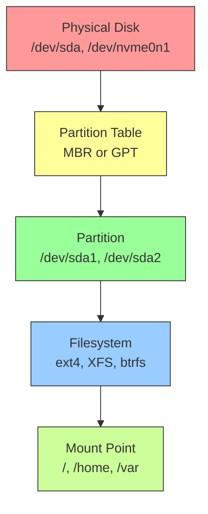

## 1.5.1 Partitioning and Filesystems: The Foundation of Persistent Storage

#### Why Storage Management Matters for Platform Engineers

Every server, container, and database relies on storage. As a platform engineer, you will:

* Provision disks for new servers (bare metal, VM, cloud volumes)

* Troubleshoot "No space left on device" errors (see 1.10.2)

* Resize filesystems when applications outgrow their partitions

* Choose the right filesystem for different workloads (database vs. logs vs. object storage)

* Understand the difference between MBR and GPT, partitions, and filesystems

This note covers **physical storage** – disks, partitions, and filesystems. Note 1.5.2 covers mounting and `/etc/fstab`. Note 1.5.3 covers **LVM** (Logical Volume Manager) for flexible storage management.

***

## Part 1: Storage Stack Overview



**Layer explanation:**

1. **Physical disk** – Raw hardware (SSD, HDD, NVMe, cloud volume)
2. **Partition table** – Divides disk into logical regions (MBR or GPT)
3. **Partition** – A contiguous region on disk (e.g., `/dev/sda1`)
4. **Filesystem** – Organizes files and directories on a partition (ext4, XFS)
5. **Mount point** – Attaches filesystem to the directory tree (e.g., `/`, `/home`)

***

## Part 2: Viewing Disk and Partition Information

### Basic Disk Inspection Commands

```bash
# List all block devices (disks and partitions)
lsblk
# Output:
# NAME    MAJ:MIN RM  SIZE RO TYPE MOUNTPOINT
# sda       8:0    0  100G  0 disk
# ├─sda1    8:1    0  512M  0 part /boot
# ├─sda2    8:2    0   98G  0 part /
# └─sda3    8:3    0  1.5G  0 part [SWAP]
# nvme0n1 259:0    0  500G  0 disk
# └─nvme0n1p1 259:1  0  500G  0 part /data

# Show filesystem disk space usage
df -h
# Output:
# Filesystem      Size  Used Avail Use% Mounted on
# /dev/sda2        98G   45G   48G  49% /
# /dev/sda1       510M  100M  411M  20% /boot

# Show inode usage (number of files/directories)
df -i
# Output:
# Filesystem      Inodes  IUsed  IFree IUse% Mounted on
# /dev/sda2       6.5M    450K   6.0M    7% /

# Show partition table
sudo fdisk -l /dev/sda
# or
sudo parted -l
```

### Understanding `lsblk` Output

| Column     | Meaning                        | Example                                     |
| ---------- | ------------------------------ | ------------------------------------------- |
| NAME       | Device name                    | `sda1` (first partition on first SCSI disk) |
| MAJ:MIN    | Major/minor device numbers     | `8:1`                                       |
| RM         | Removable (1=yes, 0=no)        | `0`                                         |
| SIZE       | Size with human-readable units | `100G`                                      |
| RO         | Read-only (1=yes, 0=no)        | `0`                                         |
| TYPE       | `disk`, `part`, `lvm`, `rom`   | `part`                                      |
| MOUNTPOINT | Where it's mounted (if any)    | `/boot`                                     |

### Disk Naming Conventions

| Prefix    | Bus Type      | Example                | Notes                             |
| --------- | ------------- | ---------------------- | --------------------------------- |
| `sdX`     | SCSI/SATA/USB | `/dev/sda`, `/dev/sdb` | Most common for virtualized disks |
| `hdX`     | IDE (old)     | `/dev/hda`             | Legacy, rarely seen               |
| `nvmeXnY` | NVMe SSD      | `/dev/nvme0n1`         | X=controller, Y=namespace         |
| `vdX`     | VirtIO (KVM)  | `/dev/vda`             | Common in cloud VMs               |
| `xvdX`    | Xen virtual   | `/dev/xvda`            | AWS older instance types          |

**Ordering:** `sda` = first disk, `sdb` = second disk, etc. **Not guaranteed persistent** across reboots if disks are hot-swapped. Use UUIDs or filesystem labels for persistence (covered in 1.5.2).

***

## Part 3: Partition Table Types

### MBR (Master Boot Record) – Legacy

| Feature            | MBR                                                                   |
| ------------------ | --------------------------------------------------------------------- |
| Maximum disk size  | 2 TB                                                                  |
| Maximum partitions | 4 primary, or 3 primary + 1 extended (with logical partitions inside) |
| Boot signature     | `0x55AA` at offset 510                                                |
| Compatibility      | All OSes, all bootloaders                                             |

### GPT (GUID Partition Table) – Modern Standard

| Feature            | GPT                                                                    |
| ------------------ | ---------------------------------------------------------------------- |
| Maximum disk size  | 9.4 ZB (zettabytes)                                                    |
| Maximum partitions | 128 (typical, can be more)                                             |
| Redundancy         | Backup partition table at end of disk                                  |
| CRC32 checksum     | Detects corruption                                                     |
| Compatibility      | UEFI required for booting; data disks work on BIOS with protective MBR |

**For platform engineers:** Use **GPT** for all new disks, especially those larger than 2 TB or on UEFI systems.

```bash
# Check partition table type
sudo fdisk -l /dev/sda | grep "Disklabel type"
# Disklabel type: gpt  (or dos for MBR)

# Using parted
sudo parted /dev/sda print | grep "Partition Table"
# Partition Table: gpt
```

***

## Part 4: Partitioning Tools

### `fdisk` – Classic, Interactive, MBR/GPT Support

```bash
# Interactive partitioning
sudo fdisk /dev/sdb

# Common fdisk commands (inside interactive mode):
# m - show help
# p - print partition table
# n - create new partition
# d - delete partition
# t - change partition type
# w - write changes to disk (save)
# q - quit without saving
```

**Example: Creating a new partition with** **`fdisk`:**

```bash
sudo fdisk /dev/sdb

# Inside fdisk:
Command (m for help): n
Partition number (1-128, default 1): [Enter]
First sector (2048-209715166, default 2048): [Enter]
Last sector, +/-sectors or +/-size{K,M,G,T,P} (2048-209715166, default 209715166): +50G
Created a new partition 1 of type 'Linux filesystem' and of size 50 GiB.

Command (m for help): w
The partition table has been altered.
```

**Explanation:**

* `n` – New partition

* First sector default `2048` – Aligns to 1 MiB boundary (performance optimization for SSDs)

* `+50G` – Create 50 GiB partition (use `+50G` not `50G`)

* `w` – Write to disk (without `w`, no changes are made)

### `parted` – More Powerful, Scriptable, GPT-Focused

```bash
# Interactive mode
sudo parted /dev/sdb

# Non-interactive commands (scriptable)
sudo parted /dev/sdb mklabel gpt                    # Create GPT table
sudo parted /dev/sdb mkpart primary ext4 0% 50%     # Partition 0% to 50%
sudo parted /dev/sdb mkpart primary ext4 50% 100%   # Partition 50% to end
sudo parted /dev/sdb print

# Remove partition 2
sudo parted /dev/sdb rm 2
```

**Parted alignment options:**

* `0%` – Start of disk

* `100%` – End of disk

* `50%` – Halfway point

* `-0` – End of disk (alternative syntax)

### `gdisk` – GPT-Focused (if fdisk lacks GPT features)

```bash
# Install if needed
sudo apt install gdisk   # Debian/Ubuntu
sudo dnf install gdisk   # RHEL/Rocky

# Interactive GPT partitioning
sudo gdisk /dev/sdb
```

***

## Part 5: Partition Types and Codes

When creating partitions, you specify a **type code** that hints at the partition's purpose.

| Type             | fdisk Code | parted Name  | Purpose                            |
| ---------------- | ---------- | ------------ | ---------------------------------- |
| Linux filesystem | `83`       | `linux`      | Regular data partition (ext4, XFS) |
| Linux swap       | `82`       | `linux-swap` | Swap space                         |
| Linux LVM        | `8e`       | `lvm`        | Physical volume for LVM            |
| Linux RAID       | `fd`       | `raid`       | Software RAID component            |
| EFI System       | `ef`       | `efi`        | UEFI boot partition (FAT32)        |
| BIOS boot        | `4`        | `bios-grub`  | GRUB BIOS boot partition           |

```bash
# Change partition type in fdisk
Command (m for help): t
Partition number (1-2): 1
Hex code (type L to list all codes): 8e
Changed type of partition 'Linux filesystem' to 'Linux LVM'.

# In parted
sudo parted /dev/sdb set 1 lvm on
```

***

## Part 6: Creating Filesystems

After partitioning, you must create a **filesystem** on the partition. This is like formatting a disk in Windows.

### Common Filesystem Types

| Filesystem | Max Size | Max File Size | Features                                                    | Use Case                                  |
| ---------- | -------- | ------------- | ----------------------------------------------------------- | ----------------------------------------- |
| **ext4**   | 1 EB     | 16 TB         | Journaling, backward compatible                             | General purpose (default for most Linux)  |
| **XFS**    | 8 EB     | 8 EB          | Excellent large file performance, online resize (grow only) | Large files, media servers, databases     |
| **btrfs**  | 16 EB    | 16 EB         | Snapshots, compression, RAID, checksums                     | Advanced features (Fedora default)        |
| **swap**   | N/A      | N/A           | Virtual memory                                              | Swap space (no filesystem, raw partition) |
| **FAT32**  | 2 TB     | 4 GB          | Universal compatibility                                     | Boot partitions, USB drives               |
| **NTFS**   | 256 TB   | 16 TB         | Windows compatibility                                       | Dual-boot, external drives                |

**For platform engineers:** Use **ext4** for general purpose, **XFS** for large files or high performance, **btrfs** if you need snapshots (but LVM + ext4 is more common in enterprise).

### Creating Filesystems

```bash
# Create ext4 filesystem on partition 1
sudo mkfs.ext4 /dev/sdb1

# Create XFS filesystem (install xfsprogs first)
sudo mkfs.xfs /dev/sdb1

# Create swap space
sudo mkswap /dev/sdb1

# Create FAT32 (for EFI partition)
sudo mkfs.fat -F32 /dev/sdb1

# Create filesystem with label (for easy identification)
sudo mkfs.ext4 -L data_drive /dev/sdb1
```

**`mkfs.ext4`** **important options:**

| Flag            | Meaning                               | Example                                |
| --------------- | ------------------------------------- | -------------------------------------- |
| `-L label`      | Set volume label                      | `-L mydata`                            |
| `-b size`       | Block size (1024, 2048, 4096)         | `-b 4096` (default)                    |
| `-m percentage` | Reserved blocks for root (default 5%) | `-m 1` (1% for large drives)           |
| `-N count`      | Number of inodes                      | `-N 500000` (for many small files)     |
| `-O feature`    | Enable filesystem features            | `-O ^has_journal` (disable journaling) |

**Reserved blocks (`-m`):** By default, 5% of space is reserved for root. On large drives (1+ TB), this wastes space. Reduce to 1%:

```bash
# Create filesystem with 1% reserved blocks
sudo mkfs.ext4 -m 1 /dev/sdb1

# Adjust reserved blocks on existing filesystem
sudo tune2fs -m 1 /dev/sdb1
```

***

## Part 7: Partition and Filesystem Verification

```bash
# Check filesystem (unmount first for consistency)
sudo umount /dev/sdb1
sudo fsck.ext4 -f /dev/sdb1   # -f force check even if clean

# Check XFS (XFS checks on mount automatically)
sudo xfs_repair /dev/sdb1

# Display filesystem information
sudo dumpe2fs -h /dev/sdb1 | grep -E "Block size|Inode count|Reserved block count"

# Display XFS info
sudo xfs_info /dev/sdb1

# Get filesystem UUID (universally unique identifier)
sudo blkid /dev/sdb1
# /dev/sdb1: UUID="a1b2c3d4-..." TYPE="ext4" LABEL="mydata"

# Get filesystem UUID (alternative)
ls -l /dev/disk/by-uuid/
```

***

## Part 8: Real-World Partitioning Schemes

### Scheme 1: Basic Server (Legacy BIOS, MBR)

```
/dev/sda1  - 512M  - ext4 - /boot
/dev/sda2  - 4G    - swap - [SWAP]
/dev/sda3  - rest  - ext4 - /
```

### Scheme 2: UEFI Server with Separate Data Partition

```
/dev/sda1  - 512M  - FAT32 - /boot/efi (EFI System Partition)
/dev/sda2  - 1G    - ext4  - /boot
/dev/sda3  - 8G    - swap  - [SWAP]
/dev/sda4  - 50G   - ext4  - /
/dev/sda5  - rest  - XFS   - /data
```

### Scheme 3: Database Server (Separate Logs and Data)

```
/dev/sda1  - 512M  - FAT32 - /boot/efi
/dev/sda2  - 1G    - ext4  - /boot
/dev/sda3  - 8G    - swap  - [SWAP]
/dev/sda4  - 50G   - ext4  - /
/dev/sdb1  - 200G  - XFS   - /var/lib/postgresql (data)
/dev/sdc1  - 100G  - XFS   - /var/log/postgresql (WAL logs)
```

### Scheme 4: LVM-Ready (Single partition for LVM)

```
/dev/sda1  - 512M  - FAT32 - /boot/efi
/dev/sda2  - 1G    - ext4  - /boot
/dev/sda3  - rest  - LVM PV - (managed by LVM)
```

LVM is covered in detail in 1.5.3.

***

## Quick Task: Create a Partition and Filesystem

*Use a test disk (loop device or spare disk). If no spare disk, create a loop device for practice.*

1. Create a 1GB test file and attach it as a loop device.
2. Create a GPT partition table on the loop device.
3. Create a 500MB partition.
4. Create an ext4 filesystem on the partition with label `test_data` and 1% reserved blocks.
5. Verify the filesystem with `blkid` and `dumpe2fs`.

> **Ready Solution:**
>
> ```bash
> # Task 1: Create test file and loop device
> dd if=/dev/zero of=~/testdisk.img bs=1M count=1024
> sudo losetup -f ~/testdisk.img
> # Find the loop device name
> losetup -l
> # Assume it's /dev/loop0
>
> # Task 2: Create GPT partition table
> sudo parted /dev/loop0 mklabel gpt
>
> # Task 3: Create 500MB partition
> sudo parted /dev/loop0 mkpart primary ext4 0% 500MB
>
> # Task 4: Create ext4 filesystem
> sudo mkfs.ext4 -L test_data -m 1 /dev/loop0p1
>
> # Task 5: Verify
> sudo blkid /dev/loop0p1
> # Output: /dev/loop0p1: LABEL="test_data" UUID="..." TYPE="ext4"
>
> sudo dumpe2fs -h /dev/loop0p1 | grep -E "Filesystem volume name|Block size|Reserved block count"
> # Should show: Filesystem volume name: test_data
>
> # Clean up
> sudo umount /dev/loop0p1 2>/dev/null
> sudo losetup -d /dev/loop0
> rm ~/testdisk.img
> ```

***

## Summary Table: Partition and Filesystem Commands

| Command                | Purpose                  | Example                                           |
| ---------------------- | ------------------------ | ------------------------------------------------- |
| `lsblk`                | List block devices       | `lsblk -f` (with filesystem info)                 |
| `df -h`                | Show disk usage          | `df -h /home`                                     |
| `df -i`                | Show inode usage         | `df -i`                                           |
| `sudo fdisk -l`        | List partition tables    | `sudo fdisk -l /dev/sda`                          |
| `sudo fdisk /dev/sdb`  | Interactive partitioning | (then `n`, `p`, `w`, etc.)                        |
| `sudo parted /dev/sdb` | Advanced partitioning    | `sudo parted /dev/sdb mkpart primary ext4 0% 50%` |
| `sudo mkfs.ext4`       | Create ext4 filesystem   | `sudo mkfs.ext4 -L data /dev/sdb1`                |
| `sudo mkfs.xfs`        | Create XFS filesystem    | `sudo mkfs.xfs /dev/sdb1`                         |
| `sudo mkswap`          | Create swap space        | `sudo mkswap /dev/sdb1`                           |
| `sudo blkid`           | Show filesystem UUIDs    | `sudo blkid /dev/sdb1`                            |
| `sudo fsck.ext4`       | Check ext4 filesystem    | `sudo fsck.ext4 -f /dev/sdb1`                     |
| `sudo tune2fs`         | Adjust ext4 parameters   | `sudo tune2fs -m 1 /dev/sdb1`                     |

### Filesystem Defaults Reference

| Filesystem | Command      | Default Reserved Blocks          | Max Size |
| ---------- | ------------ | -------------------------------- | -------- |
| ext4       | `mkfs.ext4`  | 5%                               | 1 EB     |
| XFS        | `mkfs.xfs`   | 0% (but uses space for metadata) | 8 EB     |
| btrfs      | `mkfs.btrfs` | 0%                               | 16 EB    |

***

**Next note (1.5.2)** will cover mounting filesystems, the `/etc/fstab` file, and how to automatically mount partitions at boot.

**Backward references:**

* File permissions from 1.2.2 (`sudo` required for most storage commands)

* User management from 1.3.1 (root access needed for partitioning)

* The `dd` command used in the lab was introduced in 1.1.2 (copying raw data)
