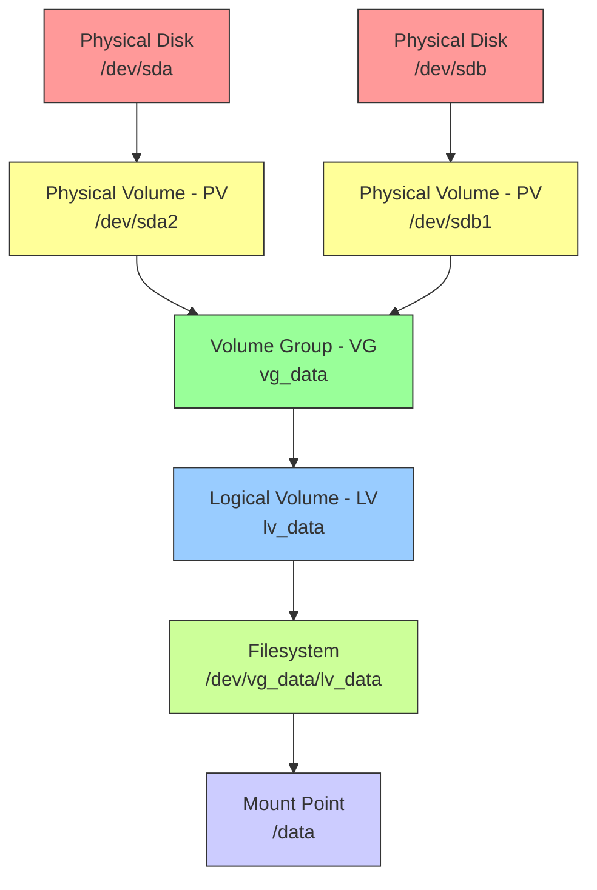

## 1.5.3 Logical Volume Manager (LVM): Dynamic Storage Management

#### Why LVM Matters

Traditional partitions (from 1.5.1) have a critical limitation: **they are fixed size**. If you need more space on `/var`, you cannot easily expand it. LVM solves this by adding a layer of abstraction between physical disks and filesystems:

* **Resize filesystems online** (grow or shrink) without unmounting

* **Combine multiple disks** into a single logical volume

* **Take snapshots** for backups or testing

* **Move data between physical disks** without downtime

For platform engineers, LVM is standard on most server installations (especially RHEL family) and essential for managing cloud volumes that can be expanded dynamically.

***

## Part 1: LVM Architecture – Three Layers



### The Three LVM Components

| Layer               | Abbreviation | Purpose                                | Example                  |
| ------------------- | ------------ | -------------------------------------- | ------------------------ |
| **Physical Volume** | PV           | A disk or partition marked for LVM use | `/dev/sda2`, `/dev/sdb1` |
| **Volume Group**    | VG           | Pool of storage from one or more PVs   | `vg_system`, `vg_data`   |
| **Logical Volume**  | LV           | Virtual partition carved from a VG     | `lv_root`, `lv_home`     |

**Analogy:**

* PV = individual bricks

* VG = pile of bricks

* LV = wall you build from the pile

***

## Part 2: Creating LVM from Scratch

### Step 1: Create Physical Volumes (PVs)

First, prepare partitions (or entire disks) for LVM. In 1.5.1, we created a partition with type `8e` (Linux LVM).

```bash
# Create PV on a partition
sudo pvcreate /dev/sdb1

# Create PV on an entire disk (no partition table)
sudo pvcreate /dev/sdc

# Verify PVs
sudo pvs
#   PV         VG   Fmt  Attr PSize   PFree
#   /dev/sdb1       lvm2 ---  100.00G 100.00G

# Detailed PV info
sudo pvdisplay /dev/sdb1
#   "/dev/sdb1" is a new physical volume of "100.00 GiB"
#   --- NEW Physical volume ---
#   PV Name               /dev/sdb1
#   VG Name               
#   PV Size               100.00 GiB
#   Allocatable           NO
#   PE Size               4.00 MiB
#   Total PE              25599
#   Free PE               25599
```

**PE (Physical Extent):** The smallest allocatable unit in LVM (default 4 MiB). All LVM operations work in PE units.

### Step 2: Create Volume Group (VG)

```bash
# Create VG named 'vg_data' containing /dev/sdb1
sudo vgcreate vg_data /dev/sdb1

# Add multiple PVs to same VG
sudo vgcreate vg_data /dev/sdb1 /dev/sdc1

# Add a PV to existing VG
sudo vgextend vg_data /dev/sdd1

# Verify VGs
sudo vgs
#   VG      #PV #LV #SN Attr   VSize   VFree
#   vg_data   1   0   0 wz--n- 100.00G 100.00G

# Detailed VG info
sudo vgdisplay vg_data
```

### Step 3: Create Logical Volume (LV)

```bash
# Create LV named 'lv_data' of size 50GB from VG 'vg_data'
sudo lvcreate -n lv_data -L 50G vg_data

# Create LV using percentage of VG (e.g., 50% of free space)
sudo lvcreate -n lv_data -l 50%FREE vg_data

# Create LV using all remaining free space
sudo lvcreate -n lv_data -l 100%FREE vg_data

# Verify LVs
sudo lvs
#   LV      VG      Attr       LSize   Pool Origin Data%  Meta%  Move Log Cpy%Sync Convert
#   lv_data vg_data -wi-a----- 50.00g

# Detailed LV info
sudo lvdisplay /dev/vg_data/lv_data

# Device path (two equivalent forms)
ls -l /dev/vg_data/lv_data
# lrwxrwxrwx ... /dev/vg_data/lv_data -> ../dm-0
ls -l /dev/mapper/vg_data-lv_data
# lrwxrwxrwx ... /dev/mapper/vg_data-lv_data -> ../dm-0
```

### Step 4: Create Filesystem and Mount

```bash
# Create filesystem on LV (just like a partition)
sudo mkfs.ext4 -L mydata /dev/vg_data/lv_data

# Create mount point
sudo mkdir -p /data

# Mount normally
sudo mount /dev/vg_data/lv_data /data

# Add to /etc/fstab (using UUID or /dev/mapper path)
sudo blkid /dev/vg_data/lv_data
# UUID="abc123..." 

# Add to fstab
echo "UUID=abc123... /data ext4 defaults,noatime 0 2" | sudo tee -a /etc/fstab
```

***

## Part 3: Resizing Logical Volumes (The Killer Feature)

### Growing an LV (Most Common)

```bash
# Step 1: Extend the LV (add 10GB)
sudo lvextend -L +10G /dev/vg_data/lv_data

# Or extend to specific size (e.g., 100GB total)
sudo lvextend -L 100G /dev/vg_data/lv_data

# Or extend using all free space in VG
sudo lvextend -l +100%FREE /dev/vg_data/lv_data

# Step 2: Resize the filesystem to match the LV
# For ext4:
sudo resize2fs /dev/vg_data/lv_data

# For XFS (must be mounted):
sudo xfs_growfs /data

# Step 3: Verify
df -h /data
```

**Important:** For ext4, you can resize **online** (mounted, live). No downtime required!

### Shrinking an LV (Rare, Dangerous)

**Warning:** Shrinking is risky. Always backup first. XFS **cannot** be shrunk at all.

```bash
# Step 1: Unmount and check filesystem
sudo umount /data
sudo e2fsck -f /dev/vg_data/lv_data

# Step 2: Shrink filesystem first (ext4 only)
sudo resize2fs /dev/vg_data/lv_data 80G   # Shrink to 80GB

# Step 3: Shrink LV to match
sudo lvreduce -L 80G /dev/vg_data/lv_data

# Step 4: Remount and verify
sudo mount /data
```

***

## Part 4: Adding Physical Storage to LVM

### Scenario: You need more space and add a new disk

```bash
# 1. Partition new disk (optional – can use whole disk)
sudo parted /dev/sdd mklabel gpt
sudo parted /dev/sdd mkpart primary lvm 0% 100%

# 2. Create PV on new partition/disk
sudo pvcreate /dev/sdd1

# 3. Add PV to existing VG
sudo vgextend vg_data /dev/sdd1

# 4. Check free space
sudo vgs
#   VG      #PV #LV #SN Attr   VSize   VFree
#   vg_data   2   1   0 wz--n- 200.00G 100.00G   (added 100GB)

# 5. Extend LV into new space
sudo lvextend -l +100%FREE /dev/vg_data/lv_data
sudo resize2fs /dev/vg_data/lv_data

# No downtime, no unmounting!
```

### Removing a PV from a VG (Migrate Data First)

```bash
# 1. Move data off the PV to other PVs in the VG
sudo pvmove /dev/sdd1

# 2. Remove PV from VG
sudo vgreduce vg_data /dev/sdd1

# 3. Remove PV (if no longer needed)
sudo pvremove /dev/sdd1
```

***

## Part 5: LVM Snapshots (For Backups)

Snapshots create a point-in-time copy of an LV without copying all the data initially. Changes are tracked with **copy-on-write (COW)**, making snapshots space-efficient.

**Copy-on-write (COW) in plain language:** when a block on the original logical volume is about to change, LVM preserves the old version for the snapshot first. That lets the live volume continue changing while the snapshot still reflects the earlier point in time.

```bash
# Create a snapshot of lv_data (size 10GB – tracks changes)
sudo lvcreate -n lv_data_snap -s -L 10G /dev/vg_data/lv_data

# Snapshot appears as a device
ls -l /dev/vg_data/lv_data_snap

# Mount snapshot (read-only for backup)
sudo mkdir /mnt/snap
sudo mount -o ro /dev/vg_data/lv_data_snap /mnt/snap

# Backup from snapshot (doesn't affect live data)
sudo rsync -av /mnt/snap/ /backup/location/

# Remove snapshot when done
sudo umount /mnt/snap
sudo lvremove /dev/vg_data/lv_data_snap
```

**Snapshot behavior:**

* Initially uses almost no space (just metadata)

* As original LV changes, old data is copied to snapshot

* When snapshot fills up (10GB in example), it becomes invalid

***

## Part 6: LVM Commands Summary

### Physical Volume (PV) Commands

| Command     | Purpose                       | Example               |
| ----------- | ----------------------------- | --------------------- |
| `pvcreate`  | Create PV                     | `pvcreate /dev/sdb1`  |
| `pvs`       | List PVs (summary)            | `pvs`                 |
| `pvdisplay` | Show PV details               | `pvdisplay /dev/sdb1` |
| `pvremove`  | Remove PV                     | `pvremove /dev/sdb1`  |
| `pvresize`  | Resize PV (after disk resize) | `pvresize /dev/sdb1`  |

### Volume Group (VG) Commands

| Command     | Purpose            | Example                      |
| ----------- | ------------------ | ---------------------------- |
| `vgcreate`  | Create VG          | `vgcreate vg_data /dev/sdb1` |
| `vgextend`  | Add PV to VG       | `vgextend vg_data /dev/sdc1` |
| `vgreduce`  | Remove PV from VG  | `vgreduce vg_data /dev/sdc1` |
| `vgs`       | List VGs (summary) | `vgs`                        |
| `vgdisplay` | Show VG details    | `vgdisplay vg_data`          |
| `vgremove`  | Delete VG          | `vgremove vg_data`           |

### Logical Volume (LV) Commands

| Command     | Purpose            | Example                                 |
| ----------- | ------------------ | --------------------------------------- |
| `lvcreate`  | Create LV          | `lvcreate -n lv_data -L 50G vg_data`    |
| `lvextend`  | Grow LV            | `lvextend -L +10G /dev/vg_data/lv_data` |
| `lvreduce`  | Shrink LV          | `lvreduce -L 80G /dev/vg_data/lv_data`  |
| `lvs`       | List LVs (summary) | `lvs`                                   |
| `lvdisplay` | Show LV details    | `lvdisplay /dev/vg_data/lv_data`        |
| `lvremove`  | Delete LV          | `lvremove /dev/vg_data/lv_data`         |
| `lvrename`  | Rename LV          | `lvrename vg_data lv_data lv_newdata`   |

### Snapshot Commands

| Command             | Purpose             | Example                                           |
| ------------------- | ------------------- | ------------------------------------------------- |
| `lvcreate -s`       | Create snapshot     | `lvcreate -s -n snap -L 10G /dev/vg_data/lv_data` |
| `lvconvert --merge` | Merge snapshot back | `lvconvert --merge /dev/vg_data/snap`             |

***

## Part 7: LVM in the Cloud (AWS, GCP, Azure)

Cloud volumes (EBS, Persistent Disk, Managed Disks) can be expanded online, but the OS still needs to recognize the new size.

**Workflow for expanding a cloud volume:**

```bash
# 1. Expand volume in cloud console (e.g., AWS EBS from 100GB to 200GB)

# 2. Rescan SCSI bus (so OS sees new size)
echo 1 > /sys/block/sdb/device/rescan
# Or with SCSI rescan tooling if installed:
sudo sg_scan -i  # Inspect SCSI devices; often paired with rescan workflows

# 3. Resize the partition (if using partition table) – skip if LVM on whole disk
sudo growpart /dev/sdb 1

# 4. Resize the PV (if partition changed)
sudo pvresize /dev/sdb1

# 5. Extend LV into new space
sudo lvextend -l +100%FREE /dev/vg_data/lv_data

# 6. Resize filesystem
sudo resize2fs /dev/vg_data/lv_data   # ext4
# or
sudo xfs_growfs /data                 # XFS

# No reboot, no downtime!
```

***

## Part 8: Troubleshooting LVM

### Problem 1: "Insufficient free space" when creating LV

```bash
# Check VG free space
vgs vg_data
# VSize vs VFree

# If no free space, extend VG
vgextend vg_data /dev/new_disk
```

### Problem 2: "Logical volume not found" after reboot

**Cause:** LVM not activated at boot.

**Fix:**

```bash
# Check if LVM is active
sudo lvs

# If not, scan and activate
sudo vgscan
sudo vgchange -ay

# Ensure LVM tooling/modules are present in initramfs (usually automatic)
sudo update-initramfs -u   # Debian/Ubuntu
sudo dracut -f             # RHEL/Rocky
```

**Why initramfs matters here:** the initial RAM filesystem is the temporary early userspace loaded before the real root filesystem is mounted. If your root filesystem lives on LVM, the boot environment needs the right LVM support there, or the system may fail before it can switch to the real root disk.

### Problem 3: Cannot remove PV because it has data

```bash
# Move data to other PVs first
sudo pvmove /dev/sdb1

# Then remove
sudo vgreduce vg_data /dev/sdb1
```

### Problem 4: Snapshot filled up and went invalid

```bash
# Check snapshot usage
lvs -a

# Remove invalid snapshot
sudo lvremove /dev/vg_data/lv_data_snap

# Create new snapshot with larger size next time
```

***

## Quick Task: Build an LVM System

*Create a complete LVM setup using loop devices (no real disks needed).*

1. Create two 1GB test files and attach as loop devices (`/dev/loop0`, `/dev/loop1`).
2. Create PVs on both loop devices.
3. Create a VG named `vg_test` containing both PVs.
4. Create an LV named `lv_test` of size 500MB.
5. Format with ext4 and mount to `/mnt/lvm_test`.
6. Extend the LV to use all remaining free space (without unmounting).
7. Resize the filesystem and verify the new size.
8. (Optional) Create a snapshot and verify it works.

> **Ready Solution:**
>
> ```bash
> # Task 1: Create test disks
> dd if=/dev/zero of=~/disk1.img bs=1M count=1024
> dd if=/dev/zero of=~/disk2.img bs=1M count=1024
> sudo losetup -f ~/disk1.img
> sudo losetup -f ~/disk2.img
> # Assume loop0 and loop1
>
> # Task 2: Create PVs
> sudo pvcreate /dev/loop0 /dev/loop1
>
> # Task 3: Create VG
> sudo vgcreate vg_test /dev/loop0 /dev/loop1
>
> # Task 4: Create LV
> sudo lvcreate -n lv_test -L 500M vg_test
>
> # Task 5: Format and mount
> sudo mkfs.ext4 /dev/vg_test/lv_test
> sudo mkdir -p /mnt/lvm_test
> sudo mount /dev/vg_test/lv_test /mnt/lvm_test
> df -h /mnt/lvm_test   # Shows ~500MB
>
> # Task 6: Extend LV to use all free space
> sudo lvextend -l +100%FREE /dev/vg_test/lv_test
>
> # Task 7: Resize filesystem
> sudo resize2fs /dev/vg_test/lv_test
> df -h /mnt/lvm_test   # Shows ~2GB (both disks combined)
>
> # Task 8: Snapshot
> sudo lvcreate -n lv_test_snap -s -L 100M /dev/vg_test/lv_test
> sudo mkdir /mnt/snap
> sudo mount -o ro /dev/vg_test/lv_test_snap /mnt/snap
> ls /mnt/snap   # Should show lost+found
>
> # Cleanup
> sudo umount /mnt/lvm_test
> sudo umount /mnt/snap
> sudo lvremove /dev/vg_test/lv_test_snap
> sudo lvremove /dev/vg_test/lv_test
> sudo vgremove vg_test
> sudo pvremove /dev/loop0 /dev/loop1
> sudo losetup -d /dev/loop0 /dev/loop1
> rm ~/disk1.img ~/disk2.img
> ```

***

## Summary Table: LVM vs Traditional Partitions

| Feature                 | Traditional Partition           | LVM                         |
| ----------------------- | ------------------------------- | --------------------------- |
| Resize                  | Offline only (unmount), limited | Online (grow), flexible     |
| Combine disks           | No (RAID required)              | Yes (stripe or concatenate) |
| Snapshots               | No                              | Yes (COW snapshots)         |
| Move data between disks | No (must copy manually)         | Yes (`pvmove` online)       |
| Complexity              | Low                             | Medium                      |
| Boot compatibility      | All bootloaders                 | Requires GRUB + initramfs   |
| Performance overhead    | None                            | Minimal (negligible)        |

### LVM Command Cheatsheet

| Operation         | Command                                               |
| ----------------- | ----------------------------------------------------- |
| Create PV         | `pvcreate /dev/sdb1`                                  |
| Create VG         | `vgcreate vg_name /dev/sdb1`                          |
| Create LV         | `lvcreate -n lv_name -L 10G vg_name`                  |
| Extend LV         | `lvextend -L +5G /dev/vg_name/lv_name`                |
| Extend FS (ext4)  | `resize2fs /dev/vg_name/lv_name`                      |
| Extend FS (XFS)   | `xfs_growfs /mountpoint`                              |
| List PVs          | `pvs` (summary), `pvdisplay` (detailed)               |
| List VGs          | `vgs`, `vgdisplay`                                    |
| List LVs          | `lvs`, `lvdisplay`                                    |
| Add PV to VG      | `vgextend vg_name /dev/sdc1`                          |
| Remove PV from VG | `pvmove /dev/sdc1` then `vgreduce vg_name /dev/sdc1`  |
| Create snapshot   | `lvcreate -s -n snap_name -L 1G /dev/vg_name/lv_name` |

***

**Next note (1.5.4)** will be the Subchapter Review for Storage Management, including a comprehensive cheatsheet and scenario-based interview questions covering partitions, filesystems, mounting, fstab, and LVM.

## Backlinks

| Related note | Why it matters |
| --- | --- |
| [1.5.1 Partitioning and Filesystems](./1.5.1_Partitioning_and_Filesystems.md) | LVM often starts with a partition prepared for LVM use, followed by filesystem creation on the resulting logical volume. |
| [1.5.2 Mounting and FSTAB](./1.5.2_Mounting_and_FSTAB.md) | Logical volumes are mounted and persisted with the same mount and fstab concepts used for standard partitions. |
| [1.1.2 Introduction to the Shell and Basic Commands](../Subchapter_1.1/1.1.2_Introduction_to_the_Shell_and_Basic_Commands.md) | `dd` is reused here to create raw disk image files for safe storage practice labs. |
| [1.10.1 Boot Process and Recovery](../Subchapter_1.10/1.10.1_Boot_Process_and_Recovery.md) | Systems that boot from LVM depend on initramfs correctly activating the root volume group during early boot. |
| [1.5.4 Subchapter Review](./1.5.4_Subchapter_Review.md) | Use the review note for scenario practice on resizing, snapshots, and cloud volume expansion. |
