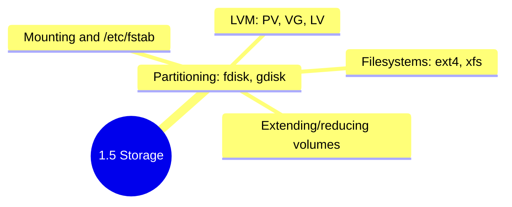

## 1.5.4 Subchapter Review: Cheatsheet and Interview Prep

This review covers only the material presented in Notes 1.5.1 (Partitioning and Filesystems), 1.5.2 (Mounting and FSTAB), and 1.5.3 (Logical Volume Manager). No forward referencing beyond what was explicitly introduced.




***

## Cheatsheet: Storage Management

### Disk and Partition Commands

| Command                | Purpose                          | Example                                           |
| ---------------------- | -------------------------------- | ------------------------------------------------- |
| `lsblk`                | List block devices               | `lsblk -f` (with filesystem info)                 |
| `df -h`                | Show disk usage (human-readable) | `df -h /home`                                     |
| `df -i`                | Show inode usage                 | `df -i`                                           |
| `sudo fdisk -l`        | List partition tables            | `sudo fdisk -l /dev/sda`                          |
| `sudo fdisk /dev/sdb`  | Interactive partitioning         | (then `n`, `p`, `w`, etc.)                        |
| `sudo parted /dev/sdb` | Advanced partitioning            | `sudo parted /dev/sdb mkpart primary ext4 0% 50%` |
| `sudo blkid`           | Show filesystem UUIDs            | `sudo blkid /dev/sdb1`                            |

### Partition Table Types

| Feature        | MBR (Legacy)              | GPT (Modern)                          |
| -------------- | ------------------------- | ------------------------------------- |
| Max disk size  | 2 TB                      | 9.4 ZB                                |
| Max partitions | 4 primary (or 3+extended) | 128 (typical)                         |
| Boot           | BIOS                      | UEFI (BIOS works with protective MBR) |
| Redundancy     | No                        | Backup table at end of disk           |

### Filesystem Creation

| Filesystem | Command     | Example                               |
| ---------- | ----------- | ------------------------------------- |
| ext4       | `mkfs.ext4` | `sudo mkfs.ext4 -L mylabel /dev/sdb1` |
| XFS        | `mkfs.xfs`  | `sudo mkfs.xfs /dev/sdb1`             |
| Swap       | `mkswap`    | `sudo mkswap /dev/sdb1`               |
| FAT32      | `mkfs.fat`  | `sudo mkfs.fat -F32 /dev/sdb1`        |

**Important** **`mkfs.ext4`** **flags:**

* `-L label` – Set volume label

* `-m percentage` – Reserved blocks for root (default 5%, reduce to 1% for large drives)

* `-N count` – Number of inodes (for many small files)

### Mount Commands

| Command            | Purpose                    | Example                              |
| ------------------ | -------------------------- | ------------------------------------ |
| `mount`            | Mount filesystem           | `sudo mount /dev/sdb1 /mnt/data`     |
| `mount -a`         | Mount all fstab entries    | `sudo mount -a`                      |
| `mount -o remount` | Change mount options       | `sudo mount -o remount,ro /mnt/data` |
| `umount`           | Unmount                    | `sudo umount /mnt/data`              |
| `findmnt`          | Show mount tree            | `findmnt /mnt/data`                  |
| `lsof` / `fuser`   | Find processes using mount | `sudo fuser -v /mnt/data`            |

### Mount Options

| Option              | Meaning                               | Use Case                      |
| ------------------- | ------------------------------------- | ----------------------------- |
| `defaults`          | `rw,suid,dev,exec,auto,nouser,async`  | Most filesystems              |
| `ro`                | Read-only                             | Recovery, shared data         |
| `noatime`           | Don't update access time              | Performance (SSDs, databases) |
| `noexec`            | No binary execution                   | `/tmp`, `/var/tmp`            |
| `nosuid`            | No SUID/SGID                          | `/tmp`, removable drives      |
| `nodev`             | No device files                       | `/tmp`, `/var`                |
| `relatime`          | Update atime only if older than mtime | Default, good balance         |
| `errors=remount-ro` | Remount read-only on error            | Root filesystem               |

### FSTAB Format (6 fields)

```
[Device] [Mount Point] [FS Type] [Options] [Dump] [Pass]
```

| Field | Purpose           | Example                                     |
| ----- | ----------------- | ------------------------------------------- |
| 1     | Device            | `UUID=abc123...`, `LABEL=data`, `/dev/sda1` |
| 2     | Mount point       | `/`, `/boot`, `/home`, `/mnt/data`          |
| 3     | Filesystem type   | `ext4`, `xfs`, `swap`, `tmpfs`, `nfs`       |
| 4     | Options           | `defaults`, `ro`, `noatime`, `noexec`       |
| 5     | Dump              | `0` (almost always)                         |
| 6     | Pass (fsck order) | `0` (skip), `1` (root), `2` (others)        |

**Best practice:** Use **UUID** (from `blkid`) for persistent device naming.

### LVM Architecture (3 Layers)

| Layer           | Abbreviation | Purpose                     | Commands                       |
| --------------- | ------------ | --------------------------- | ------------------------------ |
| Physical Volume | PV           | Mark disk/partition for LVM | `pvcreate`, `pvs`, `pvdisplay` |
| Volume Group    | VG           | Pool of storage             | `vgcreate`, `vgextend`, `vgs`  |
| Logical Volume  | LV           | Virtual partition           | `lvcreate`, `lvextend`, `lvs`  |

### LVM Commands Quick Reference

| Operation            | Command                                               |
| -------------------- | ----------------------------------------------------- |
| Create PV            | `pvcreate /dev/sdb1`                                  |
| Create VG            | `vgcreate vg_name /dev/sdb1`                          |
| Create LV (50GB)     | `lvcreate -n lv_name -L 50G vg_name`                  |
| Create LV (all free) | `lvcreate -n lv_name -l 100%FREE vg_name`             |
| Extend LV (+10GB)    | `lvextend -L +10G /dev/vg_name/lv_name`               |
| Extend LV (all free) | `lvextend -l +100%FREE /dev/vg_name/lv_name`          |
| Resize ext4 FS       | `resize2fs /dev/vg_name/lv_name`                      |
| Resize XFS FS        | `xfs_growfs /mountpoint`                              |
| Add PV to VG         | `vgextend vg_name /dev/sdc1`                          |
| Move data off PV     | `pvmove /dev/sdc1`                                    |
| Remove PV from VG    | `vgreduce vg_name /dev/sdc1`                          |
| Create snapshot      | `lvcreate -s -n snap_name -L 1G /dev/vg_name/lv_name` |
| List PVs/VGs/LVs     | `pvs`, `vgs`, `lvs` (summary)                         |
| Detailed info        | `pvdisplay`, `vgdisplay`, `lvdisplay`                 |

### LVM vs Traditional Partitions

| Feature                 | Traditional Partition | LVM                                |
| ----------------------- | --------------------- | ---------------------------------- |
| Resize (grow)           | Offline only          | **Online** (no unmount)            |
| Resize (shrink)         | Offline, risky        | Offline, risky (XFS cannot shrink) |
| Combine disks           | No (RAID required)    | Yes (concatenate or stripe)        |
| Snapshots               | No                    | Yes                                |
| Move data between disks | No                    | Yes (`pvmove` online)              |
| Complexity              | Low                   | Medium                             |

***

## Comparison Tables

### Filesystem Comparison

| Filesystem | Max Size | Max File Size | Online Grow     | Online Shrink   | Snapshots | Best For                   |
| ---------- | -------- | ------------- | --------------- | --------------- | --------- | -------------------------- |
| ext4       | 1 EB     | 16 TB         | Yes (unmounted) | Yes (unmounted) | No        | General purpose, default   |
| XFS        | 8 EB     | 8 EB          | Yes (mounted)   | **No**          | No        | Large files, databases     |
| btrfs      | 16 EB    | 16 EB         | Yes             | Yes             | Yes       | Advanced features (Fedora) |

### Disk Naming Conventions

| Prefix    | Bus Type      | Example                 |
| --------- | ------------- | ----------------------- |
| `sdX`     | SCSI/SATA/USB | `/dev/sda`, `/dev/sdb`  |
| `nvmeXnY` | NVMe SSD      | `/dev/nvme0n1`          |
| `vdX`     | VirtIO (KVM)  | `/dev/vda` (cloud VMs)  |
| `xvdX`    | Xen virtual   | `/dev/xvda` (AWS older) |

### Partition Type Codes

| Type             | fdisk Code | parted Name  | Purpose                 |
| ---------------- | ---------- | ------------ | ----------------------- |
| Linux filesystem | `83`       | `linux`      | Regular data partition  |
| Linux swap       | `82`       | `linux-swap` | Swap space              |
| Linux LVM        | `8e`       | `lvm`        | Physical volume for LVM |
| EFI System       | `ef`       | `efi`        | UEFI boot (FAT32)       |

***

## Interview Questions (Scenario-Based)

These questions assume only knowledge from Subchapter 1.5. Answers reference only concepts from 1.5.1, 1.5.2, and 1.5.3.

### Question 1

**Scenario:** You run `df -h` and see that `/var` is at 98% capacity. The partition `/var` is on `/dev/sda3` (ext4). You have a 100GB unused disk `/dev/sdb` available. The server is in production and cannot be rebooted or have services stopped.

**Question:** Using LVM, how would you resolve this without downtime? Include all steps. What if `/var` was on a traditional partition (not LVM)?

**Answer:**

**If** **`/var`** **is on LVM (standard for many distributions):**

```bash
# Step 1: Add new disk as PV
sudo pvcreate /dev/sdb

# Step 2: Extend the VG that contains /var (find VG name)
sudo vgs   # Find which VG has the /var LV
# Assume VG is vg_system
sudo vgextend vg_system /dev/sdb

# Step 3: Extend the LV for /var
sudo lvextend -l +100%FREE /dev/vg_system/lv_var

# Step 4: Resize the filesystem (ext4 – online)
sudo resize2fs /dev/vg_system/lv_var

# Step 5: Verify
df -h /var   # Should show increased size
```

**No downtime, no unmounting, no reboot.**

**If** **`/var`** **is on a traditional partition (not LVM):**

More difficult – options (all with trade-offs):

1. **Cannot resize online** – Traditional partitions require unmounting to resize (impossible for `/var` in production).

2. **Workarounds:**

   * **Move data to new disk (rsync):** Mount `/dev/sdb` to temporary location, stop services that write to `/var`, rsync data, remount new disk as `/var`. Requires brief downtime.

   * **Use symbolic links:** Mount new disk to `/var/newdata`, move largest subdirectory (e.g., `/var/log`) to new disk, symlink back. Partial solution.

   * **Convert to LVM (offline):** Backup, repartition with LVM, restore. Requires full downtime.

**Recommendation for traditional partition:** Schedule maintenance window, convert to LVM, or use symlink workaround for immediate relief.

### Question 2

**Scenario:** A database server running PostgreSQL has its data directory on `/dev/vg_db/lv_data` (XFS filesystem). The disk is 90% full. You extend the underlying cloud volume from 500GB to 750GB, rescan the SCSI bus, and run `pvs` which shows the PV size increased to 750GB.

**Question:** What are the complete steps to make the additional 250GB available to the database without downtime? Why does order matter?

**Answer:**

**Complete steps:**

```bash
# Step 1: Rescan SCSI bus (already done in scenario)
echo 1 > /sys/block/sdb/device/rescan

# Step 2: Resize the PV (if partition was expanded)
sudo pvresize /dev/sdb1   # Or whatever PV device

# Step 3: Check free space in VG
sudo vgs vg_db
# VSize: 750GB, VFree: 250GB

# Step 4: Extend the LV (XFS must be extended while mounted)
sudo lvextend -L +250G /dev/vg_db/lv_data
# OR extend to use all free: -l +100%FREE

# Step 5: Resize XFS filesystem (must be mounted, can be live)
sudo xfs_growfs /var/lib/postgresql

# Step 6: Verify
df -h /var/lib/postgresql
sudo lvs vg_db
```

**Why order matters:**

1. **PV must be resized before VG can see space** – `pvresize` updates LVM metadata about PV size.

2. **VG automatically sees new free space after PV resize** – No manual VG operation needed.

3. **LV must be extended before filesystem** – Filesystem cannot exceed LV size.

4. **XFS must be extended while mounted** – Unlike ext4, `xfs_growfs` requires the mount point, not the device path, and cannot be done unmounted.

5. **No need to unmount** – XFS supports online growth.

**Verification after each step:**

```bash
# After PV resize
sudo pvs --units g
# After LV extend
sudo lvs --units g
# After filesystem grow
df -h /var/lib/postgresql
```

### Question 3

**Scenario:** You are called to investigate a server that fails to boot, dropping to an emergency shell with the message: "Timed out waiting for device dev-disk-by\x2duuid-abc123...". The UUID shown does not match any expected partitions.

**Question:** What is the most likely cause, and how would you recover? What commands would you use in the emergency shell?

**Answer:**

**Most likely cause:** The `/etc/fstab` contains a UUID that no longer exists – perhaps a disk was replaced, partition reformatted, or fstab was edited incorrectly. Systemd waits for the missing device, times out, and drops to emergency mode.

**Recovery steps (from emergency shell):**

```bash
# 1. Remount root as read-write (emergency shell mounts root read-only)
mount -o remount,rw /

# 2. Check what UUIDs actually exist
blkid
# Compare output with /etc/fstab

# 3. Identify the problematic entry in fstab
cat /etc/fstab
# Look for UUID=abc123... that doesn't appear in blkid

# 4. Options to fix:
# Option A: Comment out the problematic line (if non-critical)
vi /etc/fstab
# Add # at beginning of line

# Option B: Correct the UUID (if disk exists but UUID changed)
# Update with correct UUID from blkid

# Option C: Replace UUID with device path temporarily (not recommended long-term)
# Change UUID=abc123... to /dev/sdb1

# 5. Test fstab entries
mount -a

# 6. Exit emergency shell to continue boot
exit
```

**Prevention:**

* Always test fstab changes with `mount -a` before rebooting

* Use `findmnt --verify` to check fstab syntax

* Keep a backup of working fstab: `cp /etc/fstab /etc/fstab.good`

**Additional debugging:**

```bash
# See why systemd failed
systemctl list-units --failed
systemctl status local-fs.target

# Check systemd fstab generator
systemd-fstab-generator --cat-config
```

### Question 4

**Scenario:** You need to perform a consistent backup of a 2TB database running on LVM. The database cannot be stopped, and you cannot afford backup time that blocks writes. You have a separate backup server with 2TB free space.

**Question:** How would LVM snapshots enable a consistent backup with minimal impact? Provide the complete backup procedure.

**Answer:**

**LVM snapshots provide point-in-time consistent backups without stopping the database or locking writes.**

**Complete procedure:**

```bash
# On database server:

# Step 1: Create snapshot (10% of LV size is typical for active DB)
# For 2TB LV, use 200GB snapshot (tracks changes during backup)
sudo lvcreate -n lv_db_snap -s -L 200G /dev/vg_db/lv_db

# Step 2: Mount snapshot read-only
sudo mkdir /mnt/db_snap
sudo mount -o ro /dev/vg_db/lv_db_snap /mnt/db_snap

# Step 3: Transfer snapshot data to backup server (using rsync)
# Run on backup server (pull):
rsync -av --progress db-server:/mnt/db_snap/ /backup/database/

# Or from database server (push):
rsync -av --progress /mnt/db_snap/ backup-server:/backup/database/

# Step 4: When backup completes, unmount and remove snapshot
sudo umount /mnt/db_snap
sudo lvremove /dev/vg_db/lv_db_snap
```

**Why this works:**

1. **Instant snapshot** – `lvcreate -s` creates snapshot in seconds, regardless of LV size.
2. **Copy-on-write (COW)** – Database continues writing; original blocks are copied to snapshot before modification.
3. **Consistent state** – Snapshot reflects database state at exact moment of creation.
4. **Read-only backup** – Mounting `-o ro` ensures backup doesn't modify snapshot.
5. **Minimal impact** – COW overhead typically 5-10% performance impact during backup.

**Important considerations:**

* **Snapshot size** – Monitor snapshot usage: `lvs -a | grep snap`. If snapshot fills (100%), it becomes invalid.

* **Backup window** – For active databases, snapshot should be removed within hours, not days.

* **Database consistency** – For databases like PostgreSQL, you may still need `pg_start_backup()` or equivalent. LVM snapshot captures filesystem state, but application-level consistency may require additional steps.

**For PostgreSQL specifically (add before snapshot):**

```bash
sudo -u postgres psql -c "SELECT pg_start_backup('snapshot_backup');"
# Then create LVM snapshot
sudo -u postgres psql -c "SELECT pg_stop_backup();"
```

### Question 5

**Scenario:** You have a server with the following storage configuration:

* `/dev/sda` (250GB) – OS disk with LVM: `vg_system` containing `lv_root` (100GB) and `lv_swap` (8GB)

* `/dev/sdb` (500GB) – Data disk, currently empty

* `/dev/sdc` (500GB) – Data disk, currently empty

**Requirement:** Create a highly flexible storage pool that can:

* Be expanded by adding future disks

* Allow resizing without unmounting

* Provide a single mount point `/data` that starts at 200GB but can grow to use all available space

**Question:** Design the LVM layout, including all commands to implement it. What advantage does this have over RAID 0?

**Answer:**

**LVM layout design:**

```
/dev/sdb1 (PV) ─┐
                ├─ vg_data (VG) ─── lv_data (LV) ─── /data (ext4)
/dev/sdc1 (PV) ─┘
```

**Implementation commands:**

```bash
# Step 1: Partition both data disks for LVM (type 8e)
sudo parted /dev/sdb mklabel gpt
sudo parted /dev/sdb mkpart primary lvm 0% 100%
sudo parted /dev/sdc mklabel gpt
sudo parted /dev/sdc mkpart primary lvm 0% 100%

# Step 2: Create physical volumes
sudo pvcreate /dev/sdb1 /dev/sdc1

# Step 3: Create volume group
sudo vgcreate vg_data /dev/sdb1 /dev/sdc1

# Step 4: Create logical volume (200GB initially)
sudo lvcreate -n lv_data -L 200G vg_data

# Step 5: Create filesystem
sudo mkfs.ext4 -L data /dev/vg_data/lv_data

# Step 6: Create mount point and mount
sudo mkdir -p /data
sudo mount /dev/vg_data/lv_data /data

# Step 7: Add to /etc/fstab (using UUID)
sudo blkid /dev/vg_data/lv_data
echo "UUID=abc123... /data ext4 defaults,noatime 0 2" | sudo tee -a /etc/fstab

# Step 8: Verify
df -h /data
# Should show ~197GB (ext4 overhead)
```

**Future expansion (add new disk):**

```bash
# Add /dev/sdd (1TB)
sudo pvcreate /dev/sdd1
sudo vgextend vg_data /dev/sdd1
sudo lvextend -l +100%FREE /dev/vg_data/lv_data
sudo resize2fs /dev/vg_data/lv_data
```

**Advantage over RAID 0:**

| Feature             | LVM (this design)          | RAID 0                         |
| ------------------- | -------------------------- | ------------------------------ |
| Add disk to pool    | Yes, online (`vgextend`)   | No (rebuild array)             |
| Remove disk         | Yes (with `pvmove`)        | No                             |
| Resize filesystem   | Yes, online                | Depends on RAID implementation |
| Snapshot support    | Yes                        | No                             |
| Performance         | Linear (adds bandwidth)    | Striping (parallel, faster)    |
| Fault tolerance     | None (same as RAID 0)      | None                           |
| Heterogeneous disks | Yes (different sizes work) | Limited (prefer same size)     |

**Trade-off:** RAID 0 provides striping (better performance for sequential I/O). LVM provides flexibility (online resizing, snapshots, mixed disk sizes). For `/data` with moderate performance needs, LVM is the better choice.

**Optional – Striped LV for performance (if disks are same size):**

```bash
# Striped LV (similar to RAID 0 performance)
sudo lvcreate -n lv_data -L 200G --stripes 2 --stripesize 64K vg_data
```

***

## Topics Covered in This Subchapter (Self-Check)

| Topic                                                    | Found in Note |
| -------------------------------------------------------- | ------------- |
| Viewing disks (`lsblk`, `df`, `du`)                      | 1.5.1         |
| Disk naming conventions (`sdX`, `nvmeXnY`, `vdX`)        | 1.5.1         |
| MBR vs GPT partition tables                              | 1.5.1         |
| Partitioning with `fdisk` and `parted`                   | 1.5.1         |
| Partition type codes (83, 82, 8e, ef)                    | 1.5.1         |
| Creating filesystems (`mkfs.ext4`, `mkfs.xfs`, `mkswap`) | 1.5.1         |
| Reserved blocks (`-m` flag)                              | 1.5.1         |
| Filesystem UUIDs (`blkid`)                               | 1.5.1         |
| Mounting with `mount` command                            | 1.5.2         |
| Mount options (`ro`, `noatime`, `noexec`, `nosuid`)      | 1.5.2         |
| Unmounting with `umount`                                 | 1.5.2         |
| `/etc/fstab` format (6 fields)                           | 1.5.2         |
| UUID vs device name in fstab                             | 1.5.2         |
| Dump and pass (fsck order)                               | 1.5.2         |
| `mount -a` testing                                       | 1.5.2         |
| `findmnt --verify` for fstab validation                  | 1.5.2         |
| Special mounts (swap, tmpfs, bind)                       | 1.5.2         |
| Troubleshooting mount issues (`lsof`, `fuser`)           | 1.5.2         |
| LVM architecture (PV, VG, LV)                            | 1.5.3         |
| LVM commands (`pvcreate`, `vgcreate`, `lvcreate`)        | 1.5.3         |
| Resizing LVs (`lvextend`, `resize2fs`, `xfs_growfs`)     | 1.5.3         |
| Adding disks to LVM (`vgextend`)                         | 1.5.3         |
| Removing disks from LVM (`pvmove`, `vgreduce`)           | 1.5.3         |
| LVM snapshots (`lvcreate -s`)                            | 1.5.3         |
| Copy-on-write (COW) snapshot behavior                    | 1.5.3         |
| Cloud volume expansion workflow                          | 1.5.3         |
| Troubleshooting LVM                                      | 1.5.3         |

## Quick Command and Concept Reference

These are terms used in examples above. Any storage concept that needed fuller teaching has been mapped into the main notes.

| Concept | Where to learn it |
| --- | --- |
| `losetup` | Practice examples in [1.5.1 Partitioning and Filesystems](./1.5.1_Partitioning_and_Filesystems.md) and [1.5.3 Logical Volume Manager (LVM)](./1.5.3_Logical_Volume_Manager_LVM.md) |
| `sg_scan` | Cloud expansion workflow in [1.5.3 Logical Volume Manager (LVM)](./1.5.3_Logical_Volume_Manager_LVM.md) |
| `dracut` / `initramfs` | LVM boot troubleshooting in [1.5.3 Logical Volume Manager (LVM)](./1.5.3_Logical_Volume_Manager_LVM.md) and deeper boot coverage in [1.10.1 Boot Process and Recovery](../Subchapter_1.10/1.10.1_Boot_Process_and_Recovery.md) |
| `findmnt --verify` | FSTAB validation in [1.5.2 Mounting and FSTAB](./1.5.2_Mounting_and_FSTAB.md) |
| `systemd-fstab-generator` | Boot/mount integration context in [1.10.1 Boot Process and Recovery](../Subchapter_1.10/1.10.1_Boot_Process_and_Recovery.md) |
| `pg_start_backup()` | Application-consistent backup context in the interview scenario above; database-specific backup strategy goes beyond this subchapter |
| Copy-on-write (COW) | Snapshot fundamentals in [1.5.3 Logical Volume Manager (LVM)](./1.5.3_Logical_Volume_Manager_LVM.md) |

***

## Backlinks

| Related note | Why it matters |
| --- | --- |
| [1.5.1 Partitioning and Filesystems](./1.5.1_Partitioning_and_Filesystems.md) | Core disk, partition, and filesystem concepts summarized here come from this note. |
| [1.5.2 Mounting and FSTAB](./1.5.2_Mounting_and_FSTAB.md) | Boot-time mounts, fstab validation, and mount troubleshooting are reviewed here. |
| [1.5.3 Logical Volume Manager (LVM)](./1.5.3_Logical_Volume_Manager_LVM.md) | LVM workflows, snapshots, and resizing scenarios are consolidated here. |
| [1.10.1 Boot Process and Recovery](../Subchapter_1.10/1.10.1_Boot_Process_and_Recovery.md) | Storage mistakes often surface during boot, especially with bad fstab entries or missing LVM activation. |
| [1.6.1 Process Lifecycle and Tools](../Subchapter_1.6/1.6.1_Process_Lifecycle_and_Tools.md) | Next subchapter connects storage issues to running processes, services, and observability. |

**End of Subchapter 1.5 Review**

**Next:** Proceed to Subchapter 1.6 – Process Management, Systemd, and Observability (process lifecycle, systemd units, journalctl, cron).
