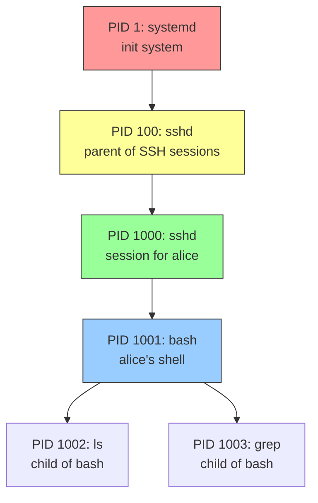
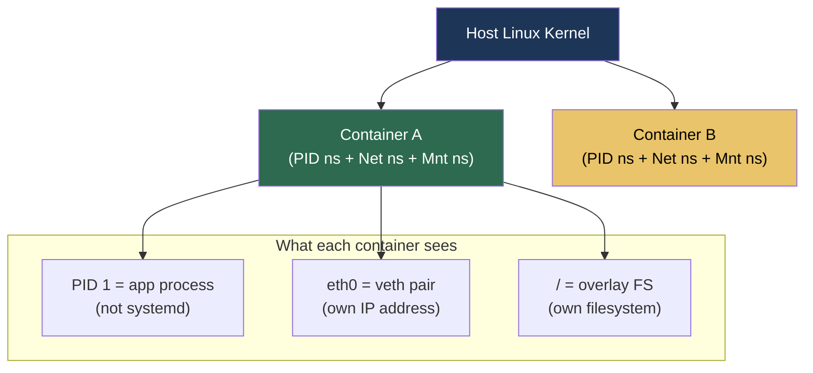
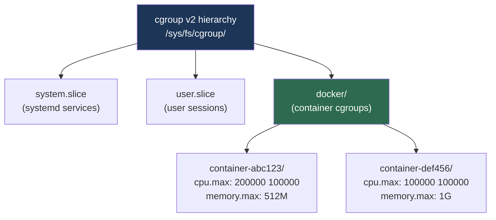

## 1.6.1 Process Lifecycle and Tools: The Living System

#### Why Process Management Matters

Every running command, every daemon, every container is a **process**. As a platform engineer, you will:

* Identify which processes are consuming CPU or memory

* Terminate stuck or misbehaving processes

* Understand parent-child relationships (e.g., why killing a container runtime stops all containers inside)

* Adjust process priorities to balance workloads

* Debug zombie processes that consume system resources

This note covers **process fundamentals** – lifecycle, states, monitoring tools (`ps`, `top`, `htop`), signalling (`kill`), and prioritization (`nice`, `renice`). Note 1.6.2 covers **systemd** (modern init system). Note 1.6.3 covers **cron** (job scheduling).

***

## Part 1: What is a Process?

A **process** is a running instance of a program. It has:

* A unique **Process ID (PID)**

* A **Parent Process ID (PPID)** – who started it

* A **user ID (UID)** and **group ID (GID)** – determines permissions

* A **current working directory**, **open files**, **environment variables**

* A **memory space** (code, data, stack, heap)



### Process Tree

The first process (PID 1) is started by the kernel. On modern Linux, this is **systemd** (covered in 1.6.2). All other processes are descendants.

```bash
# View process tree
pstree
# systemd─┬─accounts-daemon─┬─{gdbus}
#         │                 └─{gmain}
#         ├─cron
#         ├─sshd───sshd───bash───pstree
#         ├─systemd-journal
#         └─systemd-logind

# Show PIDs
pstree -p
# systemd(1)─┬─accounts-daemon(123)─┬─{gdbus}(456)
#            │                       └─{gmain}(457)
#            ├─sshd(789)───sshd(790)───bash(791)───pstree(792)
```

***

## Part 2: Process Lifecycle States

A process moves through several states during its lifetime.

| State                          | Symbol | Meaning                                               | Example                       |
| ------------------------------ | ------ | ----------------------------------------------------- | ----------------------------- |
| **Running**                    | `R`    | Currently executing or runnable (in queue)            | Most active processes         |
| **Sleeping (interruptible)**   | `S`    | Waiting for event (e.g., I/O, network)                | `sshd` waiting for connection |
| **Sleeping (uninterruptible)** | `D`    | Waiting for disk I/O (cannot be killed)               | Database waiting for write    |
| **Stopped**                    | `T`    | Paused by signal (e.g., `Ctrl+Z`)                     | Debugging or job control      |
| **Zombie**                     | `Z`    | Terminated, waiting for parent to collect exit status | Faulty parent process         |
| **Idle**                       | `I`    | Kernel thread (not a user process)                    | Scheduler threads             |

```bash
# See process states with ps
ps aux
# USER       PID %CPU %MEM    VSZ   RSS TTY      STAT START   TIME COMMAND
# root         1  0.0  0.1 168300 10240 ?        Ss   Jan01   0:02 systemd
# alice     1234  0.0  0.0  12345  2048 pts/0    R+   10:00   0:00 ps aux
# alice     1235  0.0  0.0      0     0 ?        Z    10:00   0:00 [defunct] <defunct>

# STAT column codes:
# Ss – Sleeping (S) + session leader (s)
# R+ – Running (R) + foreground process group (+)
# Z – Zombie
```

### Zombie Processes (Why They Matter)

A **zombie** is a process that has finished execution but still has an entry in the process table because its parent hasn't read its exit status. Zombies consume no CPU or memory (except a tiny process table slot), but too many can exhaust PIDs.

**Causes:** Parent process doesn't call `wait()` system call. Common in poorly written daemons.

**Detection:**

```bash
# Find zombie processes
ps aux | awk '$8=="Z"'

# Count zombies
ps aux | awk '$8=="Z"' | wc -l

# See zombie with its parent
ps -eo pid,ppid,stat,cmd | awk '$3=="Z"'
```

**Fix:** Kill the parent process. The zombie's PPID becomes 1 (systemd), which reaps it.

```bash
# Find parent of zombie (assuming PID 1234 is zombie)
ps -o ppid= -p 1234
# Kill parent
sudo kill -9 <parent_pid>
```

***

## Part 3: Process Monitoring Commands

### `ps` – Process Snapshot (Static)

| Flag                            | Meaning                        | Example                       | <br />       |
| ------------------------------- | ------------------------------ | ----------------------------- | :----------- |
| `ps aux`                        | All processes (BSD style)      | \`ps aux                      | grep nginx\` |
| `ps -ef`                        | All processes (System V style) | `ps -ef --forest` (tree)      | <br />       |
| `ps -u alice`                   | Processes owned by alice       | `ps -u alice`                 | <br />       |
| `ps -C nginx`                   | Processes with command name    | `ps -C nginx -o pid,user,cmd` | <br />       |
| `ps --ppid 1234`                | Children of PID 1234           | `ps --ppid 1234`              | <br />       |
| `ps -eo pid,ppid,pcpu,pmem,cmd` | Custom output                  | See below                     | <br />       |

**Understanding** **`ps aux`** **output:**

```
USER       PID %CPU %MEM    VSZ   RSS TTY      STAT START   TIME COMMAND
alice     1234  0.5  1.2 123456 23456 pts/0    S    10:00   0:01 python app.py
```

| Column  | Meaning                             | Example Value             |
| ------- | ----------------------------------- | ------------------------- |
| USER    | Owner of process                    | `alice`                   |
| PID     | Process ID                          | `1234`                    |
| %CPU    | CPU usage since last update         | `0.5` (0.5%)              |
| %MEM    | Physical memory percentage          | `1.2` (1.2% of RAM)       |
| VSZ     | Virtual memory size (KiB)           | `123456` (≈120MB)         |
| RSS     | Resident Set Size (actual RAM, KiB) | `23456` (≈23MB)           |
| TTY     | Controlling terminal                | `pts/0` (pseudo-terminal) |
| STAT    | Process state                       | `S` (sleeping)            |
| START   | Start time                          | `10:00`                   |
| TIME    | Total CPU time used                 | `0:01` (1 second)         |
| COMMAND | Command with arguments              | `python app.py`           |

**Custom** **`ps`** **output (for scripting):**

```bash
# Custom columns
ps -e -o pid,ppid,user,%cpu,%mem,etime,cmd --sort=-%cpu | head -10

# Columns:
# etime – elapsed time since process start
# --sort=-%cpu – sort by CPU descending
```

### `uptime` – Quick System Load Check

The `uptime` command shows system uptime and load averages in a single line:

```bash
uptime
# Output: 10:15:30 up 5 days, 2:30, 3 users, load average: 0.05, 0.10, 0.15
```

**Load average interpretation:**
- Three numbers: 1-minute, 5-minute, 15-minute averages
- Values represent the average number of processes in runnable or uninterruptible state
- On a single-core system: 1.0 = fully loaded, >1.0 = overloaded
- On a 4-core system: 4.0 = fully loaded (scale by CPU count)

```bash
# Get only the load average part
cat /proc/loadavg
# Output: 0.05 0.10 0.15 1/234 5678
# (1/234 = running processes/total, 5678 = last PID)
```

### `top` – Real-Time Process Monitoring

```bash
# Start interactive top
top

# Non-interactive mode (for scripting)
top -b -n 1 | head -20
```

**Inside** **`top`** **commands:**

| Key | Action                            |
| --- | --------------------------------- |
| `h` | Help                              |
| `q` | Quit                              |
| `P` | Sort by CPU (default)             |
| `M` | Sort by Memory                    |
| `N` | Sort by PID                       |
| `T` | Sort by Time                      |
| `u` | Filter by user                    |
| `k` | Kill process (prompts for PID)    |
| `r` | Renice process (change priority)  |
| `1` | Toggle per-CPU stats (multi-core) |
| `c` | Show full command line            |

**Understanding** **`top`** **header:**

```
top - 10:00:01 up 5 days,  2:30,  3 users,  load average: 0.05, 0.10, 0.15
Tasks: 120 total,   1 running, 119 sleeping,   0 stopped,   0 zombie
%Cpu(s):  2.5 us,  0.8 sy,  0.0 ni, 96.5 id,  0.2 wa,  0.0 hi,  0.0 si,  0.0 st
MiB Mem :   7854.5 total,   1234.5 free,   4567.8 used,   2052.2 buff/cache
MiB Swap:   2048.0 total,   2048.0 free,      0.0 used.   2456.7 avail Mem
```

| Field          | Meaning                                                          |
| -------------- | ---------------------------------------------------------------- |
| `load average` | 1,5,15 minute avg of processes in runnable/uninterruptible state |
| `us`           | User CPU time                                                    |
| `sy`           | System (kernel) CPU time                                         |
| `id`           | Idle                                                             |
| `wa`           | I/O wait (high = disk bottleneck)                                |
| `st`           | Steal time (virtualization – high = noisy neighbor)              |

### `htop` – Improved `top` (Install Separately)

```bash
# Install htop
sudo apt install htop      # Debian/Ubuntu
sudo dnf install htop      # RHEL/Rocky

# Run
htop
```

**Advantages over** **`top`:**

* Color-coded output

* Scroll horizontally and vertically

* Mouse support (if terminal supports)

* Kill processes without typing PID (select with arrow keys, press `F9`)

* Tree view (`F5`)

* Filter processes (`F4`)

### `free` – Memory Usage Summary

The `free` command shows system memory usage at a glance:

```bash
# Human-readable format (most useful)
free -h

# Example output:
#               total        used        free      shared  buff/cache   available
# Mem:           7.7Gi       4.5Gi       1.2Gi       256Mi       2.0Gi       2.4Gi
# Swap:          2.0Gi          0B       2.0Gi
```

**Understanding the columns:**

| Column | Meaning |
| --- | --- |
| `total` | Total physical RAM |
| `used` | Memory used by processes |
| `free` | Truly unused memory |
| `shared` | Memory used by tmpfs (RAM disks) |
| `buff/cache` | Disk buffers and file cache (can be reclaimed) |
| `available` | Memory available for new processes (most important!) |

**Key insight:** Don't panic if `free` is low – Linux aggressively uses RAM for caching. Watch `available` instead.

```bash
# Continuous monitoring (every 2 seconds)
free -h -s 2

# Show totals (low, high memory – legacy)
free -lt

# Show in megabytes
free -m
```

### `vmstat` – Virtual Memory Statistics

For deeper memory and CPU analysis:

```bash
# One-time snapshot
vmstat

# Continuous monitoring (every 1 second, 10 samples)
vmstat 1 10
```

**Example output:**

```
procs -----------memory---------- ---swap-- -----io---- -system-- ------cpu-----
 r  b   swpd   free   buff  cache   si   so    bi    bo   in   cs us sy id wa st
 1  0      0 1234567 12345 234567    0    0     5    10   50  100  2  1 97  0  0
```

| Field | Meaning |
| --- | --- |
| `r` | Processes waiting for CPU |
| `b` | Processes in uninterruptible sleep (I/O wait) |
| `si/so` | Swap in/out (high = memory pressure) |
| `bi/bo` | Blocks in/out (disk I/O) |
| `us/sy/id/wa` | CPU usage (user/system/idle/wait) |

***

## Part 4: Process Signalling (`kill`)

Signals are software interrupts sent to processes. The `kill` command sends signals (not just termination).

### Common Signals

| Signal    | Number | Default Action                     | Common Use                       |
| --------- | ------ | ---------------------------------- | -------------------------------- |
| `SIGTERM` | 15     | Terminate gracefully               | `kill <pid>` (default)           |
| `SIGKILL` | 9      | Force terminate (cannot be caught) | `kill -9 <pid>` (last resort)    |
| `SIGINT`  | 2      | Interrupt (like `Ctrl+C`)          | `kill -2 <pid>`                  |
| `SIGHUP`  | 1      | Hangup – often reload config       | `kill -HUP <pid>` (nginx reload) |
| `SIGSTOP` | 19     | Pause process (cannot be caught)   | `kill -STOP <pid>`               |
| `SIGCONT` | 18     | Resume paused process              | `kill -CONT <pid>`               |
| `SIGUSR1` | 10     | User-defined signal 1              | Application-specific             |
| `SIGUSR2` | 12     | User-defined signal 2              | Application-specific             |

### Using `kill`, `killall`, `pkill`, and `pidof`

```bash
# Send SIGTERM (default) to PID 1234
kill 1234

# Send SIGKILL (force kill)
kill -9 1234
kill -KILL 1234
kill -SIGKILL 1234

# Send SIGHUP (reload config) to nginx
kill -HUP $(cat /var/run/nginx.pid)

# Kill all processes with a given name
killall nginx          # SIGTERM to all nginx
killall -9 nginx       # Force kill all nginx

# Kill by command name (with pattern)
pkill -f "python app.py"   # Kill any process matching full command line
pkill -u alice             # Kill all processes owned by alice
pkill -TERM -G developers  # Signal all processes in group 'developers'

# Find PID by exact process name
pidof nginx
pidof sshd
```

**When to use which tool:**

* `kill` – signal a specific PID you already know
* `killall` – signal all processes with a matching command name
* `pkill` – signal by pattern, user, terminal, or other filters
* `pidof` – quickly return PID(s) for an exact program name

**Signal vs Kill semantics:**

* `SIGTERM` (15) – Process can clean up (close files, flush buffers). **Try this first.**

* `SIGKILL` (9) – Kernel terminates immediately. Process cannot clean up. **Last resort only.**

### Finding PID to Kill

```bash
# Find PID of a specific process
pgrep nginx
# 1234
# 1235

# Full details
pgrep -la nginx
# 1234 nginx: master process
# 1235 nginx: worker process

# PID of process listening on port 80
sudo lsof -ti :80
sudo ss -tlnp | grep :80 | awk '{print $7}' | cut -d',' -f2 | cut -d'=' -f2
```

***

## Part 5: Process Priorities (`nice` and `renice`)

Linux schedules processes based on **nice value** (range -20 to +19):

* **-20** = Highest priority (most CPU time)

* **0** = Default priority

* **+19** = Lowest priority (least CPU time)

```bash
# Start process with lower priority (niceness +10)
nice -n 10 ./backup_script.sh

# Start process with higher priority (requires root)
sudo nice -n -10 ./critical_app.sh

# Change priority of running process (PID 1234)
renice 15 1234          # Lower priority
sudo renice -5 1234     # Higher priority (requires root)

# View nice values
ps -eo pid,ni,comm | head -10
#   PID  NI COMMAND
#     1   0 systemd
#  1234  15 backup_script
```

**When to use:**

* Lower priority for batch jobs (backups, log rotation) during peak hours

* Higher priority for latency-sensitive services (real-time APIs, databases)

***

## Part 6: Job Control (Foreground/Background)

```bash
# Start process in background (append &)
long_running_script.sh &

# List background jobs
jobs
# [1]+  Running                 long_running_script.sh &

# Bring job 1 to foreground
fg %1

# Suspend foreground job (Ctrl+Z)
# Then background it
bg %1

# Start process in background and disown (immune to shell exit)
nohup long_running_script.sh > /dev/null 2>&1 &
disown
```

***

## Quick Task: Process Exploration

*Explore the process tree on your system.*

1. Run `ps aux --sort=-%cpu | head -10` – what are the top 5 CPU consumers?
2. Run `pstree -p | grep -A 5 -B 5 $$` ($$ is your shell PID). What is your shell's parent?
3. Start a long-running command (e.g., `sleep 300`) in the background. Find its PID with `pgrep`.
4. Change its priority to +15 using `renice`. Verify with `ps -o pid,ni,cmd -p <PID>`.
5. Send a `SIGTERM` to the process. Verify it's gone with `ps`.
6. Run `top` and practice sorting by `P` (CPU), `M` (memory), and killing a process (press `k`, enter PID, enter signal 15).

> **Ready Solution:**
>
> ```bash
> # Task 1
> ps aux --sort=-%cpu | head -10
> # Observe which processes are consuming CPU
>
> # Task 2
> pstree -p | grep -A 5 -B 5 $$
> # Output example:
> #           |-sshd(789)---sshd(790)---bash(791)---pstree(792)
> # Your shell (bash) has parent sshd(790)
>
> # Task 3
> sleep 300 &
> # [1] 12345
> pgrep sleep
> # 12345
>
> # Task 4
> sudo renice 15 12345
> # 12345 (process ID) old priority 0, new priority 15
> ps -o pid,ni,cmd -p 12345
> #   PID  NI CMD
> # 12345  15 sleep 300
>
> # Task 5
> kill 12345
> ps -p 12345
> # No output – process terminated
>
> # Task 6
> top
> # Inside top: press P (sort CPU), M (sort memory), k (kill), enter PID, enter 15
> # Press q to quit
> ```

***

## Deep Dive: /proc/PID for Process Forensics

The `/proc/<PID>/` virtual directory exposes everything about a running process. Master these for production debugging.

```bash
PID=1234

# What command started this process?
cat /proc/$PID/cmdline | tr '\0' ' '; echo

# Environment variables (find config issues)
cat /proc/$PID/environ | tr '\0' '\n' | grep -i path

# Current working directory
readlink /proc/$PID/cwd

# Executable path (even if deleted!)
readlink /proc/$PID/exe

# Open file descriptors (like lsof for one process)
ls -la /proc/$PID/fd

# Memory usage breakdown
cat /proc/$PID/status | grep -E "^(VmSize|VmRSS|VmSwap|Threads)"
# VmSize:  2048000 kB  ← Virtual memory (includes shared libs)
# VmRSS:    512000 kB  ← Resident (actual physical RAM)
# VmSwap:     1024 kB  ← Swapped out
# Threads:       8     ← Thread count

# OOM score (higher = more likely to be killed under pressure)
cat /proc/$PID/oom_score
cat /proc/$PID/oom_score_adj   # -1000 to 1000 (-1000 = never kill)

# Protect a critical process from OOM killer
echo -1000 | sudo tee /proc/$PID/oom_score_adj

# Network connections for this process
cat /proc/$PID/net/tcp   # Raw TCP socket table

# Cgroup membership (which resource limits apply)
cat /proc/$PID/cgroup
```

**Platform engineering use cases:**
- **Container debugging:** `cat /proc/1/cgroup` inside a container reveals its cgroup hierarchy
- **Memory leak hunting:** Watch `VmRSS` grow over time with `watch -n 5 "grep VmRSS /proc/$PID/status"`
- **Recover deleted binary:** `cp /proc/$PID/exe /tmp/recovered_binary` (if executable was deleted while running)

***

## Summary Table: Process Commands

| Command           | Purpose                      | Example                    | <br />       |
| ----------------- | ---------------------------- | -------------------------- | :----------- |
| `ps aux`          | Snapshot of all processes    | \`ps aux                   | grep nginx\` |
| `ps -ef --forest` | Tree view                    | `ps -ef --forest`          | <br />       |
| `pstree -p`       | Process tree with PIDs       | `pstree -p 1234`           | <br />       |
| `top`             | Real-time process monitor    | `top -u alice`             | <br />       |
| `htop`            | Enhanced interactive monitor | `htop`                     | <br />       |
| `pgrep`           | Find PID by name             | `pgrep -la nginx`          | <br />       |
| `kill`            | Send signal to PID           | `kill -HUP 1234`           | <br />       |
| `killall`         | Signal by name               | `killall -9 nginx`         | <br />       |
| `pkill`           | Signal by pattern            | `pkill -f "python app.py"` | <br />       |
| `nice`            | Start with priority          | `nice -n 10 ./script.sh`   | <br />       |
| `renice`          | Change priority              | `renice 15 1234`           | <br />       |
| `jobs`            | List background jobs         | `jobs -l`                  | <br />       |
| `fg` / `bg`       | Foreground/background        | `fg %1`                    | <br />       |
| `nohup`           | Survive shell exit           | `nohup ./script.sh &`      | <br />       |
| `lsof -ti :port`  | Find process on port         | `lsof -ti :80`             | <br />       |

### Process States Reference

| State                      | Symbol | Can Kill?          | Meaning                 |
| -------------------------- | ------ | ------------------ | ----------------------- |
| Running                    | `R`    | Yes                | Executing or runnable   |
| Sleeping (interruptible)   | `S`    | Yes                | Waiting for event       |
| Sleeping (uninterruptible) | `D`    | No (reboot needed) | Waiting for I/O         |
| Stopped                    | `T`    | Yes (with SIGKILL) | Paused by signal        |
| Zombie                     | `Z`    | Kill parent        | Terminated, uncollected |

### Signal Quick Reference

| Signal    | Number | Default Action | Use Case       |
| --------- | ------ | -------------- | -------------- |
| `SIGTERM` | 15     | Graceful exit  | Default `kill` |
| `SIGKILL` | 9      | Force exit     | Last resort    |
| `SIGINT`  | 2      | Interrupt      | `Ctrl+C`       |
| `SIGHUP`  | 1      | Reload config  | `kill -HUP`    |
| `SIGSTOP` | 19     | Pause          | `kill -STOP`   |
| `SIGCONT` | 18     | Resume         | `kill -CONT`   |

***

## Part 9: Linux Namespaces & cgroups — Container Primitives

> **Why this matters:** Containers (Docker, containerd, CRI-O) are NOT virtual machines. They are regular Linux processes isolated using two kernel features: **namespaces** (what a process can *see*) and **cgroups** (what a process can *use*). Understanding these is essential for debugging container issues, configuring resource limits, and understanding why things behave differently inside vs outside a container.

### Namespaces — Process Isolation

A namespace wraps a global system resource so processes inside the namespace see their own isolated instance of that resource.



| Namespace | Isolates | Effect Inside Container |
|-----------|----------|------------------------|
| **PID** | Process IDs | Container's main process is PID 1; can't see host processes |
| **NET** | Network stack | Own interfaces, IP addresses, routing table, iptables |
| **MNT** | Filesystem mounts | Own root filesystem (overlay), can't see host paths unless mounted |
| **UTS** | Hostname | Own hostname (`docker run --hostname myapp`) |
| **IPC** | Inter-process communication | Own shared memory, semaphores, message queues |
| **USER** | User/Group IDs | UID 0 inside can map to UID 1000 outside (rootless containers) |
| **Cgroup** | Cgroup root view | Sees only its own cgroup hierarchy |

### Exploring Namespaces

```bash
# List namespaces for a process
ls -la /proc/$PID/ns/
# lrwxrwxrwx  cgroup -> 'cgroup:[4026531835]'
# lrwxrwxrwx  ipc -> 'ipc:[4026532194]'
# lrwxrwxrwx  mnt -> 'mnt:[4026532192]'
# lrwxrwxrwx  net -> 'net:[4026532197]'
# lrwxrwxrwx  pid -> 'pid:[4026532195]'
# lrwxrwxrwx  user -> 'user:[4026531837]'
# lrwxrwxrwx  uts -> 'uts:[4026532193]'

# Enter a container's namespaces (debug from host)
# Find container's PID on host
CONTAINER_PID=$(docker inspect --format '{{.State.Pid}}' my-container)

# Enter its network namespace (run network commands inside)
sudo nsenter -t $CONTAINER_PID -n ip addr show
sudo nsenter -t $CONTAINER_PID -n ss -tlnp

# Enter all namespaces (full shell inside the container from host)
sudo nsenter -t $CONTAINER_PID -m -u -i -n -p -- /bin/sh

# Create a new namespace manually (how containers work under the hood)
sudo unshare --pid --mount --fork /bin/bash
# Now inside a new PID namespace — ps shows only your processes
```

### cgroups — Resource Limits

**cgroups** (control groups) limit how much CPU, memory, I/O, and network a process group can use.



| Controller | File | What It Limits |
|-----------|------|----------------|
| **CPU** | `cpu.max` | CPU time (e.g., `200000 100000` = 2 cores max) |
| **Memory** | `memory.max` | Hard memory limit (OOM kill if exceeded) |
| **Memory** | `memory.high` | Soft limit (throttles before OOM) |
| **I/O** | `io.max` | Disk I/O bandwidth (bytes/sec, IOPS) |
| **PIDs** | `pids.max` | Maximum number of processes (fork bomb protection) |

### Inspecting Container Resource Limits

```bash
# Find container's cgroup path
CONTAINER_ID=$(docker ps -q --filter name=myapp)
CGROUP_PATH=$(docker inspect --format '{{.HostConfig.CgroupParent}}' $CONTAINER_ID)

# Or directly via /proc
CONTAINER_PID=$(docker inspect --format '{{.State.Pid}}' myapp)
cat /proc/$CONTAINER_PID/cgroup
# 0::/system.slice/docker-abc123.scope

# Check memory limit (cgroup v2)
cat /sys/fs/cgroup/system.slice/docker-abc123.scope/memory.max
# 536870912  (512MB in bytes)

# Check current memory usage
cat /sys/fs/cgroup/system.slice/docker-abc123.scope/memory.current

# Check CPU limit
cat /sys/fs/cgroup/system.slice/docker-abc123.scope/cpu.max
# 200000 100000  (= 200ms per 100ms period = 2 CPU cores)

# Check if OOM killed
cat /sys/fs/cgroup/system.slice/docker-abc123.scope/memory.events
# oom_kill 3  ← OOM killer invoked 3 times
```

### How Docker Flags Map to cgroups

| Docker Flag | cgroup File | Meaning |
|---|---|---|
| `--memory 512m` | `memory.max = 536870912` | Hard memory limit |
| `--memory-reservation 256m` | `memory.low = 268435456` | Guaranteed minimum |
| `--cpus 2.5` | `cpu.max = 250000 100000` | 2.5 CPU cores max |
| `--cpu-shares 1024` | `cpu.weight` | Relative CPU priority |
| `--pids-limit 100` | `pids.max = 100` | Fork bomb protection |

### Debugging Container Resource Issues

```bash
# Container OOMKilled — check memory events
docker inspect myapp | jq '.[0].State.OOMKilled'
# true

# From host — check cgroup memory stats
cat /sys/fs/cgroup/system.slice/docker-*/memory.events | grep oom

# Container throttled — check CPU throttling
cat /sys/fs/cgroup/system.slice/docker-*/cpu.stat
# throttled_usec 5000000  ← spent 5s being throttled

# systemd-cgtop: real-time cgroup resource usage (like top for cgroups)
systemd-cgtop
# Control Group                CPU    Memory   I/O
# /docker/abc123              45.2%   412.0M   -
# /docker/def456               2.1%   128.0M   -
```

> **Key Debugging Pattern:** When a container is killed or slow:
> 1. `docker inspect` → check OOMKilled and exit code
> 2. `cat /proc/<pid>/cgroup` → find cgroup path
> 3. Check `memory.events` for OOM kills
> 4. Check `cpu.stat` for throttling
> 5. Use `nsenter` to run diagnostics inside the container's namespaces

***

**Next note (1.6.2)** will cover **systemd** – the modern init system that manages services, timers, sockets, and logging (`journalctl`).

## Backlinks

| Topic | Note |
| --- | --- |
| Users and groups that own processes | [1.3.1 User and Group Management](../Subchapter_1.3/1.3.1_User_and_Group_Management.md) |
| File permissions and privilege boundaries | [1.2.2 File Types, Permissions Basics](../Subchapter_1.2/1.2.2_File_Types_Permissions_Basics.md) |
| SSH sessions as parent processes and remote shells | [1.4.1 SSH Protocol and Basics](../Subchapter_1.4/1.4.1_SSH_Protocol_and_Basics.md) |
| Port-to-process lookups with `lsof` | [1.9.2 Lsof and Sysdig Basics](../Subchapter_1.9/1.9.2_Lsof_and_Sysdig_Basics.md) |
| Service supervision with PID 1 | [1.6.2 Systemd Deep Dive](./1.6.2_Systemd_Deep_Dive.md) |
