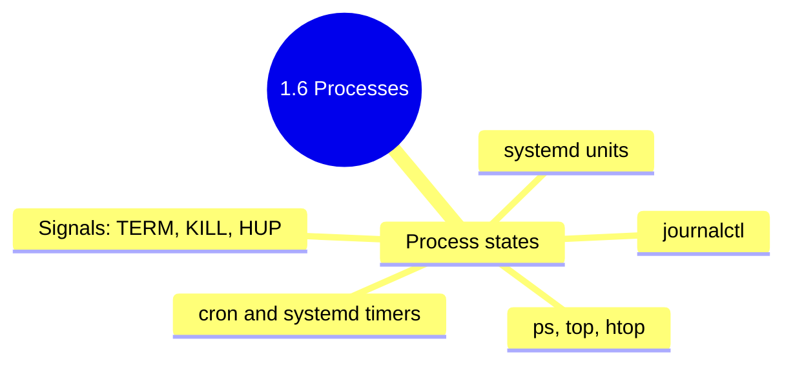

## 1.6.4 Subchapter Review: Cheatsheet and Interview Prep

This review covers only the material presented in Notes 1.6.1 (Process Lifecycle and Tools), 1.6.2 (Systemd Deep Dive), and 1.6.3 (Cron and Job Scheduling). No forward referencing beyond what was explicitly introduced.




***

## Cheatsheet: Process Management, Systemd, and Cron

### Process Monitoring Commands

| Command           | Purpose                       | Example               |
| ----------------- | ----------------------------- | --------------------- |
| `ps aux`          | Snapshot of all processes     | `ps aux --sort=-%cpu` |
| `ps -ef --forest` | Tree view with PIDs           | `ps -ef --forest`     |
| `pstree -p`       | Process tree                  | `pstree -p 1234`      |
| `top`             | Real-time interactive monitor | `top -u alice`        |
| `htop`            | Enhanced interactive monitor  | `htop`                |
| `pgrep`           | Find PID by name              | `pgrep -la nginx`     |
| `pidof`           | Find PID by exact name        | `pidof nginx`         |

### Process States

| State                      | Symbol | Meaning                           |
| -------------------------- | ------ | --------------------------------- |
| Running                    | `R`    | Executing or runnable             |
| Sleeping (interruptible)   | `S`    | Waiting for event                 |
| Sleeping (uninterruptible) | `D`    | Waiting for I/O (cannot kill)     |
| Stopped                    | `T`    | Paused by signal                  |
| Zombie                     | `Z`    | Terminated, parent didn't collect |

### Process Signalling

| Signal    | Number | Default Action           | Use Case               |
| --------- | ------ | ------------------------ | ---------------------- |
| `SIGTERM` | 15     | Graceful exit            | `kill <pid>` (default) |
| `SIGKILL` | 9      | Force exit (last resort) | `kill -9 <pid>`        |
| `SIGINT`  | 2      | Interrupt                | `Ctrl+C`               |
| `SIGHUP`  | 1      | Reload config            | `kill -HUP <pid>`      |
| `SIGSTOP` | 19     | Pause                    | `kill -STOP <pid>`     |
| `SIGCONT` | 18     | Resume                   | `kill -CONT <pid>`     |

```bash
# Kill by PID
kill 1234
kill -9 1234
kill -HUP 1234

# Kill by name
killall nginx
pkill -f "python app.py"
```

### Process Priority (Nice)

| Nice Value | Priority | Who Can Set |
| ---------- | -------- | ----------- |
| -20 to -1  | Higher   | root only   |
| 0          | Default  | any user    |
| 1 to 19    | Lower    | any user    |

```bash
# Start with priority
nice -n 10 ./script.sh

# Change running process priority
renice 15 1234
sudo renice -5 1234
```

### Systemd Service Commands

| Command                   | Purpose                  | Example                      |
| ------------------------- | ------------------------ | ---------------------------- |
| `systemctl start`         | Start service            | `systemctl start nginx`      |
| `systemctl stop`          | Stop service             | `systemctl stop nginx`       |
| `systemctl restart`       | Stop then start          | `systemctl restart nginx`    |
| `systemctl reload`        | Reload config            | `systemctl reload nginx`     |
| `systemctl enable`        | Enable at boot           | `systemctl enable nginx`     |
| `systemctl disable`       | Disable at boot          | `systemctl disable nginx`    |
| `systemctl status`        | Show status              | `systemctl status nginx`     |
| `systemctl is-active`     | Check if running         | `systemctl is-active nginx`  |
| `systemctl is-enabled`    | Check if enabled         | `systemctl is-enabled nginx` |
| `systemctl mask`          | Prevent start (stronger) | `systemctl mask nginx`       |
| `systemctl daemon-reload` | Reload unit files        | `systemctl daemon-reload`    |

### Systemd Service Unit File Sections

| Section     | Purpose                                            |
| ----------- | -------------------------------------------------- |
| `[Unit]`    | Metadata and dependencies (After, Requires, Wants) |
| `[Service]` | How to run (Type, User, ExecStart, Restart)        |
| `[Install]` | Enable behavior (WantedBy)                         |

**Service Types:**

* `simple` – Main process (default)

* `forking` – Parent exits, child continues

* `oneshot` – Runs once, no lingering process

* `notify` – Notifies when ready

**Restart Policies:**

* `no` – Never restart

* `on-failure` – Restart on non-zero exit

* `always` – Always restart

### Journalctl Commands

| Command                    | Purpose         | Example                            |
| -------------------------- | --------------- | ---------------------------------- |
| `journalctl -u`            | Service logs    | `journalctl -u nginx`              |
| `journalctl -f`            | Follow new logs | `journalctl -u nginx -f`           |
| `journalctl -b`            | Current boot    | `journalctl -b -1` (previous boot) |
| `journalctl --since`       | Time filter     | `journalctl --since "1 hour ago"`  |
| `journalctl -p`            | Priority filter | `journalctl -p err`                |
| `journalctl -k`            | Kernel logs     | `journalctl -k`                    |
| `journalctl --disk-usage`  | Log size        | `journalctl --disk-usage`          |
| `journalctl --vacuum-time` | Clean old logs  | `journalctl --vacuum-time=7d`      |

### Systemd Timers vs Cron

| Feature                   | Cron               | Systemd Timers          |
| ------------------------- | ------------------ | ----------------------- |
| Time precision            | Minute             | Second                  |
| Run after missed schedule | No (needs anacron) | Yes (`Persistent=true`) |
| Dependencies              | No                 | Yes                     |
| Logging                   | Syslog/mail        | Journald                |
| Complexity                | Low                | Medium                  |

**Timer directives:**

* `OnCalendar=daily` – Every day at 00:00

* `OnCalendar=hourly` – Every hour at :00

* `OnCalendar=*:0/15` – Every 15 minutes

* `Persistent=true` – Run missed jobs after boot

### Crontab Syntax (5 time fields)

```
* * * * * command
│ │ │ │ │
│ │ │ │ └─── Day of week (0-7, 0/7=Sun)
│ │ │ └───── Month (1-12)
│ │ └─────── Day of month (1-31)
│ └───────── Hour (0-23)
└─────────── Minute (0-59)
```

**Special characters:**

* `*` – Any value

* `*/N` – Every N units

* `N-M` – Range

* `N,M` – List

### Crontab Examples

| Schedule                | Expression    |
| ----------------------- | ------------- |
| Every minute            | `* * * * *`   |
| Every 5 minutes         | `*/5 * * * *` |
| Every hour at minute 0  | `0 * * * *`   |
| Daily at 2:30 AM        | `30 2 * * *`  |
| Weekly Sunday 5 AM      | `0 5 * * 0`   |
| Weekdays at 9 AM        | `0 9 * * 1-5` |
| First of month midnight | `0 0 1 * *`   |

### Crontab Commands

| Command                    | Purpose                     |
| -------------------------- | --------------------------- |
| `crontab -e`               | Edit user crontab           |
| `crontab -l`               | List user crontab           |
| `crontab -r`               | Remove user crontab         |
| `sudo crontab -u alice -e` | Edit another user's crontab |

### Cron Directories (System)

| Location                    | Purpose                                   |
| --------------------------- | ----------------------------------------- |
| `/etc/crontab`              | System-wide crontab (includes user field) |
| `/etc/cron.d/`              | Package-specific crontabs                 |
| `/etc/cron.hourly/`         | Hourly scripts                            |
| `/etc/cron.daily/`          | Daily scripts                             |
| `/etc/cron.weekly/`         | Weekly scripts                            |
| `/etc/cron.monthly/`        | Monthly scripts                           |
| `/var/spool/cron/crontabs/` | User crontabs (do not edit directly)      |

***

## Comparison Tables

### Process Monitoring Tools

| Tool   | Update Mode              | Interactive | Tree View       | Resource Usage |
| ------ | ------------------------ | ----------- | --------------- | -------------- |
| `ps`   | Static (snapshot)        | No          | With `--forest` | Minimal        |
| `top`  | Real-time (3s)           | Yes         | No              | Low            |
| `htop` | Real-time (configurable) | Yes         | Yes (`F5`)      | Low            |

### Service Management: Systemd vs SysV Init

| Feature               | Systemd               | SysV Init              |
| --------------------- | --------------------- | ---------------------- |
| Parallel startup      | Yes                   | No                     |
| Dependency resolution | Automatic             | Manual ordering        |
| Logging               | journald (structured) | syslog                 |
| Service restart       | Built-in (`Restart=`) | External tools (monit) |
| Resource limits       | cgroups               | Limited                |

### Cron vs Systemd Timers vs Anacron

| Feature                      | Cron                  | Systemd Timers        | Anacron |
| ---------------------------- | --------------------- | --------------------- | ------- |
| Precision                    | Minute                | Second                | Day     |
| Works on 24/7 system         | Yes                   | Yes                   | Yes     |
| Works on intermittent system | No (missed runs lost) | Yes (with Persistent) | Yes     |
| User crontabs                | Yes                   | Limited (user units)  | No      |
| Dependency support           | No                    | Yes                   | No      |

***

## Interview Questions (Scenario-Based)

These questions assume only knowledge from Subchapter 1.6. Answers reference only concepts from 1.6.1, 1.6.2, and 1.6.3.

### Question 1

**Scenario:** A production web server is responding slowly. Running `top` shows a process using 95% CPU continuously. The process is `/usr/bin/php-fpm` owned by `www-data`.

**Question:** How would you investigate and resolve this without restarting the entire server? What signals would you use, and why?

**Answer:**

**Investigation steps:**

```bash
# 1. Confirm the problematic process
top -u www-data
# Look for PHP-FPM child processes with high CPU

# 2. Check if it's a single child or all children
ps aux | grep php-fpm
# Typically there is a master process and multiple children

# 3. Check logs for errors
sudo journalctl -u php-fpm -f --since "5 minutes ago"
# Or check PHP error log
tail -f /var/log/php-fpm/error.log

# 4. Check what the process is doing (if strace is available)
sudo strace -p <PID> -c   # Summary of system calls
```

**Resolution options (from least to most aggressive):**

1. **Graceful restart of PHP-FPM (no connection loss):**

   ```bash
   sudo systemctl reload php-fpm
   # Sends SIGUSR1 to master, gracefully restarts children
   ```

2. **Kill only the problematic child (PHP-FPM will respawn):**

   ```bash
   # Find the high-CPU child PID
   kill -TERM <child_pid>   # SIGTERM (15) – graceful
   # PHP-FPM master will start a new child automatically
   ```

3. **If the child is stuck (SIGTERM doesn't work):**

   ```bash
   kill -9 <child_pid>      # SIGKILL – last resort
   ```

4. **If the issue persists, restart the entire service:**

   ```bash
   sudo systemctl restart php-fpm
   ```

**Why not restart the server?** Restarting affects all services, causes downtime, and doesn't help identify the root cause (bad code, memory leak, infinite loop).

**Post-resolution analysis:**

* Check application logs for slow requests

* Enable PHP-FPM status page to monitor request times

* Consider setting `request_terminate_timeout` in PHP-FPM config

### Question 2

**Scenario:** You deployed a new version of a web application. The application runs as a systemd service. After deployment, you run `systemctl status myapp` and see:

```
● myapp.service - My Web Application
   Loaded: loaded (/etc/systemd/system/myapp.service; enabled; vendor preset: disabled)
   Active: activating (auto-restart) (Result: exit-code) since Mon 2024-01-15 10:00:00 UTC; 30s ago
  Process: 12345 ExecStart=/usr/bin/node /opt/myapp/server.js (code=exited, status=1/FAILURE)
 Main PID: 12345 (code=exited, status=1/FAILURE)
```

**Question:** What does this status mean? How would you debug the failure? What systemd features are helping here?

**Answer:**

**Status interpretation:**

* `Active: activating (auto-restart)` – Systemd is attempting to restart the service automatically

* `Result: exit-code` – The process exited with a non-zero code (1)

* `Main PID: 12345 (code=exited, status=1/FAILURE)` – The main process failed

**Systemd features helping:**

* `Restart=on-failure` (or similar) in the service file causes automatic restart attempts

* Systemd prevents the service from staying in a failed state

**Debugging steps:**

```bash
# 1. Check the full service status (including last 10 log lines)
systemctl status myapp -l

# 2. View service logs (most important)
journalctl -u myapp -e -p err --since "10 minutes ago"
# -e jumps to the end, -p err shows errors only

# 3. View all logs for the service from current boot
journalctl -u myapp -b

# 4. Run the service manually to see the error (as the same user)
sudo -u myapp /usr/bin/node /opt/myapp/server.js

# 5. Check for common issues:
# - Missing environment variables
# - Port already in use
# - Configuration file syntax error
# - Missing dependencies

# 6. Check systemd environment differences
systemctl show myapp | grep Environment
```

**Common fixes:**

1. **Missing environment variable:**

   ```ini
   # In /etc/systemd/system/myapp.service
   [Service]
   Environment="NODE_ENV=production"
   EnvironmentFile=/etc/myapp/env.conf
   ```

2. **Working directory issue:**

   ```ini
   [Service]
   WorkingDirectory=/opt/myapp
   ```

3. **Port already in use:**

   ```bash
   sudo lsof -ti :3000 | xargs kill -9
   ```

4. **Check service file syntax after changes:**

   ```bash
   systemd-analyze verify /etc/systemd/system/myapp.service
   sudo systemctl daemon-reload
   ```

### Question 3

**Scenario:** You need to schedule a database backup script to run every day at 1 AM. The script must not run if the previous run is still executing (backup takes 30-60 minutes). The server is on 24/7.

**Question:** Would you use cron or systemd timer? Provide the complete implementation with error handling and logging.

**Answer:**

**Recommendation:** Systemd timer is better for this use case because:

* Can prevent overlapping runs with `Conflict=` or checking lock files

* Better logging integration with journald

* Can set resource limits (if needed)

**Implementation with systemd timer:**

**Service file** (`/etc/systemd/system/db-backup.service`):

```ini
[Unit]
Description=Database backup
After=network.target

[Service]
Type=oneshot
User=postgres
Group=postgres
WorkingDirectory=/opt/backup
ExecStart=/opt/backup/backup.sh
StandardOutput=journal
StandardError=journal

# Prevent overlapping runs (fail if already running)
ExecStartPre=/usr/bin/flock -n /tmp/backup.lock -c true
ExecStart=/usr/bin/flock /tmp/backup.lock /opt/backup/backup.sh

# Resource limits
LimitNOFILE=65536
CPUQuota=50%

# Notification on failure
OnFailure=status-email@%n.service
```

**Timer file** (`/etc/systemd/system/db-backup.timer`):

```ini
[Unit]
Description=Run database backup daily at 1 AM
Requires=db-backup.service

[Timer]
OnCalendar=*-*-* 01:00:00
Persistent=true

[Install]
WantedBy=timers.target
```

**Backup script** (`/opt/backup/backup.sh`):

```bash
#!/bin/bash
set -euo pipefail

LOGFILE="/var/log/db-backup.log"
DATE=$(date +%Y%m%d_%H%M%S)

log() {
    echo "[$(date '+%Y-%m-%d %H:%M:%S')] $*" | tee -a "$LOGFILE"
}

log "Starting database backup"

# Perform backup
if pg_dumpall > "/backup/db_$DATE.sql"; then
    log "Backup completed successfully"
    # Compress old backups older than 7 days
    find /backup -name "*.sql" -mtime +7 -exec gzip {} \;
else
    log "ERROR: Backup failed"
    exit 1
fi

log "Backup finished"
```

**Enable and start:**

```bash
sudo systemctl daemon-reload
sudo systemctl enable db-backup.timer
sudo systemctl start db-backup.timer

# Verify
systemctl list-timers db-backup.timer
```

**Alternative with cron (simpler but less robust):**

```bash
# In crontab
# Use flock to prevent overlapping runs
1 0 * * * /usr/bin/flock -n /tmp/backup.lock /opt/backup/backup.sh
```

**Why not just cron with** **`flock`?** Cron works, but systemd provides:

* Better logging (`journalctl -u db-backup`)

* Dependency management (run after network)

* Resource limits (prevent backup from consuming all I/O)

* Unified monitoring with other systemd services

### Question 4

**Scenario:** A developer asks you to explain why their cron job works when run manually but fails when cron runs it. The job is `backup.sh` which uses `rsync` and sends email notifications.

**Question:** What are the most likely differences between cron environment and interactive shell environment? How would you fix each?

**Answer:**

**Most likely differences:**

| Environment Difference | Interactive Shell                 | Cron                                           | Impact                                          |
| ---------------------- | --------------------------------- | ---------------------------------------------- | ----------------------------------------------- |
| `PATH`                 | `/usr/local/bin:/usr/bin:/bin`    | `/usr/bin:/bin`                                | `rsync` may not be found if in `/usr/local/bin` |
| `SHELL`                | `/bin/bash`                       | `/bin/sh`                                      | Bash-specific syntax fails                      |
| `HOME`                 | User's home directory             | User's home (set)                              | May affect `~/.ssh` for rsync                   |
| Environment variables  | Loaded from `.bashrc`, `.profile` | None (only `HOME`, `LOGNAME`, `SHELL`, `PATH`) | Custom vars (e.g., `AWS_PROFILE`) missing       |
| TTY                    | Has TTY                           | No TTY                                         | Commands requiring terminal fail                |
| `MAILTO`               | Not set                           | Emails output to user                          | If mail not configured, output lost             |

**Fixes:**

**Fix 1: Set PATH in crontab**

```bash
# In crontab
PATH=/usr/local/bin:/usr/bin:/bin
0 2 * * * /home/alice/backup.sh
```

**Fix 2: Use full paths in script**

```bash
#!/bin/bash
/usr/local/bin/rsync -av /source /dest
```

**Fix 3: Set SHELL in crontab**

```bash
SHELL=/bin/bash
0 2 * * * /home/alice/backup.sh
```

**Fix 4: Source profile in script**

```bash
#!/bin/bash
source /home/alice/.profile
/usr/local/bin/rsync -av /source /dest
```

**Fix 5: Debug by capturing cron environment**

```bash
# Temporarily add to crontab
* * * * * env > /tmp/cron_env.txt
# Compare with interactive
env > /tmp/shell_env.txt
diff /tmp/cron_env.txt /tmp/shell_env.txt
```

**Fix 6: For SSH keys in rsync (non-interactive)**

```bash
# Use specific identity file
rsync -av -e "ssh -i /home/alice/.ssh/backup_key" /source user@host:/dest

# Or ensure .ssh is readable and use full path to key
export HOME=/home/alice
```

**Fix 7: Redirect output for debugging**

```bash
0 2 * * * /home/alice/backup.sh > /tmp/backup_debug.log 2>&1
```

**Best practice template for robust cron jobs:**

```bash
#!/bin/bash
# Robust cron script template

# Set explicit PATH
export PATH=/usr/local/bin:/usr/bin:/bin

# Source profile (optional, for env vars)
if [ -f "$HOME/.profile" ]; then
    source "$HOME/.profile"
fi

# Change to known directory
cd /opt/backup || exit 1

# Log start
echo "$(date): Starting backup" >> /var/log/backup.log

# Run command with full path
/usr/local/bin/rsync -av /source /dest

# Log result
echo "$(date): Backup completed with exit code $?" >> /var/log/backup.log
```

### Question 5

**Scenario:** A system has hundreds of zombie processes (`ps aux | grep Z` shows many entries). All zombies have parent PID 1234. The parent process is a custom daemon that should be reaping its children.

**Question:** What causes zombie processes, why are they a problem (or not), and how would you resolve this without restarting the server?

**Answer:**

**What causes zombies:**

* A child process terminates but the parent process never calls `wait()` or `waitpid()` to read its exit status

* The kernel keeps the process table entry (PID, exit status, resource usage) until the parent collects it

* Zombies are "dead" processes that only exist as entries in the process table

**Why zombies are a problem:**

* **Limited resource:** Each zombie consumes a PID (process ID). Linux typically has 32,768 PIDs by default (`cat /proc/sys/kernel/pid_max`).

* **PID exhaustion:** If enough zombies accumulate, the system cannot create new processes (fork fails with "Resource temporarily unavailable").

* **Not CPU/memory intensive:** Zombies consume no CPU or memory (except the tiny process table entry).

**Why zombies are NOT a problem (in small numbers):**

* A few zombies (e.g., < 100) on a system with high PID limit are harmless

* They don't consume CPU, memory, or I/O

* Many long-running daemons have transient zombies that are reaped eventually

**Resolution steps:**

**Step 1: Confirm zombie count and parent**

```bash
# Count zombies
ps aux | awk '$8=="Z"' | wc -l

# Find zombies and their parents
ps -eo pid,ppid,stat,cmd | awk '$3=="Z"'
# Output:
# 12345  1234  Z  [backup.sh] <defunct>

# Find parent process details
ps -p 1234
```

**Step 2: Determine if parent can be fixed**

```bash
# Check parent process command
cat /proc/1234/cmdline
# See if it's a custom daemon or system service

# Check parent's open files (might indicate what it's doing)
sudo lsof -p 1234
```

**Step 3: Fix the issue (without reboot)**

**Option A: Signal the parent (SIGCHLD forces reaping)**

```bash
# SIGCHLD causes parent to check for terminated children
kill -CHLD 1234
# Check if zombies disappeared
ps aux | awk '$8=="Z"'
```

**Option B: Kill the parent (clean)**

```bash
# Kill the parent gracefully (SIGTERM)
kill 1234
# If the parent was a service, systemd may restart it
# The init process (PID 1) will adopt and reap the zombies
```

**Option C: Force kill the parent (last resort)**

```bash
# If SIGTERM doesn't work
kill -9 1234
```

**Option D: If parent cannot be killed (critical daemon)**

* This is a code bug – the parent must be fixed to call `wait()` or `waitpid()`

* Workaround: Periodic restart of parent (systemd `Restart=always`)

**Prevention (code fix in parent daemon):**

```c
// C example – proper signal handling
#include <sys/wait.h>
#include <signal.h>

void sigchld_handler(int signo) {
    while (waitpid(-1, NULL, WNOHANG) > 0);
}

int main() {
    signal(SIGCHLD, sigchld_handler);
    // ... rest of daemon
}
```

```bash
# In shell scripts, ensure children are reaped
# Bash automatically reaps, but if using `exec` or custom process management,
# ensure you wait for children
```

**Verification after fix:**

```bash
# Check no zombies remain
ps aux | awk '$8=="Z"'
# Should return no output (except grep itself)

# Check PID usage
cat /proc/sys/kernel/pid_max
# Still 32768, but free PIDs are available
```

***

## Topics Covered in This Subchapter (Self-Check)

| Topic                                                                | Found in Note |
| -------------------------------------------------------------------- | ------------- |
| Process states (R, S, D, T, Z)                                       | 1.6.1         |
| `ps` command and output fields                                       | 1.6.1         |
| `uptime` and load average                                            | 1.6.1         |
| `top` and `htop` interactive monitoring                              | 1.6.1         |
| `free` and `vmstat` for memory monitoring                            | 1.6.1         |
| Process signals (`SIGTERM`, `SIGKILL`, `SIGHUP`)                     | 1.6.1         |
| `kill`, `killall`, `pkill`, `pidof` commands                         | 1.6.1         |
| Process priorities (`nice`, `renice`)                                | 1.6.1         |
| Zombie processes – cause and resolution                              | 1.6.1         |
| Job control (background, foreground, `jobs`, `fg`, `bg`)             | 1.6.1         |
| `nohup` and `disown`                                                 | 1.6.1         |
| Systemd architecture (PID 1)                                         | 1.6.2         |
| `systemctl` commands (start, stop, restart, enable, disable, status) | 1.6.2         |
| Systemd unit files (`[Unit]`, `[Service]`, `[Install]`)              | 1.6.2         |
| Service types (`simple`, `forking`, `oneshot`, `notify`)             | 1.6.2         |
| Restart policies (`no`, `on-failure`, `always`)                      | 1.6.2         |
| Targets (runlevels)                                                  | 1.6.2         |
| Overriding service configuration                                     | 1.6.2         |
| `systemd-analyze verify` and `systemctl show`                        | 1.6.2         |
| Systemd timers vs cron                                               | 1.6.2         |
| `journalctl` commands                                                | 1.6.2         |
| Boot performance (`systemd-analyze`)                                 | 1.6.2         |
| Cron architecture (crond daemon)                                     | 1.6.3         |
| Crontab syntax (5 time fields)                                       | 1.6.3         |
| Special characters (`*`, `*/N`, `-`, `,`)                            | 1.6.3         |
| User crontabs (`crontab -e`, `-l`, `-r`)                             | 1.6.3         |
| System crontabs (`/etc/crontab`, `/etc/cron.d/`)                     | 1.6.3         |
| Cron script directories (`cron.hourly`, `cron.daily`, etc.)          | 1.6.3         |
| Cron environment differences                                         | 1.6.3         |
| Cron logging and mail output                                         | 1.6.3         |
| `flock` for non-overlapping cron jobs                                | 1.6.3         |
| Anacron for intermittent systems                                     | 1.6.3         |
| Troubleshooting cron jobs                                            | 1.6.3         |
| `timedatectl` – timezone and NTP                                     | 1.6.2         |
| `localectl` – locale and keyboard                                    | 1.6.2         |
| System power commands (`shutdown`, `reboot`, `poweroff`)             | 1.6.2         |

## Quick Command and Concept Reference

| Concept | Status / Where it belongs |
| --- | --- |
| `flock` | Now taught in [1.6.3 Cron and Job Scheduling](./1.6.3_Cron_and_Job_Scheduling.md) for preventing overlapping jobs. |
| `systemd-analyze verify` | Now taught in [1.6.2 Systemd Deep Dive](./1.6.2_Systemd_Deep_Dive.md) for validating unit files. |
| `systemctl show` | Now taught in [1.6.2 Systemd Deep Dive](./1.6.2_Systemd_Deep_Dive.md) for inspecting effective unit properties. |
| `strace` | Keep as supporting debugging context only; belongs better in a later troubleshooting/observability path. |
| `wait()` / `waitpid()` | Supporting OS-level explanation for zombies; main Linux process behavior remains in [1.6.1 Process Lifecycle and Tools](./1.6.1_Process_Lifecycle_and_Tools.md). |
| `SIGCHLD` | Supporting signal detail; core zombie handling is already covered in [1.6.1 Process Lifecycle and Tools](./1.6.1_Process_Lifecycle_and_Tools.md). |
| `pg_dumpall` | Database-specific example command, fine as scenario context only. |
| `set -euo pipefail` | Shell-scripting concept that properly belongs in Module 3 rather than expanding this subchapter. |

## Backlinks

| Topic | Note |
| --- | --- |
| Processes, signals, zombies, and job control | [1.6.1 Process Lifecycle and Tools](./1.6.1_Process_Lifecycle_and_Tools.md) |
| Services, journald, timers, and unit files | [1.6.2 Systemd Deep Dive](./1.6.2_Systemd_Deep_Dive.md) |
| Cron, crontabs, anacron, and scheduling pitfalls | [1.6.3 Cron and Job Scheduling](./1.6.3_Cron_and_Job_Scheduling.md) |
| Next subchapter | [1.7.1 RPM and YUM DNF](../Subchapter_1.7/1.7.1_RPM_and_YUM_DNF.md) |

***

**End of Subchapter 1.6 Review**

**Next:** Proceed to Subchapter 1.7 – Package Management and Software Installation (RPM, YUM/DNF, DPKG, APT).

