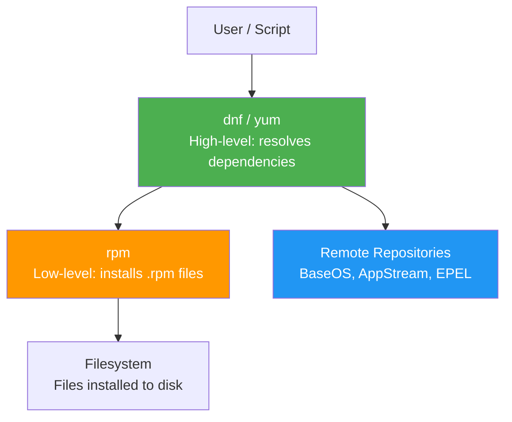

## 1.7.1 RPM and YUM/DNF: RHEL Family Package Management


### Package Manager Layers



#### Why Package Management Matters

Package managers are the foundation of system maintenance. They handle:

* Installing, updating, and removing software

* Resolving dependencies (ensuring required libraries exist)

* Verifying file integrity and authenticity (digital signatures)

* Tracking which package owns which file

For platform engineers, mastering package management means:

* Building consistent, reproducible environments

* Auditing installed software for security compliance

* Recovering from broken package states

* Creating custom packages for internal tools

This note covers the **RHEL family** (Red Hat Enterprise Linux, CentOS, Rocky Linux, AlmaLinux, Fedora). Note 1.7.2 covers the **Debian family** (Debian, Ubuntu). Note 1.7.3 covers compiling from source and alternatives.

***

## Part 1: RPM – The Low-Level Package Manager

**RPM** (Red Hat Package Manager) is the foundation. It installs, upgrades, and removes `.rpm` packages but **does not resolve dependencies** – that's YUM/DNF's job.

### RPM File Naming Convention

```
package-name-version-release.architecture.rpm
```

**Example:** `nginx-1.20.1-10.el8.x86_64.rpm`

| Component    | Example  | Meaning                                                  |
| ------------ | -------- | -------------------------------------------------------- |
| Package name | `nginx`  | Software name                                            |
| Version      | `1.20.1` | Upstream version                                         |
| Release      | `10.el8` | Package build number + distribution                      |
| Architecture | `x86_64` | `x86_64`, `noarch` (architecture-independent), `aarch64` |

### Basic RPM Commands

```bash
# Install a local .rpm file (no dependency resolution)
sudo rpm -ivh package.rpm
# -i = install, -v = verbose, -h = hash marks (progress)

# Upgrade (install if not present, upgrade if present)
sudo rpm -Uvh package.rpm
# -U = upgrade/install

# Remove a package
sudo rpm -e package-name
# -e = erase

# Query installed packages
rpm -q package-name                    # Check if installed
rpm -qa                                # List all installed packages
rpm -qa | grep nginx                   # Search installed packages
rpm -q -l package-name                 # List files in installed package
rpm -q -c package-name                 # List configuration files only
rpm -q -d package-name                 # List documentation files only
rpm -q -f /path/to/file                # Find which package owns a file
rpm -q -i package-name                 # Show package information

# Verify installed package (checks file integrity)
rpm -V package-name
# Output: S.5....T. /path/to/file
# S = file size differs
# 5 = MD5 checksum differs
# T = modification time differs
# . = passed verification
```

### RPM Verification Codes

| Code | Meaning                     |
| ---- | --------------------------- |
| `S`  | File size differs           |
| `5`  | MD5 checksum differs        |
| `T`  | Modification time differs   |
| `D`  | Device major/minor mismatch |
| `L`  | Symlink path mismatch       |
| `U`  | User ownership differs      |
| `G`  | Group ownership differs     |
| `M`  | Mode (permissions) differs  |

```bash
# Verify all installed packages
rpm -Va

# Verify specific package
rpm -V httpd
```

### RPM Database

RPM maintains a database in `/var/lib/rpm/`. Corruption can occur (power failure, disk full).

```bash
# Rebuild RPM database (if corrupted)
sudo rpm --rebuilddb

# Initialize new database (if missing)
sudo rpm --initdb
```

***

## Part 2: YUM – The High-Level Package Manager (Legacy)

**YUM** (Yellowdog Updater Modified) adds dependency resolution and repository management. Used in RHEL 7 and older CentOS.

```bash
# Install package with dependencies
sudo yum install nginx

# Remove package
sudo yum remove nginx

# Update a specific package
sudo yum update nginx

# Update all packages
sudo yum update

# Check for available updates
sudo yum check-update

# Search for package (by name or description)
yum search nginx

# Show package information
yum info nginx

# List available packages
yum list available

# List installed packages
yum list installed

# Show what package provides a file
yum provides /etc/nginx/nginx.conf

# Group operations (package groups like "Web Server")
yum group list
sudo yum group install "Web Server"

# Clean cache
sudo yum clean all

# Show history (what was installed/removed when)
yum history
sudo yum history undo <id>
```

***

## Part 3: DNF – The Modern YUM Replacement

**DNF** (Dandified YUM) is the default for RHEL 8+, Rocky Linux 8+, AlmaLinux 8+, Fedora. It has better dependency resolution, faster performance, and cleaner API.

### DNF Commands (Mostly Same as YUM)

```bash
# Install package
sudo dnf install nginx

# Remove package
sudo dnf remove nginx

# Update specific package
sudo dnf update nginx

# Update all packages
sudo dnf upgrade

# Search packages
dnf search nginx

# Show package info
dnf info nginx

# List available packages
dnf list available

# List installed packages
dnf list installed

# List all packages (available + installed)
dnf list all

# Find which package provides a file
dnf provides /etc/nginx/nginx.conf

# Check for available updates
dnf check-update

# Show dependencies
dnf repoquery --requires nginx

# Show what depends on a package
dnf repoquery --whatrequires nginx

# Group operations
dnf group list
sudo dnf group install "Web Server"

# Clean cache
sudo dnf clean all

# Show transaction history
dnf history
sudo dnf history undo <id>

# Check for broken dependencies
dnf check

# Autoremove (remove unneeded dependencies)
sudo dnf autoremove
```

### DNF vs YUM Differences

| Feature               | YUM                      | DNF                     |
| --------------------- | ------------------------ | ----------------------- |
| Dependency resolution | Satisfiability algorithm | libsolv (more robust)   |
| Performance           | Slower                   | Faster                  |
| API                   | Outdated                 | Modern, well-documented |
| Transaction rollback  | Limited                  | Full support            |
| Python version        | Python 2                 | Python 3                |
| Default in            | RHEL 7, CentOS 7         | RHEL 8+, Fedora 22+     |

**Note:** On systems with YUM, `yum` is often a symlink to `dnf` (Fedora) or still separate (RHEL 7). Use `dnf` if available.

***

## Part 4: Repository Management

Repositories are remote or local collections of RPM packages with metadata.

### DNF/YUM Repository Files

Location: `/etc/yum.repos.d/*.repo`

**Example repository file** (`/etc/yum.repos.d/nginx.repo`):

```ini
[nginx-stable]
name=nginx stable repo
baseurl=http://nginx.org/packages/centos/$releasever/$basearch/
gpgcheck=1
enabled=1
gpgkey=https://nginx.org/keys/nginx_signing.key
module_hotfixes=true

[nginx-mainline]
name=nginx mainline repo
baseurl=http://nginx.org/packages/mainline/centos/$releasever/$basearch/
gpgcheck=1
enabled=0
gpgkey=https://nginx.org/keys/nginx_signing.key
```

**Repository options:**

| Option       | Meaning                                      |
| ------------ | -------------------------------------------- |
| `name`       | Human-readable name                          |
| `baseurl`    | URL of repository                            |
| `enabled=1`  | Enable this repo (0 = disabled)              |
| `gpgcheck=1` | Verify GPG signatures                        |
| `gpgkey`     | URL to GPG key                               |
| `priority`   | Repository priority (with priorities plugin) |

### Managing Repositories

```bash
# List all enabled repositories
dnf repolist

# List all repositories (including disabled)
dnf repolist all

# Add EPEL repository (Extra Packages for Enterprise Linux)
sudo dnf install epel-release

# Enable/disable repository temporarily
sudo dnf --enablerepo=epel install package
sudo dnf --disablerepo=* --enablerepo=base install package

# Permanently enable/disable repository
sudo dnf config-manager --set-enabled epel
sudo dnf config-manager --set-disabled epel

# Add repository from URL (creates .repo file)
sudo dnf config-manager --add-repo https://example.com/repo.repo
```

### Repository Variables

| Variable      | Meaning             | Example             |
| ------------- | ------------------- | ------------------- |
| `$releasever` | OS release version  | `8`, `9`            |
| `$basearch`   | Base architecture   | `x86_64`, `aarch64` |
| `$stream`     | Distribution stream | `rhel`, `centos`    |

***

## Part 5: Working with RPM Packages Directly

Sometimes you need to work with `.rpm` files directly (offline systems, custom packages).

### Downloading Packages Without Installing

```bash
# Download package to current directory (without installing)
dnf download nginx

# Download with dependencies
dnf download --resolve nginx

# Download for specific architecture
dnf download --arch=x86_64 nginx

# Download from specific repository
dnf download --enablerepo=epel nginx
```

### Inspecting RPM Files

```bash
# Query a .rpm file without installing
rpm -qip package.rpm              # Information
rpm -qlp package.rpm              # List files
rpm -qcp package.rpm              # List config files
rpm -qdp package.rpm              # List docs
rpm -q --requires -p package.rpm  # Dependencies
rpm -q --provides -p package.rpm  # What it provides

# Extract contents without installing (using rpm2cpio)
rpm2cpio package.rpm | cpio -idmv
```

### Creating Local Repository

```bash
# 1. Create directory for packages
mkdir /var/local/myrepo

# 2. Copy RPM files into directory
cp *.rpm /var/local/myrepo/

# 3. Create repository metadata
sudo dnf install createrepo
createrepo /var/local/myrepo

# 4. Create .repo file
cat > /etc/yum.repos.d/myrepo.repo << EOF
[myrepo]
name=My Local Repository
baseurl=file:///var/local/myrepo
enabled=1
gpgcheck=0
EOF

# 5. Verify
dnf repolist
```

***

## Part 6: Common RHEL Family Operations

### Installing EPEL (Extra Packages)

EPEL provides additional packages not in base RHEL.

```bash
# RHEL 8 / Rocky 8 / Alma 8
sudo dnf install epel-release

# RHEL 9 / Rocky 9 / Alma 9
sudo dnf install epel-release

# Verify
dnf repolist | grep epel
```

### Enabling CodeReady / PowerTools (Development Tools)

```bash
# RHEL 8
sudo dnf config-manager --set-enabled codeready-builder-for-rhel-8-rhui-rpms

# Rocky/Alma 8
sudo dnf config-manager --set-enabled powertools

# RHEL 9
sudo dnf config-manager --set-enabled codeready-builder-for-rhel-9-rhui-rpms
```

### Installing Development Tools

```bash
# Install compiler, make, headers, etc.
sudo dnf groupinstall "Development Tools"

# Install specific development libraries
sudo dnf install kernel-devel kernel-headers
```

### Package Version Control

```bash
# Show available versions
dnf list available nginx --showduplicates

# Install specific version
sudo dnf install nginx-1.20.1-10.el8

# Exclude packages from updates (in /etc/dnf/dnf.conf)
echo "exclude=nginx*" | sudo tee -a /etc/dnf/dnf.conf

# Lock package version (using versionlock plugin)
sudo dnf install python3-dnf-plugin-versionlock
sudo dnf versionlock add nginx
sudo dnf versionlock list
sudo dnf versionlock delete nginx
```

***

## Part 7: Troubleshooting RPM/YUM/DNF

### Problem 1: Broken Dependencies

```bash
# Check for dependency issues
sudo dnf check

# Clean and retry
sudo dnf clean all
sudo dnf makecache

# If still broken, try --skip-broken (last resort)
sudo dnf update --skip-broken
```

### Problem 2: RPM Database Corruption

```bash
# Symptoms: "error: db5 error(-30973)" or similar
# Fix:
sudo rm -f /var/lib/rpm/__db*
sudo rpm --rebuilddb
```

### Problem 3: Lock Contention

```bash
# Error: "Another app is currently holding the yum lock"
# Wait or kill stale process
sudo rm -f /var/run/yum.pid
# Or find and kill process
ps aux | grep -E "(yum|dnf)"
sudo kill <pid>
```

### Problem 4: GPG Key Verification Failed

```bash
# Import GPG key manually
sudo rpm --import https://example.com/RPM-GPG-KEY

# Or disable GPG check (insecure – only for testing)
# Edit .repo file: gpgcheck=0
```

### Problem 5: Package Conflicts

```bash
# Check what provides conflicting file
dnf provides /path/to/conflicting/file

# Remove conflicting package
sudo dnf remove conflicting-package

# Or use --replacefiles (dangerous)
sudo rpm -ivh --replacefiles package.rpm
```

***

## Quick Task: RHEL Family Package Management Practice

*If you have access to a RHEL/Rocky/Alma/Fedora system, practice these commands.*

1. List all installed packages and count them.
2. Find which package owns `/etc/passwd`.
3. Search for a package related to "nginx" and install it.
4. List all files installed by the nginx package.
5. Verify the nginx package integrity.
6. Remove nginx and its dependencies (without affecting other packages).
7. (Optional) Add the EPEL repository and install `htop`.

> **Ready Solution (Rocky Linux 8/9 example):**
>
> ```bash
> # Task 1
> dnf list installed | wc -l
>
> # Task 2
> dnf provides /etc/passwd
> # Output: setup-2.12.2-6.el8.noarch : A set of system configuration and setup files
>
> # Task 3
> dnf search nginx
> sudo dnf install nginx -y
>
> # Task 4
> rpm -ql nginx | head -20
>
> # Task 5
> rpm -V nginx
> # (No output means no changes from package)
>
> # Task 6
> sudo dnf remove nginx -y
>
> # Task 7 (optional)
> sudo dnf install epel-release -y
> sudo dnf install htop -y
> htop
> ```

***

## Summary Table: RPM vs DNF/YUM

| Operation             | RPM             | DNF/YUM                     |
| --------------------- | --------------- | --------------------------- |
| Install local file    | `rpm -ivh`      | `dnf install ./package.rpm` |
| Install from repo     | N/A             | `dnf install nginx`         |
| Remove package        | `rpm -e nginx`  | `dnf remove nginx`          |
| List installed        | `rpm -qa`       | `dnf list installed`        |
| Find package for file | `rpm -qf /path` | `dnf provides /path`        |
| Package info          | `rpm -qi nginx` | `dnf info nginx`            |
| List package files    | `rpm -ql nginx` | `dnf repoquery -l nginx`    |
| Verify package        | `rpm -V nginx`  | `dnf verify nginx`          |
| Update all            | N/A             | `dnf upgrade`               |
| Search                | N/A             | `dnf search nginx`          |
| Dependency resolution | No              | Yes                         |
| Repository management | No              | Yes                         |

### DNF/YUM Command Reference

| Command          | Purpose                                 |
| ---------------- | --------------------------------------- |
| `dnf install`    | Install package(s)                      |
| `dnf remove`     | Remove package(s)                       |
| `dnf update`     | Update specific package                 |
| `dnf upgrade`    | Update all packages                     |
| `dnf search`     | Search by name/description              |
| `dnf info`       | Show package details                    |
| `dnf list`       | List packages (available/installed/all) |
| `dnf provides`   | Find package owning file                |
| `dnf repolist`   | List repositories                       |
| `dnf clean all`  | Clear cache                             |
| `dnf history`    | Show transaction history                |
| `dnf check`      | Check for dependency issues             |
| `dnf autoremove` | Remove unneeded dependencies            |

### Repository Configuration (`.repo` file)

| Option            | Required            | Default | Meaning                |
| ----------------- | ------------------- | ------- | ---------------------- |
| `name`            | Yes                 | –       | Human-readable name    |
| `baseurl`         | Yes (or mirrorlist) | –       | Repository URL         |
| `enabled`         | No                  | `1`     | Enable repo            |
| `gpgcheck`        | No                  | `1`     | Verify GPG signatures  |
| `gpgkey`          | If gpgcheck=1       | –       | URL to GPG key         |
| `module_hotfixes` | No                  | `0`     | Allow module overrides |

***

**Next note (1.7.2)** will cover **DPKG and APT** – the Debian/Ubuntu package management system (`.deb` files, `apt`, `apt-get`, `dpkg`).

***

## Backlinks

**Previous:** [1.6.4 Subchapter Review](../Subchapter_1.6/1.6.4_Subchapter_Review.md)

**Next:** [1.7.2 DPKG and APT](./1.7.2_DPKG_and_APT.md)

**Related:**
- [1.2.2 Linux Permissions](../Subchapter_1.2/1.2.2_Linux_Permissions.md) – `/var/lib/rpm` and `/var/cache/dnf` need proper permissions
- [1.6.2 Systemd Deep Dive](../Subchapter_1.6/1.6.2_Systemd_Deep_Dive.md) – package installations often start/enable services automatically
- [1.6.1 Process Lifecycle and Tools](../Subchapter_1.6/1.6.1_Process_Lifecycle_and_Tools.md) – package updates may restart services
