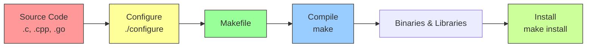

## 1.7.3 Compiling from Source and Alternatives

#### Why Compile from Source?

While package managers (RPM/DPKG) handle most software, situations arise where compiling from source is necessary:

* The required version is not available in any repository

* You need custom compilation flags (optimization, feature enable/disable)

* You are developing software and need debug symbols

* Security audits require verification of source code

* Embedded or constrained environments lack package managers

**Trade-offs:**

| Aspect                  | Package Manager                | Compile from Source                    |
| ----------------------- | ------------------------------ | -------------------------------------- |
| Ease of installation    | Easy                           | Complex                                |
| Dependency management   | Automatic                      | Manual                                 |
| Updates                 | `dnf upgrade` / `apt upgrade`  | Recompile                              |
| Uninstallation          | Clean (`remove`/`purge`)       | Manual (`make uninstall` if supported) |
| Integration with system | Full (init scripts, man pages) | Minimal                                |
| Customization           | Limited                        | Complete                               |

For platform engineers, compiling from source is a **last resort** but a necessary skill.

***

## Part 1: The Build Process – From Source to Executable



### Standard Build Stages

| Stage         | Command               | Purpose                                                |
| ------------- | --------------------- | ------------------------------------------------------ |
| **Configure** | `./configure`         | Detect system features, set options, generate Makefile |
| **Compile**   | `make`                | Build binaries from source code                        |
| **Install**   | `sudo make install`   | Copy binaries to system directories                    |
| **Clean**     | `make clean`          | Remove compiled objects (prepare for rebuild)          |
| **Uninstall** | `sudo make uninstall` | Remove installed files (if supported)                  |

***

## Part 2: Prerequisites – Build Tools and Dependencies

### Installing Build Toolchains

**RHEL family (Rocky/Alma/Fedora):**

```bash
# Install development tools group
sudo dnf groupinstall "Development Tools"

# Or install individually
sudo dnf install gcc gcc-c++ make automake autoconf libtool

# For kernel modules
sudo dnf install kernel-devel kernel-headers
```

**Debian family (Ubuntu/Debian):**

```bash
# Install build-essential meta-package
sudo apt install build-essential

# Includes: gcc, g++, make, dpkg-dev, etc.

# For specific language support
sudo apt install autoconf automake libtool

# For kernel modules
sudo apt install linux-headers-$(uname -r)
```

### Installing Build Dependencies

Before compiling, you need libraries that the software depends on.

**Example: Building Nginx from source requires PCRE, zlib, OpenSSL.**

```bash
# RHEL family
sudo dnf install pcre-devel zlib-devel openssl-devel

# Debian family
sudo apt install libpcre3-dev zlib1g-dev libssl-dev
```

**Finding dependencies:**

* Read `README` or `INSTALL` file in source directory

* Run `./configure` – it will error with missing dependencies

* Use `apt build-dep` or `dnf builddep` for known packages

```bash
# Install build dependencies for nginx (using package manager)
# Debian/Ubuntu
sudo apt build-dep nginx

# RHEL/Rocky (requires dnf-plugins-core)
sudo dnf builddep nginx
```

***

## Part 3: The Three-Step Build Process

### Step 1: `./configure` – Generate Makefile

The `configure` script (generated by autotools) detects system capabilities and allows customization.

```bash
# Basic configure (defaults to /usr/local)
./configure

# Common options
./configure --prefix=/usr/local           # Installation prefix
./configure --prefix=/opt/myapp           # Custom location
./configure --help                        # List all options

# Enable/disable features
./configure --enable-ssl --disable-debug

# Specify dependency paths
./configure --with-pcre=/usr/local/pcre

# Example: Nginx with specific modules
./configure --prefix=/etc/nginx \
            --sbin-path=/usr/sbin/nginx \
            --conf-path=/etc/nginx/nginx.conf \
            --with-http_ssl_module \
            --with-http_v2_module \
            --without-http_scgi_module
```

**Important** **`configure`** **flags:**

| Flag                | Purpose                     | Default            |
| ------------------- | --------------------------- | ------------------ |
| `--prefix=PATH`     | Installation base directory | `/usr/local`       |
| `--bindir=DIR`      | User executables            | `PREFIX/bin`       |
| `--sbindir=DIR`     | System executables          | `PREFIX/sbin`      |
| `--libdir=DIR`      | Library files               | `PREFIX/lib`       |
| `--includedir=DIR`  | Header files                | `PREFIX/include`   |
| `--mandir=DIR`      | Manual pages                | `PREFIX/share/man` |
| `--enable-FEATURE`  | Enable feature              | Varies             |
| `--disable-FEATURE` | Disable feature             | Varies             |
| `--with-PACKAGE`    | Include package             | Varies             |
| `--without-PACKAGE` | Exclude package             | Varies             |

### Step 2: `make` – Compile

```bash
# Compile (reads Makefile)
make

# Compile with multiple CPU cores (faster)
make -j $(nproc)   # Use all cores
make -j 4          # Use 4 cores

# Verbose output (see full compiler commands)
make V=1

# Compile specific target
make target-name
```

**`make`** **targets:**

| Target           | Purpose                                |
| ---------------- | -------------------------------------- |
| `all` (default)  | Build everything                       |
| `clean`          | Remove compiled objects                |
| `distclean`      | Remove everything (including Makefile) |
| `install`        | Install binaries                       |
| `uninstall`      | Uninstall (if supported)               |
| `test` / `check` | Run tests                              |

### Step 3: `make install` – Install

```bash
# Install to system directories (requires root)
sudo make install

# Install to custom prefix (no root needed if prefix is user-writable)
./configure --prefix=$HOME/local
make install

# Dry run (see what would be installed)
make -n install
```

***

## Part 4: Real-World Example – Compiling Nginx from Source

```bash
# 1. Install build dependencies
# Debian/Ubuntu
sudo apt install build-essential libpcre3-dev zlib1g-dev libssl-dev

# RHEL/Rocky
sudo dnf groupinstall "Development Tools"
sudo dnf install pcre-devel zlib-devel openssl-devel

# 2. Download source
cd /usr/local/src
sudo wget https://nginx.org/download/nginx-1.24.0.tar.gz
sudo tar -xzf nginx-1.24.0.tar.gz
cd nginx-1.24.0

# 3. Configure
./configure --prefix=/etc/nginx \
            --sbin-path=/usr/sbin/nginx \
            --conf-path=/etc/nginx/nginx.conf \
            --error-log-path=/var/log/nginx/error.log \
            --http-log-path=/var/log/nginx/access.log \
            --pid-path=/run/nginx.pid \
            --with-http_ssl_module \
            --with-http_v2_module \
            --without-http_scgi_module \
            --without-http_uwsgi_module

# 4. Compile (use all CPU cores)
make -j $(nproc)

# 5. Install
sudo make install

# 6. Verify
/usr/sbin/nginx -v
# nginx version: nginx/1.24.0

# 7. Create systemd service (optional)
sudo tee /etc/systemd/system/nginx-custom.service << 'EOF'
[Unit]
Description=Custom Nginx
After=network.target

[Service]
Type=forking
PIDFile=/run/nginx.pid
ExecStartPre=/usr/sbin/nginx -t
ExecStart=/usr/sbin/nginx
ExecReload=/usr/sbin/nginx -s reload
ExecStop=/usr/sbin/nginx -s quit
PrivateTmp=true

[Install]
WantedBy=multi-user.target
EOF

sudo systemctl daemon-reload
sudo systemctl enable nginx-custom
sudo systemctl start nginx-custom
```

***

## Part 5: Alternative Installation Methods

### `checkinstall` – Create Package from Source

`checkinstall` creates a `.deb` or `.rpm` from `make install`, allowing clean uninstallation.

```bash
# Install checkinstall
sudo apt install checkinstall    # Debian/Ubuntu
sudo dnf install checkinstall    # RHEL/Rocky (from EPEL)

# Use instead of make install
./configure
make
sudo checkinstall

# checkinstall asks:
# - Package name (default: nginx)
# - Version (default: from source)
# - Maintainer email
# Creates .deb or .rpm and installs it

# Now you can uninstall with package manager
sudo apt remove nginx   # Debian
sudo dnf remove nginx   # RHEL
```

### `stow` – Manage Multiple Versions

GNU Stow manages symlinks for software installed in `/usr/local/stow/`.

```bash
# Install stow
sudo apt install stow

# Install software to stow directory
./configure --prefix=/usr/local/stow/nginx-1.24.0
make && sudo make install

# Create symlinks (stow creates links in /usr/local/bin, etc.)
cd /usr/local/stow
sudo stow nginx-1.24.0

# Switch versions
sudo stow -D nginx-1.24.0    # Remove links
sudo stow nginx-1.20.0        # Link older version
```

***

## Part 6: `update-alternatives` (Debian/Ubuntu)

Manages multiple versions of the same command (e.g., `python`, `java`, `editor`).

```bash
# View current alternatives for a command
update-alternatives --list python

# Install alternative
sudo update-alternatives --install /usr/bin/editor editor /usr/bin/vim 100
sudo update-alternatives --install /usr/bin/editor editor /usr/bin/nano 50
# Priority: higher number = higher priority

# Configure (select which version to use)
sudo update-alternatives --config editor

# Remove alternative
sudo update-alternatives --remove editor /usr/bin/vim

# Example: Manage Python versions
sudo update-alternatives --install /usr/bin/python python /usr/bin/python3 100
sudo update-alternatives --install /usr/bin/python python /usr/bin/python2 50
```

**Common alternatives:**

| Alternative Name | Typical Commands       |
| ---------------- | ---------------------- |
| `editor`         | `vim`, `nano`, `emacs` |
| `python`         | `python2`, `python3`   |
| `java`           | Multiple JDK versions  |
| `cc`             | `gcc`, `clang`         |

***

## Part 7: `alternatives` (RHEL Family)

RHEL family uses `alternatives` (similar but different syntax).

```bash
# Display current alternatives
alternatives --display python

# Install alternative
sudo alternatives --install /usr/bin/python python /usr/bin/python3 100
sudo alternatives --install /usr/bin/python python /usr/bin/python2 50

# Configure (interactive)
sudo alternatives --config python

# Remove alternative
sudo alternatives --remove python /usr/bin/python3

# List all configured alternatives
alternatives --list
```

***

## Part 8: Troubleshooting Compilation

### Problem 1: `configure: error: C compiler cannot create executables`

```bash
# Missing build tools
# Debian/Ubuntu
sudo apt install build-essential

# RHEL/Rocky
sudo dnf groupinstall "Development Tools"
```

### Problem 2: `fatal error: openssl/ssl.h: No such file or directory`

```bash
# Missing development headers
# Debian/Ubuntu
sudo apt install libssl-dev

# RHEL/Rocky
sudo dnf install openssl-devel
```

### Problem 3: `undefined reference to symbol`

```bash
# Missing library during linking
# Add --with-library flag to configure
./configure --with-libxml2=/usr/local

# Or set environment variables
export LDFLAGS="-L/usr/local/lib"
export CPPFLAGS="-I/usr/local/include"
./configure
```

### Problem 4: `make: command not found`

```bash
# Install make
sudo apt install make        # Debian/Ubuntu
sudo dnf install make        # RHEL/Rocky
```

### Problem 5: `Permission denied` during `make install`

```bash
# Need root for system directories
sudo make install

# Or install to user directory
./configure --prefix=$HOME/local
make install
```

### Problem 6: Library not found after installation

```bash
# Update linker cache
sudo ldconfig

# Add custom library path
echo "/usr/local/lib" | sudo tee /etc/ld.so.conf.d/custom.conf
sudo ldconfig
```

***

## Part 9: Library Paths and `ldconfig`

When you compile software that installs shared libraries (`.so` files), the system needs to know where to find them at runtime.

### How the Dynamic Linker Works

The dynamic linker (`ld.so`) searches for libraries in:
1. Paths encoded in the binary (`rpath` / `runpath`)
2. `LD_LIBRARY_PATH` environment variable
3. System cache (`/etc/ld.so.cache`) – built by `ldconfig`
4. Default paths (`/lib`, `/usr/lib`)

### `ldconfig` – Update Library Cache

```bash
# Rebuild library cache (run after installing new libraries)
sudo ldconfig

# Add custom library directory permanently
echo "/usr/local/lib" | sudo tee /etc/ld.so.conf.d/custom.conf
sudo ldconfig

# View current cache
ldconfig -p | grep libssl

# Show what ldconfig would do (dry run)
ldconfig -v 2>/dev/null | head -20
```

### `LD_LIBRARY_PATH` – Runtime Override

Use `LD_LIBRARY_PATH` to temporarily override library search paths (useful for testing or isolated environments).

```bash
# Run command with custom library path
LD_LIBRARY_PATH=/opt/mylibs/lib ./myapp

# Export for session
export LD_LIBRARY_PATH=/opt/mylibs/lib:$LD_LIBRARY_PATH

# In systemd service
[Service]
Environment=LD_LIBRARY_PATH=/opt/mylibs/lib
ExecStart=/opt/myapp/bin/myapp
```

**When to use each:**

| Method | Use Case |
|--------|----------|
| `ldconfig` (system-wide) | Permanently installed libraries |
| `LD_LIBRARY_PATH` | Testing, isolated apps, user-level overrides |
| `rpath` (compiled in) | Self-contained applications |

***

## Part 10: Python-Specific – `make altinstall`

When compiling Python from source, **never use `make install`** – it overwrites the system `python3` symlink, breaking system tools.

```bash
# WRONG – breaks system Python
sudo make install

# CORRECT – installs as python3.11 without creating python3 symlink
sudo make altinstall
```

**What `altinstall` does differently:**
- Installs binary as `python3.11` (not `python3`)
- Does not create `python`, `python3`, `pip`, `pip3` symlinks
- System Python remains untouched

**Example: Installing Python 3.11 alongside system Python 3.10**

```bash
# After ./configure --prefix=/usr/local --enable-optimizations
sudo make -j $(nproc)
sudo make altinstall

# Verify both exist
python3 --version      # 3.10.x (system)
python3.11 --version   # 3.11.x (compiled)

# Create virtual environment with new version
python3.11 -m venv myproject
```

***

## Quick Task: Compile a Simple Program

*Practice the complete build process with a small, fast-compiling program.*

1. Download `htop` source code (or any small utility) from GitHub.
2. Install build dependencies.
3. Run `./autogen.sh` (if needed) or `./configure`.
4. Compile with `make`.
5. Install to `/usr/local` (or `$HOME/local`).
6. Verify the installed binary works.
7. Uninstall (or just delete the binary).

> **Ready Solution (Ubuntu example – compiling htop):**
>
> ```bash
> # Task 1: Download source
> cd /tmp
> git clone https://github.com/htop-dev/htop.git
> cd htop
>
> # Task 2: Install dependencies
> sudo apt install build-essential autoconf automake libncurses-dev
>
> # Task 3: Generate configure script (if not present)
> ./autogen.sh
>
> # Task 4: Configure and compile
> ./configure --prefix=$HOME/local
> make -j $(nproc)
>
> # Task 5: Install to user directory
> make install
>
> # Task 6: Verify
> $HOME/local/bin/htop --version
> # htop 3.3.0
>
> # Task 7: Uninstall (from source directory)
> make uninstall
> # Or just delete the binary
> rm -rf $HOME/local/bin/htop
> ```

***

## Summary Table: Build Stages

| Stage     | Command                           | When to Use                    |
| --------- | --------------------------------- | ------------------------------ |
| Configure | `./configure --prefix=/usr/local` | Every build                    |
| Compile   | `make -j $(nproc)`                | Every build                    |
| Install   | `sudo make install`               | After successful compile       |
| Clean     | `make clean`                      | Before rebuild                 |
| Distclean | `make distclean`                  | Start fresh (removes Makefile) |
| Uninstall | `sudo make uninstall`             | Remove (if supported)          |

### Build Dependencies by Language

| Language | RHEL Family              | Debian Family     |
| -------- | ------------------------ | ----------------- |
| C/C++    | `gcc`, `gcc-c++`, `make` | `build-essential` |
| Python   | `python3-devel`          | `python3-dev`     |
| Perl     | `perl-devel`             | `libperl-dev`     |
| Ruby     | `ruby-devel`             | `ruby-dev`        |
| Java     | `java-devel` (OpenJDK)   | `default-jdk`     |

### Common Library Development Packages

| Library  | RHEL Family      | Debian Family     |
| -------- | ---------------- | ----------------- |
| OpenSSL  | `openssl-devel`  | `libssl-dev`      |
| PCRE     | `pcre-devel`     | `libpcre3-dev`    |
| zlib     | `zlib-devel`     | `zlib1g-dev`      |
| libxml2  | `libxml2-devel`  | `libxml2-dev`     |
| ncurses  | `ncurses-devel`  | `libncurses-dev`  |
| readline | `readline-devel` | `libreadline-dev` |

### `update-alternatives` vs `alternatives`

| Feature             | Debian/Ubuntu (`update-alternatives`) | RHEL/Rocky (`alternatives`)         |
| ------------------- | ------------------------------------- | ----------------------------------- |
| Install alternative | `--install link name path priority`   | `--install link name path priority` |
| Configure           | `--config name`                       | `--config name`                     |
| Remove              | `--remove name path`                  | `--remove name path`                |
| Display             | `--display name`                      | `--display name`                    |
| List all            | `--list`                              | `--list`                            |

***

**Next note (1.7.4)** will be the Subchapter Review for Package Management, including a comprehensive cheatsheet and scenario-based interview questions covering RPM/YUM/DNF, DPKG/APT, and compiling from source.

***

## Backlinks

**Previous:** [1.7.2 DPKG and APT](./1.7.2_DPKG_and_APT.md)

**Next:** [1.7.4 Subchapter Review](./1.7.4_Subchapter_Review.md)

**Related:**
- [1.6.1 Process Lifecycle and Tools](../Subchapter_1.6/1.6.1_Process_Lifecycle_and_Tools.md) – compiled binaries become processes
- [1.6.2 Systemd Deep Dive](../Subchapter_1.6/1.6.2_Systemd_Deep_Dive.md) – custom compiled services need unit files
- [1.2.2 Linux Permissions](../Subchapter_1.2/1.2.2_Linux_Permissions.md) – `make install` respects umask; binaries need execute permission
- [1.3.1 User Management](../Subchapter_1.3/1.3.1_User_Management.md) – services from compiled software should run as non-root users
