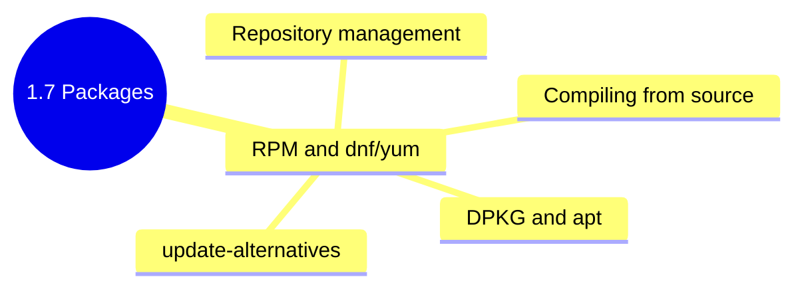

## 1.7.4 Subchapter Review: Cheatsheet and Interview Prep

This review covers only the material presented in Notes 1.7.1 (RPM and YUM/DNF), 1.7.2 (DPKG and APT), and 1.7.3 (Compiling from Source and Alternatives). No forward referencing beyond what was explicitly introduced.




***

## Cheatsheet: Package Management

### RHEL Family (RPM/YUM/DNF)

#### RPM Commands (Low-Level)

| Operation                | Command                 |
| ------------------------ | ----------------------- |
| Install local .rpm       | `rpm -ivh package.rpm`  |
| Upgrade package          | `rpm -Uvh package.rpm`  |
| Remove package           | `rpm -e package-name`   |
| List installed packages  | `rpm -qa`               |
| List files in package    | `rpm -ql package-name`  |
| Find package owning file | `rpm -qf /path/to/file` |
| Package information      | `rpm -qi package-name`  |
| Verify package           | `rpm -V package-name`   |
| Rebuild RPM database     | `rpm --rebuilddb`       |

#### DNF Commands (High-Level – Modern)

| Operation            | Command                                |
| -------------------- | -------------------------------------- |
| Update package lists | `dnf makecache`                        |
| Install package      | `dnf install nginx`                    |
| Remove package       | `dnf remove nginx`                     |
| Update all packages  | `dnf upgrade`                          |
| Update specific      | `dnf update nginx`                     |
| Search               | `dnf search nginx`                     |
| Package info         | `dnf info nginx`                       |
| List installed       | `dnf list installed`                   |
| List available       | `dnf list available`                   |
| Find file owner      | `dnf provides /path`                   |
| Group install        | `dnf groupinstall "Development Tools"` |
| History              | `dnf history`                          |
| Clean cache          | `dnf clean all`                        |
| Check dependencies   | `dnf check`                            |
| Autoremove           | `dnf autoremove`                       |

#### DNF Repository Configuration (`/etc/yum.repos.d/*.repo`)

```ini
[repo-name]
name=Repository Name
baseurl=http://example.com/repo/$releasever/$basearch/
enabled=1
gpgcheck=1
gpgkey=http://example.com/key.asc
```

### Debian Family (DPKG/APT)

#### DPKG Commands (Low-Level)

| Operation                | Command                         |
| ------------------------ | ------------------------------- |
| Install local .deb       | `dpkg -i package.deb`           |
| Remove (keep config)     | `dpkg -r package-name`          |
| Purge (remove config)    | `dpkg -P package-name`          |
| List installed           | `dpkg -l`                       |
| List files in package    | `dpkg -L package-name`          |
| Find package owning file | `dpkg -S /path/to/file`         |
| Package information      | `dpkg -s package-name`          |
| Reconfigure package      | `dpkg-reconfigure package-name` |
| Fix broken packages      | `dpkg --configure -a`           |

#### APT Commands (High-Level)

| Operation             | Command                 |
| --------------------- | ----------------------- |
| Update package lists  | `apt update`            |
| Install package       | `apt install nginx`     |
| Remove (keep config)  | `apt remove nginx`      |
| Purge (remove config) | `apt purge nginx`       |
| Upgrade all packages  | `apt upgrade`           |
| Smart upgrade         | `apt full-upgrade`      |
| Search                | `apt search nginx`      |
| Package info          | `apt show nginx`        |
| List installed        | `apt list --installed`  |
| List upgradable       | `apt list --upgradable` |
| Package policy        | `apt policy nginx`      |
| Show dependencies     | `apt depends nginx`     |
| Autoremove            | `apt autoremove`        |
| Clean cache           | `apt clean`             |

#### APT Repository Configuration (`/etc/apt/sources.list`)

```
deb http://archive.ubuntu.com/ubuntu jammy main restricted universe multiverse
deb-src http://archive.ubuntu.com/ubuntu jammy main
```

| Field             | Meaning                                   |
| ----------------- | ----------------------------------------- |
| `deb` / `deb-src` | Binary / source packages                  |
| `uri`             | Repository URL                            |
| `suite`           | Release codename (jammy, focal, bullseye) |
| `component`       | main, restricted, universe, multiverse    |

### Compiling from Source

#### Build Stages

| Stage     | Command                           | Purpose               |
| --------- | --------------------------------- | --------------------- |
| Configure | `./configure --prefix=/usr/local` | Generate Makefile     |
| Compile   | `make -j $(nproc)`                | Build binaries        |
| Install   | `sudo make install`               | Copy to system        |
| Clean     | `make clean`                      | Remove objects        |
| Uninstall | `sudo make uninstall`             | Remove (if supported) |

#### Common `./configure` Flags

| Flag                | Purpose                     |
| ------------------- | --------------------------- |
| `--prefix=PATH`     | Installation base directory |
| `--bindir=DIR`      | User executables            |
| `--sbindir=DIR`     | System executables          |
| `--enable-FEATURE`  | Enable feature              |
| `--disable-FEATURE` | Disable feature             |
| `--with-PACKAGE`    | Include package             |
| `--without-PACKAGE` | Exclude package             |

#### Build Dependencies

| Purpose          | RHEL Family                            | Debian Family                 |
| ---------------- | -------------------------------------- | ----------------------------- |
| Base build tools | `dnf groupinstall "Development Tools"` | `apt install build-essential` |
| OpenSSL          | `openssl-devel`                        | `libssl-dev`                  |
| PCRE             | `pcre-devel`                           | `libpcre3-dev`                |
| zlib             | `zlib-devel`                           | `zlib1g-dev`                  |

### Alternatives Systems

#### Debian/Ubuntu: `update-alternatives`

| Operation           | Command                                                                 |
| ------------------- | ----------------------------------------------------------------------- |
| Install alternative | `update-alternatives --install /usr/bin/editor editor /usr/bin/vim 100` |
| Configure           | `update-alternatives --config editor`                                   |
| Remove              | `update-alternatives --remove editor /usr/bin/vim`                      |
| Display             | `update-alternatives --display editor`                                  |

#### RHEL/Rocky: `alternatives`

| Operation           | Command                                                          |
| ------------------- | ---------------------------------------------------------------- |
| Install alternative | `alternatives --install /usr/bin/editor editor /usr/bin/vim 100` |
| Configure           | `alternatives --config editor`                                   |
| Remove              | `alternatives --remove editor /usr/bin/vim`                      |
| Display             | `alternatives --display editor`                                  |

***

## Comparison Tables

### Package Manager Comparison

| Feature               | RPM (Low)  | DNF/YUM (High)       | DPKG (Low) | APT (High)             |
| --------------------- | ---------- | -------------------- | ---------- | ---------------------- |
| Dependency resolution | No         | Yes                  | No         | Yes                    |
| Repository support    | No         | Yes                  | No         | Yes                    |
| Install local file    | `rpm -ivh` | `dnf install`        | `dpkg -i`  | `apt install`          |
| Remove package        | `rpm -e`   | `dnf remove`         | `dpkg -r`  | `apt remove`           |
| Purge (remove config) | N/A        | N/A                  | `dpkg -P`  | `apt purge`            |
| List installed        | `rpm -qa`  | `dnf list installed` | `dpkg -l`  | `apt list --installed` |
| Find file owner       | `rpm -qf`  | `dnf provides`       | `dpkg -S`  | `dpkg -S`              |
| Package info          | `rpm -qi`  | `dnf info`           | `dpkg -s`  | `apt show`             |
| Update all            | N/A        | `dnf upgrade`        | N/A        | `apt upgrade`          |

### RHEL vs Debian Command Mapping

| Operation            | RHEL (DNF)           | Debian (APT)                              |
| -------------------- | -------------------- | ----------------------------------------- |
| Update package lists | `dnf makecache`      | `apt update`                              |
| Install package      | `dnf install nginx`  | `apt install nginx`                       |
| Remove package       | `dnf remove nginx`   | `apt remove nginx`                        |
| Search               | `dnf search nginx`   | `apt search nginx`                        |
| Info                 | `dnf info nginx`     | `apt show nginx`                          |
| Upgrade all          | `dnf upgrade`        | `apt upgrade`                             |
| Add repository       | Create `.repo` file  | `add-apt-repository` or edit sources.list |
| Build dependencies   | `dnf builddep nginx` | `apt build-dep nginx`                     |

### Compiling vs Package Manager

| Aspect             | Package Manager                | Compile from Source                |
| ------------------ | ------------------------------ | ---------------------------------- |
| Ease               | Easy                           | Complex                            |
| Dependencies       | Automatic                      | Manual                             |
| Updates            | One command                    | Recompile                          |
| Uninstall          | Clean                          | Manual (`make uninstall` if lucky) |
| Customization      | Limited                        | Complete                           |
| System integration | Full (init scripts, man pages) | Minimal                            |

***

## Interview Questions (Scenario-Based)

These questions assume only knowledge from Subchapter 1.7. Answers reference only concepts from 1.7.1, 1.7.2, and 1.7.3.

### Question 1

**Scenario:** You are managing a fleet of RHEL 8 servers. A security audit requires that you verify the integrity of the `openssl` package on all servers – ensuring no files have been modified from the original installation.

**Question:** What command would you use to verify package integrity? What do the output codes mean? If a file is modified, how would you restore the original?

**Answer:**

**Verification command:**

```bash
rpm -V openssl
# Or for all packages: rpm -Va
```

**Output codes (when a file differs):**

| Code | Meaning                     |
| ---- | --------------------------- |
| `S`  | File size differs           |
| `5`  | MD5 checksum differs        |
| `T`  | Modification time differs   |
| `D`  | Device major/minor mismatch |
| `L`  | Symlink path mismatch       |
| `U`  | User ownership differs      |
| `G`  | Group ownership differs     |
| `M`  | Mode (permissions) differs  |

**If output shows** **`S.5....T. /usr/bin/openssl`:** The file has been modified.

**Restoring original:**

```bash
# Method 1: Reinstall package
sudo dnf reinstall openssl -y

# Method 2: Force reinstall from local .rpm
sudo dnf download openssl
sudo rpm -ivh --replacefiles openssl-*.rpm

# Method 3: If only one file is corrupted, extract from package
rpm2cpio openssl-*.rpm | cpio -idmv ./usr/bin/openssl
sudo cp ./usr/bin/openssl /usr/bin/openssl
```

**Automation for fleet:**

```bash
# Check all servers
ansible all -m shell -a "rpm -V openssl"
```

### Question 2

**Scenario:** A developer asks you to install a specific version of Python (3.11.5) on an Ubuntu 22.04 server. The default repositories only provide Python 3.10. You cannot add third-party repositories (company policy).

**Question:** How would you install Python 3.11.5 without breaking the system's default Python (3.10)? What are the risks, and how would you mitigate them?

**Answer:**

**Solution: Compile from source and install to** **`/usr/local`** **(or** **`/opt`).**

**Step-by-step:**

```bash
# 1. Install build dependencies
sudo apt update
sudo apt install build-essential libssl-dev zlib1g-dev \
    libncurses5-dev libncursesw5-dev libreadline-dev libsqlite3-dev \
    libgdbm-dev libdb5.3-dev libbz2-dev libexpat1-dev liblzma-dev tk-dev libffi-dev

# 2. Download source
cd /usr/local/src
sudo wget https://www.python.org/ftp/python/3.11.5/Python-3.11.5.tgz
sudo tar -xzf Python-3.11.5.tgz
cd Python-3.11.5

# 3. Configure (install to /usr/local, not overwriting system python)
sudo ./configure --prefix=/usr/local --enable-optimizations

# 4. Compile (this takes time)
sudo make -j $(nproc)

# 5. Install
sudo make altinstall   # NOT make install (would overwrite python3)
```

**Why** **`altinstall`?**

* `make install` would overwrite `/usr/bin/python3` (system Python)

* `make altinstall` installs as `python3.11` without creating `python3` symlink

**Verification:**

```bash
# System Python remains
python3 --version   # 3.10.x

# New Python available
python3.11 --version   # 3.11.5
/usr/local/bin/python3.11 --version

# Create virtual environment with new Python
python3.11 -m venv myproject_env
```

**Risks and Mitigations:**

| Risk                             | Mitigation                                                              |
| -------------------------------- | ----------------------------------------------------------------------- |
| Breaking system Python           | Use `altinstall`, never overwrite `/usr/bin/python3`                    |
| Confusion with `python3` command | Use explicit `python3.11` or virtual environments                       |
| Missing shared libraries         | Install all `-dev` packages before compiling                            |
| Hard to uninstall                | Install to `/opt/python3.11` instead of `/usr/local` for easier removal |
| System updates break build       | Keep source directory to rebuild if needed                              |

**Alternative (if you must use package manager):**

```bash
# Add deadsnakes PPA (if policy allowed)
sudo add-apt-repository ppa:deadsnakes/ppa
sudo apt update
sudo apt install python3.11 python3.11-venv
```

### Question 3

**Scenario:** A `dnf update` on a RHEL 9 server fails with:

```
Error: Transaction check error:
  file /etc/nginx/nginx.conf from install of nginx-1.20.1-10.el9.x86_64 conflicts with file from package nginx-1.18.0-5.el9.x86_64
```

**Question:** What does this error mean? How would you resolve it without losing custom configuration?

**Answer:**

**Error meaning:** The new package (`nginx-1.20.1`) and the installed package (`nginx-1.18.0`) both claim ownership of `/etc/nginx/nginx.conf`. This is a **file conflict** – usually because the old package wasn't properly removed, or because you manually created a file that now conflicts.

**Resolution steps (preserving custom config):**

**Step 1: Check what's installed**

```bash
rpm -qa | grep nginx
# nginx-1.18.0-5.el9.x86_64
```

**Step 2: Check file ownership**

```bash
rpm -qf /etc/nginx/nginx.conf
# nginx-1.18.0-5.el9.x86_64
```

**Step 3: Backup custom configuration**

```bash
sudo cp /etc/nginx/nginx.conf /tmp/nginx.conf.backup
```

**Step 4: Remove old package (keeping config)**

```bash
# Remove but keep config files
sudo dnf remove nginx
# This removes the package but may leave /etc/nginx/ intact
```

**Step 5: Install new package**

```bash
sudo dnf install nginx-1.20.1-10.el9
```

**Step 6: Restore custom configuration**

```bash
# Compare old and new config
diff /tmp/nginx.conf.backup /etc/nginx/nginx.conf

# Merge changes manually or restore entire file
sudo cp /tmp/nginx.conf.backup /etc/nginx/nginx.conf

# Test configuration
sudo nginx -t
```

**Alternative (force replacement – last resort):**

```bash
# Force replace conflicting files (dangerous – may break configuration)
sudo rpm -Uvh --replacefiles nginx-1.20.1-10.el9.x86_64.rpm
```

**Prevention for the future:**

* Never manually create files in `/etc/` that belong to packages

* Use `/etc/nginx/conf.d/` for custom configs (doesn't conflict)

* Back up before major updates

### Question 4

**Scenario:** You need to deploy an internal application that requires OpenSSL 3.0, but your RHEL 8 servers only have OpenSSL 1.1.1 (RHEL 8 default). You cannot upgrade the OS or replace the system OpenSSL (would break many packages).

**Question:** How would you provide OpenSSL 3.0 to your application without affecting system packages? Provide the complete solution.

**Answer:**

**Solution: Compile OpenSSL 3.0 to a custom location (`/usr/local/ssl`) and compile your application against it.**

**Step 1: Install build dependencies**

```bash
sudo dnf groupinstall "Development Tools"
sudo dnf install perl-core
```

**Step 2: Download and compile OpenSSL 3.0 to custom prefix**

```bash
cd /usr/local/src
sudo wget https://www.openssl.org/source/openssl-3.0.10.tar.gz
sudo tar -xzf openssl-3.0.10.tar.gz
cd openssl-3.0.10

# Configure with custom prefix (not /usr)
sudo ./config --prefix=/usr/local/ssl --openssldir=/usr/local/ssl shared zlib

# Compile
sudo make -j $(nproc)

# Install
sudo make install

# Update linker cache for custom location
echo "/usr/local/ssl/lib" | sudo tee /etc/ld.so.conf.d/openssl30.conf
sudo ldconfig
```

**Step 3: Verify custom OpenSSL**

```bash
/usr/local/ssl/bin/openssl version
# OpenSSL 3.0.10 1 Aug 2023
```

**Step 4: Compile your application against custom OpenSSL**

```bash
# Example: Compiling curl with custom OpenSSL
cd /usr/local/src
wget https://curl.se/download/curl-8.4.0.tar.gz
tar -xzf curl-8.4.0.tar.gz
cd curl-8.4.0

./configure --prefix=/opt/myapp \
            --with-openssl=/usr/local/ssl \
            --without-libpsl \
            --without-brotli

make -j $(nproc)
sudo make install
```

**Step 5: Run application with custom library path**

```bash
# Set LD_LIBRARY_PATH for the application
export LD_LIBRARY_PATH=/usr/local/ssl/lib:$LD_LIBRARY_PATH
/opt/myapp/bin/myapp

# Or create wrapper script
cat > /opt/myapp/run.sh << 'EOF'
#!/bin/bash
export LD_LIBRARY_PATH=/usr/local/ssl/lib
exec /opt/myapp/bin/myapp "$@"
EOF
chmod +x /opt/myapp/run.sh
```

**Step 6: Create systemd service (if needed)**

```ini
[Service]
Environment=LD_LIBRARY_PATH=/usr/local/ssl/lib
ExecStart=/opt/myapp/bin/myapp
```

**Why this works:**

* System OpenSSL remains at `/usr/lib64/libssl.so.1.1` (untouched)

* Custom OpenSSL lives in `/usr/local/ssl`

* Applications using system libraries continue to work

* Your application loads custom libraries via `LD_LIBRARY_PATH` or `rpath`

**Verification:**

```bash
# Check which libraries your app uses
ldd /opt/myapp/bin/myapp | grep ssl
# libssl.so.3 => /usr/local/ssl/lib/libssl.so.3
```

### Question 5

**Scenario:** You have multiple versions of a custom tool (`mytool` – versions 1.0, 1.5, 2.0) compiled from source and installed to `/opt/mytool-{version}/`. Different teams need different default versions. You need a system to switch between them without recompiling.

**Question:** Using the appropriate alternatives system, how would you manage these versions? Provide commands for both Debian and RHEL families.

**Answer:**

**Solution: Use** **`update-alternatives`** **(Debian) or** **`alternatives`** **(RHEL).**

### Debian/Ubuntu (update-alternatives)

**Step 1: Install each version to a unique path**

```bash
# Assume each version compiled with:
./configure --prefix=/opt/mytool-1.0
make && sudo make install

./configure --prefix=/opt/mytool-1.5
make && sudo make install

./configure --prefix=/opt/mytool-2.0
make && sudo make install
```

**Step 2: Register each version as an alternative**

```bash
# Register version 1.0 (priority 10 – lowest)
sudo update-alternatives --install /usr/local/bin/mytool mytool /opt/mytool-1.0/bin/mytool 10

# Register version 1.5 (priority 50 – medium)
sudo update-alternatives --install /usr/local/bin/mytool mytool /opt/mytool-1.5/bin/mytool 50

# Register version 2.0 (priority 100 – highest default)
sudo update-alternatives --install /usr/local/bin/mytool mytool /opt/mytool-2.0/bin/mytool 100
```

**Step 3: Configure default (interactive)**

```bash
sudo update-alternatives --config mytool

# Output:
# There are 3 choices for the alternative mytool (providing /usr/local/bin/mytool).
#   Selection    Path                            Priority   Status
# ------------------------------------------------------------
# * 0            /opt/mytool-2.0/bin/mytool       100       auto mode
#   1            /opt/mytool-1.0/bin/mytool       10        manual mode
#   2            /opt/mytool-1.5/bin/mytool       50        manual mode
#   3            /opt/mytool-2.0/bin/mytool       100       manual mode
#
# Press <enter> to keep the current choice[*], or type selection number:
```

**Step 4: Switch version for specific user (user-level)**

```bash
# User can set in ~/.bashrc
export PATH=/opt/mytool-1.5/bin:$PATH
# Or create alias
alias mytool=/opt/mytool-1.5/bin/mytool
```

**Step 5: Display current version**

```bash
update-alternatives --display mytool
mytool --version
```

### RHEL/Rocky (alternatives)

**Step 1: Same installation to** **`/opt/mytool-*`**

**Step 2: Register alternatives**

```bash
# Register version 1.0 (priority 10)
sudo alternatives --install /usr/local/bin/mytool mytool /opt/mytool-1.0/bin/mytool 10

# Register version 1.5 (priority 50)
sudo alternatives --install /usr/local/bin/mytool mytool /opt/mytool-1.5/bin/mytool 50

# Register version 2.0 (priority 100)
sudo alternatives --install /usr/local/bin/mytool mytool /opt/mytool-2.0/bin/mytool 100
```

**Step 3: Configure (interactive)**

```bash
sudo alternatives --config mytool

# Output:
# There are 3 programs which provide 'mytool'.
#   Selection    Command
# -----------------------------------------------
# *+ 1           /opt/mytool-2.0/bin/mytool
#    2           /opt/mytool-1.0/bin/mytool
#    3           /opt/mytool-1.5/bin/mytool
#
# Enter to keep the current selection[+], or type selection number:
```

**Step 4: Display information**

```bash
alternatives --display mytool
```

**Step 5: Remove an alternative**

```bash
# Debian
sudo update-alternatives --remove mytool /opt/mytool-1.0/bin/mytool

# RHEL
sudo alternatives --remove mytool /opt/mytool-1.0/bin/mytool
```

**Alternative: Module system (for more complex versioning)**

```bash
# For Python, Ruby, Node.js, consider using version managers:
# pyenv, rvm, nvm – these are user-level and don't require root
```

**Verification across both families:**

```bash
# Test the alternative
which mytool
# /usr/local/bin/mytool

ls -l /usr/local/bin/mytool
# lrwxrwxrwx ... /usr/local/bin/mytool -> /etc/alternatives/mytool

mytool --version
# mytool 2.0
```

***

## Topics Covered in This Subchapter (Self-Check)

| Topic                                                            | Found in Note |
| ---------------------------------------------------------------- | ------------- |
| RPM package naming                                               | 1.7.1         |
| RPM basic commands (`-ivh`, `-e`, `-qa`, `-ql`, `-qf`, `-qi`)    | 1.7.1         |
| RPM verification (`-V`) and codes                                | 1.7.1         |
| RPM database rebuild                                             | 1.7.1         |
| YUM/DNF commands                                                 | 1.7.1         |
| DNF repository files (`.repo`)                                   | 1.7.1         |
| EPEL repository                                                  | 1.7.1         |
| DNF versionlock                                                  | 1.7.1         |
| DPKG file naming                                                 | 1.7.2         |
| DPKG basic commands (`-i`, `-r`, `-P`, `-l`, `-L`, `-S`, `-s`)   | 1.7.2         |
| DPKG status codes (`ii`, `rc`, etc.)                             | 1.7.2         |
| APT commands (`update`, `install`, `remove`, `purge`, `upgrade`) | 1.7.2         |
| APT vs apt-get vs apt-cache                                      | 1.7.2         |
| APT sources.list format                                          | 1.7.2         |
| Ubuntu codenames (jammy, focal)                                  | 1.7.2         |
| PPA management (`add-apt-repository`)                            | 1.7.2         |
| APT pinning                                                      | 1.7.2         |
| APT build-dep                                                    | 1.7.2         |
| Compiling from source (configure, make, make install)            | 1.7.3         |
| Build dependencies (`build-essential`, `Development Tools`)      | 1.7.3         |
| `./configure` flags (`--prefix`, `--enable`, `--with`)           | 1.7.3         |
| `make -j` parallel compilation                                   | 1.7.3         |
| `make altinstall` (Python)                                       | 1.7.3         |
| `checkinstall` for package creation                              | 1.7.3         |
| `stow` for version management                                    | 1.7.3         |
| `update-alternatives` (Debian)                                   | 1.7.3         |
| `alternatives` (RHEL)                                            | 1.7.3         |
| `ldconfig` and library paths                                     | 1.7.3         |
| `LD_LIBRARY_PATH` environment variable                           | 1.7.3         |
| `make altinstall` (Python)                                       | 1.7.3         |
| Troubleshooting compilation                                      | 1.7.3         |

## Quick Command and Concept Reference

| Concept | Taught In | Purpose |
|---------|-----------|---------|
| `rpm2cpio` | [1.7.1](./1.7.1_RPM_and_YUM_DNF.md) Part 5 | Extract files from RPM without installing |
| `ldconfig` | [1.7.3](./1.7.3_Compiling_from_Source_and_Alternatives.md) Part 9 | Update dynamic linker cache after installing libraries |
| `LD_LIBRARY_PATH` | [1.7.3](./1.7.3_Compiling_from_Source_and_Alternatives.md) Part 9 | Runtime override for library search paths |
| `make altinstall` | [1.7.3](./1.7.3_Compiling_from_Source_and_Alternatives.md) Part 10 | Python-specific install without overwriting system python |
| `dnf builddep` | [1.7.3](./1.7.3_Compiling_from_Source_and_Alternatives.md) Part 2 | Install build dependencies for a package |
| `apt build-dep` | [1.7.3](./1.7.3_Compiling_from_Source_and_Alternatives.md) Part 2 | Debian equivalent of dnf builddep |

**Scenario-only concepts (not separately taught):**

| Concept | Used In | Notes |
|---------|---------|-------|
| `rpath` | Q4 scenario | Hardcoded library path in executable; alternative to `LD_LIBRARY_PATH` |
| `deadsnakes` PPA | Q2 scenario | Third-party Python repository for Ubuntu |

***

## Backlinks

**Previous:** [1.6.4 Subchapter Review (Process Management and Scheduling)](../Subchapter_1.6/1.6.4_Subchapter_Review.md)

**Next:** Subchapter 1.8 – Text Processing Utilities and Editors

**Cross-references within this subchapter:**
- [1.7.1 RPM and YUM/DNF](./1.7.1_RPM_and_YUM_DNF.md)
- [1.7.2 DPKG and APT](./1.7.2_DPKG_and_APT.md)
- [1.7.3 Compiling from Source and Alternatives](./1.7.3_Compiling_from_Source_and_Alternatives.md)

**Related subchapters:**
- [1.6.2 Systemd Deep Dive](../Subchapter_1.6/1.6.2_Systemd_Deep_Dive.md) – package installations often enable/start services
- [1.2.2 Linux Permissions](../Subchapter_1.2/1.2.2_Linux_Permissions.md) – installed binaries need execute permission
