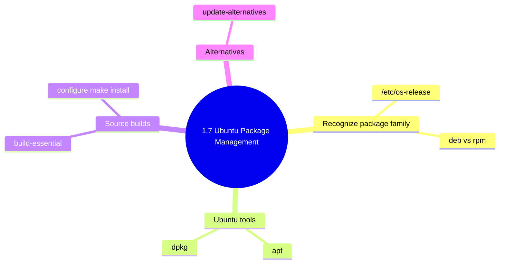

## 1.7.4 Subchapter Review: Ubuntu Package Management

This review covers Ubuntu-first package management: recognition-level RPM context, `dpkg`, `apt`, compiling from source, and `update-alternatives`.


```mermaid
mindmap
  root((1.7 Ubuntu Package Management))
    Recognize package family
      /etc/os-release
      deb vs rpm
    Ubuntu tools
      dpkg
      apt
    Source builds
      build-essential
      configure make install
    Alternatives
      update-alternatives
```

***

## Quick Command Reference

| Need | Command |
| --- | --- |
| Identify distro | `cat /etc/os-release` |
| Update package lists | `sudo apt update` |
| Upgrade packages | `sudo apt upgrade` |
| Install package | `sudo apt install nginx` |
| Remove package | `sudo apt remove nginx` |
| Remove package and config | `sudo apt purge nginx` |
| Search packages | `apt search nginx` |
| Show package details | `apt show nginx` |
| List installed packages | `apt list --installed` |
| Find owner of a file | `dpkg -S /path/to/file` |
| List files in package | `dpkg -L nginx` |
| Install local `.deb` | `sudo apt install ./package.deb` |
| Fix broken dependencies | `sudo apt --fix-broken install` |
| Install build tools | `sudo apt install build-essential` |
| Manage alternatives | `sudo update-alternatives --config <name>` |

***

## Quick Recap

- `apt` is the daily Ubuntu package manager; it resolves dependencies and talks to repositories.
- `dpkg` is lower-level; use it to inspect installed packages and `.deb` files.
- Always run `sudo apt update` before installing if package metadata may be stale.
- Prefer `apt install ./package.deb` over `dpkg -i` because APT resolves dependencies.
- Source builds need `build-essential` and usually development headers.
- `update-alternatives` lets multiple versions of a command coexist behind one public name.
- RPM/DNF knowledge is recognition-only in this course: identify non-Ubuntu hosts, then follow the environment runbook.

***

## Practice Questions with Solutions

### Question 1

**Scenario:** You need to install Nginx on a fresh Ubuntu VM and confirm the package is present.

**Solution:**

```bash
sudo apt update
sudo apt install nginx
apt list --installed | grep '^nginx/'
```

### Question 2

**Scenario:** You found `/usr/sbin/nginx` and need to know which package owns it.

**Solution:**

```bash
dpkg -S /usr/sbin/nginx
```

### Question 3

**Scenario:** A local `.deb` install failed because dependencies were missing.

**Solution:**

```bash
sudo apt install ./vendor-package.deb
sudo apt --fix-broken install
```

APT is preferred because it can fetch missing dependencies from configured repositories.

### Question 4

**Scenario:** You need compiler tools to build software from source on Ubuntu.

**Solution:**

```bash
sudo apt update
sudo apt install build-essential pkg-config
```

Then follow the project-specific build steps, commonly:

```bash
./configure
make
sudo make install
```

### Question 5

**Scenario:** Two Java versions are installed and you need to switch the default `java` command.

**Solution:**

```bash
sudo update-alternatives --config java
java -version
```

***

## Summary

- Use `apt` for normal Ubuntu package operations.
- Use `dpkg` for package database inspection and file ownership.
- Use source builds only when repositories or vendor packages do not meet the requirement.
- Keep package commands distro-aware by checking `/etc/os-release` first.
- Treat RPM/DNF as recognition context unless a real non-Ubuntu environment requires it.

***

**Backlinks:**

- Previous: [1.7.1 RPM, YUM, and DNF Recognition Notes](./1.7.1_RPM_and_YUM_DNF.md)
- Previous: [1.7.2 DPKG and APT](./1.7.2_DPKG_and_APT.md)
- Previous: [1.7.3 Compiling from Source and Alternatives](./1.7.3_Compiling_from_Source_and_Alternatives.md)
- Next: [1.8.1 Find and Grep](../Subchapter_1.8/1.8.1_Find_and_Grep.md)
