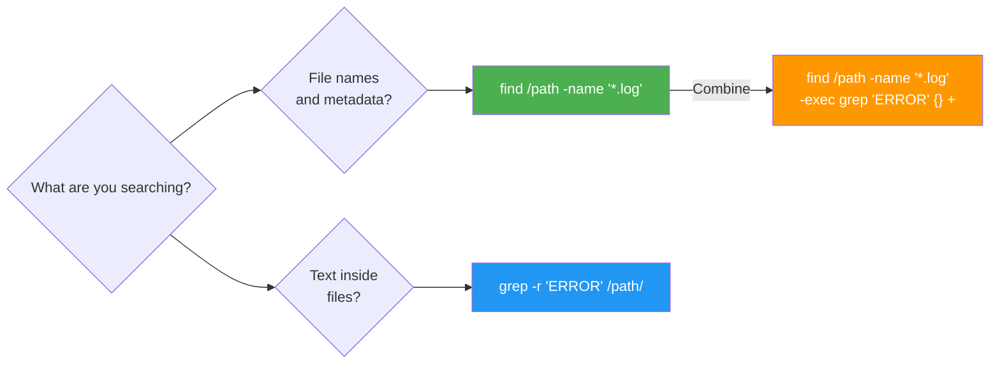

## 1.8.1 Find and Grep: Searching Files and Content

#### Why Searching Matters

Platform engineers constantly need to locate files and analyze logs, configurations, and code. Two essential tools dominate this space:

* **`find`** – Search for **files and directories** by name, size, time, permissions, or content.

* **`grep`** – Search **inside files** for text patterns using regular expressions.


### find vs grep



Mastering these tools transforms troubleshooting from guesswork to systematic investigation.

***

## Part 1: Find – The File Locator

### Basic Find Syntax

```bash
find [starting_path] [criteria] [action]
```

**Simple examples:**

```bash
# Find all .conf files in /etc
find /etc -name "*.conf"

# Find files modified in last 7 days in /var/log
find /var/log -mtime -7

# Find empty files in current directory
find . -type f -size 0
```

### Find by Name (Most Common)

```bash
# Exact name match
find /etc -name "nginx.conf"

# Case-insensitive name match
find /etc -iname "nginx.conf"

# Wildcard pattern (must quote to prevent shell expansion)
find /var/log -name "*.log"
find /home -name "*.txt" -o -name "*.md"

# Name does NOT match pattern
find /usr/lib -not -name "*.so"
```

### Find by Type

| Type             | Code | Meaning                    |
| ---------------- | ---- | -------------------------- |
| Regular file     | `f`  | Normal files               |
| Directory        | `d`  | Directories                |
| Symbolic link    | `l`  | Symlinks                   |
| Character device | `c`  | `/dev/tty`, `/dev/null`    |
| Block device     | `b`  | `/dev/sda`, `/dev/nvme0n1` |
| Socket           | `s`  | `/var/run/docker.sock`     |
| Named pipe       | `p`  | FIFO                       |

```bash
# Find only files (not directories)
find /home -type f -name "*.jpg"

# Find only directories
find /var -type d -name "log*"

# Find symlinks that point to nowhere (broken)
find /usr/bin -type l ! -exec test -e {} \; -print
```

### Find by Size

| Size Unit | Meaning                |
| --------- | ---------------------- |
| `c`       | Bytes                  |
| `k`       | Kilobytes (1024 bytes) |
| `M`       | Megabytes              |
| `G`       | Gigabytes              |

```bash
# Files larger than 100MB
find /var -type f -size +100M

# Files smaller than 1KB
find /tmp -type f -size -1k

# Files exactly 1MB (use `c` for exact bytes)
find . -type f -size 1048576c

# Empty files
find /tmp -type f -size 0

# Non-empty files
find /tmp -type f ! -size 0
```

### Find by Time

| Time Type                 | Flag     | Meaning                                   |
| ------------------------- | -------- | ----------------------------------------- |
| Access time (atime)       | `-atime` | Last read                                 |
| Modification time (mtime) | `-mtime` | Content changed                           |
| Change time (ctime)       | `-ctime` | Metadata changed (permissions, ownership) |

**Syntax:** `-Xtime +N` (older than N days), `-Xtime -N` (newer than N days), `-Xtime N` (exactly N days ago)

```bash
# Files modified in last 24 hours
find /var/log -type f -mtime -1

# Files modified more than 30 days ago
find /var/log -type f -mtime +30

# Files accessed in last 7 days
find /home -type f -atime -7

# Files with permissions changed in last 2 days
find /etc -type f -ctime -2
```

**Minutes precision (`-mmin`,** **`-amin`,** **`-cmin`):**

```bash
# Files modified in last 60 minutes
find /var/log -type f -mmin -60

# Files accessed exactly 120 minutes ago
find /tmp -type f -amin 120
```

### Find by Permission

```bash
# Files with exact permissions 644
find /etc -type f -perm 644

# Files with at least these permissions (any extra bits allowed)
find /bin -type f -perm -755   # At least rwxr-xr-x

# Files with any execute bit set
find /home -type f -perm /111

# Files writable by group or others
find / -type f -perm /022 2>/dev/null
```

### Find by Owner/Group

```bash
# Files owned by user alice
find /home -user alice

# Files owned by group developers
find /opt -group developers

# Files NOT owned by root
find /etc -not -user root
```

### Combining Criteria

```bash
# AND (default – both must be true)
find /var/log -name "*.log" -size +10M

# OR (either can be true)
find /home -name "*.jpg" -o -name "*.png"

# NOT (exclude matches)
find /usr/lib -type f -not -name "*.so"

# Complex: large log files older than 30 days
find /var/log -type f -name "*.log" -size +100M -mtime +30
```

### Actions on Found Files

| Action            | Meaning                         | Example                               |
| ----------------- | ------------------------------- | ------------------------------------- |
| `-print`          | Print path (default)            | `find . -name "*.txt" -print`         |
| `-ls`             | List like `ls -l`               | `find /tmp -type f -ls`               |
| `-delete`         | Delete files                    | `find /tmp -name "*.tmp" -delete`     |
| `-exec cmd {} \;` | Execute command per file        | `find . -name "*.log" -exec rm {} \;` |
| `-exec cmd {} +`  | Execute command with many files | `find . -name "*.log" -exec rm {} +`  |
| `-ok cmd {} \;`   | Prompt before exec              | `find . -name "*.conf" -ok rm {} \;`  |

**`-exec`** **examples:**

```bash
# Delete all .tmp files (with -delete is safer)
find /tmp -name "*.tmp" -exec rm -f {} \;

# Change permissions of all .sh files
find /opt/scripts -name "*.sh" -exec chmod +x {} \;

# Grep all .conf files for "Listen"
find /etc -name "*.conf" -exec grep -l "Listen" {} \;

# Using + for efficiency (fewer processes)
find /var/log -name "*.log" -exec rm {} +

# Complex: move old logs to backup directory
find /var/log -name "*.log" -mtime +90 -exec mv {} /backup/old_logs/ \;
```

**Security note with** **`-exec`:** Always use `{}` with quotes when filenames may contain spaces. Better to use `-print0` and `xargs -0`.

```bash
# Safe handling of filenames with spaces
find /home -name "*.txt" -print0 | xargs -0 grep "password"
```

### Find Performance Tips

```bash
# Limit search depth
find /var -maxdepth 2 -name "*.log"

# Don't descend into certain directories
find / -name "*.conf" -not -path "*/proc/*" -not -path "*/sys/*" 2>/dev/null

# Use locate for faster name searches (updatedb must be run)
locate nginx.conf   # Much faster than find for name-only searches
```

***

## Part 2: Grep – Searching Inside Files

### Basic Grep Syntax

```bash
grep [options] pattern [file...]
```

**Simple examples:**

```bash
# Find "error" in syslog
grep "error" /var/log/syslog

# Find "Listen" in nginx config
grep "Listen" /etc/nginx/nginx.conf

# Search multiple files
grep "root" /etc/passwd /etc/shadow
```

### Essential Grep Options

| Option      | Meaning                                | Example                                                                    |
| ----------- | -------------------------------------- | -------------------------------------------------------------------------- |
| `-i`        | Case-insensitive                       | `grep -i "error" log.txt`                                                  |
| `-v`        | Invert match (show lines NOT matching) | `grep -v "^#" config.conf`                                                 |
| `-r` / `-R` | Recursive search directories           | `grep -r "Listen" /etc/nginx/`                                             |
| `-l`        | List only filenames with match         | `grep -l "error" *.log`                                                    |
| `-L`        | List filenames WITHOUT match           | `grep -L "success" *.log`                                                  |
| `-n`        | Show line numbers                      | `grep -n "error" log.txt`                                                  |
| `-c`        | Count matches per file                 | `grep -c "error" log.txt`                                                  |
| `-w`        | Match whole words only                 | `grep -w "root" /etc/passwd`                                               |
| `-A N`      | Show N lines after match               | `grep -A 3 "error" log.txt`                                                |
| `-B N`      | Show N lines before match              | `grep -B 2 "error" log.txt`                                                |
| `-C N`      | Show N lines context                   | `grep -C 5 "error" log.txt`                                                |
| `-e`        | Multiple patterns                      | `grep -e "error" -e "fail" log.txt`                                        |
| `-f`        | Read patterns from file                | `grep -f patterns.txt log.txt`                                             |
| `-o`        | Print only matching part               | `grep -o "[0-9]\{1,3\}\.[0-9]\{1,3\}\.[0-9]\{1,3\}\.[0-9]\{1,3\}" log.txt` |
| `--color`   | Highlight matches                      | `grep --color=auto "error" log.txt`                                        |

### Recursive Grep (Most Common for Platform Engineers)

```bash
# Search all files in /etc for "nginx"
grep -r "nginx" /etc/

# Search only .conf files
grep -r --include="*.conf" "listen" /etc/

# Exclude certain files
grep -r --exclude="*.log" "error" /var/

# Exclude directories
grep -r --exclude-dir=".git" "TODO" /home/user/project/

# Search but skip binary files
grep -rI "password" /etc/
```

### Grep with Regular Expressions (Basic)

| Regex    | Meaning                  | Example                               |
| -------- | ------------------------ | ------------------------------------- |
| `.`      | Any single character     | `grep "c.t" file.txt` (cat, cut, cot) |
| `*`      | Zero or more of previous | `grep "a*b" file.txt` (b, ab, aab)    |
| `^`      | Start of line            | `grep "^root" /etc/passwd`            |
| `$`      | End of line              | `grep "bash$" /etc/passwd`            |
| `[abc]`  | Any character in set     | `grep "[0-9]" file.txt`               |
| `[^abc]` | Any character NOT in set | `grep "[^a-z]" file.txt`              |
| `\|`     | OR (must escape)         | `grep "error\|fail" log.txt`          |
| `\( \)`  | Grouping                 | `grep "\(error\|fail\)" log.txt`      |

### Extended Regular Expressions (`-E` or `egrep`)

```bash
# Modern regex without escaping
grep -E "error|fail" log.txt
grep -E "(error|fail|warn)" log.txt
grep -E "^[0-9]{3}-[0-9]{3}-[0-9]{4}$" phones.txt

# Alternative: egrep (deprecated but still works)
egrep "error|fail" log.txt
```

**Common extended regex patterns:**

| <br />  | Pattern               | Meaning      |
| :------ | --------------------- | ------------ |
| `+`     | One or more           | `[0-9]+`     |
| `?`     | Zero or one           | `colou?r`    |
| `{n}`   | Exactly n times       | `[0-9]{5}`   |
| `{n,}`  | At least n times      | `[a-z]{3,}`  |
| `{n,m}` | Between n and m times | `[0-9]{2,4}` |

### Practical Grep Examples

```bash
# 1. Find IP addresses in log
grep -E -o "[0-9]{1,3}\.[0-9]{1,3}\.[0-9]{1,3}\.[0-9]{1,3}" access.log

# 2. Find lines that are NOT comments or empty in config
grep -v -E "^(#|$)" /etc/nginx/nginx.conf

# 3. Show lines with "error" and the next 5 lines
grep -A 5 "ERROR" application.log

# 4. Count how many times each user appears in auth log
grep "Failed password" /var/log/auth.log | grep -o "user [a-z]*" | sort | uniq -c

# 5. Find all files containing "TODO" in source code
grep -r --include="*.py" --include="*.sh" "TODO" /opt/myapp/

# 6. Show only matching part (extract email addresses)
grep -E -o "[a-zA-Z0-9._%+-]+@[a-zA-Z0-9.-]+\.[a-zA-Z]{2,}" contacts.txt

# 7. Find processes by user
ps aux | grep "^alice"

# 8. Search across multiple patterns from file
echo -e "error\nfail\nwarn" > patterns.txt
grep -f patterns.txt -r /var/log/
```

***

## Part 3: Combining Find and Grep

```bash
# Find all .conf files and search for "Listen"
find /etc -name "*.conf" -exec grep -l "Listen" {} \;

# Using xargs for efficiency
find /var/log -name "*.log" -print0 | xargs -0 grep "ERROR"

# Find files modified in last day and grep them
find /var/log -type f -mtime -1 -exec grep -H "error" {} \;

# Complex: Find large log files older than 30 days with specific content
find /var/log -type f -name "*.log" -size +100M -mtime +30 -exec grep -l "FATAL" {} \;
```

***

## Quick Task: Find and Grep Practice

*Practice searching files and content on your system.*

1. Find all `.conf` files in `/etc` that have been modified in the last 7 days.
2. Find all files larger than 50MB in `/var/log`.
3. Search `/var/log/syslog` for lines containing "error" (case-insensitive) and show line numbers.
4. Find all files in `/etc` containing the word "Listen" (case-sensitive) and list only filenames.
5. Find all empty files in `/tmp` and delete them.
6. Extract all IP addresses from `/var/log/auth.log` (use a regex).

> **Ready Solution:**
>
> ```bash
> # Task 1
> find /etc -name "*.conf" -mtime -7 -type f
>
> # Task 2
> find /var/log -type f -size +50M
>
> # Task 3
> grep -n -i "error" /var/log/syslog | head -20
>
> # Task 4
> grep -r -l "Listen" /etc/
>
> # Task 5
> find /tmp -type f -size 0 -delete
> # Or dry-run first: find /tmp -type f -size 0 -ls
>
> # Task 6
> grep -E -o "[0-9]{1,3}\.[0-9]{1,3}\.[0-9]{1,3}\.[0-9]{1,3}" /var/log/auth.log | sort -u
> ```

***

## Summary Table: Find Criteria

| Criteria         | Example                    | Meaning                        |
| ---------------- | -------------------------- | ------------------------------ |
| `-name "*.conf"` | `find /etc -name "*.conf"` | Filename pattern               |
| `-type f`        | `find . -type f`           | Regular files                  |
| `-size +100M`    | `find /var -size +100M`    | Larger than 100MB              |
| `-mtime -7`      | `find /var/log -mtime -7`  | Modified last 7 days           |
| `-mtime +30`     | `find /var/log -mtime +30` | Modified more than 30 days ago |
| `-user alice`    | `find /home -user alice`   | Owned by alice                 |
| `-perm 644`      | `find . -perm 644`         | Exact permissions              |
| `-perm -755`     | `find . -perm -755`        | At least these permissions     |

### Grep Options Quick Reference

| Option      | Purpose             |
| ----------- | ------------------- |
| `-i`        | Case-insensitive    |
| `-v`        | Invert match        |
| `-r` / `-R` | Recursive           |
| `-l`        | List filenames only |
| `-n`        | Line numbers        |
| `-c`        | Count matches       |
| `-w`        | Whole words         |
| `-A N`      | N lines after       |
| `-B N`      | N lines before      |
| `-C N`      | N lines context     |
| `-E`        | Extended regex      |
| `-o`        | Only matching part  |
| `--color`   | Highlight matches   |

***

**Next note (1.8.2)** will cover **Sed and Awk Fundamentals** – stream editors for text transformation and reporting.

---

## Backlinks

- [1.2.2_Permissions_and_Ownership.md](../Subchapter_1.2/1.2.2_Permissions_and_Ownership.md) – `find -perm` uses the same permission codes
- [1.6.1_Process_Lifecycle_and_Tools.md](../Subchapter_1.6/1.6.1_Process_Lifecycle_and_Tools.md) – `ps aux | grep` is a common pattern
- [1.6.2_Systemd_Units_and_Service_Management.md](../Subchapter_1.6/1.6.2_Systemd_Units_and_Service_Management.md) – Finding and grepping log files in `/var/log`
