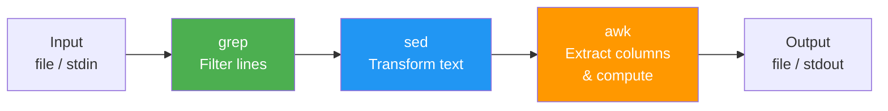

## 1.8.2 Sed and Awk Fundamentals: Stream Editing and Reporting

#### Why Sed and Awk Matter

While `grep` finds text, **sed** (stream editor) transforms it, and **awk** reports on it. Together, they form the core of text processing pipelines:

* **sed** – Non-interactive editing: search/replace, insert, delete, transform text streams

* **awk** – Pattern scanning and processing: extract columns, aggregate data, generate reports

For platform engineers, sed and awk are essential for:

* Log file parsing and transformation

* Configuration file manipulation (e.g., updating nginx.conf in scripts)

* Data extraction from command outputs


### Text Processing Pipeline



* One-liners that replace small scripts

***

## Part 1: Sed – Stream Editor

### Basic Sed Syntax

```bash
sed [options] 'command' [file...]
sed [options] -f script.sed [file...]
```

**Simple examples:**

```bash
# Replace first occurrence of "foo" with "bar" on each line
sed 's/foo/bar/' file.txt

# Replace all occurrences (global)
sed 's/foo/bar/g' file.txt

# Delete lines containing "pattern"
sed '/pattern/d' file.txt
```

### Sed Substitution Command (`s///`)

The most common sed operation: `s/pattern/replacement/flags`

| Flag     | Meaning                          | Example                           |
| -------- | -------------------------------- | --------------------------------- |
| `g`      | Global (all occurrences on line) | `sed 's/foo/bar/g'`               |
| `N`      | Replace Nth occurrence           | `sed 's/foo/bar/2'` (2nd on line) |
| `p`      | Print matched lines              | `sed -n 's/foo/bar/p'`            |
| `i`      | Case-insensitive (GNU sed)       | `sed 's/foo/bar/i'`               |
| `w file` | Write to file                    | `sed 's/foo/bar/w output.txt'`    |

```bash
# Replace only first occurrence on each line
sed 's/old/new/' file.txt

# Replace all occurrences
sed 's/old/new/g' file.txt

# Replace second occurrence only
sed 's/old/new/2' file.txt

# Case-insensitive replacement
sed 's/old/new/gI' file.txt
```

### Sed Addresses (Which Lines to Act On)

| Address                 | Meaning                | Example                   |
| ----------------------- | ---------------------- | ------------------------- |
| `3`                     | Line 3                 | `sed '3s/old/new/'`       |
| `5,10`                  | Lines 5-10             | `sed '5,10s/old/new/g'`   |
| `$`                     | Last line              | `sed '$s/old/new/'`       |
| `/pattern/`             | Lines matching pattern | `sed '/error/s/old/new/'` |
| `/pattern1/,/pattern2/` | Range between patterns | `sed '/start/,/end/d'`    |
| `1,/pattern/`           | Line 1 to first match  | `sed '1,/error/d'`        |

```bash
# Act only on line 5
sed '5s/foo/bar/'

# Act on lines 10-20
sed '10,20s/foo/bar/g'

# Act on lines containing "ERROR"
sed '/ERROR/s/foo/bar/'

# Delete from line containing "START" to line containing "END"
sed '/START/,/END/d'

# Replace from line 1 to first blank line
sed '1,/^$/s/old/new/'
```

### Sed Delete Command (`d`)

```bash
# Delete line 3
sed '3d' file.txt

# Delete lines 5-10
sed '5,10d' file.txt

# Delete empty lines
sed '/^$/d' file.txt

# Delete lines containing "debug"
sed '/debug/d' file.txt

# Delete last line
sed '$d' file.txt

# Delete lines NOT containing "error"
sed '/error/!d' file.txt
```

### Sed Print Command (`p` – Usually with `-n`)

```bash
# Print only lines matching "error" (suppress default output)
sed -n '/error/p' file.txt

# Print line 5 only
sed -n '5p' file.txt

# Print lines 10-20
sed -n '10,20p' file.txt

# Print first line of each file
sed -n '1p' *.txt
```

### Sed Insert, Append, Change

| Command | Meaning            | Example                     |
| ------- | ------------------ | --------------------------- |
| `i\`    | Insert before line | `sed '3i\New line'`         |
| `a\`    | Append after line  | `sed '3a\New line'`         |
| `c\`    | Change line        | `sed '3c\Replacement line'` |

```bash
# Insert before line 5
sed '5i\This line inserted before line 5' file.txt

# Append after line 5
sed '5a\This line appended after line 5' file.txt

# Change line 5
sed '5c\This line replaces line 5' file.txt

# Insert after line containing "pattern"
sed '/pattern/a\New line after match' file.txt
```

### Multiple Sed Commands

```bash
# Using -e
sed -e 's/old/new/g' -e '/debug/d' file.txt

# Using semicolon
sed 's/old/new/g; /debug/d' file.txt

# Using script file
cat > script.sed << EOF
s/old/new/g
/debug/d
EOF
sed -f script.sed file.txt
```

### Sed In-Place Editing (`-i`)

```bash
# Edit file in-place (GNU sed)
sed -i 's/old/new/g' file.txt

# Create backup before editing
sed -i.bak 's/old/new/g' file.txt

# In-place with multiple files
sed -i 's/old/new/g' *.conf
```

**Warning:** `-i` modifies original files. Always test without `-i` first.

### Practical Sed Examples

```bash
# 1. Replace all IP addresses with REDACTED
sed -E 's/[0-9]{1,3}\.[0-9]{1,3}\.[0-9]{1,3}\.[0-9]{1,3}/REDACTED/g' access.log

# 2. Remove trailing whitespace
sed 's/[[:space:]]*$//' file.txt

# 3. Remove leading whitespace
sed 's/^[[:space:]]*//' file.txt

# 4. Extract first column from /etc/passwd
sed 's/:.*//' /etc/passwd

# 5. Comment out lines containing "Listen" in nginx config
sed -i '/Listen/s/^/#/' /etc/nginx/nginx.conf

# 6. Uncomment lines containing "Listen"
sed -i '/Listen/s/^#//' /etc/nginx/nginx.conf

# 7. Print lines between START and END markers
sed -n '/START/,/END/p' file.txt

# 8. Remove HTML tags (simple)
sed 's/<[^>]*>//g' index.html

# 9. Convert DOS line endings to Unix
sed -i 's/\r$//' file.txt

# 10. Add line numbers (simple)
sed = file.txt | sed 'N;s/\n/\t/'
```

***

## Part 2: Awk – Pattern Scanning and Processing

Awk is a full programming language designed for text processing. It splits lines into fields and allows conditional actions.

### Basic Awk Syntax

```bash
awk 'pattern { action }' [file...]
awk 'BEGIN { initialization } pattern { action } END { cleanup }' file.txt
```

**Simple examples:**

```bash
# Print first column of /etc/passwd
awk -F: '{ print $1 }' /etc/passwd

# Print lines where column 3 > 1000
awk -F: '$3 > 1000 { print $1, $3 }' /etc/passwd

# Print line numbers
awk '{ print NR, $0 }' file.txt
```

### Awk Fields and Variables

| Variable      | Meaning                             | Example                            |
| ------------- | ----------------------------------- | ---------------------------------- |
| `$0`          | Entire line                         | `{ print $0 }`                     |
| `$1, $2, ...` | Individual fields                   | `{ print $1, $3 }`                 |
| `NF`          | Number of fields                    | `{ print NF }`                     |
| `NR`          | Current record (line) number        | `{ print NR, $0 }`                 |
| `FS`          | Field separator (default space/tab) | `BEGIN { FS=":" }`                 |
| `OFS`         | Output field separator              | `BEGIN { OFS="," }`                |
| `RS`          | Record separator (default newline)  | `BEGIN { RS="" }` (paragraph mode) |
| `ORS`         | Output record separator             | `BEGIN { ORS="\n\n" }`             |

### Field Separators

```bash
# Default whitespace
awk '{ print $1 }' file.txt

# Colon separator (passwd file)
awk -F: '{ print $1, $6 }' /etc/passwd

# Multiple separators (space, comma, colon)
awk -F'[ ,:]' '{ print $2 }' file.txt

# Using FS in BEGIN block
awk 'BEGIN { FS=":" } { print $1 }' /etc/passwd

# Tab separator
awk -F'\t' '{ print $1 }' file.tsv
```

### Awk Patterns

```bash
# Line 5 only
awk 'NR == 5' file.txt

# Lines 10-20
awk 'NR >= 10 && NR <= 20' file.txt

# Lines containing "error"
awk '/error/' file.txt

# Lines starting with #
awk '/^#/' file.txt

# Lines where field 2 > 100
awk '$2 > 100' file.txt

# Lines where field 1 equals "root"
awk '$1 == "root"' /etc/passwd

# Combine conditions
awk '$3 > 1000 && $1 != "nobody"' /etc/passwd

# BEGIN and END blocks
awk 'BEGIN { print "Start" } { print $1 } END { print "End" }' file.txt
```

### Awk Actions (Printing and Formatting)

```bash
# Print fields with custom separator
awk -F: '{ print $1 "," $3 }' /etc/passwd

# Print with formatting (printf)
awk -F: '{ printf "User: %-15s UID: %5d\n", $1, $3 }' /etc/passwd

# Print with header
awk 'BEGIN { print "Username UID" } { print $1, $3 }' /etc/passwd

# Suppress default print (use explicit print)
awk '/error/ { print NR, $0 }' log.txt
```

### Awk Calculations and Aggregations

```bash
# Sum of column 3
awk '{ sum += $3 } END { print "Total:", sum }' data.txt

# Average of column 3
awk '{ sum += $3; count++ } END { print "Average:", sum/count }' data.txt

# Count lines matching pattern
awk '/error/ { count++ } END { print "Errors:", count }' log.txt

# Maximum value in column 3
awk '$3 > max { max = $3 } END { print "Max:", max }' data.txt

# Sum by group (first column as key)
awk '{ sum[$1] += $2 } END { for (key in sum) print key, sum[key] }' data.txt
```

### Awk Built-in Functions

| Function              | Purpose                        | Example                                       |
| --------------------- | ------------------------------ | --------------------------------------------- |
| `length($0)`          | String length                  | `awk '{ print length($0) }'`                  |
| `tolower($1)`         | Convert to lowercase           | `awk '{ print tolower($1) }'`                 |
| `toupper($1)`         | Convert to uppercase           | `awk '{ print toupper($1) }'`                 |
| `substr($1, 2, 3)`    | Substring (start, length)      | `awk '{ print substr($1, 1, 5) }'`            |
| `split($0, arr, ":")` | Split into array               | `awk '{ split($0, arr, ":"); print arr[1] }'` |
| `sub(regex, repl)`    | Replace first match            | `awk '{ sub(/old/, "new"); print }'`          |
| `gsub(regex, repl)`   | Replace all matches (global)   | `awk '{ gsub(/old/, "new"); print }'`         |
| `match($0, regex)`    | Find position of regex match   | `awk '{ if (match($0, /[0-9]+/)) print RSTART, RLENGTH }'` |
| `int(x)`              | Integer                        | `awk '{ print int($1) }'`                     |
| `sprintf()`           | Format string                  | `awk '{ print sprintf("%05d", $1) }'`         |

**String manipulation examples:**

```bash
# Get string length of each line
awk '{ print NR, length($0) }' file.txt

# Convert to uppercase
awk '{ print toupper($0) }' file.txt

# Extract year from date (assuming YYYY-MM-DD)
awk '{ print substr($1, 1, 4) }' dates.txt

# Replace all occurrences of "error" with "ERROR" (global substitution)
awk '{ gsub(/error/, "ERROR"); print }' log.txt

# Remove brackets from a field
awk '{ gsub(/\[|\]/, "", $4); print $4 }' access.log

# Extract substring using match() and substr()
awk '{
    if (match($0, /[0-9]{4}-[0-9]{2}-[0-9]{2}/)) {
        date = substr($0, RSTART, RLENGTH)
        print date
    }
}' log.txt
```

### Practical Awk Examples

```bash
# 1. Extract usernames and UIDs from /etc/passwd
awk -F: '{ print $1 ":" $3 }' /etc/passwd

# 2. Find top 10 IP addresses in access log
awk '{ print $1 }' access.log | sort | uniq -c | sort -rn | head -10

# 3. Sum request sizes by IP address
awk '{ ip[$1] += $10 } END { for (i in ip) print i, ip[i] }' access.log

# 4. Calculate average response time from log
awk '{ sum += $11; count++ } END { print "Avg:", sum/count }' access.log

# 5. Print lines where field 2 is greater than field 3
awk '$2 > $3' data.txt

# 6. Convert CSV to aligned columns
awk -F, '{ printf "%-20s %10s\n", $1, $2 }' data.csv

# 7. Remove duplicate lines (preserve order)
awk '!seen[$0]++' file.txt

# 8. Print line numbers for non-empty lines
awk 'NF { print NR, $0 }' file.txt

# 9. Group and count by status code
awk '{ count[$9]++ } END { for (code in count) print code, count[code] }' access.log

# 10. Extract fields 2-4 from CSV
awk -F, '{ for (i=2; i<=4; i++) printf "%s ", $i; print "" }' data.csv
```

***

## Part 3: Combining Sed, Awk, and Grep in Pipelines

```bash
# 1. Extract error messages, replace IPs, count unique
grep "ERROR" app.log | sed 's/[0-9]\{1,3\}\.[0-9]\{1,3\}\.[0-9]\{1,3\}\.[0-9]\{1,3\}/REDACTED/g' | sort | uniq -c

# 2. Parse access log: filter by date, extract IP and status
grep "10/Jan/2024" access.log | awk '{ print $1, $9 }' | sort | uniq -c

# 3. Find large files, format with human sizes
find /var/log -type f -size +100M -exec ls -lh {} \; | awk '{ print $5, $9 }'

# 4. Clean CSV: remove quotes, convert to uppercase, extract column 2
sed 's/"//g' data.csv | awk -F, '{ print toupper($2) }'

# 5. Monitor log for errors and reformat
tail -f app.log | grep "ERROR" | sed 's/ERROR/!!! ERROR !!!/'
```

***

## Quick Task: Sed and Awk Practice

*Practice text transformation on system files (use copies!).*

1. Copy `/etc/passwd` to `/tmp/passwd.txt`. Replace all colons with commas using sed.
2. Extract the username (field 1) and shell (field 7) from `/tmp/passwd.txt` using awk.
3. Using sed, delete all lines containing "nologin" from `/tmp/passwd.txt`.
4. Using awk, print lines where UID (field 3) is between 1000 and 2000.
5. Using a single pipeline, find all error lines in `/var/log/syslog`, extract the timestamp and message, and output with line numbers.

> **Ready Solution:**
>
> ```bash
> # Task 1
> cp /etc/passwd /tmp/passwd.txt
> sed -i 's/:/,/g' /tmp/passwd.txt
>
> # Task 2
> awk -F, '{ print $1 ", " $7 }' /tmp/passwd.txt
>
> # Task 3
> sed -i '/nologin/d' /tmp/passwd.txt
>
> # Task 4
> awk -F, '$3 >= 1000 && $3 <= 2000' /tmp/passwd.txt
>
> # Task 5
> grep -i "error" /var/log/syslog | awk '{ print NR ": " $1 " " $2 " " $3 " -> " substr($0, index($0,$4)) }' | head -20
> ```

***

## Summary Table: Sed vs Awk

| Feature           | Sed                                  | Awk                                      |
| ----------------- | ------------------------------------ | ---------------------------------------- |
| Primary use       | Text substitution and transformation | Field extraction and reporting           |
| Programming       | Simple commands                      | Full language (loops, arrays, functions) |
| Field handling    | Basic (regex groups)                 | Built-in fields ($1, $2)                 |
| Arithmetic        | Limited                              | Full support                             |
| In-place editing  | Yes (`-i`)                           | No (use temp file)                       |
| Typical one-liner | `sed 's/old/new/g'`                  | `awk '{ print $1 }'`                     |

### Sed Command Quick Reference

| Command       | Meaning                |
| ------------- | ---------------------- |
| `s/old/new/g` | Substitute             |
| `d`           | Delete line            |
| `p`           | Print line (with `-n`) |
| `i\`          | Insert before          |
| `a\`          | Append after           |
| `c\`          | Change line            |
| `=`           | Print line number      |

### Awk Variables Quick Reference

| Variable   | Meaning                 |
| ---------- | ----------------------- |
| `$0`       | Entire line             |
| `$1`..`$N` | Fields                  |
| `NF`       | Number of fields        |
| `NR`       | Line number             |
| `FS`       | Field separator         |
| `OFS`      | Output field separator  |
| `RS`       | Record separator        |
| `ORS`      | Output record separator |

***

**Next note (1.8.3)** will cover **Vim and Nano Essentials** – command-line text editors for configuration files and quick edits.

---

## Backlinks

- [1.2.2_Permissions_and_Ownership.md](../Subchapter_1.2/1.2.2_Permissions_and_Ownership.md) – `sed -i` respects file permissions
- [1.8.1_Find_and_Grep.md](./1.8.1_Find_and_Grep.md) – `grep` is often piped into `sed` or `awk`; `find` is combined with `sed`/`awk` for batch processing
