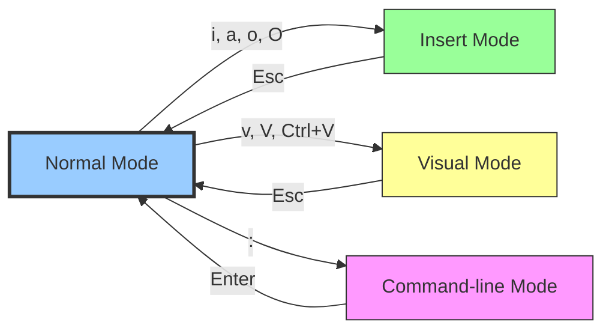

## 1.8.3 Vim and Nano Essentials: Command-Line Text Editors

#### Why Terminal Editors Matter

As a platform engineer, you will frequently edit configuration files on remote servers where no GUI is available. Two editors dominate this space:

* **Vim** – Powerful, modal editor with steep learning curve but unmatched efficiency once mastered. Available on virtually every Unix-like system.

* **Nano** – Simple, modeless editor ideal for beginners and quick edits. Default on many distributions.

Knowing both ensures you can always edit files, regardless of the environment.

***

## Part 1: Nano – The Simple Editor

### Philosophy

Nano is **modeless** – what you type appears directly in the document. Shortcuts are shown at the bottom of the screen. It's the least intimidating editor for beginners.

### Starting Nano

```bash
# Open file (creates if not exists)
nano file.txt

# Open with line number
nano +25 file.txt

# Open in read-only mode
nano -v file.txt

# Backup original file (file.txt~)
nano -B file.txt
```

### Nano Screen Layout

```
  GNU nano 7.2                    file.txt
                                  
This is line 1 of the file.       
This is line 2.                   
This is line 3.                   
                                  
                                  
                                  
                                  
  ^G Help   ^O Write Out  ^W Where Is  ^K Cut       ^T Execute   ^C Location
  ^X Exit   ^R Read File  ^\ Replace   ^U Paste     ^J Justify   ^/ Go To Line
```

* Top bar: Editor version and filename

* Middle: File content

* Bottom two lines: Shortcuts (`^` means `Ctrl` key)

### Essential Nano Shortcuts

| Shortcut                | Action             | Notes                                   |
| ----------------------- | ------------------ | --------------------------------------- |
| `Ctrl+X`                | Exit               | Prompts to save if changes exist        |
| `Ctrl+O`                | Save (Write Out)   | Asks for filename                       |
| `Ctrl+R`                | Read file          | Insert another file at cursor           |
| `Ctrl+W`                | Search             | Enter search term, `Alt+W` to repeat    |
| `Ctrl+\`                | Search and replace | Find and replace text                   |
| `Ctrl+K`                | Cut line           | Deletes current line (stores in buffer) |
| `Ctrl+U`                | Paste              | Pastes cut buffer                       |
| `Ctrl+J`                | Justify            | Reflow paragraph                        |
| `Ctrl+T`                | Check spelling     | If spell checker installed              |
| `Ctrl+C`                | Cursor position    | Shows line/column number                |
| `Ctrl+_` (Ctrl+Shift+-) | Go to line         | Enter line number                       |
| `Ctrl+G`                | Help               | Shows all shortcuts                     |
| `Alt+A`                 | Select text        | Set mark, then move cursor              |
| `Alt+6`                 | Copy text          | Copies marked text                      |
| `Ctrl+^`                | Set mark           | Start selecting text                    |
| `Alt+U`                 | Undo               | Undo last change                        |
| `Alt+E`                 | Redo               | Redo undone change                      |

### Basic Nano Workflow

```bash
# 1. Open file
nano /etc/nginx/nginx.conf

# 2. Navigate with arrow keys
# 3. Make changes (just type – no special mode)
# 4. Search for "listen": Ctrl+W, type "listen", Enter
# 5. Go to line 50: Ctrl+_, type "50", Enter
# 6. Save: Ctrl+O, Enter
# 7. Exit: Ctrl+X
```

### Nano Configuration (`~/.nanorc`)

```bash
# Example ~/.nanorc
set tabsize 4
set tabstospaces
set autoindent
set backup
set backupdir /tmp
set nowrap
set smooth
set mouse

# Syntax highlighting (install with package manager)
include /usr/share/nano/*.nanorc
```

***

## Part 2: Vim – The Professional's Editor

### Philosophy

Vim is **modal** – different modes for different actions:

* **Normal mode** – Navigate, delete, copy, paste (default after opening)

* **Insert mode** – Type text (enter with `i`, exit with `Esc`)

* **Visual mode** – Select text (enter with `v`, `V`, or `Ctrl+V`)

* **Command-line mode** – Run commands, search, replace (enter with `:`)

**Key insight:** In normal mode, letters are commands, not text. This allows efficient editing without reaching for mouse or arrow keys.

### Starting Vim

```bash
# Open file
vim file.txt

# Open at specific line
vim +25 file.txt

# Open with search term
vim +/error file.txt

# Open multiple files (split windows)
vim file1.txt file2.txt

# Open in read-only mode
vim -R file.txt

# Open with diff mode (compare two files)
vimdiff file1.txt file2.txt
```

### Vim Modes and Transitions



### Normal Mode – Navigation

**Character navigation:**

| Key | Action              |
| --- | ------------------- |
| `h` | Left one character  |
| `j` | Down one line       |
| `k` | Up one line         |
| `l` | Right one character |

**Word navigation:**

| Key  | Action                |
| ---- | --------------------- |
| `w`  | Next word (start)     |
| `b`  | Previous word (start) |
| `e`  | End of current word   |
| `ge` | End of previous word  |

**Line navigation:**

| Key  | Action                    |
| ---- | ------------------------- |
| `0`  | Beginning of line         |
| `^`  | First non-blank character |
| `$`  | End of line               |
| `g_` | Last non-blank character  |

**Screen navigation:**

| Key      | Action           |
| -------- | ---------------- |
| `H`      | Top of screen    |
| `M`      | Middle of screen |
| `L`      | Bottom of screen |
| `Ctrl+U` | Half-page up     |
| `Ctrl+D` | Half-page down   |
| `Ctrl+B` | Full page up     |
| `Ctrl+F` | Full page down   |

**File navigation:**

| Key           | Action                         |
| ------------- | ------------------------------ |
| `gg`          | First line of file             |
| `G`           | Last line of file              |
| `Ngg` or `NG` | Line N (e.g., `25gg` or `25G`) |
| `Ctrl+O`      | Jump back to previous position |
| `Ctrl+I`      | Jump forward                   |

### Normal Mode – Editing Commands

**Deleting (cutting):**

| Command | Action                        |
| ------- | ----------------------------- |
| `x`     | Delete character under cursor |
| `dw`    | Delete word                   |
| `dd`    | Delete line                   |
| `d$`    | Delete to end of line         |
| `d0`    | Delete to beginning of line   |
| `dG`    | Delete to end of file         |
| `dgg`   | Delete to beginning of file   |
| `Ndd`   | Delete N lines (e.g., `5dd`)  |

**Yanking (copying):**

| Command | Action                    |
| ------- | ------------------------- |
| `yw`    | Yank word                 |
| `yy`    | Yank line                 |
| `y$`    | Yank to end of line       |
| `y0`    | Yank to beginning of line |
| `yG`    | Yank to end of file       |
| `Nyy`   | Yank N lines              |

**Pasting:**

| Command | Action                              |
| ------- | ----------------------------------- |
| `p`     | Paste after cursor (or below line)  |
| `P`     | Paste before cursor (or above line) |

**Changing (delete and enter insert mode):**

| Command | Action                      |
| ------- | --------------------------- |
| `c`     | Change (delete + insert)    |
| `cw`    | Change word                 |
| `cc`    | Change line                 |
| `c$`    | Change to end of line       |
| `c0`    | Change to beginning of line |

**Undo/Redo:**

| Command  | Action                           |
| -------- | -------------------------------- |
| `u`      | Undo                             |
| `Ctrl+R` | Redo                             |
| `U`      | Undo all changes on current line |

### Insert Mode – Entering Text

**Enter insert mode from normal mode:**

| Key  | Action                        |
| ---- | ----------------------------- |
| `i`  | Insert before cursor          |
| `a`  | Append after cursor           |
| `I`  | Insert at beginning of line   |
| `A`  | Append at end of line         |
| `o`  | Open new line below           |
| `O`  | Open new line above           |
| `s`  | Delete character and insert   |
| `S`  | Delete line and insert        |
| `cc` | Change line (delete + insert) |

**Exit insert mode:** `Esc`

### Visual Mode – Selecting Text

| Key      | Action                |
| -------- | --------------------- |
| `v`      | Character-wise visual |
| `V`      | Line-wise visual      |
| `Ctrl+V` | Block-wise visual     |

**While in visual mode:**

* Navigate to extend selection

* `d` – Delete selected

* `y` – Yank (copy) selected

* `c` – Change selected

* `>` – Indent right

* `<` – Indent left

* `~` – Toggle case

* `u` – Lowercase

* `U` – Uppercase

### Command-Line Mode (`:`)

**Saving and quitting:**

| Command       | Action                      |
| ------------- | --------------------------- |
| `:w`          | Save                        |
| `:w file.txt` | Save as                     |
| `:q`          | Quit (fails if unsaved)     |
| `:q!`         | Quit without saving         |
| `:wq`         | Save and quit               |
| `:x`          | Save and quit (if changes)  |
| `ZZ`          | Save and quit (normal mode) |

**Searching:**

| Command         | Action                              |
| --------------- | ----------------------------------- |
| `/pattern`      | Search forward                      |
| `?pattern`      | Search backward                     |
| `n`             | Repeat search in same direction     |
| `N`             | Repeat search in opposite direction |
| `:set hlsearch` | Highlight matches                   |
| `:nohlsearch`   | Clear highlight                     |

**Search and replace:**

```vim
: s/old/new/         " Replace first occurrence on current line
: s/old/new/g        " Replace all on current line
: %s/old/new/g       " Replace all in file
: 5,10s/old/new/g    " Replace in lines 5-10
: %s/old/new/gc      " Confirm each replacement
: %s/old/new/gi      " Case-insensitive
```

**Line numbers:**

| Command               | Action                     |
| --------------------- | -------------------------- |
| `:set number`         | Show line numbers          |
| `:set nonumber`       | Hide line numbers          |
| `:set relativenumber` | Show relative line numbers |
| `:set nu rnu`         | Both absolute and relative |

**Buffer management (multiple files):**

| Command                 | Action                  |
| ----------------------- | ----------------------- |
| `:e file.txt`           | Open file in new buffer |
| `:bn`                   | Next buffer             |
| `:bp`                   | Previous buffer         |
| `:bd`                   | Delete buffer           |
| `:ls`                   | List buffers            |
| `:sp file.txt`          | Split horizontally      |
| `:vsp file.txt`         | Split vertically        |
| `Ctrl+W` then `h/j/k/l` | Move between splits     |
| `Ctrl+W` then `c`       | Close split             |

### Vim Configuration (`~/.vimrc`)

```vim
" Example ~/.vimrc for platform engineers

" Basic settings
set number              " Show line numbers
set relativenumber      " Relative line numbers
set tabstop=4           " Tab width
set shiftwidth=4        " Indent width
set expandtab           " Use spaces, not tabs
set autoindent          " Copy indent from previous line
set smartindent         " Smart autoindenting
set hlsearch            " Highlight search matches
set incsearch           " Search as you type
set ignorecase          " Case-insensitive search
set smartcase           " Override ignorecase if search has uppercase
set mouse=a             " Enable mouse support
set clipboard=unnamedplus " Use system clipboard

" Syntax highlighting
syntax on

" Show matching brackets
set showmatch

" Show command in status line
set showcmd

" Use 256 colors
set t_Co=256

" Status line
set laststatus=2
set statusline=%f\ %m\ %r\ %y\ Line:%l/%L\ Col:%c\ %p%%

" Shortcuts
map <F2> :w<CR>         " F2 saves
map <F3> :set number!<CR> " F3 toggles line numbers
map <F5> :set hlsearch!<CR> " F5 toggles search highlight

" Leader key mappings (default leader is \)
let mapleader=","
nnoremap <leader>w :w<CR>
nnoremap <leader>q :q<CR>
nnoremap <leader>e :e
```

### Practical Vim Workflows

**Workflow 1: Edit configuration file**

```vim
vim /etc/nginx/nginx.conf
/Listen                  " Search for Listen
n                        " Go to next match
i                        " Enter insert mode
http2 on;                " Add directive
Esc                      " Back to normal mode
:wq                      " Save and quit
```

**Workflow 2: Delete all lines containing "debug"**

```vim
:g/debug/d               " Global command: delete lines with 'debug'
```

**Workflow 3: Comment out lines 10-20**

```vim
:10,20s/^/# /           " Add '# ' at start of lines 10-20
```

**Workflow 4: Copy lines 5-10 and paste at end**

```vim
:5,10t$                 " Copy lines 5-10 to after last line
```

**Workflow 5: Sort lines alphabetically**

```vim
:1,$!sort               " Pipe lines 1-end through sort command
```

### Vim Advanced Tips

**Record and replay macros:**

```vim
qa                      " Start recording into register 'a'
(perform actions)
q                       " Stop recording
@a                      " Replay macro once
100@a                   " Replay 100 times
```

**Multiple files editing:**

```vim
:sp /etc/hosts          " Horizontal split
:vsp /etc/fstab         " Vertical split
Ctrl+w w                " Switch between splits
```

**Use external commands:**

```vim
:!ls -la                " Run shell command
:r!date                 " Insert date output
:1,$!sort               " Sort lines using external sort
```

***

## Part 3: Vim vs Nano – When to Use Which

| Scenario                           | Recommended Editor | Reason                           |
| ---------------------------------- | ------------------ | -------------------------------- |
| Quick single-line change           | Nano               | No mode confusion                |
| Editing large config files         | Vim                | Efficient navigation             |
| Remote server with minimal install | Nano               | Usually pre-installed            |
| Complex search/replace             | Vim                | Powerful regex support           |
| Editing multiple files             | Vim                | Buffers and splits               |
| Beginner first login               | Nano               | Intuitive shortcuts              |
| Daily driver for development       | Vim                | Efficiency after learning        |
| Copy/paste from terminal           | Nano               | Works like GUI editors           |
| Working with code                  | Vim                | Syntax highlighting, indentation |

***

## Quick Task: Editor Practice

*Practice both editors on a safe test file.*

**Nano task:**

1. Create `/tmp/nano_test.txt` with nano.
2. Type three lines of text.
3. Search for a word.
4. Cut a line with `Ctrl+K`.
5. Paste it with `Ctrl+U`.
6. Save and exit.

**Vim task:**

1. Open `/tmp/vim_test.txt` with vim.
2. Enter insert mode with `i`, type "Line 1", press `Esc`.
3. Create new line below with `o`, type "Line 2", `Esc`.
4. Move to line 1 with `gg`.
5. Yank line 1 with `yy`, paste below with `p`.
6. Search for "Line" with `/Line`.
7. Replace all "Line" with "Row": `:%s/Line/Row/g`.
8. Save and quit with `:wq`.

> **Ready Solution:**
>
> ```bash
> # Nano task
> nano /tmp/nano_test.txt
> # Type three lines
> # Ctrl+W, type search term, Enter
> # Move cursor to line to cut, Ctrl+K
> # Move cursor to paste location, Ctrl+U
> # Ctrl+O, Enter, Ctrl+X
>
> # Vim task
> vim /tmp/vim_test.txt
> # i, type "Line 1", Esc
> # o, type "Line 2", Esc
> # gg (go to line 1)
> # yy (yank line), p (paste below)
> # /Line, Enter (search)
> # :%s/Line/Row/g, Enter
> # :wq, Enter
>
> # Verify
> cat /tmp/vim_test.txt
> # Row 1
> # Row 2
> # Row 1
> ```

***

## Summary Table: Essential Vim Commands

### Normal Mode Navigation

| Command    | Action             |
| ---------- | ------------------ |
| `h/j/k/l`  | Left/Down/Up/Right |
| `w/b`      | Next/previous word |
| `0/$`      | Start/end of line  |
| `gg/G`     | First/last line    |
| `Ctrl+D/U` | Half-page down/up  |
| `Ctrl+F/B` | Full page down/up  |

### Normal Mode Editing

| Command  | Action              |
| -------- | ------------------- |
| `x`      | Delete character    |
| `dd`     | Delete line         |
| `yy`     | Yank line           |
| `p/P`    | Paste after/before  |
| `u`      | Undo                |
| `Ctrl+R` | Redo                |
| `.`      | Repeat last command |

### Entering Insert Mode

| Command | Action               |
| ------- | -------------------- |
| `i`     | Insert before cursor |
| `a`     | Append after cursor  |
| `I`     | Insert at line start |
| `A`     | Append at line end   |
| `o`     | New line below       |
| `O`     | New line above       |

### Command-Line Mode

| Command             | Action              |
| ------------------- | ------------------- |
| `:w`                | Save                |
| `:q`                | Quit                |
| `:wq` / `:x` / `ZZ` | Save and quit       |
| `:q!`               | Quit without saving |
| `:set nu`           | Show line numbers   |
| `:set hlsearch`     | Highlight search    |
| `:nohlsearch`       | Clear highlight     |
| `:%s/old/new/g`     | Replace all         |

### Vim vs Nano Quick Comparison

| Feature                    | Vim                            | Nano                                 |
| -------------------------- | ------------------------------ | ------------------------------------ |
| Modes                      | Modal (Normal, Insert, Visual) | Modeless                             |
| Learning curve             | Steep                          | Shallow                              |
| Efficiency (after mastery) | Very high                      | Moderate                             |
| Available everywhere       | Usually                        | Usually                              |
| Mouse support              | Yes (with `set mouse=a`)       | Yes                                  |
| Syntax highlighting        | Yes                            | Yes (with config)                    |
| Split windows              | Yes                            | No                                   |
| Macros                     | Yes                            | No                                   |
| Default on Debian/Ubuntu   | `vim-tiny` (limited)           | Yes                                  |
| Default on RHEL/Rocky      | `vi` (minimal)                 | No (install with `dnf install nano`) |

***

**Next note (1.8.4)** will be the Subchapter Review for Text Processing Utilities and Editors, including a comprehensive cheatsheet and scenario-based interview questions covering `find`, `grep`, `sed`, `awk`, `vim`, and `nano`.

---

## Backlinks

- [1.2.2_Permissions_and_Ownership.md](../Subchapter_1.2/1.2.2_Permissions_and_Ownership.md) – Editors respect file permissions; read-only files require `:w!` or `sudo`
- [1.8.1_Find_and_Grep.md](./1.8.1_Find_and_Grep.md) – Searching before editing
- [1.8.2_Sed_and_Awk_Fundamentals.md](./1.8.2_Sed_and_Awk_Fundamentals.md) – Automated editing vs manual editing with vim/nano
