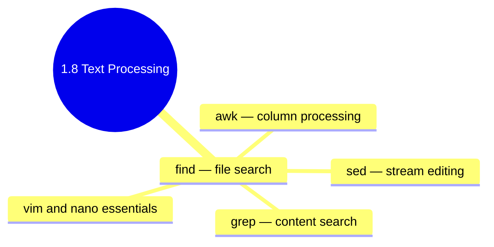

## 1.8.4 Subchapter Review: Cheatsheet and Interview Prep

This review covers only the material presented in Notes 1.8.1 (Find and Grep), 1.8.2 (Sed and Awk Fundamentals), and 1.8.3 (Vim and Nano Essentials). No forward referencing beyond what was explicitly introduced.




***

## Cheatsheet: Text Processing and Editors

### Find Command – File Searching

| Criteria          | Example                               | Meaning                        |
| ----------------- | ------------------------------------- | ------------------------------ |
| `-name "*.conf"`  | `find /etc -name "*.conf"`            | Filename pattern               |
| `-type f`         | `find . -type f`                      | Regular files only             |
| `-size +100M`     | `find /var -size +100M`               | Larger than 100MB              |
| `-mtime -7`       | `find /var/log -mtime -7`             | Modified in last 7 days        |
| `-mtime +30`      | `find /var/log -mtime +30`            | Modified more than 30 days ago |
| `-user alice`     | `find /home -user alice`              | Owned by user alice            |
| `-perm 644`       | `find . -perm 644`                    | Exact permissions              |
| `-perm -755`      | `find . -perm -755`                   | At least these permissions     |
| `-exec cmd {} \;` | `find . -name "*.log" -exec rm {} \;` | Execute command per file       |

### Grep – Content Searching

| Option                   | Purpose             | Example                             | <br />          |
| ------------------------ | ------------------- | ----------------------------------- | :-------------- |
| `-i`                     | Case-insensitive    | `grep -i "error" log.txt`           | <br />          |
| `-v`                     | Invert match        | `grep -v "^#" config.conf`          | <br />          |
| `-r` / `-R`              | Recursive           | `grep -r "Listen" /etc/nginx/`      | <br />          |
| `-l`                     | List filenames only | `grep -l "error" *.log`             | <br />          |
| `-n`                     | Line numbers        | `grep -n "error" log.txt`           | <br />          |
| `-c`                     | Count matches       | `grep -c "error" log.txt`           | <br />          |
| `-w`                     | Whole words         | `grep -w "root" /etc/passwd`        | <br />          |
| `-A N` / `-B N` / `-C N` | Context lines       | `grep -A 3 "error" log.txt`         | <br />          |
| `-E`                     | Extended regex      | \`grep -E "error                    | fail" log.txt\` |
| `-o`                     | Only matching part  | `grep -o "[0-9.]\+" log.txt`        | <br />          |
| `--color`                | Highlight matches   | `grep --color=auto "error" log.txt` | <br />          |

### Sed – Stream Editor

| Command       | Meaning                | Example                         |
| ------------- | ---------------------- | ------------------------------- |
| `s/old/new/g` | Substitute (global)    | `sed 's/foo/bar/g' file.txt`    |
| `d`           | Delete line            | `sed '/debug/d' file.txt`       |
| `p`           | Print line (with `-n`) | `sed -n '/error/p' file.txt`    |
| `i\`          | Insert before          | `sed '3i\New line'`             |
| `a\`          | Append after           | `sed '3a\New line'`             |
| `c\`          | Change line            | `sed '3c\Replacement'`          |
| `-i`          | In-place edit          | `sed -i 's/old/new/g' file.txt` |
| `-E`          | Extended regex         | `sed -E 's/[0-9]+/NUM/g'`       |

**Addresses:**

| Address         | Meaning                |
| --------------- | ---------------------- |
| `3`             | Line 3                 |
| `5,10`          | Lines 5-10             |
| `$`             | Last line              |
| `/pattern/`     | Lines matching pattern |
| `/start/,/end/` | Range between patterns |

### Awk – Reporting

| Variable    | Meaning          | Example             |
| ----------- | ---------------- | ------------------- |
| `$0`        | Entire line      | `{ print $0 }`      |
| `$1, $2...` | Fields           | `{ print $1, $3 }`  |
| `NF`        | Number of fields | `{ print NF }`      |
| `NR`        | Line number      | `{ print NR, $0 }`  |
| `FS`        | Field separator  | `BEGIN { FS=":" }`  |
| `OFS`       | Output separator | `BEGIN { OFS="," }` |

**Patterns:**

| Pattern                | Meaning                  |
| ---------------------- | ------------------------ |
| `NR == 5`              | Line 5 only              |
| `NR >= 10 && NR <= 20` | Lines 10-20              |
| `/error/`              | Lines containing "error" |
| `$3 > 1000`            | Field 3 > 1000           |
| `$1 == "root"`         | Field 1 equals "root"    |

**Common actions:**

```bash
# Sum column
awk '{ sum += $3 } END { print sum }'

# Average
awk '{ sum += $3; n++ } END { print sum/n }'

# Count by key
awk '{ count[$1]++ } END { for (k in count) print k, count[k] }'
```

### Vim – Essential Commands

**Normal Mode Navigation:**

| Command    | Action             |
| ---------- | ------------------ |
| `h/j/k/l`  | Left/Down/Up/Right |
| `w/b`      | Next/previous word |
| `0/$`      | Start/end of line  |
| `gg/G`     | First/last line    |
| `Ctrl+D/U` | Half-page down/up  |

**Normal Mode Editing:**

| Command  | Action              |
| -------- | ------------------- |
| `x`      | Delete character    |
| `dd`     | Delete line         |
| `yy`     | Yank (copy) line    |
| `p/P`    | Paste after/before  |
| `u`      | Undo                |
| `Ctrl+R` | Redo                |
| `.`      | Repeat last command |

**Entering Insert Mode:**

| Key   | Action               |
| ----- | -------------------- |
| `i`   | Insert before cursor |
| `a`   | Append after cursor  |
| `I`   | Insert at line start |
| `A`   | Append at line end   |
| `o/O` | New line below/above |

**Command-Line Mode (`:`):**

| Command             | Action              |
| ------------------- | ------------------- |
| `:w`                | Save                |
| `:q`                | Quit                |
| `:wq` / `:x` / `ZZ` | Save and quit       |
| `:q!`               | Quit without saving |
| `:%s/old/new/g`     | Replace all         |
| `:set nu`           | Show line numbers   |
| `:set hlsearch`     | Highlight search    |
| `/pattern`          | Search forward      |
| `n` / `N`           | Next/previous match |

### Nano – Essential Shortcuts

| Shortcut | Action             |
| -------- | ------------------ |
| `Ctrl+X` | Exit               |
| `Ctrl+O` | Save (Write Out)   |
| `Ctrl+W` | Search             |
| `Ctrl+\` | Search and replace |
| `Ctrl+K` | Cut line           |
| `Ctrl+U` | Paste              |
| `Ctrl+C` | Cursor position    |
| `Ctrl+_` | Go to line         |
| `Ctrl+G` | Help               |
| `Alt+U`  | Undo               |

***

## Comparison Tables

### Text Search Tools Comparison

| Tool   | Purpose                        | Best For                    |
| ------ | ------------------------------ | --------------------------- |
| `find` | Find files by name, size, time | Locating files              |
| `grep` | Find text inside files         | Pattern matching in content |
| `sed`  | Transform text                 | Search/replace in streams   |
| `awk`  | Extract and report             | Column/field processing     |

### Find vs Locate

| Feature          | `find`              | `locate`               |
| ---------------- | ------------------- | ---------------------- |
| Real-time        | Yes                 | No (uses database)     |
| Speed            | Slow on large trees | Very fast              |
| Up-to-date       | Always              | Requires `updatedb`    |
| Complex criteria | Yes                 | Limited                |
| Use case         | One-time searches   | Frequent name searches |

### Sed vs Awk

| Feature              | Sed               | Awk                 |
| -------------------- | ----------------- | ------------------- |
| Primary use          | Text substitution | Field extraction    |
| Programming          | Simple commands   | Full language       |
| Arithmetic           | Limited           | Full support        |
| Field handling       | Regex groups      | Built-in `$1`, `$2` |
| In-place editing     | Yes (`-i`)        | No                  |
| One-liner complexity | Simple            | Moderate            |

### Vim vs Nano

| Feature               | Vim                            | Nano                   |
| --------------------- | ------------------------------ | ---------------------- |
| Learning curve        | Steep                          | Shallow                |
| Modes                 | Modal (Normal, Insert, Visual) | Modeless               |
| Efficiency (mastered) | Very high                      | Moderate               |
| Split windows         | Yes                            | No                     |
| Macros                | Yes                            | No                     |
| Available by default  | `vi` (limited)                 | Usually                |
| Best for              | Daily editing, development     | Quick edits, beginners |

***

## Interview Questions (Scenario-Based)

These questions assume only knowledge from Subchapter 1.8. Answers reference only concepts from 1.8.1, 1.8.2, and 1.8.3.

### Question 1

**Scenario:** Your `/var/log` directory is filling up. You need to identify all log files larger than 100MB that haven't been modified in the last 30 days, then compress them with `gzip`.

**Question:** Write a single `find` command that does this. Explain each part.

**Answer:**

```bash
find /var/log -type f -name "*.log" -size +100M -mtime +30 -exec gzip {} \;
```

**Explanation of each part:**

| Component          | Meaning                                                          |
| ------------------ | ---------------------------------------------------------------- |
| `/var/log`         | Starting directory                                               |
| `-type f`          | Regular files only (not directories, symlinks)                   |
| `-name "*.log"`    | Only files ending in `.log`                                      |
| `-size +100M`      | Size greater than 100 Megabytes                                  |
| `-mtime +30`       | Modified more than 30 days ago                                   |
| `-exec gzip {} \;` | Execute `gzip` on each found file (`{}` is replaced by filename) |

**Safer version (dry-run first):**

```bash
# Preview files before compressing
find /var/log -type f -name "*.log" -size +100M -mtime +30 -ls

# Then compress
find /var/log -type f -name "*.log" -size +100M -mtime +30 -exec gzip -v {} \;
```

**Alternative using** **`-exec`** **with** **`+`** **(more efficient):**

```bash
# Groups multiple files into single gzip command
find /var/log -type f -name "*.log" -size +100M -mtime +30 -exec gzip {} +
```

**What if you also want to keep original files (copy instead of compress)?**

```bash
# Copy to archive directory instead of compressing in place
find /var/log -type f -name "*.log" -size +100M -mtime +30 -exec cp {} /archive/ \;
```

### Question 2

**Scenario:** An application writes logs in the format: `2024-01-15 10:30:45 ERROR Failed to connect to database`. You need to extract all ERROR lines from the last hour and output only the timestamp and message (without the word "ERROR").

**Question:** Write a pipeline using `grep`, `sed`, or `awk` to accomplish this. Provide at least two different solutions.

**Answer:**

**Solution 1: Using** **`grep`** **and** **`sed`**

```bash
grep "ERROR" app.log | sed 's/.*ERROR //'
```

**Solution 2: Using** **`awk`** **(more precise)**

```bash
awk '/ERROR/ { $3=""; print }' app.log
# Removes the 3rd field (ERROR) and prints the rest

# Better: preserve timestamp and everything after ERROR
awk '/ERROR/ { match($0, /[0-9]{4}-[0-9]{2}-[0-9]{2} [0-9]{2}:[0-9]{2}:[0-9]{2}/); timestamp = substr($0, RSTART, RLENGTH); msg = substr($0, index($0, "ERROR") + 6); print timestamp, msg }' app.log
```

**Solution 3: Only last hour (using date commands)**

```bash
# Get timestamp from 1 hour ago
ONE_HOUR_AGO=$(date -d "1 hour ago" "+%Y-%m-%d %H:%M:%S")

# Extract only lines after that time
awk -v cutoff="$ONE_HOUR_AGO" '/ERROR/ && $0 > cutoff { $3=""; print }' app.log
```

**Solution 4: Using** **`tail`** **and** **`grep`** **for recent entries (if log is appended)**

```bash
tail -n 10000 app.log | grep "ERROR" | sed 's/.*ERROR //'
```

**Most robust solution (handles variable timestamp format):**

```bash
awk '/ERROR/ {
    # Extract everything after the word "ERROR"
    msg = substr($0, index($0, "ERROR") + 6)
    # Print timestamp (first two fields) and message
    print $1, $2, msg
}' app.log | tail -100
```

### Question 3

**Scenario:** You need to update all `.conf` files in `/etc/myapp/` that contain the string "localhost" and replace it with "db.internal.example.com". You must create backups before modifying.

**Question:** Write a single `sed` command that does this recursively. What flag ensures backups are created? How would you test it first?

**Answer:**

**Complete command:**

```bash
sed -i.bak 's/localhost/db.internal.example.com/g' /etc/myapp/**/*.conf
```

**If** **`**`** **recursion not supported (use** **`find`):**

```bash
find /etc/myapp -name "*.conf" -type f -exec sed -i.bak 's/localhost/db.internal.example.com/g' {} \;
```

**Backup explanation:**

* `-i.bak` creates a backup of each file with `.bak` extension before editing

* Original file becomes `file.conf.bak`

* Modified file remains `file.conf`

**Testing first (dry-run without** **`-i`):**

```bash
# Test on a single file
sed 's/localhost/db.internal.example.com/g' /etc/myapp/test.conf

# Test on all files but don't modify
find /etc/myapp -name "*.conf" -type f -exec sed 's/localhost/db.internal.example.com/g' {} \; | less

# Use `--dry-run` with `-i` (GNU sed 4.4+)
sed -i.bak --dry-run 's/localhost/db.internal.example.com/g' /etc/myapp/test.conf
```

**Verify changes after execution:**

```bash
# Check which files were modified
find /etc/myapp -name "*.conf" -newer /etc/myapp -type f

# Verify no localhost remains
grep -r "localhost" /etc/myapp/ --include="*.conf"
```

**Rollback if needed:**

```bash
# Restore from backups
find /etc/myapp -name "*.conf.bak" -exec sh -c 'mv "$0" "${0%.bak}"' {} \;
```

### Question 4

**Scenario:** You are debugging an Nginx server. The access log format is:

```
192.168.1.100 - - [10/Jan/2024:13:45:22 +0000] "GET /api/users HTTP/1.1" 200 1234
```

**Question:** Using `awk`, extract:

1. The top 10 IP addresses by request count
2. The average response size per endpoint
3. The number of 404 errors per day

Provide the `awk` commands for each.

**Answer:**

**1. Top 10 IP addresses by request count:**

```bash
awk '{ count[$1]++ } END { for (ip in count) print count[ip], ip }' access.log | sort -rn | head -10
```

**Explanation:**

* `{ count[$1]++ }` – Increment counter for each unique IP (field 1)

* `END { for (ip in count) print count[ip], ip }` – Print counts after processing

* `sort -rn` – Sort reverse numeric (highest first)

* `head -10` – Top 10

**2. Average response size per endpoint:**

```bash
awk '{
    # Extract endpoint from request (field 7 is the path)
    split($7, path, "?")
    endpoint = path[1]
    sum[endpoint] += $10
    count[endpoint]++
}
END {
    for (e in sum)
        printf "%-30s %10.2f\n", e, sum[e]/count[e]
}' access.log | sort -k2 -rn | head -10
```

**Explanation:**

* `split($7, path, "?")` – Remove query parameters (split on `?`)

* `sum[endpoint] += $10` – Add response size (field 10) to sum for endpoint

* `count[endpoint]++` – Increment request count for endpoint

* `printf "%-30s %10.2f\n"` – Format output (30 chars left-aligned, 10 chars right-aligned with 2 decimals)

**3. Number of 404 errors per day:**

```bash
awk '$9 == 404 {
    # Extract date from field 4 (remove brackets)
    gsub(/\[|\]/, "", $4)
    split($4, datetime, ":")
    day = datetime[1]
    errors[day]++
}
END {
    for (d in errors)
        print d, errors[d]
}' access.log | sort
```

**Alternative with date extraction using match:**

```bash
awk '$9 == 404 {
    match($4, /[0-9]{2}\/[A-Za-z]{3}\/[0-9]{4}/)
    day = substr($4, RSTART, RLENGTH)
    errors[day]++
}
END {
    for (d in errors)
        print d, errors[d]
}' access.log | sort -k2 -rn
```

**Complete combined analysis script:**

```bash
awk '
{
    # IP count
    ip[$1]++
    
    # Endpoint stats
    split($7, path, "?")
    endpoint = path[1]
    size_sum[endpoint] += $10
    size_count[endpoint]++
    
    # 404 by day
    if ($9 == 404) {
        match($4, /[0-9]{2}\/[A-Za-z]{3}\/[0-9]{4}/)
        day = substr($4, RSTART, RLENGTH)
        errors[day]++
    }
}
END {
    print "=== Top 10 IPs ==="
    for (i in ip) print ip[i], i | "sort -rn | head -10"
    close("sort -rn | head -10")
    
    print "\n=== Average Response Size by Endpoint ==="
    for (e in size_sum)
        printf "%-40s %10.2f\n", e, size_sum[e]/size_count[e] | "sort -k2 -rn | head -10"
    close("sort -k2 -rn | head -10")
    
    print "\n=== 404 Errors by Day ==="
    for (d in errors) print d, errors[d] | "sort"
    close("sort")
}' access.log
```

### Question 5

**Scenario:** You are SSH'd into a production server that has only `vi` (not Vim) and no other editors. You need to make the following changes to `/etc/nginx/nginx.conf`:

1. Uncomment line 25 (remove `#` at start)
2. Change all occurrences of `80` to `8080` in lines containing `listen`
3. Delete the last 5 lines of the file

**Question:** Provide the `vi` commands to accomplish each task. Explain the difference between `vi` and `vim` in this context.

**Answer:**

**vi commands (works on minimal** **`vi`** **and full** **`vim`):**

**Task 1: Uncomment line 25**

```
:25
i
(delete the # character)
Esc
:wq
```

Or more efficiently:

```
:25s/^#//
```

**Task 2: Change** **`80`** **to** **`8080`** **in lines containing** **`listen`**

```
:g/listen/s/80/8080/g
```

**Task 3: Delete the last 5 lines**

```
:$
5dd
```

Or using line numbers:

```
:$-4,$d
```

**Complete session:**

```bash
vi /etc/nginx/nginx.conf

# In vi:
:25s/^#//          # Uncomment line 25
:g/listen/s/80/8080/g  # Replace 80 with 8080 in lines with "listen"
:$                 # Go to last line
5dd                # Delete 5 lines
:wq                # Save and quit
```

**vi vs vim differences:**

| Feature                      | vi (original)       | vim (Vi IMproved)          |
| ---------------------------- | ------------------- | -------------------------- |
| Syntax highlighting          | No                  | Yes                        |
| Multiple undo                | No (only one level) | Yes (unlimited)            |
| Visual mode                  | No                  | Yes (`v`, `V`, `Ctrl+V`)   |
| Split windows                | No                  | Yes (`:sp`, `:vsp`)        |
| Mouse support                | No                  | Yes (`set mouse=a`)        |
| Command history              | No                  | Yes                        |
| Search highlighting          | No                  | Yes (`:set hlsearch`)      |
| Available on minimal systems | Yes (busybox vi)    | No (requires installation) |

**What to do if** **`vi`** **is extremely minimal (busybox vi):**

* Use `sed` instead (often available)

```bash
# Same tasks with sed
sed -i '25s/^#//' /etc/nginx/nginx.conf
sed -i '/listen/s/80/8080/g' /etc/nginx/nginx.conf
sed -i '$d' /etc/nginx/nginx.conf   # Delete last line (repeat 5 times)
# Or
head -n -5 /etc/nginx/nginx.conf > /tmp/nginx.conf && mv /tmp/nginx.conf /etc/nginx/nginx.conf
```

**Verification after changes:**

```bash
# Test nginx configuration
nginx -t

# If successful, reload
systemctl reload nginx
```

***

## Topics Covered in This Subchapter (Self-Check)

| Topic                                                                 | Found in Note |
| --------------------------------------------------------------------- | ------------- |
| `find` by name, type, size, time, permission, owner                   | 1.8.1         |
| `find -exec` and `-delete` actions                                    | 1.8.1         |
| `grep` basic and extended regex                                       | 1.8.1         |
| `grep` options (`-i`, `-v`, `-r`, `-l`, `-n`, `-c`, `-A`, `-B`, `-C`) | 1.8.1         |
| Combining `find` and `grep` with xargs                                | 1.8.1         |
| `sed` substitution (`s///`) with flags (`g`, `N`, `p`, `i`)           | 1.8.2         |
| `sed` addresses (line numbers, patterns, ranges)                      | 1.8.2         |
| `sed` delete (`d`), print (`p`), insert/append/change (`i`, `a`, `c`) | 1.8.2         |
| `sed` in-place editing (`-i`)                                         | 1.8.2         |
| `awk` fields (`$1`, `$2`, `$NF`, `$0`)                                | 1.8.2         |
| `awk` variables (`NR`, `NF`, `FS`, `OFS`, `RS`, `ORS`)                | 1.8.2         |
| `awk` patterns and actions                                            | 1.8.2         |
| `awk` calculations (sum, average, count)                              | 1.8.2         |
| `awk` arrays for grouping                                             | 1.8.2         |
| `awk` string functions (`gsub`, `sub`, `match`, `substr`, `split`)    | 1.8.2         |
| Vim modes (Normal, Insert, Visual, Command-line)                      | 1.8.3         |
| Vim navigation (`h/j/k/l`, `w/b`, `0/$`, `gg/G`, `Ctrl+D/U`)          | 1.8.3         |
| Vim editing (`x`, `dd`, `yy`, `p`, `u`, `.`)                          | 1.8.3         |
| Vim search and replace (`/`, `:s`, `:%s`)                             | 1.8.3         |
| Vim saving and quitting (`:w`, `:q`, `:wq`, `:q!`)                    | 1.8.3         |
| Vim configuration (`~/.vimrc`)                                        | 1.8.3         |
| Nano shortcuts                                                        | 1.8.3         |
| vi vs vim differences                                                 | 1.8.3         |

## Quick Command and Concept Reference

| Concept | Taught In | Notes |
|---------|-----------|-------|
| `xargs` | [1.8.1](./1.8.1_Find_and_Grep.md) Part 3 | Used with `find -print0` for safe filename handling |
| `gsub()` | [1.8.2](./1.8.2_Sed_and_Awk_Fundamentals.md) Built-in Functions | Awk global substitution function |
| `match()` / `substr()` | [1.8.2](./1.8.2_Sed_and_Awk_Fundamentals.md) Built-in Functions | Awk regex matching and substring extraction |
| `split()` | [1.8.2](./1.8.2_Sed_and_Awk_Fundamentals.md) Built-in Functions | Awk function to split string into array |

**Scenario-level references (not separately taught):**

| Concept | Context |
|---------|---------|
| `sort -rn` | General Linux utility for numeric reverse sorting |
| `uniq -c` | General Linux utility to count duplicate lines |
| Busybox vi | Minimal vi on embedded systems (Q5 context) |
| `head -n -5` | General utility to output all but last N lines |

---

## Backlinks

- [1.7.4_Subchapter_Review.md](../Subchapter_1.7/1.7.4_Subchapter_Review.md) – Previous subchapter review
- [1.9.1_Terminal_Multiplexers.md](../Subchapter_1.9/1.9.1_Terminal_Multiplexers.md) – Next subchapter

---

**End of Subchapter 1.8 Review**
