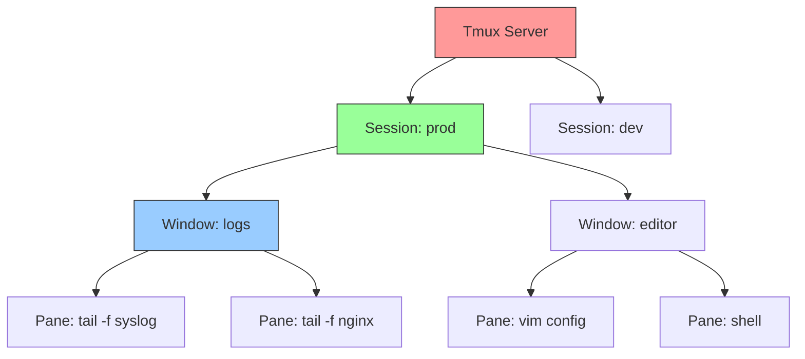

## 1.9.1 Screen and Tmux: Terminal Multiplexers

#### Why Terminal Multiplexers Matter

As a platform engineer, you frequently:

* Run long-running tasks (database migrations, large backups) that must survive network disconnects

* Need to view multiple terminals simultaneously (logs, monitoring, command line)

* Work on remote servers where GUI is unavailable

**Terminal multiplexers** solve these problems by allowing you to create, detach, and reattach to terminal sessions. Two dominant tools exist:

* **Screen** – Older, simpler, available on virtually all Unix systems

* **Tmux** – Modern, more features, better window/session management

Knowing both ensures you can always recover a lost session.

***

## Part 1: Screen – The Classic Multiplexer

### Philosophy

Screen creates a single session with multiple **windows** (like tabs). You can detach from the session (leaving it running) and reattach later from any terminal.

### Starting Screen

```bash
# Start a new named session
screen -S mysession

# Start without naming (defaults to PID.session)
screen

# Start with command (runs command, exits when command finishes)
screen -S backup -d -m /usr/local/bin/backup.sh
# -d -m = detached mode (starts but doesn't attach)
```

### Screen Session Management

```bash
# List all active screen sessions
screen -ls
# Output:
# There are screens on:
#     12345.mysession   (Detached)
#     12346.other       (Attached)
# 2 Sockets in /var/run/screen/S-alice.

# Reattach to a session
screen -r mysession        # By name
screen -r 12345           # By PID
screen -r                 # Reattach to only detached session

# Reattach to attached session (force)
screen -d -r mysession    # Detaches remote and attaches here

# Kill a session
screen -X -S mysession quit
```

### Screen Inside a Session – Key Bindings

All screen commands start with `Ctrl+A` (called the **escape sequence**).

| Command        | Action                               | <br />                  |
| -------------- | ------------------------------------ | :---------------------- |
| `Ctrl+A` `?`   | Help (list all commands)             | <br />                  |
| `Ctrl+A` `c`   | Create new window                    | <br />                  |
| `Ctrl+A` `n`   | Next window                          | <br />                  |
| `Ctrl+A` `p`   | Previous window                      | <br />                  |
| `Ctrl+A` `0-9` | Switch to window number              | <br />                  |
| `Ctrl+A` `"`   | List windows (interactive selection) | <br />                  |
| `Ctrl+A` `A`   | Rename current window                | <br />                  |
| `Ctrl+A` `d`   | Detach from session (leave running)  | <br />                  |
| `Ctrl+A` `k`   | Kill current window                  | <br />                  |
| `Ctrl+A` `\`   | Kill all windows (quit screen)       | <br />                  |
| `Ctrl+A` `S`   | Split screen horizontally            | <br />                  |
| `Ctrl+A` \`    | \`                                   | Split screen vertically |
| `Ctrl+A` `Tab` | Move between split regions           | <br />                  |
| `Ctrl+A` `Q`   | Remove all splits                    | <br />                  |
| `Ctrl+A` `X`   | Lock session (password protect)      | <br />                  |
| `Ctrl+A` `[`   | Enter copy mode (scrollback)         | <br />                  |
| `Ctrl+A` `]`   | Paste from buffer                    | <br />                  |

### Screen Scrollback (Copy Mode)

```bash
# Enter copy mode
Ctrl+A [

# Navigate:
# - Arrow keys or h/j/k/l to move
# - Space to start selection
# - Space again to end selection (copies to buffer)
# - Ctrl+A ] to paste
```

### Screen Logging

```bash
# Start logging to screenlog.0
Ctrl+A H

# Log file location
ls -la screenlog.*
```

### Practical Screen Workflows

**Workflow 1: Run long backup overnight**

```bash
# On remote server
screen -S backup
./long_backup.sh
Ctrl+A d   # Detach, go home

# Next morning, reconnect
screen -r backup
# Backup completed, exit with exit command
```

**Workflow 2: Monitor logs in multiple windows**

```bash
screen -S monitoring
Ctrl+A c   # Window 0: system logs
tail -f /var/log/syslog
Ctrl+A c   # Window 1: nginx logs
tail -f /var/log/nginx/access.log
Ctrl+A c   # Window 2: application logs
tail -f /var/log/myapp/app.log
Ctrl+A 0   # Switch to window 0
```

**Workflow 3: Multi-server commands (broadcast mode)**

```bash
# Create windows for each server
screen -S deploy
ssh server1
Ctrl+A c
ssh server2
Ctrl+A c
ssh server3

# Enter broadcast mode (send same keystrokes to all windows)
Ctrl+A : at "#" stuff "systemctl restart nginx^M"
# Or
Ctrl+A : at "#" readreg .  # Send from register
```

***

## Part 2: Tmux – Modern Terminal Multiplexer

### Philosophy

Tmux (Terminal Multiplexer) is more powerful than screen, with:

* **Session** – Collection of windows (like screen)

* **Window** – Collection of panes (like tabs)

* **Pane** – Individual terminal within a window



### Starting Tmux

```bash
# Start new session (default name)
tmux

# Start new named session
tmux new -s mysession

# Start with specific command
tmux new -s backup -d '/usr/local/bin/backup.sh'

# Start with custom window name
tmux new -s dev -n editor
```

### Tmux Session Management

```bash
# List sessions
tmux ls
# mysession: 2 windows (created Tue Jan 16 10:00:00) (attached)
# dev: 1 windows (created Tue Jan 16 10:05:00)

# Attach to session
tmux attach -t mysession
tmux a -t mysession    # Short form

# Detach from session (inside tmux)
Ctrl+B d

# Kill session
tmux kill-session -t mysession

# Rename session
tmux rename-session -t mysession newname
```

### Tmux Inside a Session – Key Bindings

Tmux prefix is `Ctrl+B` (by default).

**Window management:**

| Command        | Action                       |
| -------------- | ---------------------------- |
| `Ctrl+B` `c`   | Create new window            |
| `Ctrl+B` `n`   | Next window                  |
| `Ctrl+B` `p`   | Previous window              |
| `Ctrl+B` `0-9` | Switch to window number      |
| `Ctrl+B` `w`   | List windows (interactive)   |
| `Ctrl+B` `,`   | Rename current window        |
| `Ctrl+B` `&`   | Kill current window          |
| `Ctrl+B` `f`   | Find window (search by name) |

**Pane management:**

| Command               | Action                           |
| --------------------- | -------------------------------- |
| `Ctrl+B` `%`          | Split vertically (left/right)    |
| `Ctrl+B` `"`          | Split horizontally (top/bottom)  |
| `Ctrl+B` `arrow keys` | Move between panes               |
| `Ctrl+B` `o`          | Cycle through panes              |
| `Ctrl+B` `x`          | Kill current pane                |
| `Ctrl+B` `z`          | Zoom pane (full screen) / unzoom |
| `Ctrl+B` `space`      | Cycle through pane layouts       |
| `Ctrl+B` `{`          | Move pane left                   |
| `Ctrl+B` `}`          | Move pane right                  |
| `Ctrl+B` `Ctrl+arrow` | Resize pane (1 cell)             |
| `Ctrl+B` `Alt+arrow`  | Resize pane (5 cells)            |

**Copy mode (scrollback):**

| Command      | Action             |
| ------------ | ------------------ |
| `Ctrl+B` `[` | Enter copy mode    |
| `Space`      | Start selection    |
| `Enter`      | Copy selection     |
| `Ctrl+B` `]` | Paste buffer       |
| `Ctrl+B` `=` | List paste buffers |

**Session management:**

| Command      | Action                      |
| ------------ | --------------------------- |
| `Ctrl+B` `d` | Detach session              |
| `Ctrl+B` `$` | Rename session              |
| `Ctrl+B` `s` | List sessions (interactive) |
| `Ctrl+B` `(` | Previous session            |
| `Ctrl+B` `)` | Next session                |

**Other useful bindings:**

| Command      | Action                     |
| ------------ | -------------------------- |
| `Ctrl+B` `?` | Help (list all bindings)   |
| `Ctrl+B` `t` | Show clock (time)          |
| `Ctrl+B` `!` | Break pane into new window |
| `Ctrl+B` `:` | Enter command mode         |
| `Ctrl+B` `,` | Rename window              |
| `Ctrl+B` `&` | Kill window                |

### Tmux Command Mode (`Ctrl+B` `:`)

```bash
# Show current pane title
:display-message '#P'

# Set pane title
:select-pane -T "my title"

# Resize pane by specific amount
:resize-pane -D 10
:resize-pane -R 20

# Swap panes
:swap-pane -U     # Up
:swap-pane -D     # Down

# Join pane from another window
:join-pane -t 2 -s 1    # Join pane from window 1 into window 2
```

### Tmux Configuration (`~/.tmux.conf`)

```bash
# Example ~/.tmux.conf for platform engineers

# Set prefix to Ctrl+A (like screen) – uncomment to match screen
# set-option -g prefix C-a
# unbind-key C-b
# bind-key C-a send-prefix

# Start windows and panes at 1 (not 0)
set-option -g base-index 1
set-window-option -g pane-base-index 1

# Mouse support (scroll, resize, select)
set-option -g mouse on

# Faster key repetition
set-option -s escape-time 0

# History limit (10000 lines)
set-option -g history-limit 10000

# Status bar customization
set-option -g status-position top
set-option -g status-left "[#S] "
set-option -g status-right "%Y-%m-%d %H:%M"

# Reload config without restarting
bind-key r source-file ~/.tmux.conf \; display-message "Config reloaded"

# Split panes with | and -
bind-key | split-window -h
bind-key - split-window -v

# Easy resize (Shift+arrow)
bind-key -n S-Left resize-pane -L 5
bind-key -n S-Right resize-pane -R 5
bind-key -n S-Up resize-pane -U 5
bind-key -n S-Down resize-pane -D 5

# Copy mode with vi keys (if you prefer)
set-window-option -g mode-keys vi

# Enable activity monitoring
set-window-option -g monitor-activity on
set-option -g visual-activity on
```

### Tmux Scripting (Automated Layouts)

```bash
#!/bin/bash
# start-dev-session.sh – Creates a development session

SESSION="dev"

# Create new session (detached) with window 1 named 'editor'
tmux new-session -d -s $SESSION -n editor

# Create window 2 for logs
tmux new-window -t $SESSION -n logs

# Create window 3 for monitoring
tmux new-window -t $SESSION -n monitor

# Split logs window into three panes
tmux select-window -t $SESSION:logs
tmux split-window -h
tmux split-window -v
tmux select-pane -t 0
tmux split-window -v

# Send commands to each pane
tmux send-keys -t $SESSION:logs.0 'tail -f /var/log/syslog' C-m
tmux send-keys -t $SESSION:logs.1 'htop' C-m
tmux send-keys -t $SESSION:logs.2 'journalctl -f' C-m
tmux send-keys -t $SESSION:logs.3 'ping google.com' C-m

# Attach to session
tmux attach -t $SESSION
```

### Practical Tmux Workflows

**Workflow 1: Three-pane debugging layout**

```bash
tmux new -s debug
# Create three panes:
Ctrl+B "          # Split horizontal (top/bottom)
Ctrl+B %          # Split top pane vertical
# Now have: top-left, top-right, bottom
# Top-left: tail logs
# Top-right: grep filtered logs
# Bottom: command line
```

**Workflow 2: Pair programming (shared session)**

```bash
# User 1 creates session
tmux new -s pair -S /tmp/pair-socket

# User 2 attaches (same user or same group with socket perms)
tmux attach -t pair
# Both users see same terminal, type simultaneously
```

**Workflow 3: Save and restore sessions (Tmux Resurrect plugin)**

```bash
# Install TPM (Tmux Plugin Manager)
git clone https://github.com/tmux-plugins/tpm ~/.tmux/plugins/tpm

# Add to ~/.tmux.conf
echo 'set -g @plugin "tmux-plugins/tpm"' >> ~/.tmux.conf
echo 'set -g @plugin "tmux-plugins/tmux-resurrect"' >> ~/.tmux.conf
echo 'run-shell ~/.tmux/plugins/tpm/tpm' >> ~/.tmux.conf

# Reload and install
tmux source ~/.tmux.conf
Ctrl+B I   # Install plugins

# Save session (inside tmux)
Ctrl+B Ctrl+S

# Restore session
Ctrl+B Ctrl+R
```

***

## Part 3: Screen vs Tmux – Comparison

| Feature                  | Screen                | Tmux                         | <br />           |
| ------------------------ | --------------------- | ---------------------------- | :--------------- |
| Default prefix           | `Ctrl+A`              | `Ctrl+B`                     | <br />           |
| Split panes (vertical)   | Yes (\`Ctrl+A         | \`)                          | Yes (`Ctrl+B %`) |
| Split panes (horizontal) | Yes (`Ctrl+A S`)      | Yes (`Ctrl+B "`)             | <br />           |
| Pane resizing            | Limited               | Yes (with configuration)     | <br />           |
| Session naming           | Yes                   | Yes                          | <br />           |
| Customizable status bar  | Limited               | Extensive                    | <br />           |
| Scriptable layouts       | No (via config file)  | Yes (via tmux commands)      | <br />           |
| Mouse support            | Limited               | Yes (`set -g mouse on`)      | <br />           |
| Clipboard integration    | Basic                 | Better (with OS integration) | <br />           |
| Available by default     | Usually               | Often (install if missing)   | <br />           |
| Learning curve           | Lower                 | Moderate                     | <br />           |
| Active development       | Minimal (maintenance) | Active                       | <br />           |

### When to Use Which

| Scenario                              | Recommended                  |
| ------------------------------------- | ---------------------------- |
| Minimal system (rescue mode, busybox) | Screen (always available)    |
| Daily driver for development          | Tmux                         |
| Need to share session with others     | Tmux (better socket control) |
| Scripted layouts                      | Tmux                         |
| Quick one-off detach                  | Either (screen simpler)      |
| Custom key bindings                   | Tmux (more flexible)         |
| Working on embedded systems           | Screen (smaller footprint)   |

***

## Quick Task: Screen and Tmux Practice

*Practice both multiplexers on your system.*

**Screen tasks:**

1. Start a named screen session `practice`.
2. Create 3 windows (0, 1, 2).
3. In window 0, run `top`. In window 1, run `htop` (if installed). In window 2, run `date`.
4. Detach and reattach.
5. Kill the session.

**Tmux tasks:**

1. Start a new tmux session named `dev`.
2. Split vertically (`Ctrl+B %`), then split the right pane horizontally (`Ctrl+B "`).
3. In the three panes, run: `top`, `tail -f /var/log/syslog`, `watch -n 1 date`.
4. Detach with `Ctrl+B d` and reattach.
5. Zoom the top pane (`Ctrl+B z`), then unzoom.
6. Kill the session.

> **Ready Solution:**
>
> ```bash
> # Screen tasks
> screen -S practice
> # Inside screen:
> Ctrl+A c        # window 1
> Ctrl+A c        # window 2
> Ctrl+A 0        # window 0
> top
> Ctrl+A 1        # window 1
> htop
> Ctrl+A 2        # window 2
> date
> Ctrl+A d        # detach
> screen -ls      # list sessions
> screen -r practice  # reattach
> Ctrl+A \        # kill all windows (exit screen)
>
> # Tmux tasks
> tmux new -s dev
> # Inside tmux:
> Ctrl+B %        # vertical split
> Ctrl+B "        # horizontal split (in right pane)
> # Navigate to panes with Ctrl+B arrow keys
> # Pane 0: top
> # Pane 1: tail -f /var/log/syslog
> # Pane 2: watch -n 1 date
> Ctrl+B d        # detach
> tmux ls         # list sessions
> tmux attach -t dev  # reattach
> Ctrl+B z        # zoom top pane
> Ctrl+B z        # unzoom
> Ctrl+B &        # kill session (type 'y' to confirm)
> ```

***

## Summary Table: Screen vs Tmux Commands

| Operation         | Screen           | Tmux                  |
| ----------------- | ---------------- | --------------------- |
| New session       | `screen -S name` | `tmux new -s name`    |
| List sessions     | `screen -ls`     | `tmux ls`             |
| Attach to session | `screen -r name` | `tmux attach -t name` |
| Detach            | `Ctrl+A d`       | `Ctrl+B d`            |
| New window        | `Ctrl+A c`       | `Ctrl+B c`            |
| Next/prev window  | `Ctrl+A n` / `p` | `Ctrl+B n` / `p`      |
| Split vertical    | `Ctrl+A \|`      | `Ctrl+B %`            |
| Split horizontal  | `Ctrl+A S`       | `Ctrl+B "`            |
| Kill window       | `Ctrl+A k`       | `Ctrl+B &`            |
| Help              | `Ctrl+A ?`       | `Ctrl+B ?`            |
| Copy mode         | `Ctrl+A [`       | `Ctrl+B [`            |

***

**Next note (1.9.2)** will cover **Lsof and Sysdig Basics** – listing open files, finding processes using ports, and recovering deleted files.

---

## Backlinks

- [1.6.1 Process Management](../Subchapter_1.6/1.6.1_Process_Management_and_Job_Control.md) – Multiplexers run as processes; you can `kill` detached sessions
- [1.4.1 SSH Fundamentals](../Subchapter_1.4/1.4.1_SSH_Fundamentals_and_Key_Authentication.md) – Multiplexers are essential for remote work to survive disconnects
