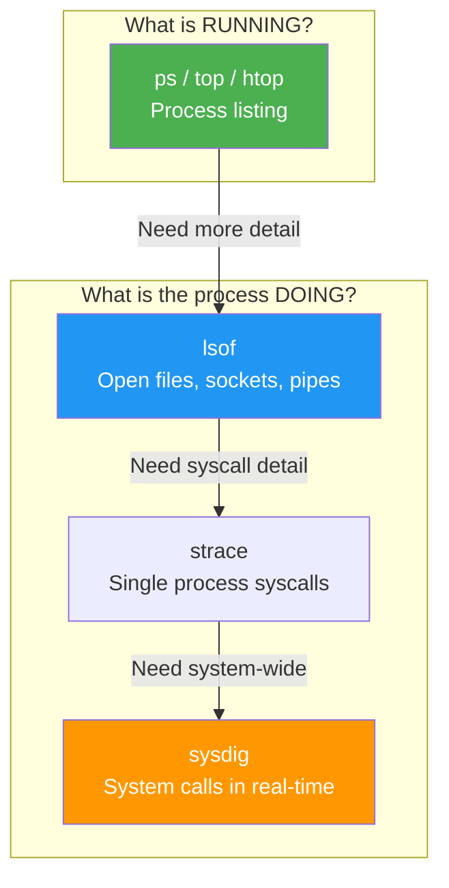

## 1.9.2 Lsof and Sysdig Basics: Deep System Introspection

#### Why These Tools Matter

Standard process monitoring (`ps`, `top`) shows you what is running. **Lsof** and **Sysdig** show you what those processes are doing:

* **Lsof** – List Open Files. Shows every file, socket, pipe, and device a process has open. Essential for:

  * Finding which process is using a specific port (`lsof -i :80`)

  * Identifying why a filesystem won't unmount (`lsof /mnt/data`)

  * Recovering deleted files that are still held open

  * Debugging "file is busy" errors


### System Introspection Tools



* **Sysdig** – System-level debugging. Captures system calls and events. Think of it as `strace` for the entire system, or `tcpdump` for system calls.

**Note:** This note covers `lsof` in depth and introduces `sysdig` basics. `strace` (mentioned briefly) is covered more thoroughly in Module 3 (Bash Scripting) as a debugging tool.

***

## Part 1: Lsof – List Open Files

### The "Everything is a File" Philosophy (Revisited)

Remember from 1.1.2: Linux treats everything as a file. Lsof lists:

| File Type         | Example                  | Lsof Shows              |
| ----------------- | ------------------------ | ----------------------- |
| Regular files     | `/etc/nginx/nginx.conf`  | Filename, size, mode    |
| Directories       | `/home/alice`            | Directory path          |
| Character devices | `/dev/null`, `/dev/tty`  | Device node             |
| Block devices     | `/dev/sda`               | Device node             |
| Sockets           | TCP/UDP connections      | IP address, port, state |
| Pipes             | Command pipelines (`\|`) | Pipe ID                 |
| Shared memory     | POSIX shared memory      | Segment ID              |

### Basic Lsof Commands

```bash
# List all open files (very long output)
lsof

# List open files for a specific process
lsof -p 1234

# List open files for a specific user
lsof -u alice

# List open files for a specific directory (processes using it)
lsof /var/log

# List network connections
lsof -i

# List TCP connections only
lsof -i tcp

# List UDP connections only
lsof -i udp

# List listening ports
lsof -i -sTCP:LISTEN

# List established connections
lsof -i -sTCP:ESTABLISHED
```

### Finding Processes by Port (Most Common Use)

```bash
# Which process is using port 80?
lsof -i :80
# Output:
# COMMAND   PID  USER   FD   TYPE DEVICE SIZE/OFF NODE NAME
# nginx   12345  root    6u  IPv4  12345      0t0  TCP *:http (LISTEN)
# nginx   12346 www-data 6u  IPv4  12345      0t0  TCP *:http (LISTEN)

# Which process is using port 5432 (PostgreSQL)?
lsof -i :5432

# With protocol
lsof -i tcp:22

# With IP address
lsof -i @192.168.1.100

# With IP and port
lsof -i @192.168.1.100:22
```

### Understanding Lsof Output

```bash
lsof -i :22
```

| Column   | Example             | Meaning                                                      |
| -------- | ------------------- | ------------------------------------------------------------ |
| COMMAND  | `sshd`              | Process name                                                 |
| PID      | `1234`              | Process ID                                                   |
| USER     | `root`              | Owner of process                                             |
| FD       | `3u`                | File descriptor (3) and mode (u=read/write, r=read, w=write) |
| TYPE     | `IPv4`              | File type (IPv4, IPv6, REG=regular file, DIR=directory)      |
| DEVICE   | `0,5`               | Device major/minor numbers                                   |
| SIZE/OFF | `0t0`               | File size or offset                                          |
| NODE     | `12345`             | Inode number or socket reference                             |
| NAME     | `TCP *:22 (LISTEN)` | File/socket name                                             |

**File descriptor (FD) flags:**

| Flag             | Meaning                       |
| ---------------- | ----------------------------- |
| `cwd`            | Current working directory     |
| `rtd`            | Root directory                |
| `txt`            | Program text (executable)     |
| `mem`            | Memory-mapped file            |
| `0u`, `1u`, `2u` | stdin, stdout, stderr         |
| `3r`             | File descriptor 3, read-only  |
| `4w`             | File descriptor 4, write-only |
| `5u`             | File descriptor 5, read-write |

### Practical Lsof Examples

**1. Find why a directory won't unmount**

```bash
# Attempt to unmount
sudo umount /mnt/data
# umount: /mnt/data: target is busy

# Find what's using it
lsof /mnt/data
# COMMAND   PID USER   FD   TYPE DEVICE SIZE/OFF NODE NAME
# bash     1234 alice  cwd    DIR   8,17     4096    2 /mnt/data
# vim      5678 alice    4u   REG   8,17    12345    3 /mnt/data/.file.swp

# Kill or notify the process, then unmount
```

**2. Recover a deleted file that's still open**

```bash
# A process has a file open but the file was deleted
# The space isn't freed because the process still holds it

# Find deleted open files
lsof | grep deleted
# COMMAND   PID USER   FD   TYPE DEVICE SIZE/OFF   NODE NAME
# java     1234 alice    3w   REG   8,17  1048576 12345 /var/log/app.log (deleted)

# Recover from /proc
sudo cat /proc/1234/fd/3 > /tmp/recovered.log

# Or truncate the file to free space without killing process
sudo truncate -s 0 /proc/1234/fd/3
```

**3. Count open files per process**

```bash
# List processes with open file counts
lsof -n | awk '{print $2}' | sort | uniq -c | sort -rn | head -10

# Or using lsof with process summary
lsof -u alice | awk '{print $2}' | sort -u | xargs -I {} sh -c 'echo -n "{}: "; lsof -p {} | wc -l'
```

**4. Show network connections summary**

```bash
# Count connections by state
lsof -i -sTCP:LISTEN | wc -l    # Listening
lsof -i -sTCP:ESTABLISHED | wc -l  # Established
lsof -i -sTCP:TIME_WAIT | wc -l    # Time wait

# Show all network connections with IP and port
lsof -i -n -P
# -n: no DNS resolution
# -P: no port name resolution (show 80, not http)
```

**5. Find all files opened by a specific program**

```bash
# All nginx processes
lsof -c nginx

# All processes containing "java"
lsof -c java

# All processes owned by user alice
lsof -u alice

# Exclude a user
lsof -u ^root
```

**6. Monitor file access in real-time (repeat)**

```bash
# Run lsof repeatedly every 2 seconds
watch -n 2 'lsof /var/log/syslog'

# See who is writing to a specific file
lsof -t /var/log/syslog   # -t: print only PIDs
```

### Lsof Options Summary

| Option            | Meaning             | Example                |
| ----------------- | ------------------- | ---------------------- |
| `-p PID`          | Process ID          | `lsof -p 1234`         |
| `-u user`         | Username            | `lsof -u alice`        |
| `-U`              | Unix sockets only   | `lsof -U`              |
| `-i`              | Network connections | `lsof -i`              |
| `-i :port`        | Specific port       | `lsof -i :80`          |
| `-i @host`        | Specific host       | `lsof -i @192.168.1.1` |
| `-i tcp`          | TCP only            | `lsof -i tcp`          |
| `-i udp`          | UDP only            | `lsof -i udp`          |
| `-i -sTCP:LISTEN` | Listening only      | `lsof -i -sTCP:LISTEN` |
| `-c cmd`          | Command name        | `lsof -c nginx`        |
| `-t`              | Print only PIDs     | `lsof -t -i :80`       |
| `-n`              | No DNS resolution   | `lsof -n -i`           |
| `-P`              | No port names       | `lsof -P -i`           |
| `+D dir`          | Recursive directory | `lsof +D /var/log`     |

### Alternative: `fuser` – Quick Process Lookup

`fuser` is a simpler alternative to `lsof` for quick lookups.

```bash
# Which process is using port 80?
fuser 80/tcp
# 80/tcp:    1234  5678

# With verbose output (shows more details)
fuser -v 80/tcp
#                      USER        PID ACCESS COMMAND
# 80/tcp:              root       1234 F....  nginx
#                      www-data   5678 F....  nginx

# Which process is using a file or directory?
fuser /var/log/messages
# /var/log/messages:  1234

# Kill processes using a file (be careful!)
fuser -k /mnt/data      # Kills all processes using /mnt/data
fuser -ki /mnt/data     # Interactive (asks before kill)

# Find process using a mountpoint (why won't it unmount?)
fuser -mv /mnt/data
```

**When to use `fuser` vs `lsof`:**

| Scenario | Tool | Why |
|----------|------|-----|
| Quick port check | `fuser 80/tcp` | Faster, simpler output |
| Detailed network info | `lsof -i :80` | Shows IP, protocol, state |
| Force unmount prep | `fuser -mv /mnt` | Shows all mount users |
| Find open files for PID | `lsof -p 1234` | Only `lsof` can do this |
| Deleted file recovery | `lsof \| grep deleted` | Only `lsof` shows this |

### Essential Utilities: `watch` and `truncate`

Two utilities used throughout this subchapter that you should know:

**`watch` – Repeat a command periodically:**

```bash
# Run nvidia-smi every 2 seconds (default)
watch nvidia-smi

# Run every 1 second
watch -n 1 'lsof -i :80'

# Highlight differences between updates
watch -d 'df -h'

# Exit when output changes
watch -g 'cat /proc/loadavg'
```

**`truncate` – Shrink or grow files:**

```bash
# Shrink file to 0 bytes (clear contents without deleting)
truncate -s 0 /var/log/bigfile.log

# Truncate deleted but open file (free disk space)
truncate -s 0 /proc/1234/fd/3

# Set file to specific size (sparse file)
truncate -s 1G testfile.img

# Shrink by 100MB
truncate -s -100M largefile.log
```

**Why `truncate` matters:**
- Clears open files without killing the process
- Frees disk space for deleted-but-open files
- Safer than `rm` for active log files

***

## Part 2: Sysdig – System-Level Debugging (Basics)

### What is Sysdig?

Sysdig captures system calls and kernel events, allowing you to analyze system behavior. It is like:

* `strace` – but for all processes simultaneously

* `tcpdump` – but for system calls

* `top` – with historical data

**Installation:**

```bash
# Debian/Ubuntu
sudo apt install sysdig

# RHEL/Rocky (requires EPEL)
sudo dnf install sysdig
```

### Basic Sysdig Commands

```bash
# Capture all events (live)
sudo sysdig

# Capture to file for later analysis
sudo sysdig -w capture.scap

# Read from capture file
sudo sysdig -r capture.scap

# List available chisels (pre-built scripts)
sudo sysdig -cl
```

### Sysdig Chisels (Most Useful)

Chisels are pre-built scripts that extract specific information.

```bash
# Top processes by CPU usage (like top)
sudo sysdig -c top_cpu

# Top processes by I/O
sudo sysdig -c top_file

# Network connections
sudo sysdig -c netstat

# List files opened by processes
sudo sysdig -c files

# Processes using a specific file
sudo sysdig -c files /var/log/syslog

# Spying on a specific process
sudo sysdig proc.name=nginx

# Trace system calls for a process
sudo sysdig -p "%proc.name %fd.name" proc.name=nginx
```

### Sysdig Filters

```bash
# Filter by process name
sudo sysdig proc.name=nginx

# Filter by file name
sudo sysdig fd.name contains "/etc/nginx"

# Filter by network port
sudo sysdig fd.port=80

# Filter by user
sudo sysdig user.name=alice

# Combine filters
sudo sysdig proc.name=nginx and fd.port=80

# Show only read operations
sudo sysdig evt.type=read and proc.name=nginx

# Show failed operations
sudo sysdig evt.failed=true
```

### Practical Sysdig Examples

**1. Find which process is writing to a specific file**

```bash
sudo sysdig -c files /var/log/syslog
# Shows all processes accessing /var/log/syslog
```

**2. Monitor network connections in real-time**

```bash
sudo sysdig -c netstat
# Shows active connections (like netstat, but continuous)
```

**3. Spike analysis – high CPU investigation**

```bash
# Capture during spike
sudo sysdig -w spike.scap

# Analyze after spike
sudo sysdig -r spike.scap -c top_cpu
sudo sysdig -r spike.scap -c top_files
sudo sysdig -r spike.scap "evt.type=write and fd.name contains /var/log"
```

**4. Find slow system calls**

```bash
# Capture with timestamps
sudo sysdig -w slow.scap

# Analyze: show system calls taking > 10ms
sudo sysdig -r slow.scap "evt.latency > 10000000" -c echo_fds
```

**5. Monitor file access by a specific user**

```bash
sudo sysdig "user.name=alice and evt.type in (open,read,write)"
```

### Sysdig vs Strace vs Lsof

| Tool     | Scope                  | Best For                                            |
| -------- | ---------------------- | --------------------------------------------------- |
| `lsof`   | Point-in-time snapshot | What files are open right now                       |
| `strace` | Single process         | Debugging one process's system calls                |
| `sysdig` | Entire system          | Historical analysis, spike debugging, all processes |

***

## Part 3: Strace Basics (Brief Introduction)

While `strace` is covered in depth in Module 3 (Bash Scripting), here's a quick preview for process debugging:

```bash
# Trace system calls of a running process
sudo strace -p 1234

# Trace with timestamps
sudo strace -tt -p 1234

# Trace only file operations
sudo strace -e trace=file -p 1234

# Trace only network operations
sudo strace -e trace=network -p 1234

# Trace a new command
strace -o output.txt ls -la
```

***

## Quick Task: Lsof and Sysdig Practice

*Use these commands to explore your system.*

**Lsof tasks:**

1. Find which process is using SSH port 22.
2. List all open files for your current shell (use `$$` for PID).
3. Find all deleted files still open (if any).
4. Check what's using `/var/log/syslog` (or any log file).

**Sysdig tasks (if installed):**

1. Capture 10 seconds of system activity to a file.
2. Show top CPU processes during that capture.
3. Monitor network connections in real-time for 5 seconds.

> **Ready Solution:**
>
> ```bash
> # Lsof tasks
> # Task 1
> sudo lsof -i :22
>
> # Task 2
> lsof -p $$
>
> # Task 3
> sudo lsof | grep deleted
>
> # Task 4
> sudo lsof /var/log/syslog
>
> # Sysdig tasks (if installed)
> # Task 1
> sudo sysdig -w capture.scap -c 10
>
> # Task 2
> sudo sysdig -r capture.scap -c top_cpu
>
> # Task 3
> timeout 5 sudo sysdig -c netstat
> ```

***

## Summary Table: Lsof Commands

| Operation               | Command                         |
| ----------------------- | ------------------------------- |
| Process on port 80      | `lsof -i :80`                   |
| Processes using a file  | `lsof /path/to/file`            |
| All network connections | `lsof -i`                       |
| Listening ports         | `lsof -i -sTCP:LISTEN`          |
| Files for a PID         | `lsof -p 1234`                  |
| Files for a user        | `lsof -u alice`                 |
| Deleted open files      | `lsof \| grep deleted`          |
| Recover deleted file    | `cat /proc/PID/fd/FD > recover` |
| Kill process on port    | `kill -9 $(lsof -t -i :80)`     |

### Sysdig Chisels Quick Reference

| Chisel     | Purpose                  |
| ---------- | ------------------------ |
| `top_cpu`  | Processes by CPU usage   |
| `top_file` | Processes by I/O         |
| `netstat`  | Network connections      |
| `files`    | File access              |
| `spy_file` | File reads/writes        |
| `stdout`   | Standard output capture  |
| `echo_fds` | Show file descriptor I/O |

***

**Next note (1.9.3)** will cover **Nvidia GPU Management** – drivers, CUDA, `nvidia-smi`, persistence mode for machine learning infrastructure.

---

## Backlinks

- [1.6.1 Process Management](../Subchapter_1.6/1.6.1_Process_Management_and_Job_Control.md) – `lsof` shows open files per process, integrates with `kill`
- [1.5.1 Disk Partitioning and Filesystems](../Subchapter_1.5/1.5.1_Disk_Partitioning_and_Filesystems.md) – Recovering deleted files uses `/proc/PID/fd/` and inode knowledge
- [1.1.2 Linux Filesystem Hierarchy](../Subchapter_1.1/1.1.2_Linux_Filesystem_Hierarchy_and_Conventions.md) – "Everything is a file" philosophy that `lsof` exploits
