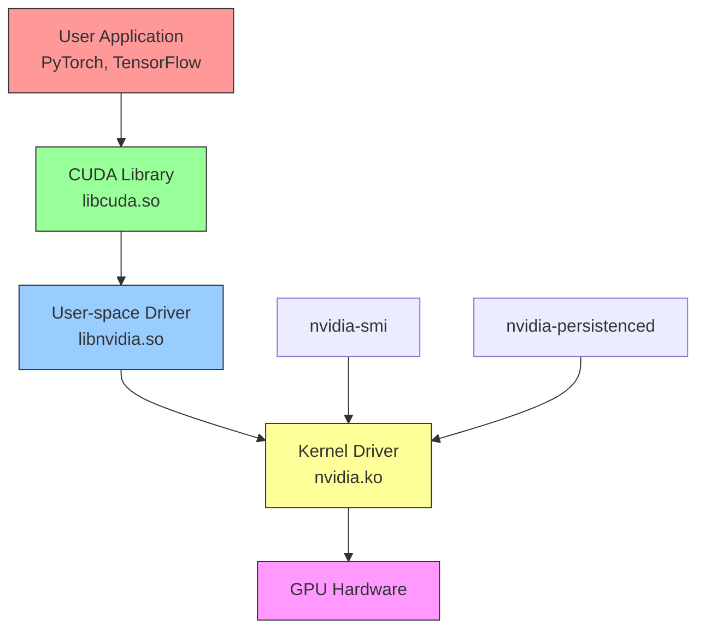
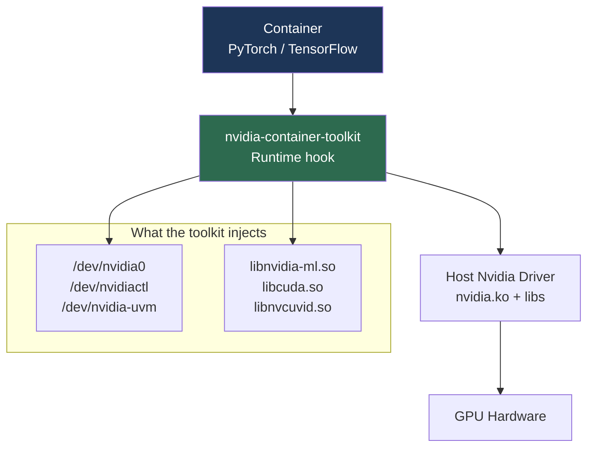
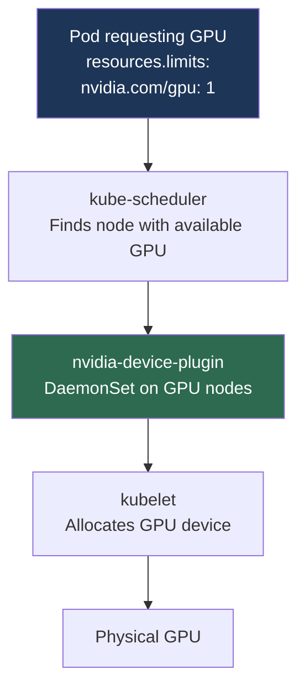
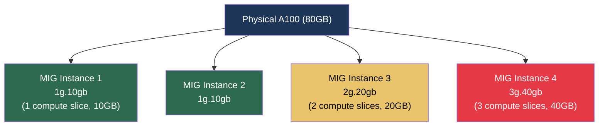

## 1.9.3 Nvidia GPU Management: Drivers, CUDA, and Monitoring

#### Why GPU Management Matters

Platform engineers increasingly manage infrastructure for machine learning, data science, and high-performance computing. Nvidia GPUs are the dominant accelerator. You will need to:

* Install and verify GPU drivers on Linux servers

* Monitor GPU utilization, temperature, and memory

* Ensure CUDA toolkits are correctly installed for containers

* Troubleshoot "GPU not found" or out-of-memory errors

* Configure persistence mode for low-latency workloads

This note covers **Nvidia-specific tooling** – driver installation, `nvidia-smi`, persistence mode, and CUDA basics.

***

## Part 1: Nvidia Driver Architecture



### Components

| Component                              | Purpose                                  | Location                     |
| -------------------------------------- | ---------------------------------------- | ---------------------------- |
| **Kernel driver** (`nvidia.ko`)        | Communicates directly with GPU hardware  | Kernel module                |
| **User-space driver** (`libnvidia.so`) | Provides CUDA, OpenGL, Vulkan APIs       | `/usr/lib/x86_64-linux-gnu/` |
| **CUDA toolkit**                       | Development libraries, compiler (`nvcc`) | `/usr/local/cuda/`           |
| **`nvidia-smi`**                       | Monitoring and management CLI            | `/usr/bin/nvidia-smi`        |
| **`nvidia-persistenced`**              | Daemon keeping GPU state loaded          | Systemd service              |

***

## Part 2: Checking GPU Status – `nvidia-smi`

`nvidia-smi` (Nvidia System Management Interface) is the primary tool for GPU monitoring.

### Basic Usage

```bash
# Show basic GPU information
nvidia-smi

# Output example:
# +-----------------------------------------------------------------------------+
# | NVIDIA-SMI 525.60.11    Driver Version: 525.60.11    CUDA Version: 12.0     |
# |-------------------------------+----------------------+----------------------+
# | GPU  Name        Persistence-M| Bus-Id        Disp.A | Volatile Uncorr. ECC |
# | Fan  Temp  Perf  Pwr:Usage/Cap|         Memory-Usage | GPU-Util  Compute M. |
# |===============================+======================+======================|
# |   0  Tesla T4            Off  | 00000000:00:1E.0 Off |                    0 |
# | N/A   45C    P8    10W /  70W |      0MiB / 15360MiB |      0%      Default |
# +-------------------------------+----------------------+----------------------+
```

### Understanding `nvidia-smi` Output

| Field              | Meaning                                       | Healthy Range                 |
| ------------------ | --------------------------------------------- | ----------------------------- |
| **Driver Version** | Installed Nvidia driver                       | Latest stable                 |
| **CUDA Version**   | Maximum CUDA version supported                | Matches application needs     |
| **GPU Name**       | GPU model                                     | –                             |
| **Persistence-M**  | Persistence mode (On/Off)                     | Should be `On` for production |
| **Fan**            | Fan speed percentage                          | 0-100%                        |
| **Temp**           | GPU temperature (Celsius)                     | <85°C (critical at 95°C+)     |
| **Perf**           | Performance state (P0-P12)                    | P0 = max, P8 = low power      |
| **Pwr:Usage/Cap**  | Current power / maximum                       | <100% of cap                  |
| **Memory-Usage**   | Used / Total GPU memory                       | Monitor for OOM               |
| **GPU-Util**       | GPU compute utilization %                     | Varies by workload            |
| **Compute M.**     | Compute mode (Default, Exclusive, Prohibited) | Default for most              |

### Common `nvidia-smi` Commands

```bash
# One-line summary (good for scripts)
nvidia-smi --query-gpu=index,name,temperature.gpu,utilization.gpu,memory.used,memory.total --format=csv,noheader

# Output: 0, Tesla T4, 45, 0, 0, 15360

# Monitor continuously (like top for GPUs)
watch -n 1 nvidia-smi

# Better: nvidia-smi with refresh
nvidia-smi -l 2   # Refresh every 2 seconds

# Show GPU processes (who is using the GPU)
nvidia-smi pmon -c 1
# Output:
# # gpu   pid  type    sm   mem   enc   dec   command
# # Idx     #    C/G     %     %     %     %   name
#     0  1234     C     95    50     0     0   python

# Kill a process on GPU
nvidia-smi | grep python | awk '{print $5}' | xargs kill -9

# Show GPU topology (how GPUs are connected)
nvidia-smi topo -m
```

### GPU Process Monitoring Details

```bash
# Show which processes are using each GPU
nvidia-smi --query-compute-apps=pid,process_name,used_memory --format=csv

# Sample output:
# pid, process_name, used_gpu_memory [MiB]
# 1234, python, 5120
# 5678, python, 2048
```

***

## Part 3: Nvidia Driver Installation

### RHEL Family (Rocky/Alma/CentOS)

```bash
# 1. Install dependencies
sudo dnf install kernel-devel kernel-headers gcc make dkms

# 2. Disable Nouveau (open-source driver)
echo "blacklist nouveau" | sudo tee /etc/modprobe.d/blacklist-nouveau.conf
echo "options nouveau modeset=0" | sudo tee -a /etc/modprobe.d/blacklist-nouveau.conf
sudo dracut --force
sudo reboot

# 3. Install Nvidia driver (via RPM)
sudo dnf config-manager --add-repo https://developer.download.nvidia.com/compute/cuda/repos/rhel8/x86_64/cuda-rhel8.repo
sudo dnf module disable nvidia-driver
sudo dnf install nvidia-driver-latest-dkms

# Or download installer from Nvidia website
chmod +x NVIDIA-Linux-x86_64-*.run
sudo ./NVIDIA-Linux-x86_64-*.run
```

### Debian Family (Ubuntu)

```bash
# 1. Purge any existing Nvidia drivers
sudo apt purge nvidia* libnvidia*
sudo apt autoremove

# 2. Add graphics drivers PPA
sudo add-apt-repository ppa:graphics-drivers/ppa
sudo apt update

# 3. Install recommended driver
sudo ubuntu-drivers autoinstall
# OR specify version
sudo apt install nvidia-driver-525

# 4. Reboot
sudo reboot

# 5. Verify
nvidia-smi
```

### Using `nvidia-smi` to Detect Driver Issues

```bash
# NVIDIA-SMI has failed because it couldn't communicate with the NVIDIA driver.
# Make sure that the latest NVIDIA driver is installed and running.

# Solution: Check if driver is loaded
lsmod | grep nvidia
# If no output, driver not loaded

# Check kernel module
sudo modprobe nvidia

# Check dmesg for errors
dmesg | grep -i nvidia
```

***

## Part 4: Persistence Mode

### What is Persistence Mode?

Normally, the GPU driver unloads GPU state when no process uses it. This adds latency when a new process starts (driver reinitialization). **Persistence mode** keeps the GPU state loaded, reducing startup time.

**Benefits:**

* Lower latency for frequent GPU operations

* Critical for inference servers and interactive workloads

* Prevents driver reload overhead

**Drawbacks:**

* Slightly higher idle power consumption

* GPU remains initialized (cannot be unloaded)

### Managing Persistence Mode

```bash
# Check persistence mode status
nvidia-smi --query-gpu=persistence_mode --format=csv
# persistence_mode
# Enabled
# Disabled

# Enable persistence mode for all GPUs
sudo nvidia-smi -pm 1

# Enable for specific GPU
sudo nvidia-smi -i 0 -pm 1

# Disable persistence mode
sudo nvidia-smi -pm 0

# Make persistent across reboots (enable nvidia-persistenced service)
sudo systemctl enable nvidia-persistenced
sudo systemctl start nvidia-persistenced
```

### `nvidia-persistenced` Daemon

This service ensures persistence mode is re-enabled after driver reloads or system resume.

```bash
# Check status
systemctl status nvidia-persistenced

# Logs
journalctl -u nvidia-persistenced

# Manual start
sudo nvidia-persistenced --user nvidia-persistenced
```

### Compute Mode (Multi-User GPU Access)

Compute mode controls how many processes can share a GPU simultaneously.

```bash
# Check current compute mode
nvidia-smi --query-gpu=compute_mode --format=csv
# compute_mode
# Default

# Set compute mode (requires root)
sudo nvidia-smi -i 0 -c <mode>
```

**Compute mode values:**

| Mode | Value | Meaning |
|------|-------|---------|
| Default | 0 | Multiple processes can share the GPU (normal behavior) |
| Exclusive Thread | 1 | Only one compute context per GPU (deprecated) |
| Prohibited | 2 | No compute processes allowed |
| Exclusive Process | 3 | Only one process (with any number of threads) per GPU |

**When to use Exclusive Process mode:**

```bash
# In production ML inference, prevent OOM from GPU over-subscription
sudo nvidia-smi -i 0 -c 3

# Verify
nvidia-smi --query-gpu=compute_mode --format=csv
# compute_mode
# Exclusive_Process
```

**Best practices:**
- Use **Default (0)** for development and testing
- Use **Exclusive Process (3)** for production ML inference
- Use **Prohibited (2)** to reserve GPU for specific containers/VMs

***

## Part 5: CUDA Toolkit

### What is CUDA?

CUDA (Compute Unified Device Architecture) is Nvidia's parallel computing platform. It provides:

* **Compiler (`nvcc`)** – Compiles GPU code

* **Libraries** – cuBLAS (linear algebra), cuDNN (deep learning), cuFFT (FFT)

* **Runtime** – Executes GPU kernels

### Checking CUDA Version

```bash
# Method 1: nvidia-smi shows max supported version
nvidia-smi | grep "CUDA Version"
# CUDA Version: 12.0

# Method 2: nvcc (if CUDA toolkit installed)
nvcc --version
# Cuda compilation tools, release 12.0, V12.0.140

# Method 3: Driver API version
nvidia-smi -q | grep "CUDA Version"
```

**Important:** Driver supports up to a maximum CUDA version. Newer CUDA requires newer driver.

### Installing CUDA Toolkit

```bash
# Ubuntu 22.04
wget https://developer.download.nvidia.com/compute/cuda/repos/ubuntu2204/x86_64/cuda-keyring_1.0-1_all.deb
sudo dpkg -i cuda-keyring_1.0-1_all.deb
sudo apt update
sudo apt install cuda-toolkit-12-0

# Add to PATH
echo 'export PATH=/usr/local/cuda/bin:$PATH' >> ~/.bashrc
echo 'export LD_LIBRARY_PATH=/usr/local/cuda/lib64:$LD_LIBRARY_PATH' >> ~/.bashrc
source ~/.bashrc

# Verify
nvcc --version
```

### CUDA Compatibility

| Driver Version | Max CUDA Version |
| -------------- | ---------------- |
| 525.x          | 12.0             |
| 520.x          | 11.8             |
| 510.x          | 11.6             |
| 470.x          | 11.4             |
| 450.x          | 11.0             |

```bash
# Check driver version
nvidia-smi | grep "Driver Version"
# Driver Version: 525.60.11 → CUDA 12.0 max
```

***

## Part 6: Troubleshooting GPU Issues

### Problem 1: "No devices were found"

```bash
# Check if driver is loaded
lsmod | grep nvidia

# Check PCIe devices
lspci | grep -i nvidia

# Check dmesg
dmesg | tail -20

# Reload driver
sudo modprobe -r nvidia_drm nvidia_modeset nvidia_uvm nvidia
sudo modprobe nvidia
```

### Problem 2: Out of Memory (OOM)

```bash
# Check memory usage
nvidia-smi

# Find process consuming memory
nvidia-smi --query-compute-apps=pid,used_memory --format=csv

# Kill specific process
kill -9 <PID>

# Clear GPU memory (if processes can't be killed)
sudo nvidia-smi --gpu-reset -i 0
```

### Problem 3: "CUDA driver version is insufficient"

```bash
# Application needs newer CUDA than driver supports
# Check driver CUDA version
nvidia-smi | grep "CUDA Version"

# Upgrade driver or downgrade CUDA toolkit
```

### Problem 4: GPU Persistence Mode Not Sticking After Reboot

```bash
# Enable service
sudo systemctl enable nvidia-persistenced
sudo systemctl start nvidia-persistenced

# Check status
systemctl status nvidia-persistenced
```

### Problem 5: High GPU Temperature

```bash
# Monitor temperature
watch -n 1 nvidia-smi --query-gpu=temperature.gpu --format=csv

# Set power limit (reduce heat)
sudo nvidia-smi -pl 150   # Set to 150W (down from 250W)

# Check fans
nvidia-smi -q | grep -A 10 "Fan Speed"
```

***

## Part 7: GPU Monitoring in Production

### Prometheus Metrics (nvidia-smi exporter)

```bash
# Run nvidia-smi exporter for Prometheus
docker run -d --gpus all --restart always -p 9835:9835 \
  nvidia/dcgm-exporter:latest
```

### Script for GPU Health Checks

```bash
#!/bin/bash
# gpu_health_check.sh

# Check temperature
TEMP=$(nvidia-smi --query-gpu=temperature.gpu --format=csv,noheader)
if [ "$TEMP" -gt 85 ]; then
    echo "WARNING: GPU temperature $TEMP°C exceeds 85°C"
fi

# Check memory
MEM_USED=$(nvidia-smi --query-gpu=memory.used --format=csv,noheader | tr -d ' ')
MEM_TOTAL=$(nvidia-smi --query-gpu=memory.total --format=csv,noheader | tr -d ' ')
MEM_PERCENT=$((MEM_USED * 100 / MEM_TOTAL))
if [ "$MEM_PERCENT" -gt 90 ]; then
    echo "WARNING: GPU memory usage $MEM_PERCENT%"
fi

# Check power
POWER=$(nvidia-smi --query-gpu=power.draw --format=csv,noheader | sed 's/ W//')
POWER_MAX=$(nvidia-smi --query-gpu=power.limit --format=csv,noheader | sed 's/ W//')
POWER_PERCENT=$(echo "scale=0; $POWER * 100 / $POWER_MAX" | bc)
if [ "$POWER_PERCENT" -gt 95 ]; then
    echo "INFO: GPU power usage $POWER_PERCENT%"
fi
```

***

## Quick Task: GPU Management Practice

*If you have access to an Nvidia GPU, perform these tasks. If not, study the commands.*

1. Run `nvidia-smi` and identify:

   * Driver version

   * CUDA version

   * GPU temperature

   * Memory usage
2. Enable persistence mode and verify it's on.
3. Monitor GPU utilization for 10 seconds with `nvidia-smi -l 1`.
4. (Optional) Install the CUDA toolkit and verify `nvcc` works.

> **Ready Solution:**
>
> ```bash
> # Task 1
> nvidia-smi
> # Record: Driver Version, CUDA Version, GPU temp, Memory usage
>
> # Task 2
> sudo nvidia-smi -pm 1
> nvidia-smi --query-gpu=persistence_mode --format=csv
>
> # Task 3
> nvidia-smi -l 1
> # Wait 10 seconds, then Ctrl+C
>
> # Task 4 (optional)
> # Ubuntu example
> sudo apt install nvidia-cuda-toolkit
> nvcc --version
> ```

***

## Summary Table: Nvidia GPU Commands

| Command                      | Purpose                 |
| ---------------------------- | ----------------------- |
| `nvidia-smi`                 | Show GPU status         |
| `nvidia-smi -l N`            | Refresh every N seconds |
| `nvidia-smi pmon`            | Show GPU processes      |
| `nvidia-smi -pm 1`           | Enable persistence mode |
| `nvidia-smi -pl 150`         | Set power limit to 150W |
| `nvidia-smi -i 0 -r`         | Reset GPU 0             |
| `nvidia-smi --gpu-reset`     | Reset all GPUs          |
| `nvidia-smi -q`              | Detailed query          |
| `nvidia-smi --query-gpu=...` | Scriptable output       |
| `nvidia-smi topo -m`         | Show GPU topology       |
| `nvidia-persistenced`        | Persistence daemon      |

### GPU Monitoring Metrics (for Scripts)

| Query Field         | Description                 |
| ------------------- | --------------------------- |
| `temperature.gpu`   | GPU temperature (°C)        |
| `utilization.gpu`   | GPU compute utilization (%) |
| `memory.used`       | Used GPU memory (MiB)       |
| `memory.total`      | Total GPU memory (MiB)      |
| `power.draw`        | Current power draw (W)      |
| `power.limit`       | Power limit (W)             |
| `clocks.current.sm` | SM clock (MHz)              |
| `fan.speed`         | Fan speed (%)               |

***

## Part 8: GPU in Containers — nvidia-container-toolkit

### Why This Matters

Running GPU workloads in containers (Docker, Kubernetes) requires the GPU to be accessible inside the container. The **nvidia-container-toolkit** (formerly nvidia-docker) handles this by injecting the GPU driver and device files into the container at runtime.



### Installing nvidia-container-toolkit

```bash
# Ubuntu / Debian
curl -fsSL https://nvidia.github.io/libnvidia-container/gpgkey | \
  sudo gpg --dearmor -o /usr/share/keyrings/nvidia-container-toolkit-keyring.gpg

curl -s -L https://nvidia.github.io/libnvidia-container/stable/deb/nvidia-container-toolkit.list | \
  sed 's#deb https://#deb [signed-by=/usr/share/keyrings/nvidia-container-toolkit-keyring.gpg] https://#g' | \
  sudo tee /etc/apt/sources.list.d/nvidia-container-toolkit.list

sudo apt update && sudo apt install -y nvidia-container-toolkit

# Configure Docker runtime
sudo nvidia-ctk runtime configure --runtime=docker
sudo systemctl restart docker

# Verify
docker run --rm --gpus all nvidia/cuda:12.0-base nvidia-smi
```

```bash
# RHEL / Rocky / CentOS
curl -s -L https://nvidia.github.io/libnvidia-container/stable/rpm/nvidia-container-toolkit.repo | \
  sudo tee /etc/yum.repos.d/nvidia-container-toolkit.repo

sudo dnf install -y nvidia-container-toolkit
sudo nvidia-ctk runtime configure --runtime=docker
sudo systemctl restart docker
```

### Using GPUs in Docker

```bash
# All GPUs
docker run --rm --gpus all nvidia/cuda:12.0-base nvidia-smi

# Specific number of GPUs
docker run --rm --gpus 2 myapp:latest

# Specific GPU devices by index
docker run --rm --gpus '"device=0,2"' myapp:latest

# Specific GPU by UUID
docker run --rm --gpus '"device=GPU-xxxxx-xxxx"' myapp:latest

# With memory and compute constraints (Docker Compose)
# docker-compose.yml
# services:
#   ml-training:
#     image: myapp:latest
#     deploy:
#       resources:
#         reservations:
#           devices:
#             - driver: nvidia
#               count: 1
#               capabilities: [gpu]
```

### Verifying GPU Access Inside Container

```bash
docker run --rm --gpus all nvidia/cuda:12.0-base bash -c '
  nvidia-smi
  echo "---"
  ls /dev/nvidia*
  echo "---"
  python3 -c "import torch; print(f\"CUDA available: {torch.cuda.is_available()}\")"
'
```

***

## Part 9: GPU in Kubernetes — Device Plugin & Scheduling

### Architecture



### Installing the Nvidia Device Plugin

```bash
# Deploy as DaemonSet (runs on all GPU nodes)
kubectl create -f https://raw.githubusercontent.com/NVIDIA/k8s-device-plugin/v0.14.1/nvidia-device-plugin.yml

# Verify plugin is running
kubectl get pods -n kube-system -l name=nvidia-device-plugin-ds

# Check node GPU capacity
kubectl describe node gpu-node-1 | grep -A5 "Capacity:"
# Capacity:
#   nvidia.com/gpu:  4
# Allocatable:
#   nvidia.com/gpu:  4
```

### Requesting GPUs in Pod Specs

```yaml
apiVersion: v1
kind: Pod
metadata:
  name: gpu-training-job
spec:
  restartPolicy: Never
  containers:
  - name: trainer
    image: myorg/ml-trainer:v1.0
    resources:
      limits:
        nvidia.com/gpu: 1    # Request exactly 1 GPU
        memory: "16Gi"
        cpu: "4"
      requests:
        memory: "8Gi"
        cpu: "2"
    volumeMounts:
    - name: training-data
      mountPath: /data
  nodeSelector:
    accelerator: nvidia-tesla-t4    # Target specific GPU type
  tolerations:
  - key: nvidia.com/gpu
    operator: Exists
    effect: NoSchedule
  volumes:
  - name: training-data
    persistentVolumeClaim:
      claimName: training-pvc
```

### GPU Scheduling Rules

| Rule | Detail |
|------|--------|
| GPUs cannot be shared | One GPU = one pod (unless using MIG or time-slicing) |
| Only `limits` matters | `requests` for `nvidia.com/gpu` is ignored; limits = allocation |
| No fractional GPUs | Must request whole numbers (1, 2, 4...) |
| No overcommit | Cannot schedule more GPUs than physically exist |
| Node labels | Use `nodeSelector` or `nodeAffinity` to target GPU node pools |

### GPU Node Taints (Best Practice)

```bash
# Taint GPU nodes so non-GPU workloads don't land there
kubectl taint nodes gpu-node-1 nvidia.com/gpu=present:NoSchedule

# GPU pods need the matching toleration (shown in pod spec above)
# Non-GPU pods will be scheduled elsewhere automatically
```

***

## Part 10: Multi-Instance GPU (MIG)

### What Is MIG?

MIG (Multi-Instance GPU) is an A100/A30/H100 feature that partitions a **single physical GPU** into up to 7 isolated instances. Each instance has dedicated compute, memory, and memory bandwidth — like separate mini-GPUs.



### Why MIG Matters for Platform Engineers

| Without MIG | With MIG |
|---|---|
| 1 GPU = 1 pod (wastes resources for small inference) | 1 GPU = up to 7 pods |
| Must buy more GPUs for multi-tenant | Share expensive GPUs safely |
| No memory isolation between processes | Full memory and fault isolation |
| GPU idle when inference is lightweight | Right-size GPU allocation |

### Managing MIG

```bash
# Check if GPU supports MIG
nvidia-smi -i 0 --query-gpu=mig.mode.current --format=csv
# mig.mode.current
# Disabled

# Enable MIG mode (requires GPU reset — no active processes)
sudo nvidia-smi -i 0 -mig 1
sudo nvidia-smi -i 0 --gpu-reset

# List available MIG profiles
nvidia-smi mig -lgip
# +-----------------------------------------------------------------------------+
# | GPU instances:                                                               |
# |   GPU   Profile ID   Instances   Memory     SM                              |
# |   0     19           7           9.75 GB    14                              |  ← 1g.10gb
# |   0     14           3           19.50 GB   28                              |  ← 2g.20gb
# |   0     9            2           39.00 GB   42                              |  ← 3g.40gb
# |   0     5            1           79.00 GB   98                              |  ← 7g.80gb
# +-----------------------------------------------------------------------------+

# Create MIG instances
sudo nvidia-smi mig -cgi 19,19,19 -C    # Create 3 × 1g.10gb instances with compute instances
# Or
sudo nvidia-smi mig -cgi 9,14 -C        # Create 1 × 3g.40gb + 1 × 2g.20gb

# List active MIG instances
nvidia-smi mig -lgi
# +-------------------------------------------------------+
# | GPU instances:                                         |
# | GPU   Inst   Profile                    Placement      |
# |   0      1   MIG 1g.10gb               {0}            |
# |   0      2   MIG 1g.10gb               {1}            |
# |   0      3   MIG 1g.10gb               {2}            |
# +-------------------------------------------------------+

# Destroy MIG instances (must stop all processes first)
sudo nvidia-smi mig -dci && sudo nvidia-smi mig -dgi

# Disable MIG mode
sudo nvidia-smi -i 0 -mig 0
```

### MIG in Kubernetes

With MIG enabled and the nvidia-device-plugin configured for MIG strategy:

```yaml
# Pod requesting a specific MIG slice
apiVersion: v1
kind: Pod
metadata:
  name: inference-small
spec:
  containers:
  - name: model
    image: myorg/inference:v1
    resources:
      limits:
        nvidia.com/mig-1g.10gb: 1    # Request a 1g.10gb MIG instance
```

```bash
# Configure device plugin for MIG (in its ConfigMap)
# Strategy options: "none" (default), "single", "mixed"
#   single: all GPUs have same MIG profile
#   mixed:  GPUs can have different profiles
kubectl edit configmap nvidia-device-plugin -n kube-system
# Set: MIG_STRATEGY=mixed
```

### GPU Time-Slicing (Alternative to MIG)

For GPUs that don't support MIG (T4, V100), **time-slicing** allows multiple pods to share a GPU by taking turns:

```yaml
# nvidia-device-plugin ConfigMap for time-slicing
apiVersion: v1
kind: ConfigMap
metadata:
  name: nvidia-device-plugin
  namespace: kube-system
data:
  config: |
    version: v1
    sharing:
      timeSlicing:
        resources:
        - name: nvidia.com/gpu
          replicas: 4    # Each physical GPU appears as 4 virtual GPUs
```

> **MIG vs Time-Slicing:**
> | Feature | MIG | Time-Slicing |
> |---|---|---|
> | Memory isolation | ✅ Full | ❌ Shared (OOM risk) |
> | Compute isolation | ✅ Dedicated SMs | ❌ Round-robin |
> | Supported GPUs | A100, A30, H100 | All Nvidia GPUs |
> | Granularity | Fixed profiles | Any ratio |
> | Fault isolation | ✅ One instance crash ≠ others | ❌ One crash affects all |

***

**Next note (1.9.4)** will be the Subchapter Review for Advanced Utilities, including a comprehensive cheatsheet and scenario-based interview questions covering `screen`, `tmux`, `lsof`, `sysdig`, and Nvidia GPU management.

---

## Backlinks

- [1.6.1 Process Management](../Subchapter_1.6/1.6.1_Process_Management_and_Job_Control.md) – GPU processes appear in `ps` and can be killed with `kill`
- [1.6.2 Systemd Service Management](../Subchapter_1.6/1.6.2_Systemd_Service_Management.md) – `nvidia-persistenced` is a systemd service
- [1.2.2 File Permissions](../Subchapter_1.2/1.2.2_File_Permissions_and_Ownership.md) – `nvidia-smi` requires appropriate permissions, often `sudo`
- [1.7.1 RPM and DNF](../Subchapter_1.7/1.7.1_RPM_YUM_DNF_Package_Management.md) – Driver installation uses `dnf` or `apt`
