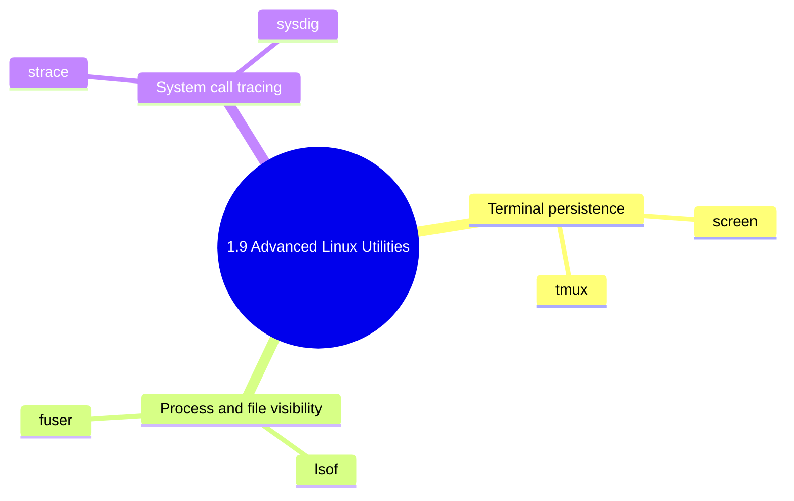

## 1.9.3 Subchapter Review: Advanced Linux Utilities

This review covers Notes 1.9.1 (Screen and Tmux) and 1.9.2 (Lsof, Sysdig, and Strace). GPU operations moved to Kubernetes operations in [5.8.6 GPU Nodes, NVIDIA Device Plugin, and Operations](../../5-Kubernetes/Subchapter_5.8/5.8.6_GPU_Nodes_NVIDIA_Device_Plugin_and_Operations.md).



***

## Quick Command Reference

| Need | Command |
| --- | --- |
| Start a named tmux session | `tmux new -s work` |
| Detach from tmux | `Ctrl+B d` |
| Reattach tmux | `tmux attach -t work` |
| Start a named screen session | `screen -S work` |
| Detach from screen | `Ctrl+A d` |
| Show process using port 80 | `sudo lsof -i :80` |
| Kill process using a port | `kill -9 $(sudo lsof -t -i :80)` |
| Show files opened by PID | `sudo lsof -p <pid>` |
| Find deleted-but-open files | `sudo lsof | grep deleted` |
| Trace one process | `sudo strace -p <pid>` |
| Summarize syscalls | `sudo strace -c <command>` |
| Capture system activity | `sudo sysdig -w capture.scap` |
| Show top CPU processes with sysdig | `sudo sysdig -c top_cpu` |

***

## Quick Recap

- **screen** and **tmux** keep terminal work alive after SSH disconnects.
- **tmux** is usually better for daily work because panes, layouts, scripting, and mouse support are stronger.
- **lsof** answers "who has this file, port, socket, or deleted inode open right now?"
- **fuser** is a quick alternative when you only need PIDs for a file, mount, or port.
- **strace** follows system calls for one command or process, which is perfect for permission, missing file, DNS, and startup debugging.
- **sysdig** captures system-wide events and can answer questions after the moment has passed.
- Deleted files can still consume disk space while a process keeps the file descriptor open.

***

## Practice Questions with Solutions

### Question 1

**Scenario:** You need to run a long migration over SSH and your network is unreliable. How do you protect the job?

**Solution:** Run it inside `tmux` or `screen`.

```bash
tmux new -s migration
./migrate_database.sh
# Detach with Ctrl+B d
tmux attach -t migration
```

Why this works: the process stays attached to the server-side pseudo-terminal, not your local SSH connection.

### Question 2

**Scenario:** Nginx cannot start because port 80 is already in use. Find and stop the conflicting process.

**Solution:**

```bash
sudo lsof -i :80
sudo kill -TERM $(sudo lsof -t -i :80)

# If it refuses to stop after investigation:
sudo kill -9 $(sudo lsof -t -i :80)
```

Prefer `TERM` first because it gives the process a chance to clean up.

### Question 3

**Scenario:** `/var` is 100% full, but `du -sh /var/*` does not explain the usage.

**Solution:** Check for deleted files still held open by processes.

```bash
sudo lsof +L1
sudo lsof | grep deleted
```

If a log file was deleted while a service kept writing to it, restart that service or truncate the file descriptor carefully through `/proc/<pid>/fd/<fd>`.

### Question 4

**Scenario:** A command fails with `Permission denied`, but file permissions look correct. What tool helps reveal the exact failing syscall?

**Solution:** Use `strace`.

```bash
strace -f -e trace=file ./my-command
```

Look for the final `EACCES`, `ENOENT`, or `EPERM` result to identify the real path or operation that failed.

### Question 5

**Scenario:** CPU spikes happened for 30 seconds while you were away. `top` no longer shows the problem. How do you capture this next time?

**Solution:** Use sysdig capture during the window, then inspect later.

```bash
sudo sysdig -w spike.scap
sudo sysdig -r spike.scap -c top_cpu
sudo sysdig -r spike.scap proc.name=nginx
```

Sysdig is useful when you need a replayable system-level trace rather than a live-only snapshot.

***

## Summary

- Use `tmux` or `screen` for long-running terminal work, especially over SSH.
- Use `lsof` when you need to connect files, ports, sockets, PIDs, and users.
- Use `strace` when one process behaves mysteriously and you need syscall-level truth.
- Use `sysdig` when you need broader system capture or post-event analysis.
- Always prefer graceful termination before `kill -9` unless the situation is already unsafe.

***

**Backlinks:**

- Previous: [1.9.1 Screen and Tmux](./1.9.1_Screen_and_Tmux.md)
- Previous: [1.9.2 Lsof and Sysdig Basics](./1.9.2_Lsof_and_Sysdig_Basics.md)
- Next: [1.10.1 Boot Process and Recovery](../Subchapter_1.10/1.10.1_Boot_Process_and_Recovery.md)
