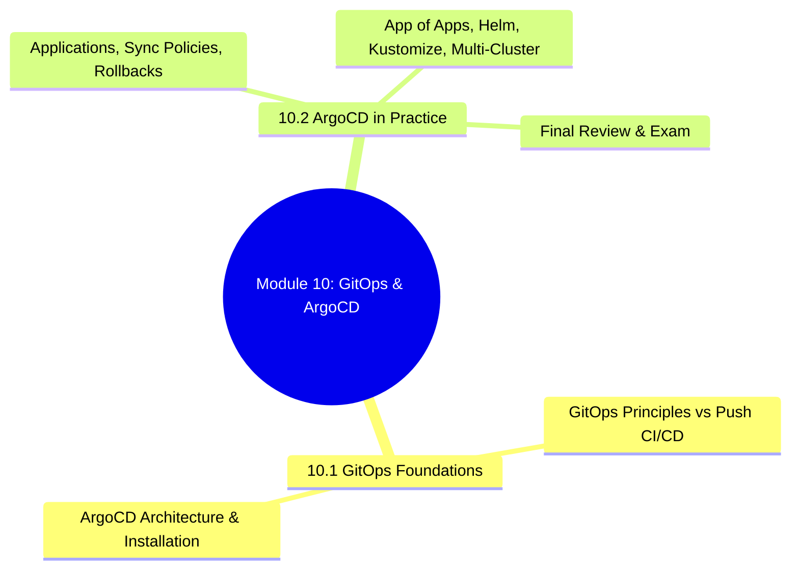
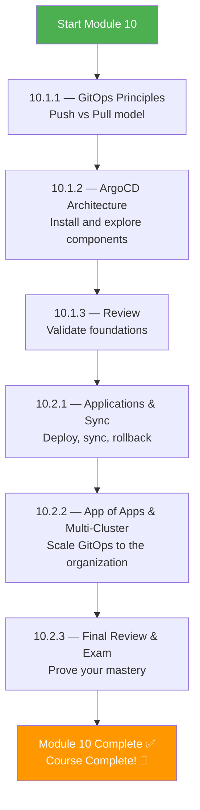
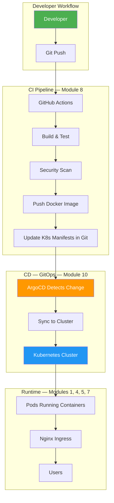

# Module 10 Approach Guide — GitOps with ArgoCD

## Module Overview

---

## Who Is This Module For?

GitOps is the **final piece of the DevOps puzzle**. It takes everything you've learned — Git, Kubernetes, CI/CD, Helm, Kustomize — and unifies them into a single operational model: **Git is the source of truth, and the cluster converges to match it automatically.**

**Target audience:**
- Platform engineers implementing GitOps workflows
- DevOps engineers transitioning from push-based CI/CD to pull-based GitOps
- Teams managing multiple Kubernetes clusters who need consistent, auditable deployments

---

## Prerequisites

| Prerequisite | Required? | Notes |
|---|---|---|
| Module 5 (Kubernetes) completed | **Critical** | ArgoCD runs ON Kubernetes and deploys TO Kubernetes |
| Module 6 (Git) completed | **Critical** | GitOps = Git as single source of truth |
| Module 8 (CI/CD) completed | **Yes** | You must understand push-based CI/CD to appreciate pull-based GitOps |
| Module 5.7 (Helm + Kustomize) completed | **Yes** | ArgoCD deploys Helm charts and Kustomize overlays |
| A running Kubernetes cluster | **Yes** | Kind cluster works: `kind create cluster --name argocd-lab` |

> ⚠️ **This is the capstone module.** If you haven't completed Modules 5, 6, and 8, go back. Module 10 assumes mastery of Kubernetes, Git, and CI/CD.

---

## How to Approach This Module

### Study Strategy

1. **Understand the WHY before the HOW** — 10.1.1 explains why GitOps exists. Don't skip it.
2. **Install ArgoCD on a real cluster** — `kubectl create namespace argocd && kubectl apply -n argocd -f https://raw.githubusercontent.com/argoproj/argo-cd/stable/manifests/install.yaml`
3. **Deploy a real application through Git** — Push a change to a repo, watch ArgoCD sync it automatically.
4. **Practice the App of Apps pattern** — It's how real organizations manage hundreds of applications.
5. **Break sync on purpose** — Manually edit a resource, watch ArgoCD detect drift and self-heal.

---

## Time Estimates

| Subchapter | Reading | Practice | Total |
|---|---|---|---|
| 10.1 GitOps Foundations | 2 hrs | 2 hrs | **4 hrs** |
| 10.2 ArgoCD in Practice | 3 hrs | 4 hrs | **7 hrs** |
| **Total** | **5 hrs** | **6 hrs** | **~11 hrs** |

> **Realistic timeline:** 1 week at 2 hours/day. Shorter than other modules because it builds on everything you already know.

---

## Practice Lab Ideas

| Lab | Covers | Difficulty |
|---|---|---|
| Install ArgoCD, deploy the `guestbook` example app from the official docs | 10.1 | ⭐⭐ |
| Create a Git repo with Kubernetes manifests, configure ArgoCD auto-sync + self-heal | 10.2 | ⭐⭐⭐ |
| Deploy a Helm chart through ArgoCD with values overrides per environment | 10.2 | ⭐⭐⭐ |
| Implement App of Apps: one root app that deploys 5 child applications | 10.2 | ⭐⭐⭐⭐ |
| Set up a complete GitOps pipeline: GitHub Actions builds image → ArgoCD deploys to K8s | 10.1, 10.2 | ⭐⭐⭐⭐ |
| Simulate drift: manually scale a deployment, watch ArgoCD revert it | 10.2 | ⭐⭐⭐ |

---

## What Success Looks Like

By the end of Module 10, you should be able to:

- [ ] Explain GitOps principles and how pull-based CD differs from push-based CD
- [ ] Install and configure ArgoCD on a Kubernetes cluster
- [ ] Create ArgoCD Applications that sync from Git repos
- [ ] Configure auto-sync, self-heal, and prune policies
- [ ] Implement the App of Apps pattern for managing multiple applications
- [ ] Deploy Helm charts and Kustomize overlays through ArgoCD
- [ ] Roll back deployments using Git history
- [ ] Design a complete GitOps workflow for a team

---

## The Complete Picture

> **Congratulations!** Completing Module 10 means you've covered the entire DevOps/Platform Engineering stack: Linux → Networking → Shell Scripting → Docker → Kubernetes → Git → Nginx → CI/CD → Python → GitOps. You are ready to build and operate production systems.
