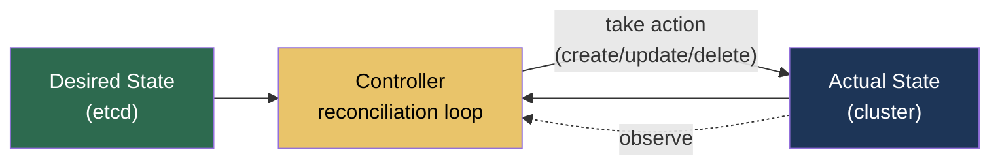
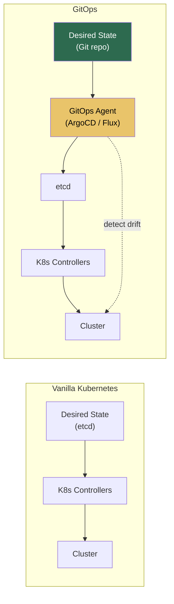
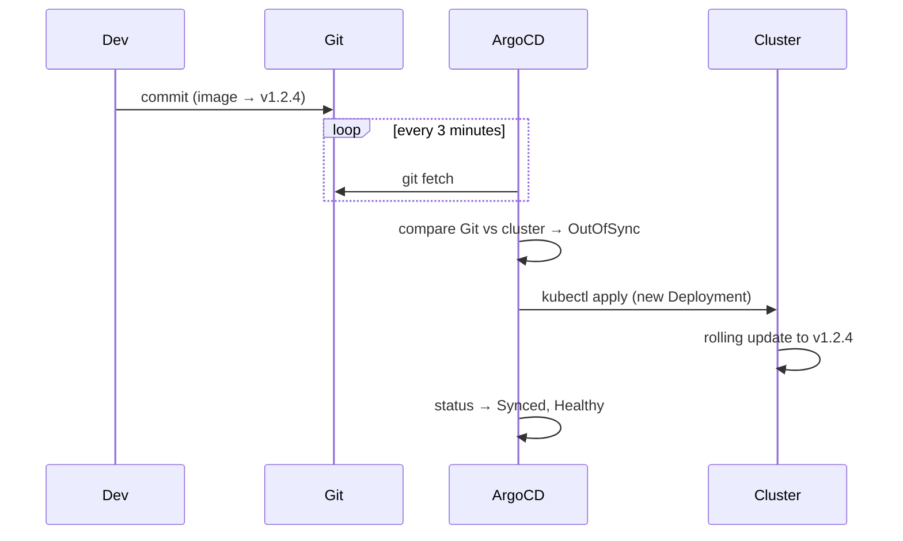
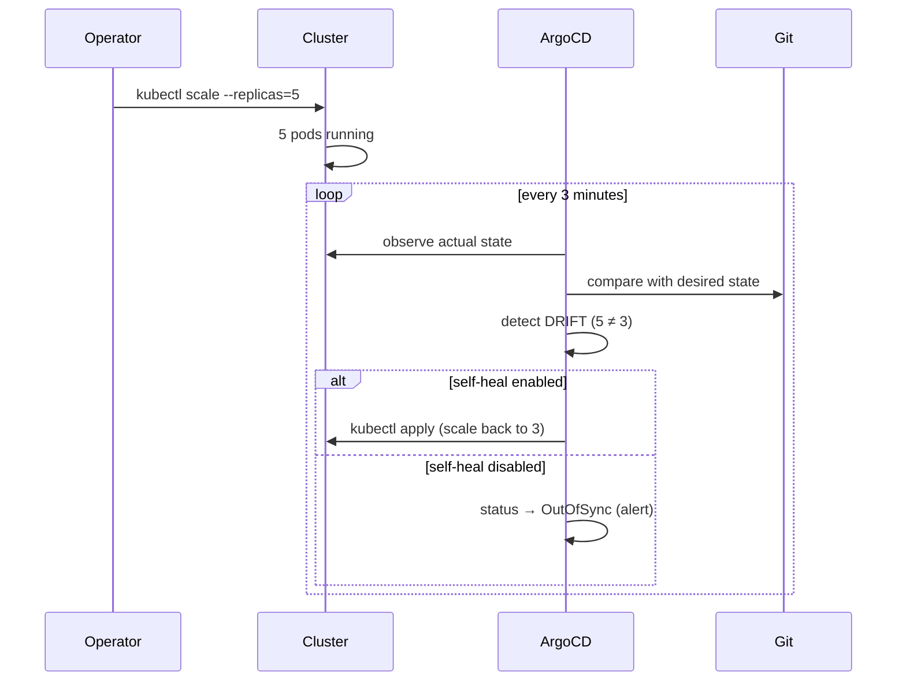
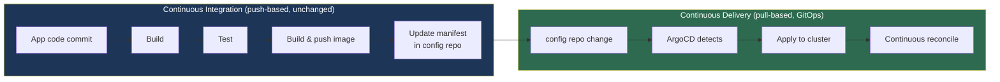
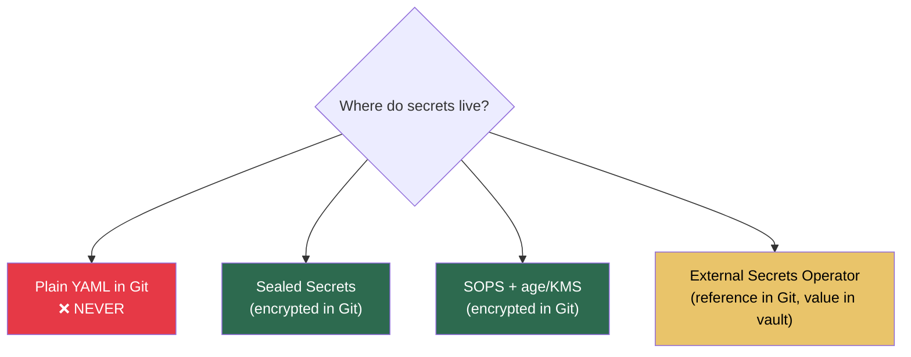
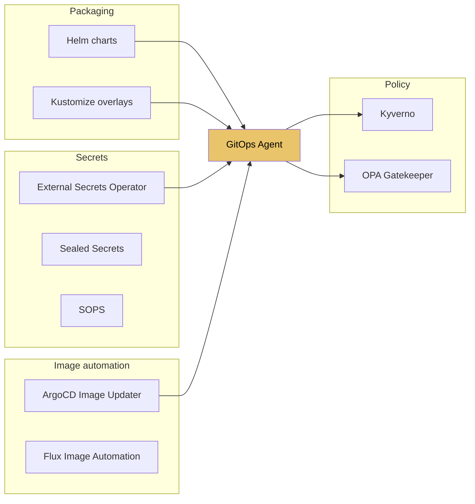
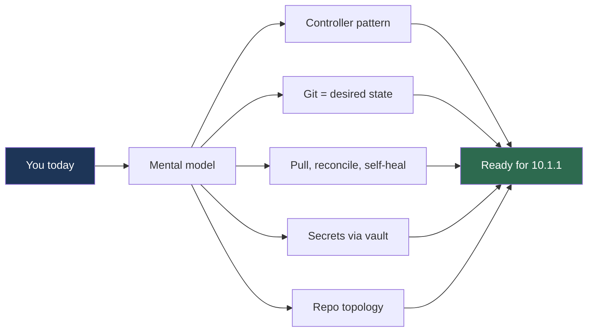

# 10.0.1 GitOps Mental Model and the Kubernetes Controller Pattern

**Backlinks:** [Module 5 — Kubernetes](../../5-Kubernetes/) (controller pattern, declarative manifests) · [Module 6 — Git](../../6-Git/) (history, revert, tags) · [Module 8 — CI/CD](../../8-CICD/) (push-based pipelines you are about to complement)

**Next note:** [10.1.1 — GitOps Principles vs Push CI/CD](../Subchapter_10.1/10.1.1_GitOps_Principles_vs_Push_CI_CD.md)

---

## Why This Note Exists

Most GitOps content starts with "ArgoCD syncs from Git" and dives into YAML. That skips the one question that makes every later concept click:

> **What is GitOps, really — and why does it exist?**

Before you install ArgoCD, you must understand:

- The Kubernetes **controller pattern** (every K8s primitive already works this way)
- The **reconciliation loop** and why it's the beating heart of both K8s and GitOps
- What **"desired state" vs "actual state"** means in practice
- Where GitOps **fits** alongside CI, and where it does **not** belong
- How to handle the GitOps elephant in the room: **secrets**

Read this once, and every ArgoCD concept from [10.1.1](../Subchapter_10.1/10.1.1_GitOps_Principles_vs_Push_CI_CD.md) onward will feel obvious.

> **Tip:** If you already run K8s in production and know what a `Deployment` controller does, skim Part 1 — but don't skip Part 5 (secrets). Most teams learn GitOps well and secrets poorly.

---

## Part 1: GitOps Is Not a Tool — It's a Reapplication of a K8s Idea

### The Idea You Already Know (Without Naming It)

When you write:

```yaml
apiVersion: apps/v1
kind: Deployment
metadata:
  name: web
spec:
  replicas: 3
  template:
    spec:
      containers:
        - name: web
          image: nginx:1.25
```

You are **not** telling Kubernetes *how* to create 3 pods. You are declaring **what you want to be true**: "3 pods of nginx:1.25 should exist".

The `Deployment` controller inside Kubernetes then runs an infinite loop:

```
forever:
    actual  = observe current state (how many pods exist?)
    desired = read from etcd (my Deployment says 3)
    if actual != desired:
        take action to close the gap
    sleep briefly
```

This is called the **controller pattern**, and it's how every K8s object works — Deployments, StatefulSets, Services, Ingresses, PVCs, even Nodes.



### GitOps Extends the Pattern One Level Up

Now ask: **where does the desired state come from?** In vanilla Kubernetes, the answer is "etcd", populated by whoever ran `kubectl apply`. That "whoever" is the gap.

GitOps replaces that gap with a single, strict answer:

> **The desired state lives in Git. An in-cluster controller reconciles the cluster to match Git.**



**That's it.** GitOps is the Kubernetes controller pattern, applied one level up, with Git as the source.

> **Key insight:** You already trust a `Deployment` controller to maintain 3 replicas forever. GitOps asks you to trust an ArgoCD controller to maintain *your whole cluster* forever. Same pattern, larger scope.

---

## Part 2: The Four GitOps Principles (Plain English)

The OpenGitOps working group defines four principles. Here they are, restated in plain terms:

| # | Principle | What it really means |
|---|---|---|
| 1 | **Declarative** | You describe *what* you want (YAML), never *how* to get there (no imperative `kubectl scale`). |
| 2 | **Versioned & Immutable** | Every desired state is a Git commit. History is append-only. No "live edits". |
| 3 | **Pulled Automatically** | An agent inside the cluster pulls from Git. CI does **not** push to the cluster. |
| 4 | **Continuously Reconciled** | The agent doesn't just deploy once — it compares and corrects forever. |

### Why These Four, Together

Miss any one and you don't have GitOps, you have "Git-assisted ops":

- Declarative without versioned → scripted `kubectl apply` in CI (push-based CD).
- Versioned without pulled → `git push` triggers a CI job to `kubectl apply` (still push).
- Pulled without continuously reconciled → deploys once but drifts on manual edits (not self-healing).
- Continuously reconciled without Git → a live-editing tool with drift correction (no audit trail).

> **Warning:** Beware of tools labelled "GitOps" that only satisfy principles 1–3. **Continuous reconciliation (principle 4) is the critical one** — it's what makes `kubectl edit` in production a recoverable mistake.

---

## Part 3: Desired State vs Actual State — A Worked Example

### Starting point

```
Git repo: infra-prod/apps/web/deployment.yaml
─────────────────────────────────────────────
spec:
  replicas: 3
  template:
    spec:
      containers:
        - image: myapp:v1.2.3
```

ArgoCD has synced this. Cluster has 3 pods running `myapp:v1.2.3`.

### Event 1 — A developer commits a change



### Event 2 — An operator edits live with `kubectl`

```bash
# Someone runs:
kubectl scale deploy/web --replicas=5
```



> **Tip:** For production, **always enable self-heal** on ArgoCD Applications. Manual edits during an incident are tempting, but without self-heal the cluster state silently diverges from Git and your next deploy may surprise you.

### Event 3 — Rollback via Git

```bash
# Developer realises v1.2.4 is broken
git revert <commit-sha>
git push
```

ArgoCD detects the new commit, applies the previous manifest, and the cluster rolls back.

> **Key insight:** **`git revert` is the rollback mechanism.** There is no "rollback button" — Git history *is* the rollback. This is why commit discipline matters so much in GitOps.

---

## Part 4: What GitOps Replaces, What It Does Not

### Clear Split: CI vs CD



| Stage | Still push-based | Owned by |
|---|---|---|
| Compile, build, test, scan, push image | Yes | CI (GitHub Actions, Jenkins, GitLab CI) |
| Update image tag in manifest repo | Yes | CI (commits to config repo) |
| Detect manifest change | **No (pull)** | GitOps agent (ArgoCD, Flux) |
| Apply to cluster | **No (pull)** | GitOps agent |
| Reconcile drift | **No (pull)** | GitOps agent |

> **Warning:** A common misconception: "GitOps replaces my CI pipeline". It does not. CI still builds and tests. GitOps replaces only the **`kubectl apply` step** that CI used to run.

### What GitOps Is Bad At

GitOps is a poor fit when desired state is **not** the right model:

| Scenario | Why GitOps struggles | Better approach |
|---|---|---|
| Long-running DB migrations | Migration isn't a "state" — it's a one-shot action with side effects | Argo Workflows, CI job, `kubectl create job` |
| Secrets with automatic rotation | Git commits every hour is not rotation | External Secrets + a KMS (Part 5) |
| Highly dynamic workloads (ephemeral CI runners) | Manifest churn in Git | Operators that create workloads programmatically |
| Stateful disaster recovery (etcd snapshots, volume restore) | Not a manifest — it's data | Velero, cloud-provider snapshots |
| One-off fixes during an outage | Git commit + sync loop = too slow | `kubectl edit` (then commit after to resync) |

---

## Part 5: The Elephant in the Room — Secrets

Git is **public-shaped** (audit trail, history, clones). Secrets are **private-shaped** (nobody should read them). GitOps tools must reconcile the two.

There are four standard approaches, each with tradeoffs.



### Option 1: Sealed Secrets (Bitnami)

- You encrypt a `Secret` with a public key from the cluster.
- The `SealedSecret` (ciphertext) is committed to Git.
- The in-cluster controller decrypts it with its private key and creates a real `Secret`.

**Pros:** Simple. Works offline. Self-contained in the cluster.
**Cons:** Per-cluster keys — you must re-seal for each cluster. Key rotation is awkward.

### Option 2: SOPS + age / KMS

- `sops` encrypts YAML values (not the whole file — only `data:` fields).
- Developers commit encrypted YAML.
- ArgoCD uses a plugin (`argocd-vault-plugin` or Helm secrets) to decrypt at sync time.

**Pros:** Works across clusters. Human-readable diffs for non-secret fields.
**Cons:** Requires plugin configuration. Key management lives outside the cluster.

### Option 3: External Secrets Operator (ESO) — **Recommended**

- Secrets live in a real vault: AWS Secrets Manager, GCP Secret Manager, HashiCorp Vault, Azure Key Vault.
- Git contains only an `ExternalSecret` resource — a **reference** like "give me the secret at path `prod/db/password`".
- ESO pulls the value from the vault and creates a K8s `Secret` in the cluster.

```yaml
apiVersion: external-secrets.io/v1beta1
kind: ExternalSecret
metadata:
  name: db-creds
spec:
  secretStoreRef:
    name: aws-sm
    kind: SecretStore
  target:
    name: db-creds      # K8s Secret to create
  data:
    - secretKey: password
      remoteRef:
        key: prod/db/password
```

**Pros:** Vault is the source of truth for secrets. Rotation is automatic. No plaintext or ciphertext in Git. Auditable through the vault's own logs.
**Cons:** Requires a vault. Extra controller in the cluster.

### Option 4: Plain YAML in Git

**Don't.** Even in a private repo. Clones happen, backups happen, laptop theft happens. Treat this option as a bug.

> **Tip:** For most teams starting GitOps today, **External Secrets Operator** is the right default. It separates the two concerns cleanly: Git stores references and config; the vault stores values. If you aren't on a cloud with a managed secrets service, Sealed Secrets is a solid second choice.

---

## Part 6: The Tool Landscape

### GitOps Agents (you choose one)

| Tool | Strengths | Best for |
|---|---|---|
| **ArgoCD** | Great UI, App-of-Apps, multi-cluster, rich RBAC | Most teams — the default choice |
| **Flux** | CNCF graduated, lightweight, Kustomize-first, excellent Helm support | Teams that want CLI-first, no UI |
| **Jenkins X** | Opinionated, bundles CI + CD | Greenfield projects willing to adopt Jenkins X wholesale |
| **Rancher Fleet** | Multi-cluster at scale, bundles Rancher | Existing Rancher users |

These notes focus on **ArgoCD** from [10.1.2](../Subchapter_10.1/10.1.2_ArgoCD_Architecture_and_Installation.md) onward, but the mental model transfers to Flux one-for-one.

### Supporting Tools



You will cover packaging (Helm, Kustomize) and image automation in [10.2](../Subchapter_10.2/).

---

## Part 7: Repository Topology — The First Architectural Decision

Before installing ArgoCD, decide where manifests live. This choice is hard to change later.

### Option A — Monorepo (app code + manifests together)

```
myapp/
├── src/
├── Dockerfile
├── k8s/
│   ├── deployment.yaml
│   └── service.yaml
└── .github/workflows/ci.yml
```

### Option B — Polyrepo (separate config repo) ← **Recommended**

```
# Repo 1: source code
myapp/
├── src/
└── Dockerfile

# Repo 2: configuration (what ArgoCD watches)
myapp-config/
├── base/
│   ├── deployment.yaml
│   └── service.yaml
└── overlays/
    ├── dev/
    └── prod/
```

### Option C — Single "infra" monorepo for the whole org

```
infra/
├── clusters/
│   ├── prod/
│   └── staging/
├── apps/
│   ├── myapp/
│   ├── otherapp/
│   └── ...
└── platform/          # ingress, cert-manager, monitoring
    ├── ingress-nginx/
    └── prometheus/
```

### Trade-offs

| Concern | Monorepo (A) | Polyrepo (B) | Infra monorepo (C) |
|---|---|---|---|
| CI noise (every code push triggers ArgoCD) | High ❌ | Low ✅ | Low ✅ |
| Developer access to production manifests | Hard to restrict | Easy (separate repo RBAC) | Easy |
| Atomic cross-app changes | Only within one app | Hard | Easy ✅ |
| Onboarding a new app | Natural | Create a new repo | Create a new folder |
| Platform team control | Weak | Medium | Strong ✅ |

> **Tip:** Most teams end up with **B + C combined**: each app has its own source repo, and a single infra monorepo contains all K8s manifests for every app. CI in the app repo commits to the infra monorepo.

---

## Part 8: A Mental Model Checklist

Before moving to [10.1.1](../Subchapter_10.1/10.1.1_GitOps_Principles_vs_Push_CI_CD.md), you should be able to answer **yes** to each of these:

- [ ] I can explain the K8s controller pattern in one sentence (desired vs actual, reconcile loop).
- [ ] I can explain how GitOps extends this pattern (Git as desired state, agent reconciles).
- [ ] I can list the four GitOps principles without looking.
- [ ] I can explain what happens when someone runs `kubectl edit` on a GitOps-managed resource.
- [ ] I know the CI/CD split: CI still pushes images, GitOps pulls manifests.
- [ ] I can name three things GitOps is a **bad** fit for.
- [ ] I can explain the four secret-management options and pick one for my team.
- [ ] I can describe monorepo vs polyrepo vs infra-monorepo and recommend a default.

If any box is unchecked — re-read that section before moving on. Every later GitOps note assumes this foundation.

---

## Summary



**What you now know:**

- GitOps is the Kubernetes controller pattern applied one level up, with Git as the source of truth.
- Four principles: declarative, versioned, pulled, continuously reconciled — miss any one and it's not GitOps.
- CI still builds and tests; GitOps replaces only the deploy step.
- `git revert` is the rollback mechanism; `git commit` is the deploy mechanism.
- Never put plaintext secrets in Git — use External Secrets Operator, Sealed Secrets, or SOPS.
- Polyrepo (app repo + config repo) is the safe default for repository topology.

**Next:** [10.1.1 — GitOps Principles vs Push CI/CD](../Subchapter_10.1/10.1.1_GitOps_Principles_vs_Push_CI_CD.md) — compare the two models in detail, see the security and operational benefits.
