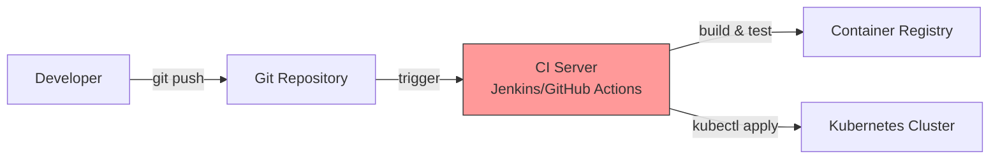
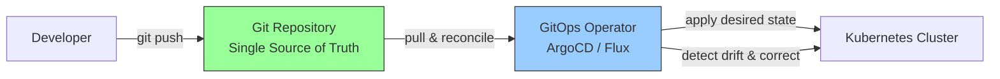
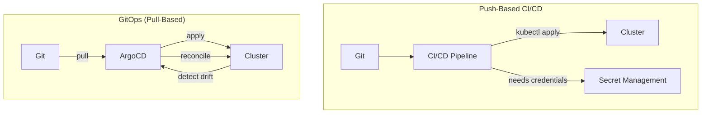
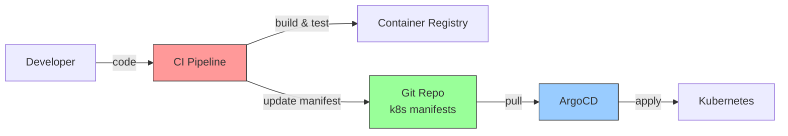

### 10.1.1 GitOps Principles vs Push CI/CD: The Evolution of Deployment

#### Why GitOps Matters

Traditional CI/CD pushes changes to clusters. GitOps flips the model – the cluster pulls from Git. This fundamental shift provides:
- **Single source of truth** – Git contains desired state
- **Auditability** – Every change is a Git commit
- **Security** – CI/CD doesn't need cluster credentials
- **Self-healing** – Cluster corrects drift automatically

This note covers GitOps principles. Note 10.1.2 covers ArgoCD architecture; note 10.1.3 is the subchapter review.

**Backward references:** Git from Module 6 (branches, commits, history); CI/CD from Module 8 (push-based pipelines); Kubernetes from Module 5 (declarative manifests); Docker from Module 4 (container images).

---

## Part 1: Push-Based CI/CD – The Traditional Model



### Traditional Push Workflow

1. Developer pushes code to Git
2. CI server detects change
3. CI builds, tests, and creates container image
4. CI pushes image to registry
5. CI runs `kubectl apply` to update cluster
6. CI pipeline completes

### Problems with Push-Based CI/CD

| Problem | Description |
|---------|-------------|
| **Security risk** | CI/CD system needs cluster credentials (often admin-level) |
| **Single point of failure** | CI/CD system goes down, deployments stop |
| **No drift correction** | Manual changes to cluster are overwritten or ignored |
| **Limited auditability** | Who changed what and when? (CI logs vs Git history) |
| **Environment drift** | Production and staging diverge over time |
| **Rollback complexity** | Reverting means finding old manifest or rerunning pipeline |

---

## Part 2: GitOps – The Pull-Based Model



### GitOps Workflow

1. Developer declares desired state in Git (Kubernetes YAML, Helm charts, Kustomize)
2. GitOps operator (ArgoCD) continuously monitors Git repository
3. Operator pulls changes and applies them to cluster
4. Operator periodically reconciles (cluster vs Git)
5. If cluster drifts, operator corrects it

### GitOps Core Principles

| Principle | Meaning |
|-----------|---------|
| **Declarative** | Entire system described declaratively in Git |
| **Versioned** | Git history is the only source of truth |
| **Pulled** | Operator pulls changes, not pushed |
| **Continuous reconciliation** | Operator constantly corrects drift |
| **Immutable** | Changes only through Git (no direct kubectl) |

---

## Part 3: Push vs Pull – Detailed Comparison



### Comparison Table

| Aspect | Push CI/CD | GitOps (Pull) |
|--------|-----------|---------------|
| **Deployment trigger** | CI pipeline | Git commit |
| **Cluster credentials** | In CI system | In GitOps operator (limited scope) |
| **Drift detection** | None (only on deploy) | Continuous (every 3 minutes by default) |
| **Self-healing** | No | Yes (corrects manual changes) |
| **Rollback** | Re-run pipeline | `git revert` |
| **Audit trail** | CI logs | Git history (full) |
| **Disaster recovery** | Rebuild from scratch | `git clone` + operator |
| **Multi-cluster** | Multiple pipelines | Single GitOps operator per cluster |

---

## Part 4: GitOps Benefits

### Security

| Benefit | Explanation |
|---------|-------------|
| **No CI credentials in cluster** | CI builds images, doesn't deploy |
| **Least privilege** | GitOps operator has minimal RBAC |
| **Audit trail** | Every change is a Git commit with author |
| **No direct kubectl** | Can disable direct cluster access |

### Operational

| Benefit | Explanation |
|---------|-------------|
| **Self-healing** | Cluster automatically corrects drift |
| **Consistent environments** | All clusters pull from same Git |
| **Fast rollbacks** | `git revert` triggers rollback |
| **Disaster recovery** | Spin up new cluster, point to same Git |

### Developer Experience

| Benefit | Explanation |
|---------|-------------|
| **Familiar workflow** | Developers already know Git |
| **Pull requests** | Changes reviewed before deployment |
| **Clear history** | `git log` shows all changes |
| **No CI debugging** | Deployment issues are Git/ArgoCD issues |

---

## Part 5: GitOps and CI/CD – Not Either/Or

GitOps doesn't replace CI/CD – it complements it.



### CI Responsibilities (Still Push)

| Task | Tool |
|------|------|
| Build code | GitHub Actions, Jenkins |
| Run tests | GitHub Actions, Jenkins |
| Create container image | Docker build |
| Push image to registry | Docker push |
| Update Git manifest | `git commit` + `git push` |

### CD Responsibilities (Now Pull)

| Task | Tool |
|------|------|
| Detect manifest changes | ArgoCD |
| Apply to cluster | ArgoCD |
| Detect drift | ArgoCD |
| Self-heal | ArgoCD |
| Rollback | ArgoCD |

### CI Pipeline Example (GitHub Actions)

```yaml
# .github/workflows/ci.yml
name: CI

on:
  push:
    branches: [ main ]

jobs:
  build-and-push:
    runs-on: ubuntu-latest
    steps:
      - uses: actions/checkout@v4
      
      - name: Build Docker image
        run: docker build -t myapp:${{ github.sha }} .
      
      - name: Push to registry
        run: docker push myapp:${{ github.sha }}
      
      - name: Update Kubernetes manifest
        run: |
          sed -i "s|myapp:.*|myapp:${{ github.sha }}|" k8s/deployment.yaml
          git config user.name "CI Bot"
          git config user.email "ci@example.com"
          git add k8s/deployment.yaml
          git commit -m "Update image to ${{ github.sha }}"
          git push
```

---

## Part 6: GitOps Tools Landscape

| Tool | Features | Best For |
|------|----------|----------|
| **ArgoCD** | UI, multi-cluster, SSO, RBAC, hooks | Enterprise, complex environments |
| **Flux** | Lightweight, simple, integrated with Helm | Smaller teams, simplicity |
| **Flagger** | Canary deployments (works with ArgoCD/Flux) | Progressive delivery |
| **Jenkins X** | Full CI/CD + GitOps | Teams wanting all-in-one |

### Why ArgoCD?

| Feature | Benefit |
|---------|---------|
| **Web UI** | Visibility into sync status, diff view |
| **Multi-cluster** | Manage hundreds of clusters from one ArgoCD |
| **SSO/RBAC** | Integrate with OIDC, LDAP |
| **Sync windows** | Control when deployments happen |
| **Resource hooks** | Pre/post sync operations (e.g., DB migrations) |
| **App of Apps** | Manage hundreds of applications declaratively |

---

## Quick Task: Assess Your Current Deployment

*Answer these questions to understand if GitOps is right for your team.*

1. How many clusters do you manage?
2. How often do you deploy?
3. Who can deploy to production?
4. How do you roll back a bad deployment?
5. Do you have drift between environments?

> **Ready Solution (Example answers):**
>
> 1. "3 clusters (dev, staging, prod)"
> 2. "10-20 times per day"
> 3. "Only CI/CD pipeline (no direct access)"
> 4. "Rerun previous CI pipeline or revert commit"
> 5. "Sometimes, when manual changes are made"
>
> **GitOps would help with:**
> - Standardizing deployments across 3 clusters
> - `git revert` for fast rollbacks
> - Eliminating manual changes (self-healing)
> - Single view of all clusters from ArgoCD

---

## Summary Table: Push vs Pull

| Aspect | Push CI/CD | GitOps (Pull) |
|--------|-----------|---------------|
| **Deployment method** | CI pushes to cluster | Operator pulls from Git |
| **Credentials location** | CI system | Cluster (operator) |
| **Drift handling** | None (manual fix) | Automatic correction |
| **Rollback** | Re-run pipeline | `git revert` |
| **Audit trail** | CI logs | Git history |
| **Multi-cluster** | Multiple pipelines | Single GitOps operator per cluster |
| **Disaster recovery** | Rebuild CI, redeploy | New cluster + same Git |

### GitOps Principles Summary

| Principle | Description |
|-----------|-------------|
| **Declarative** | Whole system described in Git |
| **Versioned** | Git as single source of truth |
| **Pulled** | Operator pulls changes |
| **Continuous reconciliation** | Constant drift correction |
| **Immutable** | Changes only through Git |

---

**Next note (10.1.2)** will cover **ArgoCD Architecture and Installation** – components, installation, CLI setup, and connecting to Kubernetes clusters.

**Backward references:**
- Git from Module 6 (commits, branches, history)
- CI/CD from Module 8 (push-based pipelines)
- Kubernetes from Module 5 (manifests, RBAC)
- Docker from Module 4 (container images)
