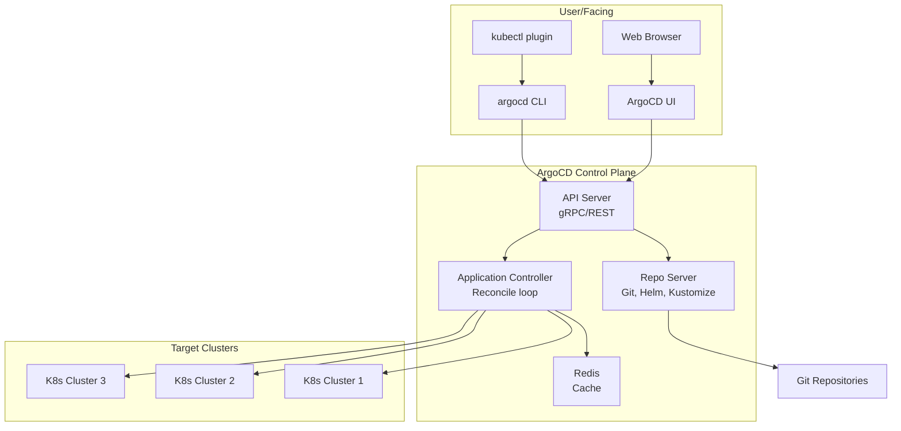
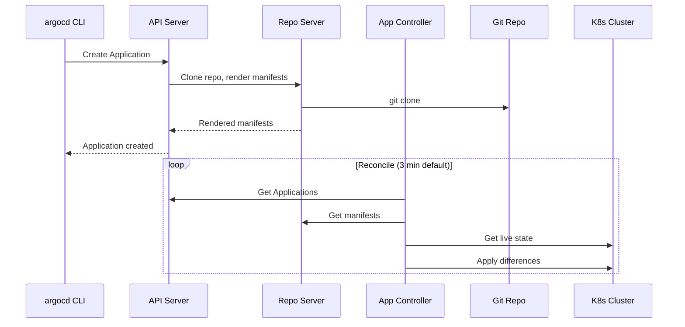

### 10.1.2 ArgoCD Architecture and Installation: Deploying the GitOps Engine

#### Why ArgoCD Architecture Matters

Understanding ArgoCD components helps you:
- Troubleshoot sync failures (which component is failing?)
- Scale for large deployments (how many repo servers?)
- Secure the cluster (what needs network access?)
- Customize for your environment

This note covers ArgoCD architecture and installation. Note 10.1.1 covered GitOps principles; note 10.1.3 is the subchapter review.

**Backward references:** Kubernetes from Module 5 (deployments, services, RBAC); Git from Module 6 (repository access); TLS/SSL from Module 2 (HTTPS for Git); CI/CD from Module 8 (GitOps as CD).

---

## Part 1: ArgoCD Architecture Overview



### ArgoCD Components

| Component | Purpose | Port |
|-----------|---------|------|
| **API Server** | gRPC/REST API, UI backend, authentication | 8080 (HTTP), 443 (HTTPS) |
| **Repo Server** | Clones Git repos, renders Helm/Kustomize | 8081 |
| **Application Controller** | Reconciles Git state vs cluster state | 8082 |
| **Redis** | Cache for manifests, app state | 6379 |
| **Dex** | OIDC provider (authentication) | 5556, 5557 |
| **argocd CLI** | Command-line interface | - |

### Component Interactions



---

## Part 2: Installing ArgoCD

### Prerequisites

```bash
# Kubernetes cluster (v1.19+)
kubectl version

# kubectl configured
kubectl cluster-info

# (Optional) Helm installed
helm version
```

### Installation Methods

**Method 1: kubectl apply (Recommended)**

```bash
# Create namespace
kubectl create namespace argocd

# Install ArgoCD
kubectl apply -n argocd -f https://raw.githubusercontent.com/argoproj/argo-cd/stable/manifests/install.yaml

# For high-availability (multiple replicas)
kubectl apply -n argocd -f https://raw.githubusercontent.com/argoproj/argo-cd/stable/manifests/ha/install.yaml

# Wait for pods
kubectl get pods -n argocd -w
```

**Method 2: Helm**

```bash
# Add repo
helm repo add argo https://argoproj.github.io/argo-helm
helm repo update

# Install
helm install argocd argo/argo-cd -n argocd --create-namespace
```

### Verify Installation

```bash
# Check all pods are running
kubectl get pods -n argocd
# NAME                                               READY   STATUS    RESTARTS   AGE
# argocd-application-controller-0                    1/1     Running   0          2m
# argocd-applicationset-controller-xxx               1/1     Running   0          2m
# argocd-dex-server-xxx                              1/1     Running   0          2m
# argocd-notifications-controller-xxx                1/1     Running   0          2m
# argocd-redis-xxx                                   1/1     Running   0          2m
# argocd-repo-server-xxx                             1/1     Running   0          2m
# argocd-server-xxx                                  1/1     Running   0          2m

# Check services
kubectl get svc -n argocd
# NAME                                      TYPE        CLUSTER-IP      PORT(S)
# argocd-dex-server                         ClusterIP   10.96.xxx.xxx   5556/TCP,5557/TCP
# argocd-metrics                            ClusterIP   10.96.xxx.xxx   8082/TCP
# argocd-redis                              ClusterIP   10.96.xxx.xxx   6379/TCP
# argocd-repo-server                        ClusterIP   10.96.xxx.xxx   8081/TCP
# argocd-server                             ClusterIP   10.96.xxx.xxx   80/TCP,443/TCP
```

---

## Part 3: Accessing ArgoCD

### Option 1: Port-Forward (Local Access)

```bash
# Forward API server to localhost
kubectl port-forward svc/argocd-server -n argocd 8080:443

# Access UI: https://localhost:8080
```

### Option 2: NodePort (External Access)

```bash
# Patch service to NodePort
kubectl patch svc argocd-server -n argocd -p '{"spec": {"type": "NodePort"}}'

# Get NodePort
kubectl get svc argocd-server -n argocd
# argocd-server   NodePort   10.96.xxx.xxx   <none>   80:30080/TCP,443:30443/TCP

# Access: https://<node-ip>:30443
```

### Option 3: Ingress (Production)

```yaml
# argocd-ingress.yaml
apiVersion: networking.k8s.io/v1
kind: Ingress
metadata:
  name: argocd-server
  namespace: argocd
  annotations:
    kubernetes.io/ingress.class: nginx
    nginx.ingress.kubernetes.io/force-ssl-redirect: "true"
    nginx.ingress.kubernetes.io/backend-protocol: "HTTPS"
spec:
  tls:
  - hosts:
    - argocd.example.com
    secretName: argocd-tls
  rules:
  - host: argocd.example.com
    http:
      paths:
      - path: /
        pathType: Prefix
        backend:
          service:
            name: argocd-server
            port:
              number: 443
```

```bash
kubectl apply -f argocd-ingress.yaml
```

---

## Part 4: ArgoCD CLI

### Install CLI

```bash
# Linux
curl -sSL -o argocd-linux-amd64 https://github.com/argoproj/argo-cd/releases/latest/download/argocd-linux-amd64
sudo install -m 555 argocd-linux-amd64 /usr/local/bin/argocd
rm argocd-linux-amd64

# macOS
brew install argocd

# Verify
argocd version
```

### Get Initial Admin Password

```bash
# Get password (default admin user)
kubectl -n argocd get secret argocd-initial-admin-secret -o jsonpath="{.data.password}" | base64 -d

# Example output: xxxxxxxxxxxxx
```

### Login to ArgoCD

```bash
# Login via port-forward
argocd login localhost:8080 --username admin --password <password>

# Change password
argocd account update-password

# Login via Ingress
argocd login argocd.example.com --username admin --password <password>
```

### Basic CLI Commands

```bash
# List clusters
argocd cluster list

# Add cluster
argocd cluster add <context-name>

# List applications
argocd app list

# Get application details
argocd app get myapp

# Sync application
argocd app sync myapp

# Rollback application
argocd app rollback myapp

# Set application sync policy
argocd app set myapp --sync-policy automated
```

---

## Part 5: Adding Kubernetes Clusters

### Add Cluster via CLI

```bash
# List current kubeconfig contexts
kubectl config get-contexts

# Add cluster (ArgoCD needs to be able to reach it)
argocd cluster add <context-name> --name <cluster-name>

# Example
argocd cluster add kind-kind --name dev-cluster
argocd cluster add gke_myproject_zone_cluster --name prod-cluster
```

### Cluster Secret (Manual Method)

```yaml
# cluster-secret.yaml
apiVersion: v1
kind: Secret
metadata:
  name: my-cluster-secret
  namespace: argocd
  labels:
    argocd.argoproj.io/secret-type: cluster
type: Opaque
stringData:
  name: staging-cluster
  server: https://staging-k8s.example.com:6443
  config: |
    {
      "bearerToken": "xxxxx",
      "tlsClientConfig": {
        "insecure": false,
        "caData": "LS0tLS1CRUdJTiBDRVJUSUZJQ0FURS0tLS0t..."
      }
    }
```

```bash
kubectl apply -f cluster-secret.yaml
```

---

## Part 6: Configuring Git Repositories

### Add Repository via CLI

```bash
# Add public repository
argocd repo add https://github.com/myorg/myapp-config.git

# Add private repository (HTTPS)
argocd repo add https://github.com/myorg/private-repo.git --username myuser --password mypass

# Add private repository (SSH)
argocd repo add git@github.com:myorg/private-repo.git --ssh-private-key-path ~/.ssh/id_rsa

# Add Helm repository
argocd repo add https://charts.helm.sh/stable --type helm --name stable-charts
```

### Repository Secret (Manual Method)

```yaml
# repo-secret.yaml
apiVersion: v1
kind: Secret
metadata:
  name: my-repo-secret
  namespace: argocd
  labels:
    argocd.argoproj.io/secret-type: repository
type: Opaque
stringData:
  url: https://github.com/myorg/private-repo.git
  username: myuser
  password: mypass
```

---

## Part 7: RBAC Configuration

### Default RBAC (argocd-rbac-cm)

```yaml
# argocd-rbac-cm.yaml
apiVersion: v1
kind: ConfigMap
metadata:
  name: argocd-rbac-cm
  namespace: argocd
data:
  policy.default: role:readonly
  policy.csv: |
    p, role:admin, applications, *, */*, allow
    p, role:admin, clusters, *, *, allow
    p, role:admin, repositories, *, *, allow
    p, role:admin, projects, *, *, allow
    p, role:admin, logs, *, *, allow
    p, role:admin, exec, *, *, allow
    
    g, my-team, role:admin
    g, dev-team, role:readonly
```

### Configure SSO (OIDC)

```yaml
# argocd-cm.yaml
apiVersion: v1
kind: ConfigMap
metadata:
  name: argocd-cm
  namespace: argocd
data:
  url: https://argocd.example.com
  dex.config: |
    connectors:
      - type: github
        id: github
        name: GitHub
        config:
          clientID: xxxxxxxxx
          clientSecret: xxxxxxxxx
          orgs:
          - name: myorg
```

---

## Quick Task: Install ArgoCD

*Install ArgoCD in a Kubernetes cluster.*

1. Create `argocd` namespace.
2. Install ArgoCD using kubectl.
3. Wait for all pods to be Running.
4. Get the admin password.
5. Port-forward and login via CLI.

> **Ready Solution:**
>
> ```bash
> # Task 1
> kubectl create namespace argocd
>
> # Task 2
> kubectl apply -n argocd -f https://raw.githubusercontent.com/argoproj/argo-cd/stable/manifests/install.yaml
>
> # Task 3
> kubectl wait --for=condition=ready pod --all -n argocd --timeout=300s
> kubectl get pods -n argocd
>
> # Task 4
> kubectl -n argocd get secret argocd-initial-admin-secret -o jsonpath="{.data.password}" | base64 -d
> # Copy the password
>
> # Task 5
> kubectl port-forward svc/argocd-server -n argocd 8080:443 &
> argocd login localhost:8080 --username admin --password <password>
> argocd account update-password
> ```

---

## Summary Table: ArgoCD Components

| Component | Port | Purpose |
|-----------|------|---------|
| API Server | 8080 (HTTP), 443 (HTTPS) | REST/gRPC API, UI |
| Repo Server | 8081 | Git clone, manifest rendering |
| Application Controller | 8082 | Reconcile loop |
| Redis | 6379 | Cache |
| Dex | 5556, 5557 | OIDC authentication |

### ArgoCD CLI Commands

| Command | Purpose |
|---------|---------|
| `argocd login <server>` | Login to ArgoCD |
| `argocd cluster add <ctx>` | Add cluster |
| `argocd repo add <url>` | Add Git repo |
| `argocd app list` | List applications |
| `argocd app get <app>` | Show app details |
| `argocd app sync <app>` | Sync application |
| `argocd app rollback <app>` | Rollback to revision |

### Installation Methods

| Method | Command | Use Case |
|--------|---------|----------|
| kubectl (standard) | `kubectl apply -f install.yaml` | Most environments |
| kubectl (HA) | `kubectl apply -f ha/install.yaml` | Production, multi-replica |
| Helm | `helm install argocd argo/argo-cd` | Helm users |

---

**Next note (10.1.3)** will be the Subchapter Review for GitOps Fundamentals and ArgoCD Architecture, including a cheatsheet and scenario-based interview questions.

**Backward references:**
- Kubernetes from Module 5 (deployments, services, RBAC)
- Git from Module 6 (repository access)
- TLS/SSL from Module 2 (HTTPS for Ingress)
- CI/CD from Module 8 (GitOps as CD evolution)
