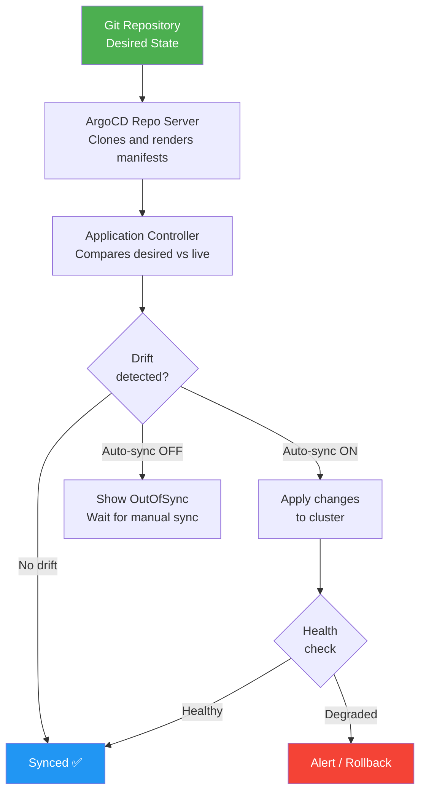
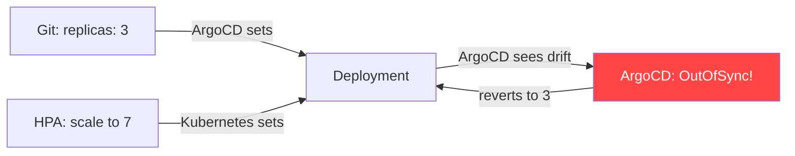

### 10.2.1 Applications, Sync Policies, and Rollbacks: Managing Deployments

#### Why Applications and Sync Matter

The Application CRD is the heart of ArgoCD. It defines:
- **Source** – Where manifests come from (Git repo, Helm chart)
- **Destination** – Where to deploy (cluster, namespace)
- **Sync policy** – How to deploy (auto, manual, prune, self-heal)

This note covers Applications and sync. Note 10.2.2 covers App of Apps and multi-cluster; note 10.2.3 is the final review.

**Backward references:** Kubernetes from Module 5 (manifests, namespaces); Git from Module 6 (repositories); Helm from Module 5 (charts); Kustomize from Module 5 (overlays). Mental model: see [10.0.1](../Subchapter_10.0/10.0.1_GitOps_Mental_Model_and_Controller_Pattern.md).

> **Important:** An `Application` is itself a Kubernetes CRD — `kubectl get applications -n argocd`. This means you can (and should) **manage Applications via Git** using the App-of-Apps pattern ([10.2.2](./10.2.2_App_of_Apps_Helm_Kustomize_and_Multi_Cluster.md)). Creating Applications manually via the UI is fine for exploration but breaks GitOps principle 2 (versioned).

> **Warning:** Without `finalizers: [resources-finalizer.argocd.argoproj.io]`, deleting an Application leaves its managed resources behind as orphans — a silent cluster leak. Add the finalizer to every production Application.


### ArgoCD Sync Flow



---

## Part 1: Application CRD – The Core Resource

### Basic Application YAML

```yaml
# app.yaml
apiVersion: argoproj.io/v1alpha1
kind: Application
metadata:
  name: myapp
  namespace: argocd
spec:
  # Source configuration
  source:
    repoURL: https://github.com/myorg/myapp-config.git
    targetRevision: main
    path: k8s/overlays/prod
  
  # Destination configuration
  destination:
    server: https://kubernetes.default.svc
    namespace: myapp
  
  # Sync policy
  syncPolicy:
    automated:
      prune: true
      selfHeal: true
    syncOptions:
    - CreateNamespace=true
```

### Application Spec Fields

| Field | Purpose | Example |
|-------|---------|---------|
| `source.repoURL` | Git repository URL | `https://github.com/myorg/config.git` |
| `source.targetRevision` | Branch/tag/commit | `main`, `v1.0.0`, `a1b2c3d` |
| `source.path` | Directory path in repo | `k8s/overlays/prod` |
| `destination.server` | Target cluster API URL | `https://kubernetes.default.svc` |
| `destination.namespace` | Target namespace | `myapp` |
| `syncPolicy` | Sync behavior | See below |

---

## Part 2: Sync Policies

### Sync Policy Types

| Policy | Behavior |
|--------|----------|
| **Manual** | User must click sync (default) |
| **Automated** | Auto-sync when Git changes |
| **Prune** | Delete resources not in Git |
| **SelfHeal** | Correct drift automatically |

### Automated Sync Configuration

```yaml
syncPolicy:
  automated:
    prune: true      # Delete resources not in Git
    selfHeal: true   # Correct manual changes
    allowEmpty: false # Don't sync if would delete everything
```

### Manual Sync (Default)

```yaml
# No syncPolicy section = manual sync
# User must run `argocd app sync myapp` or click Sync in UI
```

### Sync Options

```yaml
syncPolicy:
  syncOptions:
  - CreateNamespace=true              # Auto-create namespace
  - PrunePropagationPolicy=foreground # Delete resources in foreground
  - PruneLast=true                    # Prune after sync
  - RespectIgnoreDifferences=true     # Respect ignore differences
  - ApplyOutOfSyncOnly=true           # Only apply out-of-sync resources
```

### Sync Windows (Time Restrictions)

```yaml
# app-with-sync-window.yaml
apiVersion: argoproj.io/v1alpha1
kind: AppProject
metadata:
  name: production
spec:
  syncWindows:
  - kind: deny
    schedule: "0 18 * * *"    # 6 PM daily
    duration: "12h"            # Until 6 AM
    applications:
    - "*-prod"
    namespaces:
    - "production"
    clusters:
    - "https://prod-k8s:6443"
    manualSync: true           # Allow manual sync during window
```

---

## Part 3: Sync Status and Health

### Application Status

```bash
argocd app get myapp
# Name:               myapp
# Project:            default
# Server:             https://kubernetes.default.svc
# Namespace:          myapp
# URL:                https://argocd.example.com/applications/myapp
# Repo:               https://github.com/myorg/myapp-config.git
# Target:             main
# Path:               k8s/overlays/prod
# Sync Window:        Sync Allowed
# Sync Status:        Synced to main (a1b2c3d)
# Health Status:      Healthy

# GROUP  KIND        NAMESPACE  NAME      STATUS   HEALTH
# apps   Deployment  myapp      myapp     Synced   Healthy
# v1     Service     myapp      myapp     Synced   Healthy
```

### Sync Status Values

| Status | Meaning |
|--------|---------|
| **Synced** | Git and cluster match |
| **OutOfSync** | Git and cluster differ |
| **Unknown** | Status unknown |
| **Pruning** | Resources being deleted |

### Health Status Values

| Status | Meaning |
|--------|---------|
| **Healthy** | Resource working correctly |
| **Progressing** | Being created/updated |
| **Degraded** | Resource has problems |
| **Suspended** | Temporarily paused |
| **Missing** | Not found in cluster |
| **Unknown** | Status unknown |

---

## Part 4: Resource Hooks

Hooks run custom operations before/after sync.

### Hook Types

| Hook | Timing |
|------|--------|
| `PreSync` | Before sync |
| `Sync` | During sync (default) |
| `PostSync` | After successful sync |
| `SyncFail` | On sync failure |
| `Skip` | Skip resource during sync |

### Hook Example (Database Migration)

```yaml
# db-migration-job.yaml
apiVersion: batch/v1
kind: Job
metadata:
  name: db-migration
  annotations:
    argocd.argoproj.io/hook: PreSync
    argocd.argoproj.io/hook-delete-policy: HookSucceeded
spec:
  template:
    spec:
      containers:
      - name: migration
        image: myapp:migration
        command: ["./migrate-db.sh"]
      restartPolicy: Never
```

### Hook Deletion Policies

| Policy | Behavior |
|--------|----------|
| `HookSucceeded` | Delete after success |
| `HookFailed` | Delete after failure |
| `BeforeHookCreation` | Delete before creating new |

---

## Part 5: Rollbacks

### Rollback via Git (Recommended)

```bash
# Find previous commit
git log --oneline k8s/overlays/prod/deployment.yaml
# a1b2c3d Update image to v2.0.0
# e4f5g6h Update image to v1.9.0
# i7j8k9l Initial deployment

# Revert to previous commit
git revert a1b2c3d
git push

# ArgoCD auto-syncs (if automated) or manual sync
argocd app sync myapp
```

### Rollback via CLI

```bash
# Show deployment history
argocd app history myapp
# ID  DATE       REVISION
# 3   2024-01-15 a1b2c3d Update to v2.0.0
# 2   2024-01-14 e4f5g6h Update to v1.9.0
# 1   2024-01-13 i7j8k9l Initial deploy

# Rollback to revision 2
argocd app rollback myapp 2

# Verify
argocd app get myapp
```

### Rollback via UI

1. Navigate to Application → History
2. Click "..." next to revision
3. Click "Rollback"

---

## Part 6: Sync Wave and Phase

### Sync Waves (Order of Operations)

```yaml
# Namespace first (wave -1)
apiVersion: v1
kind: Namespace
metadata:
  name: myapp
  annotations:
    argocd.argoproj.io/sync-wave: "-1"

---
# ConfigMap second (wave 0)
apiVersion: v1
kind: ConfigMap
metadata:
  name: app-config
  annotations:
    argocd.argoproj.io/sync-wave: "0"

---
# Deployment third (wave 1)
apiVersion: apps/v1
kind: Deployment
metadata:
  name: myapp
  annotations:
    argocd.argoproj.io/sync-wave: "1"
```

### Sync Phase

```yaml
annotations:
  argocd.argoproj.io/sync-phase: "pre-sync"
  # or "sync" (default), "post-sync"
```

---

## Part 7: Complete Application Example

```yaml
# myapp-application.yaml
apiVersion: argoproj.io/v1alpha1
kind: Application
metadata:
  name: myapp-prod
  namespace: argocd
  finalizers:
  - resources-finalizer.argocd.argoproj.io  # Clean up resources on delete
spec:
  project: production  # AppProject reference
  
  source:
    repoURL: https://github.com/myorg/myapp-config.git
    targetRevision: main
    path: k8s/overlays/prod
    helm:
      valueFiles:
      - values-prod.yaml
      parameters:
      - name: image.tag
        value: "v2.0.0"
  
  destination:
    server: https://prod-k8s.example.com:6443
    namespace: myapp
  
  syncPolicy:
    automated:
      prune: true
      selfHeal: true
      allowEmpty: false
    syncOptions:
    - CreateNamespace=true
    - PrunePropagationPolicy=foreground
    retry:
      limit: 3
      backoff:
        duration: 5s
        factor: 2
        maxDuration: 3m
  
  ignoreDifferences:
  - group: apps
    kind: Deployment
    jsonPointers:
    - /spec/replicas  # Ignore replica count differences
```

---

## Part 8: Ignore Differences — Handling Controller-Managed Fields

The `ignoreDifferences` field prevents ArgoCD from flagging expected drift. The most common case: **HPA (Horizontal Pod Autoscaler) conflicts**.

### The HPA Problem



When HPA manages replicas, ArgoCD and HPA fight over `/spec/replicas`. ArgoCD sees "Git says 3, cluster says 7" and reverts — undoing the autoscaler.

### Solution 1: `jsonPointers` (Simple)

```yaml
ignoreDifferences:
- group: apps
  kind: Deployment
  jsonPointers:
  - /spec/replicas  # Ignore for ALL deployments matching
```

### Solution 2: `jqPathExpressions` (Flexible)

```yaml
ignoreDifferences:
- group: apps
  kind: Deployment
  name: myapp  # Only for this specific deployment
  jqPathExpressions:
  - .spec.replicas
  - .spec.template.metadata.annotations  # Ignore annotation changes too
```

### Solution 3: `managedFieldsManagers` (Modern — ArgoCD 2.1+)

```yaml
ignoreDifferences:
- group: apps
  kind: Deployment
  managedFieldsManagers:
  - kube-controller-manager  # Fields managed by HPA controller
  - cluster-autoscaler       # Fields managed by Cluster Autoscaler
```

**Why `managedFieldsManagers` is better:** Instead of manually listing every field to ignore, it tells ArgoCD "ignore any field that this Kubernetes controller manages." When HPA owns `/spec/replicas`, the controller manager manages that field — so ArgoCD ignores it automatically.

### Common `ignoreDifferences` Patterns

| Scenario | What to Ignore | Configuration |
|----------|----------------|---------------|
| **HPA manages replicas** | `/spec/replicas` | `managedFieldsManagers: [kube-controller-manager]` |
| **Cert-manager annotations** | cert-manager added annotations | `jqPathExpressions: [.metadata.annotations."cert-manager.io"]` |
| **Mutating webhooks** | Sidecar injections (Istio, Vault) | `jqPathExpressions: [.spec.template.spec.initContainers]` |
| **Kyverno/OPA adds labels** | Policy-injected labels | `jsonPointers: [/metadata/labels/policies.kyverno.io]` |

```yaml
# Complete example: HPA + Istio sidecar + cert-manager
ignoreDifferences:
- group: apps
  kind: Deployment
  managedFieldsManagers:
  - kube-controller-manager          # HPA replicas
  jqPathExpressions:
  - .spec.template.spec.initContainers  # Istio sidecar
  - .spec.template.metadata.annotations."sidecar.istio.io/status"
- group: networking.k8s.io
  kind: Ingress
  jqPathExpressions:
  - .metadata.annotations."cert-manager.io/issuer"
```

> **Rule of thumb:** If a Kubernetes controller or webhook modifies a field after ArgoCD syncs, add it to `ignoreDifferences`. Otherwise, ArgoCD and the controller will fight forever.

---

## Part 9: Sync Retry — When and How

The `retry` block in `syncPolicy` controls automatic retry on sync failure.

### Configuration

```yaml
syncPolicy:
  retry:
    limit: 5          # Max retries (0 = disabled)
    backoff:
      duration: 5s    # Initial wait before retry
      factor: 2       # Multiply wait each retry (5s, 10s, 20s, 40s, 80s)
      maxDuration: 3m # Cap maximum wait
```

### When Retries Help vs Don't Help

| Failure Type | Retry Helps? | Explanation |
|--------------|-------------|-------------|
| **API server overloaded (503)** | ✅ Yes | Transient — server recovers in seconds |
| **Webhook timeout** | ✅ Yes | Admission webhook may be temporarily slow |
| **Resource quota exceeded** | ✅ Sometimes | If another deployment finishes freeing quota |
| **CRD not yet installed** | ✅ Yes | If CRD is being installed in parallel (sync waves) |
| **Invalid YAML syntax** | ❌ No | Will fail every retry — fix the manifest |
| **Image pull error (wrong tag)** | ❌ No | Image doesn't exist — fix the tag |
| **RBAC permission denied** | ❌ No | ArgoCD lacks permissions — fix RBAC |
| **Namespace doesn't exist** | ❌ No | Use `CreateNamespace=true` instead |

### Retry Best Practice

```yaml
# Good: reasonable retry for transient failures
retry:
  limit: 3
  backoff:
    duration: 10s
    factor: 2
    maxDuration: 2m

# Bad: too many retries mask real problems
retry:
  limit: 100        # Don't do this — hides broken manifests
  backoff:
    duration: 1s
    maxDuration: 1h  # Failing for an hour before alerting
```

> **Combine retries with notifications:** Set retry limit to 3-5 (handles transients), then let `on-sync-failed` notification alert the team when retries are exhausted. This gives you both resilience and visibility.

---

## Quick Task: Create and Sync an Application

*Create an ArgoCD Application and sync it.*

1. Create an Application YAML for a test nginx deployment.
2. Apply the Application to ArgoCD.
3. Check sync status.
4. Sync manually if needed.

> **Ready Solution:**
>
> ```yaml
> # nginx-app.yaml
> apiVersion: argoproj.io/v1alpha1
> kind: Application
> metadata:
>   name: nginx-test
>   namespace: argocd
> spec:
>   source:
>     repoURL: https://github.com/argoproj/argocd-example-apps.git
>     targetRevision: HEAD
>     path: guestbook
>   destination:
>     server: https://kubernetes.default.svc
>     namespace: nginx-test
>   syncPolicy:
>     syncOptions:
>     - CreateNamespace=true
> ```
>
> ```bash
> # Apply application
> kubectl apply -f nginx-app.yaml
>
> # Check status
> argocd app get nginx-test
>
> # Sync (if not auto-syncing)
> argocd app sync nginx-test
>
> # Verify
> kubectl get pods -n nginx-test
> kubectl get svc -n nginx-test
> ```

---

## Summary Table: Sync Policies

| Policy | Behavior | When to Use |
|--------|----------|-------------|
| Manual | User must trigger sync | Testing, critical apps |
| Automated | Auto-sync on Git change | Most production apps |
| Prune | Delete resources not in Git | Keep cluster clean |
| SelfHeal | Correct manual changes | Prevent drift |

### Sync Status Values

| Status | Meaning | Action |
|--------|---------|--------|
| Synced | Git = Cluster | None |
| OutOfSync | Git ≠ Cluster | Sync required |
| Unknown | Status unknown | Investigate |

### Health Status Values

| Status | Meaning | Action |
|--------|---------|--------|
| Healthy | Working correctly | None |
| Progressing | Being created | Wait |
| Degraded | Has problems | Investigate logs |
| Missing | Not found | Check resource |

### Hook Types

| Hook | Timing | Use Case |
|------|--------|----------|
| PreSync | Before sync | DB migrations |
| Sync | During sync | Default |
| PostSync | After sync | Smoke tests |
| SyncFail | On failure | Rollback, notifications |

---

**Next note (10.2.2)** will cover **App of Apps, Helm/Kustomize Integration, and Multi-Cluster Management** – managing multiple applications, Helm values, Kustomize overlays, and multiple clusters.

**Backward references:**
- Kubernetes from Module 5 (manifests, deployments)
- Git from Module 6 (revisions, commits)
- Helm from Module 5 (charts, values)
- Kustomize from Module 5 (overlays)
