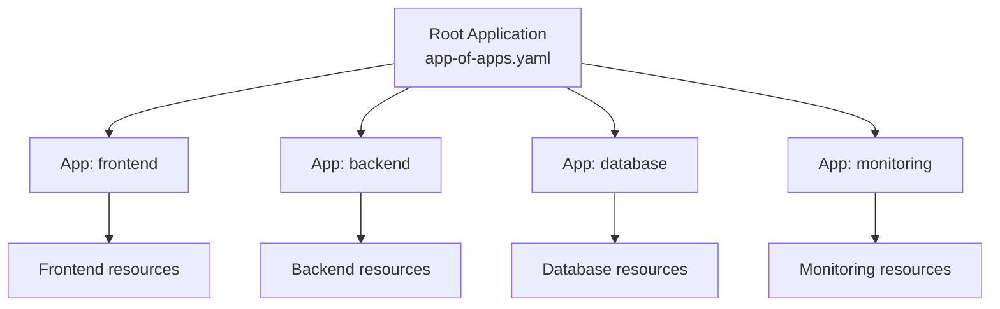

### 10.2.2 App of Apps, Helm/Kustomize, and Multi-Cluster: Scaling GitOps

#### Why These Patterns Matter

As you add more applications, managing each Application resource individually becomes cumbersome. The **App of Apps** pattern lets you manage hundreds of applications declaratively. Integration with Helm and Kustomize leverages existing tooling. Multi-cluster management enables central control.

This note covers scaling patterns. Note 10.2.1 covered Applications and sync; note 10.2.3 is the final review.

**Backward references:** Helm from Module 5 (charts, values); Kustomize from Module 5 (overlays, patches); Kubernetes from Module 5 (multiple clusters); Git from Module 6 (repository structure).

---

## Part 1: App of Apps Pattern

The App of Apps pattern creates one "root" Application that defines other Applications.



### Directory Structure

```
config/
├── apps/
│   ├── frontend/
│   │   └── application.yaml
│   ├── backend/
│   │   └── application.yaml
│   ├── database/
│   │   └── application.yaml
│   └── monitoring/
│       └── application.yaml
└── bootstrap/
    └── app-of-apps.yaml
```

### Root Application (App of Apps)

```yaml
# bootstrap/app-of-apps.yaml
apiVersion: argoproj.io/v1alpha1
kind: Application
metadata:
  name: app-of-apps
  namespace: argocd
spec:
  project: default
  source:
    repoURL: https://github.com/myorg/infrastructure.git
    targetRevision: main
    path: apps  # Directory containing child Applications
  destination:
    server: https://kubernetes.default.svc
    namespace: argocd
  syncPolicy:
    automated:
      prune: true
      selfHeal: true
```

### Child Application Example

```yaml
# apps/frontend/application.yaml
apiVersion: argoproj.io/v1alpha1
kind: Application
metadata:
  name: frontend
  namespace: argocd
spec:
  project: default
  source:
    repoURL: https://github.com/myorg/infrastructure.git
    targetRevision: main
    path: manifests/frontend/overlays/prod
  destination:
    server: https://kubernetes.default.svc
    namespace: frontend
  syncPolicy:
    automated:
      prune: true
      selfHeal: true
```

### Installing App of Apps

```bash
# One command deploys everything
kubectl apply -f bootstrap/app-of-apps.yaml

# ArgoCD will create all child Applications
argocd app list
# app-of-apps       Synced
# frontend          Synced
# backend           Synced
# database          Synced
# monitoring        Synced
```

---

## Part 2: Helm Integration

### Helm Chart as Source

```yaml
# app-with-helm.yaml
apiVersion: argoproj.io/v1alpha1
kind: Application
metadata:
  name: myapp
spec:
  source:
    repoURL: https://github.com/myorg/charts.git
    targetRevision: main
    path: myapp-chart  # Chart directory
    helm:
      # Values file
      valueFiles:
      - values-prod.yaml
      - values-extra.yaml
      
      # Inline values
      values: |
        image:
          tag: v2.0.0
        replicas: 3
      
      # Parameters (overrides)
      parameters:
      - name: image.tag
        value: v2.1.0
      - name: resources.limits.cpu
        value: "500m"
      
      # Release name override
      releaseName: myapp-prod
      
      # Skip schema validation
      skipCrds: false
```

### Helm from External Repository

```yaml
# app-from-helm-repo.yaml
apiVersion: argoproj.io/v1alpha1
kind: Application
metadata:
  name: nginx-ingress
spec:
  source:
    repoURL: https://kubernetes.github.io/ingress-nginx
    chart: ingress-nginx
    targetRevision: 4.9.0
    helm:
      values: |
        controller:
          replicaCount: 3
          service:
            type: LoadBalancer
  destination:
    server: https://kubernetes.default.svc
    namespace: ingress-nginx
```

### Helm Values Files per Environment

```
config/
├── base/
│   └── values.yaml           # Common values
├── overlays/
│   ├── dev/
│   │   └── values.yaml       # Dev overrides
│   ├── staging/
│   │   └── values.yaml       # Staging overrides
│   └── prod/
│       └── values.yaml       # Prod overrides
```

```yaml
# app-dev.yaml
spec:
  source:
    helm:
      valueFiles:
      - $values/base/values.yaml
      - $values/overlays/dev/values.yaml
```

---

## Part 3: Kustomize Integration

### Kustomize Application

```yaml
# app-with-kustomize.yaml
apiVersion: argoproj.io/v1alpha1
kind: Application
metadata:
  name: myapp
spec:
  source:
    repoURL: https://github.com/myorg/config.git
    targetRevision: main
    path: k8s/overlays/prod  # Kustomize overlay directory
    kustomize:
      # Images to override
      images:
      - myapp=myapp:v2.0.0
      - sidecar=sidecar:latest
      
      # Common labels
      commonLabels:
        environment: production
        managed-by: argocd
      
      # Common annotations
      commonAnnotations:
        prometheus.io/scrape: "true"
      
      # Name prefix
      namePrefix: prod-
      
      # Name suffix
      nameSuffix: -v2
      
      # Force common labels
      forceCommonLabels: true
```

### Kustomize Overlays per Environment

```
k8s/
├── base/
│   ├── deployment.yaml
│   ├── service.yaml
│   └── kustomization.yaml
└── overlays/
    ├── dev/
    │   └── kustomization.yaml
    ├── staging/
    │   └── kustomization.yaml
    └── prod/
        └── kustomization.yaml
```

```yaml
# overlays/prod/kustomization.yaml
apiVersion: kustomize.config.k8s.io/v1beta1
kind: Kustomization

resources:
- ../../base

patches:
- target:
    kind: Deployment
    name: myapp
  patch: |
    - op: replace
      path: /spec/replicas
      value: 10

images:
- name: myapp
  newTag: v2.0.0

commonLabels:
  environment: production
```

---

## Part 4: Multi-Cluster Management

### Cluster Registration

```bash
# List available contexts
kubectl config get-contexts

# Add clusters to ArgoCD
argocd cluster add dev-context --name dev
argocd cluster add staging-context --name staging
argocd cluster add prod-us-context --name prod-us
argocd cluster add prod-eu-context --name prod-eu

# Verify clusters
argocd cluster list
# SERVER                          NAME        VERSION
# https://dev-k8s:6443            dev         v1.29
# https://staging-k8s:6443        staging     v1.29
# https://prod-us-k8s:6443        prod-us     v1.29
# https://prod-eu-k8s:6443        prod-eu     v1.29
```

### Deploy to Multiple Clusters

```yaml
# app-multi-cluster.yaml
apiVersion: argoproj.io/v1alpha1
kind: Application
metadata:
  name: myapp-prod-us
  namespace: argocd
spec:
  destination:
    server: https://prod-us-k8s:6443
    namespace: myapp
  source:
    repoURL: https://github.com/myorg/config.git
    targetRevision: main
    path: k8s/overlays/prod-us
---
apiVersion: argoproj.io/v1alpha1
kind: Application
metadata:
  name: myapp-prod-eu
  namespace: argocd
spec:
  destination:
    server: https://prod-eu-k8s:6443
    namespace: myapp
  source:
    repoURL: https://github.com/myorg/config.git
    targetRevision: main
    path: k8s/overlays/prod-eu
```

### Cluster-Specific Overlays

```
k8s/
├── base/
│   ├── deployment.yaml
│   └── service.yaml
└── overlays/
    ├── prod-us/
    │   ├── kustomization.yaml
    │   └── us-specific-config.yaml
    ├── prod-eu/
    │   ├── kustomization.yaml
    │   └── eu-specific-config.yaml
    └── prod-asia/
        ├── kustomization.yaml
        └── asia-specific-config.yaml
```

---

## Part 5: Projects – Organizing Applications

Projects group applications and enforce policies.

```yaml
# project.yaml
apiVersion: argoproj.io/v1alpha1
kind: AppProject
metadata:
  name: production
  namespace: argocd
spec:
  description: "Production applications"
  
  # Source repositories allowed
  sourceRepos:
  - https://github.com/myorg/production-config.git
  
  # Destination clusters allowed
  destinations:
  - namespace: prod-*
    server: https://prod-k8s:6443
  - namespace: prod-*
    server: https://prod-eu-k8s:6443
  
  # Roles
  roles:
  - name: team-lead
    policies:
    - p, proj:production:team-lead, applications, sync, */*, allow
    - p, proj:production:team-lead, applications, get, */*, allow
    groups:
    - myorg:team-leads
  
  # Sync windows
  syncWindows:
  - kind: deny
    schedule: "0 18 * * *"
    duration: "12h"
    applications:
    - "*-prod"
  
  # Cluster resource whitelist
  clusterResourceWhitelist:
  - group: "*"
    kind: Namespace
  - group: apiextensions.k8s.io
    kind: CustomResourceDefinition
```

### Using Project in Application

```yaml
apiVersion: argoproj.io/v1alpha1
kind: Application
metadata:
  name: myapp-prod
spec:
  project: production  # Reference the project
  # ... rest of spec
```

---

## Part 6: ApplicationSet – Managing Multiple Applications

ApplicationSet generates multiple Applications from a template.

```yaml
# applicationset.yaml
apiVersion: argoproj.io/v1alpha1
kind: ApplicationSet
metadata:
  name: multi-region
  namespace: argocd
spec:
  generators:
  - list:
      elements:
      - cluster: prod-us
        url: https://prod-us-k8s:6443
        namespace: myapp
      - cluster: prod-eu
        url: https://prod-eu-k8s:6443
        namespace: myapp
      - cluster: prod-asia
        url: https://prod-asia-k8s:6443
        namespace: myapp
  
  template:
    metadata:
      name: 'myapp-{{cluster}}'
    spec:
      project: production
      source:
        repoURL: https://github.com/myorg/config.git
        targetRevision: main
        path: k8s/overlays/{{cluster}}
      destination:
        server: '{{url}}'
        namespace: '{{namespace}}'
      syncPolicy:
        automated:
          prune: true
          selfHeal: true
```

### Git Generator (App of Apps Alternative)

```yaml
# applicationset-git.yaml
apiVersion: argoproj.io/v1alpha1
kind: ApplicationSet
metadata:
  name: apps-from-git
spec:
  generators:
  - git:
      repoURL: https://github.com/myorg/infrastructure.git
      revision: main
      directories:
      - path: apps/*  # Each subdirectory becomes an Application
  template:
    metadata:
      name: '{{path.basename}}'
    spec:
      source:
        repoURL: https://github.com/myorg/infrastructure.git
        targetRevision: main
        path: '{{path}}'
      destination:
        server: https://kubernetes.default.svc
        namespace: '{{path.basename}}'
```

---

## Part 7: Complete Production Setup

### Directory Structure

```
infrastructure/
├── bootstrap/
│   └── app-of-apps.yaml
├── apps/
│   ├── frontend/
│   │   └── application.yaml
│   ├── backend/
│   │   └── application.yaml
│   ├── database/
│   │   └── application.yaml
│   └── monitoring/
│       └── application.yaml
├── projects/
│   ├── production.yaml
│   └── development.yaml
└── clusters/
    ├── dev/
    │   └── cluster-secret.yaml
    ├── staging/
    │   └── cluster-secret.yaml
    └── prod/
        ├── prod-us/
        │   └── cluster-secret.yaml
        ├── prod-eu/
        │   └── cluster-secret.yaml
        └── prod-asia/
            └── cluster-secret.yaml
```

### Root Bootstrap

```yaml
# bootstrap/app-of-apps.yaml
apiVersion: argoproj.io/v1alpha1
kind: Application
metadata:
  name: infrastructure
  namespace: argocd
spec:
  project: default
  source:
    repoURL: https://github.com/myorg/infrastructure.git
    targetRevision: main
    path: apps
  destination:
    server: https://kubernetes.default.svc
    namespace: argocd
  syncPolicy:
    automated:
      prune: true
      selfHeal: true
```

### One-Time Bootstrap

```bash
# Step 1: Install ArgoCD
kubectl create namespace argocd
kubectl apply -n argocd -f https://raw.githubusercontent.com/argoproj/argo-cd/stable/manifests/install.yaml

# Step 2: Add cluster secrets (if multi-cluster)
kubectl apply -f clusters/dev/cluster-secret.yaml
kubectl apply -f clusters/staging/cluster-secret.yaml
kubectl apply -f clusters/prod/prod-us/cluster-secret.yaml

# Step 3: Apply projects
kubectl apply -f projects/production.yaml
kubectl apply -f projects/development.yaml

# Step 4: Bootstrap App of Apps
kubectl apply -f bootstrap/app-of-apps.yaml

# Everything else is managed by ArgoCD automatically!
```

---

## Quick Task: Create App of Apps

*Create a simple App of Apps structure.*

1. Create a root Application that points to a directory of child Applications.
2. Create at least 2 child Applications.
3. Apply the root Application.
4. Verify all child Applications are created.

> **Ready Solution:**
>
> ```yaml
> # bootstrap/app-of-apps.yaml
> apiVersion: argoproj.io/v1alpha1
> kind: Application
> metadata:
>   name: my-apps
>   namespace: argocd
> spec:
>   source:
>     repoURL: https://github.com/myorg/my-config.git
>     targetRevision: main
>     path: apps
>   destination:
>     server: https://kubernetes.default.svc
>     namespace: argocd
>   syncPolicy:
>     automated:
>       prune: true
>       selfHeal: true
> ```
>
> ```yaml
> # apps/app1.yaml
> apiVersion: argoproj.io/v1alpha1
> kind: Application
> metadata:
>   name: app1
>   namespace: argocd
> spec:
>   source:
>     repoURL: https://github.com/myorg/my-config.git
>     targetRevision: main
>     path: manifests/app1
>   destination:
>     server: https://kubernetes.default.svc
>     namespace: app1
> ```
>
> ```yaml
> # apps/app2.yaml
> apiVersion: argoproj.io/v1alpha1
> kind: Application
> metadata:
>   name: app2
>   namespace: argocd
> spec:
>   source:
>     repoURL: https://github.com/myorg/my-config.git
>     targetRevision: main
>     path: manifests/app2
>   destination:
>     server: https://kubernetes.default.svc
>     namespace: app2
> ```
>
> ```bash
> kubectl apply -f bootstrap/app-of-apps.yaml
> argocd app list
> ```

---

## Summary Table: Scaling Patterns

| Pattern | Description | Use Case |
|---------|-------------|----------|
| **App of Apps** | Root Application manages child Applications | Many applications |
| **Projects** | Group applications with policies | Team separation |
| **ApplicationSet** | Generate Applications from templates | Multi-cluster, multi-region |
| **Helm** | Use Helm charts as source | Package management |
| **Kustomize** | Use Kustomize overlays | Environment customization |

### Helm vs Kustomize in ArgoCD

| Feature | Helm | Kustomize |
|---------|------|-----------|
| **Values files** | Yes (`valueFiles`) | No (uses patches) |
| **Remote charts** | Yes | No |
| **Overlays** | Via multiple value files | Native |
| **Complexity** | Higher | Lower |
| **Best for** | Third-party apps, complex configs | Internal apps, simple overlays |

### Multi-Cluster Commands

| Command | Purpose |
|---------|---------|
| `argocd cluster add <ctx>` | Add cluster from kubeconfig |
| `argocd cluster list` | List registered clusters |
| `argocd cluster rm <name>` | Remove cluster |
| `kubectl apply -f cluster-secret.yaml` | Add cluster via secret |

---

**Next note (10.2.3)** will be the Subchapter Review for ArgoCD Applications, Sync, and Progressive Delivery, plus the **Final Exam for Module 10** covering all GitOps and ArgoCD topics – the conclusion of the entire handbook.

**Backward references:**
- Helm from Module 5 (charts, values)
- Kustomize from Module 5 (overlays, patches)
- Kubernetes from Module 5 (multiple clusters)
- Git from Module 6 (repository structure)
