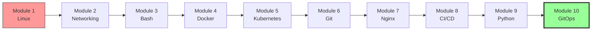

### 10.2.3 Subchapter Review Plus Final Exam: The Journey's End

This review covers only the material presented in Notes 10.2.1 (Applications, Sync Policies, and Rollbacks) and 10.2.2 (App of Apps, Helm/Kustomize, and Multi-Cluster). This note also serves as the **final review for Module 10** with a comprehensive exam covering all GitOps and ArgoCD topics.

---

## Cheatsheet: ArgoCD Applications and Scaling

### Application CRD

```yaml
apiVersion: argoproj.io/v1alpha1
kind: Application
metadata:
  name: myapp
  namespace: argocd
spec:
  source:
    repoURL: https://github.com/myorg/config.git
    targetRevision: main
    path: k8s/overlays/prod
  destination:
    server: https://kubernetes.default.svc
    namespace: myapp
  syncPolicy:
    automated:
      prune: true
      selfHeal: true
```

### Sync Policies

| Policy | Behavior |
|--------|----------|
| Manual | User must trigger sync |
| Automated | Auto-sync on Git change |
| Prune | Delete resources not in Git |
| SelfHeal | Correct manual changes |

### Sync Status

| Status | Meaning |
|--------|---------|
| Synced | Git = Cluster |
| OutOfSync | Git ≠ Cluster |
| Unknown | Status unknown |

### Health Status

| Status | Meaning |
|--------|---------|
| Healthy | Working correctly |
| Progressing | Being created/updated |
| Degraded | Has problems |
| Missing | Not found |

### Resource Hooks

| Hook | Timing |
|------|--------|
| PreSync | Before sync |
| Sync | During sync (default) |
| PostSync | After successful sync |
| SyncFail | On sync failure |

### App of Apps Pattern

```yaml
# Root Application
apiVersion: argoproj.io/v1alpha1
kind: Application
metadata:
  name: app-of-apps
spec:
  source:
    path: apps  # Directory of child Applications
```

### Helm Integration

```yaml
spec:
  source:
    helm:
      valueFiles:
      - values-prod.yaml
      values: |
        image.tag: v2.0.0
      parameters:
      - name: image.tag
        value: v2.1.0
```

### Kustomize Integration

```yaml
spec:
  source:
    kustomize:
      images:
      - myapp=myapp:v2.0.0
      commonLabels:
        environment: production
      namePrefix: prod-
```

### Multi-Cluster Commands

| Command | Purpose |
|---------|---------|
| `argocd cluster add <ctx>` | Add cluster |
| `argocd cluster list` | List clusters |
| `argocd cluster rm <name>` | Remove cluster |

### Ignore Differences (HPA-Safe Pattern)

```yaml
ignoreDifferences:
- group: apps
  kind: Deployment
  managedFieldsManagers:
  - kube-controller-manager    # HPA replicas
  jqPathExpressions:
  - .spec.template.spec.initContainers  # Istio sidecar
```

### Secrets Management in GitOps

| Solution | Secrets In Git? | Best For |
|----------|----------------|----------|
| **Sealed Secrets** | ✅ Encrypted | Simple setups |
| **External Secrets (ESO)** | ❌ References only | Cloud-native, auto-rotation |
| **SOPS** | ✅ Encrypted | Teams wanting encrypted Git |
| **Vault CSI** | ❌ Injected at runtime | Enterprise Vault-first |

### ApplicationSet Generator

```yaml
spec:
  generators:
  - list:
      elements:
      - cluster: prod-us
        url: https://prod-us-k8s:6443
```

---

## Comparison Tables

### App of Apps vs ApplicationSet

| Feature | App of Apps | ApplicationSet |
|---------|-------------|----------------|
| **Use case** | Static list of apps | Dynamic generation |
| **Generators** | No | Git, List, Cluster, Matrix, Merge |
| **Scalability** | Good | Excellent |
| **Complexity** | Low | Medium |
| **Best for** | Known set of apps | Multi-cluster, many apps |

### ApplicationSet Generators

| Generator | Use Case |
|-----------|----------|
| **list** | Known set of values |
| **git** | Directories/files in repo |
| **clusters** | Auto-discover registered clusters |
| **matrix** | Cartesian product (apps × clusters) |
| **merge** | Combine + override multiple generators |
| **pullRequest** | PR-based preview environments |

### Helm vs Kustomize in ArgoCD

| Feature | Helm | Kustomize |
|---------|------|-----------|
| **Values files** | Yes | No |
| **Remote charts** | Yes | No |
| **Overlays** | Via multiple value files | Native |
| **Complexity** | Higher | Lower |
| **Best for** | Third-party apps | Internal apps |

### Sync Options

| Option | Purpose |
|--------|---------|
| `CreateNamespace=true` | Auto-create namespace |
| `PrunePropagationPolicy=foreground` | Delete resources in foreground |
| `PruneLast=true` | Prune after sync |
| `ApplyOutOfSyncOnly=true` | Only apply out-of-sync resources |

---

## Module 10 Final Exam

This exam tests knowledge from **both subchapters** of Module 10. These questions represent the culmination of your entire platform engineering journey.

---

### Question 1: GitOps Migration (15 minutes)

**Scenario:** A team currently uses Jenkins to run `kubectl apply` for every deployment. They want to migrate to GitOps with ArgoCD.

**Questions:**
1. What changes are needed in the Jenkins pipeline?
2. What needs to be configured in ArgoCD?
3. How do you ensure a smooth transition without downtime?

**Answer:**

**1. Jenkins pipeline changes:**
- Remove `kubectl apply` commands
- Add image build and push
- Add Git commit to update manifest
```groovy
// Before
stage('Deploy') {
    sh 'kubectl apply -f k8s/deployment.yaml'
}

// After
stage('Update Manifest') {
    sh '''
        sed -i "s|image: myapp:.*|image: myapp:${IMAGE_TAG}|" k8s/deployment.yaml
        git add k8s/deployment.yaml
        git commit -m "Update image to ${IMAGE_TAG}"
        git push
    '''
}
```

**2. ArgoCD configuration:**
- Install ArgoCD in cluster
- Configure Git repository access
- Create Application resources
- Set sync policy to automated

**3. Smooth transition (phased):**

**Phase 1: Shadow mode**
```yaml
syncPolicy: {}  # No automated sync
```
- Jenkins still deploys
- ArgoCD shows diff but doesn't apply
- Team learns ArgoCD UI

**Phase 2: Canary app**
- Migrate one non-critical app
- Remove from Jenkins
- Enable ArgoCD auto-sync

**Phase 3: Full migration**
- Migrate remaining apps
- Disable direct kubectl access
- Jenkins only builds images

---

### Question 2: Rollback Scenarios (10 minutes)

**Scenario:** A bad deployment (v2.0.0) was released. Users are experiencing errors. The previous working version was v1.9.0.

**Questions:**
1. How do you rollback using Git?
2. How do you rollback using ArgoCD CLI?
3. What happens to the Git history after rollback?

**Answer:**

**1. Rollback using Git:**
```bash
# Find the commit that introduced v2.0.0
git log --oneline k8s/overlays/prod/deployment.yaml
# a1b2c3d Update image to v2.0.0
# e4f5g6h Update image to v1.9.0

# Revert the bad commit
git revert a1b2c3d
git push

# ArgoCD auto-syncs (if automated) or manual sync
argocd app sync myapp
```

**2. Rollback using ArgoCD CLI:**
```bash
# View history
argocd app history myapp
# ID  DATE       REVISION
# 3   2024-01-15 a1b2c3d v2.0.0
# 2   2024-01-14 e4f5g6h v1.9.0
# 1   2024-01-13 i7j8k9l v1.8.0

# Rollback to revision 2
argocd app rollback myapp 2
```

**3. Git history after rollback:**
```bash
git log --oneline
# f6g7h8i Revert "Update image to v2.0.0"  (new revert commit)
# a1b2c3d Update image to v2.0.0
# e4f5g6h Update image to v1.9.0
```
- Original commits remain (audit trail)
- New revert commit is added
- Full history preserved

---

### Question 3: Multi-Cluster Management (15 minutes)

**Scenario:** A company has 3 production clusters (US, EU, Asia) and wants to manage all from a single ArgoCD instance.

**Questions:**
1. How do you register each cluster with ArgoCD?
2. How do you deploy the same application to all clusters?
3. How do you handle cluster-specific configurations?

**Answer:**

**1. Register clusters:**
```bash
# Add each cluster context
argocd cluster add prod-us-context --name prod-us
argocd cluster add prod-eu-context --name prod-eu
argocd cluster add prod-asia-context --name prod-asia

# Verify
argocd cluster list
```

**2. Deploy to all clusters (using ApplicationSet):**
```yaml
apiVersion: argoproj.io/v1alpha1
kind: ApplicationSet
metadata:
  name: myapp-multi-region
spec:
  generators:
  - list:
      elements:
      - cluster: prod-us
        url: https://prod-us-k8s:6443
        region: us
      - cluster: prod-eu
        url: https://prod-eu-k8s:6443
        region: eu
      - cluster: prod-asia
        url: https://prod-asia-k8s:6443
        region: asia
  template:
    metadata:
      name: 'myapp-{{cluster}}'
    spec:
      source:
        repoURL: https://github.com/myorg/config.git
        path: k8s/overlays/{{region}}
      destination:
        server: '{{url}}'
        namespace: myapp
```

**3. Cluster-specific configurations (directory structure):**
```
k8s/overlays/
├── us/
│   ├── kustomization.yaml
│   └── us-specific-config.yaml
├── eu/
│   ├── kustomization.yaml
│   └── eu-specific-config.yaml
└── asia/
    ├── kustomization.yaml
    └── asia-specific-config.yaml
```

```yaml
# overlays/us/kustomization.yaml
apiVersion: kustomize.config.k8s.io/v1beta1
kind: Kustomization
resources:
- ../../base
configMapGenerator:
- name: region-config
  literals:
  - region=us
  - endpoint=api.us.example.com
```

---

### Question 4: Drift Detection (10 minutes)

**Scenario:** A developer manually changes a deployment replica count from 3 to 5 using `kubectl scale`. ArgoCD corrects it back to 3.

**Questions:**
1. Why did ArgoCD revert the change?
2. How can you check what ArgoCD will change?
3. How can you temporarily allow manual changes for debugging?

**Answer:**

**1. Why ArgoCD reverted:** ArgoCD has `selfHeal: true` configured. It continuously reconciles the cluster state with Git. When drift is detected, it reapplies the desired state from Git.

**2. Check what ArgoCD will change:**
```bash
# CLI method
argocd app diff myapp

# UI method
# Application → myapp → Diff tab

# kubectl method
kubectl get deployment myapp -o yaml > live.yaml
kubectl get -f deployment.yaml -o yaml > desired.yaml
diff live.yaml desired.yaml
```

**3. Temporarily allow manual changes:**
```bash
# Pause auto-sync temporarily
argocd app set myapp --sync-policy none

# Make manual changes
kubectl scale deployment myapp --replicas=5

# Debug...
# After debugging, resume auto-sync
argocd app set myapp --sync-policy automated
argocd app sync myapp  # Resyncs to Git state
```

**Alternative: Use ephemeral debug deployment**
```bash
# Better practice: create separate debug deployment
kubectl run debug-pod --image=busybox -it --rm -- /bin/sh
```

---

### Question 5: App of Apps Design (15 minutes)

**Scenario:** A team has 20 microservices, each with dev/staging/prod environments. They want to manage all with ArgoCD.

**Questions:**
1. Design a directory structure for this setup.
2. How does the App of Apps pattern help?
3. Write the root Application YAML.

**Answer:**

**1. Directory structure:**
```
infrastructure/
├── bootstrap/
│   └── app-of-apps.yaml
├── apps/
│   ├── service-a/
│   │   ├── application-dev.yaml
│   │   ├── application-staging.yaml
│   │   └── application-prod.yaml
│   ├── service-b/
│   │   ├── application-dev.yaml
│   │   ├── application-staging.yaml
│   │   └── application-prod.yaml
│   └── ... (20 services)
├── environments/
│   ├── dev/
│   │   └── kustomization.yaml
│   ├── staging/
│   │   └── kustomization.yaml
│   └── prod/
│       └── kustomization.yaml
└── manifests/
    ├── service-a/
    │   ├── base/
    │   └── overlays/
    └── service-b/
        ├── base/
        └── overlays/
```

**2. How App of Apps helps:**
- Single root Application manages all 60 child Applications
- Add new service: just add file to `apps/` directory
- No need to manually apply each Application
- Consistent structure across all services

**3. Root Application YAML:**
```yaml
# bootstrap/app-of-apps.yaml
apiVersion: argoproj.io/v1alpha1
kind: Application
metadata:
  name: all-apps
  namespace: argocd
spec:
  project: default
  source:
    repoURL: https://github.com/myorg/infrastructure.git
    targetRevision: main
    path: apps  # Directory containing all child Applications
  destination:
    server: https://kubernetes.default.svc
    namespace: argocd
  syncPolicy:
    automated:
      prune: true
      selfHeal: true
    syncOptions:
    - CreateNamespace=true
```

**Example child Application:**
```yaml
# apps/service-a/application-prod.yaml
apiVersion: argoproj.io/v1alpha1
kind: Application
metadata:
  name: service-a-prod
  namespace: argocd
spec:
  project: production
  source:
    repoURL: https://github.com/myorg/infrastructure.git
    targetRevision: main
    path: manifests/service-a/overlays/prod
  destination:
    server: https://prod-k8s:6443
    namespace: service-a
  syncPolicy:
    automated:
      prune: true
      selfHeal: true
```

---

### Question 6: Disaster Recovery Runbook (15 minutes)

**Scenario:** Your primary Kubernetes cluster suffered a catastrophic failure (cloud provider outage). You need to restore all applications on a new cluster. You use GitOps with ArgoCD.

**Question:** Walk through the complete disaster recovery process. What state lives outside Git that you need to handle separately?

**Answer:**

**Step 1: Provision new cluster**
```bash
# Create new cluster (example: EKS)
eksctl create cluster --name recovery-cluster --region us-west-2

# Or use Terraform
terraform apply -var="cluster_name=recovery-cluster"
```

**Step 2: Install ArgoCD**
```bash
kubectl create namespace argocd
kubectl apply -n argocd -f https://raw.githubusercontent.com/argoproj/argo-cd/stable/manifests/ha/install.yaml
kubectl wait --for=condition=ready pod --all -n argocd --timeout=300s
```

**Step 3: Restore ArgoCD configuration**
```bash
# If you backed up ArgoCD config (recommended)
# Restore repo credentials, cluster secrets, projects
kubectl apply -f backup/argocd-repos/
kubectl apply -f backup/argocd-projects/
kubectl apply -f backup/argocd-rbac/

# If no backup, re-configure manually
argocd repo add https://github.com/myorg/config.git --ssh-private-key-path ~/.ssh/id_rsa
kubectl apply -f projects/production.yaml
```

**Step 4: Bootstrap App of Apps**
```bash
# This single command recreates ALL applications
kubectl apply -f bootstrap/app-of-apps.yaml

# ArgoCD syncs everything from Git automatically
argocd app list
# All apps appear and begin syncing
```

**Step 5: Handle state OUTSIDE Git**

| State Type | Lives In | Recovery Method |
|------------|----------|-----------------|
| **Persistent Volumes (PVCs)** | Cloud storage (EBS, PD) | Restore from snapshots |
| **Databases** | RDS, Cloud SQL, etc. | Point-in-time recovery from backups |
| **Secrets** | AWS Secrets Manager, Vault | External Secrets Operator re-syncs automatically |
| **TLS Certificates** | Let's Encrypt, ACM | Cert-manager re-issues automatically |
| **DNS records** | Route53, Cloud DNS | External-DNS re-creates from Ingress |
| **Load balancer IPs** | Cloud provider | New IPs → update DNS (or use elastic IPs) |

```bash
# Step 5a: Restore database from backup
aws rds restore-db-instance-to-point-in-time \
  --source-db-instance-identifier prod-db \
  --target-db-instance-identifier recovery-db \
  --restore-time "2024-01-15T12:00:00Z"

# Step 5b: Restore PVC snapshots
kubectl apply -f - <<EOF
apiVersion: v1
kind: PersistentVolumeClaim
metadata:
  name: data-pvc
spec:
  dataSource:
    name: data-snapshot-20240115
    kind: VolumeSnapshot
    apiGroup: snapshot.storage.k8s.io
EOF
```

**Step 6: Verify and cutover**
```bash
# Verify all apps are synced and healthy
argocd app list
# NAME          SYNC    HEALTH
# frontend      Synced  Healthy
# backend       Synced  Healthy
# database      Synced  Healthy

# Update DNS to point to new cluster
aws route53 change-resource-record-sets ...

# Monitor traffic
kubectl top pods --all-namespaces
```

**Recovery timeline (with GitOps):**

| Step | Time | Without GitOps |
|------|------|---------------|
| Provision cluster | 15 min | 15 min |
| Install ArgoCD | 5 min | N/A |
| Bootstrap all apps | 10 min | **2-4 hours** (manually redeploy each app) |
| Restore data | 30 min | 30 min |
| DNS cutover | 5 min | 5 min |
| **Total** | **~1 hour** | **~3-5 hours** |

**What to back up proactively:**

```bash
# ArgoCD backup script (run daily via CronJob)
#!/bin/bash
# Back up ArgoCD configuration
kubectl get applications -n argocd -o yaml > backup/applications.yaml
kubectl get appprojects -n argocd -o yaml > backup/projects.yaml
kubectl get secrets -n argocd -l argocd.argoproj.io/secret-type=repository -o yaml > backup/repos.yaml
kubectl get configmaps -n argocd -o yaml > backup/configmaps.yaml

# Back up to S3
aws s3 sync backup/ s3://my-backup-bucket/argocd/$(date +%Y-%m-%d)/
```

> **Key insight:** GitOps reduces DR time from hours to ~1 hour because Git already contains the desired state of every application. The only thing you can't recover from Git is **data** (databases, persistent volumes) — that requires separate backup strategy.

---

## The Journey Complete

Congratulations! You have completed all 10 modules of the **Ultimate Platform Engineering Handbook**.



### What You've Learned

| Module | Key Skills |
|--------|------------|
| **1: Linux** | CLI, filesystem, processes, systemd, package management, text processing |
| **2: Networking** | OSI model, IP addressing, DNS, tcpdump, iptables, HTTP, load balancing |
| **3: Bash** | Variables, conditionals, loops, functions, error handling, regex |
| **4: Docker** | Namespaces, cgroups, Dockerfiles, images, containers, networking, volumes, Compose |
| **5: Kubernetes** | Architecture, pods, deployments, services, ingress, storage, security, Helm, Kustomize |
| **6: Git** | Objects, branches, merging, rebasing, workflows, undoing mistakes, LFS, submodules |
| **7: Nginx** | Architecture, static serving, reverse proxy, load balancing, SSL, caching, rate limiting |
| **8: CI/CD** | Pipeline stages, GitHub Actions, deployment strategies, security scanning |
| **9: Python** | Data types, functions, file I/O, subprocess, argparse, logging, requests, pytest |
| **10: GitOps** | Principles, ArgoCD, applications, sync policies, rollbacks, multi-cluster, Helm/Kustomize |

### Next Steps

1. **Practice** – Set up your own clusters, write automation, build pipelines
2. **Certifications** – CKA, CKAD, CKS, AWS/GCP/Azure certifications
3. **Open Source** – Contribute to CNCF projects (Kubernetes, ArgoCD, Prometheus)
4. **Community** – Join meetups, Slack channels, conferences (KubeCon)
5. **Build** – Create your own platform engineering tools and share them

### Final Words

You started with Linux commands and ended with GitOps. You've learned the entire platform engineering stack – from the kernel to the cloud. This handbook is your reference, but the real learning happens when you build, break, and fix things.

**Go build something amazing.**

---

## Module 10 Completion Checklist

| Skill Area | Specific Task | Self-Assessment |
|------------|---------------|-----------------|
| **GitOps Principles** | Explain push vs pull CI/CD | ☐ |
| **Repo Strategy** | Choose monorepo vs polyrepo with justification | ☐ |
| **ArgoCD Installation** | Install ArgoCD in cluster | ☐ |
| **Notifications** | Configure Slack alerts for sync failures | ☐ |
| **Applications** | Create and sync Application | ☐ |
| **Sync Policies** | Configure automated sync with prune/self-heal | ☐ |
| **Ignore Differences** | Handle HPA conflicts with `managedFieldsManagers` | ☐ |
| **Sync Retry** | Configure retry with appropriate backoff | ☐ |
| **Rollbacks** | Rollback via Git and CLI | ☐ |
| **Resource Hooks** | Add pre-sync job for migrations | ☐ |
| **App of Apps** | Create root Application managing children | ☐ |
| **Helm Integration** | Deploy Helm chart via ArgoCD | ☐ |
| **Kustomize Integration** | Deploy Kustomize overlay via ArgoCD | ☐ |
| **Multi-Cluster** | Register multiple clusters | ☐ |
| **ApplicationSet** | Use list, git, merge, and matrix generators | ☐ |
| **Secrets Management** | Implement Sealed Secrets or External Secrets | ☐ |
| **Projects** | Create project with policies | ☐ |
| **Monitoring** | Set up Prometheus metrics and alerts for ArgoCD | ☐ |
| **Disaster Recovery** | Execute full DR runbook from Git | ☐ |

---

**End of Module 10**

**End of the Ultimate Platform Engineering Handbook**

Thank you for completing this journey. You are now equipped with the skills of a Senior Platform Engineer. Go forth and build resilient, scalable, and secure platforms. 🚀
