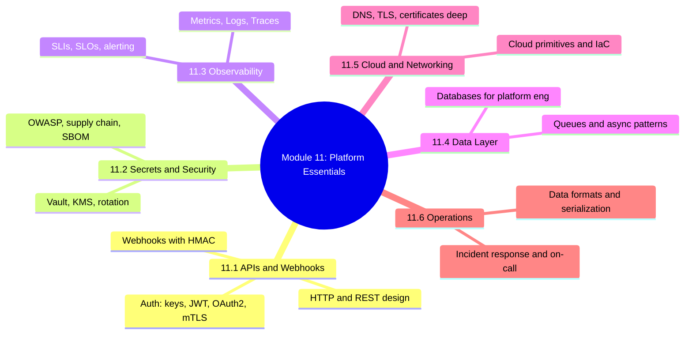
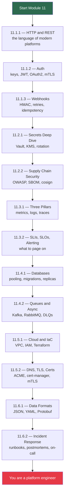

# Module 11 Approach Guide — Platform Engineer Essentials

## Module Overview

---

## Why This Module Exists

Modules 1–10 taught you the **tools** of platform engineering — Linux, networking, containers, Kubernetes, Git, CI/CD, GitOps. But a working platform engineer also needs a set of **cross-cutting skills** that don't belong to any single tool:

- Designing and consuming **HTTP APIs** all day, every day
- Handling **secrets** without leaking them into logs, images, or Git
- Knowing what to **measure** and when to **page someone at 3am**
- Talking sensibly about **databases and queues** even if you don't build them
- Understanding **cloud primitives** enough to review a Terraform PR
- Running a **blameless postmortem** after an outage

This module is the glue. It's not trying to replace a 600-page book on any one topic — it gives you the **mental model + the daily-driver knowledge + backlinks** to go deeper.

> **Position in the playbook:** Treat Module 11 as either (a) a finishing module after you complete 1–10, or (b) a reference you dip into whenever a concept comes up on the job. Both work.

---

## Who Is This Module For?

- **Junior engineers** who finished Modules 1–10 and want to round out their breadth
- **Mid-level DevOps engineers** moving into "platform engineer" roles (APIs, observability, on-call)
- **Anyone reviewing for SRE / Platform Engineer interviews** — the topics here appear in almost every system-design round

---

## Prerequisites

| Prerequisite | Required? | Notes |
|---|---|---|
| Module 2 (Networking) | **Yes** | HTTP, DNS, TLS chapters are referenced heavily |
| Module 4 (Docker) | **Yes** | Needed for image signing, SBOM, supply chain |
| Module 5 (Kubernetes) | **Recommended** | Observability and secrets examples use K8s |
| Module 9 (Python) | **Recommended** | Code examples are Python; skim if unfamiliar |
| Module 10 (GitOps) | **Recommended** | Secrets chapter builds on 10.0.1 secrets section |

---

## How to Approach This Module

---

## Time Budget

| Subchapter | Notes | Estimated time |
|---|---|---|
| 11.1 APIs and Webhooks | 3 | 6h |
| 11.2 Secrets and Security | 2 | 4h |
| 11.3 Observability | 2 | 5h |
| 11.4 Data Layer | 2 | 4h |
| 11.5 Cloud and Networking | 2 | 5h |
| 11.6 Operations | 2 | 3h |
| **Total** | **13** | **~27h** |

Realistic pace: **2–3 weeks part-time**, or one focused week if you already know half the topics.

---

## What You'll Be Able to Do After This Module

- Design a REST API that doesn't embarrass you in review
- Pick the right auth mechanism (and explain why) for any service
- Receive a webhook without getting pwned
- Explain to a developer why their secret shouldn't be in `values.yaml`
- Define SLIs and SLOs for a service and write an actionable alert
- Debug a slow query by looking at database metrics
- Choose between Kafka and RabbitMQ with real reasoning
- Read a Terraform module and spot the footguns
- Rotate a TLS cert without downtime
- Run a postmortem that makes the team better, not bitter

---

## Backlinks Into Earlier Modules

This module deliberately rewires earlier material into a platform engineer's worldview:

- **11.1 APIs** ↔ [2.4 HTTP](../2-Networking/Subchapter_2.4/) · [7.2 Reverse Proxy](../7-Nginx/Subchapter_7.2/) · [9.3 HTTP clients](../9-Python/Subchapter_9.3/)
- **11.1.2 Auth** ↔ [5.8 K8s RBAC](../5-Kubernetes/) · [8.2 CI Secrets](../8-CICD/)
- **11.2 Secrets** ↔ [10.0.1 GitOps Secrets](../10-GitOps-ArgoCD/Subchapter_10.0/10.0.1_GitOps_Mental_Model_and_Controller_Pattern.md)
- **11.3 Observability** ↔ [5.9 K8s Troubleshooting](../5-Kubernetes/)
- **11.5.2 TLS** ↔ [2.3 DNS & TLS](../2-Networking/Subchapter_2.3/)

---

## Ready? Start with [11.1.1 — HTTP and REST API Design](Subchapter_11.1/11.1.1_HTTP_and_REST_API_Design.md).
