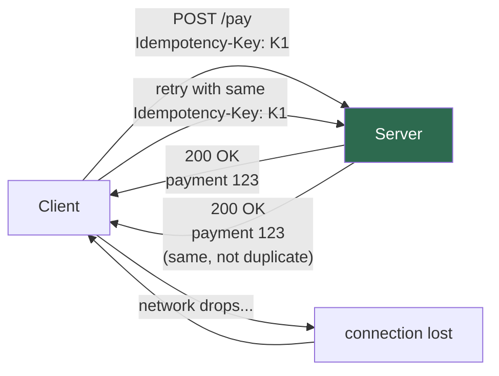

# 11.1.1 HTTP and REST API Design

**Backlinks:** [2.4 HTTP Basics](../../2-Networking/) · [7.2 Nginx Reverse Proxy](../../7-Nginx/) · [9.3 Python `requests`](../../9-Python/Subchapter_9.3/)

**Next note:** [11.1.2 — Authentication and Authorization](11.1.2_Authentication_and_Authorization.md)

---

## Why This Note Exists

Almost everything a platform engineer touches speaks HTTP:

- Kubernetes API server — HTTP + JSON
- ArgoCD, Grafana, Prometheus — all HTTP APIs underneath their UIs
- Webhooks from GitHub, Stripe, PagerDuty — incoming HTTP
- The services your developers ship — outgoing HTTP

If you're fuzzy on status codes, idempotency, or what `Content-Type: application/json; charset=utf-8` really means, you'll make small mistakes all day. This note fixes that in one sitting.

> **Tip:** Read this with `curl` open. Every example is runnable.

---

## Part 1: HTTP in 60 Seconds

An HTTP **request** has 4 parts:

```
POST /api/v1/users HTTP/1.1          ← method + path + version
Host: api.example.com                 ← headers
Authorization: Bearer abc123
Content-Type: application/json
                                      ← blank line
{"name": "Ada", "email": "a@b.com"}  ← body (optional)
```

An HTTP **response** has the same shape:

```
HTTP/1.1 201 Created                 ← status line
Location: /api/v1/users/42
Content-Type: application/json

{"id": 42, "name": "Ada"}
```

**Five things to internalize:**

1. HTTP is **stateless** — every request stands alone. Servers that need "state" use cookies, tokens, or sessions.
2. HTTP is **text-based** (HTTP/1.1). HTTP/2 and HTTP/3 are binary but the semantics are identical.
3. The **method + path** identifies what you want to do. The **headers** describe how. The **body** carries payload.
4. The **status code** is the primary result. The body is secondary.
5. Headers are **case-insensitive** in name, but values are not.

---

## Part 2: Methods — What Each One Promises

| Method | Purpose | Safe? | Idempotent? | Body? |
|---|---|---|---|---|
| `GET` | Read | ✅ | ✅ | No (usually) |
| `HEAD` | Read headers only | ✅ | ✅ | No |
| `POST` | Create, or "do a thing" | ❌ | ❌ | Yes |
| `PUT` | Replace entire resource | ❌ | ✅ | Yes |
| `PATCH` | Partial update | ❌ | ❌* | Yes |
| `DELETE` | Remove | ❌ | ✅ | No (usually) |
| `OPTIONS` | Discover allowed methods (CORS) | ✅ | ✅ | No |

> **Safe** = doesn't modify server state. **Idempotent** = calling it N times has the same effect as calling it once. * `PATCH` can be idempotent if you design it that way (e.g., "set status to 'paid'").

### Why Idempotency Matters

Networks fail. If your client sends `POST /payments` and the connection drops, you don't know if the payment succeeded. Retrying might charge the user twice.

Two defenses:

1. **Use idempotent methods** when possible (`PUT /users/42` instead of `POST /users`).
2. **Idempotency keys** for `POST`: the client generates a UUID, sends it as a header, and the server deduplicates.

```
POST /payments HTTP/1.1
Idempotency-Key: 4b9e-8c2f-...
```

Stripe's API is the gold standard here — every `POST` accepts `Idempotency-Key`.



---

## Part 3: Status Codes — The Five Buckets

You don't need to memorize all 60+. You need the buckets and the 15 common ones.

| Bucket | Meaning | Common codes |
|---|---|---|
| **1xx** | Informational | (rare in app code) |
| **2xx** | Success | 200, 201, 202, 204 |
| **3xx** | Redirection | 301, 302, 304 |
| **4xx** | Client error | 400, 401, 403, 404, 409, 422, 429 |
| **5xx** | Server error | 500, 502, 503, 504 |

### The 15 You Will Use Every Day

| Code | Name | When |
|---|---|---|
| `200` | OK | Successful `GET`, `PUT`, `PATCH`, `DELETE` with body |
| `201` | Created | Successful `POST` that created a resource — include `Location:` header |
| `202` | Accepted | Request accepted, processing async (e.g., queued a job) |
| `204` | No Content | Success, no body (e.g., `DELETE` that doesn't return the deleted thing) |
| `301` | Moved Permanently | URL changed forever — cacheable |
| `302` | Found | Temporary redirect |
| `304` | Not Modified | Conditional `GET` — client's cached copy is still valid |
| `400` | Bad Request | Malformed JSON, missing required field |
| `401` | Unauthorized | **Actually means "unauthenticated"** — no/invalid credentials |
| `403` | Forbidden | Authenticated, but not allowed to do this |
| `404` | Not Found | Resource doesn't exist (or you don't want to reveal it does) |
| `409` | Conflict | State conflict (e.g., creating a user with an email that exists) |
| `422` | Unprocessable Entity | Valid JSON, but semantically invalid (`"age": -5`) |
| `429` | Too Many Requests | Rate limited — include `Retry-After:` header |
| `500` | Internal Server Error | Your bug. Log it, return a generic message. |
| `502` | Bad Gateway | Upstream (e.g., the real backend) returned garbage |
| `503` | Service Unavailable | Overloaded or in maintenance |
| `504` | Gateway Timeout | Upstream took too long |

> **The single most common mistake:** returning `200 OK` with `{"error": "..."}` in the body. Don't. Use the right status code. Clients inspect the status first.

### 401 vs 403 — The One Everyone Gets Wrong

- `401 Unauthorized` = "I don't know who you are." → Client should authenticate.
- `403 Forbidden` = "I know who you are, and you can't do this." → Don't retry with the same creds.

---

## Part 4: REST — The Constraint, Not the Cathedral

REST is a set of constraints proposed by Roy Fielding in 2000. In practice, "RESTful API" today means roughly:

1. **Resources have URLs.** `/users/42`, not `/getUserById?id=42`.
2. **Methods are verbs on those resources.** `GET /users/42`, `DELETE /users/42`.
3. **Use standard status codes** (see above).
4. **Stateless** — the server doesn't remember you between requests; auth travels with each request.
5. **Representations** — the same resource can come back as JSON, XML, CSV depending on `Accept:` header.

### Resource Naming Conventions

| Good | Bad | Why |
|---|---|---|
| `GET /users` | `GET /getAllUsers` | Method is already a verb |
| `GET /users/42` | `GET /user/42` | Plurals for collections |
| `GET /users/42/posts` | `GET /posts?user=42` | Hierarchy expresses ownership |
| `POST /orders/42/cancel` | `PATCH /orders/42` with body `{"action":"cancel"}` | Sometimes verbs are fine — actions aren't always CRUD |

> **Pragmatic rule:** resources for nouns, sub-resources for relationships, action URLs for non-CRUD operations (`/cancel`, `/reboot`, `/rotate-keys`). Purists will hate you. Ship anyway.

### The Classic Shape of a REST API

```
GET    /api/v1/users              → list (paginated)
POST   /api/v1/users              → create
GET    /api/v1/users/{id}         → read one
PUT    /api/v1/users/{id}         → replace
PATCH  /api/v1/users/{id}         → partial update
DELETE /api/v1/users/{id}         → remove
GET    /api/v1/users/{id}/orders  → list nested
```

---

## Part 5: The Headers That Matter

### Request headers you will send

| Header | Purpose | Example |
|---|---|---|
| `Host` | Which vhost on this server | `api.example.com` |
| `Authorization` | Credentials | `Bearer eyJhbGc...` |
| `Content-Type` | What you're sending | `application/json` |
| `Accept` | What you want back | `application/json` |
| `User-Agent` | Who you are | `my-service/1.4.0` |
| `X-Request-ID` | Correlation for logs | `req-abc-123` |
| `Idempotency-Key` | Dedupe `POST` | `4b9e-...` |

### Response headers you will see

| Header | Purpose |
|---|---|
| `Content-Type` | What the body is |
| `Content-Length` | Bytes in body |
| `Cache-Control` | `max-age=3600`, `no-store`, `private` |
| `ETag` | Version of the resource for conditional requests |
| `Location` | Where the new resource lives (after `201`) |
| `Retry-After` | Seconds to wait (after `429` or `503`) |
| `X-RateLimit-Remaining` | How many calls you have left |

### CORS — The One That Eats a Day

When a browser at `https://app.example.com` calls `https://api.example.com/users`, the browser **blocks the response** unless the API server returns:

```
Access-Control-Allow-Origin: https://app.example.com
Access-Control-Allow-Methods: GET, POST, PUT, DELETE
Access-Control-Allow-Headers: Authorization, Content-Type
```

For anything that isn't a "simple" request (has `Authorization`, or method isn't `GET`/`POST`), the browser sends a **preflight `OPTIONS`** request first. Your API or reverse proxy must handle it.

> **Common gotcha:** CORS only affects **browsers**. `curl` and server-to-server calls don't care about CORS. If your test script works but your web app doesn't — check CORS.

---

## Part 6: Pagination, Filtering, Versioning

### Pagination — pick one style and stick to it

| Style | Example | Pros | Cons |
|---|---|---|---|
| Offset / limit | `?offset=40&limit=20` | Simple, "jump to page 5" works | Slow on huge tables, unstable if rows change |
| Page / size | `?page=3&size=20` | Human-friendly | Same issues as offset |
| Cursor | `?cursor=eyJpZCI6NDJ9` | Stable, fast on huge tables | Can't "jump to page 5" |

Return pagination metadata in headers or envelope:

```json
{
  "data": [ ... ],
  "pagination": {
    "next_cursor": "eyJpZCI6NjJ9",
    "has_more": true
  }
}
```

### Filtering and sorting

```
GET /users?status=active&role=admin&sort=-created_at&fields=id,name
```

Convention: `-` prefix for descending sort.

### Versioning — pick one, never two

| Style | Example | Notes |
|---|---|---|
| URL path | `/api/v1/users` | Most common. Easy to route/cache. |
| Header | `Accept: application/vnd.example.v2+json` | Cleaner URLs. Harder to test in a browser. |
| Query | `/api/users?v=2` | Least favored. Caching nightmare. |

> **Rule:** introduce v2 only when you must break something. Otherwise, add fields (additive changes are backward-compatible).

---

## Part 7: Error Responses — The RFC 7807 Pattern

Instead of inventing your own error shape, use **Problem Details** (RFC 7807):

```json
{
  "type": "https://api.example.com/errors/validation",
  "title": "Validation failed",
  "status": 422,
  "detail": "Field 'email' must be a valid email address.",
  "instance": "/users/create",
  "errors": [
    {"field": "email", "message": "invalid format"}
  ]
}
```

Served with `Content-Type: application/problem+json`.

**Why bother?** Consistent error parsing on the client side. Every error from every endpoint has the same shape.

---

## Part 8: A Good REST API Checklist

Before merging a new endpoint, run it against this list:

- [ ] URL uses nouns, plurals, proper hierarchy
- [ ] Correct HTTP method (idempotent where possible)
- [ ] Returns correct status code (not always `200`)
- [ ] `Content-Type` set on both request and response
- [ ] Errors follow RFC 7807 or your team's consistent shape
- [ ] Pagination on any list endpoint
- [ ] `ETag` / `Last-Modified` on cacheable resources
- [ ] Rate limiting + `429` response path
- [ ] `X-Request-ID` forwarded through for tracing ([11.3.1](../Subchapter_11.3/11.3.1_Three_Pillars_Metrics_Logs_Traces.md))
- [ ] Auth required ([11.1.2](11.1.2_Authentication_and_Authorization.md))
- [ ] Input validation before touching the DB
- [ ] No PII in URLs (they end up in logs) — use request bodies or headers
- [ ] OpenAPI / Swagger spec exists and is kept in sync

---

## Part 9: Live Examples with `curl`

```bash
# GET with auth
curl -H "Authorization: Bearer $TOKEN" \
     -H "Accept: application/json" \
     https://api.example.com/v1/users/42

# POST with JSON body and idempotency key
curl -X POST https://api.example.com/v1/payments \
     -H "Authorization: Bearer $TOKEN" \
     -H "Content-Type: application/json" \
     -H "Idempotency-Key: $(uuidgen)" \
     -d '{"amount": 1000, "currency": "USD"}'

# Show headers only
curl -I https://api.example.com/v1/users/42

# Follow redirects and dump everything
curl -sSL -D - https://api.example.com/v1/users/42

# Conditional GET (304 if unchanged)
curl -H 'If-None-Match: "abc123"' https://api.example.com/v1/users/42
```

> **Tip:** `httpie` (`brew install httpie` / `pip install httpie`) makes the same commands much more readable. Install it on any machine you SSH into often.

---

## Part 10: Common Footguns

1. **Returning `200 OK` with an error body.** Breaks every client that checks status codes. Use `4xx`/`5xx`.
2. **Leaking PII in URLs.** `?ssn=1234` ends up in every access log on the way. Use body.
3. **No pagination.** One customer loads 500k records, your DB dies.
4. **`PATCH` that replaces.** If you mean "replace", use `PUT`. `PATCH` should merge.
5. **Inconsistent field casing.** Pick `snake_case` or `camelCase` and enforce with a linter.
6. **Timestamps without timezones.** Always ISO 8601 with `Z` or offset: `2025-04-24T12:34:56Z`.
7. **Integer IDs leaking row counts.** Sequential IDs tell the world "we have 42 users". Use UUIDs for public APIs.
8. **No API versioning.** Day one, add `/v1/`. You will thank yourself.

---

## Recap

- HTTP has **4 parts**: start line, headers, blank line, body.
- **Methods** carry semantic promises: safe, idempotent, has body.
- **Status codes** are the primary result. Five buckets, fifteen common codes.
- **REST** is nouns-as-URLs + verbs-as-methods + standard status codes + statelessness.
- **Headers** carry auth, content type, correlation, caching, rate-limit info.
- **RFC 7807** gives you a consistent error shape.

Next: [11.1.2 — Authentication and Authorization](11.1.2_Authentication_and_Authorization.md) — keys, JWTs, OAuth2, mTLS, and which one to pick for your service.
