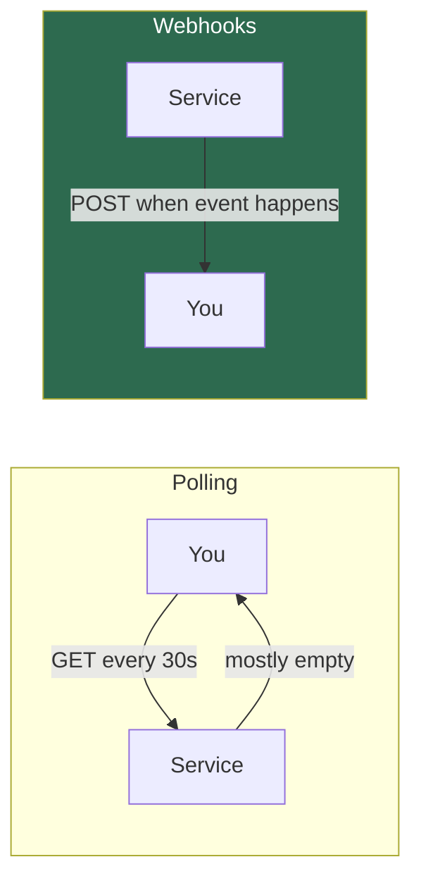
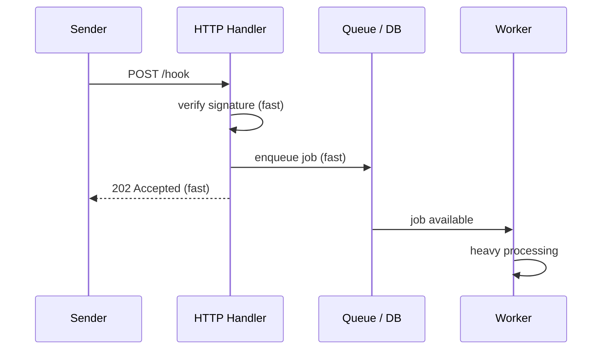

# 11.1.3 Webhooks Done Right

**Backlinks:** [11.1.1 — HTTP and REST](11.1.1_HTTP_and_REST_API_Design.md) · [11.1.2 — Auth](11.1.2_Authentication_and_Authorization.md) · [9.5 Python Practice Lab — Task 18](../../9-Python/Subchapter_9.5/9.5.1_Practice_Lab_20_Tasks.md)

**Next note:** [11.2.1 — Secrets Management Deep Dive](../Subchapter_11.2/11.2.1_Secrets_Management_Deep_Dive.md)

---

## Why This Note Exists

Every modern platform integration uses webhooks:

- GitHub fires one when a PR is opened → CI pipeline runs
- Stripe fires one when a payment succeeds → you fulfil the order
- PagerDuty fires one when an incident is acknowledged → you update a dashboard
- ArgoCD fires one on sync completion → you notify Slack

Webhooks look simple. They are **not**. Getting them right means thinking about: signature verification, replay attacks, retries, idempotency, timeouts, and the network being a liar. This note walks through every one.

> **One-line rule:** a webhook endpoint is the **most hostile surface** of your system. Treat it like a public login endpoint.

---

## Part 1: Polling vs Webhooks

Before webhooks, you polled:

```
forever:
    resp = GET /api/orders?since=last_check
    process(resp)
    sleep(30)
```

Webhooks flip the relationship — the server **calls you** when something changes:



**Trade-offs:**

| | Polling | Webhooks |
|---|---|---|
| Latency | Up to poll interval | Near-instant |
| Load on sender | High (mostly wasted) | Only when needed |
| Load on you | High (idle calls) | Only when needed |
| Complexity | Simple | Harder (security, retries) |
| Reliability | You retry | You must build retry tolerance |

> **Platform engineer reality:** most systems use **both**. Webhooks for speed, nightly polling reconciliation to catch missed events.

---

## Part 2: What a Webhook Request Looks Like

Here's a real GitHub `push` webhook:

```
POST /hooks/github HTTP/1.1
Host: ci.example.com
Content-Type: application/json
X-GitHub-Event: push
X-GitHub-Delivery: 72d3162e-cc78-11e3-81ab-4c9367dc0958
X-Hub-Signature-256: sha256=7d38cdd689735b008b3c702edd92eea23791c5f6
User-Agent: GitHub-Hookshot/044aadd
Content-Length: 6615

{
  "ref": "refs/heads/main",
  "repository": {...},
  "pusher": {...},
  "commits": [...]
}
```

Three things matter:

1. **The event type** (`X-GitHub-Event: push`) — one endpoint often handles many event types.
2. **The delivery ID** (`X-GitHub-Delivery`) — globally unique, critical for idempotency.
3. **The signature** (`X-Hub-Signature-256`) — proof this really came from GitHub.

---

## Part 3: Signature Verification — HMAC

When GitHub (or Stripe, or anyone) creates a webhook, you give them a **shared secret**. They then sign every payload:

```
signature = HMAC_SHA256(secret, raw_body)
```

…and send it in a header. Your job: recompute the HMAC with the same secret, compare, reject if mismatched.

### Why HMAC, not just "check the IP"?

- **IP allowlisting** is brittle — providers change IPs, use CDNs, you'd need to update constantly.
- **Bearer tokens** work in reverse (you'd give the sender a token). HMAC signs the **payload**, so even a MITM who steals the header can't modify the body.
- **HMAC is cheap** and cryptographically sound.

### Verifying HMAC — the correct way

```python
import hmac
import hashlib
from flask import Flask, request, abort

app = Flask(__name__)
WEBHOOK_SECRET = b"super-secret-from-vault"

def verify_signature(raw_body: bytes, header: str) -> bool:
    if not header or not header.startswith("sha256="):
        return False
    received = header.removeprefix("sha256=")
    expected = hmac.new(WEBHOOK_SECRET, raw_body, hashlib.sha256).hexdigest()
    # CRUCIAL: constant-time compare to prevent timing attacks
    return hmac.compare_digest(received, expected)

@app.post("/hooks/github")
def github_hook():
    raw = request.get_data()                          # raw bytes, not parsed JSON
    sig = request.headers.get("X-Hub-Signature-256")
    if not verify_signature(raw, sig):
        abort(401)
    payload = request.get_json()
    # ...handle event
    return "", 204
```

**Three rules, all critical:**

1. **Verify before parsing.** Don't `json.loads()` the body first — the raw bytes are what was signed.
2. **Constant-time compare** (`hmac.compare_digest`). A naive `==` leaks information through timing.
3. **401 on mismatch.** No details about why. Don't educate attackers.

### Replay protection — add a timestamp

An HMAC by itself only proves the body is genuine. An attacker who captures a valid webhook can **replay** it forever. Solution: providers include a timestamp, and you reject old ones.

Stripe signs `"{timestamp}.{raw_body}"`:

```python
def verify_stripe(header: str, raw_body: bytes, max_age=300) -> bool:
    parts = dict(p.split("=") for p in header.split(","))
    timestamp = int(parts["t"])
    if abs(time.time() - timestamp) > max_age:
        return False                                  # too old, reject
    signed = f"{timestamp}.".encode() + raw_body
    expected = hmac.new(SECRET, signed, hashlib.sha256).hexdigest()
    return hmac.compare_digest(parts["v1"], expected)
```

> **If your webhook source doesn't include a timestamp,** push back. Ask for it, or require them to mix a nonce into the signed payload.

---

## Part 4: Idempotency — Because Networks Lie

**The sender will retry.** Your response might have gotten lost, the connection might have timed out, an intermediate proxy might have dropped the reply. The sender has no idea whether you processed the event, so it retries.

If you fulfil an order twice, you have an angry customer.

### Two patterns that work

**Pattern A: Dedupe by delivery ID**

```python
@app.post("/hooks/github")
def github_hook():
    delivery_id = request.headers["X-GitHub-Delivery"]
    if redis.set(f"delivery:{delivery_id}", "1", nx=True, ex=86400):
        # First time seeing this ID
        process(request.get_json())
    # Whether first time or replay, return 200
    return "", 200
```

`nx=True` = set only if not exists. Atomic. If another replica is processing it, we see the key already exists and skip.

**Pattern B: Event sourcing with a natural key**

For events like `payment.succeeded`, you have a natural unique key (the payment ID). Look it up in your own DB; if it's already marked as processed, noop.

### The window gap

Both patterns have a sharp edge: what if you **crash between processing and writing the dedupe marker**? You'll process twice.

Solutions:

- **Put it in one DB transaction** — mark the event processed + your business write, same commit.
- **Make the business operation itself idempotent** — e.g., `INSERT ... ON CONFLICT DO NOTHING` on a natural key.

The cleanest design: **your handler is pure-ish and safe to call twice.**

---

## Part 5: Respond Fast, Work Slow

Webhook senders have **aggressive timeouts** — typically 5-30 seconds. If you take longer, they time out and retry (or drop).

**Don't do heavy work inline.** Instead:



Sequence:

1. Verify signature — **microseconds**
2. Persist the raw event to a DB/queue — **milliseconds**
3. Return `202 Accepted` — **under 1 second total**
4. A background worker picks up the event and does the heavy work

**Why this is the right default:**
- You won't time out the sender
- You can replay from the queue if the worker crashes
- You decouple receive latency from processing latency

---

## Part 6: Retries and Exponential Backoff

Good webhook senders retry with exponential backoff. GitHub retries 3 times; Stripe retries for up to **3 days** with increasing intervals.

**Your responsibilities as receiver:**

- Return `2xx` only when you have **durably stored** the event (on the queue / in the DB).
- Return `5xx` for transient errors — sender will retry.
- Return `4xx` for permanent errors (bad signature, unknown event type) — sender should give up.

Never return `2xx` and then crash while processing. From the sender's view, you processed it.

---

## Part 7: Building a Minimal Webhook Receiver

Full working example — Flask + Redis for dedupe + RQ for async processing:

```python
import hashlib
import hmac
import os
import json
import time

from flask import Flask, request, abort
import redis
from rq import Queue

app = Flask(__name__)
r = redis.Redis(host="localhost", port=6379, decode_responses=True)
q = Queue(connection=r)

SECRET = os.environb[b"WEBHOOK_SECRET"]

def verify(raw: bytes, header: str | None) -> bool:
    if not header or not header.startswith("sha256="):
        return False
    expected = hmac.new(SECRET, raw, hashlib.sha256).hexdigest()
    return hmac.compare_digest(header.removeprefix("sha256="), expected)

def process_event(event_id: str, payload: dict):
    # Runs in a worker process. Idempotent by construction.
    # e.g., insert-or-ignore into a DB, call downstream APIs, etc.
    print(f"[worker] processing {event_id}: {payload.get('action')}")

@app.post("/hooks/github")
def github_hook():
    raw = request.get_data()
    sig = request.headers.get("X-Hub-Signature-256")
    if not verify(raw, sig):
        abort(401)

    delivery_id = request.headers.get("X-GitHub-Delivery")
    if not delivery_id:
        abort(400)

    # Dedupe: SETNX with 24h TTL
    if not r.set(f"delivery:{delivery_id}", "1", nx=True, ex=86400):
        return "", 200  # replay, already handled

    payload = json.loads(raw)
    q.enqueue(process_event, delivery_id, payload)
    return "", 202
```

**What's good about this:**

- Signature verified on raw bytes before parsing.
- Missing headers → `4xx`, not a crash.
- Dedupe via atomic `SETNX`.
- Heavy work deferred to an RQ worker.
- Under normal load, the endpoint returns in <50ms.

---

## Part 8: Operational Concerns

### 8.1 Logging (without leaking secrets)

```python
app.logger.info(
    "webhook received",
    extra={"delivery_id": delivery_id, "event": event_type}
)
```

Do **not** log the raw body — payloads often contain PII or access tokens. Log metadata only.

### 8.2 Rate limiting

Apply a sane per-source rate limit in your reverse proxy (nginx `limit_req`, see [7.4](../../7-Nginx/)). A misconfigured sender can flood you with 10k req/s.

### 8.3 Alerting

Alert on:
- **Spike in `401`** (signature mismatches) — secret rotation issue or attack
- **Queue depth growing** — your workers can't keep up
- **`DLQ` (dead-letter) count > 0** — events that failed after all retries need human review

See [11.3.2 — SLIs and Alerting](../Subchapter_11.3/11.3.2_SLIs_SLOs_and_Alerting_Philosophy.md).

### 8.4 Secret rotation

- Accept **two** secrets at once during rotation (old + new).
- Flip sender to use new secret.
- Drop old secret after the retry window closes.

### 8.5 Testing locally

You can't expose `localhost:5000` to GitHub directly. Use a tunnel:

```bash
# ngrok (most common)
ngrok http 5000

# or cloudflared
cloudflared tunnel --url http://localhost:5000
```

Point the webhook at the public `ngrok.io` URL while developing.

---

## Part 9: Common Footguns

1. **Parsing JSON before verifying HMAC.** The raw bytes are what was signed. Any whitespace reformat invalidates the signature.
2. **String comparison with `==`.** Timing attacks. Always `hmac.compare_digest`.
3. **Accepting any signature when header is missing.** Check it exists before verifying.
4. **No dedupe.** Sender retries → you process twice.
5. **Long synchronous processing.** You time out, sender retries, you process three times, everything is on fire.
6. **Returning `200` before durably storing.** Sender thinks it's done, your worker crashed, event lost.
7. **Same secret across environments.** Staging secret leaks → prod compromised. Separate secrets per env.
8. **Storing secrets in env files committed to Git.** See [11.2.1](../Subchapter_11.2/11.2.1_Secrets_Management_Deep_Dive.md).
9. **Ignoring clock skew.** If your server's clock drifts, timestamp validation falsely rejects events. Run NTP.
10. **Unbounded event body size.** Set a max body size at the proxy (`client_max_body_size` in nginx). Otherwise, a 100MB payload eats your RAM.

---

## Part 10: A Production Webhook Checklist

- [ ] Secret loaded from vault, not env file
- [ ] Signature verified on **raw body**, constant-time compare
- [ ] Timestamp window enforced (reject > 5 min old)
- [ ] Delivery ID deduped via Redis/DB SETNX
- [ ] Heavy processing deferred to queue
- [ ] Returns `202` in <1s under normal load
- [ ] `401` on signature mismatch, `4xx` on malformed, `5xx` only on transient server errors
- [ ] Body size limited at proxy
- [ ] Access logs scrub `Authorization` and signature headers
- [ ] Metrics: `webhooks_received_total`, `webhooks_failed_total`, `webhook_processing_duration_seconds`
- [ ] Alert on spike in `401`, queue depth, DLQ count
- [ ] Runbook linked from the alert: "what to do when this fires" ([11.6.2](../Subchapter_11.6/11.6.2_Incident_Response_and_On_Call.md))
- [ ] Secret rotation tested (both secrets valid during window)

---

## Recap

- Webhooks invert the polling relationship: the sender pushes events to you.
- **Verify HMAC on raw bytes, constant-time.** Always.
- **Dedupe** by delivery ID with atomic SETNX.
- **Respond fast** (`202 Accepted`), defer heavy work to a queue.
- Remember: the sender **will** retry. Design every handler to be idempotent.

Next: [11.2.1 — Secrets Management Deep Dive](../Subchapter_11.2/11.2.1_Secrets_Management_Deep_Dive.md) — Vault, cloud KMS, rotation strategies, and scanning.
