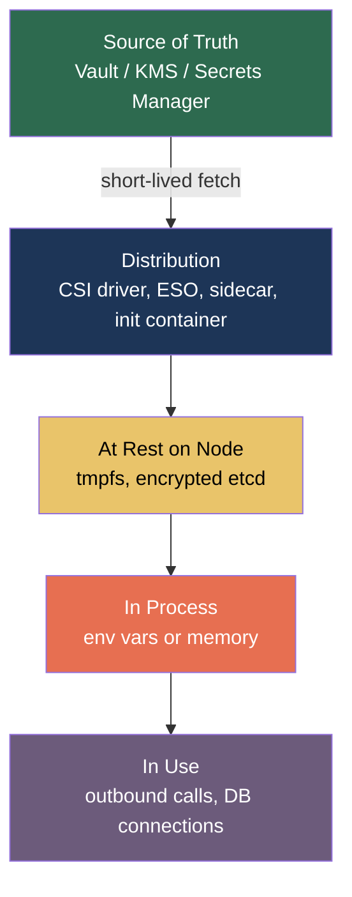
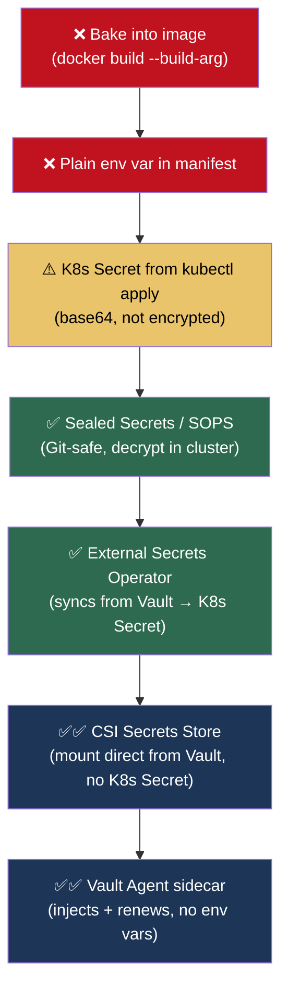
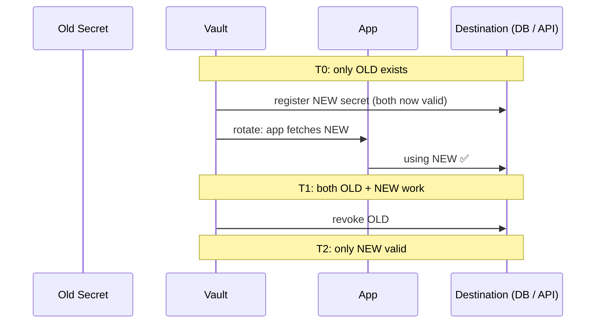
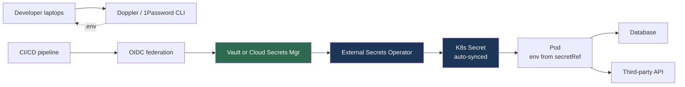

# 11.2.1 Secrets Management Deep Dive

**Backlinks:** [10.0.1 — GitOps Secrets Section](../../10-GitOps-ArgoCD/Subchapter_10.0/10.0.1_GitOps_Mental_Model_and_Controller_Pattern.md) · [8.2 CI Secrets](../../8-CICD/) · [5.6 K8s Secrets](../../5-Kubernetes/)

**Next note:** [11.2.2 — Supply Chain Security and OWASP](11.2.2_Supply_Chain_Security_and_OWASP.md)

---

## Why This Note Exists

Secrets management is where 80% of production security incidents start. Not crypto flaws, not 0-days — a `.env` file committed to Git, a logged database URL, a `Secret` object stored unencrypted in etcd.

Modules 5, 8, and 10 touched secrets in their context (K8s Secrets, CI env vars, GitOps Sealed Secrets). This note **unifies** them: what a production-grade secrets architecture looks like, and how to get there from wherever you are today.

> **One-line rule:** secrets are not configuration. Never treat them as interchangeable with `DEBUG=true`.

---

## Part 1: What Counts as a Secret?

Anything that, if disclosed, would give an attacker meaningful capability:

- Database passwords, connection strings
- API keys (yours *and* the third-party's)
- JWT signing keys, OAuth client secrets
- TLS private keys
- SSH private keys
- Encryption keys (data-at-rest, backups)
- Webhook signing secrets ([11.1.3](../Subchapter_11.1/11.1.3_Webhooks_Done_Right.md))
- Cloud access keys (AWS/GCP/Azure)

Things that **are not** secrets (stop treating them like they are):

- Public API endpoints
- Feature flags
- Log levels
- Region / cluster names

Mixing them makes rotation painful and audits impossible.

---

## Part 2: The Five Layers Where Secrets Live



A mature design protects every layer. Let's walk through each.

---

## Part 3: The Source of Truth

This is the one canonical place every secret lives. One of:

| Tool | Runs | Best for |
|---|---|---|
| **HashiCorp Vault** | You host | On-prem, multi-cloud, heavy-use |
| **AWS Secrets Manager** | AWS managed | AWS-heavy stacks |
| **GCP Secret Manager** | GCP managed | GCP-heavy stacks |
| **Azure Key Vault** | Azure managed | Azure-heavy stacks |
| **Doppler / 1Password / Infisical** | SaaS | Small teams, dev workflows |

Pick **one**, make it the source, point everything else at it. Duplicating secrets across platforms is where leaks happen.

### What a good source of truth gives you

1. **Encrypted at rest** with keys you don't manage yourself.
2. **Audit log** — who read which secret, when.
3. **Access policy** — only service X can read secret Y.
4. **Versioning** — rollback if you rotate and break something.
5. **Dynamic secrets** (Vault only) — generate short-lived DB credentials on demand.

### Example: AWS Secrets Manager

```bash
# Store
aws secretsmanager create-secret \
    --name prod/db/password \
    --secret-string '{"username":"app","password":"s3cret"}'

# Retrieve (ops only; apps should fetch via SDK / IAM)
aws secretsmanager get-secret-value --secret-id prod/db/password

# Rotate (triggers a Lambda that generates a new password and updates the DB)
aws secretsmanager rotate-secret --secret-id prod/db/password
```

### Example: HashiCorp Vault

```bash
vault kv put secret/prod/db username=app password=s3cret
vault kv get -field=password secret/prod/db
# dynamic DB creds:
vault read database/creds/app-readonly    # returns creds that expire in 1h
```

---

## Part 4: Distribution — Getting Secrets to Workloads

The secret lives in Vault. Your pod needs it. **How does it get there safely?**

### 4.1 Worst → Best Distribution Patterns



### 4.2 External Secrets Operator (ESO) — the sane default

ESO is a K8s operator that syncs external secret stores → K8s `Secret` objects.

```yaml
apiVersion: external-secrets.io/v1beta1
kind: ExternalSecret
metadata:
  name: db-creds
  namespace: prod
spec:
  refreshInterval: 1h
  secretStoreRef:
    name: vault-backend
    kind: ClusterSecretStore
  target:
    name: db-creds               # creates this K8s Secret
  data:
    - secretKey: DB_PASSWORD
      remoteRef:
        key: secret/prod/db
        property: password
```

Your pod still mounts a normal `Secret` — nothing special to configure. ESO handles the Vault fetch, rotation, and re-sync.

> **Why this is the sane default:** your manifests are plain, your developers see plain K8s Secrets, but the real secrets never live in Git.

### 4.3 CSI Secrets Store — no K8s Secret at all

Takes it further: the secret is mounted **directly from Vault** as a file on the pod, and never becomes a K8s `Secret` object.

```yaml
apiVersion: secrets-store.csi.x-k8s.io/v1
kind: SecretProviderClass
metadata:
  name: vault-db
spec:
  provider: vault
  parameters:
    roleName: "app"
    objects: |
      - objectName: "db-password"
        secretPath: "secret/data/prod/db"
        secretKey: "password"
```

Then in your pod:

```yaml
volumes:
  - name: secrets
    csi:
      driver: secrets-store.csi.k8s.io
      volumeAttributes:
        secretProviderClass: "vault-db"
```

The pod sees `/mnt/secrets/db-password` as a file. If Vault rotates, the file updates.

**Trade-off:** your app now must read from files, not env vars.

### 4.4 Sealed Secrets — when you want secrets in Git

Covered in [10.0.1](../../10-GitOps-ArgoCD/Subchapter_10.0/10.0.1_GitOps_Mental_Model_and_Controller_Pattern.md). Encrypts a `Secret` with a cluster-specific key; commit the ciphertext to Git. A controller in-cluster decrypts back to a real `Secret`.

**When to pick it:** small teams, no Vault, GitOps-first.
**When not to:** multi-cluster (each cluster has its own key), or any regulated environment.

---

## Part 5: Rotation — The Part Everyone Forgets

A secret you never rotate is a secret that eventually leaks.

### 5.1 Rotation models

| Model | Example | Cadence |
|---|---|---|
| **Manual scheduled** | "Rotate all API keys every 90 days" | Quarterly |
| **Automated scheduled** | AWS Secrets Manager → Lambda → update RDS | Daily/weekly |
| **Event-driven** | "Suspected leak" → pipeline triggers rotation | On demand |
| **Dynamic / short-lived** | Vault issues DB creds that expire in 1h | Per request |

**The goalpost: your secret is short-lived enough that a leaked value is useless in hours, not months.**

### 5.2 The rotation dance — two secrets valid at once

You can't flip atomically. Run both old and new during the window:



Every secret store worth using supports this. **Never** cut over in a single step and pray.

---

## Part 6: In-Process Hygiene

Even once the secret is in the process, you can leak it.

### 6.1 Environment variables — the seductive trap

```bash
DATABASE_URL=postgres://app:s3cret@db:5432/app
```

**Problems with env vars:**

- `printenv` in any shell dumps them
- `/proc/<pid>/environ` is world-readable on Linux by default
- Crash reports and tracebacks include them (`django-debug-toolbar`, Sentry)
- Subprocess inherit → a misbehaving library shells out → leaks

### 6.2 Safer patterns

```python
# Prefer reading from a file path pointed to by an env var
secret_path = os.environ["DB_PASSWORD_FILE"]
with open(secret_path) as f:
    DB_PASSWORD = f.read().strip()
```

Docker supports this naturally (`--secret`), and K8s CSI Secrets Store mounts files directly.

### 6.3 Never log a secret — verify at runtime

Add a logging filter that redacts common secret-shaped values:

```python
import logging, re

SECRET_PATTERNS = [
    re.compile(r'("password"\s*:\s*)"[^"]*"'),
    re.compile(r'(Authorization:\s*Bearer\s+)\S+', re.I),
    re.compile(r'\b(sk_live|sk_test|ghp|xoxb)_[A-Za-z0-9]{20,}\b'),
]

class RedactSecrets(logging.Filter):
    def filter(self, record):
        msg = record.getMessage()
        for pat in SECRET_PATTERNS:
            msg = pat.sub(r'\1[REDACTED]', msg)
        record.msg, record.args = msg, ()
        return True

logging.getLogger().addFilter(RedactSecrets())
```

Belt-and-suspenders — but you will be glad you had it when a third-party library logs a request body.

### 6.4 Minimize scope and blast radius

- **Per-service credentials**, not one master. Service A's DB password ≠ Service B's.
- **Read-only where possible.** Most apps don't need `DROP TABLE`.
- **Network-level limits.** The app can reach the DB on 5432, nothing else.

---

## Part 7: Secret Scanning — Catch Leaks Early

### 7.1 Pre-commit

```yaml
# .pre-commit-config.yaml
repos:
  - repo: https://github.com/gitleaks/gitleaks
    rev: v8.18.0
    hooks:
      - id: gitleaks
```

Blocks commits that contain plausible secrets. Minutes to set up; prevents hours of incident response.

### 7.2 CI

Run a scanner on every PR. GitHub Advanced Security, `trufflehog`, or `gitleaks` all work.

### 7.3 Server-side

- **GitHub Secret Scanning** (free on public repos) — detects known secret formats and can auto-revoke at the source.
- **Cloud provider native scanners** — GCP SCC, AWS Macie, etc.

### 7.4 Historical — you pushed a secret last year

```bash
# Audit history
gitleaks detect --source . --log-opts="--all"

# Rewriting history is hard; assume the secret is compromised
# → rotate the secret, not the commit
```

> **Golden rule:** if a secret ever existed in a Git history, it is **compromised**. Rewrite history if you want; rotate anyway. Crawlers watch GitHub firehoses in real time.

---

## Part 8: Developer Experience — The `.env` Compromise

Developers need secrets locally. Pushing them into Vault for everyone makes dev painful.

### Workable pattern

```
.env.example         ← committed, shows keys + dummy values
.env                 ← gitignored, real local values
```

For onboarding:

```bash
# One-time fetch from Vault / 1Password
doppler secrets download --no-file --format=env > .env
# or
op signin && op inject -i .env.tpl -o .env
```

Developers get a `.env`, it never hits Git, and is regeneratable.

### Never do this

- `README.md` with a "just paste this .env" block
- A shared `#dev-secrets` Slack channel
- Emailing credentials "because Vault is annoying"

---

## Part 9: Incident Response — A Secret Leaked

The 10-minute playbook:

1. **Rotate immediately** at the source (vault → update downstream).
2. **Revoke** the old value everywhere it was used.
3. **Audit logs** — who/what accessed the secret between the leak time and rotation?
4. **Rotate dependents** — if the compromised secret could have been used to issue others, rotate those too.
5. **Post-incident:** search Git history (`gitleaks`), logs, chat exports for other instances.
6. **Write the postmortem** ([11.6.2](../Subchapter_11.6/11.6.2_Incident_Response_and_On_Call.md)). How did it leak? What control would have caught it?

> **Do not** rewrite Git history and hope no one noticed. Assume compromise.

---

## Part 10: Architecture You Should Aim For

A small but production-credible setup on K8s:



Key properties:

- **One source of truth** (Vault).
- **No long-lived creds in CI** — OIDC federation issues short-lived tokens.
- **ESO** syncs secrets into K8s.
- **No secrets in Git** at any stage.
- **Developers use a tool**, not copy-paste.

---

## Part 11: Platform Engineer's Checklist

- [ ] Single source of truth chosen and enforced (Vault / cloud SM)
- [ ] No plaintext secrets in any Git repo (enforced by pre-commit + CI scanner)
- [ ] ESO or CSI Secrets Store deployed for K8s workloads
- [ ] CI uses OIDC federation, not stored long-lived keys
- [ ] Secrets scoped per service, least privilege
- [ ] Rotation cadence defined and tested (not just documented)
- [ ] Two-secrets-valid overlap supported end-to-end
- [ ] Logging redaction filter in common lib
- [ ] Incident runbook exists: "a secret leaked, what now?"
- [ ] Quarterly audit: list every secret, owner, last rotation

---

## Part 12: Common Footguns

1. **Treating `kubectl create secret` as secure.** It's base64, not encrypted. Enable etcd encryption + RBAC on Secret objects.
2. **One giant shared secret.** Breach blast radius = everything.
3. **Rotating manually with downtime.** Always overlap.
4. **Logging full request/response bodies.** Redact.
5. **Build-time `--build-arg`.** Ends up in the image layer forever, published to your registry.
6. **Hardcoded test secrets that match prod.** Separate environments, separate secrets.
7. **No audit log.** If you can't answer "who read this?", you don't have secrets management.
8. **Using the same JWT signing key across services.** Breach of one = breach of all.
9. **Checking `.env` "just this once".** That commit lives forever.

---

## Recap

- Secrets have **five layers**; protect each.
- Pick **one** source of truth, synced to workloads via ESO or CSI.
- **Short-lived > long-lived.** Rotation is not optional.
- Log redaction, scoped per-service creds, OIDC for CI, no secrets in Git.
- When (not if) a secret leaks: rotate first, post-mortem second.

Next: [11.2.2 — Supply Chain Security and OWASP](11.2.2_Supply_Chain_Security_and_OWASP.md) — image signing, SBOMs, and the OWASP Top 10 for platform engineers.
