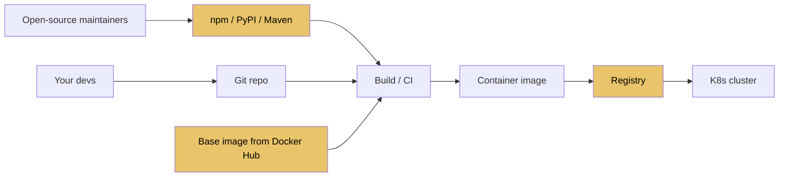
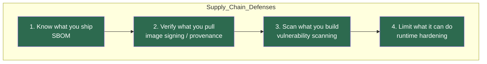

# 11.2.2 Supply Chain Security and OWASP

**Backlinks:** [11.2.1 — Secrets Management](11.2.1_Secrets_Management_Deep_Dive.md) · [4.5 Docker Security](../../4-Docker/) · [8.4 CI Security](../../8-CICD/)

**Next note:** [11.3.1 — Three Pillars of Observability](../Subchapter_11.3/11.3.1_Three_Pillars_Metrics_Logs_Traces.md)

---

## Why This Note Exists

A platform engineer's job isn't to stop every attack — that's the security team. It is to:

1. **Not be the weak link.** Don't deploy unsigned containers, don't ship known-vulnerable dependencies, don't trust inputs.
2. **Speak the language.** When security asks "do we have SBOMs?" or "are images cosigned?", you should know what to do.
3. **Understand the OWASP Top 10.** Not memorize it — recognize the patterns when reviewing code.

This note covers both: **supply chain** (the software you ship) and **OWASP Top 10** (the attacks against it).

> **One-line rule:** defense in depth. Every single layer is insufficient on its own.

---

## Part 1: What Is a Software Supply Chain?

Every byte of code you ship passed through dozens of hands:



Each yellow node is a **trust boundary** — a place an attacker can compromise to poison your production. Real examples:

- **event-stream (npm, 2018)** — a maintainer handed off a popular package to an attacker who injected a Bitcoin-wallet stealer.
- **SolarWinds (2020)** — build-server compromise injected malicious code into signed updates reaching 18,000 orgs.
- **XZ Utils (2024)** — a three-year social engineering effort inserted a backdoor into a library shipped with every major Linux distro.

**You can't eliminate supply chain risk. You can harden enough to make yourself a bad target.**

---

## Part 2: The Four Defenses



### 2.1 SBOM — Software Bill of Materials

A list of **every component** in your artifact: OS packages, language libraries, versions, licenses, hashes.

**Why?** When `log4shell` dropped, the first question every org had was "do we even *use* log4j anywhere?" — and most couldn't answer. SBOMs answer that in seconds.

Two mainstream formats: **SPDX** and **CycloneDX**. CycloneDX is the one most modern tools emit.

Generate one with `syft`:

```bash
# From an image
syft registry.example.com/web:1.4.0 -o cyclonedx-json=sbom.json

# From a filesystem
syft dir:. -o cyclonedx-json=sbom.json
```

Attach it to your release:

```bash
# Store the SBOM alongside the image in the registry using oras or cosign
cosign attach sbom --sbom sbom.json registry.example.com/web:1.4.0
```

### 2.2 Image signing — Cosign

Without signing, `docker pull` trusts DNS + TLS + the registry operator. An attacker who compromises the registry can replace your `web:1.4.0` with a trojan and nobody notices.

**Cosign** (from the Sigstore project) signs container images and stores the signature in the registry next to the image.

```bash
# Sign (with a key; keyless with OIDC is also supported)
cosign sign --key cosign.key registry.example.com/web:1.4.0

# Verify at deploy time
cosign verify --key cosign.pub registry.example.com/web:1.4.0
```

In CI, **keyless signing** is the modern way:

```bash
COSIGN_EXPERIMENTAL=1 cosign sign registry.example.com/web:1.4.0
# cosign uses GitHub Actions OIDC token → Fulcio issues a short-lived cert → sign
```

At the K8s layer, **Kyverno** or **Cosign policy controller** rejects pods that pull unsigned images:

```yaml
apiVersion: kyverno.io/v1
kind: ClusterPolicy
metadata:
  name: require-signed-images
spec:
  validationFailureAction: Enforce
  rules:
    - name: verify-images
      match:
        any:
          - resources:
              kinds: [Pod]
      verifyImages:
        - imageReferences: ["registry.example.com/*"]
          attestors:
            - entries:
                - keys:
                    publicKeys: |
                      -----BEGIN PUBLIC KEY-----
                      ...
                      -----END PUBLIC KEY-----
```

### 2.3 SLSA — Supply-chain Levels for Software Artifacts

A framework with four levels. In practice you want to hit **SLSA level 2–3**:

| Level | Requirement |
|---|---|
| L1 | Build process is scripted (not `build on my laptop`) |
| L2 | Build runs on a hosted service, emits provenance |
| L3 | Build is hardened, provenance is signed, isolated builds |
| L4 | Two-person review, hermetic builds, reproducible |

**Provenance** = metadata about *how* an artifact was built: commit SHA, build step, builder identity.

GitHub Actions can emit SLSA provenance for free via the [slsa-github-generator](https://github.com/slsa-framework/slsa-github-generator).

### 2.4 Vulnerability scanning

Scan at three gates:

1. **Source** — dependencies: `npm audit`, `pip-audit`, `cargo audit`, Dependabot/Renovate.
2. **Build** — images: `trivy`, `grype`, `snyk`.
3. **Runtime** — deployed workloads: Aqua, Sysdig, Falco for runtime anomaly detection.

Minimal CI step:

```yaml
- name: Scan image
  uses: aquasecurity/trivy-action@master
  with:
    image-ref: registry.example.com/web:${{ github.sha }}
    severity: HIGH,CRITICAL
    exit-code: 1                    # fail the build
```

**Good hygiene:**

- Pin dependency versions, but not forever. **Renovate/Dependabot** PRs keep you current.
- CI fails on `HIGH` and `CRITICAL`; `MEDIUM` gets a ticket, not a block.
- Track a **CVE-to-patch-in-prod** SLO. 7 days for Critical is a common target.

### 2.5 Runtime hardening — small things with big impact

- **Distroless / minimal base images** — `gcr.io/distroless/python3-debian12` has no shell, no package manager. Attackers have nowhere to live.
- **Non-root user** in the container (`USER 10001`).
- **Read-only filesystem** in K8s:
  ```yaml
  securityContext:
    readOnlyRootFilesystem: true
    runAsNonRoot: true
    allowPrivilegeEscalation: false
    capabilities: { drop: [ALL] }
  ```
- **NetworkPolicies** so the pod can only talk to what it needs.
- **Pod Security Standards** (`restricted` profile) enforced by K8s admission.

---

## Part 3: Base Image Hygiene

Most vulnerabilities in your image come from the **base**, not your code.

| Base | Size | Attack surface | Use when |
|---|---|---|---|
| `ubuntu:22.04` | ~80MB | Huge | You need lots of packages, dev |
| `debian:12-slim` | ~80MB | Moderate | Balance |
| `alpine:3.19` | ~8MB | Small | Small, musl-based (careful: musl ≠ glibc) |
| `gcr.io/distroless/...` | ~20MB | Minimal | Production |
| `scratch` | 0 bytes | None | Static Go/Rust binaries |

**A good Dockerfile pattern (multi-stage):**

```dockerfile
# Stage 1: build with full toolchain
FROM python:3.12-slim AS builder
WORKDIR /app
COPY requirements.txt .
RUN pip install --user --no-cache-dir -r requirements.txt
COPY . .

# Stage 2: runtime with distroless
FROM gcr.io/distroless/python3-debian12
COPY --from=builder /root/.local /root/.local
COPY --from=builder /app /app
WORKDIR /app
USER 10001
ENV PATH=/root/.local/bin:$PATH
ENTRYPOINT ["python", "main.py"]
```

No shell, no pip, no apt. If attacker gets RCE, they can't even `ls`.

---

## Part 4: OWASP Top 10 — The Pattern Recognition Kit

The [OWASP Top 10](https://owasp.org/www-project-top-ten/) is updated every 3-4 years. The current (2021) list, translated into platform-engineer terms:

### A01:2021 — Broken Access Control

The #1 cause of breaches. Examples:

- `/api/users/42` — user 7 changes URL to `/api/users/43` and sees someone else's data (IDOR — Insecure Direct Object Reference).
- `/admin` endpoint behind "we hide the link in the UI".

**Defense:** [11.1.2](../Subchapter_11.1/11.1.2_Authentication_and_Authorization.md) — server-side AuthZ on every endpoint, default deny, test with a non-admin account.

### A02:2021 — Cryptographic Failures

- TLS 1.0/1.1 still enabled. Disable.
- `md5` / `sha1` for passwords. Use Argon2/bcrypt.
- Rolling your own crypto. Don't.
- Secrets in logs. See [11.2.1](11.2.1_Secrets_Management_Deep_Dive.md).

### A03:2021 — Injection

SQL injection, command injection, LDAP injection, NoSQL injection.

```python
# ❌ BAD — SQL injection
cursor.execute(f"SELECT * FROM users WHERE id = {user_id}")

# ✅ GOOD — parameterized query
cursor.execute("SELECT * FROM users WHERE id = %s", (user_id,))

# ❌ BAD — command injection
os.system(f"ping {host}")

# ✅ GOOD — argv list, no shell
subprocess.run(["ping", "-c", "1", host], check=True)
```

**Rule:** never interpolate user input into a query or command. Use parameterized APIs.

### A04:2021 — Insecure Design

The one you can't fix with a library. Examples:

- "The password reset flow doesn't require the old password" → attacker with session hijack resets.
- "The cart total is submitted by the client" → attacker sets it to `$0`.

Threat modeling in design reviews catches most of this.

### A05:2021 — Security Misconfiguration

- Debug mode on in prod
- Default passwords (`admin/admin`)
- Verbose error messages with stack traces exposed
- S3 buckets set to public
- K8s dashboard exposed on the internet

**Defense:** immutable infra via IaC ([11.5.1](../Subchapter_11.5/11.5.1_Cloud_Primitives_and_IaC.md)), policy-as-code (OPA / Kyverno).

### A06:2021 — Vulnerable and Outdated Components

Covered in Part 2 above: scanners + dependency bots.

### A07:2021 — Identification and Authentication Failures

- Weak passwords allowed
- No rate limiting on `/login`
- Session IDs predictable
- "Forgot password" token never expires

Covered in [11.1.2](../Subchapter_11.1/11.1.2_Authentication_and_Authorization.md).

### A08:2021 — Software and Data Integrity Failures

- Auto-update from unsigned sources
- CI pipelines that pull `latest` of everything at build time
- Deserializing untrusted data (`pickle.loads(user_input)` — classic RCE)

**Defense:** image signing, SBOM, pin versions by hash.

### A09:2021 — Security Logging and Monitoring Failures

- No logs of auth failures
- No alerting on suspicious patterns
- Logs kept for 7 days (incidents are found weeks later)

Covered in [11.3](../Subchapter_11.3/).

### A10:2021 — Server-Side Request Forgery (SSRF)

App fetches URLs based on user input:

```
POST /fetch-image  {"url": "http://169.254.169.254/latest/meta-data/iam/security-credentials/"}
```

That's AWS metadata — if your app is on EC2, the attacker just stole IAM creds.

**Defenses:**
- Allowlist destinations; never fetch arbitrary URLs.
- Block RFC1918, link-local (`169.254.0.0/16`), and localhost by policy.
- Use IMDSv2 (requires session tokens) to block naive SSRF against EC2 metadata.

---

## Part 5: A Small-but-Credible Security Baseline

If your org has no security program, here's the 80/20:

1. **Branch protection** on `main`: required reviews, required CI, no force push.
2. **Pre-commit hook + CI**: secret scanning (`gitleaks`), basic lint.
3. **Image scanning in CI**, fail on `HIGH`/`CRITICAL`.
4. **Dependabot/Renovate** enabled, merged weekly.
5. **Base images**: distroless or alpine, multi-stage builds.
6. **Cosign signing** in CI, Kyverno enforcement in K8s.
7. **Pod Security Standards** set to `restricted`.
8. **NetworkPolicies** default-deny per namespace.
9. **Centralized logging** with alerts on auth failures.
10. **Annual secret rotation** documented and exercised.

That's a week of work and stops 90% of opportunistic attacks.

---

## Part 6: Incident Response for Supply Chain

When a supply chain CVE drops (log4shell, xz, etc.):

1. **Determine exposure** — grep your SBOMs (you do have them, right?).
2. **Triage by severity × reachability** — "we have log4j but not in a network-exposed path" ≠ "we have log4j on the edge".
3. **Patch with priority** — usually minor version bump.
4. **Rebuild and redeploy** all affected images.
5. **Verify via scanner** — Trivy finds the patched version.
6. **Document** in a brief writeup: CVE ID, services affected, patched-at timestamp.

This is the work SBOMs pay off for. Without them, you're grepping `package.json` files by hand.

---

## Part 7: Common Footguns

1. **Running CI as root.** Compromised dependency escapes to the runner and everything it has access to.
2. **Long-lived cloud keys in CI.** Use OIDC federation; [11.2.1](11.2.1_Secrets_Management_Deep_Dive.md).
3. **`latest` tag in prod.** Pin by SHA256 digest: `image@sha256:...`.
4. **Pulling public images directly.** Mirror to a private registry; decouple yourself from `docker.io` going down or introducing malware.
5. **Running containers as root inside K8s** — Pod Security default.
6. **No rate limiting on public APIs.**
7. **Trusting the X-Forwarded-For header** without knowing your proxy topology.
8. **Exposing K8s dashboard, Argo CD UI, Grafana on public IPs.** Put them behind SSO.
9. **"Security by obscurity"** — hidden endpoints are found by automated scanners in hours.

---

## Part 8: Platform Engineer's Checklist

- [ ] SBOMs generated for every release image (CycloneDX)
- [ ] Images signed with cosign, verified on admission
- [ ] SLSA L2+ builds (hosted CI, provenance emitted)
- [ ] Vulnerability scans in CI, fails on Critical
- [ ] Renovate/Dependabot enabled
- [ ] Distroless or minimal base image
- [ ] Multi-stage builds, non-root user, read-only rootfs
- [ ] Pod Security Standard `restricted` enforced
- [ ] NetworkPolicies default-deny
- [ ] Private registry mirrors public bases
- [ ] Gitleaks / secret scanning pre-commit + CI + server-side
- [ ] Public surfaces behind SSO
- [ ] Annual red-team / threat modeling exercise

---

## Recap

- **SBOM + signing + scanning + runtime hardening** — four layers, all needed.
- **Cosign** signs, **Kyverno** enforces, **syft** lists, **trivy** scans.
- **OWASP Top 10** — recognize patterns: broken access control, injection, misconfig, SSRF.
- Your goal isn't "unhackable" — it's "not the easy target".

Next: [11.3.1 — Three Pillars of Observability](../Subchapter_11.3/11.3.1_Three_Pillars_Metrics_Logs_Traces.md) — metrics, logs, and traces.
