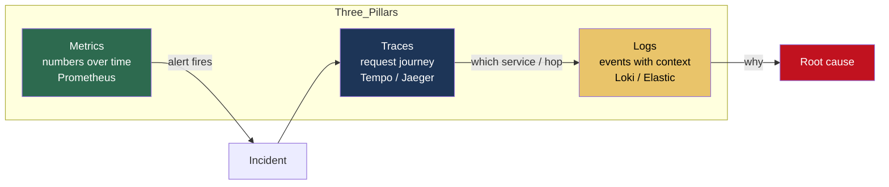
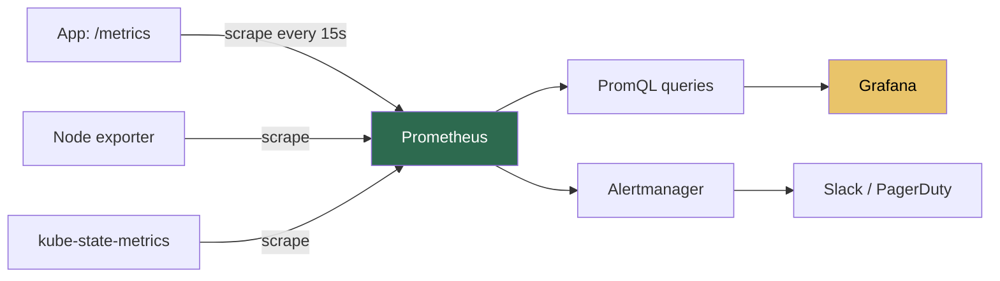
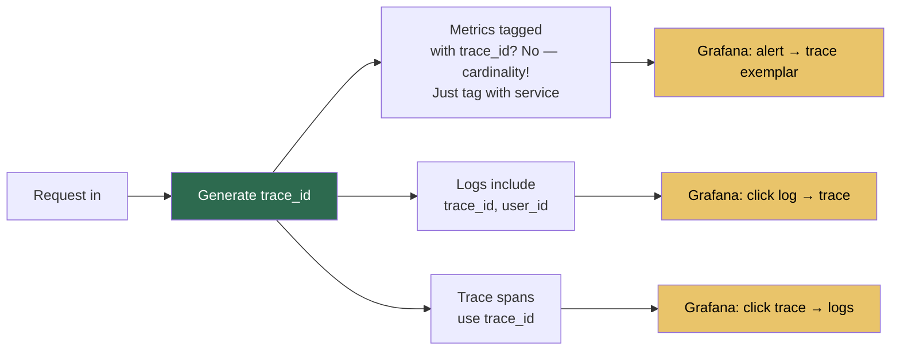

# 11.3.1 Three Pillars: Metrics, Logs, Traces

**Backlinks:** [5.9 K8s Troubleshooting](../../5-Kubernetes/) · [7.5 Nginx Monitoring](../../7-Nginx/) · [9.2 Python Logging](../../9-Python/Subchapter_9.2/)

**Next note:** [11.3.2 — SLIs, SLOs, and Alerting Philosophy](11.3.2_SLIs_SLOs_and_Alerting_Philosophy.md)

---

## Why This Note Exists

A platform is only as good as your ability to debug it at 3am. "It works on my machine" is not observability; "we can answer any question about production in under 5 minutes" is.

Every incident ever debugged used one of three signal types. This note teaches you what each is for, when to reach for which, and how to set up a stack that doesn't cost your company a second mortgage.

> **One-line rule:** metrics say *something is wrong*, traces say *where*, logs say *why*.

---

## Part 1: Monitoring vs Observability

These are often confused.

- **Monitoring** = watching known failure modes (CPU > 90%, disk > 80%, service down).
- **Observability** = ability to ask **new** questions about production without shipping new code.

You need both. Monitoring catches the known knowns. Observability lets you debug the unknown unknowns.

---

## Part 2: The Three Pillars



### The typical debugging flow

1. Metric alert: "checkout error rate > 1%"
2. Open trace view: find a slow/failed request → notice it hangs on `payments-svc`
3. Jump to `payments-svc` logs filtered by that trace ID → see a DB timeout
4. Open DB metrics → see connection pool exhausted
5. Fix, ship, move on

Each pillar answers a different question. **You need all three wired together.**

---

## Part 3: Metrics — Cheap, Aggregated, Always-On

**What a metric is:** a numeric value sampled over time, usually with labels.

```
http_requests_total{method="GET", status="200", path="/api/users"} 4823
http_request_duration_seconds{method="GET", path="/api/users", quantile="0.99"} 0.34
```

### 3.1 The Four Golden Signals (Google SRE Book)

For **any** service, start by measuring these four:

1. **Latency** — how long requests take
2. **Traffic** — requests per second
3. **Errors** — request failure rate
4. **Saturation** — how full the system is (CPU, memory, queue depth, connection pool)

Everything else is details. If you instrument these four, you can answer "is the service healthy?" at a glance.

### 3.2 Prometheus in 90 seconds

Prometheus is a **pull-based** metrics system. Services expose `/metrics` over HTTP; Prometheus scrapes them every N seconds and stores time series.



### 3.3 The Four Metric Types

| Type | Meaning | Example |
|---|---|---|
| **Counter** | Monotonically increasing | `http_requests_total` |
| **Gauge** | Goes up and down | `memory_usage_bytes` |
| **Histogram** | Bucketed distribution | `http_request_duration_seconds` |
| **Summary** | Pre-computed quantiles | similar to histogram, less flexible |

**Rule:** use **counters** for things that count (requests, errors, bytes), **gauges** for current state (in-flight, queue depth), **histograms** for durations and sizes.

### 3.4 Instrumenting a Python service

```python
from prometheus_client import Counter, Histogram, start_http_server
import time

REQUESTS = Counter(
    "http_requests_total",
    "Total HTTP requests",
    ["method", "path", "status"],
)
LATENCY = Histogram(
    "http_request_duration_seconds",
    "Request latency",
    ["method", "path"],
    buckets=(0.01, 0.05, 0.1, 0.25, 0.5, 1, 2.5, 5, 10),
)

def handle(request):
    start = time.perf_counter()
    try:
        resp = do_work(request)
        REQUESTS.labels(request.method, request.path, str(resp.status)).inc()
        return resp
    finally:
        LATENCY.labels(request.method, request.path).observe(
            time.perf_counter() - start
        )

# Expose /metrics on :9090
start_http_server(9090)
```

### 3.5 PromQL — the minimum you need

```promql
# Requests per second, per service, last 5 min
sum(rate(http_requests_total[5m])) by (service)

# Error rate as a fraction
sum(rate(http_requests_total{status=~"5.."}[5m]))
  / sum(rate(http_requests_total[5m]))

# p99 latency per endpoint
histogram_quantile(0.99,
  sum(rate(http_request_duration_seconds_bucket[5m])) by (le, path))

# Saturation: CPU usage ratio
1 - avg(rate(node_cpu_seconds_total{mode="idle"}[5m]))
```

Learn these four queries and you can diagnose 80% of performance issues.

### 3.6 Cardinality — the one thing that will kill you

Every label combination is a separate time series. **Never** put high-cardinality values (user IDs, request IDs, UUIDs) in labels — you will OOM Prometheus and your bill will be spectacular.

**Good labels:** `method`, `path`, `status_code`, `environment`, `service`.
**Bad labels:** `user_id`, `order_id`, `request_id`, `trace_id`.

Rule of thumb: total unique label combos per metric < 10,000.

---

## Part 4: Logs — The Messy Truth

### 4.1 Structured Logs — the only kind worth shipping

Plain `print("user 42 logged in")` = useless at scale. Use **structured** (usually JSON) logs:

```json
{
  "ts": "2025-04-24T12:34:56Z",
  "level": "INFO",
  "msg": "user login",
  "user_id": 42,
  "ip": "10.1.2.3",
  "trace_id": "abc-123",
  "service": "auth"
}
```

Now you can filter: `level:ERROR AND service:auth AND user_id:42`.

### 4.2 Python structured logging

```python
import logging, json, sys, time

class JSONFormatter(logging.Formatter):
    def format(self, record):
        return json.dumps({
            "ts": time.strftime("%Y-%m-%dT%H:%M:%SZ", time.gmtime()),
            "level": record.levelname,
            "logger": record.name,
            "msg": record.getMessage(),
            **getattr(record, "extra_fields", {}),
        })

h = logging.StreamHandler(sys.stdout)
h.setFormatter(JSONFormatter())
logging.basicConfig(level=logging.INFO, handlers=[h])

log = logging.getLogger(__name__)
log.info("user login", extra={"extra_fields": {"user_id": 42}})
```

Or drop in `structlog` / `loguru` — both production-ready.

### 4.3 Log Levels — use them correctly

| Level | When |
|---|---|
| `DEBUG` | Chatty, local dev only, off in prod |
| `INFO` | "A thing happened" — request served, job completed |
| `WARN` | "Unexpected, but we handled it" — retry succeeded |
| `ERROR` | "We failed, user-visible" |
| `FATAL` | "Process is about to die" |

**If every log is `INFO`, no log is `INFO`.** Reserve higher levels for things that matter.

### 4.4 What to log, what not to log

**Log:**
- Request start/end with method, path, status, duration, user ID (not PII)
- Business events (payment succeeded, order placed)
- Errors with stack traces
- Auth failures, permission denials
- External call start/end

**Do not log:**
- Passwords, tokens, API keys (see [11.2.1](../Subchapter_11.2/11.2.1_Secrets_Management_Deep_Dive.md))
- Full request/response bodies by default (PII)
- Credit card numbers (PCI)
- Healthcare data (HIPAA)

### 4.5 The log stack


**Key insight:** apps write JSON to stdout. The platform catches it. The app doesn't care about log shipping — that's the platform's job.

Typical stacks:

| Stack | Pros | Cons |
|---|---|---|
| **Grafana Loki + Promtail** | Cheap, same UI as metrics | Less powerful search than Elastic |
| **Elastic / OpenSearch + Filebeat** | Powerful search | Expensive, heavy |
| **Cloud native** (CloudWatch / Stackdriver) | Zero ops | Vendor lock-in, pricey |
| **Datadog / New Relic / Honeycomb** | Best UX | Most expensive |

For a starter K8s platform: **Loki + Promtail + Grafana**. Free, good enough.

---

## Part 5: Traces — Following a Request Across Services

### 5.1 What a trace is

A **trace** is the full journey of one request across many services, broken into **spans**.

```mermaid
gantt
    title Trace: POST /checkout
    dateFormat X
    axisFormat %L

    section api-gateway
    gateway span  :a1, 0, 250

    section orders-svc
    orders span   :a2, 10, 230
    db query      :a3, 20, 50
    call payments :a4, 80, 180

    section payments-svc
    payments span :a5, 90, 170
    stripe call   :a6, 100, 150
```

Each horizontal bar is a span. You see:
- The total request took 250ms
- Most of it was in `payments-svc`
- Most of that was the call to Stripe

**Without a trace,** you'd have to read logs across three services and guess. With one, it's instant.

### 5.2 Context propagation — the magic

A trace ID (e.g., `abc-123`) is attached to the request when it enters your system, and **every downstream call passes it in headers**:

```
traceparent: 00-abc123...-span456...-01
```

This is the W3C Trace Context standard. Every modern HTTP/gRPC library knows it.

### 5.3 OpenTelemetry — the universal standard

OpenTelemetry (OTel) is the vendor-neutral SDK + protocol for tracing, metrics, and logs. You instrument once, export anywhere (Tempo, Jaeger, Honeycomb, Datadog).

Python auto-instrumentation:

```bash
pip install opentelemetry-distro opentelemetry-exporter-otlp
opentelemetry-bootstrap -a install

# Run your app with auto-instrumentation
OTEL_SERVICE_NAME=orders-svc \
OTEL_EXPORTER_OTLP_ENDPOINT=http://otel-collector:4318 \
opentelemetry-instrument python main.py
```

That's it. Flask, Requests, SQLAlchemy, psycopg2 — all auto-traced.

Manual spans when you need custom visibility:

```python
from opentelemetry import trace
tracer = trace.get_tracer(__name__)

def fulfil_order(order_id):
    with tracer.start_as_current_span("fulfil_order") as span:
        span.set_attribute("order.id", order_id)
        # ...
```

### 5.4 Sampling

Tracing every single request is expensive. **Sample** a fraction:

- **Head-based:** decide at request start (e.g., 1%). Simple, but you might miss the interesting failed request.
- **Tail-based:** collect everything in a buffer, keep the slow/errored ones. Needs the OTel Collector with `tail_sampling` processor.

Start with head-based 10%. Move to tail-based once you have volume.

---

## Part 6: Wiring The Three Pillars Together

The payoff: **shared context** across all three.



**Rule:** put `trace_id` into every log line. Put `service`, `env` into every log line and span. Make the UI able to jump between them.

**Prometheus exemplars** — a bridge feature: attach sample trace IDs to histogram buckets. "This p99 spike → click → see a concrete slow trace."

---

## Part 7: A Minimal K8s Observability Stack

The **LGTM stack** (Grafana's) is the easy starting point:

| Component | Role |
|---|---|
| **Prometheus** (or Mimir) | Metrics store |
| **Loki** | Logs store |
| **Tempo** | Traces store |
| **Grafana** | UI for all three |
| **OTel Collector** | Ingest/route telemetry |
| **Promtail** / **Grafana Agent** | Log shipping |

Install with the `kube-prometheus-stack` and `loki-stack` Helm charts — a reasonable prod-ish setup in an afternoon.

Commercial all-in-one: **Datadog, New Relic, Honeycomb**. Pay more, run less.

---

## Part 8: Dashboards That Actually Help

A good service dashboard shows — in this order:

1. **Health summary** — one big green/red for the whole service
2. **Four golden signals** — latency, traffic, errors, saturation
3. **Dependencies** — DB latency, external API latency, queue depth
4. **Capacity** — CPU, memory, replicas
5. **Business metrics** (if relevant) — orders/min, conversion rate

Not:

- 50 panels of kernel stats nobody reads
- Sparklines so small you can't tell if it's up or down
- No alerting thresholds visible

**Test:** can an on-call engineer, in 30 seconds, tell whether the service is healthy? If not, redesign.

---

## Part 9: Common Footguns

1. **High-cardinality metric labels.** `user_id` as a label = Prometheus OOM. Put it in logs/traces instead.
2. **Unstructured logs.** You'll regret it the first time you need to search.
3. **Logging full bodies.** PII leakage, storage blowout.
4. **No trace propagation at service boundaries.** A trace that stops at the gateway is useless.
5. **Ignoring the cost curve.** Datadog at 100 services = surprising invoice.
6. **Dashboards without owners.** They rot. Assign ownership.
7. **Alerting on everything.** See [11.3.2](11.3.2_SLIs_SLOs_and_Alerting_Philosophy.md) — alert on symptoms, not causes.
8. **Retention too long or too short.** Typical: metrics 15-30d, logs 7-14d, traces 3-7d. Archive to cheap storage if needed.
9. **Metrics only** (no logs/traces). You can see something is wrong but can't say why.
10. **Logs only** (no metrics). You can't alert. You're reactive forever.

---

## Part 10: Platform Engineer's Checklist

- [ ] Every service exposes `/metrics` with the Four Golden Signals
- [ ] Structured JSON logs, `trace_id` in every line
- [ ] OTel auto-instrumentation on all services
- [ ] Shared trace IDs flow across service boundaries
- [ ] Prometheus scrapes via ServiceMonitor, stored ≥ 15d
- [ ] Loki or equivalent, retention ≥ 7d
- [ ] Tempo or equivalent, 10% sampling
- [ ] Grafana dashboards for each service follow the golden signals layout
- [ ] Cardinality explosion guardrails (label_values recording rules + alerts)
- [ ] Cost budgets defined per team
- [ ] Sensitive data redaction at ingest

---

## Recap

- **Metrics** tell you *something is wrong*. **Traces** tell you *where*. **Logs** tell you *why*.
- Four Golden Signals: latency, traffic, errors, saturation.
- Structured JSON logs, with `trace_id`. Always.
- OpenTelemetry is the standard; use auto-instrumentation first.
- Cardinality is the only metric problem that will cost your company real money overnight. Guard it.

Next: [11.3.2 — SLIs, SLOs, and Alerting Philosophy](11.3.2_SLIs_SLOs_and_Alerting_Philosophy.md) — what to measure, what to promise, what to page on.
