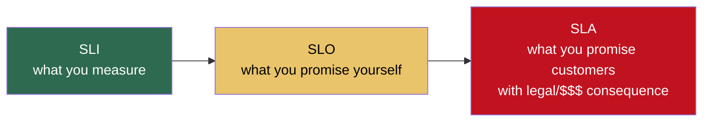
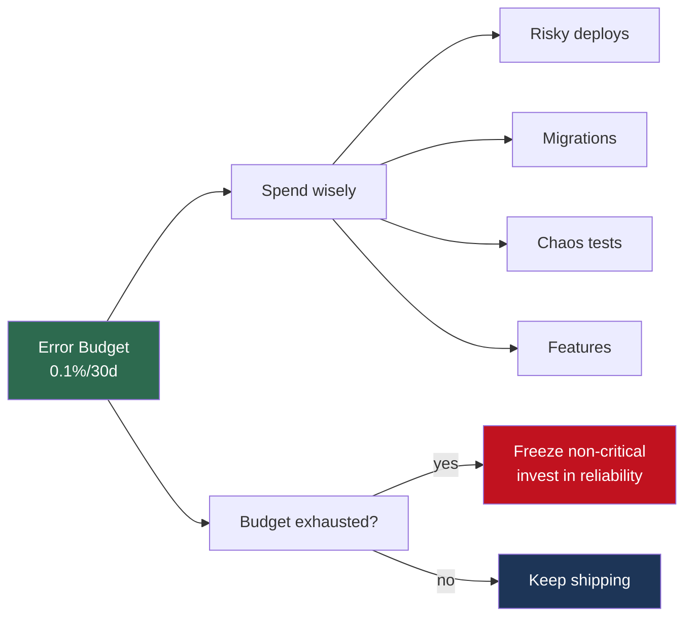

# 11.3.2 SLIs, SLOs, and Alerting Philosophy

**Backlinks:** [11.3.1 — Three Pillars](11.3.1_Three_Pillars_Metrics_Logs_Traces.md) · [11.6.2 — Incident Response](../Subchapter_11.6/11.6.2_Incident_Response_and_On_Call.md)

**Next note:** [11.4.1 — Databases for Platform Engineers](../Subchapter_11.4/11.4.1_Databases_for_Platform_Engineers.md)

---

## Why This Note Exists

The #1 reason teams burn out on-call: **alerts that don't matter.** Disk at 81% at 3am. CPU spike during a batch job. A retried request that succeeded.

Good platform engineering means saying **no** to alerts that don't correspond to real user pain, and **yes** to defining the handful that do. This is where SLIs, SLOs, and error budgets come in.

> **One-line rule:** if an alert doesn't require human action within minutes, it shouldn't be a page.

---

## Part 1: The Three Terms, Plainly



- **SLI — Service Level Indicator:** a specific number you measure. "The fraction of successful requests in the last 30 days."
- **SLO — Service Level Objective:** the target you set for that SLI. "99.9% of requests must succeed over a 30-day window."
- **SLA — Service Level Agreement:** a contract with your customer. "If we drop below 99.9%, we refund 10% of your bill."

**SLIs and SLOs are internal discipline.** SLAs are legal commitments — usually set at a more relaxed threshold than your SLO (your SLO is 99.95%, your SLA is 99.9%).

---

## Part 2: Picking Good SLIs

A good SLI measures what users **actually experience**:

| User perspective | SLI |
|---|---|
| "Does it work?" | Availability — fraction of successful requests |
| "Is it fast enough?" | Latency — fraction of requests faster than X |
| "Is it correct?" | Correctness — fraction of requests without data errors |
| "Is my data safe?" | Durability / freshness — fraction of data replicated / processed on time |

**Don't use as SLIs:**

- CPU usage (users don't feel CPU; they feel slow pages)
- Memory usage (same)
- Pod restart count (internal housekeeping)
- Queue depth (maybe a leading indicator — not a user-visible outcome)

Those are **diagnostic metrics**. Watch them, but don't promise against them.

### The Formula

For any event-based service:

$$\text{SLI} = \frac{\text{good events}}{\text{valid events}}$$

Where **"good"** is defined precisely (status < 500 AND latency < 500ms), and **"valid"** excludes things out of your control (client-side aborts, 401s from bad auth).

### Example SLIs for a typical API

```
availability_sli  = (# of requests with status 2xx/3xx/4xx<500) / (# of valid requests)
latency_sli       = (# of requests with duration < 300ms) / (# of valid requests)
```

---

## Part 3: Setting SLOs — Resist the Urge to Say "100%"

Nobody's service is 100% reliable. Not Google, not AWS. Chasing 100% means zero velocity (no deploys) and infinite cost.

### The "nines" table

| SLO | Allowed downtime / month | Allowed downtime / year |
|---|---|---|
| 90% ("one nine") | 3 days | 36 days |
| 99% ("two nines") | 7.2 hours | 3.6 days |
| 99.9% ("three nines") | 43 minutes | 8.7 hours |
| 99.95% | 21.9 minutes | 4.3 hours |
| 99.99% ("four nines") | 4.3 minutes | 52 minutes |
| 99.999% ("five nines") | 26 seconds | 5.2 minutes |

**Every additional nine costs ~10× more** (redundancy, multi-region, automation, humans).

### How to pick

1. **Ask users what they tolerate.** If your customers batch-process once a day, 99% might be fine.
2. **Measure current performance for a month.** If you're at 99.5%, don't set an SLO of 99.99% — you'll miss it every day.
3. **Set the SLO slightly tighter than you're consistently achieving.** It should be *hard but achievable*.

**Common starting points:**

- Internal tools: 99% or 99.5%
- Customer-facing APIs: 99.9%
- Critical infra (auth, payments): 99.95%+
- Human-in-the-loop workflows (batch jobs): fraction-processed-on-time, not raw availability

---

## Part 4: Error Budgets — The Best Idea You'll Steal

Once you have an SLO of 99.9%, you have implicitly agreed on a **0.1% error budget** per window.

That budget is your license to move fast. **You can spend it however you want:**

- Risky deploys that might break things
- Infrastructure migrations
- Chaos engineering
- Feature launches

When the budget is **healthy**: ship fast.
When the budget is **burned**: freeze non-critical changes, invest in reliability, fix the root cause.



This is the **single most important culture change** in modern SRE. It gives dev and ops a shared number to optimize against.

---

## Part 5: Alerting — The Four Rules

### Rule 1: Alert on symptoms, not causes

**Symptom:** "Checkout success rate is below SLO."
**Cause:** "Payments-svc CPU is at 90%."

Alert on the symptom. If CPU is high but users are fine — don't page. If users are suffering but CPU is low — you still want to know.

### Rule 2: Every alert must have an action

If the response is "eh, it'll probably go back to green" — **delete the alert**.

Every page must answer:
- What's broken? (Clear from the alert title)
- Why is it bad? (Impact described)
- What do I do? (Link to a runbook — see [11.6.2](../Subchapter_11.6/11.6.2_Incident_Response_and_On_Call.md))

### Rule 3: Fewer alerts, each precise

An on-call rotation that gets 20 pages a week is a team in decay.

Healthy rotations: **1–3 pages per on-call shift**, most resolvable in <30 minutes.

### Rule 4: Prefer "burn rate" to static thresholds

**Static threshold alert:** "error rate > 1% for 5 minutes."
Problem: too sensitive during a blip, too slow during a brown-out.

**Burn-rate alert:** "we're burning our error budget 14× faster than allowed."

```promql
# Multi-window multi-burn-rate alert (Google SRE book pattern)
# Fast: burn 2% of budget in 1 hour → page immediately
(
  sum(rate(http_requests_total{status=~"5.."}[1h]))
  / sum(rate(http_requests_total[1h]))
) > (14.4 * 0.001)                              # 14.4× burn rate for 99.9% SLO
AND
(
  sum(rate(http_requests_total{status=~"5.."}[5m]))
  / sum(rate(http_requests_total[5m]))
) > (14.4 * 0.001)                              # confirm in last 5 min
```

The short window confirms the issue is still ongoing; the long window prevents alerting on a 30s blip.

**Standard recipe:**

| Severity | Long window | Short window | Burn rate |
|---|---|---|---|
| Page (fast) | 1h | 5m | 14.4× |
| Page (slow) | 6h | 30m | 6× |
| Ticket | 3d | 6h | 1× |

---

## Part 6: Alert Fatigue — The Silent Killer

Symptoms of a team in alert fatigue:

- People acknowledge alerts without reading them
- Alerts stay firing for hours
- Slack channels with 1000 unread
- "It's always noisy, just ignore it"

**Fixes:**

1. **Weekly alert review** — any alert that fired and didn't need human action → delete or tune.
2. **SLO-based alerts** replace static thresholds.
3. **Consolidate:** one alert per root cause, not 15 alerts from 15 symptoms.
4. **Suppress during known maintenance** (put it in ticker-tape mode).
5. **Batch notifications** for non-urgent (daily digest instead of instant).

---

## Part 7: Alert Severity Levels

A sane taxonomy:

| Severity | Response | Examples |
|---|---|---|
| **P1 / Page** | Wake someone up | Service down, data loss, checkout broken |
| **P2 / Alert** | Business hours | Single-region degradation, elevated error rate |
| **P3 / Ticket** | Next business day | Slow memory growth, cert expiring in 14d |
| **P4 / FYI** | Dashboard only | CPU spike during nightly job |

**Every alert needs a severity.** The on-call phone only rings for P1.

---

## Part 8: A Minimal Alerting Config (Alertmanager)

```yaml
# Alertmanager routes
route:
  receiver: default
  group_by: [alertname, cluster]
  group_wait: 30s                  # wait to batch alerts about the same issue
  group_interval: 5m
  repeat_interval: 4h              # don't re-page for 4h if unchanged
  routes:
    - match: { severity: P1 }
      receiver: pagerduty
      group_wait: 0s               # page immediately for P1
    - match: { severity: P2 }
      receiver: slack-oncall
    - match: { severity: P3 }
      receiver: jira-ticket
```

```yaml
# Example Prometheus rule
groups:
  - name: slo.rules
    rules:
      - alert: ApiFastBurnRate
        expr: |
          (
            sum(rate(http_requests_total{status=~"5.."}[1h]))
            / sum(rate(http_requests_total[1h]))
          ) > (14.4 * 0.001)
          and
          (
            sum(rate(http_requests_total{status=~"5.."}[5m]))
            / sum(rate(http_requests_total[5m]))
          ) > (14.4 * 0.001)
        for: 2m
        labels:
          severity: P1
        annotations:
          summary: API burning error budget 14x fast
          runbook: https://runbooks.example.com/api-error-rate
          dashboard: https://grafana.example.com/d/api
```

Key ingredients: **severity label, summary, runbook link, dashboard link.** Every one of those saves on-call minutes.

---

## Part 9: SLOs in Practice — The Monthly Review

A good team runs a 30-minute SLO review every month:

1. **Pull the dashboard** — how did we track against each SLO?
2. **Which SLOs were missed?** Why? Do we need to invest?
3. **Which SLOs were easy?** Can we tighten them (raise the bar) or loosen them (free up engineering)?
4. **Alert noise report** — how many alerts fired, how many were actionable?
5. **Action items** — concrete, owned.

Tools: **Sloth**, **Grafana SLO** dashboards, **Nobl9**, **OpenSLO**. Or a spreadsheet. It's the discipline that matters, not the tool.

---

## Part 10: The "What to Alert On" Cheat Sheet

For most services:

| Alert | Why |
|---|---|
| SLO burn rate (multi-window) | Users feeling real pain |
| Service down (no metrics for 5m) | Probes failing or scrape broken |
| Certificate expiring in 14 days | Plan-ahead maintenance |
| Persistent volume > 90% | Grow or clean up |
| Queue depth > threshold | Workers can't keep up |
| Pod in `CrashLoopBackOff` > 10m | Someone needs to look |
| Dead-letter queue depth > 0 | Events need human triage |

**What not to alert on:**

- CPU high (meaningless without context)
- Memory high (often fine — caches, buffers)
- Individual request errors (except as burn-rate aggregate)
- Any "info" event (logs are for that)
- Known-flaky tests (fix or delete)

---

## Part 11: Common Footguns

1. **100% SLO.** Impossible, expensive, and it means your first incident blows your budget for the year.
2. **Alerting on CPU, not user pain.** Users don't care about CPU.
3. **Runbook that says "investigate."** Not a runbook. Write the actual steps.
4. **Same alert, different clusters, fires 50 times.** Use `group_by`.
5. **"We can't miss any error."** Yes you can. Your SLO has a budget — spend it.
6. **No SLO at all.** You have no objective measure of whether you're doing well.
7. **Alert after a human already noticed.** Your alert is too slow or too conservative.
8. **Sending all alerts to one channel everyone ignores.** Route by severity.
9. **Missing `for:` clause on alerts.** Every transient blip pages.
10. **No alert on alert pipeline itself.** If Prometheus is down, you think everything is healthy.

---

## Part 12: Platform Engineer's Checklist

- [ ] Every user-facing service has at least 2 SLIs (availability + latency)
- [ ] SLOs set based on measured current performance, with room to improve
- [ ] Error budget tracked monthly; policy for what to do when exhausted
- [ ] Alerts fire on SLO burn rate, not static thresholds
- [ ] Every alert has: severity, summary, runbook link, dashboard link
- [ ] Weekly alert review; noise gets tuned or deleted
- [ ] On-call gets < 3 pages per shift on average
- [ ] Meta-alerting: "Prometheus is down" / "Alertmanager is down"
- [ ] SLOs reviewed monthly, results shared with product/eng leadership

---

## Recap

- **SLI** = what you measure, **SLO** = what you target, **SLA** = what you contract.
- **Error budgets** are a license to ship fast — until they're gone.
- Alert on **symptoms** (user pain), not **causes** (CPU, RAM).
- **Burn-rate alerts** beat static thresholds.
- Every alert must be **actionable**, or it shouldn't exist.

Next: [11.4.1 — Databases for Platform Engineers](../Subchapter_11.4/11.4.1_Databases_for_Platform_Engineers.md) — connection pooling, migrations, replicas, and why your DB is probably your bottleneck.
