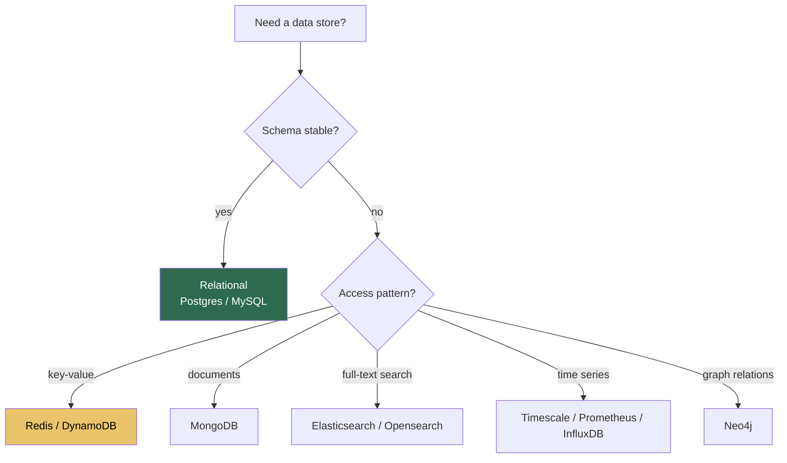
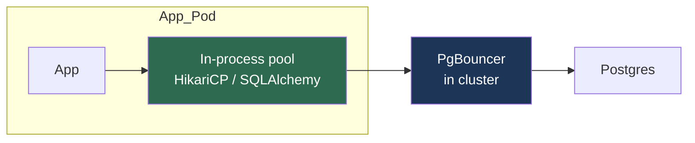
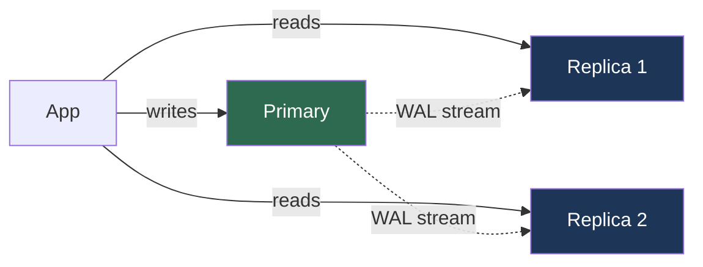
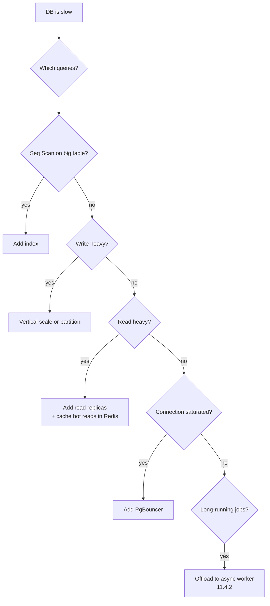

# 11.4.1 Databases for Platform Engineers

**Backlinks:** [11.2.1 — Secrets Management](../Subchapter_11.2/11.2.1_Secrets_Management_Deep_Dive.md) · [11.3.1 — Observability](../Subchapter_11.3/11.3.1_Three_Pillars_Metrics_Logs_Traces.md) · [5.5 K8s StatefulSets](../../5-Kubernetes/)

**Next note:** [11.4.2 — Message Queues and Async Patterns](11.4.2_Message_Queues_and_Async_Patterns.md)

---

## Why This Note Exists

Platform engineers aren't DBAs, but:

- **90% of production outages trace back to the database** (connection pool, slow query, disk full, replica lag).
- Every service you run talks to one.
- Every migration you ship can break prod.
- Every developer expects you to explain why their query is slow.

This note gives you the **operational literacy** to review PRs, debug slowness, and plan capacity without becoming a full-time DBA.

> **One-line rule:** you don't need to tune the DB. You need to know when it's unhappy and whom to talk to.

---

## Part 1: Pick One — SQL vs NoSQL vs the Weird Ones



**The honest default:** **PostgreSQL**. It does JSON, full-text search, time-series (with TimescaleDB), geospatial (PostGIS). Reach for specialty databases only when Postgres genuinely can't handle the scale or pattern.

**When you genuinely need something else:**

- **Redis** — caching, rate limiting, ephemeral queues. Data in RAM, optionally persisted.
- **DynamoDB / Cassandra** — web-scale key-value, predictable low latency, write-heavy.
- **Elasticsearch** — full-text search, log analytics.
- **Kafka** — event log (see [11.4.2](11.4.2_Message_Queues_and_Async_Patterns.md)).

---

## Part 2: Connection Management — Where Most Outages Start

Databases have a **hard cap on concurrent connections** (Postgres default: 100). Each connection costs ~10MB RAM on the server.

### 2.1 The math that bites everyone

```
50 app pods × 20 connections each = 1,000 connections
Postgres max_connections = 100
Result: the 101st connection fails. The app crashes. Outage.
```

### 2.2 Three-level pooling



- **In-process pool:** each app process reuses a handful of connections (typically 5-20 per pod).
- **PgBouncer (or RDS Proxy / PgPool / ProxySQL):** multiplexes thousands of app-side connections onto dozens of real DB connections.
- **Real DB:** small, fixed connection count.

**With PgBouncer in `transaction` mode**, 500 app pods can share 50 real DB connections. Problem solved.

### 2.3 Two gotchas with PgBouncer `transaction` mode

1. **Prepared statements** don't survive across transactions → your ORM may need config (`PREPARED_STATEMENT_CACHE_SIZE=0` for SQLAlchemy with PgBouncer).
2. **Advisory locks, `SET`, `LISTEN/NOTIFY`** tied to a specific session — don't work reliably.

For most apps, these are not a problem. Just be aware.

---

## Part 3: Transactions and Isolation

### 3.1 ACID in one sentence

- **A**tomicity — all or nothing
- **C**onsistency — constraints never violated
- **I**solation — concurrent transactions don't corrupt each other
- **D**urability — committed data survives a crash

### 3.2 Isolation levels (pick one, understand the trade-off)

| Level | Anomalies allowed | Typical use |
|---|---|---|
| Read Uncommitted | everything | never |
| Read Committed (Postgres default) | non-repeatable read, phantom read | most OLTP |
| Repeatable Read | phantom read | reports that iterate |
| Serializable | none | strict correctness, slowest |

**Plain English:** default to **Read Committed**. Reach for **Serializable** for money transfers, stock transfers, anywhere you can't afford a phantom row.

### 3.3 Deadlocks

Two transactions each waiting on a lock the other holds → database picks one, kills it with `deadlock_timeout` (default 1s), that transaction errors out.

**Your app must retry on deadlock.** It's not a bug, it's a normal occurrence.

```python
from sqlalchemy.exc import OperationalError
import time, random

def retry_on_deadlock(fn, max_attempts=3):
    for attempt in range(max_attempts):
        try:
            return fn()
        except OperationalError as e:
            if "deadlock" not in str(e).lower() or attempt == max_attempts - 1:
                raise
            time.sleep(0.1 * (2 ** attempt) + random.random() * 0.1)
```

---

## Part 4: Indexes — Fast Reads Aren't Free

**An index is a separate data structure** that makes lookups fast (O(log n) vs O(n)) at the cost of:

- Disk space (2-10% of table size per index)
- Write overhead (every INSERT/UPDATE updates every relevant index)

### 4.1 When to index

- Columns in `WHERE` clauses
- Foreign keys (always — joins are critical)
- Columns in `ORDER BY`
- Unique constraints (Postgres creates these automatically)

### 4.2 When NOT to index

- Low-cardinality columns alone (`is_deleted` — two values, index useless)
- Tables with extreme write rates and rare reads

### 4.3 Composite indexes — order matters

An index on `(user_id, created_at)` can serve:
- `WHERE user_id = 42`
- `WHERE user_id = 42 AND created_at > ...`
- `WHERE user_id = 42 ORDER BY created_at`

…but **not**:
- `WHERE created_at > ...` alone (you'd need an index with `created_at` first)

**Rule:** put the equality column first, range column second.

### 4.4 `EXPLAIN ANALYZE` — your best friend

```sql
EXPLAIN ANALYZE
  SELECT * FROM orders
  WHERE user_id = 42 AND status = 'shipped'
  ORDER BY created_at DESC LIMIT 20;
```

Look for:
- `Seq Scan` on large tables → you need an index
- `Sort` → might be avoided with a matching index
- Actual rows vs estimated rows wildly off → stats stale, run `ANALYZE`

---

## Part 5: Migrations — Don't Break Prod on Deploy

### 5.1 The "zero-downtime" rules

1. **Never drop a column the old code still reads.**
2. **Never rename a column the old code still references.**
3. **Never add a `NOT NULL` column without a default.**
4. **Never take a lock that blocks reads on a big table during deploy.**

The **expand-and-contract** pattern solves (1)–(3):

```
step 1 (deploy 1): ADD new column, writes go to both old and new
step 2 (backfill): data migration (in batches) to populate new
step 3 (deploy 2): reads switch to new column
step 4 (deploy 3): DROP old column
```

4 separate PRs. Boring. Safe.

### 5.2 Dangerous Postgres operations (read before running)

| Operation | What it locks | Safe? |
|---|---|---|
| `CREATE INDEX` | Writes on the table | ❌ Use `CREATE INDEX CONCURRENTLY` |
| `ALTER TABLE ADD COLUMN` (no default) | Brief | ✅ Fast |
| `ALTER TABLE ADD COLUMN ... DEFAULT ...` (PG 11+) | Brief | ✅ Fast on PG 11+ |
| `ALTER TABLE ALTER COLUMN TYPE` | Full rewrite, exclusive | ❌ Use a new column |
| `DROP INDEX` | Writes on the table briefly | ⚠ Use `DROP INDEX CONCURRENTLY` |
| `VACUUM FULL` | Exclusive on table | ❌ Never in prod — use `pg_repack` |

### 5.3 Tools

- **Alembic** (Python) — generates migration scripts from SQLAlchemy models
- **Flyway** — language-agnostic, SQL-based
- **Liquibase** — XML/YAML changelog, enterprise-oriented
- **Atlas / Prisma Migrate / Rails AR migrations** — framework-specific

Run them **in CI before deploy**, not at app startup.

---

## Part 6: Replication and Read Replicas

### 6.1 The setup



- **Primary** handles writes and consistent reads.
- **Replicas** stream the write-ahead log (WAL) from primary and serve reads.

### 6.2 Replication lag — the gotcha

Replicas are **eventually consistent**. Typically milliseconds behind; during high write load or big queries, seconds.

```python
# User creates an order
order = create_order(...)     # → primary

# User reloads their orders list
orders = list_orders()         # → replica — might NOT show the order yet!
```

**Fixes:**

- Read-after-write on the primary for the immediate next request ("sticky" primary for this user for N seconds).
- Session-level `read_lsn` tracking (advanced).
- Design the UI to be optimistic (show the new order locally).

### 6.3 Failover

- **Managed** (RDS, Cloud SQL): failover happens for you in ~30-60s.
- **Self-hosted**: Patroni / Stolon elect a new primary automatically.

**Your app must reconnect** after failover. Connection pools must notice dead connections (set a short connection age / idle timeout).

---

## Part 7: Backups — Untested Backups Are Wishes

### 7.1 Three types

| Type | What | RPO | Cost |
|---|---|---|---|
| **Logical dump** (`pg_dump`) | SQL statements | As old as last dump | Low |
| **Physical snapshot** | Disk-level | Minutes | Medium |
| **Continuous archive** (WAL) | Every committed write | Near-zero (point in time) | Higher |

Production pattern: **snapshot daily + continuous WAL archive** → point-in-time recovery (PITR) to any second in the last N days.

### 7.2 The only backup that matters is the one you restored

Run **monthly restore drills**. Pull last night's backup into a staging environment, run the app against it. If that hurts, you have no backups.

Document:
- **RPO (Recovery Point Objective):** how much data you accept losing
- **RTO (Recovery Time Objective):** how fast you need to be back up
- Whose pager goes off during a restore

---

## Part 8: Observability for Databases

Add these to your Grafana dashboards ([11.3.1](../Subchapter_11.3/11.3.1_Three_Pillars_Metrics_Logs_Traces.md)):

**Critical metrics:**

| Metric | Why |
|---|---|
| Active connections vs max | When this saturates, everything dies |
| Replication lag | Stale reads, risk during failover |
| Transactions per second | Capacity baseline |
| Cache hit ratio (`pg_statio`) | Should be >99%; lower = queries hitting disk |
| Slow query rate | `pg_stat_statements` |
| Deadlocks per minute | Should be near-zero |
| WAL generation rate | Disk / network capacity |
| Disk usage + growth rate | When will you run out? |

**`pg_stat_statements`** — the most useful extension in Postgres. Shows you every query's total time, call count, average duration.

```sql
SELECT query, calls, total_exec_time, mean_exec_time
FROM pg_stat_statements
ORDER BY total_exec_time DESC LIMIT 10;
```

The top 10 list is usually where all your latency lives.

---

## Part 9: Scaling — When to Reach for What



**Order to try:**

1. Fix the query (add indexes, rewrite).
2. Cache the common reads (Redis, cache-aside).
3. Add read replicas.
4. Vertical scale the primary (bigger instance).
5. Partition or shard (nuclear option).

Most teams never need step 5.

---

## Part 10: Caching — Harder Than It Looks

### 10.1 Cache-aside (the default)

```python
def get_user(user_id):
    cached = redis.get(f"user:{user_id}")
    if cached:
        return json.loads(cached)
    user = db.query("SELECT * FROM users WHERE id=%s", user_id)
    redis.setex(f"user:{user_id}", 300, json.dumps(user))  # 5 min TTL
    return user

def update_user(user_id, **fields):
    db.update("users", user_id, **fields)
    redis.delete(f"user:{user_id}")          # invalidate
```

### 10.2 The two hard problems

1. **Cache invalidation.** "There are only two hard things in computer science: cache invalidation and naming things." The safest answer is **short TTLs** (seconds to minutes), not "precise invalidation."
2. **Thundering herd / stampede.** Cache expires, 1000 requests miss at once, all hit DB. Mitigations: randomize TTLs (±10%), lock the regeneration (one request refreshes, others wait), probabilistic early expiration.

---

## Part 11: NoSQL Sanity Checks

If you're reaching for NoSQL:

- **Redis:** data fits in RAM? Acceptable to lose recent data on crash? → yes.
- **DynamoDB:** queries known in advance? Keyed access? Need multi-region active-active? → yes.
- **MongoDB:** document-shaped natural data, schema varies per doc? → maybe. But Postgres JSONB often fits.
- **Elasticsearch:** full-text search, analytics over logs. **Not a source of truth.** Index from your primary DB.

**The NoSQL trap:** picked for "scale" reasons on a project that never reaches that scale, ending up with a worse developer experience and no joins.

---

## Part 12: Common Footguns

1. **No connection pool.** Each request opens a connection — DB saturates at a few hundred RPS.
2. **`SELECT *` in a loop.** N+1 queries. Use joins or batch-load.
3. **`LIMIT 10 OFFSET 100000`** on a big table — Postgres still scans 100k rows. Use keyset pagination.
4. **Running `CREATE INDEX` on a billion-row table at 2pm.** Kills writes for hours. Use `CONCURRENTLY`.
5. **ORM lazy-loading in loops.** Triggers one query per iteration.
6. **Long-running transactions.** Bloat, locks, replica lag. Keep transactions <5s.
7. **Unbounded result sets.** `SELECT ... FROM orders` with no `WHERE` returns everything → OOM.
8. **Text passwords / PII** in plaintext columns.
9. **No backups tested.** You don't have backups; you have hopes.
10. **Ignoring `NOTICE: relation ... already exists`** — in CI vs prod, silently diverging schemas.
11. **Migration that takes a lock and blocks every deploy.**
12. **Shared DB across services.** Coupling, blast radius, no independent schema evolution.

---

## Part 13: Platform Engineer's Checklist

- [ ] One DB per service; no shared tables across services
- [ ] PgBouncer (or equivalent) in front of every Postgres
- [ ] Per-service DB user, least privilege, from vault
- [ ] `pg_stat_statements` enabled
- [ ] Top queries dashboard in Grafana
- [ ] Slow query log on, reviewed weekly
- [ ] Replication lag alert
- [ ] Disk growth rate alert (projected "days to full")
- [ ] Backups automated + PITR + **monthly restore drill**
- [ ] Migrations gated in CI, no `ALTER TABLE` without review
- [ ] Runbook for: DB down, replica lag, connection saturation ([11.6.2](../Subchapter_11.6/11.6.2_Incident_Response_and_On_Call.md))
- [ ] All writes idempotent or in transactions with retry on deadlock

---

## Recap

- **Postgres** is almost always the right default.
- **Connection pooling** at three levels (in-process + PgBouncer + DB) or you will have outages.
- **Indexes** make reads fast; **`EXPLAIN ANALYZE`** tells you if you need one.
- **Migrations** use expand-contract; never drop+rename in one deploy.
- **Replicas** solve reads, not writes; watch replication lag.
- **Backups** you haven't restored are not backups.

Next: [11.4.2 — Message Queues and Async Patterns](11.4.2_Message_Queues_and_Async_Patterns.md) — Kafka, RabbitMQ, Redis, DLQs, and when to use which.
