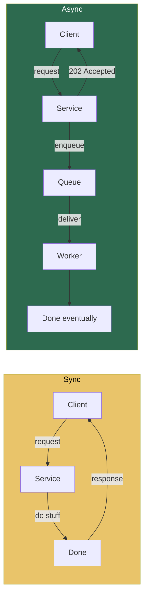
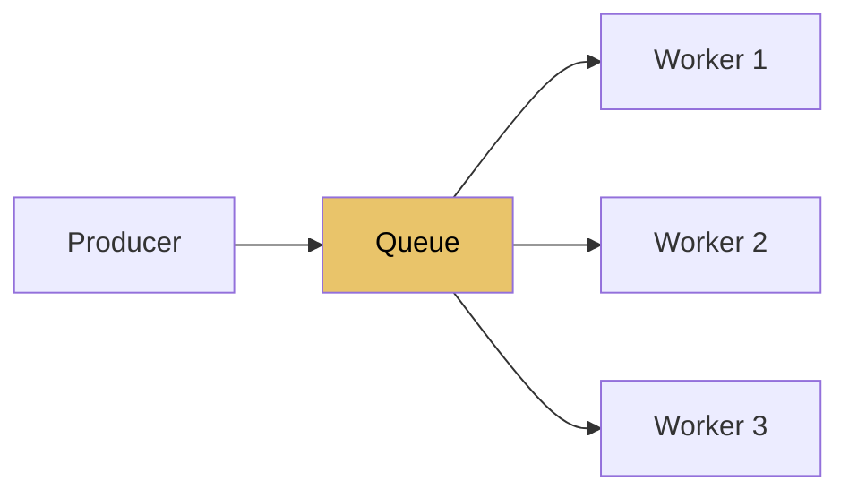
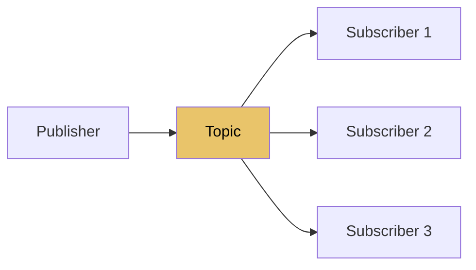
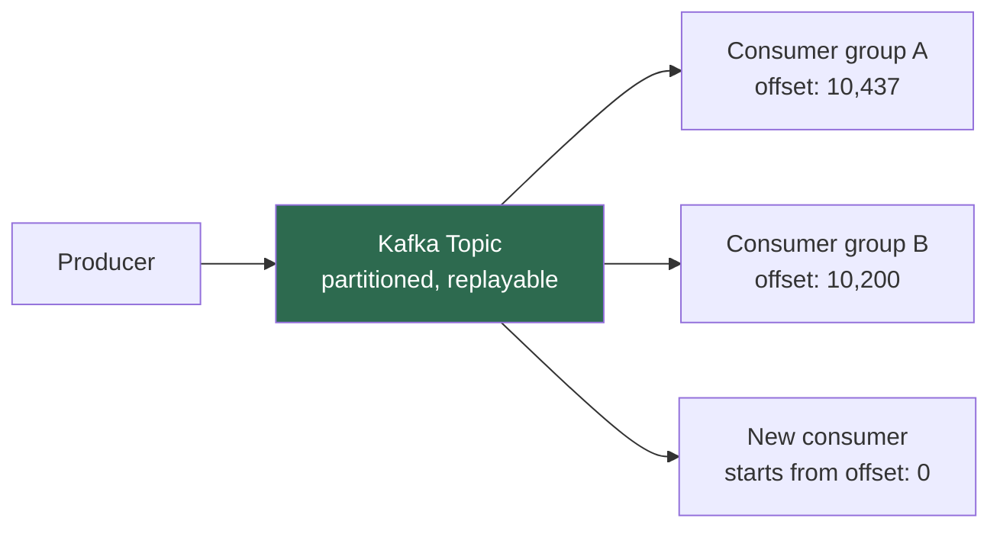
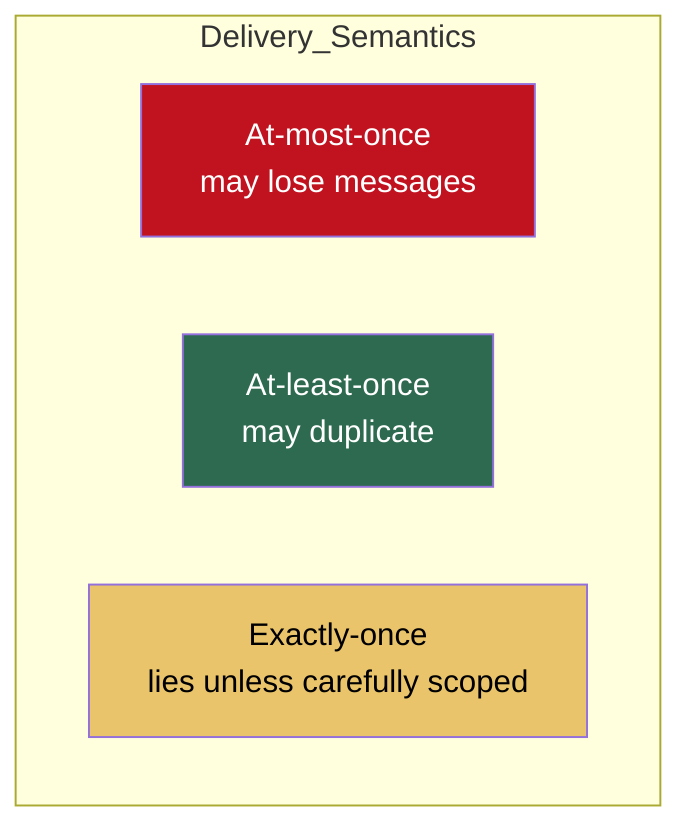
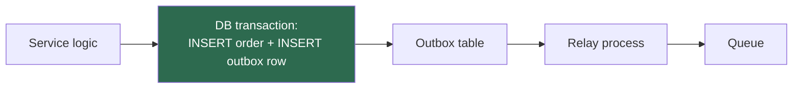
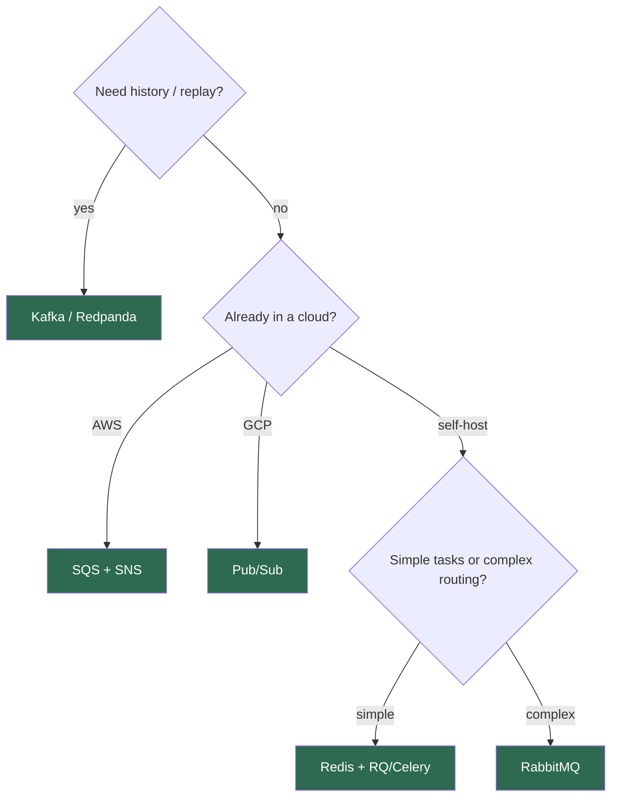
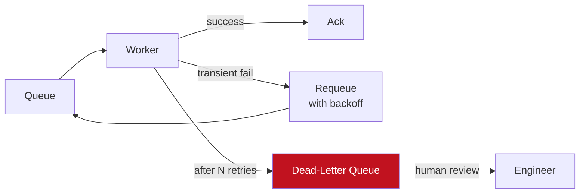

# 11.4.2 Message Queues and Async Patterns

**Backlinks:** [11.1.3 — Webhooks](../Subchapter_11.1/11.1.3_Webhooks_Done_Right.md) · [11.4.1 — Databases](11.4.1_Databases_for_Platform_Engineers.md) · [9.3.4 — Python Queues](../../9-Python/Subchapter_9.3/)

**Next note:** [11.5.1 — Cloud Primitives and IaC](../Subchapter_11.5/11.5.1_Cloud_Primitives_and_IaC.md)

---

## Why This Note Exists

The moment your app does anything heavier than a CRUD request, you need **asynchronous processing**:

- Send welcome emails → don't block the signup response
- Process uploaded videos → don't hold the HTTP connection for 5 minutes
- Sync to external APIs → don't fail the whole request if Stripe is slow
- Propagate events to other services → decouple deploy lifecycles

This note covers the mental model, the three main tools (Kafka, RabbitMQ, Redis), and the design patterns that keep async systems from becoming nightmares.

> **One-line rule:** every async message will be delivered **at least once**. Design every consumer to be idempotent.

---

## Part 1: Sync vs Async — When to Switch



**Go async when:**

- The work is slow (>1-2 seconds)
- The work can be retried safely
- The caller doesn't need the result immediately
- You want to decouple producer and consumer lifecycles
- Spiky load → smooth it over time via the queue

**Stay sync when:**

- The caller needs the answer to proceed (e.g., "is this password right?")
- The operation is a true read
- The work is <100ms anyway

---

## Part 2: The Three Patterns You'll Meet

### 2.1 Work queue (task queue)

One producer puts jobs on a queue, one of many workers picks each up and runs it.



Each message is processed by **exactly one** worker (competing consumers).

**Typical tools:** RabbitMQ, Redis + Celery/RQ/Sidekiq, AWS SQS, GCP Pub/Sub.

**Use cases:** send email, resize image, process upload, run background job.

### 2.2 Pub/Sub (fanout)

One publisher, many subscribers, each independently sees every message.



**Typical tools:** Kafka, Redis Pub/Sub, NATS, Google Pub/Sub, SNS.

**Use cases:** event broadcasting ("user signed up" → analytics, email service, audit log, welcome sequence).

### 2.3 Event log / event streaming

Messages are retained on an **append-only log** for days/months. Consumers track their position and can replay.



**Typical tools:** Apache Kafka, Redpanda, AWS Kinesis, Google Pub/Sub Lite.

**Use cases:** event sourcing, data pipeline backbones, replaying history into new systems, CDC (change data capture) from DBs.

---

## Part 3: Delivery Guarantees — The Thing Everyone Misunderstands



### 3.1 At-most-once

"Fire and forget." Producer sends, doesn't wait for ack. If the broker crashes mid-send, the message is gone.
**Use when:** losing a message is fine (non-critical metrics, debug logs).

### 3.2 At-least-once (the default you should assume)

Producer retries until acknowledged; consumer acks after processing. If the consumer crashes after processing but before ack, the broker redelivers → **duplicate processing**.

**Use when:** almost always. **Design consumers to be idempotent.**

### 3.3 "Exactly-once" — the lie, and the partial truth

"Exactly once" is physically impossible across a network unless both ends coordinate through the same atomic store.

Kafka has **EOS (Exactly-Once Semantics)** — works only when your input, processing, and output are all **within the same Kafka cluster** (stream processing topology). If you're writing to a database, you're back to at-least-once + idempotency.

**Practical rule:** Build for **at-least-once + idempotent consumers**. Stop chasing exactly-once.

---

## Part 4: Making Consumers Idempotent

Three battle-tested patterns:

### 4.1 Natural idempotency

The operation itself is idempotent by its nature:

```sql
UPDATE orders SET status='shipped' WHERE id=42;   -- doing it twice == doing it once
```

### 4.2 Dedupe key

Producer attaches a unique ID; consumer records processed IDs.

```python
def handle(msg):
    if redis.set(f"processed:{msg.id}", "1", nx=True, ex=86400):
        # First time
        do_work(msg)
    # Either way, ack
```

### 4.3 Transactional outbox

When the work is "write to DB + emit event", do both in **one DB transaction**, then a separate process forwards the outbox rows to the queue.



This solves **dual-write inconsistency**: you never have "wrote to DB but queue failed" or "queued but DB rolled back."

---

## Part 5: Choosing a Tool

### 5.1 The Cheat Sheet

| Tool | Model | Retention | Ordering | When to pick |
|---|---|---|---|---|
| **RabbitMQ** | Work queue + Pub/Sub | Until acked | Per-queue | Classic task queues, flexible routing |
| **Redis (+ Celery/RQ)** | Work queue | Until popped | FIFO per list | Simple, already have Redis |
| **Kafka** | Event log | Days/months | Per partition | Event streaming, replay, high throughput |
| **AWS SQS** | Work queue | Up to 14 days | FIFO mode opt-in | AWS-native, zero ops |
| **NATS / JetStream** | Pub/Sub + streams | Configurable | Per stream | Lightweight, modern alternative to Kafka |
| **Google Pub/Sub** | Pub/Sub | 7 days | Optional | GCP-native, zero ops |

### 5.2 Decision tree



### 5.3 RabbitMQ vs Kafka — the common confusion

**RabbitMQ** is a smart broker: routing, filtering, exchanges, dead-letter queues are built-in. Messages are deleted once acked. Per-queue ordering.

**Kafka** is a dumb log: producers append, consumers read offsets. Messages stick around. Per-partition ordering. Vastly higher throughput, much harder to operate.

**Rule of thumb:**
- Discrete **tasks** → RabbitMQ or SQS
- Continuous **events** with history and replay → Kafka

---

## Part 6: Dead-Letter Queues (DLQ) — Where Poison Messages Go

Some messages can never be processed: malformed JSON, unknown schema, data that violates invariants. If you just retry forever, your queue backs up.

**Pattern:**



- After `max_retries` attempts, move to DLQ instead of requeuing.
- DLQ is **inspected manually** — alert on non-zero depth.
- Once root cause fixed, replay DLQ back onto the main queue.

**Every production queue you operate needs a DLQ.** No exceptions.

---

## Part 7: Ordering Within a Partition

Kafka gives you ordering **per partition**, not globally. To ensure all events for one user are processed in order:

```python
# Use user_id as the partition key
producer.send("user-events", key=str(user_id).encode(), value=event)
```

Kafka hashes the key → same key → same partition → preserved order.

**Trade-off:** one "hot" key (e.g., a single big customer) can overload one partition while others sit idle.

---

## Part 8: Backpressure — When Producers Are Too Fast

A producer that pushes faster than consumers can process will:

1. Fill the queue
2. Eventually OOM the broker or exhaust disk
3. Degrade everyone

**Defenses:**

- **Producer-side rate limiting:** if the queue depth > threshold, slow down.
- **Bounded queues** in the producer's in-process buffer — block when full rather than OOM.
- **Priority queues** — drop low-priority messages under load.
- **Fan-out with multiple consumers** to keep up.

**Alert on queue depth** as an SLI ([11.3.2](../Subchapter_11.3/11.3.2_SLIs_SLOs_and_Alerting_Philosophy.md)).

---

## Part 9: Minimal Working Examples

### 9.1 Redis + RQ (Python)

```python
# producer.py
from redis import Redis
from rq import Queue

q = Queue(connection=Redis())

def send_welcome_email(user_id, email):
    # this is the "job"
    ...

q.enqueue(send_welcome_email, user_id=42, email="a@b.com")

# worker.py
# rq worker   # runs in a separate process
```

Dead simple, fine for most task queue workloads.

### 9.2 RabbitMQ (pika)

```python
# producer
import pika, json
conn = pika.BlockingConnection(pika.ConnectionParameters("localhost"))
ch = conn.channel()
ch.queue_declare(queue="tasks", durable=True)
ch.basic_publish(
    exchange="",
    routing_key="tasks",
    body=json.dumps({"job": "resize", "url": "..."}),
    properties=pika.BasicProperties(delivery_mode=2),   # persist to disk
)

# consumer
def on_message(ch, method, props, body):
    try:
        do_work(json.loads(body))
        ch.basic_ack(delivery_tag=method.delivery_tag)
    except Exception:
        ch.basic_nack(delivery_tag=method.delivery_tag, requeue=False)  # → DLQ

ch.basic_qos(prefetch_count=10)   # don't take more than 10 at once
ch.basic_consume(queue="tasks", on_message_callback=on_message)
ch.start_consuming()
```

Key bits: durable queue, persistent messages, manual ack, `prefetch_count`, nack-to-DLQ on failure.

### 9.3 Kafka (confluent-kafka)

```python
# producer
from confluent_kafka import Producer
p = Producer({"bootstrap.servers": "kafka:9092"})

def deliver(err, msg):
    if err: print("failed:", err)

p.produce("orders", key=str(order_id), value=json.dumps(order), callback=deliver)
p.flush()

# consumer
from confluent_kafka import Consumer
c = Consumer({
    "bootstrap.servers": "kafka:9092",
    "group.id": "order-processor",
    "enable.auto.commit": False,            # manual commit — critical
    "auto.offset.reset": "earliest",
})
c.subscribe(["orders"])

while True:
    msg = c.poll(1.0)
    if msg and not msg.error():
        try:
            process(json.loads(msg.value()))
            c.commit(msg)                    # commit AFTER success
        except Exception:
            log.exception("process failed")
            # don't commit → will be redelivered on restart
```

Key bits: **manual commit after success**. Auto-commit will happily ack messages you haven't actually processed.

---

## Part 10: Observability for Queues

Must-have metrics ([11.3.1](../Subchapter_11.3/11.3.1_Three_Pillars_Metrics_Logs_Traces.md)):

| Metric | Why |
|---|---|
| Queue depth | Are workers keeping up? |
| Consumer lag (Kafka) | How far behind are we? |
| Processing time p99 | Are messages taking too long? |
| Retry count | Are we flailing? |
| DLQ depth | Need human attention |
| Producer publish rate | Input volume |
| Consumer processing rate | Output volume |
| Publish errors | Broker issues |

Alert on:
- Queue depth > threshold for > 5m
- DLQ depth > 0
- Consumer lag > N messages or > T seconds
- No messages processed in N minutes (consumer stuck)

---

## Part 11: Common Footguns

1. **Not idempotent.** Duplicate processing → duplicate charges. Design for at-least-once.
2. **Auto-commit in Kafka.** You commit before processing → crash → message lost.
3. **Ack before work done.** Same problem.
4. **No DLQ.** Poison message blocks the queue forever.
5. **Infinite retries.** Exhaust workers, fill disk.
6. **Huge messages.** Put big blobs in S3, send the URL. Not the blob.
7. **Synchronous DB write from consumer without retry.** Transient DB blip → message dropped.
8. **No backpressure.** Producer floods broker, system collapses.
9. **Forgetting to delete messages (SQS).** They reappear after visibility timeout; looks like "it retried itself."
10. **Consumer group ID collision.** Two unrelated services share `group.id` → each sees half the messages.
11. **Running Kafka yourself "because scalable."** Kafka is operationally heavy. Use a managed offering until you have real reason.
12. **Treating queues as databases.** Retention is for replay/safety, not querying.

---

## Part 12: Platform Engineer's Checklist

- [ ] Every queue has a DLQ, alerts on depth > 0
- [ ] Consumers are idempotent (documented how)
- [ ] Manual ack / commit only on success
- [ ] Bounded retries with exponential backoff
- [ ] Message size limits enforced
- [ ] Queue-depth SLO defined, alert wired
- [ ] Kafka topics have key strategy documented (ordering guarantees)
- [ ] Dashboard shows: depth, throughput, processing p99, DLQ, errors
- [ ] Runbook for: consumer stuck, broker down, DLQ replay
- [ ] Schema discipline: versioned, backward-compatible (Avro/Protobuf or explicit `version` field)

---

## Recap

- Go async when work is slow, retryable, or doesn't block the caller.
- **At-least-once is reality.** Make consumers idempotent.
- **Pick by pattern:** task queue → RabbitMQ/Redis/SQS; event streaming → Kafka.
- **DLQs are not optional.** Every queue needs one.
- Commit/ack **after** successful processing, never before.
- Queue depth, consumer lag, DLQ depth — the three metrics that matter.

Next: [11.5.1 — Cloud Primitives and IaC](../Subchapter_11.5/11.5.1_Cloud_Primitives_and_IaC.md) — VPCs, IAM, Terraform, and how not to accidentally expose S3 to the internet.
