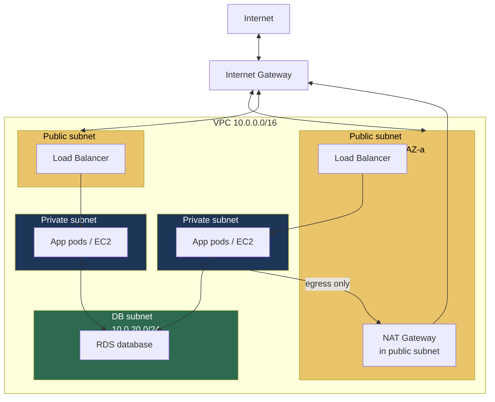
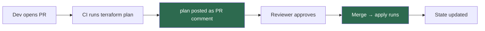

# 11.5.1 Cloud Primitives and IaC

**Backlinks:** [2.2 Networking Basics](../../2-Networking/) · [11.2.2 — Supply Chain Security](../Subchapter_11.2/11.2.2_Supply_Chain_Security_and_OWASP.md) · [10.1 GitOps Principles](../../10-GitOps-ArgoCD/Subchapter_10.1/)

**Next note:** [11.5.2 — DNS, TLS, and Certificates Deep Dive](11.5.2_DNS_TLS_and_Certificates_Deep_Dive.md)

---

## Why This Note Exists

You don't need to be an AWS Solutions Architect. You do need to:

- Read a Terraform module and spot the footguns
- Understand a cloud bill enough to challenge a $4k EC2 instance
- Know what a VPC, subnet, NAT gateway, and IAM role are without looking them up mid-incident
- Help developers debug "my service can't reach the database"
- Review an IaC PR without breaking production

This note is a **whirlwind tour of cloud primitives** with a bias toward AWS (the most common), plus the IaC discipline to manage them sanely.

> **One-line rule:** treat infrastructure as code, and code as infrastructure. Everything in Git, reviewed, versioned.

---

## Part 1: The Mental Map of Any Cloud

All three major clouds (AWS, GCP, Azure) have the same primitives with different names:

| Concept | AWS | GCP | Azure |
|---|---|---|---|
| Virtual network | VPC | VPC | VNet |
| Subnet | Subnet | Subnet | Subnet |
| Compute (VM) | EC2 | Compute Engine | Virtual Machine |
| Managed K8s | EKS | GKE | AKS |
| Object storage | S3 | Cloud Storage | Blob Storage |
| Block storage | EBS | Persistent Disk | Managed Disk |
| Managed DB (Postgres) | RDS | Cloud SQL | Database for PostgreSQL |
| Serverless functions | Lambda | Cloud Functions | Functions |
| Managed queue | SQS | Pub/Sub | Service Bus |
| Secrets | Secrets Manager | Secret Manager | Key Vault |
| DNS | Route 53 | Cloud DNS | DNS |
| Load balancer | ALB / NLB | Cloud LB | Load Balancer |
| Identity | IAM | IAM | RBAC + AAD |

Learn the concepts once, translate the names as needed.

---

## Part 2: Networking — The VPC You Actually Need

Every production workload runs in a **VPC** (Virtual Private Cloud): your private, isolated network inside the cloud provider.



**The pattern to memorize:**

- **Public subnets** — resources reachable from the internet (load balancers, NAT gateways). `IGW` → here.
- **Private subnets** — compute. No inbound from internet. Outbound via NAT.
- **Data subnets** — database only. Even more locked down.
- **Across ≥ 2 AZs** — availability zone failure is a real thing.

### 2.1 Security Groups vs NACLs

Two layers of network control:

- **Security Group (SG):** a stateful firewall **attached to an instance/ENI**. Default deny inbound, default allow outbound. **Use this 99% of the time.**
- **NACL (Network ACL):** stateless firewall **attached to a subnet**. Rarely touched except for explicit deny rules.

```hcl
resource "aws_security_group" "app" {
  name        = "app"
  description = "allow inbound from ALB only"
  vpc_id      = aws_vpc.main.id

  ingress {
    from_port       = 8080
    to_port         = 8080
    protocol        = "tcp"
    security_groups = [aws_security_group.alb.id]  # reference, not 0.0.0.0/0!
  }

  egress {
    from_port   = 0
    to_port     = 0
    protocol    = "-1"
    cidr_blocks = ["0.0.0.0/0"]
  }
}
```

**The one rule:** never write `cidr_blocks = ["0.0.0.0/0"]` on an inbound rule for a non-public resource. Reference another SG or a specific CIDR.

### 2.2 NAT Gateway — the sneaky cost

A NAT Gateway lets private-subnet resources reach the internet for software updates, API calls, etc.

**It's expensive:**
- ~$33/month per NAT gateway
- **$0.045/GB processed** — this is the killer. A service that downloads a lot (logs, images, package installs) can ring up $100s/month in NAT fees.

**Mitigations:**
- Use **VPC endpoints** for AWS services (S3, DynamoDB, ECR) — traffic skips the NAT.
- Consolidate NAT across shared services VPC.
- Monitor NAT Gateway bytes per service and alert on outliers.

---

## Part 3: IAM — The Single Most Important Cloud Concept

Everything in the cloud is mediated by IAM. Getting IAM right is 80% of cloud security.

### 3.1 Principals, actions, resources

Every IAM policy answers: **"can THIS principal do THIS action on THIS resource?"**

```json
{
  "Version": "2012-10-17",
  "Statement": [{
    "Effect": "Allow",
    "Action": [
      "s3:GetObject",
      "s3:PutObject"
    ],
    "Resource": "arn:aws:s3:::my-bucket/uploads/*"
  }]
}
```

- **Principal** (implicit — the entity this policy is attached to)
- **Action** — what API call
- **Resource** — which specific thing (be specific! not `*`)
- **Condition** (optional) — additional constraints (`aws:RequestedRegion`, time-of-day, MFA required)

### 3.2 Role vs user vs policy

- **User** — long-lived identity with access keys. **Avoid.** Use for humans if there's no SSO, and that's it.
- **Role** — an identity that services/humans **assume** temporarily. Issues short-lived tokens. **Use always.**
- **Policy** — the set of permissions. Attached to users, roles, groups.

### 3.3 The way workloads should authenticate

**Never put AWS access keys in a container.** Use:

| Compute | Mechanism |
|---|---|
| EC2 | IAM Instance Profile (role attached to instance) |
| EKS / K8s | IRSA (IAM Roles for Service Accounts) |
| Lambda | Execution Role |
| GitHub Actions | OIDC federation → assume role |

### 3.4 IRSA in 30 seconds

Your K8s ServiceAccount gets an annotation pointing at an IAM role. The EKS webhook injects an OIDC token. The pod exchanges it for short-lived AWS creds. **No secrets anywhere.**

```yaml
apiVersion: v1
kind: ServiceAccount
metadata:
  name: s3-reader
  annotations:
    eks.amazonaws.com/role-arn: arn:aws:iam::123456789012:role/S3ReaderRole
```

```hcl
# The IAM role trust policy allows the K8s SA to assume it
resource "aws_iam_role" "s3_reader" {
  assume_role_policy = jsonencode({
    Statement = [{
      Effect = "Allow"
      Principal = { Federated = aws_iam_openid_connect_provider.eks.arn }
      Action = "sts:AssumeRoleWithWebIdentity"
      Condition = {
        StringEquals = {
          "${replace(aws_iam_openid_connect_provider.eks.url, "https://", "")}:sub" =
            "system:serviceaccount:default:s3-reader"
        }
      }
    }]
  })
}
```

### 3.5 Least privilege — the practical way

- Start with "deny all", add permissions until the service works.
- Scope `Resource:` to specific ARNs (never `*` unless truly global).
- Use AWS Access Analyzer to generate least-privilege policies from CloudTrail.
- Review role permissions quarterly; strip unused.

---

## Part 4: Compute Choices — A Quick Survey

| Option | When to use |
|---|---|
| **Raw EC2/VM** | You need full control, specialty hardware |
| **ECS / Cloud Run** | Container workloads, don't want to run K8s |
| **EKS / GKE / AKS** | Container workloads, you have or need K8s |
| **Lambda / Cloud Functions** | Spiky, event-driven, short-running |
| **Fargate / Cloud Run** | Containers without managing nodes |

**Bias:** if you're already running K8s, put workloads there. If not, Fargate/Cloud Run is usually easier than a whole K8s cluster.

**For batch** (ML training, video encoding): AWS Batch / EC2 Spot instances. Spot is 60-90% cheaper; design jobs to survive preemption.

---

## Part 5: Storage Basics

### 5.1 Three kinds

| Type | AWS | When |
|---|---|---|
| **Block** | EBS | Attached to one instance, like a local disk |
| **File** | EFS / FSx | Shared filesystem across instances (NFS) |
| **Object** | S3 | Blobs, unlimited scale, web-accessible |

### 5.2 S3 — the one you'll use most

- **Eleven 9s of durability** (not availability — durability).
- Pay per GB stored, per request, per GB egress.
- **Everything is private by default now** (was a huge source of breaches pre-2018).
- **Versioning** — retains old versions; protects against accidental delete.
- **Lifecycle policies** — auto-move to Glacier after N days, delete after M.
- **Server-side encryption** (SSE-S3 or SSE-KMS) — free, always on.

**Common S3 gotchas:**

1. **Public by accident.** Block Public Access on the account level. Unblock per-bucket only when intentional.
2. **Egress costs.** Transferring out of AWS is $0.09/GB. A 10TB migration = $900.
3. **LIST is slow on huge prefixes.** Use prefixes with date or hash.
4. **No "rename".** Copy + delete. Expensive for large objects.

---

## Part 6: Terraform — IaC That Doesn't Bite

Terraform is the dominant IaC tool. HCL syntax, provider plugins for every cloud.

### 6.1 The three files you'll see

```
main.tf         # resource declarations
variables.tf    # inputs
outputs.tf      # exported values
```

```hcl
# variables.tf
variable "environment" { type = string }
variable "region"      { type = string default = "us-east-1" }

# main.tf
resource "aws_s3_bucket" "uploads" {
  bucket = "myapp-${var.environment}-uploads"
}

resource "aws_s3_bucket_public_access_block" "uploads" {
  bucket                  = aws_s3_bucket.uploads.id
  block_public_acls       = true
  block_public_policy     = true
  ignore_public_acls      = true
  restrict_public_buckets = true
}

# outputs.tf
output "uploads_bucket" { value = aws_s3_bucket.uploads.id }
```

### 6.2 State — the thing that will ruin your week if you let it

Terraform keeps a **state file** (`terraform.tfstate`) mapping declared resources to real cloud objects.

**Rules:**

1. **Never commit state to Git.** It contains secrets in plaintext.
2. **Store state remotely** (S3 + DynamoDB lock, Terraform Cloud, GCS).
3. **Lock state** so two people can't run `apply` at once.
4. **Back up state** — corruption is recoverable only if you have a backup.

```hcl
terraform {
  backend "s3" {
    bucket         = "company-tf-state"
    key            = "prod/network.tfstate"
    region         = "us-east-1"
    encrypt        = true
    dynamodb_table = "tf-state-lock"
  }
}
```

### 6.3 Modules — reusable building blocks

```hcl
module "vpc" {
  source = "terraform-aws-modules/vpc/aws"
  version = "5.1.0"

  name = "prod"
  cidr = "10.0.0.0/16"
  azs             = ["us-east-1a", "us-east-1b", "us-east-1c"]
  private_subnets = ["10.0.10.0/24", "10.0.11.0/24", "10.0.12.0/24"]
  public_subnets  = ["10.0.0.0/24",  "10.0.1.0/24",  "10.0.2.0/24"]
  enable_nat_gateway = true
  single_nat_gateway = true
}
```

**Rule:** reach for community modules (`terraform-aws-modules/*`) before writing your own. They've been hardened by thousands of users.

### 6.4 The workflow

```bash
terraform init         # download providers, init backend
terraform fmt          # format
terraform validate     # syntax
terraform plan         # preview changes — ALWAYS READ THIS
terraform apply        # do it
```

**Never `apply` without reading the plan.** Terraform will happily recreate your RDS (destroying all data) if you change the wrong field.

### 6.5 PR workflow with Atlantis / Terraform Cloud



Nobody runs `apply` from their laptop in prod. Ever.

---

## Part 7: Cost Control — The Skill Nobody Teaches

Cloud costs explode because nobody looks. Platform engineering includes keeping the bill in line.

### 7.1 The usual top-spenders

1. **Idle / oversized compute** — instances running 24/7 at 5% CPU.
2. **NAT Gateway traffic** — covered above.
3. **S3 egress** — users downloading a lot, or cross-region transfer.
4. **Snapshots / backups never deleted** — EBS snapshots from 3 years ago.
5. **Data transfer between AZs** — most forget this is $0.01-0.02/GB.
6. **Unused reserved capacity** — RDS instances paid for and not running.
7. **Observability vendor costs** (Datadog, etc.) — can exceed compute.

### 7.2 Tools

- **AWS Cost Explorer** — free, shows top spenders.
- **Cost anomaly detection** — alerts on weird spikes.
- **Tag everything** with `environment`, `team`, `service` — then you can attribute costs.
- **Infracost** — estimates Terraform PR cost in the CI comment.

### 7.3 Quick wins

- Spot instances for batch/dev.
- Graviton (ARM) instances — ~20% cheaper.
- Right-size instances from CloudWatch metrics.
- S3 lifecycle → Glacier after 90d.
- Delete unused EBS volumes and snapshots.

---

## Part 8: Multi-Account / Multi-Project Strategy

As you grow, one cloud account is not enough.

**Why separate:**

- Blast radius (prod compromise shouldn't touch dev)
- Billing visibility
- Quotas (per-account limits)
- Compliance (PCI isolation)

**Typical layout:**

```
org
├── root (empty, just the org)
├── security (CloudTrail, audit logs centralized here)
├── logs (central logging)
├── shared-services (CI runners, DNS, bastion)
├── prod-app-1
├── prod-app-2
├── staging
└── dev (sandbox, looser controls)
```

Cross-account access via IAM **role assumption**, not shared credentials. Centralize SSO (AWS IAM Identity Center / Azure AD / Okta).

---

## Part 9: Common Footguns

1. **`cidr_blocks = ["0.0.0.0/0"]` on inbound** — the classic "I just exposed my DB to the internet."
2. **Committing `.tfstate`** or `terraform.tfvars` with secrets.
3. **`terraform destroy` on prod** — Terraform will do it. Ring-fence with state file ACLs + protection rules.
4. **Running apply from laptop.** No PR, no audit trail, two people conflict.
5. **Single AZ.** When that AZ has an outage (and they do), you're down.
6. **No state locking** → two `apply`s corrupt state.
7. **Giving CI `AdministratorAccess`** — or worse, long-lived root keys.
8. **Using IAM users with static keys** instead of SSO + role assumption.
9. **S3 bucket public by mistake** — enable account-level Block Public Access.
10. **No tagging strategy.** You can't attribute spend, can't find resources.
11. **Forgetting about data-transfer costs** in multi-region or cross-AZ.
12. **Manual "just this once" changes in the console** → drift from Terraform → next apply wipes them.

---

## Part 10: Platform Engineer's Checklist

- [ ] All infra in Terraform (or Pulumi/CDK), in Git, reviewed on PR
- [ ] State in a remote backend with locking
- [ ] No long-lived IAM access keys; SSO + role assumption for humans, IRSA/OIDC for workloads
- [ ] VPC across ≥ 2 AZs, public/private/data subnet pattern
- [ ] Security Groups reference other SGs, not `0.0.0.0/0`
- [ ] S3 Block Public Access on at account level
- [ ] Tagging standard enforced (`environment`, `team`, `service`, `cost-center`)
- [ ] Cost alerts + monthly review
- [ ] Separate accounts for prod vs staging vs dev
- [ ] Every Terraform PR shows plan + Infracost diff
- [ ] Apply only from CI, never from laptop
- [ ] CloudTrail on in every account, centralized

---

## Recap

- **VPC + IAM** are the two concepts you must know cold.
- Use **roles** everywhere; no long-lived keys.
- Store Terraform state remotely with locking; never on laptops.
- Watch **NAT costs, data egress, idle compute** — the bill killers.
- IaC discipline: every change is a PR with a plan; apply from CI only.

Next: [11.5.2 — DNS, TLS, and Certificates Deep Dive](11.5.2_DNS_TLS_and_Certificates_Deep_Dive.md) — ACME, cert-manager, SNI, mTLS setup.
