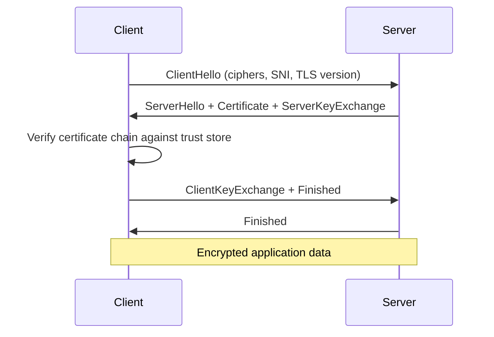
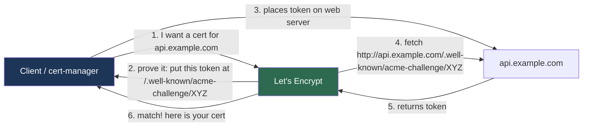
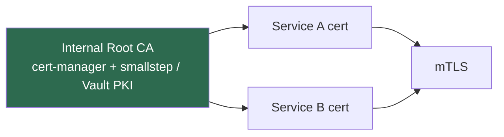

# 11.5.2 DNS, TLS, and Certificates Deep Dive

**Backlinks:** [2.3 DNS & TLS Basics](../../2-Networking/) · [7.3 Nginx SSL](../../7-Nginx/) · [11.1.2 — Auth (mTLS)](../Subchapter_11.1/11.1.2_Authentication_and_Authorization.md)

**Next note:** [11.6.1 — Data Formats and Serialization](../Subchapter_11.6/11.6.1_Data_Formats_and_Serialization.md)

---

## Why This Note Exists

Module 2 taught you the basics: what DNS is, what TLS is. This note is the **operational depth**:

- How Let's Encrypt actually gives you a cert in 5 seconds
- Why `cert-manager` in K8s is the right default
- How to rotate a cert without downtime
- How SNI, wildcards, and SAN certs differ
- Setting up mTLS between services
- The DNS/TLS postmortem that everyone has had

> **One-line rule:** DNS and TLS break at 3am. Know them cold.

---

## Part 1: DNS Refresher — The Five Records That Matter

| Record | Purpose | Example |
|---|---|---|
| `A` | IPv4 address | `api.example.com → 203.0.113.1` |
| `AAAA` | IPv6 address | `api.example.com → 2001:db8::1` |
| `CNAME` | Alias for another name | `www → example.com` |
| `MX` | Mail server | `example.com → 10 mail.example.com` |
| `TXT` | Arbitrary text (SPF, DKIM, verification) | `v=spf1 include:_spf.google.com -all` |

And three more you'll meet:

| Record | Purpose |
|---|---|
| `SRV` | Service discovery (`_http._tcp.example.com`) |
| `NS` | Name servers authoritative for this zone |
| `CAA` | Which CAs are allowed to issue certs for this domain |

### 1.1 TTLs — the trap during migration

Every DNS record has a **TTL** (time to live). A TTL of 3600 means resolvers cache it for 1 hour.

**The migration gotcha:**

```
Day 0: TTL = 3600s, you're about to change IPs
Day 0, 12:00: you change the record
Day 0, 13:00: you expect all traffic on new IP
Day 0, 13:00: a resolver that fetched at 11:59 still has old IP until 12:59
```

**Playbook:** drop TTL to 60s **a day before** the change. Change the record. Wait until TTL×2 before you're sure. Then raise back to 3600s.

### 1.2 Debugging DNS — your four commands

```bash
dig api.example.com A +short              # just the answer
dig api.example.com @8.8.8.8              # ask specific resolver
dig api.example.com +trace                # walk the hierarchy
dig -x 203.0.113.1                        # reverse lookup

# or the nslookup equivalents
# or httpie-style: curl --resolve api.example.com:443:203.0.113.1 https://api.example.com/
```

**Always test from multiple resolvers.** Your ISP's cache isn't Google's isn't Cloudflare's.

---

## Part 2: TLS in 5 Minutes

TLS does three things:

1. **Authenticates the server** (you know you reached the real google.com).
2. **Encrypts in flight** (nobody reads your traffic).
3. **Integrity** (nobody modifies your traffic).

### 2.1 The handshake (simplified)



TLS 1.3 compresses this into 1 round trip. TLS 1.2 takes 2. **Disable everything older than TLS 1.2.**

### 2.2 What a certificate actually is

A cert is an X.509 document signed by a Certificate Authority. It binds:

- A **public key**
- A **subject** (`CN=api.example.com`, or more commonly nowadays the **SAN** extension with multiple names)
- Validity period
- Issuer (the CA)
- A signature from the CA's private key

Your browser trusts the cert only if:
- The chain traces back to a CA in the browser's root store
- All certs in the chain are valid and unexpired
- The hostname matches the SAN
- Not revoked (checked via OCSP or CRL)

### 2.3 SNI — serving many sites on one IP

Before SNI, one TLS server = one domain. SNI lets the client say "I'm trying to reach `api.example.com`" in the `ClientHello`, so the server picks the right cert.

```
# Test which cert is served for a given SNI
openssl s_client -connect 10.0.0.1:443 -servername api.example.com
```

> **Why this matters:** load balancers and ingress controllers use SNI to route traffic to different backends.

---

## Part 3: Getting Certs — Let's Encrypt and ACME

Paid certs are obsolete for 99% of use cases. Let's Encrypt issues **free, 90-day** certs via the **ACME protocol**.

### 3.1 How ACME proves you own the domain



Two main challenge types:

| Challenge | What it checks | When to use |
|---|---|---|
| **HTTP-01** | Can you serve files on port 80? | Most public web servers |
| **DNS-01** | Can you create a TXT record? | Wildcards, non-public endpoints |

**Use DNS-01 for wildcards** (`*.example.com`) — HTTP-01 can't issue wildcards.

### 3.2 Why 90 days is a feature, not a bug

Short-lived certs → **automation is required** → certs always get rotated. A cert that never rotates gets forgotten, leaked, or mismatched. Industry is moving toward even shorter (7 days).

### 3.3 Certbot for VMs

```bash
# Nginx + HTTP-01
certbot --nginx -d api.example.com -d www.api.example.com

# DNS-01 with Route53
certbot certonly --dns-route53 -d "*.example.com" -d "example.com"

# auto-renewal is installed as a systemd timer by default
systemctl list-timers | grep certbot
```

---

## Part 4: cert-manager — TLS in Kubernetes

`cert-manager` is the K8s operator that issues, renews, and distributes certs automatically. If you run K8s, this is not optional.

### 4.1 The CRDs

- **`Issuer` / `ClusterIssuer`** — defines a CA to issue from (Let's Encrypt, internal CA, Vault).
- **`Certificate`** — declares "I want a cert for these domains, store it in this Secret."
- **`CertificateRequest`** — internal, auto-generated.
- **`Order` / `Challenge`** — ACME-internal machinery.

### 4.2 A complete example

```yaml
# 1. ClusterIssuer — ONE per cluster, reusable
apiVersion: cert-manager.io/v1
kind: ClusterIssuer
metadata:
  name: letsencrypt-prod
spec:
  acme:
    server: https://acme-v02.api.letsencrypt.org/directory
    email: ops@example.com
    privateKeySecretRef:
      name: letsencrypt-prod-key
    solvers:
      - http01:
          ingress:
            class: nginx
---
# 2. Certificate — requested by any app
apiVersion: cert-manager.io/v1
kind: Certificate
metadata:
  name: api-tls
  namespace: prod
spec:
  secretName: api-tls-secret      # cert-manager creates this Secret
  issuerRef:
    name: letsencrypt-prod
    kind: ClusterIssuer
  dnsNames:
    - api.example.com
---
# 3. Ingress — mounts the Secret
apiVersion: networking.k8s.io/v1
kind: Ingress
metadata:
  name: api
  namespace: prod
spec:
  tls:
    - hosts: [api.example.com]
      secretName: api-tls-secret
  rules:
    - host: api.example.com
      http:
        paths:
          - path: /
            pathType: Prefix
            backend: { service: { name: api, port: { number: 80 } } }
```

cert-manager:
1. Watches `Certificate` resources.
2. Requests an ACME challenge.
3. Creates a temporary Ingress for HTTP-01.
4. Gets the cert.
5. Stores it in the `Secret`.
6. Renews 30 days before expiry, automatically.

### 4.3 Wildcard with DNS-01 (Route53 example)

```yaml
apiVersion: cert-manager.io/v1
kind: ClusterIssuer
metadata:
  name: letsencrypt-wildcard
spec:
  acme:
    email: ops@example.com
    server: https://acme-v02.api.letsencrypt.org/directory
    privateKeySecretRef:
      name: letsencrypt-wildcard-key
    solvers:
      - dns01:
          route53:
            region: us-east-1
            role: arn:aws:iam::123456789012:role/cert-manager-dns
```

Then a `Certificate` with `dnsNames: ["*.example.com", "example.com"]` — cert-manager handles the TXT record dance via IAM.

---

## Part 5: Cert Rotation Without Downtime

The failure pattern: cert expires at midnight, service breaks, pager goes off.

**The fix is cultural, not technical:**

1. **Monitor cert expiry** — alert ≥ 14 days before expiry.
2. **Automate renewal** — cert-manager / certbot timers.
3. **Reload, don't restart.** Nginx: `nginx -s reload` rereads certs without dropping connections. Most ingress controllers do this natively.
4. **Test the renewal path in staging** — don't wait for the first prod renewal to discover a misconfigured solver.

### Prometheus alert

```promql
# Alert if any cert expires within 14 days
probe_ssl_earliest_cert_expiry - time() < 14 * 24 * 3600
```

Pair with the `blackbox_exporter` to scrape your endpoints.

---

## Part 6: Internal CA and mTLS

For service-to-service inside your cluster, public CAs are overkill (and can't issue for internal-only DNS). Run your own CA.

### 6.1 The setup



### 6.2 cert-manager with an internal issuer

```yaml
apiVersion: cert-manager.io/v1
kind: Issuer
metadata:
  name: internal-ca
  namespace: prod
spec:
  ca:
    secretName: root-ca-key-pair      # you provisioned this once
---
apiVersion: cert-manager.io/v1
kind: Certificate
metadata:
  name: payments-mtls
  namespace: prod
spec:
  secretName: payments-mtls
  issuerRef:
    name: internal-ca
    kind: Issuer
  commonName: payments.prod.svc.cluster.local
  dnsNames:
    - payments.prod.svc.cluster.local
  usages: [server auth, client auth]   # both roles for mTLS
```

### 6.3 Service mesh does this for you

Istio / Linkerd / Consul Connect auto-issue mTLS certs to every pod, auto-rotate every hour, auto-verify. If you want mTLS across hundreds of services, **use a mesh**, don't hand-roll.

---

## Part 7: Common DNS/TLS Postmortems

### 7.1 "The cert didn't renew"

**Causes:**
- ACME HTTP-01 challenge blocked by a firewall / WAF
- DNS-01 IAM role misconfigured after a Terraform change
- Account rate limit hit (Let's Encrypt: 50 certs/week/domain)
- cert-manager upgrade broke solver config

**Fix:** alert on cert age, test in staging, don't wait for the expiry to find out.

### 7.2 "It works on curl but not the browser"

**Causes:**
- Missing intermediate certs in the chain (`openssl s_client -connect host:443 -showcerts`)
- SNI mismatch (curl passes SNI automatically; custom clients might not)
- Root CA trusted by the OS but not by the browser (Java, mobile, etc.)

### 7.3 "Users in region X can't resolve us"

**Causes:**
- Geo-split DNS misconfigured
- Stale TTL cache on an ISP resolver
- IPv6 `AAAA` record pointing at something that doesn't work
- DNSSEC misconfig

### 7.4 "Traffic went to the wrong backend after we added a new domain"

**Causes:**
- SNI routing rules ambiguous (wildcard vs specific, which wins?)
- Ingress controller doesn't support SNI at all, just uses the first cert

---

## Part 8: Testing TLS

### 8.1 From the command line

```bash
# Show the full chain
openssl s_client -connect api.example.com:443 -servername api.example.com -showcerts

# Check expiry
echo | openssl s_client -connect api.example.com:443 -servername api.example.com 2>/dev/null | \
  openssl x509 -noout -dates

# Check what ciphers are offered
nmap --script ssl-enum-ciphers -p 443 api.example.com

# curl with SNI override (testing before DNS cutover)
curl --resolve api.example.com:443:203.0.113.1 https://api.example.com/
```

### 8.2 Online scanners

- **SSL Labs** (`ssllabs.com/ssltest/`) — the gold standard. Aim for A or A+.
- **Hardenize** — broader checks (DNSSEC, CAA, MTA-STS).

---

## Part 9: Hardening Defaults

Your load balancer / nginx / ingress config should:

- **TLS 1.2 minimum**, TLS 1.3 preferred. Disable TLS 1.0, 1.1.
- **Forward secrecy** ciphers only (ECDHE-*).
- **HSTS** (`Strict-Transport-Security: max-age=63072000; includeSubDomains; preload`) after confirming all subdomains use HTTPS.
- **OCSP stapling** — server provides revocation status so the client doesn't have to call the CA.
- **Disable renegotiation**.
- **CAA DNS records** limiting which CAs can issue for your domain:
  ```
  example.com. CAA 0 issue "letsencrypt.org"
  example.com. CAA 0 issuewild "letsencrypt.org"
  example.com. CAA 0 iodef "mailto:security@example.com"
  ```

A modern nginx TLS config:

```nginx
ssl_protocols TLSv1.2 TLSv1.3;
ssl_ciphers ECDHE-ECDSA-AES128-GCM-SHA256:ECDHE-RSA-AES128-GCM-SHA256:ECDHE-ECDSA-AES256-GCM-SHA384:ECDHE-RSA-AES256-GCM-SHA384;
ssl_prefer_server_ciphers off;           # let client pick in TLS 1.3
ssl_session_cache shared:SSL:10m;
ssl_session_tickets off;
ssl_stapling on;
ssl_stapling_verify on;
add_header Strict-Transport-Security "max-age=63072000; includeSubDomains; preload" always;
```

---

## Part 10: Common Footguns

1. **TTL = 86400 during a migration.** You can't fix mistakes for a day.
2. **Self-signed certs in prod** for "just this service." The one time it's OK: internal mTLS with your own CA; otherwise, don't.
3. **No cert monitoring.** Expiry hits, outage begins.
4. **Chain missing intermediates.** Browsers handle it with fetches, but curl and mobile apps often don't.
5. **Using the CommonName field only.** Modern clients require SAN.
6. **Not setting a CAA record.** Any CA can issue for your domain.
7. **Wildcards for everything.** Exposes every subdomain to the same cert's compromise blast radius.
8. **HSTS preload without homework.** Once submitted, unpreload takes months. Test first.
9. **Manual cert rotation.** You will forget.
10. **DNS provider compromise.** Harden access with MFA + hardware keys.
11. **Mixing public and internal DNS** — nothing stops `api.internal` from leaking to public resolvers via logs.
12. **Blindly trusting a cert because it "has a lock icon"** — check the actual chain and name.

---

## Part 11: Platform Engineer's Checklist

- [ ] cert-manager deployed with at least one working ClusterIssuer
- [ ] HTTP-01 AND DNS-01 solvers configured (for wildcards when needed)
- [ ] All Ingresses use `cert-manager.io/cluster-issuer` annotation
- [ ] Cert expiry alerting (< 14 days) — paged
- [ ] Monthly cert-renewal dashboard review
- [ ] TLS 1.2 minimum enforced, old ciphers disabled
- [ ] HSTS enabled (after validating subdomains)
- [ ] CAA DNS records set
- [ ] DNS provider has MFA + audit log enabled
- [ ] Staging cluster uses Let's Encrypt **staging** endpoint (different rate limits)
- [ ] Runbook for: cert didn't renew, DNS outage, TLS errors ([11.6.2](../Subchapter_11.6/11.6.2_Incident_Response_and_On_Call.md))
- [ ] Internal CA documented, rotation plan exists
- [ ] Service mesh (Istio/Linkerd) for mTLS if inter-service count > 20

---

## Recap

- DNS changes propagate at the speed of TTL. Lower it before migrations.
- **Let's Encrypt + cert-manager** = free, automated, always-current TLS.
- **HTTP-01 for most, DNS-01 for wildcards.**
- **Renew via reload, not restart.** Don't drop connections.
- **Service mesh** for mTLS between many services; cert-manager for the ingress edge.
- Monitor cert age. Monitor DNS resolution. Both break silently.

Next: [11.6.1 — Data Formats and Serialization](../Subchapter_11.6/11.6.1_Data_Formats_and_Serialization.md) — JSON, YAML, Protobuf, and the pitfalls that wreck interoperability.
