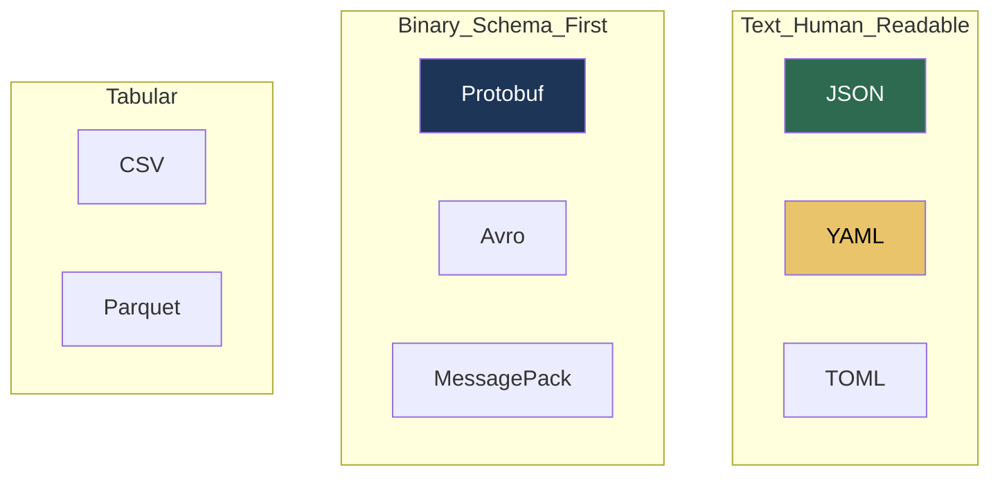
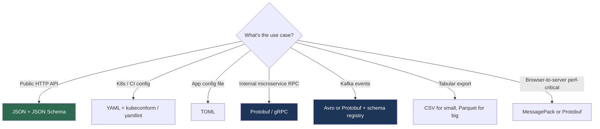

# 11.6.1 Data Formats and Serialization

**Backlinks:** [11.1.1 — HTTP and REST](../Subchapter_11.1/11.1.1_HTTP_and_REST_API_Design.md) · [5.2 K8s YAML Manifests](../../5-Kubernetes/) · [9.3.2 JSON in Python](../../9-Python/Subchapter_9.3/)

**Next note:** [11.6.2 — Incident Response and On-Call](11.6.2_Incident_Response_and_On_Call.md)

---

## Why This Note Exists

Every tool you touch reads or writes data in one of a handful of formats:

- JSON — HTTP APIs, logs, config
- YAML — Kubernetes, CI pipelines, IaC config
- TOML — Rust config, Python `pyproject.toml`
- Protobuf / Avro — gRPC, Kafka, high-throughput services
- CSV — exports, data science, the format everyone loves to hate

Each has **specific pitfalls that will ruin your week** if you don't know them. This note covers those pitfalls and how to pick the right format.

> **One-line rule:** the format you pick is the contract. Versioning it matters as much as versioning your code.

---

## Part 1: Format Family Overview



### Quick comparison

| Format | Human-readable | Schema | Size | Speed | Best for |
|---|---|---|---|---|---|
| JSON | ✅ | optional | medium | medium | APIs, logs |
| YAML | ✅ | optional | medium | slow | config files |
| TOML | ✅ | optional | medium | fast | config files |
| Protobuf | ❌ | required | tiny | fast | gRPC, Kafka |
| Avro | ❌ | required | tiny | fast | Kafka, big data |
| MessagePack | ❌ | optional | small | fast | binary JSON |
| CSV | ✅ | none | medium | fast | tabular export |
| Parquet | ❌ | required | tiny | fast | columnar analytics |

---

## Part 2: JSON — The Lingua Franca

### 2.1 What it is

```json
{
  "id": 42,
  "name": "Ada Lovelace",
  "active": true,
  "created_at": "2025-04-24T12:34:56Z",
  "tags": ["math", "programming"],
  "address": null
}
```

Six types: **object, array, string, number, boolean, null**. That's it.

### 2.2 JSON pitfalls

**Numbers.** JSON doesn't distinguish int from float. JavaScript represents everything as `double`, so numbers above 2^53 lose precision:

```json
{"id": 12345678901234567890}   → parses to 12345678901234568000 in JS
```

**Fix:** send large integers as strings: `"id": "12345678901234567890"`.

**No dates.** Use ISO 8601 strings (`2025-04-24T12:34:56Z`). Never raw Unix seconds in a field named `date`.

**Duplicate keys.** Valid JSON, but parsers disagree on which wins:

```json
{"id": 1, "id": 2}
```

**Fix:** never emit duplicates. Some parsers take first, some last. This has caused production bugs.

**No comments.** Teams work around it with `"_comment": "..."` keys. Hack, but fine.

**Trailing commas.** Not allowed in JSON. JSON5 and JSONC allow them; don't mix.

### 2.3 When JSON is the right tool

- HTTP REST APIs — default
- Application logs — because everything parses JSON
- Config where you don't need comments
- Anywhere schema is loose or evolving

### 2.4 Validating JSON with a schema

**JSON Schema** lets you enforce structure:

```json
{
  "$schema": "https://json-schema.org/draft/2020-12/schema",
  "type": "object",
  "required": ["id", "email"],
  "properties": {
    "id": { "type": "integer", "minimum": 1 },
    "email": { "type": "string", "format": "email" },
    "age": { "type": "integer", "minimum": 0, "maximum": 150 }
  },
  "additionalProperties": false
}
```

Validators: `jsonschema` (Python), `ajv` (JS), `gojsonschema` (Go).

---

## Part 3: YAML — The Format That Hates You

### 3.1 What it is

YAML is "JSON with fewer characters and more rules":

```yaml
name: Ada Lovelace
active: true
tags:
  - math
  - programming
address:
  city: London
  postal: "N1 9GU"
```

### 3.2 The YAML pitfalls that will bite you

**The Norway problem.** In YAML 1.1, these are all booleans:

```yaml
country: NO       # → false !!
enabled: yes      # → true
feature: on       # → true
```

Norway's ISO code `NO` becomes `false`. The fix: quote strings that look like booleans, or use YAML 1.2 (most modern parsers).

**Leading zeros.** `version: 012` → parsed as octal (10) in YAML 1.1.

**Indentation matters, and tabs aren't allowed.** YAML requires spaces. One tab and the parser explodes at line 500 with a message pointing at line 10.

**Merge keys and anchors** (advanced):

```yaml
defaults: &defaults
  timeout: 30
  retries: 3

prod:
  <<: *defaults              # inherit defaults
  region: us-east-1
```

Useful, but confusing when you're debugging at 3am.

**Multi-doc files:**

```yaml
---
kind: Deployment
...
---
kind: Service
...
```

Some parsers only read the first doc unless you explicitly iterate.

**No standard schema story.** People use JSON Schema against YAML because YAML is JSON's ugly cousin.

### 3.3 Rules to survive YAML

1. **Always quote strings** that could be misread: booleans-looking, numbers, dates, version strings.
2. **Use YAML 1.2** parsers (`ruamel.yaml` in Python, libraries post-2020 elsewhere).
3. **Use a linter** (`yamllint`).
4. **Schema-validate YAML** with JSON Schema (`kubeconform` for K8s).
5. Never accept YAML input from untrusted sources without a schema.

### 3.4 Why YAML for config

Despite the warts, YAML won the config file war because:

- Comments supported
- Less punctuation than JSON
- Multiline strings are pleasant
- Readable diffs in PRs

If you're writing new config formats today, **TOML** is a better choice for non-hierarchical config.

---

## Part 4: TOML — The Sane Config Format

```toml
title = "My App"

[database]
host = "localhost"
port = 5432
ssl = true

[[servers]]
name = "web1"
ip   = "10.0.0.1"

[[servers]]
name = "web2"
ip   = "10.0.0.2"
```

**Pros:**
- Unambiguous (no Norway problem)
- Native date/time support
- Designed for human-authored config
- One spec, widely adopted

**Cons:**
- Deeply nested structures get awkward (`[servers.web1.auth.creds]` everywhere)
- Less common outside the Rust/Python ecosystems

**Use TOML for:** application config files, `pyproject.toml`, simple-to-medium nesting.
**Don't use TOML for:** APIs, deeply nested data.

---

## Part 5: Protobuf — The Schema-First Binary Format

### 5.1 Why bother with binary?

JSON is fine at ~1000 req/s. At 100k req/s, you feel the parsing cost and the bandwidth cost.

**Protobuf** (Protocol Buffers) uses a schema and generates code, trading human-readability for 5-10× speed and ~3-10× size reduction.

### 5.2 The schema

```protobuf
// orders.proto
syntax = "proto3";

message Order {
  int64  id         = 1;
  string user_id    = 2;
  double amount     = 3;
  Status status     = 4;
  google.protobuf.Timestamp created_at = 5;

  enum Status {
    PENDING  = 0;
    PAID     = 1;
    SHIPPED  = 2;
    CANCELED = 3;
  }
}
```

Compile to language bindings:

```bash
protoc --python_out=. --go_out=. orders.proto
```

Now you have typed classes/structs in every language.

### 5.3 Schema evolution rules (critical)

Protobuf is designed to evolve **backward-compatibly**. The rules:

- ✅ **Add new fields** — old code ignores unknown fields.
- ✅ **Rename fields** (the number matters, not the name).
- ❌ **Never reuse a field number** — old data will be misparsed.
- ❌ **Never change a field type** incompatibly (int to string = broken).
- ✅ **Remove a field** → mark the number reserved: `reserved 5;`

Violate these and you corrupt data silently. Enterprises use schema registries (Confluent Schema Registry) to enforce.

### 5.4 When to use Protobuf

- **gRPC services** — mandatory
- **High-throughput Kafka streams** — common
- **Cross-language schemas that evolve over years**
- **Anywhere JSON parsing is the bottleneck**

### 5.5 When not to

- Public-facing HTTP APIs — JSON wins on debuggability
- Simple scripts — overhead of codegen isn't worth it
- Small teams / slow services

---

## Part 6: Avro — Protobuf's Kafka Cousin

Avro is schema-first like Protobuf, but:

- The **schema ships with the data** (or via schema registry)
- Richer default-handling and union types
- Dominant in the Kafka / Hadoop ecosystem

In practice: **Avro for Kafka data pipelines, Protobuf for RPC.**

---

## Part 7: MessagePack — JSON's Binary Twin

Looks like JSON, acts like JSON, but binary:

```python
import msgpack
packed = msgpack.packb({"id": 42, "name": "Ada"})
# ~20% the size of JSON, parse ~3× faster
```

No schema, same flexibility as JSON. Good when you control both ends and want speed without the schema overhead.

---

## Part 8: CSV — The Trap

Looks simple. Isn't.

```csv
id,name,email
1,Ada,ada@example.com
2,"Alan, Jr.",alan@example.com
```

**Pitfalls:**

- **Quoting** — commas inside fields need quoting; quotes inside fields need escaping as `""`. Every hand-rolled CSV writer gets this wrong.
- **Line endings** — Windows uses CRLF, Unix uses LF. Excel insists on CRLF.
- **Character encoding** — UTF-8 sometimes, Latin-1 sometimes, UTF-16 if Excel saves it.
- **Headers optional** — no way for a parser to know.
- **Type inference** — `0014` as string or integer? Depends on parser.
- **Leading zeros and long numbers** become scientific notation in Excel (`1234567890123` → `1.23E+12`).
- **BOM** (byte-order mark) prepended by Excel, breaks naive parsers.

**Rule:** always use a library (`csv` module in Python, `papaparse` in JS). Never split by comma.

### When CSV is still right

- Analysts open things in Excel
- Data science pipelines
- Bulk export/import

### When to prefer Parquet

For data analytics at scale, **Parquet** (columnar, compressed, schema-aware) is much better: 10× smaller, 10× faster queries. Same tools (pandas, Spark) read both.

---

## Part 9: Versioning Your Schema

Any format that persists beyond one process — **must** be versioned.

### 9.1 Explicit version field

```json
{
  "schema_version": 2,
  "id": 42,
  "name": "Ada"
}
```

Consumers check the version and adapt. Simple, works everywhere.

### 9.2 Schema registry (Kafka / Avro / Protobuf)

A centralized service storing every version of every schema. Producers register, consumers look up, compatibility enforced.

Tools: **Confluent Schema Registry**, **Apicurio**.

### 9.3 Evolution compatibility levels

| Mode | Producer changes | Consumer changes |
|---|---|---|
| Backward | ✅ can upgrade first | need new consumers to read new data |
| Forward | need new producers to write old format | ✅ can upgrade first |
| Full | both work on each other's messages | ideal |
| None | ship carefully | — |

**Recommend:** Full compatibility for long-lived events; Backward for internal APIs.

---

## Part 10: Validation at the Boundary

**Rule:** validate inputs at every trust boundary, not once in the middle.

```python
# At HTTP endpoint — validate BEFORE processing
from pydantic import BaseModel, EmailStr, Field

class CreateUser(BaseModel):
    email: EmailStr
    age: int = Field(ge=0, le=150)
    name: str = Field(min_length=1, max_length=200)

@app.post("/users")
def create(payload: CreateUser):    # FastAPI validates automatically
    # payload is guaranteed valid here
    ...
```

Libraries:
- **Python:** Pydantic, marshmallow, attrs + validators
- **Go:** validator tag, ozzo-validation
- **JS/TS:** Zod, Joi, Yup
- **Java:** Bean Validation

Without validation, injection attacks, bad data, and silent corruption creep in.

---

## Part 11: Choosing the Right Format



---

## Part 12: Common Footguns

1. **Parsing untrusted YAML with `yaml.load`.** Python's `yaml.load` (not `safe_load`) executes arbitrary code. Use `safe_load`.
2. **Big JSON numbers silently truncated** in JavaScript. Send as strings.
3. **YAML without schema validation.** K8s manifest accepts typos silently; use `kubeconform`.
4. **CSV parsed with `line.split(',')`.** Breaks on quoted commas. Always use a CSV library.
5. **Protobuf field number reuse.** Corrupts data silently.
6. **No versioning.** Day 1 you can change the schema freely; day 100 you have 500 producers.
7. **Trusting client-side format validation.** Validate server-side too.
8. **Logging unparsed input on error.** Logs fill with giant payloads, PII, and secrets.
9. **Deep recursion in JSON/YAML input** → DoS via stack overflow. Set max depth.
10. **`json.dumps(datetime.now())` fails.** Datetime isn't JSON-serializable; use `default=str` or ISO-format it.

---

## Part 13: Platform Engineer's Checklist

- [ ] Every public API has JSON Schema or OpenAPI spec in source
- [ ] Every YAML input is schema-validated at load time
- [ ] `yaml.safe_load` only (never `yaml.load`)
- [ ] All timestamps are ISO 8601 UTC (`Z` suffix)
- [ ] All IDs > 2^53 sent as strings in JSON
- [ ] Schema versioning strategy documented and enforced
- [ ] Protobuf / Avro schemas in a registry, compatibility checks in CI
- [ ] CSV parsed and written with a library, not `split`
- [ ] Input size limits at proxy (prevents DoS)
- [ ] Error responses follow RFC 7807 ([11.1.1](../Subchapter_11.1/11.1.1_HTTP_and_REST_API_Design.md))

---

## Recap

- **JSON** for APIs; watch for big numbers, missing dates, duplicate keys.
- **YAML** for config; quote your strings, validate with a schema.
- **TOML** when you want config without surprises.
- **Protobuf** for RPC, **Avro** for Kafka — both schema-first, both evolve carefully.
- **Always version** and **always validate at the boundary**.

Next: [11.6.2 — Incident Response and On-Call](11.6.2_Incident_Response_and_On_Call.md) — the final note of the playbook, on how to handle outages like a professional.
